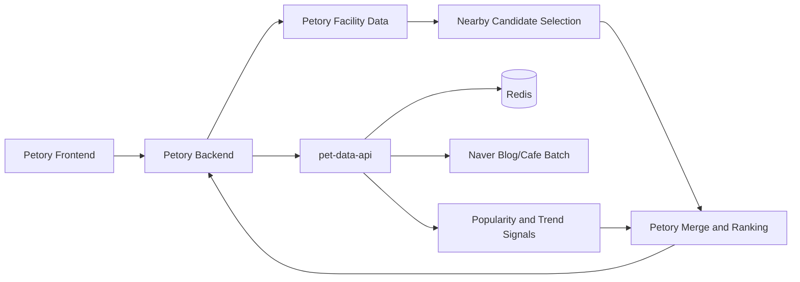

# codex-petory-nearby-recommendation-integration

작성일: 2026-05-24  
대상: `pet-data-api`, `Petory`

---

## 1. 이 문서의 결론

새 추천 서버를 추가하지 않고도 정리는 가능하다.

대신 책임을 다시 자르면 된다.

- `pet-data-api`는 계속 **외부 시그널 수집 + Redis 서빙**만 담당한다.
- `Petory`는 계속 **구조화된 nearby 후보 조회 + 사용자 컨텍스트 반영 + 최종 조합**을 담당한다.
- 블로그/카페 데이터는 **후보 생성용 원장 데이터**가 아니라 **후보 보정용 인기 시그널**로만 쓴다.

지금 막히는 가장 큰 이유는, 비정형 데이터에서 시설 후보까지 만들려 한 점이다.  
이 문제를 풀지 못하면 서버를 하나 더 늘려도 동일한 문제가 반복된다.

---

## 2. 현재 상태 요약

### 2.1 `pet-data-api`

현재 `pet-data-api`의 공식 역할은 이미 `Popularity Intelligence API`에 가깝다.

- `GET /popular/{context}`
- `GET /trends/{category}`
- 배치가 네이버 블로그/카페 데이터를 모아 Redis에 적재
- API 라우터는 Redis 조회만 수행

관련 문서:

- `docs/superpowers/specs/2026-05-23-popularity-intelligence-redesign.md`
- `docs/PETORY-INTEGRATION.md`

현재 배치 파이프는 다음 두 갈래다.

1. 트렌드 키워드
2. 인기 상호

특히 인기 상호 파이프는 다음 로직을 갖는다.

1. 블로그/카페에서 상호명 추출
2. freshness 기반 score 계산
3. 일부 context는 Naver Local로 주소/좌표 보강
4. `popular:{context}` 저장

코드 기준:

- `app/ingestion/runner.py`
- `app/ingestion/blog.py`
- `app/ingestion/location.py`
- `app/ingestion/local_discovery.py`

### 2.2 `Petory`

Petory는 아직 `/api/recommend`라는 레거시 진입점을 유지하지만, 실제 외부 호출은 이미 `POST /recommend`가 아니라 `GET /popular`, `GET /trends` 조합으로 바뀌어 있다.

확인한 코드:

- `backend/main/java/com/linkup/Petory/domain/recommendation/client/PetDataApiClient.java`
- `backend/main/java/com/linkup/Petory/domain/recommendation/service/RecommendService.java`
- `backend/main/java/com/linkup/Petory/domain/recommendation/controller/RecommendController.java`
- `frontend/src/api/recommendApi.js`

즉, 현재 Petory는 외부 추천 엔진을 부르는 구조가 아니라, `pet-data-api`가 내려주는 popularity/trend 스냅샷을 받아 **레거시 추천 응답 DTO로 재조립**하는 상태다.

추가로 확인한 사실이 하나 있다.

- Petory에는 이미 `lat/lng` 기반 반경 검색 서비스와 repository 쿼리가 존재한다.
- 즉 "geospatial 쿼리를 새로 만들어야 하느냐"는 질문에는, **기본 기능은 이미 있다**가 맞다.
- `SpringDataJpaLocationServiceRepository.findByRadius(...)`는 `ST_Within + ST_Distance_Sphere` 기반 반경 검색을 이미 구현하고 있다.
- 반면 `FacilitySyncService`가 기대하는 `pet-data-api /facilities` 경로는 현재 없다.
- 즉 Petory가 `pet-data-api`에서 시설 마스터를 받아오는 레거시 동기화 경로는 **사실상 끊겨 있다**.

다만 이것은 **후보 저장소 커버리지가 충분하다**는 뜻이 아니다.  
쿼리 기능이 있다는 것과, `boarding/hotel`까지 채울 정도로 데이터가 있다는 것은 별개의 문제다.

---

## 3. 지금 설계가 막히는 이유

문제의 핵심은 서버 수가 아니다.  
문제는 **데이터 종류가 다른데도 하나의 수집 방식으로 처리하려 한 것**이다.

### 3.1 시설 마스터와 인기 시그널이 섞여 있다

추천에서 필요한 데이터는 성격이 다르다.

1. **시설 마스터**
2. **인기/트렌드 시그널**
3. **사용자/펫 컨텍스트**
4. **행동 이벤트**

이 중에서 블로그/카페가 잘하는 것은 2번이다.  
그런데 현재 일부 파이프는 1번까지 대신하려고 한다.

예:

- 상호명 regex 추출 후 Naver Local로 주소/좌표 보강
- `boarding`, `hotel`은 Local 검색으로 상호명을 먼저 발굴한 뒤 블로그로 검증

이 방식은 단기적으로는 그럴듯하지만, 장기적으로는 아래 문제가 생긴다.

- 상호명 추출 품질이 조금만 흔들려도 시설 후보 자체가 무너짐
- 체인점/동일 상호/지역명 혼입에 취약
- 지역성, 폐업 상태, 운영 시간, Petory 내부 속성을 안정적으로 가질 수 없음
- blocklist와 regex가 계속 비대해짐

### 3.2 `pet-data-api`가 사실상 "불안정한 장소 원장" 역할을 일부 떠안고 있다

`app/ingestion/location.py`는 인기 결과에 위치를 붙이고,  
`app/ingestion/local_discovery.py`는 Local API로 후보명을 발견한다.

이건 popularity API가 해야 할 일이라기보다, 작은 장소 수집기나 POI 부트스트랩 워커가 해야 할 일에 가깝다.

하지만 현재 레포의 목표는 그게 아니다.

- `AGENTS.md`: HTTP는 Redis만 조회
- `docs/PETORY-INTEGRATION.md`: PostgreSQL·추천·이벤트 콜백 없음

즉 현재 프로젝트 정의와 실제 배치 책임 사이에 긴장이 있다.

여기서 중요한 점은, 문제가 `boarding/hotel`에만 국한되지 않는다는 것이다.

- `boarding`, `hotel`은 `local_discovery` 파이프를 사용한다.
- 나머지 7개 context는 `blog.py`의 regex 추출 결과에 대해 `enrich_with_location()`이 실행된다.

즉 현재 인기 파이프라인 전체는 다음 두 갈래로 나뉘지만, 둘 다 같은 방향의 구조적 취약점을 가진다.

1. `boarding/hotel`: Local discovery -> Blog verify
2. 그 외 7개 context: Blog regex extract -> Naver Local location enrich

차이는 구현 방식일 뿐이고, 공통 문제는 동일하다.

- 구조화 마스터가 아닌 비정형/검색 API에서 후보를 세운다
- 후보 품질 보정을 위해 후처리 규칙이 계속 늘어난다
- 추천 후보와 popularity 시그널 경계가 흐려진다

### 3.2.1 `blog.py` 자체가 이미 한계 신호를 보인다

문제는 `local_discovery`만이 아니다.  
`blog.py`의 regex 기반 상호명 추출 시스템 자체가 이미 확장 한계 신호를 보이고 있다.

실제 코드에는 아래가 동시에 존재한다.

- context별 suffix/prefix regex 패턴 다수
- 대규모 `_BLOCKLIST_EXACT`
- 대규모 `_BLOCKLIST_CONTAINS`
- 대규모 `_LOCATION_CITY`
- 조사/어미/지명 복합어 방지용 후처리

즉 문서의 표현대로라면 "장기적으로 blocklist와 regex가 비대해질 것"이 아니라,  
**이미 그 상태에 들어왔다**가 더 정확하다.

이건 "패턴을 조금 더 추가하면 해결될 문제"가 아니라,  
상호명 추출 기반 후보 생성 전략 자체가 유지비를 빠르게 키우고 있다는 신호다.

### 3.3 Petory도 아직 "최종 책임자"가 아니다

Petory의 `PetDataApiClient.recommend()`는 외부 `popular/trends`를 받아 `RecommendResponse`로 포장한다.  
하지만 이 과정에서 **주변 시설 후보를 Petory가 책임지는 구조화 저장소에서 먼저 구해 조합하는 구조는 아니다**.

결과적으로 지금 구조는 이렇다.

- `pet-data-api`는 인기 상호를 만든다.
- Petory는 그 결과를 추천처럼 포장한다.
- 하지만 실제 nearby 후보 생성의 canonical source는 아직 명확하지 않다.

그래서 "데이터를 어디서 얻어야 하느냐"가 계속 흔들린다.

더 정확히 말하면, **Petory는 이미 nearby 후보를 뽑을 기술적 수단을 갖고 있는데도, 현재 `RecommendService`는 그 경로를 사용하지 않고 `pet-data-api`에 추천 책임을 사실상 전부 위임하고 있다.**

동시에, Petory의 보조 적재 경로도 안정적이지 않다.

- `FacilitySyncService`는 `pet-data-api /facilities`를 기대한다.
- 하지만 현재 `pet-data-api`는 popularity/trend API로 정리되었고 `/facilities`를 제공하지 않는다.
- 따라서 Petory가 `pet-data-api`를 통해 시설 후보를 보강하겠다는 레거시 가정은 지금 시점에서 성립하지 않는다.

---

## 4. 서버 추가 없이 가려면 책임을 이렇게 자른다

### 4.1 최종 책임 분리

#### `pet-data-api`

담당:

- Naver Blog/Cafe 배치 수집
- 트렌드 키워드 집계
- 컨텍스트별 인기 상호 집계
- Redis 캐시 저장/조회

비담당:

- 주변 시설 반경 검색
- 사용자별 추천 랭킹
- 시설 마스터 정본 관리
- 추천 이벤트 수집/학습 파이프

#### `Petory`

담당:

- 사용자 위치 기준 주변 시설 후보 조회
- Petory 내부 카테고리/시설 속성 필터링
- pet profile 반영
- `popular/trends` 호출 후 후보에 가산점 또는 뱃지 부여
- 최종 응답 조립

비담당:

- 외부 블로그/카페 직접 수집

### 4.2 한 줄 원칙

**시설은 구조화 데이터에서 뽑고, 블로그는 점수 보정에만 쓴다.**

이 원칙만 지켜도 현재의 설계 혼선 대부분이 사라진다.

---

## 5. 추천 데이터는 어디서 얻어야 하는가

### 5.1 Nearby 후보 데이터

이 문서의 원래 표현은 "Petory 내부 DB"였지만, 그 표현은 좁다.  
더 정확한 표현은 **Petory가 서빙 책임을 지는 구조화 후보 저장소**다.

이 저장소의 **원천 데이터가 공공데이터여도 괜찮다.**  
중요한 것은 원천의 성격이 아니라, 아래를 만족하느냐이다.

- 좌표와 주소가 구조화되어 있는가
- 카테고리 필터가 가능한가
- 반경 검색이 가능한가
- 중복 제거가 가능한가
- 추천 시점에 빠르게 조회 가능한가

즉 "공공데이터라서 아쉽다"는 감각은 맞지만, 아쉽다는 것과 **추천 후보 저장소로 못 쓴다**는 것은 다른 문제다.

실무적으로 nearby 후보 저장소에 필요한 것은:

1. 원본의 고급스러움
2. 서빙 가능한 구조화 상태

이 둘 중에서는 2번이 더 중요하다.

### 5.2 후보 저장소의 현실적인 선택지

서버를 추가하지 않는 조건에서 선택지는 3개다.

#### Option A. Petory의 기존 `LocationService`를 nearby 후보 저장소로 사용

가장 현실적인 기본안이다.

장점:

- 이미 반경 검색 쿼리와 API가 있음
- 카테고리/지역 필터가 가능함
- 프론트/백엔드 연결점이 이미 존재함

단점:

- 원천이 공공데이터라서 차별화가 약함
- `boarding`, `hotel` 같은 sparse context는 비어 있을 수 있음
- 현재 상태에서 `boarding/hotel`은 **거의 비어 있거나 0건일 가능성**을 우선 가정해야 함

코드 근거:

- `LocationServiceService.searchLocationServicesByLocation(...)`
- `LocationServiceRepository.findByRadius(...)`
- `SpringDataJpaLocationServiceRepository.findByRadius(...)`
- `FacilitySyncService`가 기대하는 `/facilities`는 현재 없음

언제 쓰나:

- `grooming/hospital/pharmacy/cafe/restaurant/pension`처럼 구조화 후보가 어느 정도 확보된 컨텍스트

#### Option B. Petory가 별도 동기화 배치로 "후보 전용 테이블"을 더 키운다

이건 새 서버를 만드는 게 아니라, **Petory 내부 적재 파이프를 강화하는 방식**이다.

예:

- 공공데이터 CSV
- 기존 Petory `LocationService`
- 필요 시 외부 배치 결과 파일

을 Petory 안에서 dedupe/merge해서 추천용 후보군을 만든다.

장점:

- 추천 품질 개선 여지가 큼
- `LocationService` 검색과 추천 후보 저장소를 논리적으로 분리 가능
- `boarding/hotel`처럼 공공데이터에 잘 안 잡히는 업종을 별도 확보할 수 있음

단점:

- 배치/정규화 구현 비용이 증가

언제 쓰나:

- 현재 `LocationService`가 검색용으로는 충분하지만 추천용 후보 품질은 부족한 경우
- 현재처럼 `FacilitySyncService`가 고장 상태라 레거시 외부 동기화에 기대기 어려운 경우

#### Option C. sparse context에 한해 `pet-data-api`의 local discovery를 fallback으로 유지

이건 예외 처리다. 기본 전략이 되어서는 안 된다.

장점:

- `boarding`, `hotel`처럼 Petory 쪽 구조화 후보가 빈약한 영역을 당장 메울 수 있음

단점:

- 비정형 기반 후보 발굴이라 품질 변동성이 큼
- canonical source로 보면 안 됨

언제 쓰나:

- Petory 구조화 후보가 부족한 컨텍스트
- 단기 부트스트랩
- 특히 `boarding/hotel`이 사실상 비어 있는 현재 상태

### 5.3 이 문서의 수정된 권장안

따라서 "Petory 내부 DB에서만 뽑는다"가 아니라 아래가 정확하다.

> **Nearby 후보는 Petory가 책임지는 구조화 저장소에서 먼저 뽑고, 부족한 컨텍스트만 제한적으로 fallback을 둔다.**

우선순위:

1. Petory `LocationService` 등 구조화 저장소
2. Petory 내부 동기화/적재로 보강된 후보 저장소
3. sparse context에 한한 제한적 fallback (`local_discovery`)

중요한 점:

- nearby 추천에서 핵심은 "현재 사용자 위치에서 보여줄 수 있는 시설 목록"이다.
- 이건 검색 반경, 상태, 카테고리, 지역 정책, 내부 운영 기준이 중요하다.
- 블로그 언급량보다 구조화 마스터 품질이 우선이다.
- 다만 `boarding/hotel`은 현재 구조화 저장소가 비어 있을 가능성이 매우 높으므로, **fallback 유지 또는 데이터 적재 보강 중 하나를 먼저 결정해야 한다.**

즉 컨텍스트를 같은 구현 트랙으로 묶으면 안 된다.

- **Track A: 바로 Petory owner 전환 가능한 컨텍스트**
  `grooming`, `hospital`, `pharmacy`, `cafe`, `restaurant`, `pension`
- **Track B: 선행 데이터 결정이 필요한 컨텍스트**
  `boarding`, `hotel`

Track B는 후보 데이터를 어떻게 확보할지 먼저 정해지기 전에는 Track A와 같은 속도로 전환하면 안 된다.

### 5.4 인기 시그널 데이터

이건 `pet-data-api`에서 가져오는 것이 맞다.

현재 `popular:{context}`는 다음 정보를 준다.

- `name`
- `mention_count`
- `avg_freshness`
- `score`
- 일부 context는 주소/좌표 부가정보

여기서 실제로 중요한 것은 `name`, `mention_count`, `score`다.  
좌표/주소는 nearby 후보 생성에 쓰지 않는 편이 안전하다.

### 5.5 트렌드 키워드 데이터

이것도 `pet-data-api`에서 가져오는 것이 맞다.

트렌드 키워드는 다음 용도로 충분하다.

- UI 보조 정보
- 추천 카피 문구
- context 설명
- regional popularity feature의 초기 버전

---

## 6. Petory 기준 권장 조합 방식

### 6.1 현재 `PetDataApiClient.recommend()`의 한계

현재 구현은 `popular` 결과 자체를 `RecommendResponse.facilities`로 매핑한다.

문제:

- distance가 0으로 들어간다
- 실제 nearby 후보가 아니다
- Petory 내부 시설 마스터와 같은 엔티티라는 보장이 없다
- 사용자 위치를 받아도 추천 결과가 위치 기반으로 강하게 제어되지 않는다

이 방식은 "레거시 API 형태 유지"에는 좋지만, nearby 추천 품질을 높이기에는 맞지 않는다.

### 6.2 권장 흐름

`Petory RecommendService` 기준 권장 흐름:

1. `lat/lng/context`로 Petory 구조화 후보 저장소에서 주변 후보를 먼저 조회
2. `pet-data-api /popular/{context}` 호출
3. `pet-data-api /trends/{category}` 호출
4. 후보 목록에 popularity score를 조인
5. 최종 정렬
6. 응답 DTO 조립

현재 코드에서 이 흐름은 아래처럼 대응된다.

현재:

1. `RecommendService.recommend()`
2. `petDataApiClient.recommend(request)` 전부 위임

목표:

1. `LocationServiceRepository.findByRadius(...)` 또는 `LocationServiceService.searchLocationServicesByLocation(...)`로 nearby 후보 조회
2. `PetDataApiClient`에서 `popular`, `trends`만 가져옴
3. 이름 매칭으로 popularity score 주입
4. Petory 서비스 레이어에서 정렬 + 응답 조립

### 6.3 조인 규칙

초기에는 단순하게 시작하되, **이걸 최종안으로 가정하면 안 된다.**

1. 시설명 normalize
2. `popular.name` normalize
3. exact match 우선
4. 필요 시 suffix 제거 매칭 보조

예:

- `해피독 애견미용`
- `해피독`
- `해피독 미용실`

이런 변형을 Petory 쪽 matcher에서 같은 후보로 볼 수 있어야 한다.

단, fuzzy 매칭을 너무 공격적으로 열면 오매칭이 커진다.  
초기에는 exact + 제한적 normalize 정도가 적절하다.

다만 이 전략의 성패는 **조인율 측정** 없이는 판단할 수 없다.

즉 6.3절은 구현 규칙이 아니라, 아래 검증을 통과할 때만 유지 가능한 베이스라인이다.

- 샘플 후보군 대비 popular 조인율
- context별 조인 성공률
- 상위 랭킹 노출 항목 중 popularity 보정이 실제로 붙는 비율

조인율이 낮으면 바로 다음 단계로 넘어가야 한다.

- 업종 suffix 사전
- 체인/지점 표기 normalize
- 지역명 제거 규칙
- 짧은 상호 예외 규칙
- alias 사전

### 6.4 최종 정렬

초기 버전은 룰 기반이면 충분하다.  
다만 **가중치 숫자를 지금 고정하면 안 된다.**

```text
final_score =
  a * distance_score
  b * popularity_score
  c * review_score
  d * pet_profile_match
```

여기서 중요한 점:

- popularity는 보조 신호다
- popularity가 nearby 후보 생성을 대체하면 안 된다
- `a,b,c,d`는 데이터 적합성 검증 후 정한다

즉 이 단계에서는 "무슨 신호를 섞을 것인가"까지만 정하고,  
"각 신호를 몇 퍼센트로 둘 것인가"는 나중 문제로 남겨야 한다.

---

## 7. `pet-data-api`에서 정리해야 할 것

### 7.1 유지할 것

- `GET /popular/{context}`
- `GET /trends/{category}`
- Naver Blog/Cafe 배치
- Redis 서빙 구조

### 7.2 축소하거나 제거할 것

#### A. 위치 보강 의존성 축소

`app/ingestion/location.py`의 역할은 줄이는 편이 좋다.

이유:

- nearby 추천의 좌표 정본은 Petory 쪽 구조화 시설 데이터가 되어야 함
- popularity API의 주소/좌표는 부정확한 부가정보일 가능성이 큼
- 수집 비용 대비 품질 이득이 제한적임

권장:

- `popular` payload에서는 위치 정보를 "참고용 메타데이터"로만 취급
- Petory 조인/랭킹의 필수 입력으로 사용하지 않음

중요:

이 항목은 `boarding/hotel`만의 문제가 아니다.  
현재 `runner.py` 기준으로 `local_discovery`를 쓰지 않는 7개 context에도 모두 적용된다.

즉 이 문서에서 말하는 "위치 보강 의존성 축소"는:

- `boarding/hotel`의 fallback 전략
- 나머지 7개 context의 `enrich_with_location()` 사용 범위

를 함께 다루는 문제다.

#### B. Local discovery 파이프 재검토

`boarding`, `hotel`의 `Local discovery -> Blog verify`는 현재 데이터 부트스트랩 용도로는 이해 가능하다.  
하지만 이걸 계속 canonical source처럼 믿고 가면 이후에도 같은 문제가 남는다.

권장:

- 단기: 유지 가능
- 중기: Petory 내부 시설 데이터 또는 별도 동기화 데이터로 대체

다만 이 항목만 줄여서는 충분하지 않다.  
나머지 7개 context도 여전히 `blog.py`의 regex 추출 시스템에 의존하기 때문이다.

즉 중기적으로 줄여야 하는 것은 둘 다다.

1. `boarding/hotel`의 `local_discovery` 의존
2. 나머지 context의 regex 상호명 추출 + 위치 보강 의존

후자가 남아 있는 한, popularity 파이프라인은 계속 "후보 생성 비슷한 일"을 하게 된다.

#### C. 추천 엔드포인트 환상 제거

현재 문서 기준으로 `pet-data-api`는 recommendation engine이 아니다.  
이 정체성을 더 명확히 유지해야 한다.

즉 앞으로도:

- `POST /recommend` 부활 금지
- 이벤트 적재 경로를 억지로 다시 넣지 않음
- facilities master API를 추천 핵심 경로로 재도입하지 않음

단, 이 항목은 예외가 있다.

Petory가 자체 후보 저장소를 만들기 위한 **배치 동기화용 일회성/관리용 적재 인터페이스**는 별개 문제다.  
그 경우에도 recommendation serving 경로와 분리되어야 한다.

---

## 8. Petory에서 정리해야 할 것

### 8.1 `/api/recommend`의 의미를 바꿔야 한다

프론트에 `/api/recommend`를 유지하는 것은 괜찮다.  
하지만 내부 의미는 다음으로 바뀌어야 한다.

기존 의미:

- 외부 추천 서버 호출 결과를 프록시

권장 의미:

- Petory가 nearby 후보를 직접 계산하고, 외부 popularity/trend 시그널을 섞어 반환

즉 API shape는 유지해도, recommendation ownership은 Petory로 가져와야 한다.

### 8.2 `PetDataApiClient.recommend()`는 과도기 메서드다

현재 메서드는 레거시 호환에는 유용하지만, 목표 구조의 종착점은 아니다.

더 자연스러운 구조는 아래 둘 중 하나다.

1. `PetDataApiClient`는 `fetchPopular`, `fetchTrends`만 담당
2. `RecommendService`가 내부 후보 조회 + 외부 시그널 조합을 담당

즉 조합 책임은 클라이언트가 아니라 서비스 레이어에 있어야 한다.

### 8.3 이벤트는 당장 Petory 내부에만 남겨도 된다

그린필드 문서에서는 이벤트 수집과 feature store가 중요하다.  
하지만 서버를 더 만들지 않을 거라면 당장은 욕심을 줄여야 한다.

우선순위:

1. nearby 후보 생성 정리
2. popularity 조인 정리
3. 클릭/노출 이벤트를 Petory 내부 로그 또는 DB에 적재
4. 이후 필요 시 랭킹 피처로 확장

즉 이벤트 파이프는 2단계 문제다.  
현재 1단계 문제는 후보 데이터 원천과 책임 분리다.

---

## 9. 추천하는 최종 구조



설명:

- 후보 생성은 Petory
- 외부 시그널은 `pet-data-api`
- 최종 조합과 응답 책임은 Petory

이 구조는 서버를 추가하지 않으면서도 현재 혼선을 정리할 수 있는 가장 현실적인 선택이다.

---

## 10. 단계별 실행안

### Phase 0. 먼저 검증할 것

이 문서의 전략은 전제가 하나 있다.

> **Petory가 nearby 후보 저장소 역할을 할 수 있어야 한다.**

이건 추정이 아니라 확인 대상이다.

반드시 먼저 봐야 하는 항목:

1. context별 후보 수
2. lat/lng 완전성
3. 지역 커버리지
4. `popular` 조인율

특히 `boarding`, `hotel`은 별도 체크가 필요하다.  
현재 `pet-data-api`에 `local_discovery` 파이프가 존재하는 사실 자체가, 이 두 컨텍스트의 구조화 후보 부족 가능성을 시사한다.

추가로, 현재는 아래 사실을 전제로 봐야 한다.

- `FacilitySyncService`는 레거시 `/facilities` 경로를 기대한다.
- 하지만 현행 `pet-data-api`에는 해당 경로가 없다.
- 따라서 Petory가 `pet-data-api`를 통해 `boarding/hotel` 후보를 채우는 경로는 현재 동작하지 않는다.

Phase 0 결과에 따라 분기:

- 충분함: Option A 중심 진행
- 일부 부족함: Option A + Option C 하이브리드
- 전반적으로 부족함: Option B를 먼저 추진

중요:

- **Phase 1은 바로 시작 가능하다.**
- **Phase 2의 기술적 전제는 이미 충족되어 있다.**  
  Petory에는 반경 검색 쿼리와 서비스 경로가 이미 있다.
- **남은 핵심 불확실성은 데이터 커버리지다.**  
  특히 `boarding/hotel`이 구조화 후보 저장소에 실제로 얼마나 들어 있는지 확인해야 한다.

즉 이 문서의 실행성은 다음처럼 나뉜다.

- 지금 실행 가능한 것: 역할 정리, API 의미 정리, fallback 명시
- 검증 후에만 실행 가능한 것: `local_discovery` 축소, sparse context fallback 제거

가장 먼저 확인할 쿼리 예시는 아래와 같다.

```sql
SELECT category3, COUNT(*)
FROM locationservice
WHERE is_deleted = 0
GROUP BY category3
ORDER BY COUNT(*) DESC;
```

이 결과를 보면:

- `boarding/hotel` 데이터가 실제로 있는지
- 어느 정도 규모인지
- Phase 2 -> Phase 3 순서를 그대로 갈 수 있는지

를 판단할 수 있다.

현재 문서 시점의 보수적 가정은 다음이다.

- `boarding/hotel`은 Petory 구조화 저장소에 거의 없거나 0건일 가능성이 높다.
- `FacilitySyncService`는 현재 고장 상태이므로 이 공백을 자동으로 메우지 못한다.
- 따라서 `boarding/hotel`은 **fallback 유지** 또는 **데이터 적재 파이프 선보강** 중 하나를 먼저 결정해야 한다.

이 시점에서 구현 트랙도 분리한다.

- Track A: 바로 전환 시도 가능
- Track B: 후보 데이터 확보 방식 결정 전까지 보류

Track B는 아래 중 하나가 정해지기 전에는 구현 Phase로 넘기지 않는다.

1. Petory 내부 적재 파이프를 새로 만든다
2. 외부 파일/수동 적재로 후보를 채운다
3. 당분간 `local_discovery`를 정식 fallback으로 유지한다

### Phase 1. 지금 바로 할 것

- `pet-data-api`를 popularity/trend provider로 고정
- Petory 문서와 코드에서 "외부 추천 엔진" 표현 제거
- Petory `RecommendService`에서 nearby 후보를 자체 조회하도록 리팩터링 설계 시작
- `boarding/hotel`은 fallback 유지 여부를 컨텍스트별로 명시
- 이 단계에서는 `local_discovery`나 `enrich_with_location()`를 먼저 줄이지 않는다

범위:

- Track A는 바로 착수 가능
- Track B는 아직 구현 보류

### Phase 2. Petory 조합 경로 검증

- `PetDataApiClient.recommend()` 의존 축소
- `fetchPopular`, `fetchTrends` 중심으로 역할 축소
- Petory 서비스 레이어에서 조합/정렬 책임 흡수
- 조인율이 낮으면 matcher 규칙 확장

이 단계의 시작 조건:

- Petory 후보 저장소 커버리지 확인 완료
- `boarding/hotel` fallback 필요 여부 결정 완료
- 최소한의 상호명 조인율 측정 완료

이 단계의 목표:

- Petory가 실제로 nearby 후보 + popularity/trend 조합을 감당할 수 있는지 검증
- `boarding/hotel`이 fallback 없이는 비는지 확인
- `popular`가 실제로 조인되어 순위 보정 효과를 내는지 확인

즉 현재 시점에서 Phase 2는 "할 수 있는지 모르는 단계"가 아니라,  
**기술적으로는 바로 구현 가능한데 데이터 커버리지 결과에 따라 범위가 달라지는 단계**다.

단, `boarding/hotel`에 대해서는 예외가 있다.

- 커버리지가 실제로 비어 있으면 Phase 2를 전체 컨텍스트에 일괄 적용하면 안 된다.
- 이 경우 `grooming/hospital/pharmacy/cafe/restaurant/pension`부터 Phase 2를 먼저 적용하고,
- `boarding/hotel`은 Option C 유지 또는 Option B 선행 후 합류시키는 것이 맞다.

즉 실행 원칙은 다음이다.

- Track A부터 먼저 구현
- Track B는 데이터 확보 방식 결정 후 합류

중요:

- **이 단계가 검증되기 전에는 `local_discovery`를 줄이지 않는다.**
- 즉 실행 순서상으로는 "Petory 조합 경로 검증"이 "fallback 축소"보다 먼저다.

### Phase 3. 인기 파이프 축소

- `boarding`, `hotel`의 Local discovery 의존 줄이기
- 7개 context의 `enrich_with_location()` 의존 범위 줄이기
- `blog.py` regex 시스템이 맡던 후보 생성 성격의 책임을 축소
- 필요 시 Petory 내부 후보 적재 파이프 보강
- 지역 단위 `popular` 스냅샷 검토
- 이름 normalize/matcher 정교화

`boarding/hotel`의 fallback 제거는 자동으로 하지 않는다.  
아래 같은 exit condition이 확인될 때만 줄인다.

- 구조화 후보 수가 지역별로 안정적임
- fallback 없이도 빈 결과 비율이 허용 범위 안임
- popularity 조인이 실제로 붙음
- 대체 후보 공급 경로가 실제로 동작 중임

나머지 7개 context의 위치 보강/regex 축소도 같은 기준을 따른다.

- 위치 메타데이터 없이도 Petory 조합이 정상 동작함
- regex 추출 결과가 popularity 시그널로서만 충분함
- 후보 생성 책임이 `pet-data-api`에 다시 스며들지 않음

Track B의 시작 조건은 더 강하다.

- `boarding/hotel` 후보 데이터 확보 방식 결정 완료
- Petory 구조화 저장소에 실제 데이터 존재
- fallback 제거 시 공백이 생기지 않음
- 대체 경로가 운영 가능함

---

## 11. 최종 판단

내가 이 프로젝트를 계속 가져간다면 다음 원칙으로 간다.

1. 서버는 더 추가하지 않는다.
2. `pet-data-api`는 recommendation engine이 아니라 intelligence API로 둔다.
3. nearby 추천의 canonical owner는 Petory의 구조화 저장소로 둔다.
4. 다만 sparse context는 제한적 fallback을 허용한다.
5. 블로그 데이터는 후보 생성이 아니라 후보 보정용으로만 쓴다.

이 판단은 `boarding/hotel`에 대해 다음 전제를 둔다.

- 현재 상태만 놓고 보면 Petory 구조화 저장소 커버리지가 거의 없거나 0건일 가능성이 높다.
- `FacilitySyncService`는 현행 아키텍처에서 동작하지 않는다.
- 따라서 `boarding/hotel`은 당분간 fallback 유지 또는 별도 적재 파이프 보강 없이는 공백이 생긴다.

즉 실무적으로는 다음처럼 나눠서 구현해야 한다.

- 지금 바로 구현: Track A를 Petory owner 모델로 전환
- 먼저 결정 후 구현: Track B의 후보 데이터 확보 방식 확정

이렇게 해야 데이터 획득 문제가 "외부 비정형 데이터로 모든 것을 해결하려는 문제"에서,  
"구조화 마스터 + 보조 시그널 조합 문제"로 바뀐다.

후자는 충분히 통제 가능하다.

---

## 12. 지금 바로 실행할 결정

현 시점의 실무 결정은 다음과 같다.

### 12.1 지금 구현할 범위

Petory owner 전환은 **Track A만 먼저** 진행한다.

- `grooming`
- `hospital`
- `pharmacy`
- 필요 시 `cafe`
- 필요 시 `restaurant`
- 필요 시 `pension`

이 범위에서는 다음을 바로 구현 대상으로 본다.

1. Petory `RecommendService`가 nearby 후보를 직접 조회
2. `PetDataApiClient`는 `popular/trends` 시그널만 가져옴
3. Petory가 최종 조합과 정렬을 수행

### 12.2 지금 유지할 범위

`boarding/hotel`은 당분간 **의도적 예외 처리**로 둔다.

- `pet-data-api`의 `local_discovery` 유지
- Petory owner 전환 대상에서 일단 제외
- fallback이 아니라 현재 유일한 현실적 후보 원천으로 취급

즉 이 둘은 "나중에 정리할 임시 코드"라기보다,  
**현재 데이터 원천 제약 때문에 남겨두는 의도적 운영 예외**다.

### 12.3 나중에 결정할 것

`boarding/hotel`을 Petory owner 모델로 옮기려면 아래 중 하나가 먼저 정해져야 한다.

1. Petory 내부 적재 파이프 보강
2. 수동/반수동 curated 데이터 적재
3. 별도 외부 소스 수집

이 결정 전에는 `boarding/hotel` 전환 작업을 시작하지 않는다.

### 12.4 의미

따라서 이 문서의 실제 실행 순서는 아래와 같다.

1. `pet-data-api`는 지금처럼 유지
2. Petory는 Track A부터 수정
3. `boarding/hotel`은 그대로 둠
4. 별도 데이터 확보 전략이 정해진 뒤에만 Track B 착수
