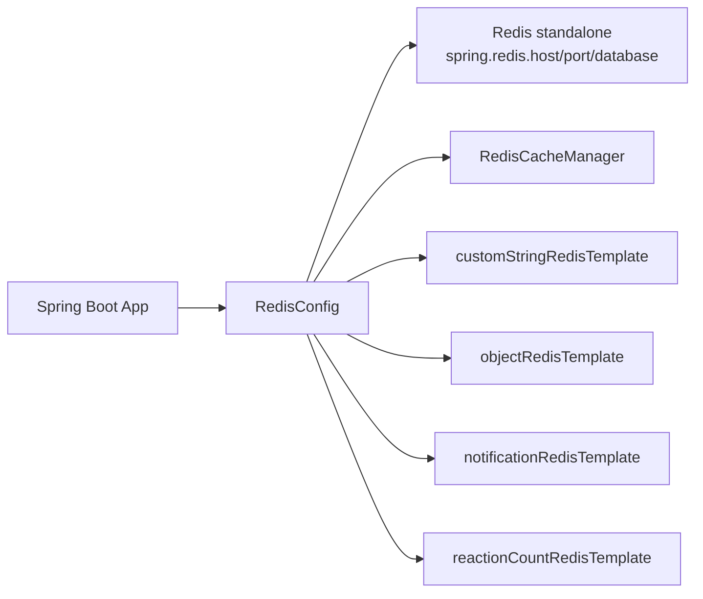
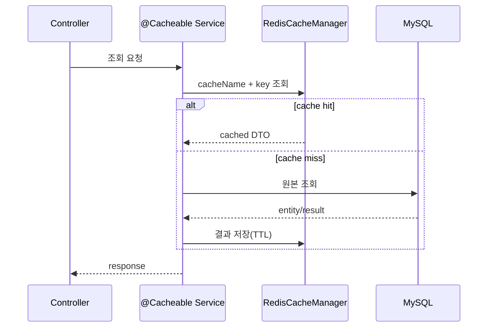
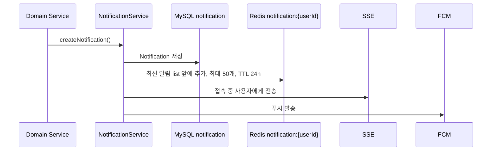
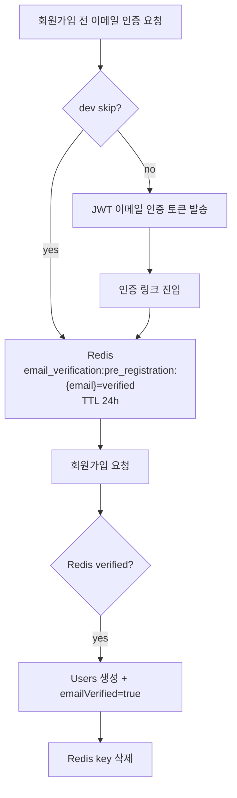

# Redis 캐시 & 임시 데이터 아키텍처

> 기준 코드: `global/security/RedisConfig.java`, `domain/notification`, `domain/user`, `domain/location`, `domain/statistics`, `domain/petRecommendation`, `domain/board`.

Redis는 Petory에서 주 저장소가 아니라 **읽기 캐시, 최신 알림 버퍼, 회원가입 전 인증 상태, 추천 분석 중복 방지**를 담당하는 보조 인프라다. 영속 데이터의 기준은 MySQL이며, Redis에는 TTL이 있거나 재계산 가능한 데이터만 저장한다.

---

## 1. 책임 범위

| 구분 | 현재 사용 | 대표 키/캐시명 | TTL | 주 데이터 소스 |
| --- | --- | --- | --- | --- |
| Spring Cache - 오늘 통계 | 사용 중 | `todayStats::today` | 1분 | `daily_statistics` |
| Spring Cache - 인기 위치 서비스 | 사용 중 | `popularLocationServices::{category}` | 기본 30분 | `location_service` |
| 알림 최신 버퍼 | 사용 중 | `notification:{userId}` | 24시간 | `notification` |
| 회원가입 전 이메일 인증 | 사용 중 | `email_verification:pre_registration:{email}` | 24시간 | Redis 단기 상태 |
| 추천 위치검색 dedup | 사용 중 | `nlp:loc-dedup:{userIdx}:{keyword}` | 10분 | Redis 단기 상태 |
| 게시글 목록/상세 캐시 | 읽기 적재 비활성 | `boardList`, `boardDetail` | 10분/1시간 | `board` |
| 사용자 캐시 | 설정만 존재 | `user` | 1시간 | `users` |
| 반응 카운트 임시 저장 | Bean만 존재 | `reaction:board:*`, `reaction:comment:*` | 코드상 미사용 | `board_reaction`, `comment_reaction` |

핵심은 **설정된 캐시 이름과 실제 캐시 적재 경로가 다르다**는 점이다. `boardList`, `boardDetail`, `user`는 `RedisCacheManager`에 설정되어 있지만 현재 조회 메서드에서 캐시를 채우지 않는다.

---

## 2. Redis 설정 구조

연결 설정은 `spring.redis.*` 레거시 속성명을 사용한다. `spring.data.redis.*`가 아니라는 점이 로컬 설정에서 중요하다.

| 설정 | 값/동작 |
| --- | --- |
| 연결 방식 | `LettuceConnectionFactory` + `RedisStandaloneConfiguration` |
| 기본 host/port | `localhost:6379` |
| database | 기본 `0` |
| password | 값이 있을 때만 설정 |
| 캐싱 활성화 | `@EnableCaching` |
| key 직렬화 | `StringRedisSerializer` |
| value 직렬화 | `GenericJackson2JsonRedisSerializer` |
| 날짜 타입 | `JavaTimeModule`, timestamp 비활성 |
| null 캐시 | 비활성화 |

JSON serializer는 non-final 타입에 타입 정보를 포함한다. 내부 Redis 값을 애플리케이션이 직접 읽고 쓰는 구조라 편하지만, Redis를 외부 입력 저장소처럼 열어두면 역직렬화 위험이 커질 수 있다. 운영에서는 Redis 접근 경계를 내부망/인증으로 제한하는 전제가 필요하다.

---

## 3. Spring Cache 흐름

### 실제 캐시 적재

| 캐시명 | 메서드 | 키 | TTL | 비고 |
| --- | --- | --- | --- | --- |
| `todayStats` | `StatisticsService.getTodaySnapshot()` | `'today'` | 1분 | 관리자 대시보드성 폴링 쿼리 완화 |
| `popularLocationServices` | `LocationServiceService.getPopularLocationServices(category)` | `#p0` | 기본 30분 | 전용 TTL 설정이 없어 기본값 적용 |

### 설정은 있지만 읽기 적재가 없는 캐시

| 캐시명 | 현재 상태 |
| --- | --- |
| `boardList` | `BoardService.getAllBoards()`의 `@Cacheable`이 주석 처리되어 있다. 생성/수정/삭제 시 `@CacheEvict`는 남아 있다. |
| `boardDetail` | `BoardService.getBoard()`에서 조회수 실시간 반영 때문에 `@Cacheable`이 제거되어 있다. 댓글/반응/관리자 상태 변경에서 `@CacheEvict`만 남아 있다. |
| `user` | CacheManager TTL은 1시간으로 설정되어 있지만 현재 `@Cacheable(value = "user")` 사용처가 없다. |

게시판 캐시는 “무효화 코드가 있으니 Redis에 저장된다”로 해석하면 안 된다. 현재 기준으로 게시글 목록/상세 응답을 Redis에 적재하는 경로는 없다.

---

## 4. 알림 Redis 버퍼

알림은 DB 저장 후 Redis에도 최신 목록을 저장한다.

| 항목 | 내용 |
| --- | --- |
| Template | `notificationRedisTemplate` |
| Key | `notification:{userId}` |
| Value | `List<NotificationDTO>` |
| 정렬 | 최신 알림을 앞에 추가 |
| 최대 개수 | 50개 |
| TTL | 24시간 |
| 목록 조회 | Redis 목록이 있으면 DB 목록과 병합 후 중복 제거 |
| 단건 읽음 | DB 읽음 처리 후 Redis 목록에서 해당 알림 제거 |
| 전체 읽음 | DB 읽음 처리 후 Redis key 삭제 |
| 안 읽은 목록/개수 | Redis 병합 없이 DB 기준 조회 |

현재 알림 Redis 접근에는 추천 dedup처럼 장애 fallback이 없다. Redis 쓰기/읽기에서 예외가 나면 알림 생성 또는 목록 조회 흐름에 영향을 줄 수 있으므로, 운영 안정성을 높이려면 알림 Redis는 best-effort 처리로 감싸는 개선 여지가 있다.

---

## 5. 이메일 인증 임시 상태

회원가입 전에는 아직 `users` 레코드가 없으므로, 이메일 인증 완료 상태를 Redis에 임시 저장한다.

| 항목 | 내용 |
| --- | --- |
| Template | Spring Boot 자동 구성 `StringRedisTemplate` |
| Key | `email_verification:pre_registration:{email}` |
| Value | `verified` |
| TTL | 24시간 |
| 생성 시점 | 개발 모드 skip 또는 이메일 인증 링크 검증 완료 |
| 조회 시점 | 회원가입 처리 전 |
| 삭제 시점 | 회원가입 완료 후 |

일반 로그인 refresh token은 Redis가 아니라 `users.refresh_token`, `users.refresh_expiration`에 저장한다. `RedisConfig`의 문자열 템플릿 주석에는 refresh token/blacklist 용도가 언급되어 있지만, 현재 인증 코드 기준 refresh token 저장소는 DB다.

---

## 6. 추천 위치검색 dedup

위치 검색 이벤트가 자연어로 판단되면 추천 NLP 분석 후보가 된다. 이때 같은 사용자와 같은 검색어가 10분 안에 반복되면 Redis로 중복 호출을 막는다.

| 항목 | 내용 |
| --- | --- |
| Listener | `PetIntentSignalEventListener` |
| Template | `customStringRedisTemplate` |
| Key | `nlp:loc-dedup:{userIdx}:{normalizedKeyword}` |
| Value | `1` |
| TTL | 10분 |
| Redis 명령 | `setIfAbsent(key, "1", ttl)` |
| 실패 정책 | Redis 예외 발생 시 Location NLP 분석을 생략 |

커뮤니티 게시글/케어 요청 이벤트는 트랜잭션 커밋 후 NLP 서버 호출로 이어지고, 위치 검색은 트랜잭션 없이 발생하므로 일반 `@EventListener`에서 자연어 필터와 Redis dedup을 거친다.

---

## 7. 게시판 캐시 잔존 구조

게시판에는 캐시 무효화 어노테이션이 남아 있지만 현재 주요 조회는 DB 기준이다.

| 위치 | Redis 관련 코드 | 현재 의미 |
| --- | --- | --- |
| `BoardService.getAllBoards()` | `@Cacheable(boardList)` 주석 처리 | 목록 캐시 적재 없음 |
| `BoardService.getBoard()` | `@Cacheable` 없음 | 조회수 실시간 반영 때문에 상세 캐시 적재 없음 |
| `BoardService.createBoard()` | `@CacheEvict(boardList)` | 캐시가 없으면 실질적으로 no-op |
| `BoardService.update/delete/status/restore` | `@CacheEvict(boardDetail, boardList)` | 향후 재도입 대비 잔존 무효화 |
| `CommentService` | 댓글 변경 시 `boardDetail` evict | 현재 상세 캐시가 없어 no-op에 가까움 |
| `ReactionService` | 게시글 반응 시 `boardDetail` evict | 현재 상세 캐시가 없어 no-op에 가까움 |

게시글 상세 캐시를 다시 켜려면 조회수, 댓글, 반응, 첨부파일, 신고/관리자 상태 변경의 동기화 정책을 먼저 정해야 한다. 현재는 정확성을 우선해 DB 조회를 유지하는 구조다.

---

## 8. 미사용 또는 부분 사용 Bean

| Bean | 현재 코드 사용 여부 | 판단 |
| --- | --- | --- |
| `customStringRedisTemplate` | 사용 중 | 추천 위치검색 dedup 전용으로 사용 |
| `notificationRedisTemplate` | 사용 중 | 알림 최신 버퍼 |
| `objectRedisTemplate` | 미사용 | 직접 객체 캐시 용도로 정의되어 있으나 주입처 없음 |
| `reactionCountRedisTemplate` | 미사용 | 반응 카운트 Redis 배치 동기화 구상 흔적. 현재 반응 카운트는 DB 집계 |
| `StringRedisTemplate` | 사용 중 | 이메일 사전 인증. 프로젝트 정의 Bean이 아니라 Boot 자동 구성 주입 |

---

## 9. 운영 관점 체크포인트

1. Redis 속성명은 `spring.redis.host`, `spring.redis.port`를 사용한다.
2. Redis는 단일 standalone 연결이며 sentinel/cluster 설정은 없다.
3. `todayStats`는 결제 발생 시 DB에는 즉시 반영되지만 캐시는 최대 1분 stale할 수 있다.
4. `popularLocationServices`는 위치 서비스 삭제/평점 변경 시 명시적 evict가 없으므로 최대 30분 stale할 수 있다.
5. 알림 Redis는 DB와 병합하지만 Redis 장애 fallback이 없어 장애 전파 가능성이 있다.
6. 이메일 사전 인증은 Redis 단기 상태이므로 Redis 초기화 시 진행 중인 회원가입 인증 상태가 사라진다.
7. 추천 위치검색 dedup은 Redis 장애 시 NLP 호출을 생략하도록 fail-closed로 설계되어 원 사용자 액션은 유지된다.
8. refresh token은 DB 저장이다. Redis token blacklist나 refresh token 저장소는 현재 구현되어 있지 않다.

---

## 10. 관련 문서

- `docs/domains/user.md`
- `docs/architecture/user/사용자 인증 및 프로필 아키텍처.md`
- `docs/domains/notification.md`
- `docs/architecture/notification/알림 시스템 아키텍처.md`
- `docs/domains/recommendation.md`
- `docs/architecture/recommendation/반려생활 추천 & NLP 아키텍처.md`
- `docs/domains/board.md`
- `docs/architecture/board/커뮤니티 게시판 아키텍처.md`
- `docs/domains/location.md`
- `docs/architecture/location/위치 기반 서비스 아키텍처.md`
