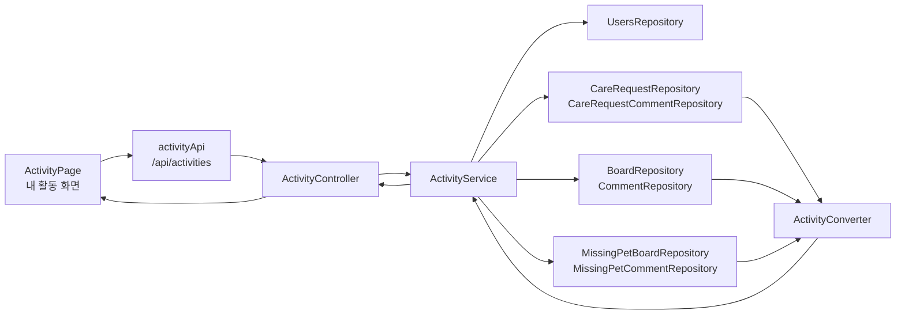
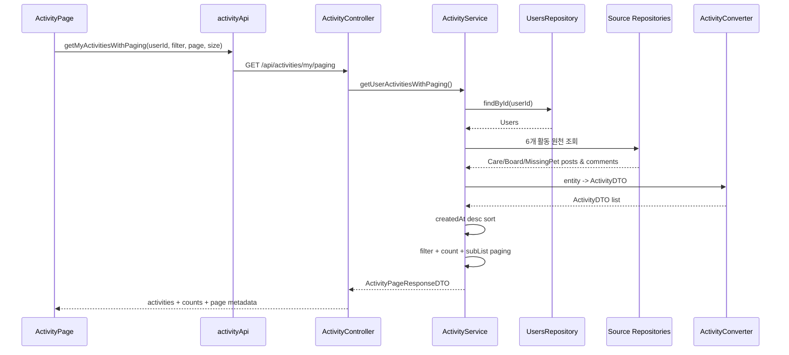
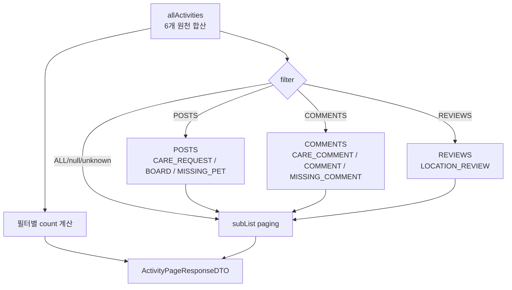
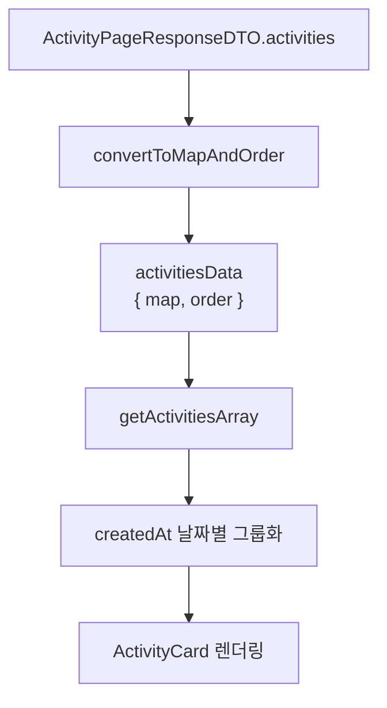
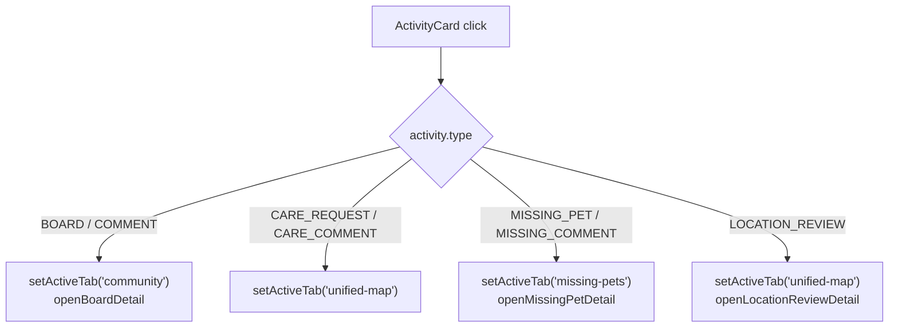
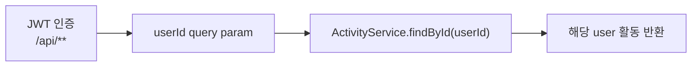

# 사용자 활동 타임라인 아키텍처

> 기준 코드: `ActivityPage`, `activityApi`, `ActivityController`, `ActivityService`, `ActivityConverter`.

Activity는 저장형 로그 시스템이 아니라 **조회 시점에 여러 도메인 데이터를 모아 타임라인 DTO로 합성하는 read model**이다. 따라서 데이터의 원천은 Care, Board, MissingPet 테이블이고, Activity 자체 테이블은 없다.

---

## 1. 전체 구조

흐름의 핵심:

- 프론트는 로그인 사용자의 `user.idx`를 query parameter로 보낸다.
- 백엔드는 해당 user row를 찾은 뒤, 6개 원천 repository를 조회한다.
- 각 원천 엔티티는 `ActivityDTO`로 변환된다.
- 서비스는 결과를 최신순으로 정렬하고 필터/페이징 응답을 만든다.

---

## 2. 조회 시퀀스

현재 구조는 단순하고 구현 비용이 낮지만, 활동 수가 많아질수록 6개 목록 전체를 매번 메모리에 올리는 비용이 커진다.

---

## 3. 원천 도메인 경계

| 원천 | 포함 데이터 | Activity type | 관련 이동 |
| --- | --- | --- | --- |
| Care | 사용자가 작성한 케어 요청 | `CARE_REQUEST` | 통합 지도 탭 |
| Care | 사용자가 작성한 케어 댓글 | `CARE_COMMENT` | 통합 지도 탭 |
| Board | 사용자가 작성한 커뮤니티 게시글 | `BOARD` | 커뮤니티 상세 |
| Board | 사용자가 작성한 커뮤니티 댓글 | `COMMENT` | 커뮤니티 상세 |
| MissingPet | 사용자가 작성한 실종 제보 | `MISSING_PET` | 실종 제보 상세 |
| MissingPet | 사용자가 작성한 실종 제보 댓글 | `MISSING_COMMENT` | 실종 제보 상세 |

Activity는 원천 도메인의 상태를 복사 저장하지 않는다. 원천 게시글/댓글이 삭제되면 `isDeleted=false` 조회 조건 때문에 Activity 목록에서도 빠진다.

---

## 4. 필터와 카운트 모델

`REVIEWS`는 필터/카운트 필드만 있고 현재 백엔드 수집 경로가 없다. 프론트에는 리뷰 필터 버튼과 `LOCATION_REVIEW` 이동 처리가 있지만 실제 서버 응답에는 나오지 않는다.

---

## 5. 프론트 상태와 렌더링

`ActivityPage`는 서버 응답을 바로 배열로만 보관하지 않고 `{ map, order }` 구조로 바꾼다.

화면 책임:

- 로그인 상태 확인
- 필터 버튼 상태 관리
- 서버 페이징 요청
- 날짜별 그룹 헤더 생성
- 타입별 라벨, 아이콘, 색상 표시
- 카드 클릭 시 관련 화면으로 이동

---

## 6. 카드 클릭 라우팅

상세 열기는 전역 `window.dispatchEvent(new CustomEvent(...))`에 의존한다. 커뮤니티와 실종 제보 화면은 각각 `openBoardDetail`, `openMissingPetDetail` 이벤트를 구독한다.

---

## 7. 보안 경계

현재 보호되는 것:

- 비로그인 사용자는 `/api/**` 인증 규칙에 걸린다.
- 존재하지 않는 userId는 `UserNotFoundException`이 발생한다.

현재 보호되지 않는 것:

- JWT 주체와 query parameter `userId`가 같은지 확인하지 않는다.
- 즉, 인증된 사용자가 다른 사용자의 `userId`를 요청하는 것을 Activity 도메인 자체에서 막지 않는다.

개선 방향:

- 컨트롤러에서 `Authentication.getName()`으로 로그인 ID를 읽고 서버에서 userIdx를 resolve한다.
- 또는 `@AuthenticationPrincipal` 기반으로 `userId` 파라미터를 제거한다.

---

## 8. 성능 특성

| 항목 | 현재 구조 | 영향 |
| --- | --- | --- |
| Repository 호출 | 최소 6개 목록 조회 | 구현 단순, 호출 수 고정 |
| 정렬 | Java 메모리 정렬 | 원천별 DB 정렬 결과를 다시 합침 |
| 페이징 | 메모리 `subList` | offset이 커져도 전체 활동을 먼저 로드 |
| 카운트 | 전체 DTO 순회 | 별도 count query는 없음 |
| 댓글 related 정보 | converter에서 연관 엔티티 접근 | fetch join 없는 경로는 N+1 가능 |
| 캐시 | 없음 | 최신성은 높지만 반복 조회 비용 존재 |

확장 시 선택지:

- 원천별 DB 페이징 후 k-way merge
- Activity 전용 read model 테이블 도입
- 각 도메인 이벤트 발행 후 activity log append
- 타입별 전용 API로 분리하고 프론트에서 합성

현재 규모에서는 서비스 단일 합성이 단순하지만, 활동이 많은 사용자 기준으로는 DB 페이징 또는 read model 전환을 검토해야 한다.

---

## 9. 운영/개선 체크포인트

1. `userId` 파라미터 권한 검증을 추가해야 한다.
2. `LOCATION_REVIEW` 수집을 실제로 구현하거나 UI 필터를 숨겨야 한다.
3. 활동 수가 늘어나면 현재 메모리 페이징은 병목이 된다.
4. 로그 메시지는 placeholder 기반 `log.info("...", value)` 형태로 정리할 수 있다.
5. 카드 이동은 전역 이벤트 의존성이 강하므로 라우팅/상태 관리 방식으로 정리할 여지가 있다.
6. Activity type 문자열은 enum 또는 상수로 고정하면 프론트/백엔드 불일치를 줄일 수 있다.

---

## 10. 관련 문서

- `docs/domains/activity.md`
- `docs/domains/board.md`
- `docs/architecture/board/커뮤니티 게시판 아키텍처.md`
- `docs/domains/care.md`
- `docs/architecture/care/펫 케어 & 매칭 아키텍처.md`
- `docs/domains/missingpet.md`
- `docs/architecture/missingpet/실종 제보 아키텍처.md`
