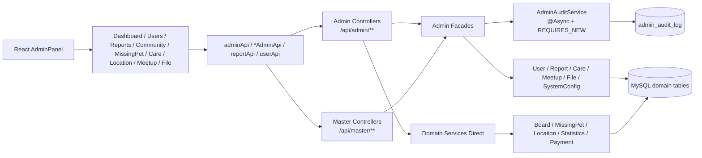
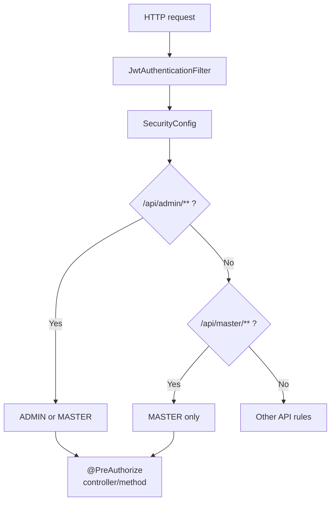
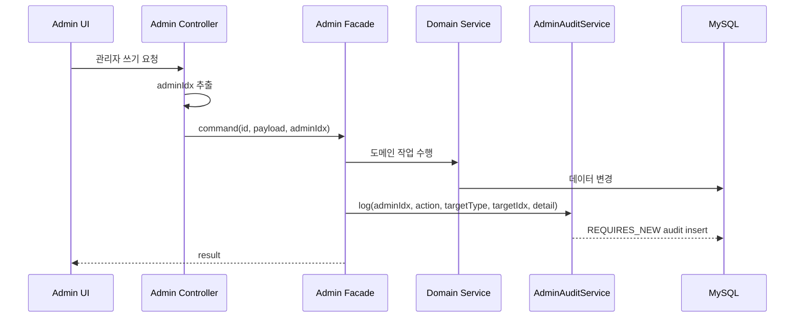
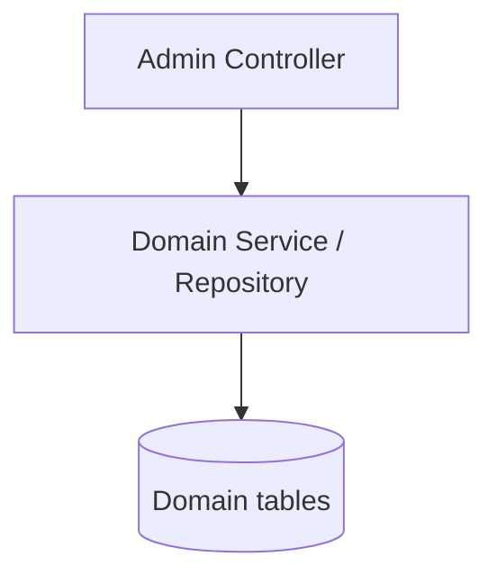
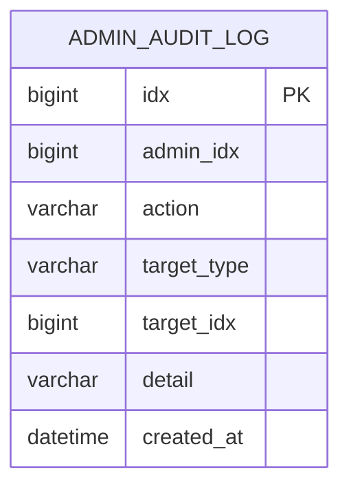
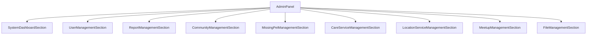
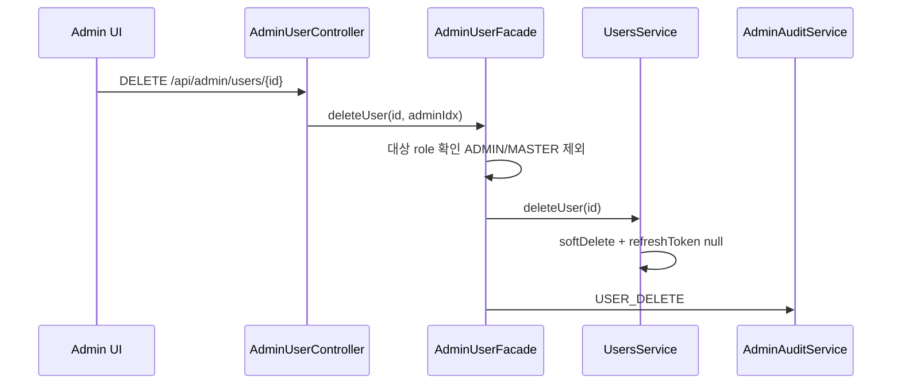
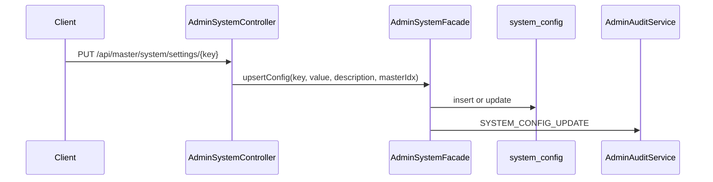
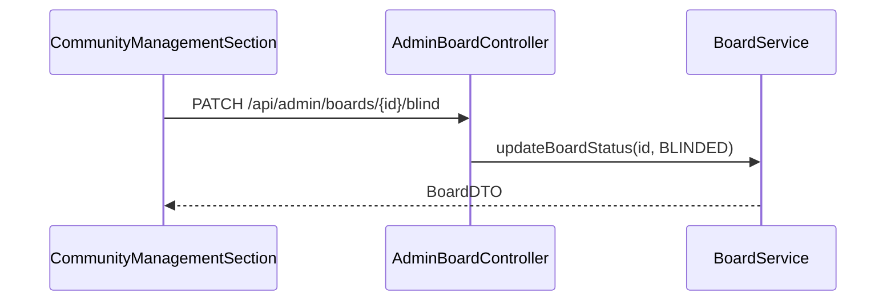

# 관리자 운영 아키텍처

> 현재 코드 기준. Admin은 여러 도메인 위에 놓인 운영자용 API/화면 계층이며, 일부 기능은 Admin facade로, 일부는 도메인 서비스를 직접 호출한다.

---

## 1. 전체 구조

AdminPanel은 하나의 화면이지만 백엔드는 완전히 단일 facade 구조가 아니다. 운영 문서에서는 facade 기반 경로와 직접 호출 경로를 분리해서 봐야 한다.

---

## 2. 권한 구조

삭제 계정 차단:

- 로그인 인증: `UsersDetailsServiceImpl -> findActiveByIdString`
- 현재 관리자 PK 변환: `AuthenticatedUserIdResolver -> findActiveByIdString`
- refresh token: `AuthService -> findActiveByRefreshToken`
- soft delete: refresh token 제거

---

## 3. Facade 기반 흐름

Facade 기반 컨트롤러:

| Controller | Facade | 감사 로그 |
|---|---|---|
| `AdminUserController` | `AdminUserFacade` | 상태 변경, 삭제, 복구 |
| `AdminUserManagementController` | `AdminUserFacade` | 관리자 생성, 승격, 삭제, 비밀번호 변경 |
| `AdminCareRequestController` | `AdminCareAndMeetupFacade` | 상태 변경, 삭제, 복구 |
| `AdminMeetupController` | `AdminCareAndMeetupFacade` | 모임 삭제 |
| `AdminFileController` | `AdminFileFacade` | 파일 row 삭제 |
| `AdminReportController` | `AdminReportFacade` | 신고 처리 |
| `AdminSystemController` | `AdminSystemFacade` | 설정 변경 |

---

## 4. 직접 호출 흐름

직접 호출형 컨트롤러:

| Controller | 경로 | 직접 의존 | 감사 로그 |
|---|---|---|---|
| `AdminBoardController` | `/api/admin/boards` | `BoardService`, `CommentService` | 없음 |
| `AdminMissingPetController` | `/api/admin/missing-pets` | `MissingPetBoardService`, `MissingPetCommentService` | 없음 |
| `AdminLocationController` | `/api/admin/location-services` | `LocationServiceAdminService`, `LocationServiceService`, `PublicDataLocationService` | 없음 |
| `AdminStatisticsController` | `/api/admin/statistics` | `StatisticsService` | 없음 |
| `AdminPaymentController` | `/api/admin/payment` | `PetCoinService`, repositories | 없음 |

이 경로들은 운영 기능으로는 동작하지만 Admin facade/audit 정책과 균일하지 않다.

---

## 5. AdminAuditLog

`AdminAuditService.log()` 특징:

- `@Async`
- `@Transactional(propagation = REQUIRES_NEW)`
- 저장 실패 시 예외를 전파하지 않음
- 인덱스: `(admin_idx, created_at)`

대표 action:

- `USER_STATUS_UPDATE`
- `USER_DELETE`
- `USER_RESTORE`
- `ADMIN_CREATE`
- `USER_PROMOTE_ADMIN`
- `ADMIN_DELETE`
- `ADMIN_PASSWORD_CHANGE`
- `CARE_STATUS_UPDATE`
- `CARE_DELETE`
- `CARE_RESTORE`
- `MEETUP_DELETE`
- `FILE_DELETE`
- `FILE_BULK_DELETE`
- `REPORT_HANDLE`
- `SYSTEM_CONFIG_UPDATE`

---

## 6. AdminPanel 구성

프론트 접근 제어:

- `usePermission().requireAdmin()`
- `user.role === ADMIN || user.role === MASTER`
- 일부 버튼은 `checkRole('MASTER')`로 MASTER 전용 처리

백엔드에는 있지만 현재 AdminPanel 메뉴에 없는 기능:

- 시스템 설정 `/api/master/system`
- 관리자 결제 `/api/admin/payment`
- weekly/monthly/summary 통계 전용 화면

---

## 7. 운영 데이터 흐름

### 7.1 사용자 soft delete

### 7.2 MASTER 시스템 설정 변경

### 7.3 커뮤니티 모더레이션

이 경로는 현재 audit를 남기지 않는다.

---

## 8. 현재 설계 경계

- Admin은 통합 운영 화면이지만 backend 구현은 facade 기반과 직접 호출형이 섞여 있다.
- 감사 로그는 facade 기반 쓰기 경로 중심이다.
- 일부 프론트 API 함수는 백엔드에 없는 오래된 endpoint를 가리킨다.
- 파일 관리 통계, 신고 assist, 시스템 설정 UI, 관리자 결제 UI처럼 프론트/백엔드 계약이 완전히 맞지 않는 부분이 있다.
- `/api/admin/statistics`는 경로상 admin이지만 실제 권한은 MASTER다.
- Location CSV 경로 임포트는 운영 환경에서 파일 경로 접근 제어가 필요하다.
