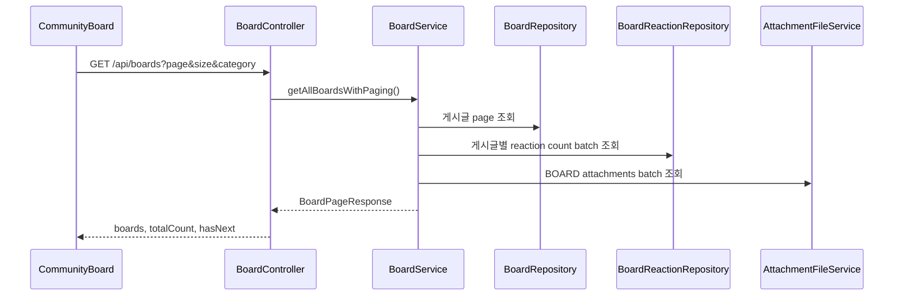
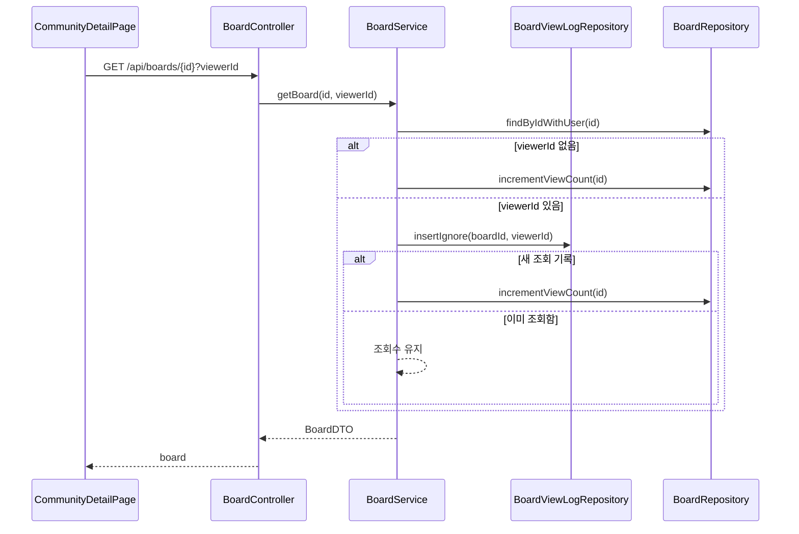
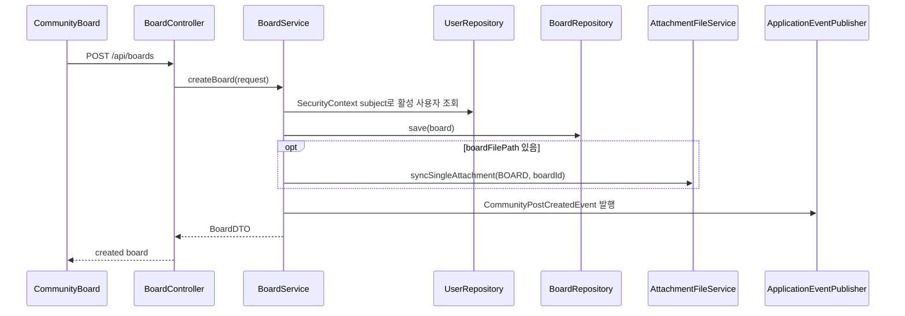
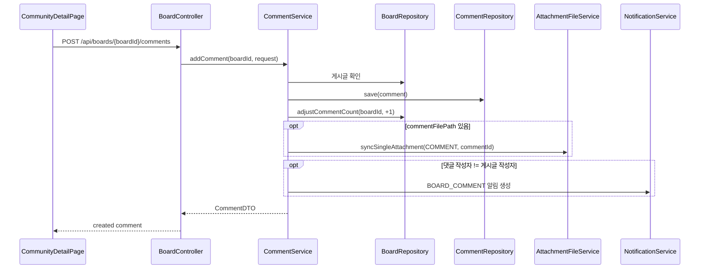
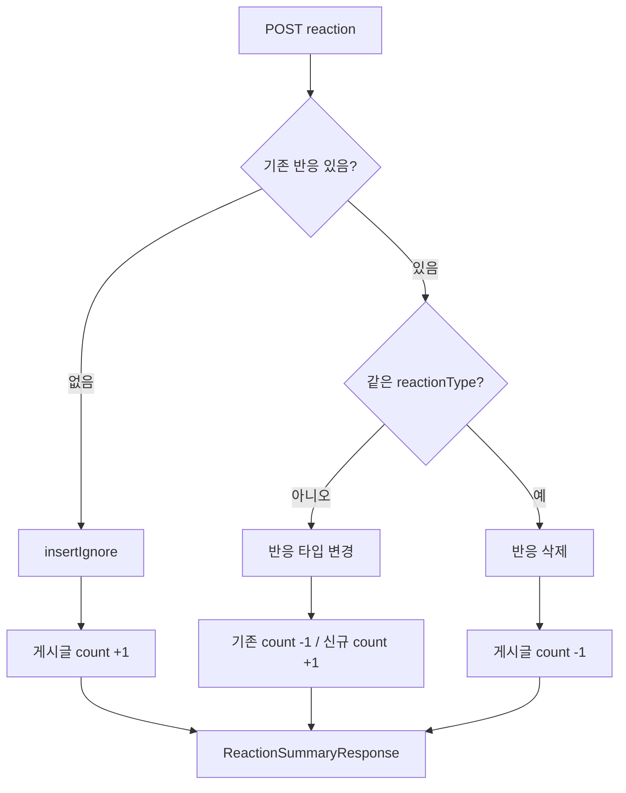

# 커뮤니티 게시판 아키텍처

> 기준: 현재 코드. 이 문서는 일반 커뮤니티 게시판과 일반 댓글만 다룬다. `MissingPetBoard`, `MissingPetComment`는 실종 제보 도메인에서 별도로 정리한다.

## 1. 개요

커뮤니티 게시판은 사용자가 게시글을 작성하고, 댓글과 반응으로 상호작용하며, 관리자가 게시글/댓글을 모더레이션할 수 있게 하는 도메인이다.

핵심 책임:

- 게시글 목록/상세/작성/수정/삭제
- 게시글 카테고리 필터링과 검색
- 일반 댓글 목록/작성/삭제
- 게시글/댓글 좋아요·싫어요 토글
- 로그인 사용자 기준 조회수 중복 방지
- 인기글 스냅샷 생성/조회
- 게시글/댓글 첨부파일 연결
- 댓글 작성 알림
- 관리자 블라인드·삭제·복구

## 2. 전체 구조

```mermaid
flowchart TB
    subgraph FE["Frontend"]
        CommunityBoard["CommunityBoard"]
        CommunityDetailPage["CommunityDetailPage"]
        HomePage["HomePage 인기 커뮤니티 영역"]
        AdminCommunity["CommunityManagementSection"]
        BoardApi["boardApi.js"]
        CommentApi["commentApi.js"]
        AdminApi["communityAdminApi.js"]
    end

    subgraph API["Backend API"]
        BoardController["BoardController /api/boards"]
        AdminBoardController["AdminBoardController /api/admin/boards"]
    end

    subgraph Service["Service"]
        BoardService["BoardService"]
        CommentService["CommentService"]
        ReactionService["ReactionService"]
        PopularityService["BoardPopularityService"]
        PopularityScheduler["BoardPopularityScheduler"]
    end

    subgraph Data["Repository / DB"]
        BoardRepo["SpringDataJpaBoardRepository"]
        CommentRepo["SpringDataJpaCommentRepository"]
        BoardReactionRepo["BoardReactionRepository"]
        CommentReactionRepo["CommentReactionRepository"]
        ViewLogRepo["BoardViewLogRepository"]
        SnapshotRepo["BoardPopularitySnapshotRepository"]
        MySQL[("MySQL")]
    end

    subgraph External["Other Domains"]
        UserDomain["User"]
        FileDomain["File / AttachmentFileService"]
        NotificationDomain["Notification"]
        RecommendationDomain["Recommendation Event Consumer"]
    end

    CommunityBoard --> BoardApi
    CommunityDetailPage --> BoardApi
    CommunityDetailPage --> CommentApi
    HomePage --> BoardApi
    AdminCommunity --> AdminApi

    BoardApi --> BoardController
    CommentApi --> BoardController
    AdminApi --> AdminBoardController

    BoardController --> BoardService
    BoardController --> CommentService
    BoardController --> ReactionService
    BoardController --> PopularityService
    AdminBoardController --> BoardService
    AdminBoardController --> CommentService

    PopularityScheduler --> PopularityService

    BoardService --> BoardRepo
    BoardService --> BoardReactionRepo
    BoardService --> ViewLogRepo
    CommentService --> CommentRepo
    CommentService --> BoardRepo
    ReactionService --> BoardReactionRepo
    ReactionService --> CommentReactionRepo
    PopularityService --> SnapshotRepo
    PopularityService --> BoardRepo
    PopularityService --> BoardReactionRepo
    PopularityService --> CommentRepo
    PopularityService --> ViewLogRepo

    BoardRepo --> MySQL
    CommentRepo --> MySQL
    BoardReactionRepo --> MySQL
    CommentReactionRepo --> MySQL
    ViewLogRepo --> MySQL
    SnapshotRepo --> MySQL

    BoardService --> UserDomain
    CommentService --> UserDomain
    ReactionService --> UserDomain
    BoardService --> FileDomain
    CommentService --> FileDomain
    CommentService --> NotificationDomain
    BoardService --> RecommendationDomain
```



## 3. 프론트엔드 연결

| 화면/모듈 | 역할 | API 모듈 |
|---|---|---|
| `CommunityBoard` | 커뮤니티 목록, 검색, 글 작성 진입 | `boardApi.js` |
| `CommunityDetailPage` | 게시글 상세, 댓글, 반응, 수정/삭제 | `boardApi.js`, `commentApi.js` |
| `HomePage` | 인기 커뮤니티 게시글 노출 | `boardApi.getPopularBoards()` |
| `CommunityManagementSection` | 관리자 게시글/댓글 관리 | `communityAdminApi.js` |

프론트 API base URL:

- 사용자 게시판: `http://localhost:8080/api/boards`
- 관리자 게시판: `http://localhost:8080/api/admin`

데모 모드에서는 `boardApi.js`, `commentApi.js`가 mock 데이터를 반환한다. 실제 백엔드 호출 흐름과는 분리된 개발용 경로다.

## 4. 백엔드 레이어

### Controller

`BoardController`는 사용자 게시판 경로를 담당한다.

- 게시글 목록/상세/검색/인기글
- 게시글 생성/수정/삭제
- 댓글 목록/작성/삭제
- 게시글/댓글 반응

`AdminBoardController`는 관리자 경로를 담당한다.

- 게시글 페이징 조회
- 게시글 상세 조회
- 게시글 블라인드/해제/삭제/복구
- 댓글 목록 조회
- 댓글 블라인드/해제/삭제/복구

### Service

| 서비스 | 책임 |
|---|---|
| `BoardService` | 게시글 CRUD, 검색, 조회수, 게시글 DTO 배치 매핑, 관리자 게시글 처리 |
| `CommentService` | 댓글 목록/작성/수정/삭제, 댓글 DTO 배치 매핑, 댓글 알림 |
| `ReactionService` | 게시글/댓글 좋아요·싫어요 토글 |
| `BoardPopularityService` | 인기글 스냅샷 생성/조회 |
| `BoardPopularityScheduler` | 주간/월간 스냅샷 자동 생성 |

### Repository

일반 사용자 목록은 삭제되지 않은 게시글과 활성 작성자만 조회한다. 관리자 목록은 `Specification` 기반으로 status, deleted, category, q 조건을 조합해 DB 레벨 페이징을 수행한다.

## 5. 주요 데이터 흐름

### 게시글 목록



핵심은 게시글별 반응 수와 첨부파일을 개별 조회하지 않고 batch로 묶는 것이다. reaction count 조회는 500개 단위로 나눠 IN 조건을 사용한다.

### 게시글 상세와 조회수



`viewerId`가 넘어오지 않으면 비로그인 조회처럼 매번 증가한다. 현재 구현은 인증 컨텍스트에서 viewer를 자동 추출하지 않는다.

### 게시글 작성



작성자는 요청 DTO가 아니라 현재 로그인 사용자의 `SecurityContext`에서 결정한다.

### 댓글 작성



댓글 삭제는 soft delete 후 게시글의 `commentCount`를 `-1` 한다. 첨부파일과 반응 데이터는 감사/복구 가능성을 위해 즉시 삭제하지 않는다.

### 반응 토글



게시글은 `likeCount`, `dislikeCount` 캐시 필드를 DB update로 조정한다. 댓글은 별도 count cache가 없어 응답 시 repository count로 summary를 만든다.

## 6. 인기글 스냅샷

인기글은 요청 시 매번 실시간 집계하지 않고 스냅샷 테이블을 사용한다.

대상:

- 기본 카테고리: `"자랑"`
- fallback 카테고리: `"PRIDE"`

기간:

- `WEEKLY`: 오늘 포함 최근 7일
- `MONTHLY`: 오늘 포함 최근 30일

점수:

```text
popularityScore = likes * 3 + comments * 2 + views
```

생성 흐름:

1. 기간 내 후보 게시글 조회
2. 좋아요 수, 댓글 수, 조회 수를 batch 조회
3. 세 집계를 `CompletableFuture.supplyAsync()`로 병렬 실행
4. 점수 계산 후 상위 30개 정렬
5. 동일 period/range 기존 스냅샷 삭제
6. 새 스냅샷 저장

조회 fallback:

1. 정확한 기간 스냅샷
2. 기간이 겹치는 스냅샷
3. 같은 period의 최근 스냅샷
4. 즉시 생성
5. 최신 게시글 10개 fallback

스케줄:

- 주간 스냅샷: 매일 18:30
- 월간 스냅샷: 매주 월요일 18:30

## 7. 권한과 상태

### 사용자 경로

| 작업 | 권한 |
|---|---|
| 게시글 목록/상세/검색/인기글 | 컨트롤러상 `permitAll()` |
| 게시글 작성 | 인증 사용자 |
| 게시글 수정/삭제 | 작성자 또는 `ADMIN`/`MASTER` |
| 댓글 목록 | 컨트롤러상 `permitAll()` |
| 댓글 작성/삭제 | 인증 사용자, 삭제는 작성자 또는 관리자 |
| 반응 | 인증 사용자 |

주의: 컨트롤러 annotation과 별개로 `SecurityConfig`의 `/api/**` 인증 정책 때문에 실제 접근 가능 여부는 보안 설정까지 함께 확인해야 한다.

### 관리자 경로

`/api/admin/boards/**`는 `ADMIN`, `MASTER` 권한을 전제로 한다.

상태 변경:

- `ACTIVE`
- `BLINDED`
- `DELETED`

게시글/댓글 삭제는 hard delete가 아니라 soft delete다.

## 8. 도메인 연동

| 도메인 | 연결 지점 |
|---|---|
| User | 작성자 조회, 활성 사용자 필터, 권한 확인, 이메일 인증 확인 |
| File | 게시글/댓글 첨부파일 동기화와 batch 조회 |
| Notification | 댓글 작성 시 게시글 작성자에게 `BOARD_COMMENT` 알림 |
| Recommendation | 게시글 생성 시 `CommunityPostCreatedEvent` 발행 |
| Admin/Report | 신고 처리는 별도 도메인, 관리자 API는 상태 변경 담당 |

## 9. 현재 설계상 주의점

- 댓글 수정 서비스는 있지만 사용자용 endpoint는 없다.
- reaction 요청의 `userId`가 현재 인증 사용자와 같은지 서비스에서 검증하지 않는다.
- 조회수 중복 방지는 `viewerId` 파라미터에 의존한다.
- 게시글 상세 캐시는 현재 조회수/반응/댓글 count 정합성 때문에 사용하지 않는다.
- 인기글 병렬 집계는 기본 `ForkJoinPool`을 사용한다.
- 관리자 댓글 목록은 서비스에서 전체 댓글을 가져온 뒤 컨트롤러에서 status/deleted를 필터링한다.

## 10. 관련 문서

- [Board 도메인](../../domains/board.md)
- [Board 백엔드 성능 최적화](../../refactoring/board/board-backend-performance-optimization.md)
- [Board 인기글 스냅샷 배치 분석](../../refactoring/board/board-popularity-snapshot-batch-analysis.md)
- [Board 인기글 스냅샷 배치 리팩토링](../../refactoring/board/board-popularity-snapshot-batch-refactoring.md)
- [Board 인기글 스냅샷 N+1 리팩토링](../../refactoring/board/board-popularity-snapshot-n-plus-one-refactoring.md)
- [Comment reaction query troubleshooting](../../refactoring/board/comment-reaction-query/troubleshooting.md)
- [Board 성능 트러블슈팅](../../troubleshooting/board/performance-optimization.md)
- [Board 코드 중복 매핑](../../troubleshooting/board/code-duplication-mapping.md)
