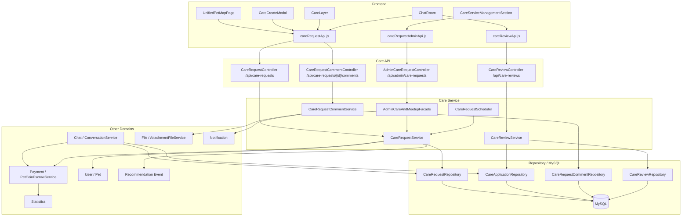
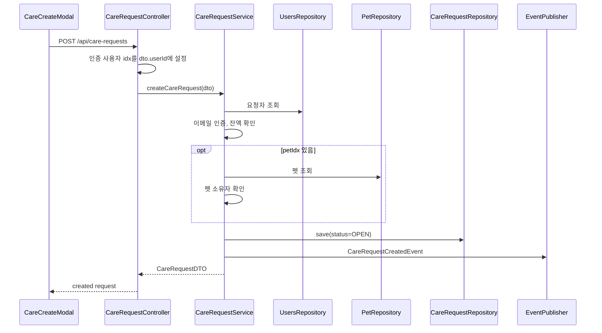
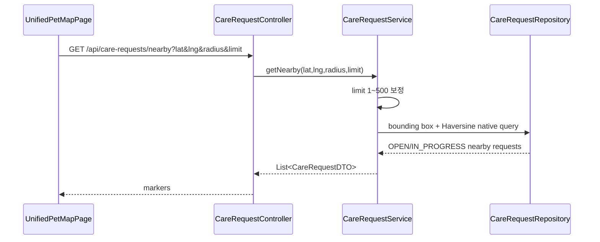
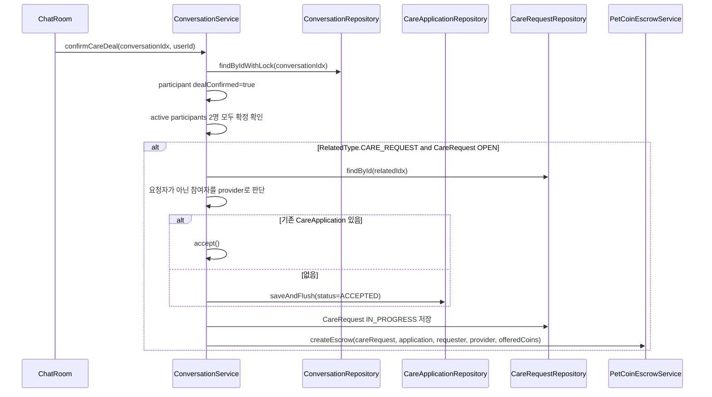
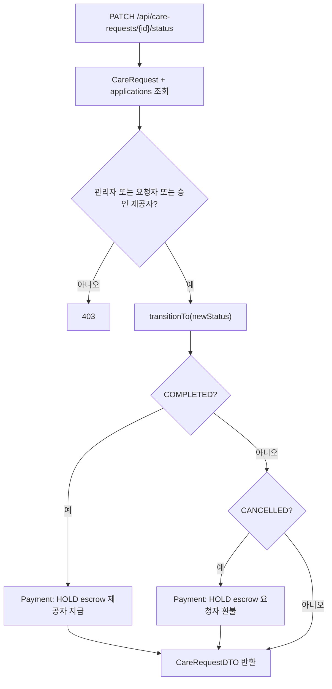
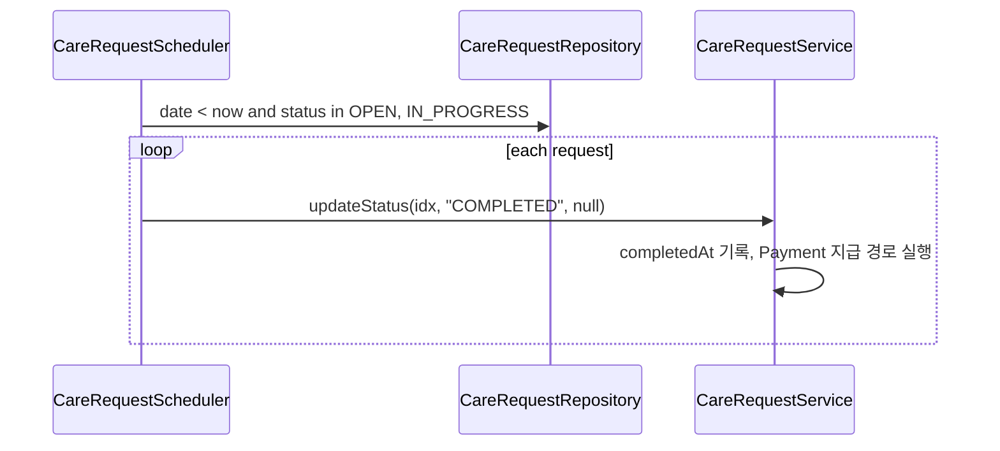

# 펫 케어 & 매칭 아키텍처

> 기준: 현재 코드. Care는 요청/매칭/상태/댓글/리뷰를 담당하고, Payment는 코인 차감·에스크로·지급/환불을 담당한다.

## 1. 개요

펫 케어 & 매칭 아키텍처는 지도 기반 케어 요청 노출, 요청 생성, 채팅 기반 거래 확정, 서비스 완료, 리뷰로 이어지는 흐름을 연결한다.

핵심 특징:

- 지도 화면에서 근처 케어 요청을 조회한다.
- 케어 요청은 인증 사용자 기준으로 생성된다.
- 케어 제공자와 요청자는 Chat 도메인에서 거래를 확정한다.
- 거래 확정 시 `CareApplication`이 `ACCEPTED`가 되고 요청은 `IN_PROGRESS`가 된다.
- 코인 처리는 Payment 도메인의 에스크로 서비스가 맡는다.
- 완료/취소 상태 전이는 Care에서 시작하고 Payment 지급/환불을 호출한다.

## 2. 전체 구조



## 3. 프론트엔드 연결

| 화면/모듈 | 역할 | API 모듈 |
|---|---|---|
| `UnifiedPetMapPage` | 통합 지도에서 케어 레이어 표시 | `careRequestApi.js` |
| `CareCreateModal` | 지도 기반 케어 요청 생성 | `careRequestApi.createCareRequest()` |
| `CareLayer` | 선택된 케어 요청 상세, 댓글, 제공자 프로필 정보 표시 | `careRequestApi.js` |
| `ChatRoom` | 거래 확정, 완료 처리, 리뷰 작성 | `chatApi.js`, `careRequestApi.js`, `careReviewApi.js` |
| `CareServiceManagementSection` | 관리자 케어 요청 운영 | `careRequestAdminApi.js` |

프론트 API base URL:

- 케어 요청: `http://localhost:8080/api/care-requests`
- 케어 리뷰: `http://localhost:8080/api/care-reviews`
- 관리자 케어: `http://localhost:8080/api/admin/care-requests`

## 4. 백엔드 레이어

### Controller

| Controller | 책임 |
|---|---|
| `CareRequestController` | 케어 요청 CRUD, 목록, 검색, 지도 근처 조회, 상태 변경 |
| `CareRequestCommentController` | 케어 요청 댓글 조회/작성/삭제 |
| `CareReviewController` | 리뷰 작성, 사용자별 리뷰/평균 평점 조회 |
| `AdminCareRequestController` | 관리자 조회, 상태 변경, 삭제, 복구 |
| `ConversationController` | 채팅방 거래 확정 진입점 |

### Service

| Service | 책임 |
|---|---|
| `CareRequestService` | 요청 생성/수정/삭제/검색/상태 전이, Payment 지급/환불 호출 |
| `CareRequestCommentService` | 댓글 작성 권한, 첨부파일, 알림 |
| `CareReviewService` | 리뷰 작성 조건 검증, 중복 방지, 평점 계산 |
| `CareRequestScheduler` | 만료 요청 자동 완료 |
| `ConversationService` | 양쪽 거래 확정, `CareApplication` 생성/승인, `IN_PROGRESS` 전이, 에스크로 생성 호출 |
| `AdminCareAndMeetupFacade` | 관리자 작업과 감사 로그 연결 |

### Repository

`CareRequestRepository`는 포트 역할을 하고, `JpaCareRequestAdapter`가 Spring Data JPA repository를 감싼다. 검색 결과 hydration, 관리자 조회 분기, FULLTEXT 검색과 연관 fetch 흐름이 어댑터에 모여 있다.

## 5. 주요 데이터 흐름

### 케어 요청 생성



생성 시점에는 코인을 차감하지 않는다. 코인 차감은 채팅에서 양쪽이 거래를 확정할 때 Payment 에스크로 생성으로 넘어간다.

### 지도 근처 조회



반경 검색은 지역 계층이 아니라 lat/lng 중심의 지도 경로다.

### 채팅 거래 확정



현재 `createEscrow()` 실패는 로그만 남고 거래 확정 트랜잭션을 롤백하지 않는다. 이 동작은 Payment 정합성 정책을 정할 때 우선 검토해야 한다.

### 완료/취소와 Payment



Care는 상태 전이를 담당하고, Payment는 실제 코인 이동과 에스크로 락을 담당한다.

### 자동 완료



스케줄러는 루프 전체를 하나의 트랜잭션으로 묶지 않는다. 개별 요청 실패가 전체 배치를 막지 않게 한다.

## 6. 조회와 검색 최적화

### 사용자 목록

사용자 목록은 다음 조건을 기본으로 한다.

- `CareRequest.isDeleted=false`
- 요청자 `isDeleted=false`
- 요청자 `status=ACTIVE`
- status 필터
- location 접두사 필터

`JOIN FETCH cr.user`, `LEFT JOIN FETCH cr.pet`로 요청자와 펫을 함께 가져온다. `CareApplication`은 `@BatchSize(size = 50)`로 페이징 목록에서 N+1을 줄인다.

### 검색

검색은 MySQL FULLTEXT를 사용한다.

```sql
MATCH(cr.title, cr.description) AGAINST(:keyword IN NATURAL LANGUAGE MODE)
```

`JpaCareRequestAdapter.searchWithPaging()`은 native 검색 결과를 받은 뒤, 결과 id 목록으로 `findByIdxInWithAssociations()`를 다시 호출해 연관 데이터를 보강하고 원래 순서를 유지한다.

### Pet DTO 변환

`CareRequestConverter.toDTOList()`는 요청 목록에서 Pet을 먼저 모아 `PetConverter.toDTOList()`로 batch 변환한다. 펫 이미지/파일 변환 과정에서 개별 변환이 반복되는 문제를 줄이기 위한 구조다.

## 7. 댓글과 리뷰

### 댓글

댓글 작성은 `SERVICE_PROVIDER` role만 허용한다.

흐름:

1. 케어 요청 조회
2. `dto.userId`로 작성자 조회
3. role 확인
4. 댓글 저장
5. 첫 번째 첨부파일을 `CARE_COMMENT`로 연결
6. 요청자와 작성자가 다르면 `CARE_REQUEST_COMMENT` 알림 생성

삭제는 댓글 작성자 또는 관리자만 가능하며 soft delete다.

### 리뷰

리뷰 작성은 `CareApplication.ACCEPTED`를 기준으로 한다.

조건:

- careApplicationId 필수
- reviewer는 케어 요청자
- reviewee는 제공자
- 같은 application에 같은 reviewer가 이미 리뷰를 썼으면 거절

평균 평점은 reviewee의 리뷰 목록을 가져와 애플리케이션에서 평균을 계산한다.

## 8. 관리자 흐름

관리자 케어 요청 관리는 `AdminCareRequestController -> AdminCareAndMeetupFacade -> CareRequestService/CareRequestRepository` 순서로 진행된다.

기능:

- status/deleted/q/page/size 필터 목록
- 단건 조회
- 상태 변경
- soft delete
- restore
- 감사 로그 기록

q가 있으면 관리자 조회도 title/description FULLTEXT 검색을 사용한다.

## 9. 도메인 경계

| 도메인 | Care와의 연결 |
|---|---|
| User | 요청자, 제공자, 댓글/리뷰 사용자, 이메일 인증, 펫 소유자 확인 |
| Chat | 거래 확정의 실제 트리거, `CareApplication` 생성/승인 |
| Payment | 에스크로 생성, 완료 지급, 취소 환불 |
| File | 케어 댓글 첨부파일 |
| Notification | 케어 댓글 알림 |
| Recommendation | 케어 요청 생성 이벤트 |
| Statistics | 완료 시각과 Payment 지급 기록 |

Payment 내부 설계는 이 문서에 복제하지 않고 [Payment 도메인](../../domains/payment.md)과 [펫케어 코인 관련 흐름](펫케어 코인 관련 흐름.md)을 참조한다.

## 10. 현재 설계상 주의점

- 케어 지원 신청/승인 API가 Care 컨트롤러에 직접 노출되어 있지 않다.
- `ConversationService.confirmCareDeal()`에서 에스크로 생성 실패 시 매칭 상태 전이는 롤백되지 않는다.
- 댓글 작성과 리뷰 작성은 DTO 사용자 ID를 사용하므로 인증 사용자와의 일치 검증을 보강할 필요가 있다.
- 리뷰 작성 조건은 `ACCEPTED`이고 `COMPLETED`가 아니다.
- `updateCareRequest()`는 DTO의 `petIdx` 누락과 명시적 null을 구분하지 못한다.
- 만료 스케줄러는 `OPEN` 요청도 완료 처리한다.
- Care 댓글 첨부파일은 댓글별 개별 조회다.

## 11. 관련 문서

- [Care 도메인](../../domains/care.md)
- [펫케어 코인 관련 흐름](펫케어 코인 관련 흐름.md)
- [Payment 도메인](../../domains/payment.md)
- [Care 요청 N+1 분석](../../troubleshooting/care/care-request-n-plus-one-analysis.md)
- [Care 요청 페이징 N+1](../../troubleshooting/care/care-request-paging-n-plus-one.md)
- [Care 거래 확정 Race Condition](../../troubleshooting/care/care-deal-confirmation-race-condition.md)
