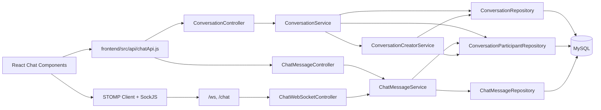
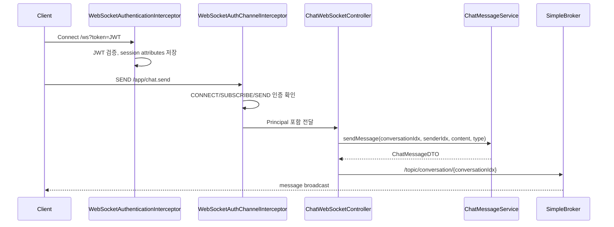
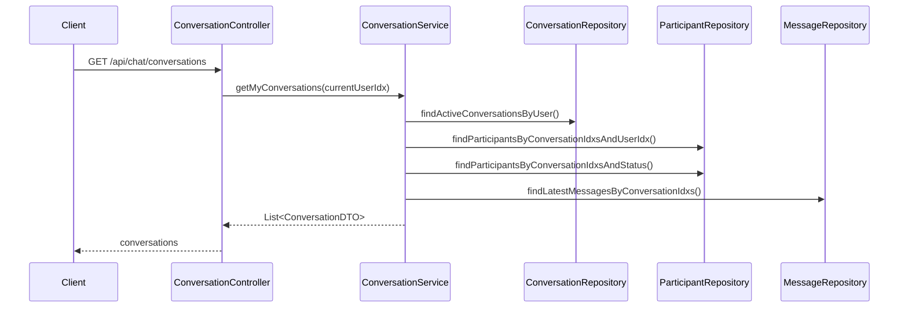
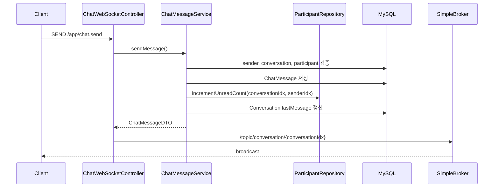
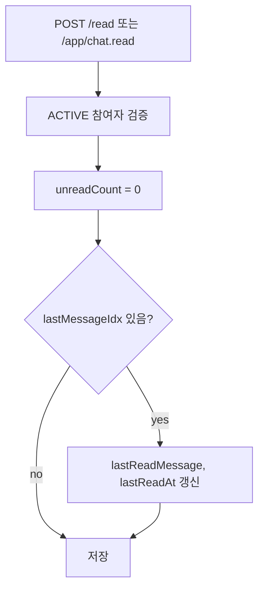
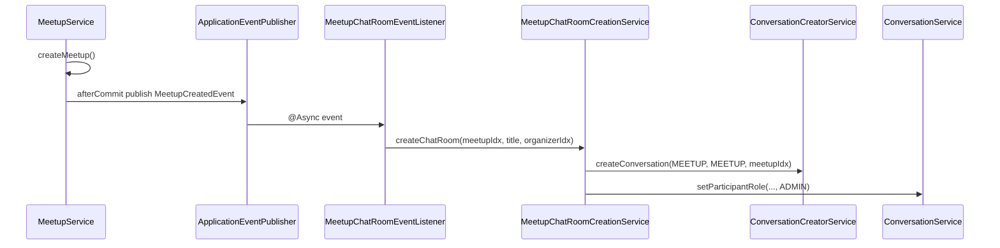

# 채팅 시스템 아키텍처

> 현재 코드 기준. Chat은 독립 도메인이면서 Care, MissingPet, Meetup의 대화 채널 역할을 한다.

---

## 1. 전체 구조

---

## 2. 프론트엔드 연결

| 모듈 | 역할 |
|---|---|
| `frontend/src/api/chatApi.js` | `/api/chat` REST API 래핑 |
| `ChatFloatingButton.js` | 전역 채팅 진입 버튼 |
| `ChatModal.js` | 채팅 목록 모달 |
| `ChatList.js` | 채팅방 목록 + 타입 탭 필터 |
| `ConversationItem.js` | 채팅방 배지, 마지막 메시지, unread 표시 |
| `ChatRoom.js` | 메시지 목록, STOMP 연결, 이미지 업로드, 읽음 처리, 거래 확정 |

`ChatRoom.js`는 WebSocket이 연결되어 있으면 `/app/chat.send`로 메시지를 보내고, 연결되어 있지 않으면 REST `POST /api/chat/messages`로 폴백한다.

읽음 처리는 다음 두 방식으로 수행한다.

- 초기 메시지 로드 후 마지막 메시지를 즉시 읽음 처리
- 실시간 수신 메시지는 500ms 디바운스로 묶어서 읽음 처리

---

## 3. 백엔드 레이어

### 3.1 Controller

| Controller | 책임 |
|---|---|
| `ConversationController` | 채팅방 생성/조회/나가기/삭제/상태 변경, 모임 채팅 참여, 거래 확정 |
| `ChatMessageController` | 메시지 전송/조회/커서 조회/읽음/삭제/검색/unread 조회 |
| `ChatWebSocketController` | STOMP 메시지 전송, 읽음, 타이핑 이벤트 처리 |

REST 컨트롤러는 `AuthenticatedUserIdResolver`로 현재 사용자 idx를 얻는다. 사용자 ID를 쿼리 파라미터로 받아 권한을 결정하지 않는다.

### 3.2 Service

| Service | 책임 |
|---|---|
| `ConversationService` | 채팅방 조회, 도메인별 채팅 생성 조합, 모임 채팅 참여, 거래 확정 |
| `ConversationCreatorService` | 실제 채팅방 생성, 중복 방 재사용, `REQUIRES_NEW` 트랜잭션 |
| `ChatMessageService` | 메시지 저장/조회/검색/삭제, 읽음 상태, unread 증가 |

`ConversationCreatorService`가 별도 빈으로 분리된 이유는 `REQUIRES_NEW`가 프록시를 타도록 하기 위해서다. 동일 클래스 내부 호출로는 트랜잭션 전파 의도가 적용되지 않는다.

### 3.3 Repository

도메인 서비스는 `ConversationRepository`, `ConversationParticipantRepository`, `ChatMessageRepository` 인터페이스를 사용하고, 실제 JPA 구현은 `Jpa*Adapter`와 `SpringDataJpa*Repository`에 있다.

주요 쿼리:

- 사용자별 활성 채팅방 목록
- `relatedType + relatedIdx` 기반 채팅방 조회
- 1:1 DIRECT 채팅방 중복 조회
- 채팅방 목록의 내 참여자/전체 참여자 배치 조회
- 채팅방별 최신 메시지 배치 조회
- 메시지 FULLTEXT 검색
- 거래 확정을 위한 `Conversation` 비관적 락 조회

---

## 4. WebSocket 구조

설정:

- STOMP 엔드포인트: `/ws`, `/chat`
- SockJS 폴백 사용
- 서버 → 클라이언트 브로커 프리픽스: `/topic`, `/queue`, `/user`
- 클라이언트 → 서버 프리픽스: `/app`
- 사용자 개인 메시지 프리픽스: `/user`

인증:

- 핸드셰이크에서 query string `token` 또는 `Authorization` 헤더를 검증한다.
- STOMP `CONNECT`, `SUBSCRIBE`, `SEND`에서 토큰 또는 세션 인증 정보를 다시 확인한다.
- WebSocket 컨트롤러는 `Principal.getName()`으로 로그인 ID를 받고 `UsersRepository.findByIdString()`으로 user idx를 찾는다.

---

## 5. 핵심 데이터 흐름

### 5.1 채팅방 목록 조회

목록 조회는 DTO 변환 중 LAZY 컬렉션에 직접 접근하지 않고, 서비스에서 배치 조회한 결과를 DTO에 직접 넣는다.

### 5.2 메시지 전송

`incrementUnreadCount()`는 발신자를 제외한 ACTIVE 참여자에게 DB 원자적 UPDATE를 수행한다.

### 5.3 읽음 처리

현재 구조는 별도 `MessageReadStatus` 테이블을 쓰지 않는다. 읽음 상태는 참여자별 상태로 충분하다는 판단으로 단순화되어 있다.

### 5.4 모임 채팅 생성

채팅방 생성 실패가 모임 생성 트랜잭션을 롤백하지 않도록 after-commit 이벤트와 별도 트랜잭션을 사용한다. 복구 스케줄러는 채팅방이 없는 모임을 찾아 재생성한다.

---

## 6. 도메인 간 연결

| 연결 도메인 | 연결 방식 | 현재 구현 |
|---|---|---|
| User | `ConversationParticipant.user`, `ChatMessage.sender` | 탈퇴 사용자 필터, JWT principal 기반 사용자 결정 |
| Care | `relatedType = CARE_REQUEST` 또는 `CARE_APPLICATION` | 채팅방 생성, 거래 확정, 에스크로 생성 호출 |
| Payment | `PetCoinEscrowService.createEscrow()` | Care 거래 양측 확정 후 호출. 실패 시 로그만 남김 |
| Meetup | `relatedType = MEETUP`, `relatedIdx = meetupIdx` | 모임 생성 후 비동기 채팅방 생성, 별도 채팅 참여 API |
| MissingPet | `relatedType = MISSING_PET_BOARD`, `relatedIdx = boardIdx` | 제보자-목격자 조합별 개별 채팅방 |
| File | 이미지 업로드 후 URL을 `IMAGE` 메시지 content로 전송 | `uploadApi.uploadImage(... category='chat')` |

---

## 7. 성능 설계

| 지점 | 설계 |
|---|---|
| 채팅방 목록 | 채팅방, 내 참여자, 전체 참여자, 최신 메시지 배치 조회 |
| unread 증가 | 참여자별 엔티티 로드 반복 대신 DB 원자적 UPDATE |
| 읽음 처리 | 전체 메시지 조회 제거, 참여자 상태만 갱신 |
| 프론트 읽음 호출 | 실시간 수신 읽음 처리 500ms 디바운스 |
| 메시지 검색 | MySQL FULLTEXT로 idx 조회 후 fetch 재조회 |
| 실종 채팅 기존 방 탐색 | 관련 방 목록 + 참여자 배치 조회 후 메모리 매칭 |

---

## 8. 운영상 주의점

- WebSocket 브로커는 Spring SimpleBroker다. 서버 다중화 시 외부 메시지 브로커 연동이 필요하다.
- `chatmessage(content)` FULLTEXT 인덱스가 실제 DB에 적용되어야 검색이 동작한다.
- `CARE_APPLICATION` 기반 채팅방에서 거래 확정 후 상태 변경/에스크로 생성이 이어지지 않는 불일치가 있다.
- 에스크로 생성 실패가 거래 확정을 롤백하지 않는다.
- `PATCH /status`는 현재 ACTIVE 참여자면 가능하다.
- 재참여 사용자의 `/before` 커서 조회는 `joinedAt` 제한이 없다.
- `ConversationParticipant` 유니크 제약은 재참여/soft delete 정책과 같이 설계해야 한다.

---

## 9. 관련 문서

- `docs/domains/chat.md`
- `docs/troubleshooting/chat/n-plus-one-conversationparticipant.md`
- `docs/troubleshooting/chat/read-status-performance.md`
- `docs/refactoring/chat/chat-backend-security-transaction-2026-04-14.md`
- `docs/refactoring/chat/chat-code-review-2026-04-14.md`
- `docs/refactoring/exception/chat/채팅예외처리.md`
- `docs/db_concept/db-concept-highlights-chat.md`
