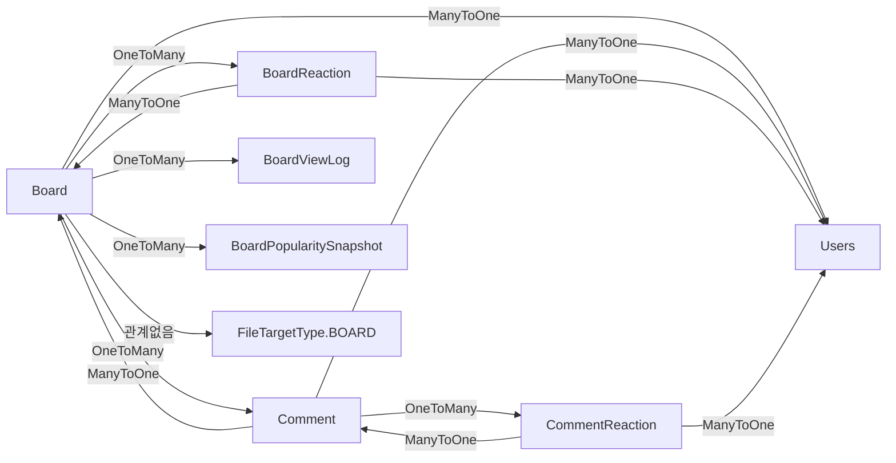

# 도메인 간 연관관계

## 전체 도메인 관계도


## 핵심 연관관계

### 1. Users (사용자) 중심 관계

Users는 시스템의 중심으로, 거의 모든 도메인과 연관됩니다.

| 대상 도메인 | 관계 유형 | 역할 | 비고 |
|------------|----------|------|------|
| Pet | OneToMany | 소유자 | 반려동물 등록 |
| Board | OneToMany | 작성자 | 게시글 작성 |
| Comment | OneToMany | 작성자 | 댓글 작성 |
| BoardReaction | OneToMany | 반응자 | 좋아요/싫어요 |
| CareRequest | OneToMany | 요청자 | 펫케어 요청 |
| CareApplication | OneToMany | 지원자 | 펫케어 지원 |
| CareReview | ManyToOne (2개) | 작성자/대상 | 리뷰 작성 및 받음 |
| MissingPetBoard | OneToMany | 신고자 | 실종 신고 |
| Meetup | OneToMany | 주최자 | 모임 주최 |
| MeetupParticipants | OneToMany | 참여자 | 모임 참여 |
| LocationServiceReview | OneToMany | 작성자 | 위치 서비스 리뷰 |
| Report | OneToMany (2개) | 신고자/처리자 | 신고 접수 및 처리 |
| UserSanction | OneToMany | 제재 대상 | 제재 이력 |
| Notification | OneToMany | 수신자 | 알림 받음 |

### 2. Board (게시판) 중심 관계



**특징:**
- Board와 Comment는 양방향 관계
- Reaction은 User와 Board/Comment에 대한 다대다 관계를 중간 테이블로 구현
- ViewLog로 조회수 중복 방지
- PopularitySnapshot으로 인기글 계산 최적화

### 3. Care (펫케어) 중심 관계


**특징:**
- CareRequest와 CareApplication은 일대다 (1:N)
- CareRequest와 CareReview는 일대일 (1:1)
- CareReview는 Users와 두 번 연결 (작성자, 대상)

### 4. Report (신고) 중심 관계

Report는 **폴리모픽 연관관계**를 사용합니다.

```java
@Entity
public class Report {
    @Enumerated(EnumType.STRING)
    private ReportTargetType targetType;  // BOARD, COMMENT, CARE_REQUEST, USER, etc.
    
    private Long targetIdx;  // 대상 ID
    
    @ManyToOne
    private Users reporter;  // 신고자
    
    @ManyToOne
    private Users handledBy;  // 처리자
}
```

**장점:**
- 다양한 타입의 콘텐츠를 신고 가능
- 테이블 하나로 모든 신고 관리

**단점:**
- 타입별 조회 시 조건 필요
- 외래 키 제약 조건 사용 불가

### 5. File (파일) 중심 관계

AttachmentFile도 폴리모픽 연관관계를 사용합니다.

```java
@Entity
public class AttachmentFile {
    @Enumerated(EnumType.STRING)
    private FileTargetType targetType;  // BOARD, CARE_REQUEST, MISSING_PET, etc.
    
    private Long targetIdx;  // 대상 ID
}
```

**대상 도메인:**
- Board (게시글 첨부)
- CareRequest (펫케어 사진)
- MissingPetBoard (실종 동물 사진)
- LocationService (서비스 이미지)
- Users (프로필 사진)
- Pet (펫 프로필 사진)

## 도메인별 의존성

### 의존 방향

```
┌─────────────────────────────────────────┐
│               Users (중심)               │
│                  Pet                     │
└───────────────┬─────────────────────────┘
                │
    ┌───────────┼───────────┬───────────┐
    │           │           │           │
┌───▼────┐  ┌──▼──────┐ ┌──▼──────┐ ┌─▼────────┐
│ Board  │  │  Care   │ │ Missing │ │  Meetup  │
│        │  │ Request │ │   Pet   │ │          │
└───┬────┘  └──┬──────┘ └─────────┘ └──────────┘
    │          │
┌───▼────┐  ┌──▼──────────┐
│Comment │  │CareApplicat.│
└────────┘  └─────────────┘

    ┌────────────────────────────┐
    │      지원 도메인            │
    ├────────────────────────────┤
    │ File, Report, Notification │
    │ Location, Activity, Stats  │
    └────────────────────────────┘
```

### 의존성 규칙

1. **핵심 도메인 → 사용자 도메인**
   - Board, Care, MissingPet, Meetup은 모두 Users에 의존

2. **지원 도메인 → 핵심 도메인**
   - File, Report, Notification은 여러 도메인을 지원
   - 폴리모픽 관계로 느슨한 결합

3. **도메인 간 직접 의존 최소화**
   - Board → Care (X)
   - CareRequest → Pet (O, 펫 정보 필요)

## 트랜잭션 경계와 일관성

### 강한 일관성이 필요한 경우

1. **Board + Comment**
   - 댓글 추가 시 게시글의 `commentCount` 증가
   - 같은 트랜잭션 내에서 처리

```java
@Transactional
public CommentDTO createComment(CommentDTO dto) {
    Comment comment = commentRepository.save(...);
    
    // 게시글 댓글 수 증가
    board.setCommentCount(board.getCommentCount() + 1);
    boardRepository.save(board);
    
    return converter.toDTO(comment);
}
```

2. **CareRequest + CareApplication**
   - 지원 승인 시 요청 상태 변경
   - 비관적 락 또는 낙관적 락 사용

```java
@Transactional
public void approveApplication(long requestId, long applicationId) {
    CareRequest request = requestRepository.findByIdWithLock(requestId);
    
    // 이미 승인된 지원 확인
    if (hasApprovedApplication(request)) {
        throw new IllegalStateException("Already approved");
    }
    
    application.setStatus(APPROVED);
    request.setStatus(IN_PROGRESS);
}
```

### 약한 일관성이 허용되는 경우

1. **Notification 생성**
   - 비동기로 처리
   - 실패해도 핵심 비즈니스에 영향 없음

```java
@Async
public void sendNotification(Long userId, String content) {
    notificationRepository.save(new Notification(...));
}
```

2. **Activity 로깅**
   - 별도 트랜잭션으로 처리
   - 실패해도 재시도 또는 무시

3. **Statistics 수집**
   - 배치 작업으로 처리
   - 일별 집계

## 순환 참조 방지

### DTO 변환 시 주의

**문제:**
```java
BoardDTO {
    UserDTO user {
        List<BoardDTO> boards;  // 순환 참조!
    }
}
```

**해결:**
```java
// BoardDTO에서는 UserDTO 대신 간단한 정보만
BoardDTO {
    Long userId;
    String username;
    // UserDTO user; (X)
}

// 또는 @JsonIgnore 사용
class Users {
    @JsonIgnore
    List<Board> boards;
}
```

## 캐스케이드 설정

### CascadeType 사용

1. **ALL (모두)**
   - Board → Comment
   - 게시글 삭제 시 댓글도 삭제

```java
@OneToMany(mappedBy = "board", cascade = CascadeType.ALL)
private List<Comment> comments;
```

2. **PERSIST (저장만)**
   - CareRequest → CareApplication
   - 요청 삭제 시 지원은 유지 (이력)

```java
@OneToMany(mappedBy = "careRequest", cascade = CascadeType.PERSIST)
private List<CareApplication> applications;
```

3. **없음**
   - Board → Users
   - 게시글 삭제 시 사용자는 영향 없음

## 성능 고려사항

### 1. Fetch 전략

**LAZY (권장):**
```java
@ManyToOne(fetch = FetchType.LAZY)
private Users user;
```

**EAGER (주의):**
```java
@ManyToOne(fetch = FetchType.EAGER)  // 필요시만
private Users user;
```

### 2. N+1 문제 해결

**Fetch Join:**
```java
@Query("SELECT b FROM Board b JOIN FETCH b.user WHERE b.idx = :id")
Board findByIdWithUser(@Param("id") Long id);
```

**Batch Size:**
```yaml
spring:
  jpa:
    properties:
      hibernate:
        default_batch_fetch_size: 100
```

### 3. 인덱스 설계

**외래 키 인덱스:**
```sql
CREATE INDEX idx_board_user ON board(user_idx);
CREATE INDEX idx_comment_board ON comment(board_idx);
CREATE INDEX idx_care_application_request ON care_application(care_request_idx);
```

**복합 인덱스:**
```sql
-- 사용자별 게시글 조회
CREATE INDEX idx_board_user_deleted ON board(user_idx, is_deleted, created_at DESC);

-- 상태별 펫케어 요청
CREATE INDEX idx_care_request_status ON carerequest(status, is_deleted, date DESC);
```

## 도메인 이벤트 (개선안)

### 현재 방식의 한계

```java
// 댓글 작성 시 알림을 Service에서 직접 호출
@Transactional
public CommentDTO createComment(CommentDTO dto) {
    Comment comment = commentRepository.save(...);
    
    // 직접 의존
    notificationService.notifyCommentCreated(comment);
    
    return dto;
}
```

### 이벤트 기반 개선

```java
// 이벤트 발행
@Transactional
public CommentDTO createComment(CommentDTO dto) {
    Comment comment = commentRepository.save(...);
    
    // 이벤트 발행
    eventPublisher.publishEvent(new CommentCreatedEvent(comment));
    
    return dto;
}

// 이벤트 리스너 (비동기)
@Async
@EventListener
public void handleCommentCreated(CommentCreatedEvent event) {
    notificationService.notifyCommentCreated(event.getComment());
}
```

**장점:**
- 도메인 간 결합도 감소
- 비동기 처리 용이
- 확장성 향상

