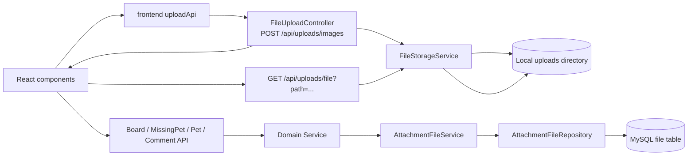
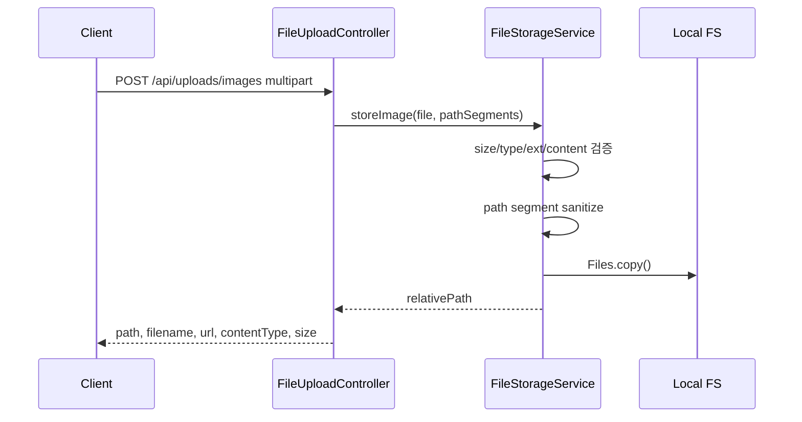
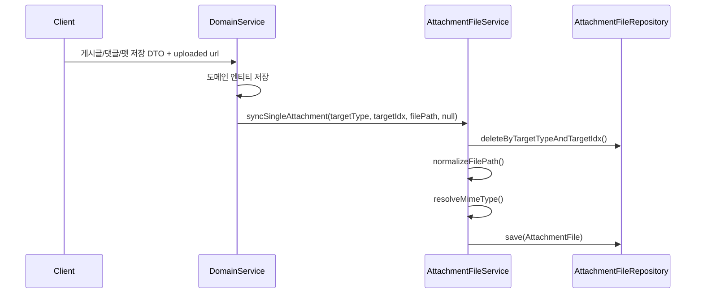
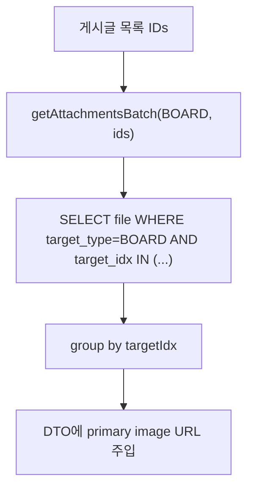
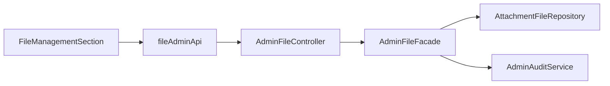

# 첨부파일 저장 & 연결 아키텍처

> 현재 코드 기준. File 도메인은 로컬 파일 저장과 도메인별 첨부 메타데이터 연결을 분리한다.

---

## 1. 전체 구조



파일 업로드와 도메인 첨부 연결은 한 번에 일어나지 않는다.

1. 프론트가 먼저 `/api/uploads/images`로 파일을 업로드한다.
2. 응답의 `url` 또는 `path`를 도메인 DTO에 담아 게시글/댓글/펫 등을 저장한다.
3. 각 도메인 서비스가 `AttachmentFileService.syncSingleAttachment()`로 `file` 테이블에 연결한다.

---

## 2. 저장소 구조

`FileStorageService`는 `file.upload-dir` 설정값을 업로드 루트로 사용한다.

- 기본값: `uploads`
- 저장 방식: `java.nio.file.Files.copy`
- 조회 방식: `UrlResource`
- 공개 조회 URL: `/api/uploads/file?path={relativePath}`

경로 예시:

```text
uploads/
  community/user/1/20260619_<uuid>.jpg
  missing-pets/user/1/10/20260619_<uuid>.png
  pets/user/1/3/20260619_<uuid>.webp
  chat/user/1/99/20260619_<uuid>.jpg
```

DB에는 `uploads/` 접두사 없이 업로드 루트 기준 상대경로를 저장한다.

---

## 3. Backend 레이어

| 레이어 | 역할 |
|---|---|
| `FileUploadController` | 업로드 요청 수신, 다운로드 URL 조립, Resource 응답 |
| `FileStorageService` | 이미지 검증, 저장 경로 생성, 물리 파일 저장/로드 |
| `AttachmentFileService` | 도메인 대상과 파일 경로 연결, 배치 조회, URL 생성 |
| `AttachmentFileRepository` | 도메인 repository 인터페이스 |
| `JpaAttachmentFileAdapter` | Spring Data JPA adapter |
| `AdminFileFacade` | 관리자 파일 조회/삭제와 감사 로그 |

---

## 4. 업로드 시퀀스



검증:

- 최대 5MB
- image MIME type allowlist
- 이미지 확장자 allowlist
- WebP는 RIFF/WEBP magic bytes
- WebP 외 이미지는 `ImageIO.read()`

---

## 5. 도메인 연결 시퀀스



`syncSingleAttachment()`는 기존 row를 지우고 새 row 1개를 저장한다. 다중 첨부가 아니라 대표 이미지/첫 번째 첨부 중심 구조다.

---

## 6. 조회 최적화

목록 화면에서는 각 게시글/댓글마다 첨부파일을 따로 조회하면 N+1이 된다.

File 도메인은 `findByTargetTypeAndTargetIdxIn(targetType, targetIndices)`를 제공한다.



사용처:

- Board 목록/상세/인기 스냅샷
- Comment 목록
- MissingPet 목록/상세/댓글
- Pet 목록/DTO 변환

---

## 7. 보안 경계

| 영역 | 정책 |
|---|---|
| 업로드 | `POST /api/uploads/images`는 인증 필요 |
| 조회 | `GET /api/uploads/**`는 공개 |
| 경로 | `uploadLocation.resolve(relativePath).normalize()` 후 root 밖이면 거부 |
| 디렉터리명 | path segment sanitizer 적용 |
| 파일 종류 | 이미지 MIME/확장자/실제 content 검증 |
| 관리자 | `/api/admin/files/**`는 `ADMIN` 또는 `MASTER` |

---

## 8. 도메인별 사용 방식

| 도메인 | FileTargetType | 연결 방식 |
|---|---|---|
| Board | `BOARD` | 게시글 대표 이미지 |
| Comment | `COMMENT` | 일반 게시글 댓글 이미지 |
| MissingPet | `MISSING_PET` | 실종 제보 대표 이미지 |
| MissingPet Comment | `MISSING_PET_COMMENT` | 실종 제보 댓글 이미지 |
| Care Comment | `CARE_COMMENT` | 케어 댓글 첫 번째 첨부 |
| Pet | `PET` | 반려동물 프로필 이미지 |
| Chat | 없음 | 업로드 URL을 `IMAGE` 메시지 content로 저장 |

---

## 9. 관리자 파일 관리



지원 API:

- 파일 목록 페이징
- target별 파일 목록
- 파일 row 단건 삭제
- target별 파일 row 일괄 삭제

현재 관리자 삭제는 DB row 삭제이며, 물리 파일 삭제는 하지 않는다.

---

## 10. 현재 설계 경계

- 로컬 파일 시스템 저장이다. S3/외부 object storage 연동은 없다.
- 업로드 파일과 도메인 저장 트랜잭션은 분리되어 있어 orphan 물리 파일이 생길 수 있다.
- `file` row 삭제와 물리 파일 삭제가 연결되어 있지 않다.
- `FileTargetType` enum에 없는 타입은 첨부 메타데이터로 연결할 수 없다.
- 관리자 UI의 통계 호출과 일부 target type 옵션은 백엔드 현재 API/enum과 불일치한다.
