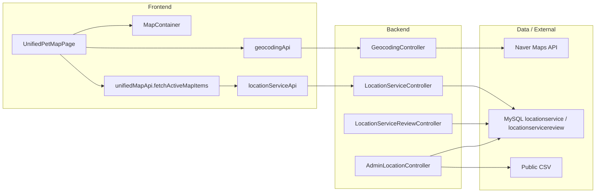
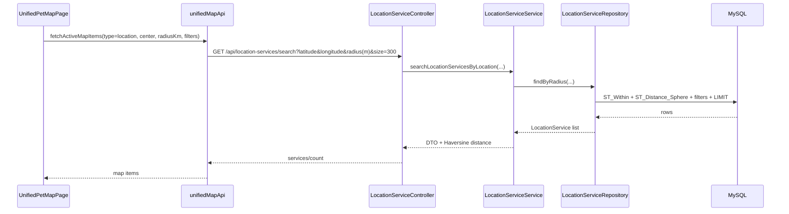
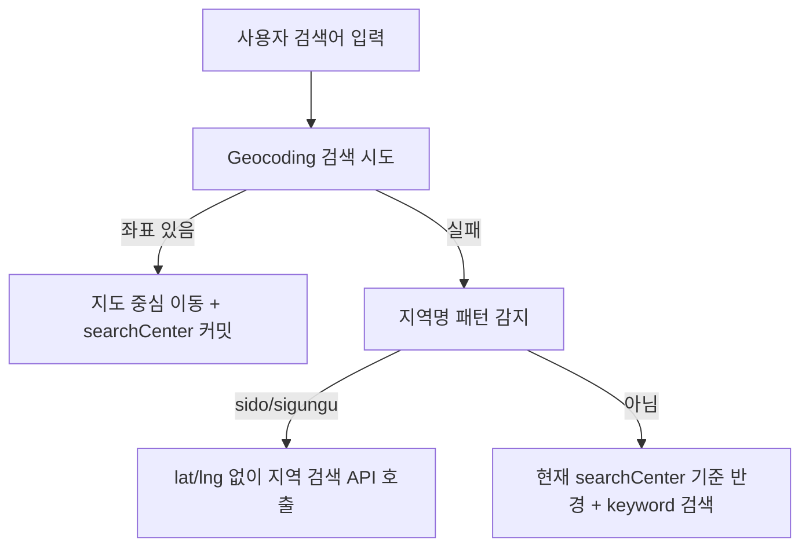

# 위치 기반 서비스 아키텍처

> 기준: Location 도메인과 통합 지도 주변서비스 탭의 현재 프론트/백엔드 연결 구조를 설명한다. 현재 명세는 `docs/domains/location.md`와 코드가 우선이며, 리팩토링/트러블슈팅 문서는 히스토리로 둔다.

## 1. 아키텍처 범위

이 문서는 다음 네 영역의 연결을 다룬다.

| 영역 | 설명 |
|---|---|
| Location 검색 | DB에 저장된 장소 POI를 반경, 지역, keyword, category로 검색 |
| 통합 지도 | 주변서비스/모임/펫케어를 한 화면에서 탭별로 조회하는 프론트 UI |
| Geocoding | 주소 검색, 주소-좌표 변환, 좌표-주소 변환, 길찾기 |
| Location Review | 시설 리뷰 CRUD와 시설 평점/리뷰 수 캐시 갱신 |

통합 지도는 백엔드에 단일 BFF를 두지 않는다. 프론트가 활성 탭에 맞는 도메인별 REST API를 직접 조합한다.



## 2. 프론트엔드 구성

| 역할 | 파일 |
|---|---|
| 통합 지도 화면 | `frontend/src/components/UnifiedMap/UnifiedPetMapPage.js` |
| 지도 탭 헤더 | `frontend/src/components/UnifiedMap/DomainTabHeader.js` |
| 주변서비스 컨트롤 | `frontend/src/components/UnifiedMap/controls/LocationControls.js` |
| 반경 필터 | `frontend/src/components/UnifiedMap/RadiusFilter.js` |
| 공통 지도 래퍼 | `frontend/src/components/LocationService/MapContainer.js` |
| 위치 서비스 API | `frontend/src/api/locationServiceApi.js` |
| 통합 지도 API 어댑터 | `frontend/src/api/unifiedMapApi.js` |
| 지오코딩 API | `frontend/src/api/geocodingApi.js` |

### 통합 지도 탭별 호출

`unifiedMapApi.fetchActiveMapItems()`는 활성 탭 하나만 조회한다.

| 탭 | 호출 API | limit 정책 |
|---|---|---|
| 주변서비스 | `locationServiceApi.searchPlaces` → `/api/location-services/search` | `size=300` 고정 |
| 모임 | `meetupApi.getNearbyMeetups` → `/api/meetups/nearby` | mapLevel 기반 |
| 펫케어 | `careRequestApi.getNearby` → `/api/care-requests/nearby` | mapLevel 기반 |

Location 결과는 `toMapItem()`에서 공통 지도 모델로 변환된다.

```javascript
{
  idx,
  name,
  latitude,
  longitude,
  markerColor,
  id: `location-${idx}`,
  type: 'location',
  title,
  subtitle,
  raw
}
```

## 3. 지도 상태 구조

통합 지도는 화면 중심과 검색 기준을 분리한다.

| 상태 | 의미 |
|---|---|
| `mapViewportCenter` | 사용자가 현재 보고 있는 지도 중심 |
| `searchCenter` | Location API에 실제로 보낸 검색 중심 |
| `radius` | UI 반경, km 단위 |
| `mapLevel` | 지도 줌 레벨. Location 조회에는 영향 주지 않고 Meetup/Care limit에만 사용 |
| `hasPendingAreaChange` | 현재 지도 중심과 검색 기준이 충분히 멀어졌는지 |

Location 조회 기준:

```javascript
const effectiveFetchCenter =
  activeLayer === "location" ? searchCenter : mapViewportCenter;
```

Location 탭에서 지도 이동만으로 검색을 재실행하지 않는다. 사용자가 `"이 지역 검색"`을 누르면 `mapViewportCenter`를 `searchCenter`로 커밋한다.

`"이 지역 검색"` 표시 기준:

```text
max(300m, radius * 10%)
```

## 4. 검색 요청 흐름

### 4.1 메인 반경 검색



### 4.2 검색창 fallback



## 5. 백엔드 레이어

| 레이어 | 주요 타입 | 책임 |
|---|---|---|
| Controller | `LocationServiceController` | `/api/location-services/search`, soft delete |
| Service | `LocationServiceService` | 검색 파라미터 정규화, 이벤트 발행, 거리 계산 |
| Repository Port | `LocationServiceRepository` | 도메인 서비스가 의존하는 저장소 인터페이스 |
| Adapter | `JpaLocationServiceAdapter` | Spring Data repository 위임 |
| Spring Data | `SpringDataJpaLocationServiceRepository` | native query, FULLTEXT, 공간 검색, 통계 업데이트 |
| Entity | `LocationService` | 장소 데이터, 카테고리, 좌표, 평점/리뷰 수 캐시 |

검색 컨트롤러는 파라미터 조합으로 서비스 메서드를 직접 선택한다.

```text
위치 있음 -> searchLocationServicesByLocation
지역 있음 -> searchLocationServicesByRegion
keyword만 있음 -> searchLocationServicesByKeyword
조건 없음 -> searchLocationServicesByRegion(null, null, ...)
```

## 6. DB 검색 구조

### 6.1 반경 검색

반경 검색은 `locationservice.location` POINT 컬럼을 대상으로 한다. 엔티티에는 POINT를 직접 매핑하지 않고, `latitude`, `longitude` 필드와 DB 공간 컬럼을 함께 사용한다.

쿼리 구성:

1. `ST_Within(... POLYGON ...)`으로 근사 사각형 후보 축소
2. `ST_Distance_Sphere(... POINT ...) <= radius`로 실제 반경 필터
3. `is_deleted = 0`
4. keyword/category 필터
5. 정렬
6. `LIMIT :limit`

이 구조는 공간 인덱스로 후보군을 줄인 뒤 원형 거리 조건을 적용하는 방식이다.

### 6.2 지역 검색

활성 쿼리:

- `findBySigungu`
- `findBySido`
- `findByOrderByRatingDesc`

지역 쿼리는 `USE INDEX` 힌트를 사용한다. keyword는 `name LIKE`, category는 `category1/2/3` 일치 조건이다.

비활성/미사용:

- `findByEupmyeondong`
- `findByRoadName`

현재 메인 지도는 읍면동/도로명 직접 파라미터보다 geocoding을 통한 좌표 변환 후 반경 검색을 우선한다.

### 6.3 FULLTEXT 검색

위치와 지역 파라미터가 없고 keyword만 있을 때 사용한다.

대상 필드:

- `name`
- `description`
- `category1`
- `category2`
- `category3`

쿼리:

```sql
MATCH(name, description, category1, category2, category3)
AGAINST(CONCAT(:keyword, '*') IN BOOLEAN MODE)
```

## 7. 정렬과 결과 안정성

Location의 기본 정렬은 `stable`이다.

이유:

- 거리순은 중심 좌표가 조금만 달라져도 절단선 근처 결과가 바뀐다.
- 지도 확대/축소가 결과 수나 캐시 키에 영향을 주면 같은 지역 검색이 다르게 보인다.
- 기본 조회에서는 결과 안정성이 더 중요하다.

현재 정책:

- 프론트 기본값: `locationSort = "stable"`
- UI 라벨: “추천순”
- Location size: `300`
- Location 캐시 키: `type`, `lat`, `lng`, `radius`, `keyword`, `category`, `sort`
- Location 캐시 키에서 `mapLevel` 제외
- Meetup/Care만 `mapLevel` 기반 limit 사용

## 8. 리뷰 구조

리뷰 레이어:

| 레이어 | 주요 타입 |
|---|---|
| Controller | `LocationServiceReviewController` |
| Service | `LocationServiceReviewService` |
| Repository Port | `LocationServiceReviewRepository` |
| Adapter | `JpaLocationServiceReviewAdapter` |
| Spring Data | `SpringDataJpaLocationServiceReviewRepository` |
| Entity | `LocationServiceReview` |

정책:

- 인증 사용자만 접근 가능하다.
- 생성 시 현재 JWT 사용자를 작성자로 사용한다.
- 같은 서비스에 사용자당 1개 리뷰만 허용한다.
- 이메일 인증이 필요하다.
- 수정/삭제는 작성자만 가능하다.
- 삭제는 soft delete다.

리뷰 통계:

- 리뷰 생성/수정/삭제 후 `locationservice.rating`, `locationservice.review_count`를 갱신한다.
- 갱신은 DB 단일 UPDATE로 수행한다.
- 평균과 카운트는 soft delete되지 않은 리뷰만 대상으로 한다.

Fetch 전략:

- 서비스별 리뷰 목록은 user fetch join을 사용한다.
- 사용자별 리뷰 목록은 service fetch join을 사용한다.
- 수정/삭제 단건 조회는 user와 service를 함께 가져온다.

## 9. Geocoding 구조

`GeocodingController`는 Naver Maps API 호출을 서버에서 감싼다.

| API | 백엔드 처리 |
|---|---|
| `/api/geocoding/address` | 주소 → 좌표 |
| `/api/geocoding/search` | 주소 후보 검색 |
| `/api/geocoding/coordinates` | 좌표 → 주소 |
| `/api/geocoding/directions` | 길찾기 |

길찾기 좌표는 `경도,위도` 형식이다.

서버가 외부 API 키를 보관하므로 프론트에 Naver Maps API secret을 노출하지 않는다.

## 10. 관리자와 배치 적재

관리자 API는 `AdminLocationController`가 제공한다.

```text
/api/admin/location-services
```

권한:

- 목록 조회: `ADMIN`, `MASTER`
- 초기 로드/CSV 임포트: `MASTER`

CSV 임포트:

- 파일 업로드 방식과 경로 방식이 있다.
- 업로드 방식은 확장자 `.csv`, 허용 Content-Type, 최대 200MB를 검증한다.
- `PublicDataLocationService`가 CSV를 읽고, batch writer를 통해 저장한다.

## 11. 도메인 간 연결

### Recommendation

Location 검색 keyword는 `LocationSearchPerformedEvent`로 추천 도메인에 전달된다. 추천 도메인은 intent signal을 만들고, 주변서비스 탭은 signal을 카드로 보여준다. 카드 선택은 Location `category` 필터 검색으로 연결된다.

### Meetup / Care

Meetup과 Care는 통합 지도 UI를 공유하지만 백엔드 Location 패키지에 속하지 않는다. `unifiedMapApi`에서 탭별 API를 분기한다.

### Admin

위치 서비스 목록 조회와 CSV 적재는 Admin 도메인의 컨트롤러에서 진입하지만, 검색과 적재의 핵심 로직은 Location 도메인의 서비스에 위임한다.

## 12. 남은 구조적 과제

- Location 검색 컨트롤러와 리뷰 컨트롤러에 수동 try-catch 응답 조립이 남아 있다.
- Geocoding 컨트롤러에도 외부 API 실패를 컨트롤러에서 직접 응답하는 코드가 많다.
- 반경 검색 API는 원형 반경 중심이다. 뷰포트 바운딩 박스 검색은 장기 개선안이다.
- 지역 계층 검색은 백엔드에 남아 있지만, 메인 지도 UX와 완전히 같은 수준의 1차 경로는 아니다.
- 위치/지역 keyword 검색과 keyword 단독 FULLTEXT 검색의 검색 범위가 다르다.

## 13. 관련 문서

- [Location 도메인](../../domains/location.md)
- [Location 지도 결과 안정성 리팩토링](../../refactoring/location/지도-결과-안정성-리팩토링.md)
- [Location 프론트 검색 워크플로우 정리](../../refactoring/location/지도-검색-워크플로우-정리.md)
- [주변서비스 현행 vs 설계안 비교](../../refactoring/location/주변서비스-현행vs설계안-비교.md)
- [Location 도메인 초기 로드 성능 문제](../../troubleshooting/location/initial-load-performance.md)
- [지도 서비스 UX 개선 트러블슈팅](../../troubleshooting/location/map-ux-improvement.md)
