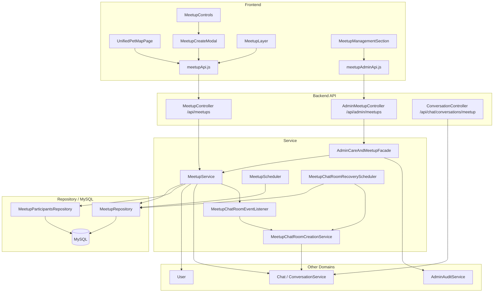
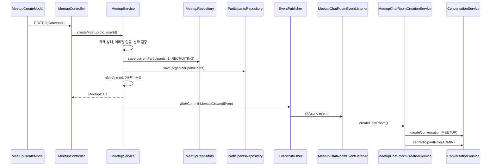
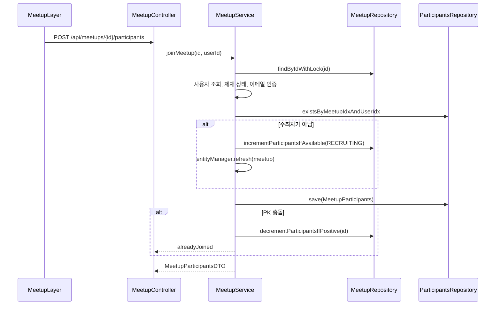
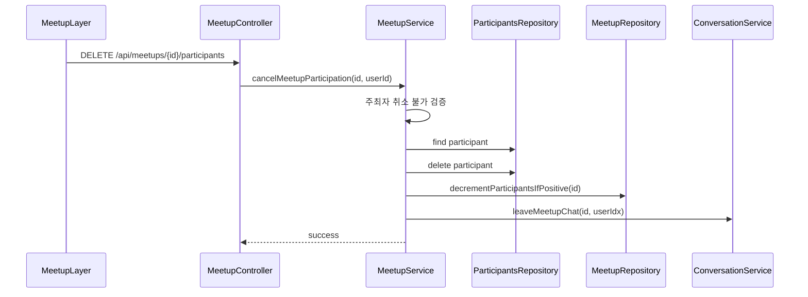
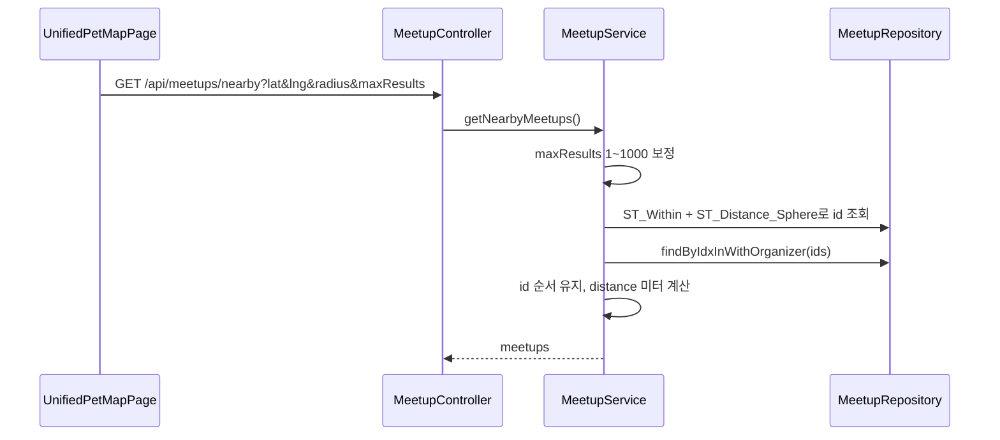
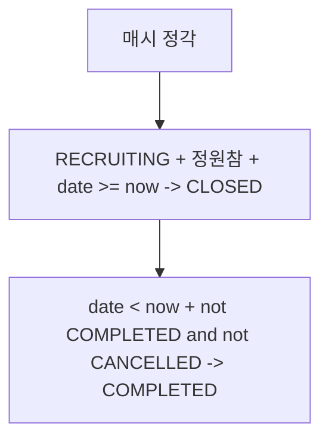

# 산책 & 오프라인 모임 아키텍처

> 기준: 현재 코드. Meetup은 모임 CRUD/참가/위치 조회를 담당하고, Chat은 그룹 채팅방 생성·입장·나가기를 담당한다.

## 1. 개요

Meetup 아키텍처는 지도 기반 산책 모임 노출, 모임 생성, 참가자 수 동시성 제어, 상태 자동 전이, 그룹 채팅방 연동을 연결한다.

핵심 특징:

- 모든 사용자 meetup API는 인증 사용자만 접근한다.
- 모임 생성 시 주최자가 자동 참가자로 저장된다.
- 모임 생성 커밋 이후 비동기로 그룹 채팅방을 생성한다.
- 참가 시 비관적 락, 조건부 UPDATE, 복합 PK로 정원 초과를 방지한다.
- 근처 모임은 MySQL 공간 함수로 후보 ID를 먼저 조회한다.
- 채팅방 생성 실패는 복구 스케줄러가 보정한다.
- 제재된 주최자의 모집 중 모임은 `CANCELLED`로 전환하고 일반 사용자 조회에서 제외한다.

## 2. 전체 구조

## 3. 프론트엔드 연결

| 화면/모듈                 | 역할                              | API 모듈                   |
| ------------------------- | --------------------------------- | -------------------------- |
| `UnifiedPetMapPage`       | 통합 지도에서 모임 레이어 표시    | `meetupApi.js`             |
| `MeetupCreateModal`       | 모임 생성                         | `meetupApi.createMeetup()` |
| `MeetupLayer`             | 모임 상세, 참가/취소, 참가자 목록 | `meetupApi.js`             |
| `MeetupManagementSection` | 관리자 모임 관리                  | `meetupAdminApi.js`        |

프론트 API base URL:

- 사용자 모임: `http://localhost:8080/api/meetups`
- 관리자 모임: `http://localhost:8080/api/admin/meetups`

## 4. 백엔드 레이어

### Controller

`MeetupController`는 클래스 단위 `@PreAuthorize("isAuthenticated()")`로 보호된다.

주요 책임:

- 모임 생성/수정/삭제
- 목록/상세/검색/근처/홈 추천
- 참가자 조회
- 참가/취소
- 참가 여부와 히스토리 좋아요

`AdminMeetupController`는 `ADMIN`, `MASTER` 관리자 경로를 담당한다.

### Service

| 서비스                            | 책임                                       |
| --------------------------------- | ------------------------------------------ |
| `MeetupService`                   | 모임 CRUD, 조회, 참가/취소, 추천, 히스토리 |
| `MeetupScheduler`                 | 정원 마감/일시 경과 상태 전이              |
| `MeetupChatRoomEventListener`     | 생성 이벤트 수신                           |
| `MeetupChatRoomCreationService`   | 그룹 채팅방 생성, 주최자 ADMIN 설정, retry |
| `MeetupChatRoomRecoveryScheduler` | 채팅방 없는 모임 복구                      |
| `AdminCareAndMeetupFacade`        | 관리자 작업과 감사 로그 연결               |

## 5. 주요 데이터 흐름

### 모임 생성과 채팅방 생성

채팅방 생성은 모임 생성 트랜잭션 밖에서 실행된다.

### 참가

정원과 중복 참가를 동시에 방어한다.

### 참가 취소

채팅방 나가기 실패는 로그만 남기고 참가 취소는 롤백하지 않는다.

### 근처 모임 조회

거리 필터와 정렬은 DB에서 수행하고, DTO distance는 서비스에서 미터 단위로 보정한다.

## 6. 상태와 스케줄러

`MeetupScheduler.transitionMeetupStatuses()`는 매시 정각 실행된다.

전이는 repository bulk update로 처리된다.

`CANCELLED`는 제재 등으로 취소된 모임 상태이며, 스케줄러가 이후 `COMPLETED`로 덮어쓰지 않는다.

## 7. 채팅방 복구

`MeetupChatRoomRecoveryScheduler`는 5분마다 채팅방 없는 모임을 찾는다.

흐름:

1. `findWithoutChatRoom()` 조회
2. 각 모임에 `MeetupChatRoomCreationService.createChatRoom()` 호출
3. 실패 시 로그 기록

`createChatRoom()` 자체도 `@Retryable(maxAttempts=3)`로 재시도한다.

## 8. 조회 최적화

| 흐름           | 최적화                                              |
| -------------- | --------------------------------------------------- |
| 전체 목록      | `EntityGraph(organizer)` + DB 페이징                |
| 상세           | 주최자/참가자/참가자 사용자 fetch join              |
| 참여 가능 목록 | count 없는 `Slice`                                  |
| 근처 조회      | 공간 함수로 id 조회 후 주최자 fetch                 |
| 키워드 검색    | FULLTEXT id 조회 후 주최자 fetch                    |
| 참가자 목록    | meetup/user fetch join                              |
| 히스토리       | participants -> meetup -> organizer/user fetch join |
| 참가 동시성    | row lock + 조건부 UPDATE + 복합 PK                  |

일반 사용자 목록/상세/키워드/근처 조회는 `CANCELLED` 모임을 제외한다. 관리자 조회는 status 필터로 `CANCELLED` 상태를 확인할 수 있다.

## 8.1 제재 이벤트 후속 처리

`UserSanctionAppliedEvent`를 `UserSanctionMeetupEventListener`가 `AFTER_COMMIT` 이후 별도 트랜잭션에서 처리한다.

| 대상   | 처리                                                                                 |
| ------ | ------------------------------------------------------------------------------------ |
| 주최자 | 해당 사용자가 주최한 `RECRUITING` 모임을 `CANCELLED`로 전환                          |
| 참가자 | 취소되지 않은 진행 예정 모임의 일반 참가 row 삭제, `currentParticipants` 원자적 감소 |
| 채팅   | 참가 취소 후 `leaveMeetupChat()` 시도. 실패해도 참가 취소는 유지                     |

과거 모임 히스토리 row와 주최자 참가 row는 참가 취소 대상에서 제외한다.

## 9. 관리자 흐름

관리자 API는 `AdminMeetupController -> AdminCareAndMeetupFacade -> MeetupService/MeetupRepository`로 이어진다.

기능:

- status/q/page/size 목록
- 단건 조회
- soft delete
- 참가자 목록 조회
- 감사 로그

관리자 키워드 검색은 title/description FULLTEXT와 location LIKE를 조합한다.

## 10. 도메인 경계

| 도메인     | 연결                                 |
| ---------- | ------------------------------------ |
| User       | 주최자/참가자, 이메일 인증           |
| Chat       | 그룹 채팅방 생성, 입장, 나가기, 복구 |
| Admin      | 관리자 조회/삭제/감사 로그           |
| Statistics | 생성/참여 통계 집계                  |

## 11. 현재 설계상 주의점

- 참가와 채팅방 입장이 분리되어 있다.
- 채팅방 생성은 eventual consistency다.
- `CLOSED`에서 정원이 다시 비어도 자동 `RECRUITING` 복귀가 없다.
- 홈 추천 점수는 애플리케이션에서 계산한다.
- 일부 조회 API는 500개 상한으로 잘라내며 완전 페이징이 아니다.

## 12. 관련 문서

- [Meetup 도메인](../../domains/meetup.md)
- [Meetup 백엔드 성능 최적화](../../refactoring/meetup/meetup-backend-performance-optimization.md)
- [Meetup 참가자 Race Condition](../../troubleshooting/meetup/race-condition-participants.md)
- [Meetup N+1 쿼리 이슈](../../troubleshooting/meetup/n-plus-one-query-issue.md)
- [Meetup 채팅방 복구 스케줄러 N+1](../../refactoring/meetup/recovery-scheduler-n-plus-one.md)
- [근처 모임 인덱스 분석](../../refactoring/meetup/nearby-meetups/index-analysis.md)
