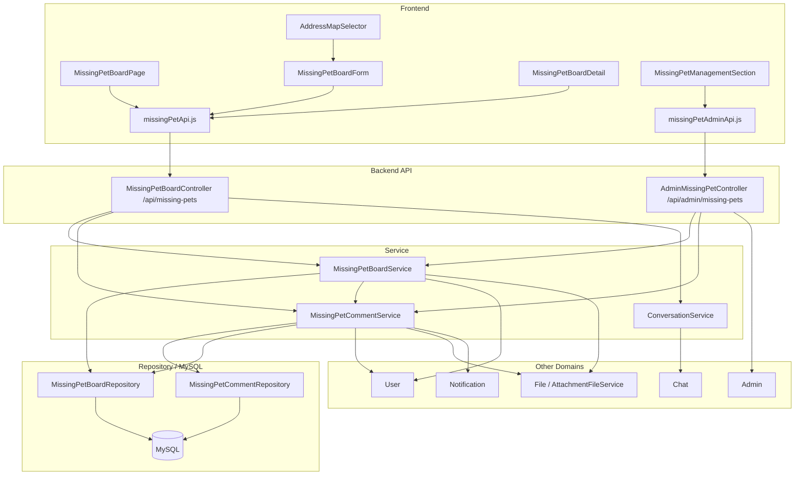
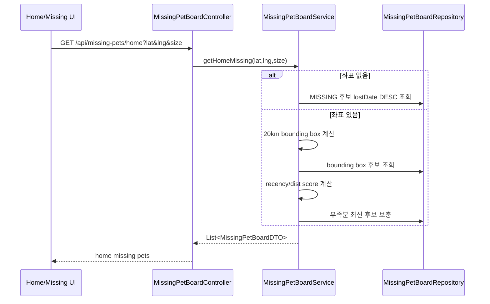
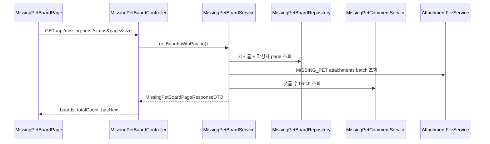
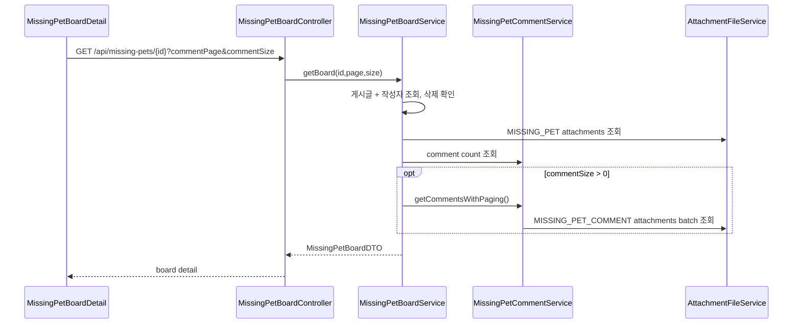
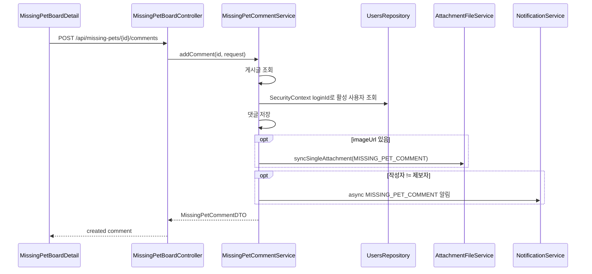
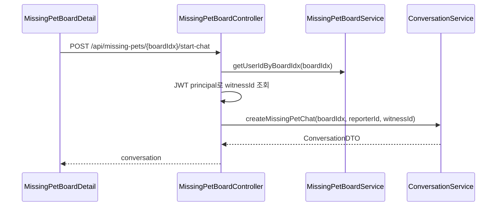

# 실종 제보 아키텍처

> 기준: 현재 코드. MissingPet은 일반 Board와 같은 패키지에 있지만, 실종 제보 전용 게시글·목격 댓글·채팅 시작 흐름으로 분리해서 본다.

## 1. 개요

실종 제보 아키텍처는 실종 반려동물 정보를 지도/목록에 노출하고, 목격자가 위치 기반 댓글을 남기며, 제보자와 목격자가 채팅으로 이어질 수 있게 한다.

핵심 특징:

- 실종 위치와 목격 위치를 좌표로 저장한다.
- 홈 화면은 위치와 실종일을 조합해 실종 제보를 추천한다.
- 목록은 댓글을 제외하고 첨부파일/댓글 수를 batch 조회한다.
- 댓글은 목격 위치와 이미지를 포함할 수 있다.
- 채팅 시작은 JWT 사용자와 게시글 작성자 projection 조회로 연결한다.
- 관리자 페이지는 DB 레벨 필터링과 페이징을 사용한다.

## 2. 전체 구조

## 3. 프론트엔드 연결

| 화면/모듈                     | 역할                             | API 모듈                      |
| ----------------------------- | -------------------------------- | ----------------------------- |
| `MissingPetBoardPage`         | 실종 제보 목록/필터/상세 진입    | `missingPetApi.js`            |
| `MissingPetBoardForm`         | 실종 제보 작성/수정              | `missingPetApi.create/update` |
| `AddressMapSelector`          | 실종 위치/목격 위치 선택         | form/detail 내부              |
| `MissingPetBoardDetail`       | 상세, 댓글, 상태 변경, 채팅 시작 | `missingPetApi.js`            |
| `MissingPetManagementSection` | 관리자 실종 제보 관리            | `missingPetAdminApi.js`       |

프론트 API base URL:

- 사용자 실종 제보: `http://localhost:8080/api/missing-pets`
- 관리자 실종 제보: `http://localhost:8080/api/admin/missing-pets`

## 4. 백엔드 레이어

### Controller

`MissingPetBoardController`는 사용자 경로를 담당한다.

- 홈 추천
- 목록/상세
- 작성/수정/삭제
- 상태 변경
- 댓글 목록/작성/삭제
- 채팅 시작

`AdminMissingPetController`는 관리자 경로를 담당한다.

- 페이징 목록
- 단건 조회
- 상태 변경
- 삭제/복구
- 댓글 목록/삭제

### Service

| 서비스                     | 책임                                                    |
| -------------------------- | ------------------------------------------------------- |
| `MissingPetBoardService`   | 게시글 CRUD, 목록/상세, 홈 추천, 상태 변경, 관리자 목록 |
| `MissingPetCommentService` | 목격 댓글 목록/작성/삭제, 댓글 수 batch, 알림           |
| `ConversationService`      | 제보자-목격자 채팅방 생성                               |

### Repository

일반 목록과 상세는 삭제되지 않은 게시글/댓글과 활성 작성자만 조회한다. 관리자 목록은 `Specification`으로 필터를 조합한다.

## 5. 주요 데이터 흐름

### 홈 추천

홈 추천은 DB에서 bounding box 후보를 가져온 뒤 애플리케이션에서 Haversine 거리와 실종일 점수를 계산한다.

### 목록 조회

목록 응답은 댓글 목록을 포함하지 않는다. 댓글은 상세 또는 댓글 목록 API에서 페이징 조회한다.

### 상세와 댓글

### 목격 댓글 작성

댓글 작성자는 요청 body가 아니라 현재 로그인 사용자 기준이다.

### 채팅 시작

게시글 전체를 조회하지 않고 작성자 ID만 projection으로 조회한다.

## 6. 관리자 흐름

관리자 목록은 `MissingPetBoardService.getAdminBoardsWithPaging()`을 사용한다.

필터:

- status
- deleted
- q

q 검색 범위:

- title
- content
- petName
- user.username

목록 응답도 사용자 목록처럼 첨부파일과 댓글 수를 batch 조회한다.

관리자 댓글 목록은 `MissingPetCommentService.getComments()` 결과에 컨트롤러에서 deleted 필터를 추가로 적용한다. 다만 서비스가 삭제되지 않은 댓글만 반환하므로 삭제 댓글 조회는 제한적이다.

## 7. 성능 경계

| 흐름               | 최적화                                                 |
| ------------------ | ------------------------------------------------------ |
| 사용자 목록        | 게시글+작성자 fetch join, 댓글 제외                    |
| 목록 첨부파일      | `getAttachmentsBatch(MISSING_PET, boardIds)`           |
| 목록 댓글 수       | `countCommentsByBoardIds(boardIds)`                    |
| 댓글 목록 첨부파일 | `getAttachmentsBatch(MISSING_PET_COMMENT, commentIds)` |
| 게시글 삭제        | 댓글 bulk soft delete                                  |
| 채팅 시작          | 작성자 ID projection                                   |
| 관리자 목록        | Specification + DB 페이징                              |

## 8. 도메인 경계

| 도메인       | 연결                                              |
| ------------ | ------------------------------------------------- |
| User         | 제보자/댓글 작성자, 이메일 인증, 활성 사용자 필터 |
| File         | 게시글/댓글 이미지                                |
| Notification | 댓글 작성 알림                                    |
| Chat         | 목격자-제보자 대화방                              |
| Admin        | 상태/삭제/복구/댓글 관리                          |
| Report       | 신고 처리                                         |

## 9. 현재 설계상 주의점

- MissingPet 코드가 `domain/board` 패키지에 있어 일반 Board와 물리 경계가 섞여 있다.
- 사용자 API의 명시적 인증 annotation이 제한적이다.
- 관리자 삭제도 게시글 작성자 이메일 인증에 걸릴 수 있다.
- 관리자 deleted 댓글 조회는 서비스 조회 조건 때문에 제한적이다.
- 홈 추천 거리 계산은 애플리케이션에서 수행한다.
- 채팅 시작 시 자기 자신과의 채팅 방지를 별도로 하지 않는다.

## 10. 관련 문서

- [MissingPet 도메인](../../domains/missingpet.md)
- [MissingPet 백엔드 성능 최적화](../../refactoring/missing-pet/missing-pet-backend-performance-optimization.md)
- [MissingPet N+1 쿼리 이슈](../../troubleshooting/missing-pet/n-plus-one-query-issue.md)
- [MissingPet 성능 측정 결과](../../troubleshooting/missing-pet/performance-measurement-results.md)
- [MissingPet orphanRemoval/soft delete 분석](../../troubleshooting/missing-pet/orphanRemoval-soft-delete-analysis.md)
