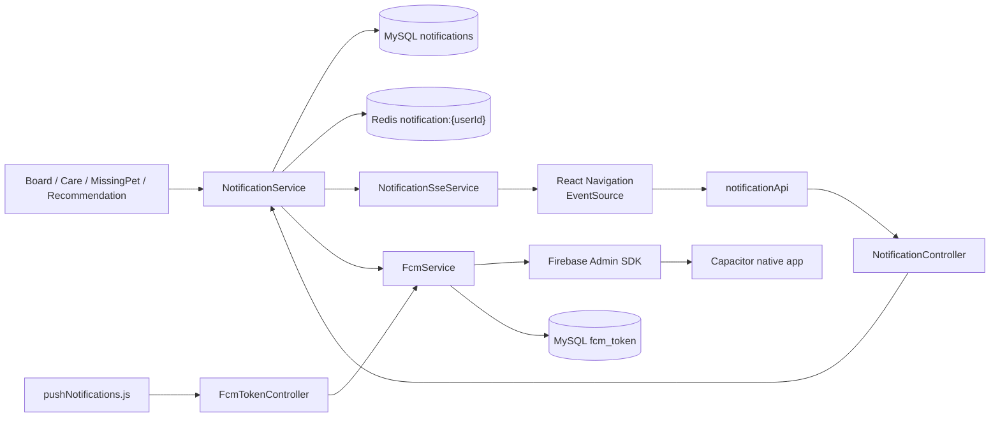
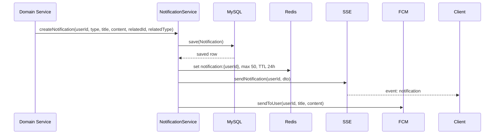
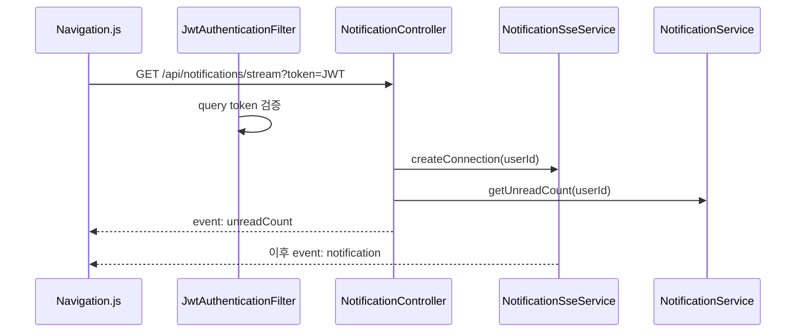
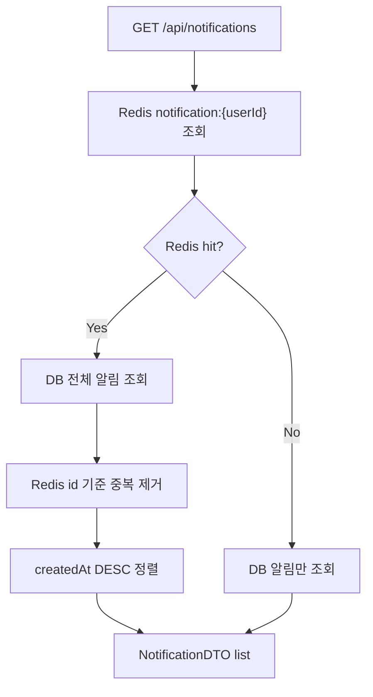
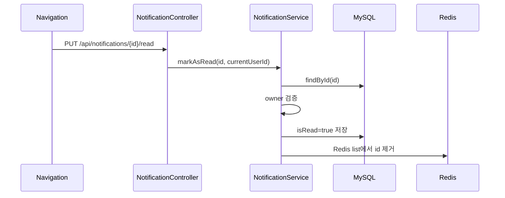
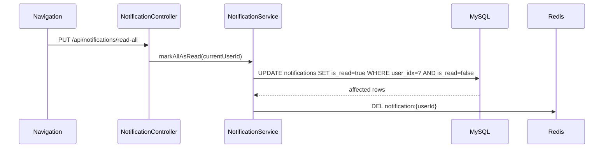
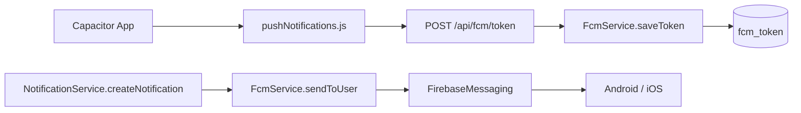

# 알림 시스템 아키텍처

> 현재 코드 기준. Notification 도메인은 도메인 이벤트를 MySQL, Redis, SSE, FCM으로 분기하는 공통 전달 계층이다.

---

## 1. 전체 구조

알림 생성은 백엔드 도메인 서비스에서 시작된다. 프론트는 알림 목록/읽음 처리를 REST API로 호출하고, 새 알림은 SSE 또는 FCM으로 받는다.

---

## 2. 알림 생성 시퀀스

DB 저장은 `@Transactional` 안에서 수행된다. Redis 저장, SSE 전송, FCM 발송은 같은 메서드에서 호출되지만 DB 트랜잭션과 원자적으로 묶인 outbox 구조는 아니다.

---

## 3. 알림 발생 지점

| 도메인            | 트리거                          | 타입                     | 비고                                             |
| -------------- | ---------------------------- | ---------------------- | ---------------------------------------------- |
| Board          | 일반 게시글 댓글 작성                 | `BOARD_COMMENT`        | 작성자가 게시글 작성자가 아닐 때                             |
| Care           | 케어 요청 댓글 작성                  | `CARE_REQUEST_COMMENT` | 작성자가 요청자가 아닐 때                                 |
| MissingPet     | 실종 제보 댓글 작성                  | `MISSING_PET_COMMENT`  | `@Async` 메서드에서 발송                              |
| Recommendation | `MEDICAL` + `HIGH` signal 저장 | `PET_HEALTH_ALERT`     | `AFTER_COMMIT` + `@Async("petIntentExecutor")` |

---

## 4. Backend 레이어

| 레이어                      | 역할                                   |
| ------------------------ | ------------------------------------ |
| `NotificationController` | 알림 목록, unread, 읽음 처리, SSE stream     |
| `NotificationService`    | 알림 생성, Redis 캐시, DB 조회/병합, 읽음 처리     |
| `NotificationSseService` | 사용자별 `SseEmitter` 생성/전송/정리           |
| `FcmTokenController`     | FCM device token 등록/삭제               |
| `FcmService`             | 토큰 저장, Firebase 발송, invalid token 정리 |
| `NotificationRepository` | 알림 repository abstraction            |
| `FcmTokenRepository`     | FCM 토큰 JPA repository                |

---

## 5. SSE 연결 구조

`NotificationSseService`는 `ConcurrentHashMap<Long, SseEmitter>`를 사용한다.

| 항목        | 구현                                  |
| --------- | ----------------------------------- |
| timeout   | 1시간                                 |
| 저장 key    | userId                              |
| emitter 수 | 사용자당 1개                             |
| 종료 처리     | completion, timeout, error callback |
| 전송 실패     | map에서 제거 후 `completeWithError()`    |

프론트는 SSE 오류가 발생하면 unread count만 5분 간격으로 폴링한다.

---

## 6. Redis + DB 조회 구조

Redis는 최신 알림 UX를 위한 캐시다. 영구 저장과 전체 이력 기준은 MySQL `notifications`다.

Redis 정책:

- key: `notification:{userId}`
- value: `List<NotificationDTO>`
- limit: 최신 50개
- TTL: 24시간
- serializer: JSON Redis serializer

---

## 7. 읽음 처리 구조

전체 읽음은 엔티티 목록을 조회하지 않는다.

JPQL bulk UPDATE 한 번으로 처리하므로 미읽음 알림 개수에 비례하는 행별 UPDATE가 발생하지 않는다. 목록과 count 조회도 `Users` 엔티티를 먼저 조회하지 않고 `Notification.user.idx`를 조건으로 직접 실행한다.

---

## 8. FCM 구조

`FirebaseConfig`는 `firebase.service-account.path`가 없으면 FirebaseApp을 만들지 않는다. 이 경우 `FcmService.sendToUser()`는 발송을 생략한다.

invalid token 정리 대상:

- `UNREGISTERED`
- `INVALID_ARGUMENT`
- `SENDER_ID_MISMATCH`

---

## 9. 보안 경계

| 영역            | 정책                                                   |
| ------------- | ---------------------------------------------------- |
| REST 알림 API   | 인증 사용자만 접근                                           |
| SSE           | `@PreAuthorize("isAuthenticated()")`, query token 허용 |
| FCM token API | `/api/**` 인증 규칙으로 보호                                 |
| 읽음 처리         | 알림 수신자와 현재 사용자 일치 검증                                 |
| 사용자 식별        | request body가 아니라 JWT principal 기준                   |

query string JWT는 EventSource 제약 때문에 쓰지만, 운영에서는 access log와 브라우저 히스토리 노출 위험을 고려해야 한다.

---

## 10. 현재 설계 경계

- SSE 연결 저장소가 서버 메모리라 다중 서버 환경에서는 연결 라우팅/브로드캐스트 전략이 필요하다.
- 사용자당 emitter 1개라 멀티 탭 동시 수신을 보장하지 않는다.
- Redis/SSE/FCM은 DB 트랜잭션과 원자적으로 묶이지 않는다.
- FCM payload는 title/body 중심이라 네이티브 알림 탭 후 상세 라우팅 정보가 부족하다.
- `notifications` 엔티티명과 일부 오래된 `notification` 단수 문서/migration 명세가 불일치한다.
