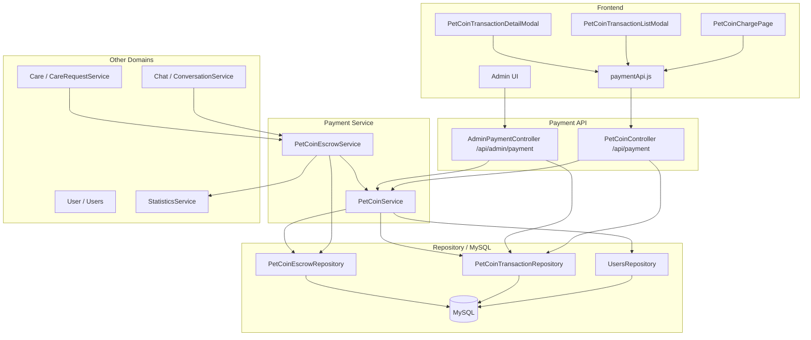
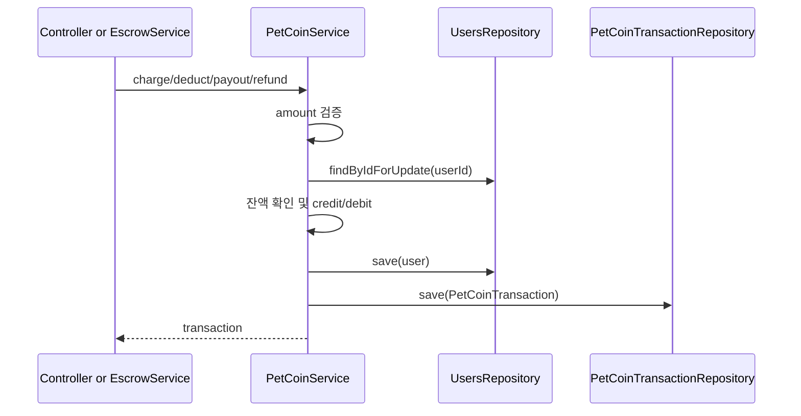
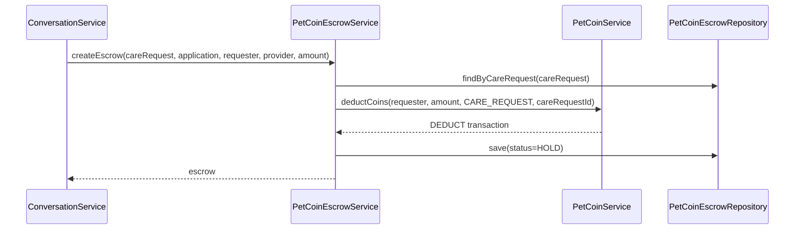
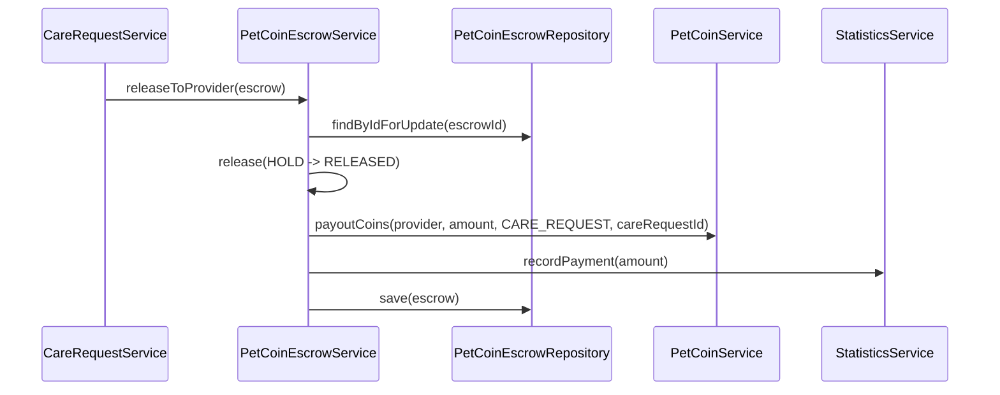
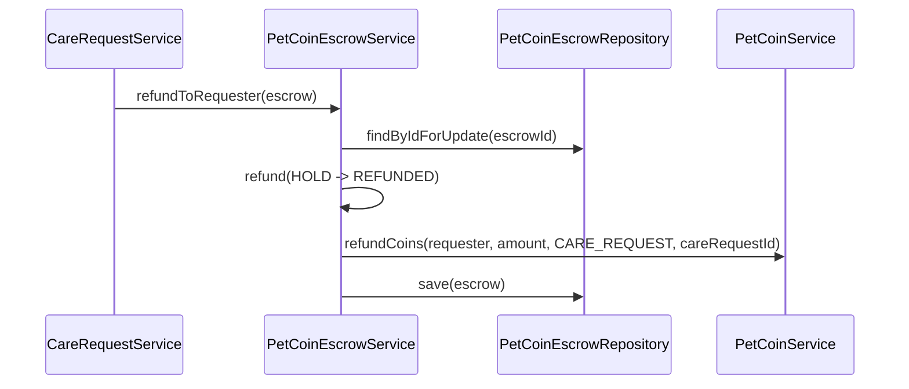
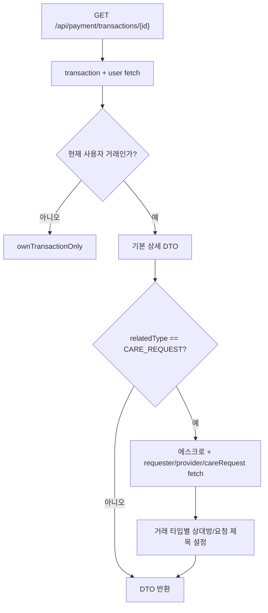

# 펫코인 결제 아키텍처

> 기준: 현재 코드. Payment는 펫코인 잔액·거래 내역·에스크로를 담당하고, Care/Chat은 거래 상태 전이의 호출 주체다.

## 1. 개요

Payment 아키텍처는 사용자 잔액을 안전하게 변경하고, 모든 코인 이동을 거래 내역으로 남기며, 케어 거래에서는 에스크로로 중간 보관 후 완료/취소 시 지급 또는 환불한다.

핵심 특징:

- 사용자 잔액 변경은 `Users.petCoinBalance`에서 처리한다.
- 모든 잔액 변경은 `PetCoinTransaction`으로 기록한다.
- 케어 거래 확정 시 `PetCoinEscrow(status=HOLD)`를 만든다.
- 완료 시 제공자 지급, 취소 시 요청자 환불을 수행한다.
- 사용자 row와 에스크로 row에 비관적 락을 사용한다.
- 현재 충전은 실제 PG가 아닌 시뮬레이션이다.

## 2. 전체 구조

## 3. API 연결

### 사용자 API

| API | 서비스/Repository | 설명 |
|---|---|---|
| `GET /api/payment/balance` | `PetCoinService.getBalance()` | 현재 사용자 잔액 |
| `GET /api/payment/transactions` | `PetCoinTransactionRepository.findByUserOrderByCreatedAtDesc()` | 거래 내역 DB 페이징 |
| `GET /api/payment/transactions/{id}` | `PetCoinService.getTransactionDetail()` | 본인 거래 상세 |
| `POST /api/payment/charge` | `PetCoinService.chargeCoins()` | 테스트 충전 |

### 관리자 API

| API | 서비스/Repository | 설명 |
|---|---|---|
| `POST /api/admin/payment/charge` | `PetCoinService.chargeCoins()` | 사용자 지정 코인 지급 |
| `GET /api/admin/payment/balance/{userId}` | `PetCoinService.getBalance()` | 특정 사용자 잔액 |
| `GET /api/admin/payment/transactions/{userId}` | `PetCoinTransactionRepository.findByUserOrderByCreatedAtDesc()` | 특정 사용자 거래 내역 |

## 4. 잔액 변경 흐름

`deductCoins()`만 잔액 부족 검사를 수행한다. 충전, 지급, 환불은 잔액을 증가시킨다.

## 5. 케어 에스크로 흐름

### 거래 확정

현재 Chat 쪽은 `createEscrow()` 예외를 잡고 로그만 남긴다. 따라서 Payment 실패가 Care 매칭 상태 전이를 반드시 막지는 않는다.

### 완료 지급

### 취소 환불

## 6. 거래 상세 조회

상대방 매핑:

- `DEDUCT`, `REFUND`: provider
- `PAYOUT`: requester

## 7. 동시성 경계

| 대상 | 락 위치 | 목적 |
|---|---|---|
| 사용자 잔액 | `UsersRepository.findByIdForUpdate()` | 동시 충전/차감/지급/환불 시 잔액 정합성 |
| 에스크로 지급 | `PetCoinEscrowRepository.findByIdForUpdate()` | 중복 지급 방지 |
| 에스크로 환불 | `PetCoinEscrowRepository.findByIdForUpdate()` | 중복 환불 방지 |
| 채팅 거래 확정 | `ConversationRepository.findByIdWithLock()` | 양쪽 확정 처리 경합 완화 |

`PetCoinEscrowRepository.findByCareRequestForUpdate()`도 존재하지만 현재 완료/취소 경로는 `findByCareRequest()`로 에스크로를 찾고, `releaseToProvider()`/`refundToRequester()` 내부에서 id 기반 락을 잡는다.

## 8. 도메인 경계

| 도메인 | 연결 |
|---|---|
| User | 잔액 필드와 비관적 락 조회 |
| Chat | 거래 확정 시 에스크로 생성 호출 |
| Care | 완료/취소 상태 전이 시 지급/환불 호출 |
| Statistics | 지급 완료 금액 기록 |
| Admin | 관리자 코인 지급과 조회 |

PG 연동이 들어오면 사용자 충전 진입점이 가장 먼저 바뀐다. 에스크로, 지급, 환불의 내부 코인 이동 구조는 유지할 수 있다.

## 9. 현재 설계상 주의점

- 실제 결제 승인 검증이 없다.
- 사용자 충전 API가 시뮬레이션으로 열려 있다.
- 거래 확정 시 에스크로 생성 실패가 매칭 롤백으로 전파되지 않는다.
- 에스크로 중복 생성은 조회 후 저장 구조라 동시 생성에는 DB unique 제약이 최종 방어선이다.
- `release()`와 `refund()`의 예외 타입이 다르다.
- 실패 거래를 `FAILED`로 기록하는 보상성 거래 기록 흐름은 현재 없다.

## 10. 관련 문서

- [Payment 도메인](../../domains/payment.md)
- [Care 도메인](../../domains/care.md)
- [펫케어 코인 관련 흐름](../care/펫케어 코인 관련 흐름.md)
- [PetCoinService Race Condition 리팩토링](../../refactoring/payment/petcoin-service-race-condition.md)
- [Payment 백엔드 성능 최적화](../../refactoring/payment/payment-backend-performance-optimization.md)
- [Payment 트러블슈팅 분석](../../troubleshooting/payment/payment-troubleshooting-analysis.md)
