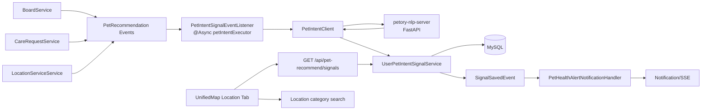
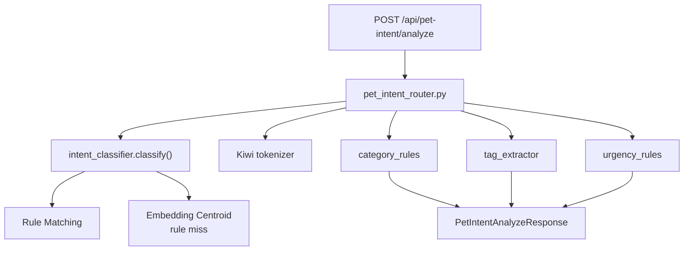
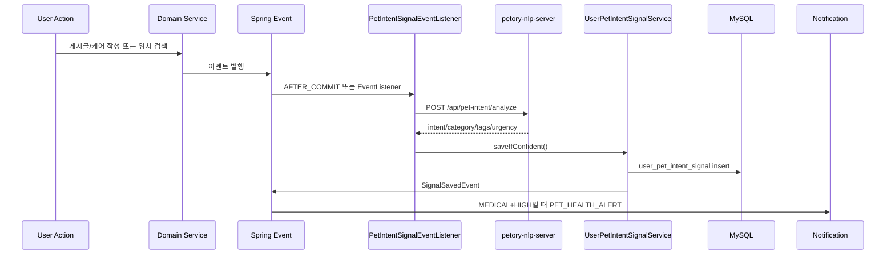
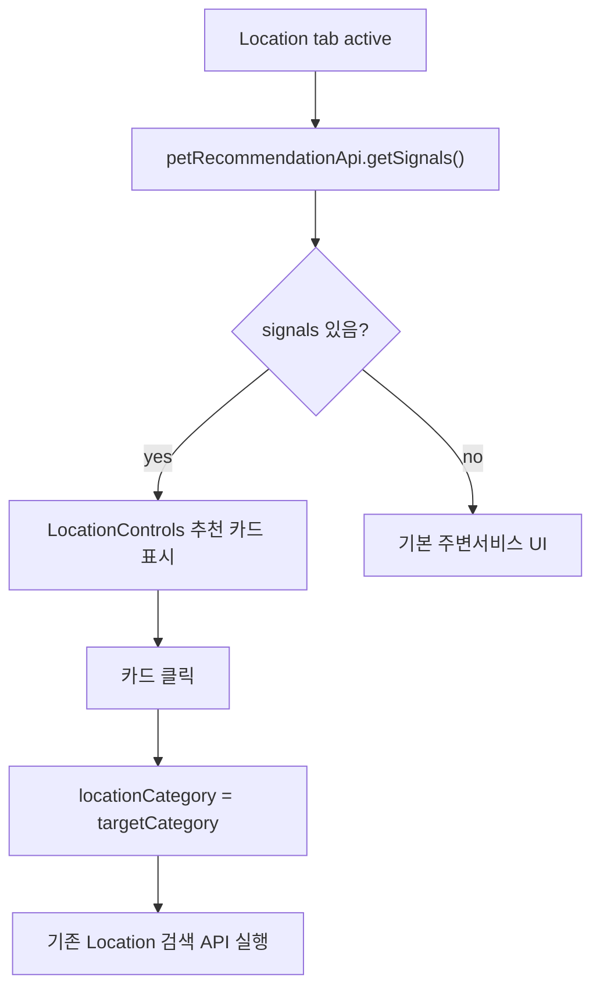
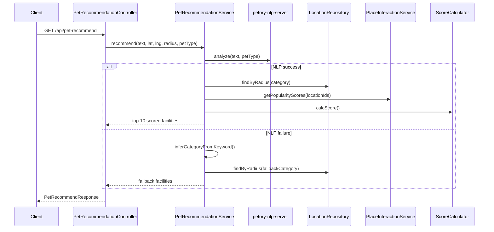

# 반려생활 추천 & NLP 아키텍처

> 현재 코드 기준. Spring Boot와 `petory-nlp-server`가 HTTP로 분리된 구조다.

---

## 1. 전체 구조



Recommendation은 두 서버로 나뉜다.

- **Spring Boot**: 인증, 이벤트 수집, DB 저장, Location 검색, 추천 점수 계산, 알림 연동
- **FastAPI NLP Server**: 한국어 자연어 의도 분류, 카테고리 추천, 태그/긴급도 산출

React는 Python 서버를 직접 호출하지 않는다. 모든 사용자 API는 Spring을 통한다.

---

## 2. Backend 모듈 연결

| 모듈 | 역할 |
|---|---|
| `PetRecommendationController` | 즉시 추천, signal 조회, 장소 상호작용 API |
| `PetRecommendationService` | NLP 분석 결과로 주변 시설 조회·점수화 |
| `PetIntentClient` | FastAPI `/api/pet-intent/analyze` 호출 |
| `PetIntentSignalEventListener` | 게시글/케어/위치검색 이벤트를 비동기로 분석 |
| `UserPetIntentSignalService` | signal 저장 조건, TTL, 카드 DTO 변환 |
| `PlaceInteractionService` | 장소 행동 로그 저장과 popularity score 계산 |
| `PetRecommendScoreCalculator` | 시설 finalScore 계산 |
| `PetHealthAlertNotificationHandler` | MEDICAL+HIGH signal을 알림으로 전환 |
| `PetIntentAsyncConfig` | NLP 작업 전용 bounded executor |

---

## 3. Python NLP 서버 구조



서버 시작 시 `main.py` lifespan에서 embedding model과 intent centroid를 warm-up한다. 첫 analyze 요청에서 모델 로드와 centroid 계산이 몰리는 것을 줄이기 위한 처리다.

분류 단계:

1. `_RULES` 키워드 매칭
2. rule miss 시 `intent_examples.yml`의 intent centroid와 입력 임베딩 비교
3. domain을 Location category 목록으로 매핑
4. Kiwi 형태소 기반 intent tag 추출
5. domain/키워드 기반 urgency 판단

---

## 4. Signal 저장 시퀀스



게시글/케어 이벤트는 `@TransactionalEventListener(AFTER_COMMIT)`로 처리한다. 위치 검색 이벤트는 조회 흐름이라 일반 `@EventListener`다.

---

## 5. 트래픽 제어

### 5.1 전용 executor

`petIntentExecutor`:

| 설정 | 값 |
|---|---:|
| core | 2 |
| max | 6 |
| queue | 500 |
| reject | warn 후 discard |

추천 signal 생성은 부가 기능이므로 큐 포화 시 작업을 버린다. 이 정책은 게시글/케어 저장, 위치 검색 등 핵심 요청을 보호하기 위한 선택이다.

### 5.2 Location 검색 필터

Location 검색은 반복 호출 가능성이 높아 NLP 호출 전 필터를 둔다.

```text
keyword 있음
  -> 로그인 사용자 확인
  -> normalize(trim + lowercase + 공백 collapse)
  -> length >= 7 && 공백 포함
  -> Redis setIfAbsent(nlp:loc-dedup:{userIdx}:{keyword}, ttl=10분)
  -> 통과 시 Python 호출
```

Redis 장애 시에는 fail-closed로 Python 호출을 생략한다.

---

## 6. DB 구조

### 6.1 user_pet_intent_signal

사용자별 추천 카드 source다.

| 필드 | 용도 |
|---|---|
| `user_idx` | 사용자별 조회 |
| `source_type`, `source_id` | signal 출처 추적 |
| `intent_domain`, `intent` | NLP 결과 |
| `recommended_categories` | JSON category list |
| `confidence` | 분석 신뢰도 |
| `urgency` | `HIGH`, `NORMAL`, `LOW` |
| `intent_tags` | JSON tag list |
| `expires_at` | signal freshness 관리 |

인덱스:

- `idx_user_signal_active(user_idx, expires_at, created_at)`
- `idx_signal_source(source_type, source_id)`

### 6.2 place_interaction_log

즉시 추천 API의 popularity score 계산용이다.

- `VIEW`
- `NAVIGATE`
- `FAVORITE`

최근 30일 집계를 location별로 세고, `log10(count + 1) / log10(1001)`로 0~1 정규화한다.

### 6.3 signal_interaction_log

추천 카드 CTR/전환 분석용으로 엔티티와 테이블이 준비되어 있다.

- `CLICKED`
- `DISMISSED`
- `CONVERTED`

현재 저장 API나 프론트 호출은 없다. 확장용 구조다.

---

## 7. 프론트엔드 흐름



`UnifiedPetMapPage`는 주변서비스 탭 진입, keyword/category 변경, 검색어 입력 후 1.5초 지연 refresh에서 signal을 다시 조회한다.

`LocationControls`는 signal 중 최대 2개를 카드로 보여준다.

---

## 8. 즉시 추천 API 흐름



즉시 추천 API는 signal 저장과 별개다. 요청 텍스트를 분석해 바로 장소 목록을 반환한다.

---

## 9. 장애 격리

| 장애 | 처리 |
|---|---|
| Python 서버 다운/timeout | `PetIntentClient`가 `Optional.empty()` 반환 |
| signal 이벤트 분석 실패 | warn 로그 후 종료, 원 액션 영향 없음 |
| 즉시 추천 NLP 실패 | keyword fallback category로 기본 결과 반환 |
| Redis dedup 장애 | Location NLP 분석 생략 |
| signal JSON 직렬화 실패 | 저장 skip |
| signal DB 저장 실패 | warn 로그 후 종료 |
| 건강 알림 실패 | signal 저장에는 영향 없음 |
| 프론트 signal API 실패 | 빈 배열 처리 |

---

## 10. 현재 설계 경계

- Recommendation은 Location 도메인의 category 검색을 재사용한다.
- NLP 서버는 진단 서버가 아니라 카테고리 라우팅 보조 서버다.
- MEDICAL 문구는 수의사 상담 안내로 제한한다.
- signal 저장은 원문을 보관하지 않는다.
- Python `petType`은 아직 분류에 사용하지 않는다.
- signal 카드 클릭 로그는 아직 실제 저장되지 않는다.
