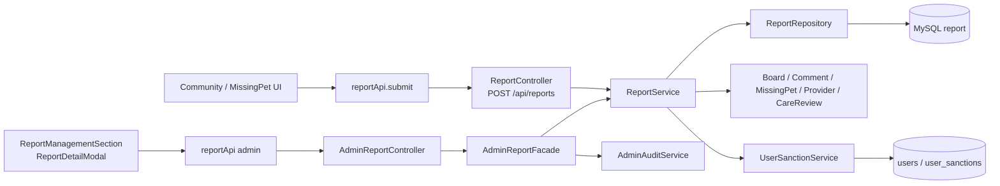
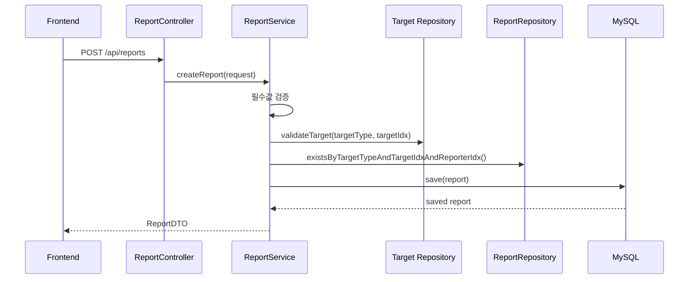
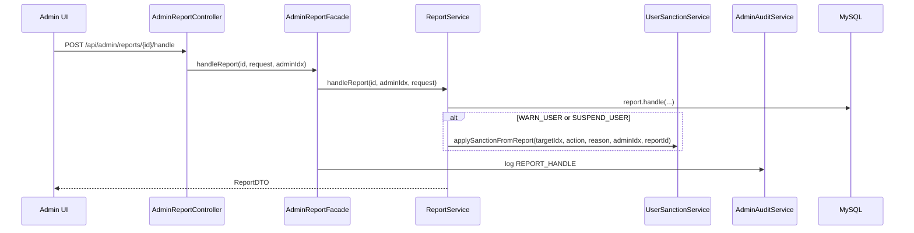
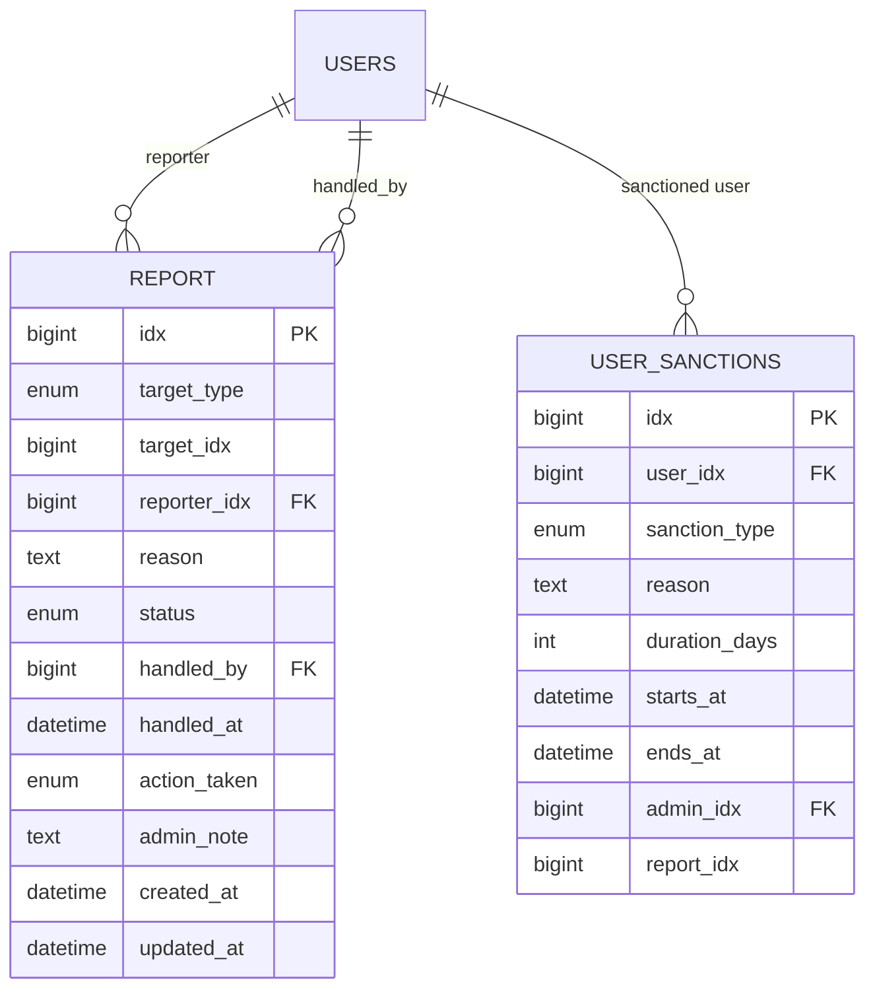
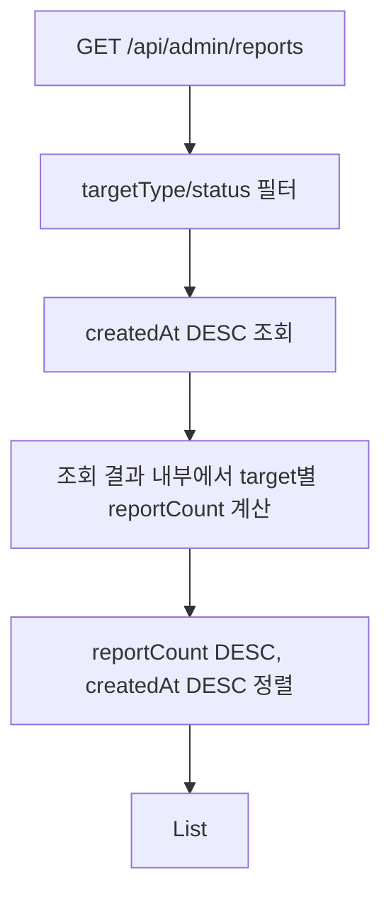

# 신고 및 제재 아키텍처

> 현재 코드 기준. Report 도메인은 신고 접수/검토 기록을 담당하고, 사용자 제재는 UserSanctionService로 위임한다.

---

## 1. 전체 구조

Report는 신고 row와 처리 기록을 관리한다. 실제 콘텐츠 블라인드/삭제 같은 운영 조치는 Report 처리와 별도 API로 수행된다.

---

## 2. 신고 접수 시퀀스

중복 신고 방지는 두 겹이다.

- 서비스 레벨: `existsByTargetTypeAndTargetIdxAndReporterIdx`
- DB 레벨: unique `(target_type, target_idx, reporter_idx)`

---

## 3. 신고 대상 검증

| targetType | 검증 repository | 의미 |
|---|---|---|
| `BOARD` | `BoardRepository` | 일반 커뮤니티 게시글 |
| `COMMENT` | `CommentRepository`, `MissingPetCommentRepository` | 일반 댓글 또는 실종 제보 댓글 |
| `MISSING_PET` | `MissingPetBoardRepository` | 실종 제보 게시글 |
| `PET_CARE_PROVIDER` | `UsersRepository` | `Role.SERVICE_PROVIDER` 사용자 |
| `CARE_REVIEW` | `CareReviewRepository` | 케어 리뷰 |

`COMMENT`는 일반 댓글과 실종 제보 댓글을 같은 target type으로 받는다. 상세 미리보기에서는 일반 `CommentRepository`를 먼저 조회한다.

---

## 4. 관리자 처리 시퀀스

신고 처리 상태와 실제 콘텐츠 조치는 분리되어 있다.

- `ReportService.handleReport()`: 신고 status/action/adminNote 기록
- `ReportDetailModal`의 Board 버튼: 별도 `communityAdminApi`로 블라인드/삭제/복구

---

## 5. 데이터 모델

Report의 신고 대상은 DB FK가 아니라 `target_type + target_idx` 폴리모픽 참조다.

---

## 6. 목록/상세 조회

관리자 목록:

관리자 상세:

- 신고 row 조회
- target type별 repository에서 대상 조회
- title/summary/authorName 미리보기 구성
- 대상 없음이면 삭제/탈퇴 placeholder 반환

---

## 7. UserSanction 연동

`ReportActionType`별 처리:

| action | Report 처리 | UserSanction 처리 | 콘텐츠 처리 |
|---|---|---|---|
| `NONE` | 기록 | 없음 | 없음 |
| `DELETE_CONTENT` | 기록 | 없음 | 자동 삭제 없음 |
| `WARN_USER` | 기록 | 경고 추가 | 없음 |
| `SUSPEND_USER` | 기록 | 3일 이용제한 추가 | 없음 |
| `OTHER` | 기록 | 없음 | 없음 |

경고 누적 정책:

- `WARN_USER`는 `Users.warningCount`를 증가시킨다.
- 경고 3회 이상이면 3일 이용제한을 자동 추가한다.
- 이용제한 만료 해제는 User 도메인의 제재 스케줄러 책임이다.

현재 제재 대상 ID는 `report.targetIdx`다. 따라서 `PET_CARE_PROVIDER`처럼 신고 대상이 사용자일 때만 안전하다. 콘텐츠 신고는 작성자 ID를 별도로 조회한 뒤 넘기는 보완이 필요하다.

---

## 8. 보안 경계

| 영역 | 현재 정책 |
|---|---|
| 신고 생성 | 인증 필요 |
| 관리자 조회/처리 | `ADMIN`, `MASTER` |
| 관리자 식별 | JWT principal에서 `adminIdx` 추출 |
| 신고자 식별 | request body `reporterId` 사용 |
| 중복 방지 | 서비스 체크 + DB unique |

신고 생성은 JWT 인증을 요구하지만 `reporterId`가 현재 로그인 사용자와 같은지 검증하지 않는다. 운영 안정성을 위해 `AuthenticatedUserIdResolver`로 서버에서 신고자를 결정하는 방식이 더 안전하다.

---

## 9. 현재 설계 경계

- Report는 폴리모픽 참조라 대상 FK 무결성을 DB가 강제하지 않는다.
- 처리 액션과 실제 콘텐츠 조치가 분리되어 있어, 관리자 UI/운영 절차에서 둘 다 수행해야 한다.
- `DELETE_CONTENT`는 자동 삭제가 아니다.
- `WARN_USER`, `SUSPEND_USER` 제재 대상 ID 매핑은 사용자 대상 신고 외에는 안전하지 않다.
- 관리자 목록은 pagination이 없다.
- 현재 코드에는 Ollama/AI 신고 보조 서비스와 `/assist` API가 없다.
