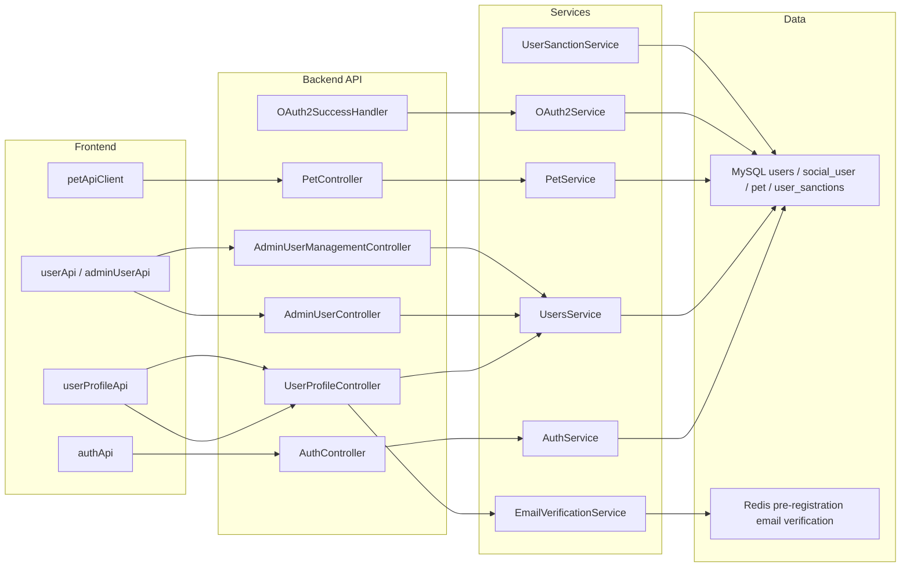
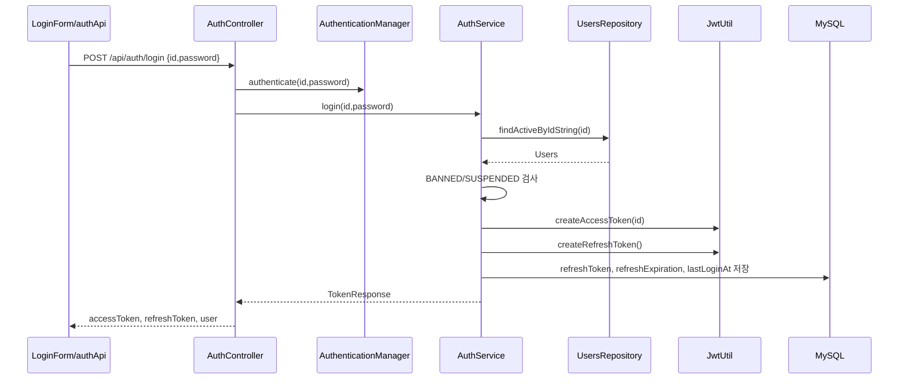
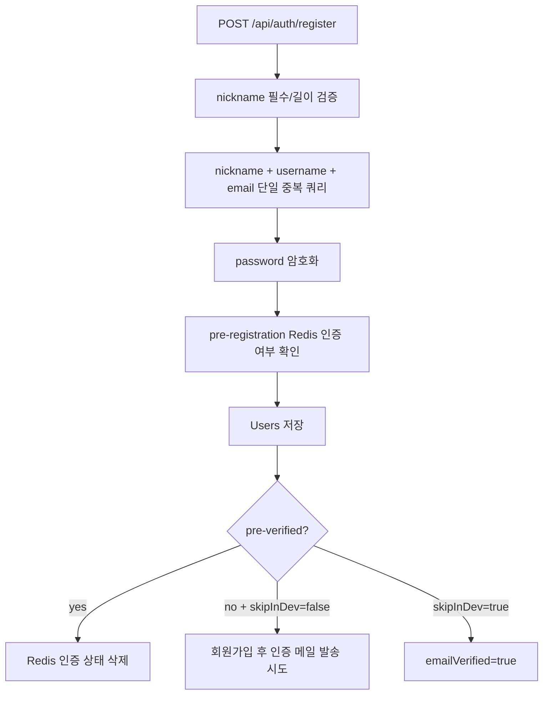
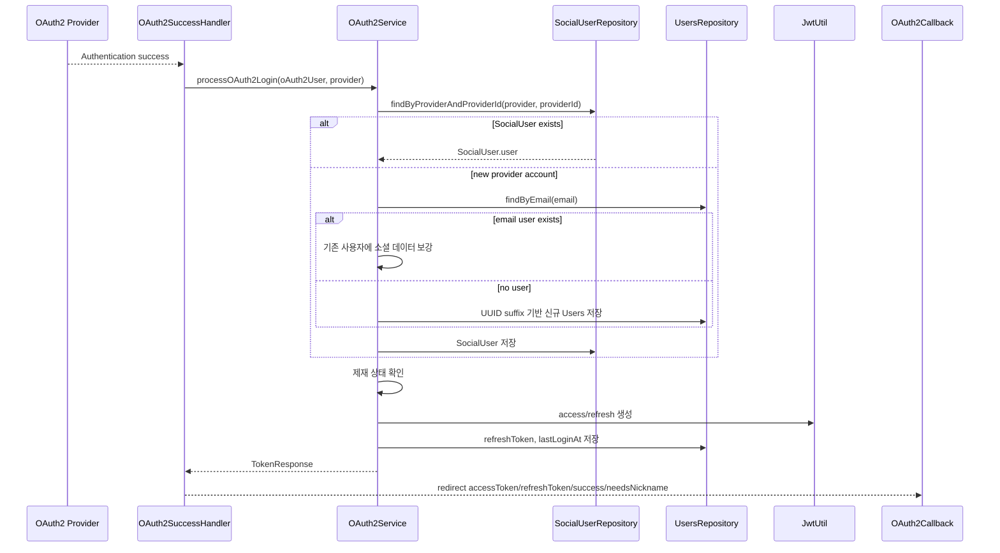
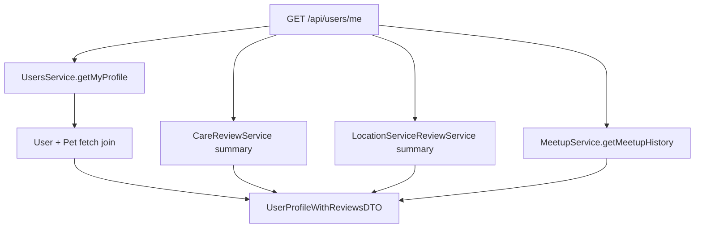
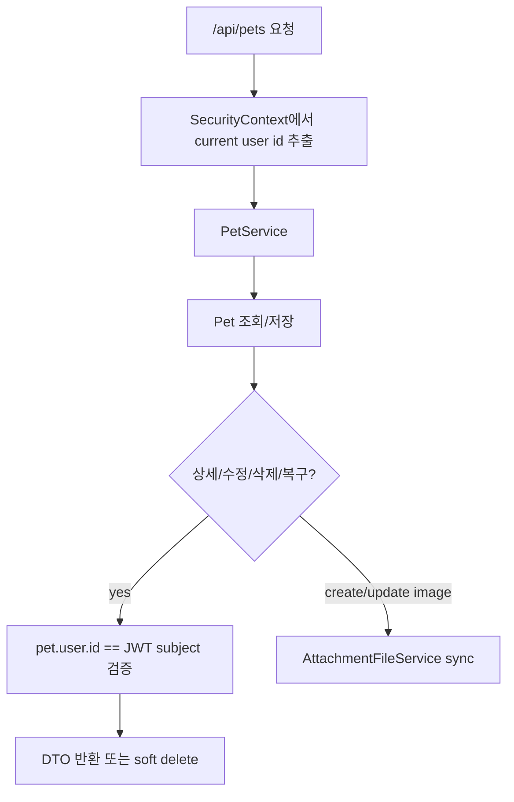

# 사용자 인증 및 프로필 아키텍처

> 기준: User 도메인의 현재 인증, OAuth2, 프로필, 펫 관리 연결 구조를 설명한다. 이메일 인증과 제재의 상세 정책은 별도 아키텍처 문서를 함께 참고한다.

## 1. 아키텍처 범위

이 문서는 다음 흐름을 다룬다.

| 영역 | 설명 |
|---|---|
| 일반 인증 | 회원가입, 로그인, access/refresh token, 로그아웃 |
| OAuth2 | Google/Naver 중심 소셜 계정 연결과 JWT 발급. Kakao 분기는 코드에 있으나 실제 설정/UX 지원은 별도 확인 필요 |
| 프로필 | 내 프로필, 다른 사용자 프로필, 리뷰/모임 히스토리 조합 |
| 이메일 인증 | 회원가입 전 인증, 기존 사용자 인증, 비밀번호 재설정 |
| 펫 관리 | 반려동물 CRUD, 소유권 검증, 파일 첨부 동기화 |
| 관리자 사용자 관리 | 사용자 목록/상태/삭제/복구, 관리자 계정 관리 |

## 2. 일반 로그인 흐름

핵심 정책:

- JWT subject는 `Users.id`다.
- Access Token 기본 TTL은 15분이다.
- Refresh Token은 1일 TTL이며 DB에도 저장한다.
- 로그아웃은 DB의 refresh token과 만료 시각을 null로 만든다.
- refresh는 DB에 저장된 active refresh token만 허용한다.
- refresh 성공 시 refresh token은 유지하고 access token만 새로 발급한다.

## 3. 회원가입 흐름

중복 처리:

- 사전 중복 검사는 단일 쿼리로 한다.
- 저장 중 DB unique 제약 충돌이 발생하면 `DataIntegrityViolationException`을 필드별 중복 예외로 변환한다.
- soft delete된 사용자와의 중복은 repository 쿼리에서 제외한다.

## 4. OAuth2 로그인 흐름

특징:

- `provider + providerId`가 소셜 계정의 1차 식별자다.
- 소셜 계정이 없으면 email로 기존 사용자를 찾아 연결한다.
- 신규 사용자 id/username은 UUID 8자리 suffix를 붙여 생성한다.
- unique 충돌 시 최대 3회 재시도한다.
- 닉네임이 없으면 callback query에 `needsNickname=true`를 포함한다.

보안 메모:

- 현재 token은 OAuth2 callback query parameter로 전달된다.
- 구현 단순성은 높지만 브라우저 history, 로그, referer 노출 가능성이 있으므로 장기적으로 더 안전한 전달 방식 검토 여지가 있다.

## 5. 프로필 조합 흐름

`GET /api/users/me`는 User 단건만 반환하지 않고 여러 도메인의 요약을 조합한다.

프로필 응답에 포함되는 주요 정보:

- 사용자 기본 정보
- 삭제되지 않은 펫 목록
- Care 리뷰 목록/평균/개수
- Location service 리뷰 목록/평균/개수
- Meetup 히스토리와 좋아요 개수
- 서비스 제공자 여부에 따른 Care 리뷰 모드

성능 정책:

- User + Pet은 fetch join으로 가져온다.
- Care 리뷰는 목록과 평균을 따로 조회하지 않고 summary 메서드에서 한 번에 계산한다.
- Location 리뷰도 summary DTO를 사용한다.

## 6. 이메일 인증 구조

이메일 인증 상세 정책은 [이메일 인증 시스템 아키텍처](<이메일 인증 시스템 아키텍처.md>)를 기준으로 한다.

이 문서에서의 연결만 요약하면:

- `UserProfileController`가 인증 메일 발송/검증 API를 제공한다.
- `EmailVerificationService`가 JWT 이메일 토큰을 생성/검증한다.
- 회원가입 전 인증 상태는 Redis에 24시간 저장한다.
- 기존 사용자 인증은 `Users.emailVerified=true`로 반영한다.
- 비밀번호 변경과 일부 책임 있는 액션은 서비스 레벨에서 `checkEmailVerification()`을 호출한다.

## 7. 펫 관리 흐름

소유권 검증:

- JWT subject는 로그인 ID인 `Users.id`다.
- 펫 소유자도 `pet.user.id`로 비교한다.
- 일치하지 않으면 `UserForbiddenException.ownPetOnly()`가 발생한다.

파일 연동:

- `profileImageUrl`이 있으면 `FileTargetType.PET` 단일 첨부로 동기화한다.
- 수정 요청에서 빈 문자열이 오면 기존 첨부를 삭제한다.

## 8. 관리자 사용자 관리

관리자 경로:

- `/api/admin/users`: `ADMIN`, `MASTER`
- `/api/master/admin-users`: `MASTER`

관리자 사용자 목록:

- `GET /api/admin/users/paging`
- role/status/q 필터와 page/size를 받는다.
- 전체 사용자 `findAll()` 방식이 아니라 페이징 응답만 사용한다.

삭제/복구:

- 일반 사용자 삭제는 soft delete다.
- 삭제 시 refresh token도 제거한다.
- 복구는 `isDeleted=false`, `deletedAt=null`로 되돌린다.

권한/성능:

- 관리자 삭제 권한 검증에 전체 프로필 조회가 필요하지 않은 경우 role projection을 사용한다.
- MASTER 전용 컨트롤러에서 관리자 계정 생성, 승격, 삭제, 비밀번호 변경을 수행한다.

## 9. 제재 연결

제재 상세 정책은 [신고 및 제재 시스템 아키텍처](<신고 및 제재 시스템 아키텍처.md>)를 기준으로 한다.

User 인증 흐름과 연결되는 지점:

- 로그인/OAuth2 로그인 모두 `Users.status`를 검사한다.
- `BANNED`는 로그인 불가다.
- `SUSPENDED`는 만료 전이면 로그인 불가다.
- 만료된 정지는 로그인 시 또는 스케줄러에서 `ACTIVE`로 해제된다.

Report 연결:

- Report 처리 액션 `WARN_USER`는 경고를 추가한다.
- `SUSPEND_USER`는 3일 정지를 적용한다.
- 경고는 DB 원자적 UPDATE로 증가한다.
- 경고 3회 이상이면 자동 3일 정지가 적용된다.

## 10. Repository 전략

주요 repository 정책:

| 목적 | 구현 |
|---|---|
| active user 조회 | `findActiveByIdString`, `findActiveByRefreshToken` |
| soft delete 제외 중복 확인 | `findByUsername`, `findByNickname`, `findByEmail`에 `isDeleted` 조건 |
| 회원가입 중복 확인 | `findByNicknameOrUsernameOrEmail` 단일 쿼리 |
| 사용자 idx 경량 조회 | `findIdxByIdString` |
| role projection | `findRoleByIdx` |
| User + Pet 조회 | `findByIdWithPets`, `findByIdStringWithPets` |
| 경고 증가 | `incrementWarningCount` DB update |
| 결제 동시성 | `findByIdForUpdate` 비관적 락 |

## 11. 남은 구조적 과제

- OAuth2 callback query parameter로 token을 전달하는 방식은 장기적으로 보안 개선 여지가 있다.
- OAuth2 제재 실패는 일반 로그인 예외와 달리 redirect `error` query로 전달된다.
- 이메일 인증 API와 Auth validate 일부는 컨트롤러가 직접 응답을 조립한다.
- `GET /api/pets/type/{petType}`는 전체 타입 조회이므로 사용자용 API 노출 의도와 권한 모델을 재검토할 수 있다.
- `UserSanctionService.addWarning()`은 경고 증가 후 최신 count 확인을 위해 user를 다시 조회한다.

## 12. 관련 문서

- [User 도메인](../../domains/user.md)
- [이메일 인증 시스템 아키텍처](<이메일 인증 시스템 아키텍처.md>)
- [신고 및 제재 시스템 아키텍처](<신고 및 제재 시스템 아키텍처.md>)
- [User 백엔드 성능 최적화 리팩토링](../../refactoring/user/user-backend-performance-optimization.md)
- [Soft Delete 닉네임 재사용 문제](../../troubleshooting/users/soft-delete-nickname-reuse.md)
