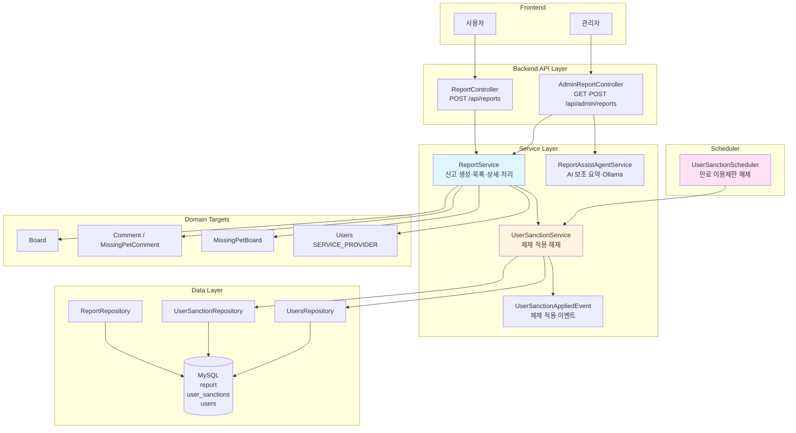
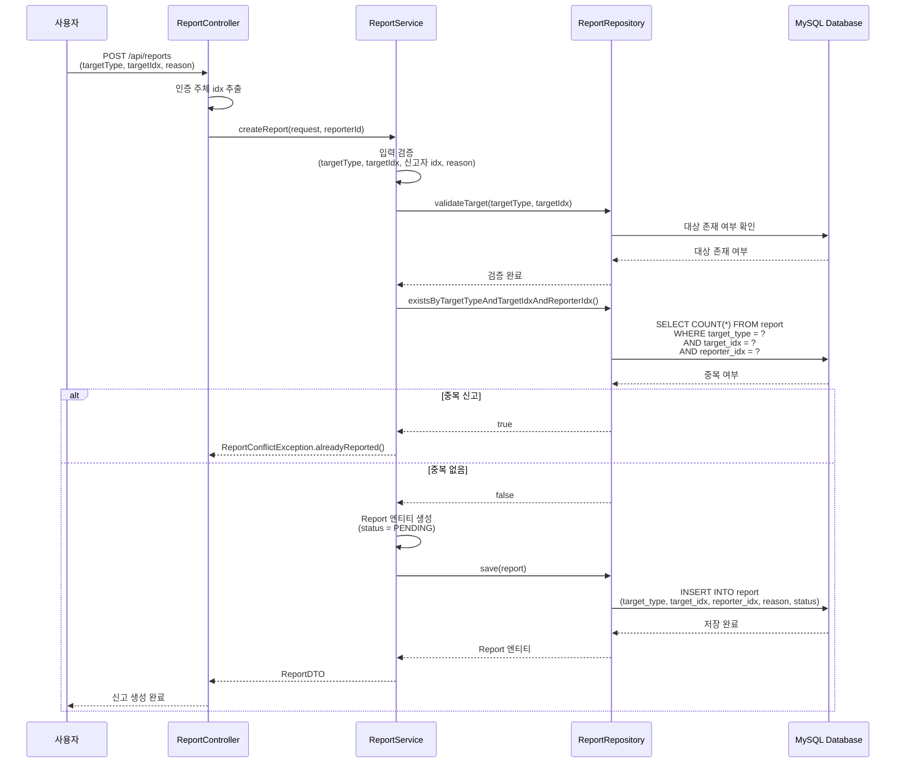
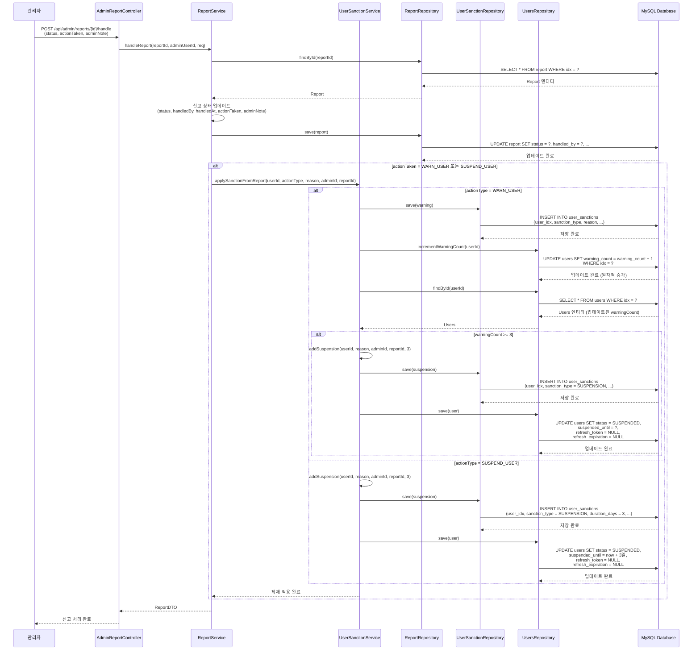
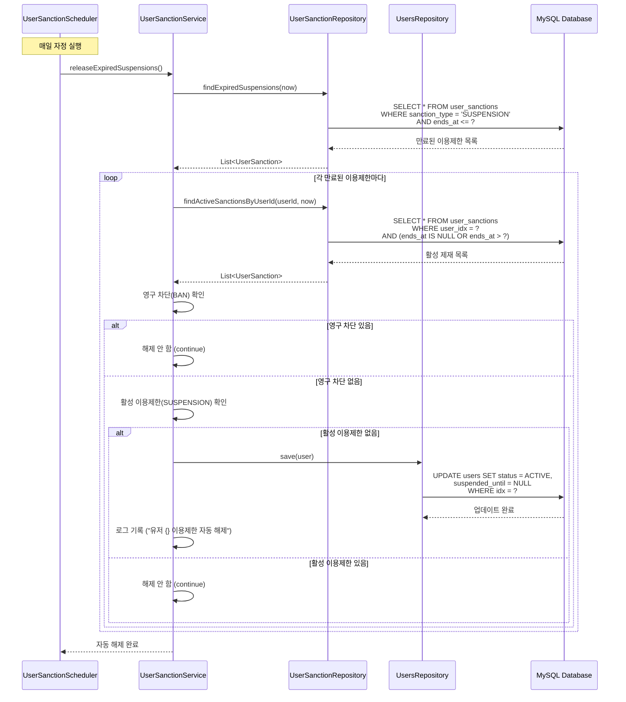
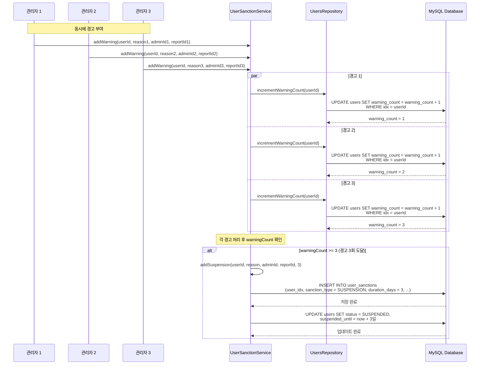

# 신고 및 제재 시스템 아키텍처

## 📋 개요

신고 및 제재 시스템은 Petory 서비스의 유해 콘텐츠와 부적절한 사용자를 관리하기 위한 핵심 기능입니다. 일반 사용자는 `ReportController`로 신고를 생성하고, 관리자는 `AdminReportController`로 목록·상세·처리합니다. 경고 누적 시 자동 이용제한(3일)과 스케줄러 기반 만료 해제를 제공하며, 관리자 화면에서는 **Ollama 연동 신고 보조(요약·조치 제안)** API를 선택적으로 사용할 수 있습니다. 동시성 제어를 위해 경고 횟수는 DB 원자적 증가로 갱신합니다.

2026-06-30 기준 현재 코드는 제재 상태를 인증 계층과 주요 도메인 후속 처리에 함께 반영합니다. 정지/차단 사용자의 refresh token은 제거되고, refresh 재발급·HTTP JWT 인증 필터·WebSocket 인증에서 `BANNED` 또는 만료 전 `SUSPENDED` 계정을 거부합니다. `SUSPENDED` 사용자는 `POST /api/reports` 신고 생성만 예외 허용되며, 그 외 보호 API는 403으로 차단됩니다. 제재 적용 후에는 `UserSanctionAppliedEvent`를 발행해 Care/Meetup/Chat 후속 처리를 트리거합니다.

## 🏗️ 시스템 아키텍처

### 전체 구조도



## 🔧 핵심 컴포넌트

### 1. ReportService (신고 서비스)

**역할**: 신고 생성, 조회, 처리, 제재 자동 적용

**주요 메서드**:
- `createReport()`: 신고 생성 (중복 방지)
- `getReports()`: 신고 목록 조회 (필터링 지원)
- `getReportDetail()`: 신고 상세 조회 (대상 미리보기 포함)
- `handleReport()`: 신고 처리 및 제재 자동 적용

**핵심 로직**:

#### 신고 생성
요청은 **record** `ReportRequestDTO(targetType, targetIdx, reporterId, reason)`이지만, 신고자는 요청 body의 `reporterId`가 아니라 `ReportController`가 `AuthenticatedUserIdResolver`로 구한 인증 주체 idx를 사용합니다. `reporterId`는 과거 호환 필드이며 서버에서 신뢰하지 않습니다. 검증 실패 시 `ReportValidationException` / `ReportConflictException` / `ReportTargetNotFoundException` 등 도메인 예외를 사용합니다.

```java
@Transactional
public ReportDTO createReport(ReportRequestDTO request, Long reporterId) {
    if (request.targetType() == null) {
        throw ReportValidationException.targetTypeRequired();
    }
    if (request.targetIdx() == null) {
        throw ReportValidationException.targetIdxRequired();
    }
    if (reporterId == null) {
        throw ReportValidationException.reporterRequired();
    }
    if (!StringUtils.hasText(request.reason())) {
        throw ReportValidationException.reasonRequired();
    }

    Users reporter = usersRepository.findById(reporterId)
            .orElseThrow(UserNotFoundException::new);

    validateTarget(request.targetType(), request.targetIdx());

    if (reportRepository.existsByTargetTypeAndTargetIdxAndReporterIdx(
            request.targetType(),
            request.targetIdx(),
            reporter.getIdx())) {
        throw ReportConflictException.alreadyReported();
    }

    Report report = Report.builder()
            .targetType(request.targetType())
            .targetIdx(request.targetIdx())
            .reporter(reporter)
            .reason(request.reason().trim())
            .build(); // status/actionTaken 기본값은 엔티티 @Builder.Default + @PrePersist

    return reportConverter.toDTO(reportRepository.save(report));
}
```

#### 신고 처리 및 제재 자동 적용
`req.getStatus()`가 null이면 `ReportValidationException.statusRequired()`입니다. `ReportNotFoundException` / `UserNotFoundException` 사용.

```java
@Transactional
public ReportDTO handleReport(Long reportId, Long adminUserId, ReportHandleRequest req) {
    if (req.getStatus() == null) {
        throw ReportValidationException.statusRequired();
    }
    Report report = reportRepository.findById(reportId).orElseThrow(ReportNotFoundException::new);
    Users admin = usersRepository.findById(adminUserId).orElseThrow(UserNotFoundException::new);

    report.setStatus(req.getStatus());
    report.setHandledBy(admin);
    report.setHandledAt(LocalDateTime.now());
    report.setAdminNote(req.getAdminNote());
    report.setActionTaken(req.getActionTaken() != null ? req.getActionTaken() : ReportActionType.NONE);

    if (req.getActionTaken() != null &&
            (req.getActionTaken() == ReportActionType.WARN_USER ||
                    req.getActionTaken() == ReportActionType.SUSPEND_USER)) {
        String sanctionReason = String.format("신고 #%d 처리: %s", reportId,
                req.getAdminNote() != null ? req.getAdminNote() : report.getReason());
        userSanctionService.applySanctionFromReport(
                resolveSanctionUserId(report),
                req.getActionTaken(),
                sanctionReason,
                admin.getIdx(),
                reportId);
    }

    return reportConverter.toDTO(report);
}
```

**제재 대상 user resolve**
`UserSanctionService.applySanctionFromReport(Long userId, ...)`의 첫 인자는 항상 **제재 대상 사용자 idx**입니다. `ReportService.resolveSanctionUserId(report)`가 target type별로 신고 대상 콘텐츠를 조회해 작성자 user idx로 변환합니다.

| target type | 제재 대상 resolve |
|---|---|
| `BOARD` | 게시글 작성자 `board.user.idx` |
| `COMMENT` | 일반 댓글 작성자 또는 실종 댓글 작성자 `comment.user.idx` |
| `MISSING_PET` | 실종 게시글 작성자 `board.user.idx` |
| `PET_CARE_PROVIDER` | 신고 대상 사용자가 `SERVICE_PROVIDER`이면 그 사용자 idx |
| `CARE_REVIEW` | 리뷰 작성자 `review.reviewer.idx` |

### 2. UserSanctionService (제재 서비스)

**역할**: 제재 적용, 해제, 자동 제재 로직

**주요 메서드**:
- `addWarning()`: 경고 추가 (경고 3회 누적 시 자동 이용제한)
- `addSuspension()`: 이용제한 추가 (일시적)
- `addBan()`: 영구 차단
- `releaseSanction()`: 제재 해제 (관리자 수동)
- `releaseExpiredSuspensions()`: 만료된 이용제한 자동 해제
- `applySanctionFromReport()`: 신고 처리 시 자동 제재 적용 (`WARN_USER` → 경고, `SUSPEND_USER` → 3일 이용제한 `addSuspension`)

**핵심 로직**:

#### 경고 추가 및 자동 이용제한
```java
@Transactional
public UserSanction addWarning(Long userId, String reason, Long adminId, Long reportId) {
    Users user = usersRepository.findById(userId)
        .orElseThrow(UserNotFoundException::new);

    Users admin = adminId != null ? usersRepository.findById(adminId).orElse(null) : null;

    UserSanction warning = UserSanction.builder()
        .user(user)
        .sanctionType(UserSanction.SanctionType.WARNING)
        .reason(reason)
        .durationDays(null)
        .startsAt(LocalDateTime.now())
        .endsAt(null)
        .admin(admin)
        .reportIdx(reportId)
        .build();
    
    sanctionRepository.save(warning);
    
    // 2. 경고 횟수 원자적 증가 (동시성 문제 해결)
    usersRepository.incrementWarningCount(userId);
    
    user = usersRepository.findById(userId)
        .orElseThrow(UserNotFoundException::new);
    
    // 4. 경고 3회 이상이면 자동 이용제한
    if (user.getWarningCount() >= WARNING_THRESHOLD) {
        log.info("유저 {} 경고 {}회 도달, 자동 이용제한 {}일 적용", 
            userId, user.getWarningCount(), AUTO_SUSPENSION_DAYS);
        addSuspension(userId,
            String.format("경고 %d회 누적으로 인한 자동 이용제한", user.getWarningCount()),
            adminId,
            reportId,
            AUTO_SUSPENSION_DAYS);
    }
    
    return warning;
}
```

#### 신고 처리에서 호출되는 분기 (`applySanctionFromReport`)
`SUSPEND_USER`는 현재 3일 `SUSPENSION`으로 처리합니다. 영구 차단은 `addBan()`을 직접 호출하는 별도 제재 수단입니다.

```java
@Transactional
public void applySanctionFromReport(Long userId, ReportActionType actionType, String reason, Long adminId,
        Long reportId) {
    switch (actionType) {
        case WARN_USER -> addWarning(userId, reason, adminId, reportId);
        case SUSPEND_USER -> addSuspension(userId, reason, adminId, reportId, AUTO_SUSPENSION_DAYS);
        default -> { }
    }
}
```

#### 이용제한 추가
```java
@Transactional
public UserSanction addSuspension(Long userId, String reason, Long adminId, Long reportId, int days) {
    Users user = usersRepository.findById(userId)
        .orElseThrow(UserNotFoundException::new);

    Users admin = adminId != null ? usersRepository.findById(adminId).orElse(null) : null;

    LocalDateTime now = LocalDateTime.now();
    LocalDateTime endsAt = now.plusDays(days);

    UserSanction suspension = UserSanction.builder()
        .user(user)
        .sanctionType(UserSanction.SanctionType.SUSPENSION)
        .reason(reason)
        .durationDays(days)
        .startsAt(now)
        .endsAt(endsAt)
        .admin(admin)
        .reportIdx(reportId)
        .build();
    
    sanctionRepository.save(suspension);
    
    // 2. 유저 상태 업데이트 + refresh token 제거
    user.suspend(endsAt);
    clearRefreshToken(user);
    usersRepository.save(user);
    
    eventPublisher.publishEvent(new UserSanctionAppliedEvent(user.getIdx(), UserStatus.SUSPENDED, endsAt));
    return suspension;
}
```

`addBan()`도 `UserSanctionAppliedEvent(userId, BANNED, null)`을 발행합니다. 이벤트는 제재 상태 저장 이후 각 도메인에서 `@TransactionalEventListener(AFTER_COMMIT)`로 받아 처리하며, 후속 처리 실패가 제재 자체를 롤백하지 않도록 별도 트랜잭션을 사용합니다.

#### 제재 적용 이벤트 후속 처리

| 구독 도메인 | 처리 |
|---|---|
| Care | `BANNED` 사용자의 `OPEN` 케어 요청을 `CANCELLED`로 변경. 조회 시점에도 요청자 `ACTIVE` 조건으로 공개 노출을 제한 |
| Meetup | `SUSPENDED`/`BANNED` 사용자가 주최한 `RECRUITING` 모임을 `CANCELLED`로 변경. 진행 예정 참가 row는 삭제하고 인원 수를 감소 |
| Chat | 메시지 전송과 케어 거래 확정 시 `isSanctioned()` 기준으로 차단. 목록/상세 DTO에 제재 참여자 안내 플래그 제공 |

1차 구현의 이벤트는 Spring in-memory 이벤트입니다. JVM 종료나 장애로 이벤트가 유실될 수 있으며, 이 경우 로그와 관리자 수동 재처리로 대응합니다.

#### 만료된 이용제한 자동 해제
```java
@Transactional
public void releaseExpiredSuspensions() {
    List<UserSanction> expired = sanctionRepository.findExpiredSuspensions(LocalDateTime.now());
    
    for (UserSanction sanction : expired) {
        Users user = sanction.getUser();
        
        // 1. 다른 활성 제재가 있는지 확인
        List<UserSanction> activeSanctions = sanctionRepository.findActiveSanctionsByUserId(
            user.getIdx(), LocalDateTime.now());
        
        // 2. 영구 차단이 있으면 그대로 유지
        boolean hasActiveBan = activeSanctions.stream()
            .anyMatch(s -> s.getSanctionType() == UserSanction.SanctionType.BAN);
        
        if (hasActiveBan) {
            continue;
        }
        
        // 3. 활성 이용제한이 없으면 해제
        boolean hasActiveSuspension = activeSanctions.stream()
            .anyMatch(s -> s.getSanctionType() == UserSanction.SanctionType.SUSPENSION
                && s.getEndsAt() != null && s.getEndsAt().isAfter(LocalDateTime.now()));
        
        if (!hasActiveSuspension) {
            user.setStatus(UserStatus.ACTIVE);
            user.setSuspendedUntil(null);
            usersRepository.save(user);
            log.info("유저 {} 이용제한 자동 해제", user.getIdx());
        }
    }
}
```

### 3. Report 엔티티

**역할**: 신고 데이터를 저장하는 엔티티

**주요 필드**:
- `idx`: 신고 ID
- `targetType`: 신고 대상 타입 (`BOARD`, `COMMENT`, `MISSING_PET`, `PET_CARE_PROVIDER`)
- `targetIdx`: 신고 대상 ID
- `reporter`: 신고자
- `reason`: 신고 사유
- `status`: 신고 상태 (`PENDING`, `RESOLVED`, `REJECTED`)
- `handledBy`: 처리한 관리자
- `handledAt`: 처리 시간
- `actionTaken`: 조치 타입 (`NONE`, `DELETE_CONTENT`, `SUSPEND_USER`, `WARN_USER`, `OTHER`)
- `adminNote`: 관리자 메모

**엔티티 구조**:
```java
@Entity
@Table(name = "report", uniqueConstraints = @UniqueConstraint(
    columnNames = { "target_type", "target_idx", "reporter_idx" }))
public class Report {
    @Id
    @GeneratedValue(strategy = GenerationType.IDENTITY)
    private Long idx;
    
    @Enumerated(EnumType.STRING)
    @Column(name = "target_type", nullable = false)
    private ReportTargetType targetType;
    
    @Column(name = "target_idx", nullable = false)
    private Long targetIdx;
    
    @ManyToOne(fetch = FetchType.LAZY)
    @JoinColumn(name = "reporter_idx", nullable = false)
    private Users reporter;
    
    @Column(name = "reason", nullable = false, columnDefinition = "TEXT")
    private String reason;
    
    @Enumerated(EnumType.STRING)
    @Column(name = "status", nullable = false)
    @Builder.Default
    private ReportStatus status = ReportStatus.PENDING;
    
    @ManyToOne(fetch = FetchType.LAZY)
    @JoinColumn(name = "handled_by")
    private Users handledBy;
    
    @Column(name = "handled_at")
    private LocalDateTime handledAt;
    
    @Enumerated(EnumType.STRING)
    @Column(name = "action_taken", nullable = false)
    @Builder.Default
    private ReportActionType actionTaken = ReportActionType.NONE;
    
    @Column(name = "admin_note", columnDefinition = "TEXT")
    private String adminNote;
}
```

**Unique Constraint**: `(target_type, target_idx, reporter_idx)` - 동일 사용자가 동일 대상을 중복 신고 방지

### 4. UserSanction 엔티티

**역할**: 제재 이력을 저장하는 엔티티

**주요 필드**:
- `idx`: 제재 ID
- `user`: 제재 대상 사용자
- `sanctionType`: 제재 타입 (`WARNING`, `SUSPENSION`, `BAN`)
- `reason`: 제재 사유
- `durationDays`: 제재 기간 (일, null이면 영구)
- `startsAt`: 제재 시작 시간
- `endsAt`: 제재 종료 시간 (null이면 영구)
- `admin`: 처리한 관리자
- `reportIdx`: 관련 신고 ID

**엔티티 구조**:
```java
@Entity
@Table(name = "user_sanctions")
public class UserSanction {
    @Id
    @GeneratedValue(strategy = GenerationType.IDENTITY)
    private Long idx;
    
    @ManyToOne(fetch = FetchType.LAZY)
    @JoinColumn(name = "user_idx", nullable = false)
    private Users user;
    
    @Enumerated(EnumType.STRING)
    @Column(nullable = false)
    private SanctionType sanctionType;
    
    @Column(nullable = false, length = 500)
    private String reason;
    
    @Column(name = "duration_days")
    private Integer durationDays; // null이면 영구
    
    @Column(name = "starts_at", nullable = false)
    private LocalDateTime startsAt;
    
    @Column(name = "ends_at")
    private LocalDateTime endsAt; // null이면 영구
    
    @ManyToOne(fetch = FetchType.LAZY)
    @JoinColumn(name = "admin_idx")
    private Users admin;
    
    @Column(name = "report_idx")
    private Long reportIdx;
    
    public enum SanctionType {
        WARNING,      // 경고
        SUSPENSION,   // 이용제한 (일시적)
        BAN          // 영구 차단
    }
    
    /**
     * 제재가 현재 유효한지 확인
     */
    public boolean isActive() {
        if (endsAt == null) {
            // 영구 제재
            return sanctionType == SanctionType.BAN;
        }
        LocalDateTime now = LocalDateTime.now();
        return now.isAfter(startsAt) && now.isBefore(endsAt);
    }
}
```

### 5. UserSanctionScheduler (제재 스케줄러)

**역할**: 만료된 이용제한 자동 해제

**주요 메서드**:
- `releaseExpiredSuspensions()`: 매일 자정에 실행되는 스케줄러

**핵심 로직**:
```java
@Scheduled(cron = "0 0 0 * * *") // 매일 자정
public void releaseExpiredSuspensions() {
    log.info("만료된 이용제한 자동 해제 작업 시작");
    try {
        userSanctionService.releaseExpiredSuspensions();
        log.info("만료된 이용제한 자동 해제 작업 완료");
    } catch (Exception e) {
        log.error("만료된 이용제한 자동 해제 작업 실패", e);
    }
}
```

## 🔄 비즈니스 로직 흐름

### 1. 신고 생성 흐름

**단계별 처리 과정** (`ReportService.createReport()`):

1. **입력 검증**
   - `targetType` 확인 (필수)
   - `targetIdx` 확인 (필수)
   - 인증 주체에서 추출한 신고자 idx 확인 (필수)
   - `reason` 확인 (필수, 공백 제거)

2. **신고자 확인**
   - 신고자 정보 조회
   - 존재하지 않으면 예외 발생

3. **신고 대상 검증** (`validateTarget()`)
   - **BOARD**: `boardRepository.existsById()`로 게시글 존재 확인
   - **COMMENT**: `commentRepository.existsById()` 또는 `missingPetCommentRepository.existsById()`로 댓글 존재 확인
   - **MISSING_PET**: `missingPetBoardRepository.existsById()`로 실종 제보 존재 확인
   - **PET_CARE_PROVIDER**: 
     - 사용자 존재 확인
     - 역할이 `SERVICE_PROVIDER`인지 확인
   - 존재하지 않으면 예외 발생

4. **중복 신고 방지**
   - `existsByTargetTypeAndTargetIdxAndReporterIdx()`로 중복 확인
   - DB Unique Constraint `(target_type, target_idx, reporter_idx)`로 중복 방지
   - 중복이면 예외 발생

5. **신고 생성**
   - `Report` 엔티티 생성
   - 상태: 기본값 `PENDING`
   - 사유: `trim()`으로 공백 제거
   - DB 저장

6. **응답 반환**
   - 저장된 신고 정보를 DTO로 변환하여 반환

**특징:**
- DB Unique Constraint + 애플리케이션 레벨 중복 체크
- 타입별 검증 로직 분리

### 2. 신고 목록 조회 흐름

**단계별 처리 과정** (`ReportService.getReports()`):

1. **필터링된 신고 조회**
   - `targetType`, `status` 필터 조건에 맞는 신고 목록 조회

2. **신고 횟수 계산**
   - `(targetType, targetIdx)` 조합별로 그룹화하여 신고 횟수 계산
   - Map으로 캐싱하여 효율성 향상

3. **DTO 변환 및 신고 횟수 포함**
   - 각 신고를 DTO로 변환
   - 해당 대상의 신고 횟수를 DTO에 포함

4. **정렬**
   - 신고 횟수 내림차순 (신고 횟수 DESC)
   - 신고 횟수가 같으면 생성일시 내림차순 (최신순)

**특징:**
- 신고 횟수 기준 정렬 (심각한 신고 우선)
- 효율적인 그룹화 및 카운트 계산

### 3. 신고 상세 조회 흐름

**단계별 처리 과정** (`ReportService.getReportDetail()`):

1. **신고 확인**
   - 신고 존재 여부 확인

2. **대상 미리보기 생성** (`buildTargetPreview()`)
   - **BOARD**: 게시글 제목, 내용(300자 제한), 작성자명
   - **COMMENT**: 댓글 내용(300자 제한), 작성자명
   - **MISSING_PET**: 실종 제보 제목, 내용(300자 제한), 작성자명
   - **PET_CARE_PROVIDER**: "서비스 제공자", 사용자명
   - 대상이 삭제된 경우 "(삭제됨)" 또는 "(탈퇴/없음)" 표시

3. **응답 반환**
   - 신고 정보와 대상 미리보기를 포함한 DTO 반환

**특징:**
- 타입별 미리보기 제공
- 삭제된 대상 처리

### 4. 신고 처리 및 제재 자동 적용 흐름

**단계별 처리 과정** (`ReportService.handleReport()`):

1. **입력 검증**
   - 처리 상태(`status`) 확인 (필수)

2. **신고 및 관리자 확인**
   - 신고 존재 여부 확인
   - 관리자 정보 조회

3. **신고 상태 업데이트**
   - 상태, 처리한 관리자, 처리 시간, 관리자 메모, 조치 타입 업데이트
   - 조치 타입이 없으면 `NONE`으로 설정
   - DB 저장

4. **제재 자동 적용** (조건부)
   - 조치 타입이 `WARN_USER` 또는 `SUSPEND_USER`인 경우:
     - 제재 사유 생성: `"신고 #{reportId} 처리: {adminNote 또는 reason}"`
     - `resolveSanctionUserId(report)`로 신고 target을 제재 대상 사용자 idx로 변환
     - `userSanctionService.applySanctionFromReport()` 호출
       - `WARN_USER`: 경고 추가 (`addWarning()`)
       - `SUSPEND_USER`: 3일 이용제한 (`addSuspension()`)

5. **응답 반환**
   - 업데이트된 신고 정보를 DTO로 변환하여 반환

**특징:**
- 신고 처리와 제재 적용이 하나의 트랜잭션에서 처리
- 제재 사유에 신고 ID 포함 (추적 가능)

### 5. 경고 추가 및 자동 이용제한 흐름

**단계별 처리 과정** (`UserSanctionService.addWarning()`):

1. **사용자 및 관리자 확인**
   - 사용자 정보 조회
   - 관리자 정보 조회 (null 가능)

2. **경고 추가**
   - `UserSanction` 엔티티 생성
   - 타입: `WARNING`
   - 기간: `null` (경고는 기간 없음)
   - 시작 시간: 현재 시간
   - 종료 시간: `null`
   - DB 저장

3. **경고 횟수 원자적 증가**
   - `usersRepository.incrementWarningCount(userId)` 호출
   - DB 레벨 원자적 UPDATE 쿼리: `UPDATE users SET warning_count = warning_count + 1`
   - 동시성 문제 해결 (Lost Update 방지)

4. **업데이트된 사용자 정보 재조회**
   - 증가된 경고 횟수 확인

5. **자동 이용제한 적용** (조건부)
   - 경고 횟수가 3회 이상이면:
     - `addSuspension()` 호출
     - 이용제한 기간: 3일
     - 제재 사유: `"경고 {경고횟수}회 누적으로 인한 자동 이용제한"`

6. **응답 반환**
   - 생성된 경고 정보 반환

**특징:**
- 원자적 증가 쿼리로 동시성 제어
- 경고 3회 누적 시 자동 이용제한 (정책 자동 적용)
- 트랜잭션 내에서 처리

### 6. 이용제한 추가 흐름

**단계별 처리 과정** (`UserSanctionService.addSuspension()`):

1. **사용자 및 관리자 확인**
   - 사용자 정보 조회
   - 관리자 정보 조회 (null 가능)

2. **종료 시간 계산**
   - 시작 시간: 현재 시간
   - 종료 시간: 현재 시간 + `days`일

3. **이용제한 추가**
   - `UserSanction` 엔티티 생성
   - 타입: `SUSPENSION`
   - 기간: `days`일
   - 시작/종료 시간 설정
   - DB 저장

4. **사용자 상태 업데이트**
   - `status = SUSPENDED` 설정
   - `suspendedUntil = endsAt` 설정
   - refresh token과 refresh 만료 시각 제거
   - DB 저장

5. **응답 반환**
   - 생성된 이용제한 정보 반환

**특징:**
- 사용자 상태 자동 업데이트
- 종료 시간 기록

### 7. 영구 차단 추가 흐름

**단계별 처리 과정** (`UserSanctionService.addBan()`):

1. **사용자 및 관리자 확인**
   - 사용자 정보 조회
   - 관리자 정보 조회 (null 가능)

2. **영구 차단 추가**
   - `UserSanction` 엔티티 생성
   - 타입: `BAN`
   - 기간: `null` (영구)
   - 시작 시간: 현재 시간
   - 종료 시간: `null` (영구)
   - DB 저장

3. **사용자 상태 업데이트**
   - `status = BANNED` 설정
   - `suspendedUntil = null` 설정 (영구)
   - refresh token과 refresh 만료 시각 제거
   - DB 저장

4. **응답 반환**
   - 생성된 영구 차단 정보 반환

**특징:**
- 영구 제재 처리
- 사용자 상태 자동 업데이트

### 8. 만료된 이용제한 자동 해제 흐름

**단계별 처리 과정** (`UserSanctionService.releaseExpiredSuspensions()`):

1. **만료된 이용제한 조회**
   - `findExpiredSuspensions(now)`로 종료 시간이 지난 이용제한 조회
   - 타입: `SUSPENSION`

2. **각 만료된 이용제한 처리**
   - 사용자 정보 조회
   - **활성 제재 확인**: `findActiveSanctionsByUserId()`로 현재 유효한 제재 조회

3. **영구 차단 확인**
   - 활성 제재 중 `BAN` 타입이 있는지 확인
   - 있으면 해제하지 않음 (continue)

4. **활성 이용제한 확인**
   - 활성 제재 중 `SUSPENSION` 타입이 있고 종료 시간이 미래인 제재 확인
   - 있으면 해제하지 않음 (continue)

5. **자동 해제**
   - 활성 이용제한이 없으면:
     - `status = ACTIVE` 설정
     - `suspendedUntil = null` 설정
     - DB 저장
     - 로그 기록

**특징:**
- 제재 우선순위 관리 (영구 차단 > 이용제한)
- 다른 활성 제재 확인 후 조건부 해제
- 스케줄러에서 호출 (매일 자정)

### 9. 신고 처리 시 자동 제재 적용 흐름

**단계별 처리 과정** (`UserSanctionService.applySanctionFromReport()`):

1. **조치 타입에 따른 분기**
   - **WARN_USER**: `addWarning()` 호출
     - 경고 추가
     - 경고 횟수 원자적 증가
     - 경고 3회 이상이면 자동 이용제한
   - **SUSPEND_USER**: `addSuspension()` 호출
     - 3일 이용제한 추가
     - 사용자 상태 업데이트
   - **기타** (`NONE`, `DELETE_CONTENT`, `OTHER`): 제재 없음

2. **제재 정보 저장**
   - 제재 이력에 저장
   - 관련 신고 ID 포함 (`reportIdx`)

**특징:**
- 신고 처리와 연동된 제재 적용
- 제재 이력에 신고 ID 추적

## 📊 데이터 흐름

### 1. 신고 생성 흐름



### 2. 신고 처리 및 제재 자동 적용 흐름



### 3. 만료된 이용제한 자동 해제 흐름



### 4. 경고 누적 및 자동 이용제한 흐름



## 🎯 핵심 설계 전략

### 1. 다양한 신고 타입 지원 전략

**문제**: 게시글, 댓글, 실종 제보, 유저 등 다양한 대상을 신고해야 함

**해결**: `ReportTargetType` Enum으로 타입 분리
- `BOARD`: 커뮤니티 게시글
- `COMMENT`: 댓글 (일반 댓글, 실종 제보 댓글)
- `MISSING_PET`: 실종 제보 게시글
- `PET_CARE_PROVIDER`: 펫 케어 서비스 제공자
- `CARE_REVIEW`: 케어 리뷰

**효과**:
- 유연한 신고 시스템
- 타입별 검증 및 처리 가능
- 확장 가능한 구조

### 2. 중복 신고 방지 전략

**문제**: 동일 사용자가 동일 대상을 여러 번 신고할 수 있음

**해결**: DB Unique Constraint
- `(target_type, target_idx, reporter_idx)` Unique Constraint
- 애플리케이션 레벨에서도 사전 체크 (`existsByTargetTypeAndTargetIdxAndReporterIdx`)

**효과**:
- 중복 신고 방지
- 데이터 일관성 보장
- DB 레벨 보호

### 3. 자동 제재 시스템 전략

**문제**: 경고가 누적되면 자동으로 제재를 적용해야 함

**해결**: 경고 추가 시 자동 체크 및 제재 적용
- 경고 추가 후 `warningCount` 확인
- `warningCount >= 3`이면 자동 이용제한 3일 적용
- 제재 이력에 자동 제재 기록

**신고 처리에서의 조치 타입**: `WARN_USER`는 경고 누적 로직을 태우고, `SUSPEND_USER`는 3일 `SUSPENSION`으로 처리됩니다.

**효과**:
- 일관된 제재 정책 적용
- 관리자 개입 최소화
- 공정한 제재 시스템

### 4. 동시성 제어 전략

**문제**: 여러 관리자가 동시에 같은 사용자에게 경고를 부여하면 경고 횟수가 부정확할 수 있음

**해결**: DB 레벨 원자적 증가 쿼리
- `@Modifying @Query`로 `UPDATE users SET warning_count = warning_count + 1`
- DB 레벨에서 원자적 증가 보장
- 트랜잭션 내에서 실행

**효과**:
- 정확한 경고 횟수 보장
- 동시성 문제 해결
- Race condition 방지

### 5. 제재 이력 관리 전략

**문제**: 모든 제재 이력을 추적하고 관리해야 함

**해결**: `UserSanction` 테이블에 모든 제재 기록
- 제재 타입, 사유, 기간, 관리자, 관련 신고 ID 저장
- 제재 해제 시에도 이력 유지
- 제재 유효성 확인 메서드 제공 (`isActive()`)

**효과**:
- 완전한 제재 이력 추적
- 투명한 제재 관리
- 감사(Audit) 가능

### 6. 자동 해제 전략

**문제**: 만료된 이용제한을 수동으로 해제하는 것은 번거로움

**해결**: 스케줄러를 통한 자동 해제
- 매일 자정에 만료된 이용제한 조회
- 다른 활성 제재가 없으면 자동 해제
- 영구 차단은 해제하지 않음

**효과**:
- 관리 부담 감소
- 정확한 제재 기간 관리
- 사용자 경험 향상

### 7. 제재 우선순위 전략

**문제**: 여러 제재가 동시에 적용될 수 있음

**해결**: 제재 우선순위 관리
- 영구 차단(BAN) > 이용제한(SUSPENSION) > 경고(WARNING)
- 영구 차단이 있으면 다른 제재 해제 안 함
- 활성 이용제한이 있으면 상태 유지

**효과**:
- 명확한 제재 우선순위
- 일관된 제재 상태 관리

## 🔄 도메인 간 연동

### 1. Board 도메인 연동
- **신고 대상**: 게시글 (`BOARD`)
- **검증**: `BoardRepository.existsById()`
- **미리보기**: 게시글 제목, 내용, 작성자 정보
- **제재 대상**: 게시글 작성자

### 2. Comment 도메인 연동
- **신고 대상**: 댓글 (`COMMENT`) — 일반 게시판 댓글·실종 댓글 ID 모두 `COMMENT` 타입으로 검증
- **검증**: `CommentRepository.existsById()` 또는 `MissingPetCommentRepository.existsById()`
- **미리보기**: 일반 게시판 댓글 또는 실종 댓글 내용과 작성자 정보
- **제재 대상**: 일반 댓글 작성자 또는 실종 댓글 작성자

### 3. MissingPet 도메인 연동
- **신고 대상**: 실종 제보 게시글 (`MISSING_PET`)
- **검증**: `MissingPetBoardRepository.existsById()`
- **미리보기**: 실종 제보 제목, 내용, 작성자 정보
- **제재 대상**: 실종 제보 작성자

### 4. User 도메인 연동
- **신고 대상**: 서비스 제공자 (`PET_CARE_PROVIDER`)
- **검증**: `UsersRepository.findById()` 및 `Role.SERVICE_PROVIDER` 확인
- **제재 적용**: `Users.status`, `Users.warningCount`, `Users.suspendedUntil` 업데이트

### 5. Care 도메인 연동
- **신고 대상**: 케어 리뷰 (`CARE_REVIEW`)
- **검증**: `CareReviewRepository.existsById()`
- **미리보기**: 리뷰 내용, 평점, 작성자 정보
- **제재 대상**: 리뷰 작성자

## 📈 성능 최적화

### 1. DB 최적화

#### 인덱스 전략
```sql
-- 신고 조회 최적화
CREATE INDEX idx_report_target ON report(target_type, target_idx);
CREATE INDEX idx_report_status ON report(status, created_at DESC);
CREATE INDEX idx_report_reporter ON report(reporter_idx, created_at DESC);

-- 제재 조회 최적화
CREATE INDEX idx_user_sanctions_user ON user_sanctions(user_idx, created_at DESC);
CREATE INDEX idx_user_sanctions_expired ON user_sanctions(sanction_type, ends_at) 
WHERE sanction_type = 'SUSPENSION' AND ends_at IS NOT NULL;

-- 사용자 제재 상태 조회 최적화
CREATE INDEX idx_users_status ON users(status, suspended_until);
```

**선정 이유**:
- 신고 목록 조회 성능 향상
- 제재 이력 조회 최적화
- 만료된 제재 조회 최적화

### 2. 애플리케이션 레벨 최적화

#### 원자적 증가 쿼리
- **DB 레벨 증가**: `UPDATE users SET warning_count = warning_count + 1`
- **동시성 안전**: 여러 요청이 동시에 들어와도 정확한 증가

#### 트랜잭션 관리
- `@Transactional`로 데이터 일관성 보장
- 제재 적용 시 원자적 처리

#### 스케줄러 최적화
- 매일 자정에 한 번만 실행
- 만료된 제재만 조회하여 효율성 향상

## 🔐 보안 고려사항

### 1. 권한 제어
- **신고 생성**: `ReportController.createReport` — `@PreAuthorize("isAuthenticated()")`
- **신고 목록·상세·처리·보조**: `AdminReportController` 클래스 전체 — `@PreAuthorize("hasAnyRole('ADMIN','MASTER')")`
- **제재 적용**: 신고 처리 API를 통한 관리자 조치 + `UserSanctionService` 내부 로직
- **제재 사용자 인증 차단**: `AuthService.refreshAccessToken`, `JwtAuthenticationFilter`, WebSocket handshake/channel interceptor에서 현재 계정 상태를 확인

### 2. 데이터 검증
- **신고 대상 검증**: 대상 존재 여부 확인
- **중복 신고 방지**: DB Unique Constraint + 애플리케이션 레벨 체크
- **제재 사유 검증**: 필수 입력 확인
- **제재 대상 검증**: 신고 target type별 콘텐츠 작성자 또는 서비스 제공자 user idx로 resolve

### 3. 입력 검증
- SQL Injection 완화: JPA/파라미터 바인딩
- 신고 사유 등 길이·내용 제한은 필요 시 API/프론트에서 추가 가능

## 📝 주요 API 엔드포인트

클래스 기준: 일반 사용자 — `ReportController` (`/api/reports`). 관리자 — `AdminReportController` (`/api/admin/reports`, 클래스 단위 `@PreAuthorize("hasAnyRole('ADMIN','MASTER')")`).

### 신고 생성
```
POST /api/reports
@PreAuthorize("isAuthenticated()")
Body: ReportRequestDTO { targetType, targetIdx, reason }
→ ReportDTO
```
- 신고자는 인증 주체의 **`Users.idx`** 로 결정한다. 요청 본문에 `reporterId`가 포함되어도 서버는 사용하지 않는다.

### 신고 목록 조회
```
GET /api/admin/reports?targetType={type}&status={status}
→ List<ReportDTO>
```

### 신고 상세 조회
```
GET /api/admin/reports/{id}
→ ReportDetailDTO
```

### 신고 보조 (AI, 참고용)
```
GET /api/admin/reports/{id}/assist
→ ReportAssistSuggestion 또는 null (Ollama 실패 시)
```
- 자동 처리 아님. 요약·심각도·조치 **제안**만 반환.

### 신고 처리
```
POST /api/admin/reports/{id}/handle
Body: ReportHandleRequest (status 필수, adminNote, actionTaken 등)
Authentication: JWT principal → `Users.id`로 조회 후 **관리자 idx** 로 `handleReport`에 전달
→ ReportDTO
```
- `actionTaken`: `NONE`, `DELETE_CONTENT`, `SUSPEND_USER`, `WARN_USER`, `OTHER`
- `WARN_USER` / `SUSPEND_USER` 시 `UserSanctionService.applySanctionFromReport` 호출 (`SUSPEND_USER` → 3일 이용제한)

### 제재 이력 (서비스)
- `UserSanctionService.getUserSanctions(Long userId)`는 존재하나, **현재 코드베이스에 이를 노출하는 공개 REST 컨트롤러는 없음** (필요 시 관리자 API 추가).

## 🎯 핵심 포인트 요약

### 1. 다양한 신고 타입
- **BOARD**: 커뮤니티 게시글
- **COMMENT**: 댓글
- **MISSING_PET**: 실종 제보 게시글
- **PET_CARE_PROVIDER**: 서비스 제공자
- **CARE_REVIEW**: 케어 리뷰

### 2. 자동 제재 시스템
- **경고 누적**: 경고 3회 누적 시 자동 이용제한 3일 적용
- **신고 처리 연동**: `WARN_USER` → 경고 / `SUSPEND_USER` → 3일 이용제한 (`addSuspension`)
- **자동 해제**: 스케줄러를 통한 만료된 이용제한 자동 해제

### 3. 제재 수단 (서비스 / 신고 연동)
- **경고**: `addWarning` — 누적 시 자동 3일 이용제한
- **일시 이용제한**: `addSuspension` — 경고 3회 도달 또는 신고 처리 `SUSPEND_USER` 선택 시 호출
- **영구 차단**: `addBan` — 영구 차단이 필요한 별도 관리자/서비스 흐름에서 호출

### 4. 제재 이력 관리
- **모든 제재 기록**: `UserSanction` 테이블에 모든 제재 이력 저장
- **제재 유효성 확인**: `isActive()` 메서드로 현재 유효한 제재 확인
- **관련 신고 추적**: `reportIdx`로 관련 신고 추적

### 5. 동시성 제어
- **원자적 증가**: DB 레벨 `UPDATE users SET warning_count = warning_count + 1`
- **정확한 경고 횟수**: 여러 관리자가 동시에 경고를 부여해도 정확한 횟수 보장
- **Race condition 방지**: 트랜잭션 내에서 원자적 처리

### 6. 자동 해제
- **스케줄러**: 매일 자정에 만료된 이용제한 자동 해제
- **조건부 해제**: 다른 활성 제재가 없을 때만 해제
- **영구 차단 보호**: 영구 차단은 해제하지 않음

### 7. 제재 우선순위
- **영구 차단 > 이용제한 > 경고**: 명확한 우선순위
- **상태 관리**: 가장 높은 우선순위 제재로 사용자 상태 결정

## ✅ 수정 후 검증

2026-06-28 제재 인증 우회 수정 후 다음 테스트로 확인했습니다.

- `AuthServiceTest`: 제재 계정 refresh 차단, 만료 정지 refresh 자동 해제, 제재 계정 refresh token 검증 실패
- `UsersDetailsServiceImplTest`: 만료 정지 사용자 로드 시 `ACTIVE` 전환
- `JwtAuthenticationFilterTest`: 차단 사용자 access token 인증 거부
- `ReportServiceTest`: 게시글/댓글 신고 제재가 콘텐츠 ID가 아니라 작성자 user idx에 적용됨

검증 명령:

```bash
./gradlew compileJava
./gradlew test --tests "com.linkup.Petory.domain.user.service.AuthServiceTest" --tests "com.linkup.Petory.domain.user.service.UsersDetailsServiceImplTest" --tests "com.linkup.Petory.filter.JwtAuthenticationFilterTest" --tests "com.linkup.Petory.domain.report.service.ReportServiceTest"
```
