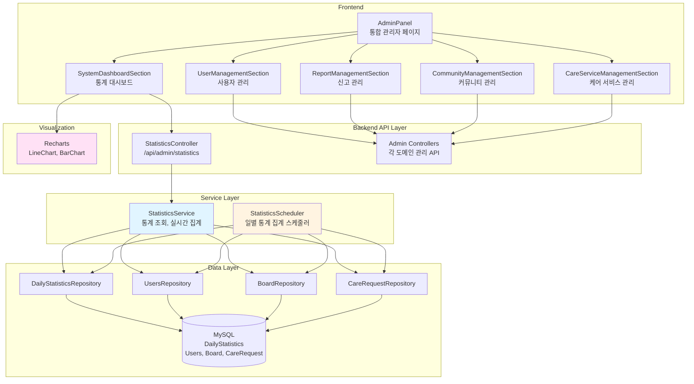
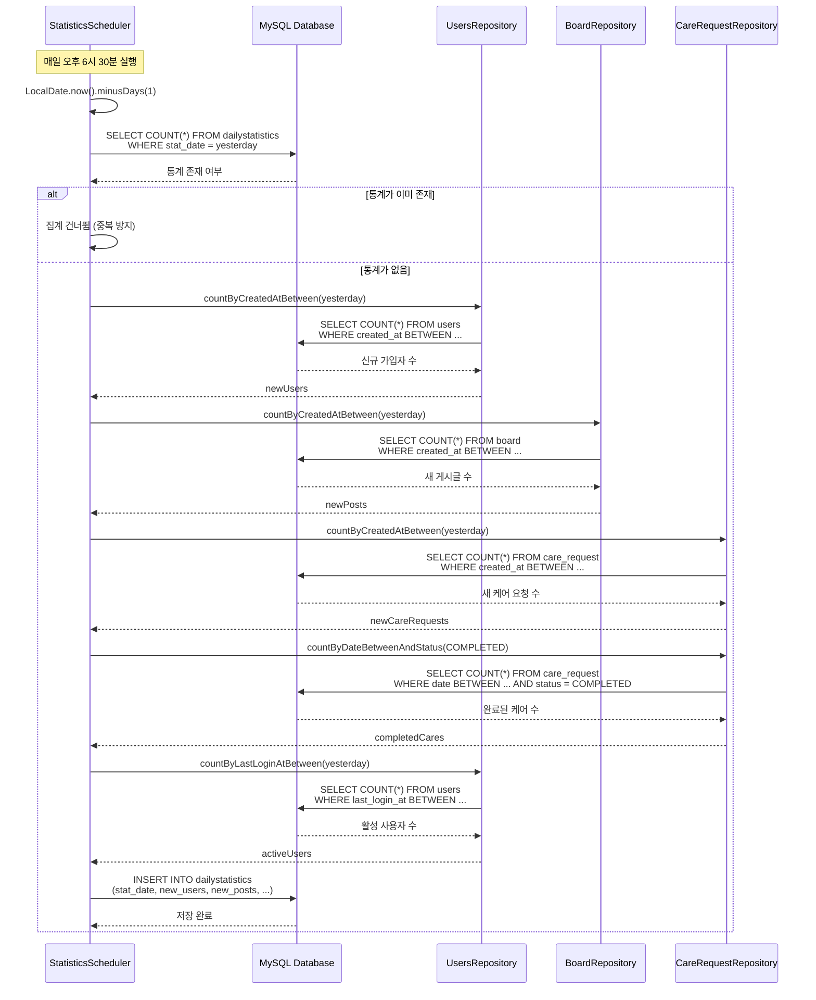
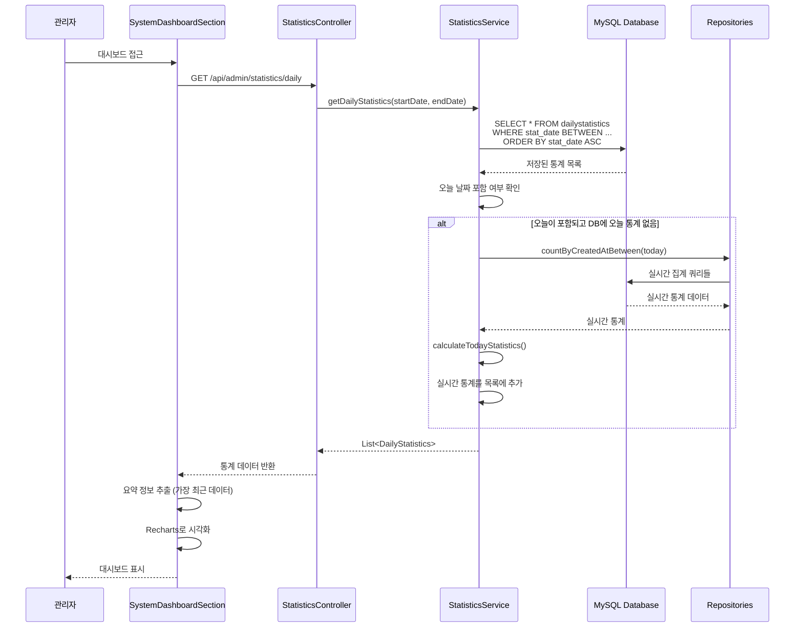
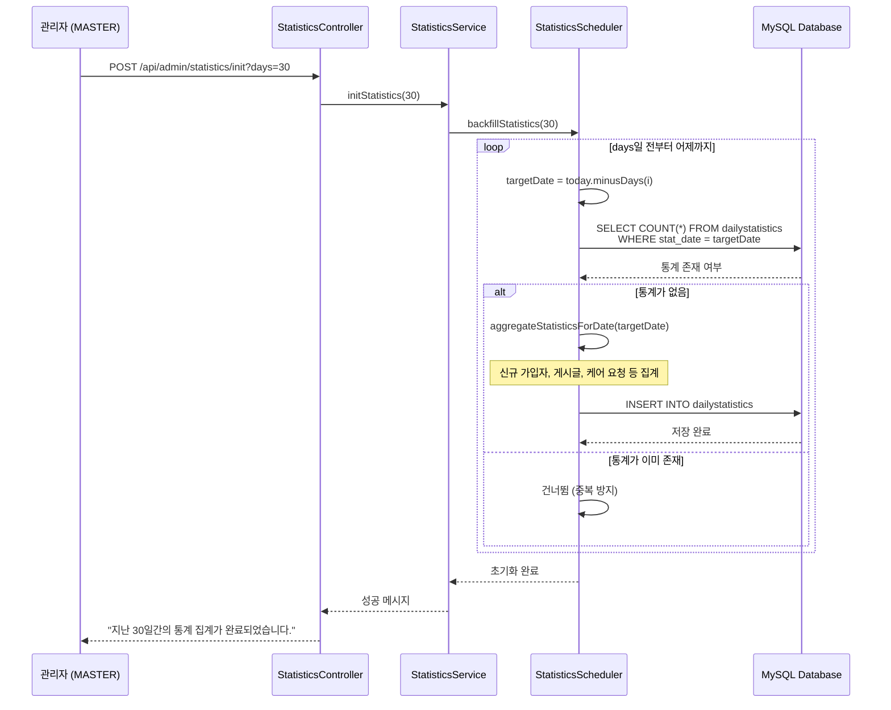

# 관리자 대시보드 & 통계 시스템 아키텍처

## 📋 개요

관리자 대시보드 & 통계 시스템은 Petory 서비스의 운영 현황을 한눈에 파악하기 위한 중앙 집중형 관리 도구입니다. 실시간 쿼리 부하를 줄이기 위해 `DailyStatistics` 테이블을 설계하여 일별 핵심 지표를 요약 저장하고, Recharts를 활용하여 시각화합니다. 또한 신고(Report), 유저, 콘텐츠, 케어 서비스 등을 한곳에서 제어하는 통합 관리자 페이지를 제공합니다.

## 🏗️ 시스템 아키텍처

### 전체 구조도



## 🔧 핵심 컴포넌트

### 1. StatisticsService (통계 조회 서비스)

**역할**: 일별 통계 조회, 실시간 통계 계산, 과거 데이터 초기화

**주요 메서드**:
- `getDailyStatistics()`: 기간별 일일 통계 조회 (오늘 포함 시 실시간 집계)
- `getDailyStatistics(date)`: 특정 날짜의 통계 조회
- `initStatistics()`: 과거 통계 초기화 (Backfill)
- `calculateTodayStatistics()`: 오늘 날짜의 실시간 통계 계산

**핵심 로직**:

#### 기간별 통계 조회 (실시간 집계 포함)
```java
public List<DailyStatistics> getDailyStatistics(LocalDate startDate, LocalDate endDate) {
    // 1. DB에서 저장된 통계 조회
    List<DailyStatistics> stats = dailyStatisticsRepository
        .findByStatDateBetweenOrderByStatDateAsc(startDate, endDate);
    
    LocalDate today = LocalDate.now();
    
    // 2. 조회 기간에 오늘이 포함되어 있고, DB에 오늘의 통계가 없는 경우
    if (!startDate.isAfter(today) && !endDate.isBefore(today)) {
        boolean todayExists = stats.stream()
            .anyMatch(s -> s.getStatDate().equals(today));
        
        // 3. 실시간 집계 추가
        if (!todayExists) {
            stats.add(calculateTodayStatistics());
        }
    }
    
    return stats;
}
```

#### 실시간 통계 계산
```java
private DailyStatistics calculateTodayStatistics() {
    LocalDate today = LocalDate.now();
    LocalDateTime startOfDay = today.atStartOfDay();
    LocalDateTime endOfDay = LocalDateTime.now(); // 현재 시점까지
    
    // 실시간 집계
    long newUsers = usersRepository.countByCreatedAtBetween(startOfDay, endOfDay);
    long newPosts = boardRepository.countByCreatedAtBetween(startOfDay, endOfDay);
    long newCareRequests = careRequestRepository.countByCreatedAtBetween(startOfDay, endOfDay);
    long completedCares = careRequestRepository.countByDateBetweenAndStatus(
        startOfDay, endOfDay, CareRequestStatus.COMPLETED);
    long activeUsers = usersRepository.countByLastLoginAtBetween(startOfDay, endOfDay);
    
    return DailyStatistics.builder()
        .statDate(today)
        .newUsers((int) newUsers)
        .newPosts((int) newPosts)
        .newCareRequests((int) newCareRequests)
        .completedCares((int) completedCares)
        .totalRevenue(BigDecimal.ZERO)
        .activeUsers((int) activeUsers)
        .build();
}
```

### 2. StatisticsScheduler (일별 통계 집계 스케줄러)

**역할**: 매일 자동으로 어제 날짜의 통계를 집계하여 `DailyStatistics` 테이블에 저장

**주요 메서드**:
- `aggregateDailyStatistics()`: 매일 오후 6시 30분에 실행되는 스케줄러
- `aggregateStatisticsForDate()`: 특정 날짜의 통계 집계 (재사용 가능)
- `backfillStatistics()`: 과거 데이터 초기화 (Backfill)

**핵심 로직**:

#### 일별 통계 집계 스케줄러
```java
@Scheduled(cron = "0 30 18 * * ?")
@Transactional
public void aggregateDailyStatistics() {
    // 어제 날짜의 통계 집계
    LocalDate yesterday = LocalDate.now().minusDays(1);
    aggregateStatisticsForDate(yesterday);
}
```

#### 특정 날짜 통계 집계
```java
@Transactional
public void aggregateStatisticsForDate(LocalDate date) {
    log.info("일일 통계 집계 시작: {}", date);
    
    // 1. 중복 방지: 이미 집계된 데이터가 있는지 확인
    if (dailyStatisticsRepository.findByStatDate(date).isPresent()) {
        log.warn("이미 {}의 통계가 존재합니다. 집계를 건너뜁니다.", date);
        return;
    }
    
    LocalDateTime startOfDay = date.atStartOfDay();
    LocalDateTime endOfDay = date.atTime(LocalTime.MAX);
    
    // 2. 신규 가입자
    long newUsers = usersRepository.countByCreatedAtBetween(startOfDay, endOfDay);
    
    // 3. 새 게시글
    long newPosts = boardRepository.countByCreatedAtBetween(startOfDay, endOfDay);
    
    // 4. 케어 요청
    long newCareRequests = careRequestRepository.countByCreatedAtBetween(startOfDay, endOfDay);
    
    // 5. 완료된 케어
    long completedCares = careRequestRepository.countByDateBetweenAndStatus(
        startOfDay, endOfDay, CareRequestStatus.COMPLETED);
    
    // 6. 매출 (현재 0으로 고정)
    BigDecimal totalRevenue = BigDecimal.ZERO;
    
    // 7. DAU (활성 사용자)
    long activeUsers = usersRepository.countByLastLoginAtBetween(startOfDay, endOfDay);
    
    // 8. DailyStatistics 저장
    DailyStatistics stats = DailyStatistics.builder()
        .statDate(date)
        .newUsers((int) newUsers)
        .newPosts((int) newPosts)
        .newCareRequests((int) newCareRequests)
        .completedCares((int) completedCares)
        .totalRevenue(totalRevenue)
        .activeUsers((int) activeUsers)
        .build();
    
    dailyStatisticsRepository.save(stats);
    log.info("일일 통계 집계 완료: {}", stats);
}
```

### 3. DailyStatistics 엔티티

**역할**: 일별 통계 데이터를 저장하는 엔티티

**주요 필드**:
- `statDate`: 통계 날짜 (Unique, NOT NULL)
- `newUsers`: 신규 가입자 수
- `newPosts`: 새 게시글 수
- `newCareRequests`: 새 케어 요청 수
- `completedCares`: 완료된 케어 수
- `totalRevenue`: 일 매출 (현재 0으로 고정)
- `activeUsers`: 일일 활성 사용자 수 (DAU)

**엔티티 구조**:
```java
@Entity
@Table(name = "dailystatistics")
public class DailyStatistics {
    @Id
    @GeneratedValue(strategy = GenerationType.IDENTITY)
    private Long id;
    
    @Column(name = "stat_date", unique = true, nullable = false)
    private LocalDate statDate;
    
    @Builder.Default
    @Column(name = "new_users")
    private Integer newUsers = 0;
    
    @Builder.Default
    @Column(name = "new_posts")
    private Integer newPosts = 0;
    
    @Builder.Default
    @Column(name = "new_care_requests")
    private Integer newCareRequests = 0;
    
    @Builder.Default
    @Column(name = "completed_cares")
    private Integer completedCares = 0;
    
    @Builder.Default
    @Column(name = "total_revenue")
    private BigDecimal totalRevenue = BigDecimal.ZERO;
    
    @Builder.Default
    @Column(name = "active_users")
    private Integer activeUsers = 0;
    
    // ... createdAt, updatedAt
}
```

### 4. SystemDashboardSection (프론트엔드 통계 대시보드)

**역할**: 통계 데이터를 시각화하여 관리자에게 제공

**주요 기능**:
- 상단 요약 카드: 오늘(또는 가장 최근) 데이터 요약 표시
- Line Chart: 서비스 성장 추이 (신규 가입, 활성 유저)
- Bar Chart: 서비스 활성화 (게시글, 케어 요청)

**핵심 로직**:

#### 통계 데이터 조회 및 시각화
```javascript
const SystemDashboardSection = () => {
  const [stats, setStats] = useState([]);
  const [summary, setSummary] = useState({
    newUsers: 0,
    newPosts: 0,
    newCareRequests: 0,
    activeUsers: 0,
    totalRevenue: 0
  });

  useEffect(() => {
    fetchStats();
  }, []);

  const fetchStats = async () => {
    try {
      // 기본적으로 최근 30일 데이터 조회
      const data = await adminApi.fetchDailyStatistics();
      setStats(data);
      
      // 오늘(또는 가장 최근) 데이터로 요약 정보 업데이트
      if (data.length > 0) {
        const latest = data[data.length - 1];
        setSummary({
          newUsers: latest.newUsers,
          newPosts: latest.newPosts,
          newCareRequests: latest.newCareRequests,
          activeUsers: latest.activeUsers,
          totalRevenue: latest.totalRevenue
        });
      }
    } catch (err) {
      console.error('Failed to fetch dashboard stats:', err);
      setError('통계 데이터를 불러오는데 실패했습니다.');
    }
  };

  return (
    <Wrapper>
      {/* 상단 요약 카드 */}
      <Grid>
        <MetricCard>
          <MetricLabel>신규 가입자 (오늘)</MetricLabel>
          <MetricValue>{summary.newUsers}명</MetricValue>
        </MetricCard>
        {/* ... 기타 요약 카드 */}
      </Grid>

      {/* Line Chart: 서비스 성장 추이 */}
      <LineChart data={stats}>
        <Line dataKey="newUsers" name="신규 가입" stroke="#8884d8" />
        <Line dataKey="activeUsers" name="활성 유저" stroke="#82ca9d" />
      </LineChart>

      {/* Bar Chart: 서비스 활성화 */}
      <BarChart data={stats}>
        <Bar dataKey="newPosts" name="게시글" fill="#8884d8" />
        <Bar dataKey="newCareRequests" name="케어 요청" fill="#ffc658" />
      </BarChart>
    </Wrapper>
  );
};
```

## 📊 데이터 흐름

### 1. 일별 통계 집계 흐름 (스케줄러)



### 2. 통계 조회 및 실시간 집계 흐름



### 3. 과거 데이터 초기화 (Backfill) 흐름



## 🎯 핵심 설계 전략

### 1. 일별 요약 데이터 전략 (Daily Summary Pattern)

**문제**: 실시간으로 무거운 집계 쿼리를 실행하면 DB 부하가 증가하고 응답 시간이 느려짐

**해결**: 일별 요약 데이터를 미리 집계하여 저장
- 매일 오후 6시 30분에 어제 날짜의 통계를 집계하여 `DailyStatistics` 테이블에 저장
- 대시보드 조회 시 간단한 `SELECT` 쿼리만 실행
- 오늘 날짜는 실시간 집계로 보정 (선택적)

**효과**:
- DB 부하 대폭 감소
- 빠른 응답 시간
- 과거 데이터 조회 성능 향상

### 2. 실시간 집계 보정 전략

**문제**: 오늘 날짜의 통계는 아직 스케줄러가 집계하지 않았음

**해결**: 조회 시점에 오늘이 포함되어 있고 DB에 오늘의 통계가 없으면 실시간 집계
- `calculateTodayStatistics()`로 현재 시점까지의 통계 계산
- 실시간 집계 결과를 조회 결과에 추가
- 다음날 스케줄러가 정확한 어제 데이터를 집계

**효과**:
- 오늘 데이터도 대시보드에서 확인 가능
- 실시간성과 성능의 균형 유지

### 3. 중복 집계 방지 전략

**문제**: 스케줄러가 중복 실행되거나 수동 초기화 시 중복 집계 가능

**해결**: 집계 전에 이미 존재하는지 확인
- `dailyStatisticsRepository.findByStatDate(date).isPresent()`로 확인
- 이미 존재하면 집계 건너뜀
- `statDate`에 `UNIQUE` 제약 조건으로 DB 레벨 보호

**효과**:
- 데이터 일관성 보장
- 불필요한 집계 작업 방지

### 4. 통합 관리자 페이지 전략

**문제**: 각 도메인별 관리 기능이 분산되어 있음

**해결**: 중앙 집중형 관리자 페이지 (`AdminPanel`)
- 단일 페이지에서 모든 관리 기능 접근
- 메뉴 기반 섹션 전환 (`SystemDashboardSection`, `UserManagementSection`, `ReportManagementSection` 등)
- 권한 기반 접근 제어 (`ADMIN`, `MASTER`)

**효과**:
- 관리자 편의성 향상
- 일관된 UI/UX
- 효율적인 운영 관리

### 5. 시각화 전략

**문제**: 숫자 데이터만으로는 트렌드 파악이 어려움

**해결**: Recharts를 활용한 다양한 차트 제공
- **Line Chart**: 서비스 성장 추이 (신규 가입, 활성 유저)
- **Bar Chart**: 서비스 활성화 (게시글, 케어 요청)
- **요약 카드**: 핵심 지표를 한눈에 확인

**효과**:
- 직관적인 데이터 이해
- 트렌드 파악 용이
- 의사결정 지원

## 🔄 도메인 간 연동

### 1. User 도메인 연동
- **용도**: 신규 가입자 수, 활성 사용자 수 (DAU) 집계
- **방법**: `UsersRepository.countByCreatedAtBetween()`, `countByLastLoginAtBetween()`
- **효과**: 사용자 성장 및 활성도 모니터링

### 2. Board 도메인 연동
- **용도**: 새 게시글 수 집계
- **방법**: `BoardRepository.countByCreatedAtBetween()`
- **효과**: 커뮤니티 활성도 모니터링

### 3. Care 도메인 연동
- **용도**: 새 케어 요청 수, 완료된 케어 수 집계
- **방법**: `CareRequestRepository.countByCreatedAtBetween()`, `countByDateBetweenAndStatus(COMPLETED)`
- **효과**: 케어 서비스 이용 현황 모니터링

## 📈 성능 최적화

### 1. DB 최적화

#### 인덱스 전략
```sql
-- 통계 날짜별 조회 (Unique Index)
CREATE UNIQUE INDEX idx_dailystatistics_stat_date ON dailystatistics(stat_date);

-- 기간별 조회 최적화
CREATE INDEX idx_dailystatistics_date_range ON dailystatistics(stat_date);

-- 집계 쿼리 최적화 (Users)
CREATE INDEX idx_users_created_at ON users(created_at);
CREATE INDEX idx_users_last_login_at ON users(last_login_at);

-- 집계 쿼리 최적화 (Board)
CREATE INDEX idx_board_created_at ON board(created_at);

-- 집계 쿼리 최적화 (CareRequest)
CREATE INDEX idx_care_request_created_at ON care_request(created_at);
CREATE INDEX idx_care_request_date_status ON care_request(date, status);
```

**선정 이유**:
- 통계 날짜별 조회가 빈번함
- 집계 쿼리의 성능 향상
- 기간별 조회 최적화

### 2. 애플리케이션 레벨 최적화

#### 일별 요약 데이터 활용
- **배치 집계**: 스케줄러로 미리 집계하여 저장
- **간단한 조회**: 대시보드 조회 시 `SELECT` 쿼리만 실행
- **실시간 보정**: 오늘 데이터만 선택적으로 실시간 집계

#### 트랜잭션 관리
- `@Transactional`로 데이터 일관성 보장
- 읽기 전용 트랜잭션 (`@Transactional(readOnly = true)`) 사용

#### 프론트엔드 최적화
- **메모이제이션**: `useMemo`, `useCallback` 활용
- **지연 로딩**: 필요 시에만 데이터 조회
- **ResponsiveContainer**: 반응형 차트 렌더링

## 🔐 보안 고려사항

### 1. 권한 제어
- **통계 조회**: `ADMIN`, `MASTER` 역할만 접근 가능 (`@PreAuthorize("hasAnyRole('ADMIN','MASTER')")`)
- **통계 초기화**: `MASTER` 역할만 접근 가능 (`@PreAuthorize("hasRole('MASTER')")`)
- **관리자 페이지**: `ADMIN`, `MASTER` 역할만 접근 가능

### 2. 데이터 검증
- 날짜 범위 검증: `startDate <= endDate`
- 기본값 설정: `startDate`와 `endDate`가 없으면 최근 30일로 설정
- 중복 집계 방지: `statDate`에 `UNIQUE` 제약 조건

### 3. 입력 검증
- SQL Injection 방지 (JPA 사용)
- XSS 방지 (DTO 변환 시 이스케이프)

## 📝 주요 API 엔드포인트

### 통계 조회
```
GET /api/admin/statistics/daily?startDate={yyyy-MM-dd}&endDate={yyyy-MM-dd}
→ List<DailyStatistics>
- ADMIN, MASTER 접근 가능
- 기본값: 최근 30일
- 오늘 포함 시 실시간 집계 추가
```

### 통계 초기화
```
POST /api/admin/statistics/init?days={days}
→ String (성공 메시지)
- MASTER만 접근 가능
- 과거 데이터 초기화 (Backfill)
```

## 🎯 핵심 포인트 요약

### 1. 일별 요약 데이터 전략
- **배치 집계**: 매일 오후 6시 30분에 어제 날짜의 통계 집계
- **간단한 조회**: 대시보드 조회 시 `SELECT` 쿼리만 실행
- **DB 부하 감소**: 실시간 집계 쿼리 대신 미리 집계된 데이터 활용

### 2. 실시간 집계 보정
- **오늘 데이터**: 조회 시점에 실시간 집계로 보정
- **선택적 적용**: 오늘이 포함되어 있고 DB에 없을 때만 실행
- **성능 균형**: 실시간성과 성능의 균형 유지

### 3. 중복 집계 방지
- **사전 확인**: 집계 전에 이미 존재하는지 확인
- **DB 제약**: `statDate`에 `UNIQUE` 제약 조건
- **데이터 일관성**: 중복 집계 방지로 일관성 보장

### 4. 통합 관리자 페이지
- **중앙 집중형**: 단일 페이지에서 모든 관리 기능 접근
- **섹션 기반**: 메뉴 기반 섹션 전환
- **권한 제어**: 역할 기반 접근 제어

### 5. 시각화
- **Line Chart**: 서비스 성장 추이 (신규 가입, 활성 유저)
- **Bar Chart**: 서비스 활성화 (게시글, 케어 요청)
- **요약 카드**: 핵심 지표를 한눈에 확인

### 6. 성능 최적화
- **인덱스 전략**: 통계 날짜, 집계 쿼리 최적화
- **배치 집계**: 스케줄러로 미리 집계
- **프론트엔드 최적화**: 메모이제이션, 지연 로딩
