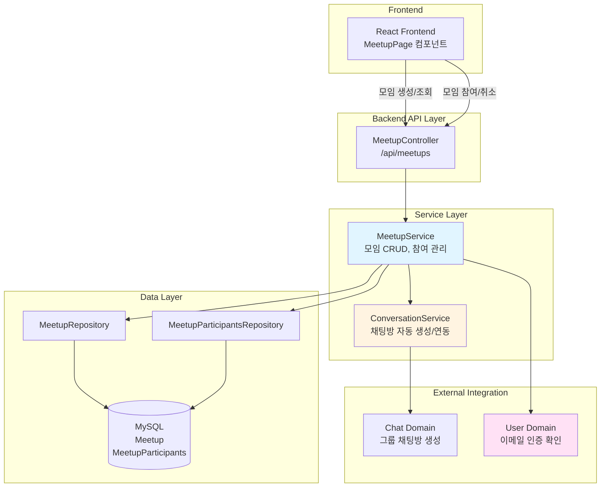
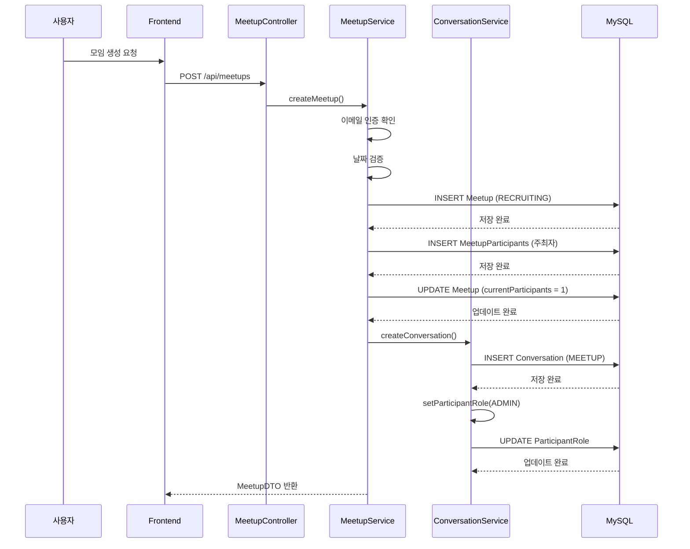
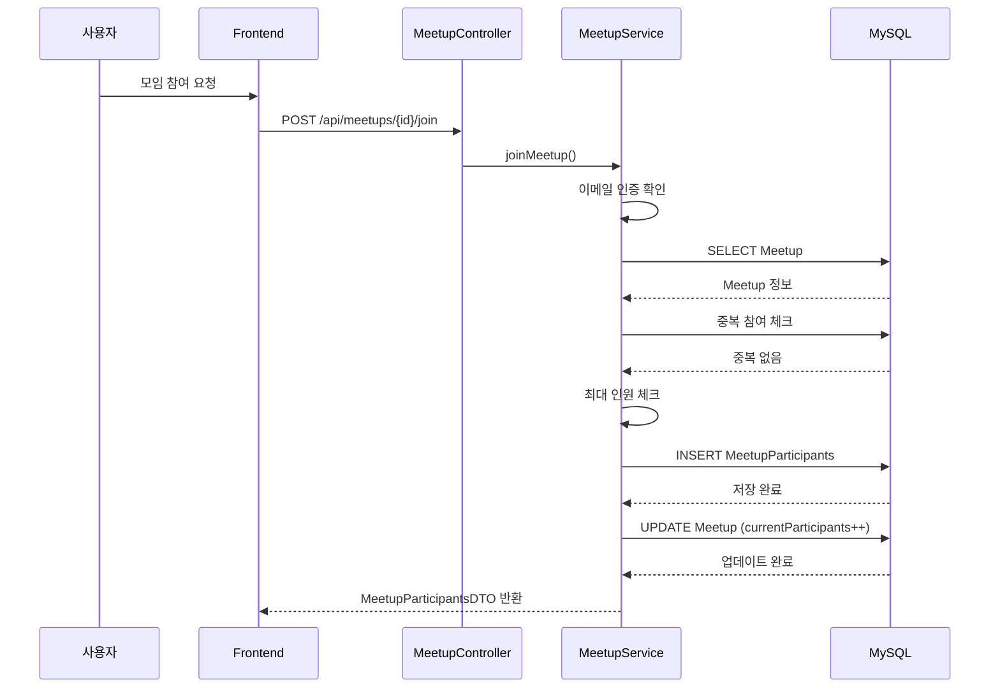
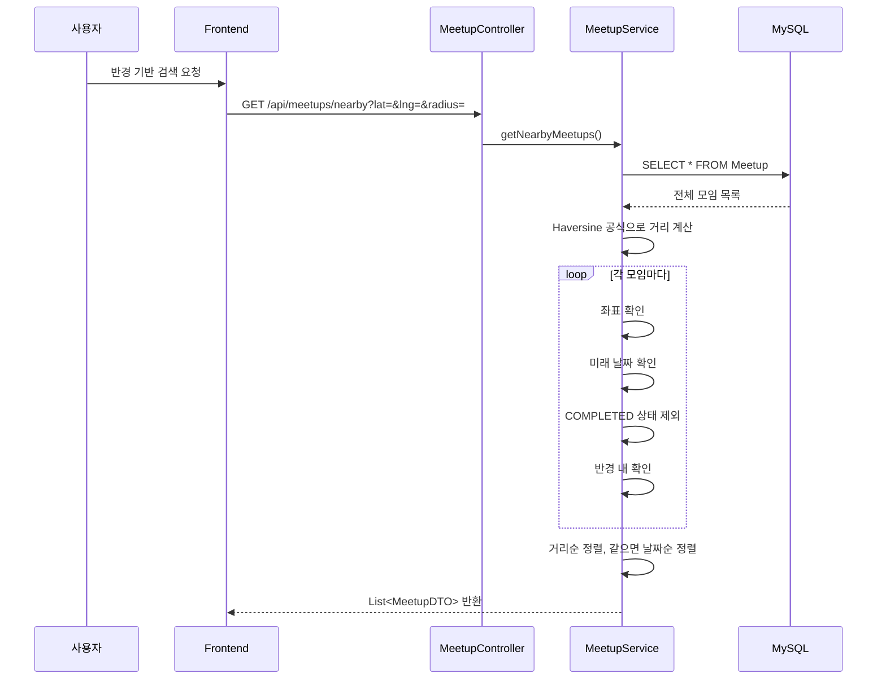

# 산책 & 오프라인 모임 (Meetup) 아키텍처

## 📋 개요

산책 & 오프라인 모임 도메인은 반려동물 산책 모임을 생성하고 참여할 수 있는 기능을 제공하는 핵심 도메인입니다. 위치 기반 검색, 최대 인원 제한, 채팅방 자동 연동 등을 통해 사용자들이 오프라인에서 만날 수 있는 모임을 쉽게 만들고 참여할 수 있도록 합니다.

## 🏗️ 시스템 아키텍처

### 전체 구조도



## 🔧 핵심 컴포넌트

### 1. MeetupService (모임 관리)

**역할**: 모임 CRUD, 참여 관리, 위치 기반 검색

**주요 메서드**:
- `createMeetup()`: 모임 생성 (이메일 인증 필수, 채팅방 자동 생성)
- `joinMeetup()`: 모임 참여 (최대 인원 제한, 동시성 제어)
- `cancelMeetupParticipation()`: 모임 참여 취소 (채팅방 자동 나가기)
- `getNearbyMeetups()`: 반경 기반 모임 검색 (Haversine 공식)

**핵심 로직**:

#### 모임 생성 프로세스
```java
@Transactional
public MeetupDTO createMeetup(MeetupDTO meetupDTO, String userId) {
    // 1. 이메일 인증 확인
    if (organizer.getEmailVerified() == null || !organizer.getEmailVerified()) {
        throw new EmailVerificationRequiredException("모임 생성을 위해 이메일 인증이 필요합니다.");
    }
    
    // 2. 날짜 검증
    if (meetupDTO.getDate().isBefore(LocalDateTime.now())) {
        throw new RuntimeException("모임 일시는 현재 시간 이후여야 합니다.");
    }
    
    // 3. 모임 생성
    Meetup meetup = Meetup.builder()
            .organizer(organizer)
            .currentParticipants(0)
            .status(MeetupStatus.RECRUITING)
            .build();
    
    // 4. 주최자 자동 참여
    MeetupParticipants organizerParticipant = MeetupParticipants.builder()
            .meetup(savedMeetup)
            .user(organizer)
            .build();
    savedMeetup.setCurrentParticipants(1);
    
    // 5. 그룹 채팅방 자동 생성 (주최자 ADMIN 역할)
    conversationService.createConversation(
        ConversationType.MEETUP,
        RelatedType.MEETUP,
        savedMeetup.getIdx(),
        savedMeetup.getTitle(),
        List.of(organizer.getIdx())
    );
    conversationService.setParticipantRole(
        RelatedType.MEETUP,
        savedMeetup.getIdx(),
        organizer.getIdx(),
        ParticipantRole.ADMIN
    );
}
```

#### 모임 참여 프로세스
```java
@Transactional
public MeetupParticipantsDTO joinMeetup(Long meetupIdx, String userId) {
    // 1. 이메일 인증 확인
    if (user.getEmailVerified() == null || !user.getEmailVerified()) {
        throw new EmailVerificationRequiredException("모임 참여를 위해 이메일 인증이 필요합니다.");
    }
    
    // 2. 중복 참여 체크
    if (meetupParticipantsRepository.existsByMeetupIdxAndUserIdx(meetupIdx, userIdx)) {
        throw new RuntimeException("이미 참가한 모임입니다.");
    }
    
    // 3. 최대 인원 체크 (주최자 제외)
    if (!meetup.getOrganizer().getIdx().equals(userIdx)) {
        if (meetup.getCurrentParticipants() >= meetup.getMaxParticipants()) {
            throw new RuntimeException("모임 인원이 가득 찼습니다.");
        }
    }
    
    // 4. 참가자 추가 및 인원 증가
    MeetupParticipants participant = MeetupParticipants.builder()
            .meetup(meetup)
            .user(user)
            .build();
    
    if (!meetup.getOrganizer().getIdx().equals(userIdx)) {
        meetup.setCurrentParticipants(meetup.getCurrentParticipants() + 1);
    }
}
```

#### 반경 기반 검색 (Haversine 공식)
```java
public List<MeetupDTO> getNearbyMeetups(Double lat, Double lng, Double radiusKm) {
    // Haversine 공식으로 거리 계산
    Function<Meetup, Double> calculateDistance = (meetup) -> {
        double lat1 = Math.toRadians(lat);
        double lat2 = Math.toRadians(meetup.getLatitude());
        double lon1 = Math.toRadians(lng);
        double lon2 = Math.toRadians(meetup.getLongitude());
        
        double dLat = lat2 - lat1;
        double dLon = lon2 - lon1;
        
        double a = Math.sin(dLat / 2) * Math.sin(dLat / 2) +
                Math.cos(lat1) * Math.cos(lat2) *
                Math.sin(dLon / 2) * Math.sin(dLon / 2);
        double c = 2 * Math.atan2(Math.sqrt(a), Math.sqrt(1 - a));
        return 6371 * c; // 지구 반지름 6371km
    };
    
    // 필터링: 좌표 있는 모임만, 미래 날짜만, COMPLETED 상태 제외
    // 정렬: 거리순 정렬, 같으면 날짜순 정렬
}
```

### 2. 상태 관리

**상태 전이**:
```
RECRUITING → CLOSED → COMPLETED
```

**상태 설명**:
- `RECRUITING`: 모집 중 (기본 상태)
- `CLOSED`: 마감 (최대 인원 도달 또는 수동 마감)
- `COMPLETED`: 종료 (모임 일시 지남)

**상태 전이 규칙**:
- 모임 생성 시: `RECRUITING` 상태로 시작
- 최대 인원 도달 시: `CLOSED` 상태로 변경 가능
- 모임 일시 지남: `COMPLETED` 상태로 변경 (자동 또는 수동)

### 3. 인원 관리

**인원 관리 로직**:
- 주최자는 자동으로 참가자에 포함 (`currentParticipants = 1`)
- 주최자는 `currentParticipants`에 포함되지 않음 (최대 인원 체크 시 제외)
- 참여 시: 주최자가 아닌 경우에만 `currentParticipants` 증가
- 참여 취소 시: `currentParticipants` 감소 (최소 0)

**동시성 제어**:
- `@Transactional`로 트랜잭션 보장
- 중복 참여 체크: `existsByMeetupIdxAndUserIdx()`로 DB 레벨 체크
- 최대 인원 체크: 트랜잭션 내에서 체크 및 증가

## 📊 데이터 흐름

### 1. 모임 생성 및 채팅방 연동 흐름



### 2. 모임 참여 흐름



### 3. 반경 기반 검색 흐름



## 🎯 핵심 설계 전략

### 1. 위치 기반 검색 전략

**문제**: 사용자 위치 기준으로 가까운 모임을 찾아야 함

**해결**: Haversine 공식 사용
- 지구를 구로 가정한 대원 거리 계산
- 지구 반지름: 6371km
- 미터 단위로 정확한 거리 계산

**필터링 조건**:
- 좌표가 있는 모임만 포함
- 미래 날짜만 포함 (`date > now`)
- `COMPLETED` 상태 제외

**정렬 전략**:
- 거리순 정렬 (가까운 순)
- 거리가 같으면 날짜순 정렬 (빠른 순)

**효과**:
- 사용자 위치 기준으로 가까운 모임 우선 표시
- 정확한 거리 계산으로 신뢰도 향상

### 2. 인원 관리 전략

**문제**: 최대 인원 제한을 정확하게 관리해야 함

**해결**: 주최자 제외 인원 관리
- 주최자는 자동으로 참가자에 포함되지만 `currentParticipants`에 포함되지 않음
- 최대 인원 체크 시 주최자 제외
- 참여 시 주최자가 아닌 경우에만 `currentParticipants` 증가

**동시성 제어**:
- `@Transactional`로 트랜잭션 보장
- 중복 참여 체크: DB 레벨 체크 (`existsByMeetupIdxAndUserIdx`)
- 최대 인원 체크: 트랜잭션 내에서 체크 및 증가

**효과**:
- 정확한 인원 수 관리
- 동시 참여 시에도 인원 수 정확성 보장

### 3. 채팅 연동 전략

**문제**: 모임 생성 시 자동으로 채팅방을 만들어야 함

**해결**: 모임 생성 시 그룹 채팅방 자동 생성
- 모임 생성 시 `ConversationService.createConversation()` 호출
- 주최자를 ADMIN 역할로 설정
- 참여 시 채팅방 자동 참여
- 참여 취소 시 채팅방 자동 나가기

**에러 처리**:
- 채팅방 생성 실패해도 모임 생성은 성공으로 처리
- 채팅방 나가기 실패해도 모임 참여 취소는 성공으로 처리

**효과**:
- 사용자 개입 없이 자동으로 채팅방 생성
- 모임 참여자 간 소통 편의성 향상

### 4. 이메일 인증 필수 전략

**문제**: 신뢰할 수 있는 사용자만 모임을 생성/참여해야 함

**해결**: 이메일 인증 필수
- 모임 생성 시 이메일 인증 확인
- 모임 참여 시 이메일 인증 확인
- 미인증 사용자는 모임 생성/참여 불가

**효과**:
- 신뢰할 수 있는 사용자만 서비스 이용
- 스팸 및 악의적 사용 방지

### 5. 상태 관리 전략

**문제**: 모임의 생애주기를 명확하게 관리해야 함

**해결**: 상태 기반 전이 관리
- `RECRUITING`: 모집 중 (기본 상태)
- `CLOSED`: 마감 (최대 인원 도달 또는 수동 마감)
- `COMPLETED`: 종료 (모임 일시 지남)

**상태 전이 규칙**:
- 모임 생성 시: `RECRUITING` 상태로 시작
- 최대 인원 도달 시: `CLOSED` 상태로 변경 가능
- 모임 일시 지남: `COMPLETED` 상태로 변경 (자동 또는 수동)

**효과**:
- 명확한 모임 상태 관리
- 사용자가 모임 상태를 쉽게 파악 가능

## 🔄 도메인 간 연동

### 1. Chat 도메인 연동
- **용도**: 모임 생성 시 그룹 채팅방 자동 생성 및 연동
- **방법**: `ConversationService.createConversation()`, `setParticipantRole()` 호출
- **효과**: 모임 참여자 간 소통 편의성 향상

### 2. User 도메인 연동
- **용도**: 이메일 인증 확인
- **방법**: `Users.emailVerified` 필드 확인
- **효과**: 신뢰할 수 있는 사용자만 서비스 이용

## 📈 성능 최적화

### 1. DB 최적화

#### 인덱스 전략
```sql
-- 주최자별 모임 조회
CREATE INDEX idx_meetup_organizer ON meetup(organizer_idx, created_at DESC);

-- 날짜별 모임 조회
CREATE INDEX idx_meetup_date ON meetup(date);

-- 상태별 모임 조회
CREATE INDEX idx_meetup_status ON meetup(status);

-- 위치 기반 검색 (위도/경도)
CREATE INDEX idx_meetup_location ON meetup(latitude, longitude);

-- 참가자 조회
CREATE INDEX idx_meetup_participants ON meetupparticipants(meetup_idx, user_idx);
```

**선정 이유**:
- 주최자별 조회가 빈번함
- 날짜별 필터링이 자주 사용됨
- 위치 기반 검색 최적화
- 참가자 조회 성능 향상

### 2. 애플리케이션 레벨 최적화

#### 반경 기반 검색 최적화
- **전체 조회 후 필터링**: Native query 문제 회피를 위해 Java에서 필터링
- **스트림 처리**: Java Stream API로 효율적인 필터링 및 정렬
- **거리 계산 캐싱**: 거리 계산 결과를 Map.Entry로 저장하여 재사용

#### 트랜잭션 관리
- `@Transactional`로 데이터 일관성 보장
- 읽기 전용 트랜잭션 (`@Transactional(readOnly = true)`) 사용

## 🔐 보안 고려사항

### 1. 권한 제어
- 모임 생성: 이메일 인증 필수
- 모임 참여: 이메일 인증 필수
- 모임 수정/삭제: 주최자만 가능 (추가 구현 필요)

### 2. 데이터 검증
- 날짜 검증: 모임 일시는 현재 시간 이후여야 함
- 중복 참여 방지: DB 레벨 체크
- 최대 인원 체크: 트랜잭션 내에서 체크

### 3. 입력 검증
- SQL Injection 방지 (JPA 사용)
- XSS 방지 (DTO 변환 시 이스케이프)

## 📝 주요 API 엔드포인트

### 모임 관리
```
GET /api/meetups
→ List<MeetupDTO>

GET /api/meetups/{id}
→ MeetupDTO

POST /api/meetups
→ MeetupDTO

PUT /api/meetups/{id}
→ MeetupDTO

DELETE /api/meetups/{id}
→ 204 No Content
```

### 모임 검색
```
GET /api/meetups/nearby?lat={위도}&lng={경도}&radius={반경km}
→ List<MeetupDTO>

GET /api/meetups/search?keyword={키워드}
→ List<MeetupDTO>

GET /api/meetups/location?minLat=&maxLat=&minLng=&maxLng=
→ List<MeetupDTO>
```

### 모임 참여
```
POST /api/meetups/{id}/join
→ MeetupParticipantsDTO

DELETE /api/meetups/{id}/join
→ 204 No Content

GET /api/meetups/{id}/participants
→ List<MeetupParticipantsDTO>
```

## 🎯 핵심 포인트 요약

### 1. 모임 생성 및 참여
- **생성**: 이메일 인증 필수, 주최자 자동 참여, 채팅방 자동 생성
- **참여**: 이메일 인증 필수, 최대 인원 제한, 동시성 제어
- **취소**: 주최자 보호, 채팅방 자동 나가기

### 2. 위치 기반 검색
- **Haversine 공식**: 지구 반지름 6371km 사용, 미터 단위 정확한 거리 계산
- **필터링**: 좌표 있는 모임만, 미래 날짜만, COMPLETED 상태 제외
- **정렬**: 거리순 정렬, 같으면 날짜순 정렬

### 3. 인원 관리
- **주최자 제외**: 주최자는 `currentParticipants`에 포함되지 않음
- **동시성 제어**: `@Transactional`로 트랜잭션 보장
- **정확한 인원 수**: 중복 참여 방지, 최대 인원 체크

### 4. 채팅 연동
- **자동 생성**: 모임 생성 시 그룹 채팅방 자동 생성
- **자동 참여**: 모임 참여 시 채팅방 자동 참여
- **자동 나가기**: 모임 참여 취소 시 채팅방 자동 나가기

### 5. 상태 관리
- **상태 전이**: RECRUITING → CLOSED → COMPLETED
- **명확한 규칙**: 각 상태별 명확한 전이 규칙
- **자동/수동**: 상태 변경은 자동 또는 수동으로 가능

### 6. 이메일 인증
- **필수 조건**: 모임 생성/참여 시 이메일 인증 필수
- **신뢰성**: 신뢰할 수 있는 사용자만 서비스 이용
- **보안**: 스팸 및 악의적 사용 방지
