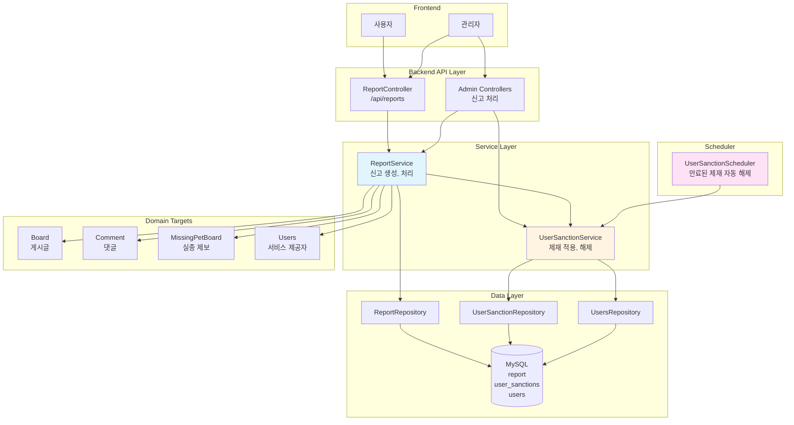
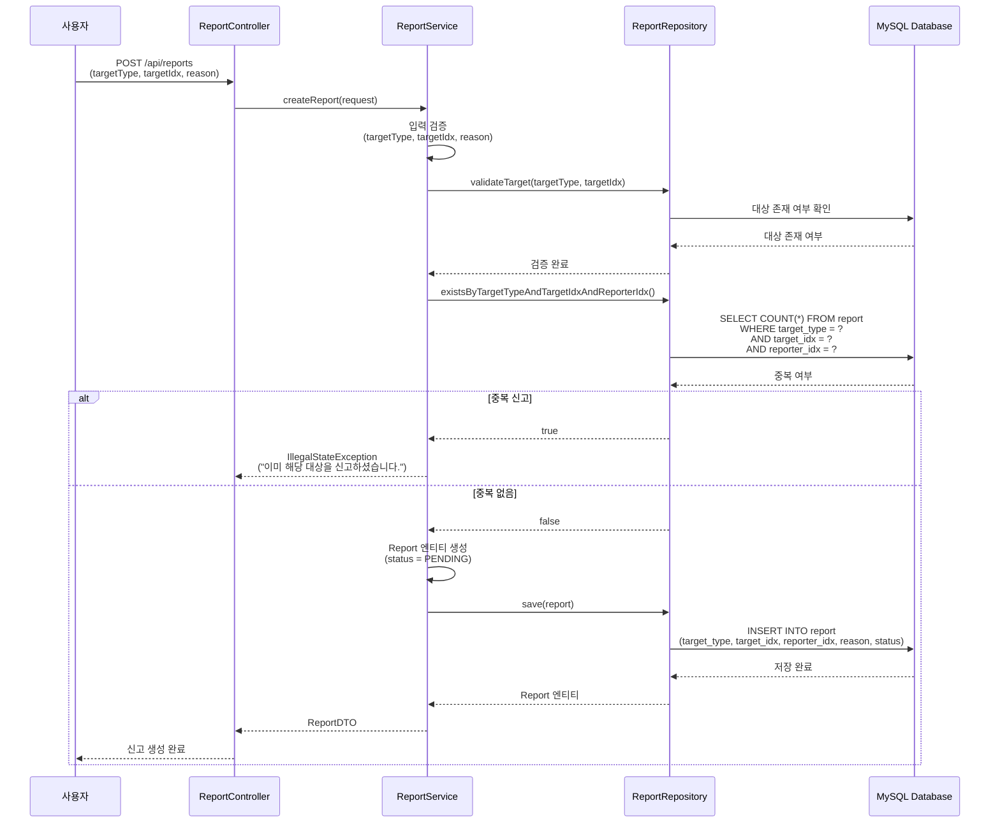
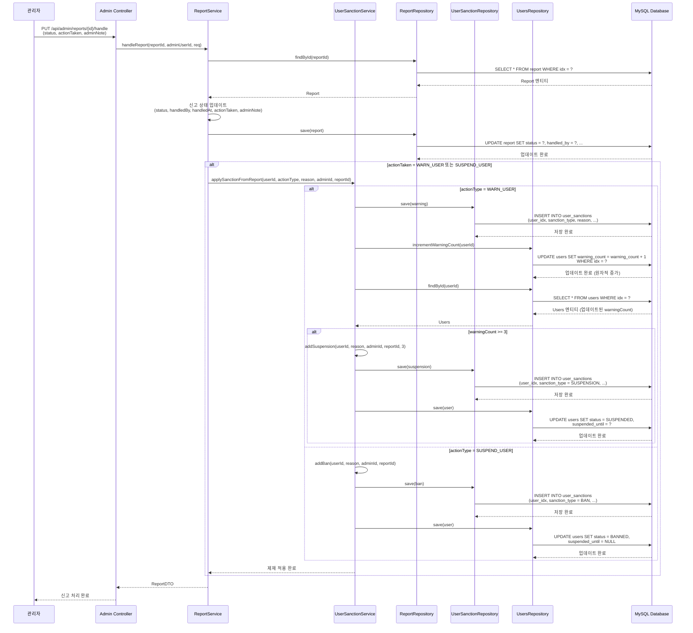
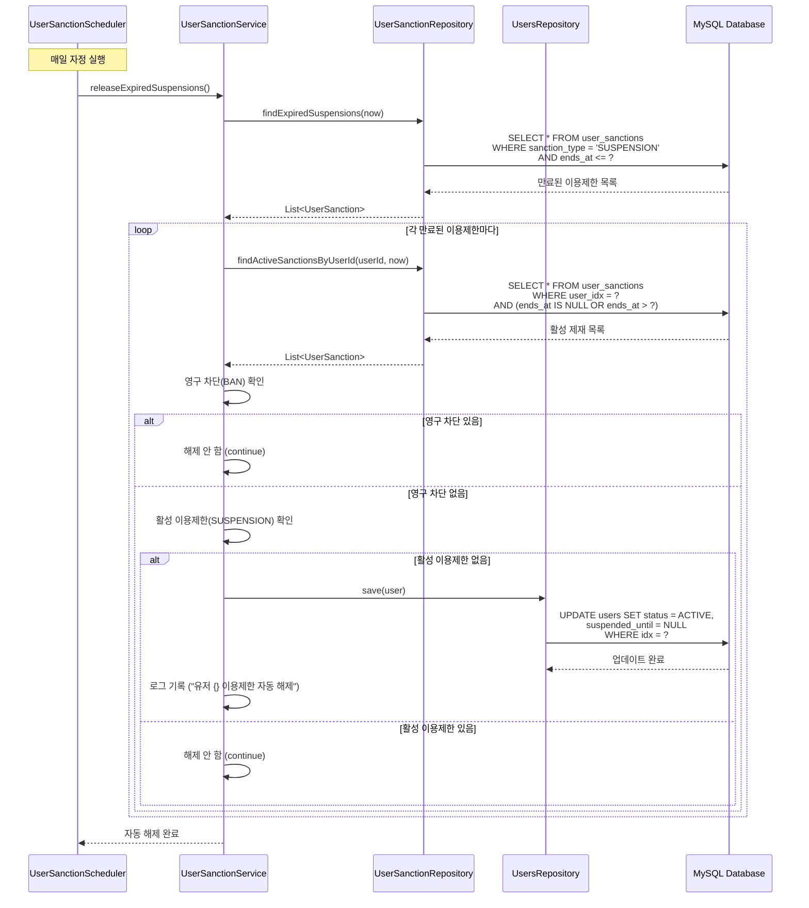
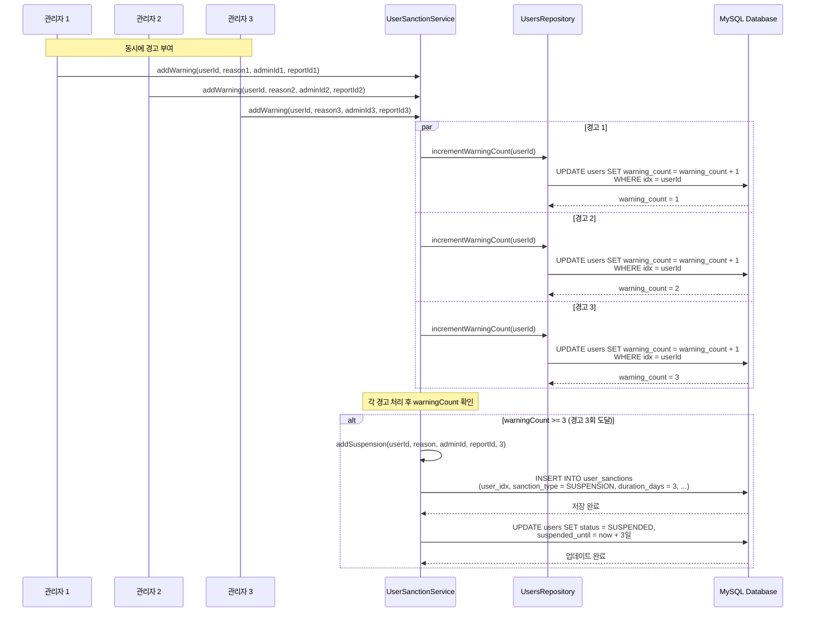

# 신고 및 제재 시스템 아키텍처

## 📋 개요

신고 및 제재 시스템은 Petory 서비스의 유해 콘텐츠와 부적절한 사용자를 관리하기 위한 핵심 기능입니다. 다양한 신고 타입을 지원하며, 경고 누적 시 자동 제재를 적용하고, 관리자의 수동 제재와 스케줄러를 통한 자동 해제를 제공합니다. 동시성 제어를 통해 여러 관리자가 동시에 경고를 부여해도 정확한 경고 횟수를 보장합니다.

## 🏗️ 시스템 아키텍처

### 전체 구조도



## 🔧 핵심 컴포넌트

### 1. ReportService (신고 서비스)

**역할**: 신고 생성, 조회, 처리, 제재 자동 적용

**주요 메서드**:
- `createReport()`: 신고 생성 (중복 방지)
- `getReports()`: 신고 목록 조회 (필터링 지원)
- `getReportDetail()`: 신고 상세 조회 (대상 미리보기 포함)
- `handleReport()`: 신고 처리 및 제재 자동 적용

**핵심 로직**:

#### 신고 생성
```java
@Transactional
public ReportDTO createReport(ReportRequestDTO request) {
    // 1. 입력 검증
    if (request.getTargetType() == null) {
        throw new IllegalArgumentException("신고 대상 종류를 선택해주세요.");
    }
    if (request.getTargetIdx() == null) {
        throw new IllegalArgumentException("신고 대상 ID가 필요합니다.");
    }
    if (!StringUtils.hasText(request.getReason())) {
        throw new IllegalArgumentException("신고 사유를 입력해주세요.");
    }
    
    // 2. 신고 대상 검증
    validateTarget(request.getTargetType(), request.getTargetIdx());
    
    // 3. 중복 신고 방지 (DB Unique Constraint)
    if (reportRepository.existsByTargetTypeAndTargetIdxAndReporterIdx(
            request.getTargetType(),
            request.getTargetIdx(),
            reporter.getIdx())) {
        throw new IllegalStateException("이미 해당 대상을 신고하셨습니다.");
    }
    
    // 4. 신고 생성
    Report report = Report.builder()
        .targetType(request.getTargetType())
        .targetIdx(request.getTargetIdx())
        .reporter(reporter)
        .reason(request.getReason().trim())
        .status(ReportStatus.PENDING)
        .build();
    
    return reportConverter.toDTO(reportRepository.save(report));
}
```

#### 신고 처리 및 제재 자동 적용
```java
@Transactional
public ReportDTO handleReport(Long reportId, Long adminUserId, ReportHandleRequest req) {
    Report report = reportRepository.findById(reportId)
        .orElseThrow(() -> new IllegalArgumentException("신고 정보를 찾을 수 없습니다."));
    Users admin = usersRepository.findById(adminUserId)
        .orElseThrow(() -> new IllegalArgumentException("관리자 정보를 찾을 수 없습니다."));
    
    // 1. 신고 상태 업데이트
    report.setStatus(req.getStatus());
    report.setHandledBy(admin);
    report.setHandledAt(LocalDateTime.now());
    report.setAdminNote(req.getAdminNote());
    report.setActionTaken(req.getActionTaken() != null ? req.getActionTaken() : ReportActionType.NONE);
    
    // 2. 제재 조치가 있으면 자동 적용
    if (req.getActionTaken() != null &&
            (req.getActionTaken() == ReportActionType.WARN_USER ||
             req.getActionTaken() == ReportActionType.SUSPEND_USER)) {
        String sanctionReason = String.format("신고 #%d 처리: %s", reportId,
                req.getAdminNote() != null ? req.getAdminNote() : report.getReason());
        userSanctionService.applySanctionFromReport(
                report.getTargetIdx(),
                req.getActionTaken(),
                sanctionReason,
                admin.getIdx(),
                reportId);
    }
    
    return reportConverter.toDTO(report);
}
```

### 2. UserSanctionService (제재 서비스)

**역할**: 제재 적용, 해제, 자동 제재 로직

**주요 메서드**:
- `addWarning()`: 경고 추가 (경고 3회 누적 시 자동 이용제한)
- `addSuspension()`: 이용제한 추가 (일시적)
- `addBan()`: 영구 차단
- `releaseSanction()`: 제재 해제 (관리자 수동)
- `releaseExpiredSuspensions()`: 만료된 이용제한 자동 해제
- `applySanctionFromReport()`: 신고 처리 시 자동 제재 적용

**핵심 로직**:

#### 경고 추가 및 자동 이용제한
```java
@Transactional
public UserSanction addWarning(Long userId, String reason, Long adminId, Long reportId) {
    Users user = usersRepository.findById(userId)
        .orElseThrow(() -> new IllegalArgumentException("유저를 찾을 수 없습니다."));
    
    // 1. 경고 추가
    UserSanction warning = UserSanction.builder()
        .user(user)
        .sanctionType(UserSanction.SanctionType.WARNING)
        .reason(reason)
        .durationDays(null) // 경고는 기간 없음
        .startsAt(LocalDateTime.now())
        .endsAt(null)
        .admin(admin)
        .reportIdx(reportId)
        .build();
    
    sanctionRepository.save(warning);
    
    // 2. 경고 횟수 원자적 증가 (동시성 문제 해결)
    usersRepository.incrementWarningCount(userId);
    
    // 3. 업데이트된 사용자 정보 다시 조회
    user = usersRepository.findById(userId)
        .orElseThrow(() -> new IllegalArgumentException("유저를 찾을 수 없습니다."));
    
    // 4. 경고 3회 이상이면 자동 이용제한
    if (user.getWarningCount() >= WARNING_THRESHOLD) {
        log.info("유저 {} 경고 {}회 도달, 자동 이용제한 {}일 적용", 
            userId, user.getWarningCount(), AUTO_SUSPENSION_DAYS);
        addSuspension(userId,
            String.format("경고 %d회 누적으로 인한 자동 이용제한", user.getWarningCount()),
            adminId,
            reportId,
            AUTO_SUSPENSION_DAYS);
    }
    
    return warning;
}
```

#### 이용제한 추가
```java
@Transactional
public UserSanction addSuspension(Long userId, String reason, Long adminId, Long reportId, int days) {
    Users user = usersRepository.findById(userId)
        .orElseThrow(() -> new IllegalArgumentException("유저를 찾을 수 없습니다."));
    
    LocalDateTime now = LocalDateTime.now();
    LocalDateTime endsAt = now.plusDays(days);
    
    // 1. 이용제한 추가
    UserSanction suspension = UserSanction.builder()
        .user(user)
        .sanctionType(UserSanction.SanctionType.SUSPENSION)
        .reason(reason)
        .durationDays(days)
        .startsAt(now)
        .endsAt(endsAt)
        .admin(admin)
        .reportIdx(reportId)
        .build();
    
    sanctionRepository.save(suspension);
    
    // 2. 유저 상태 업데이트
    user.setStatus(UserStatus.SUSPENDED);
    user.setSuspendedUntil(endsAt);
    usersRepository.save(user);
    
    return suspension;
}
```

#### 만료된 이용제한 자동 해제
```java
@Transactional
public void releaseExpiredSuspensions() {
    List<UserSanction> expired = sanctionRepository.findExpiredSuspensions(LocalDateTime.now());
    
    for (UserSanction sanction : expired) {
        Users user = sanction.getUser();
        
        // 1. 다른 활성 제재가 있는지 확인
        List<UserSanction> activeSanctions = sanctionRepository.findActiveSanctionsByUserId(
            user.getIdx(), LocalDateTime.now());
        
        // 2. 영구 차단이 있으면 그대로 유지
        boolean hasActiveBan = activeSanctions.stream()
            .anyMatch(s -> s.getSanctionType() == UserSanction.SanctionType.BAN);
        
        if (hasActiveBan) {
            continue;
        }
        
        // 3. 활성 이용제한이 없으면 해제
        boolean hasActiveSuspension = activeSanctions.stream()
            .anyMatch(s -> s.getSanctionType() == UserSanction.SanctionType.SUSPENSION
                && s.getEndsAt() != null && s.getEndsAt().isAfter(LocalDateTime.now()));
        
        if (!hasActiveSuspension) {
            user.setStatus(UserStatus.ACTIVE);
            user.setSuspendedUntil(null);
            usersRepository.save(user);
            log.info("유저 {} 이용제한 자동 해제", user.getIdx());
        }
    }
}
```

### 3. Report 엔티티

**역할**: 신고 데이터를 저장하는 엔티티

**주요 필드**:
- `idx`: 신고 ID
- `targetType`: 신고 대상 타입 (`BOARD`, `COMMENT`, `MISSING_PET`, `PET_CARE_PROVIDER`)
- `targetIdx`: 신고 대상 ID
- `reporter`: 신고자
- `reason`: 신고 사유
- `status`: 신고 상태 (`PENDING`, `RESOLVED`, `REJECTED`)
- `handledBy`: 처리한 관리자
- `handledAt`: 처리 시간
- `actionTaken`: 조치 타입 (`NONE`, `DELETE_CONTENT`, `SUSPEND_USER`, `WARN_USER`, `OTHER`)
- `adminNote`: 관리자 메모

**엔티티 구조**:
```java
@Entity
@Table(name = "report", uniqueConstraints = @UniqueConstraint(
    columnNames = { "target_type", "target_idx", "reporter_idx" }))
public class Report {
    @Id
    @GeneratedValue(strategy = GenerationType.IDENTITY)
    private Long idx;
    
    @Enumerated(EnumType.STRING)
    @Column(name = "target_type", nullable = false)
    private ReportTargetType targetType;
    
    @Column(name = "target_idx", nullable = false)
    private Long targetIdx;
    
    @ManyToOne(fetch = FetchType.LAZY)
    @JoinColumn(name = "reporter_idx", nullable = false)
    private Users reporter;
    
    @Column(name = "reason", nullable = false, columnDefinition = "TEXT")
    private String reason;
    
    @Enumerated(EnumType.STRING)
    @Column(name = "status", nullable = false)
    @Builder.Default
    private ReportStatus status = ReportStatus.PENDING;
    
    @ManyToOne(fetch = FetchType.LAZY)
    @JoinColumn(name = "handled_by")
    private Users handledBy;
    
    @Column(name = "handled_at")
    private LocalDateTime handledAt;
    
    @Enumerated(EnumType.STRING)
    @Column(name = "action_taken", nullable = false)
    @Builder.Default
    private ReportActionType actionTaken = ReportActionType.NONE;
    
    @Column(name = "admin_note", columnDefinition = "TEXT")
    private String adminNote;
}
```

**Unique Constraint**: `(target_type, target_idx, reporter_idx)` - 동일 사용자가 동일 대상을 중복 신고 방지

### 4. UserSanction 엔티티

**역할**: 제재 이력을 저장하는 엔티티

**주요 필드**:
- `idx`: 제재 ID
- `user`: 제재 대상 사용자
- `sanctionType`: 제재 타입 (`WARNING`, `SUSPENSION`, `BAN`)
- `reason`: 제재 사유
- `durationDays`: 제재 기간 (일, null이면 영구)
- `startsAt`: 제재 시작 시간
- `endsAt`: 제재 종료 시간 (null이면 영구)
- `admin`: 처리한 관리자
- `reportIdx`: 관련 신고 ID

**엔티티 구조**:
```java
@Entity
@Table(name = "user_sanctions")
public class UserSanction {
    @Id
    @GeneratedValue(strategy = GenerationType.IDENTITY)
    private Long idx;
    
    @ManyToOne(fetch = FetchType.LAZY)
    @JoinColumn(name = "user_idx", nullable = false)
    private Users user;
    
    @Enumerated(EnumType.STRING)
    @Column(nullable = false)
    private SanctionType sanctionType;
    
    @Column(nullable = false, length = 500)
    private String reason;
    
    @Column(name = "duration_days")
    private Integer durationDays; // null이면 영구
    
    @Column(name = "starts_at", nullable = false)
    private LocalDateTime startsAt;
    
    @Column(name = "ends_at")
    private LocalDateTime endsAt; // null이면 영구
    
    @ManyToOne(fetch = FetchType.LAZY)
    @JoinColumn(name = "admin_idx")
    private Users admin;
    
    @Column(name = "report_idx")
    private Long reportIdx;
    
    public enum SanctionType {
        WARNING,      // 경고
        SUSPENSION,   // 이용제한 (일시적)
        BAN          // 영구 차단
    }
    
    /**
     * 제재가 현재 유효한지 확인
     */
    public boolean isActive() {
        if (endsAt == null) {
            // 영구 제재
            return sanctionType == SanctionType.BAN;
        }
        LocalDateTime now = LocalDateTime.now();
        return now.isAfter(startsAt) && now.isBefore(endsAt);
    }
}
```

### 5. UserSanctionScheduler (제재 스케줄러)

**역할**: 만료된 이용제한 자동 해제

**주요 메서드**:
- `releaseExpiredSuspensions()`: 매일 자정에 실행되는 스케줄러

**핵심 로직**:
```java
@Scheduled(cron = "0 0 0 * * *") // 매일 자정
public void releaseExpiredSuspensions() {
    log.info("만료된 이용제한 자동 해제 작업 시작");
    try {
        userSanctionService.releaseExpiredSuspensions();
        log.info("만료된 이용제한 자동 해제 작업 완료");
    } catch (Exception e) {
        log.error("만료된 이용제한 자동 해제 작업 실패", e);
    }
}
```

## 📊 데이터 흐름

### 1. 신고 생성 흐름



### 2. 신고 처리 및 제재 자동 적용 흐름



### 3. 만료된 이용제한 자동 해제 흐름



### 4. 경고 누적 및 자동 이용제한 흐름



## 🎯 핵심 설계 전략

### 1. 다양한 신고 타입 지원 전략

**문제**: 게시글, 댓글, 실종 제보, 유저 등 다양한 대상을 신고해야 함

**해결**: `ReportTargetType` Enum으로 타입 분리
- `BOARD`: 커뮤니티 게시글
- `COMMENT`: 댓글 (일반 댓글, 실종 제보 댓글)
- `MISSING_PET`: 실종 제보 게시글
- `PET_CARE_PROVIDER`: 펫 케어 서비스 제공자

**효과**:
- 유연한 신고 시스템
- 타입별 검증 및 처리 가능
- 확장 가능한 구조

### 2. 중복 신고 방지 전략

**문제**: 동일 사용자가 동일 대상을 여러 번 신고할 수 있음

**해결**: DB Unique Constraint
- `(target_type, target_idx, reporter_idx)` Unique Constraint
- 애플리케이션 레벨에서도 사전 체크 (`existsByTargetTypeAndTargetIdxAndReporterIdx`)

**효과**:
- 중복 신고 방지
- 데이터 일관성 보장
- DB 레벨 보호

### 3. 자동 제재 시스템 전략

**문제**: 경고가 누적되면 자동으로 제재를 적용해야 함

**해결**: 경고 추가 시 자동 체크 및 제재 적용
- 경고 추가 후 `warningCount` 확인
- `warningCount >= 3`이면 자동 이용제한 3일 적용
- 제재 이력에 자동 제재 기록

**효과**:
- 일관된 제재 정책 적용
- 관리자 개입 최소화
- 공정한 제재 시스템

### 4. 동시성 제어 전략

**문제**: 여러 관리자가 동시에 같은 사용자에게 경고를 부여하면 경고 횟수가 부정확할 수 있음

**해결**: DB 레벨 원자적 증가 쿼리
- `@Modifying @Query`로 `UPDATE users SET warning_count = warning_count + 1`
- DB 레벨에서 원자적 증가 보장
- 트랜잭션 내에서 실행

**효과**:
- 정확한 경고 횟수 보장
- 동시성 문제 해결
- Race condition 방지

### 5. 제재 이력 관리 전략

**문제**: 모든 제재 이력을 추적하고 관리해야 함

**해결**: `UserSanction` 테이블에 모든 제재 기록
- 제재 타입, 사유, 기간, 관리자, 관련 신고 ID 저장
- 제재 해제 시에도 이력 유지
- 제재 유효성 확인 메서드 제공 (`isActive()`)

**효과**:
- 완전한 제재 이력 추적
- 투명한 제재 관리
- 감사(Audit) 가능

### 6. 자동 해제 전략

**문제**: 만료된 이용제한을 수동으로 해제하는 것은 번거로움

**해결**: 스케줄러를 통한 자동 해제
- 매일 자정에 만료된 이용제한 조회
- 다른 활성 제재가 없으면 자동 해제
- 영구 차단은 해제하지 않음

**효과**:
- 관리 부담 감소
- 정확한 제재 기간 관리
- 사용자 경험 향상

### 7. 제재 우선순위 전략

**문제**: 여러 제재가 동시에 적용될 수 있음

**해결**: 제재 우선순위 관리
- 영구 차단(BAN) > 이용제한(SUSPENSION) > 경고(WARNING)
- 영구 차단이 있으면 다른 제재 해제 안 함
- 활성 이용제한이 있으면 상태 유지

**효과**:
- 명확한 제재 우선순위
- 일관된 제재 상태 관리

## 🔄 도메인 간 연동

### 1. Board 도메인 연동
- **신고 대상**: 게시글 (`BOARD`)
- **검증**: `BoardRepository.existsById()`
- **미리보기**: 게시글 제목, 내용, 작성자 정보

### 2. Comment 도메인 연동
- **신고 대상**: 댓글 (`COMMENT`)
- **검증**: `CommentRepository.existsById()` 또는 `MissingPetCommentRepository.existsById()`
- **미리보기**: 댓글 내용, 작성자 정보

### 3. MissingPet 도메인 연동
- **신고 대상**: 실종 제보 게시글 (`MISSING_PET`)
- **검증**: `MissingPetBoardRepository.existsById()`
- **미리보기**: 실종 제보 제목, 내용, 작성자 정보

### 4. User 도메인 연동
- **신고 대상**: 서비스 제공자 (`PET_CARE_PROVIDER`)
- **검증**: `UsersRepository.findById()` 및 `Role.SERVICE_PROVIDER` 확인
- **제재 적용**: `Users.status`, `Users.warningCount`, `Users.suspendedUntil` 업데이트

## 📈 성능 최적화

### 1. DB 최적화

#### 인덱스 전략
```sql
-- 신고 조회 최적화
CREATE INDEX idx_report_target ON report(target_type, target_idx);
CREATE INDEX idx_report_status ON report(status, created_at DESC);
CREATE INDEX idx_report_reporter ON report(reporter_idx, created_at DESC);

-- 제재 조회 최적화
CREATE INDEX idx_user_sanctions_user ON user_sanctions(user_idx, created_at DESC);
CREATE INDEX idx_user_sanctions_expired ON user_sanctions(sanction_type, ends_at) 
WHERE sanction_type = 'SUSPENSION' AND ends_at IS NOT NULL;

-- 사용자 제재 상태 조회 최적화
CREATE INDEX idx_users_status ON users(status, suspended_until);
```

**선정 이유**:
- 신고 목록 조회 성능 향상
- 제재 이력 조회 최적화
- 만료된 제재 조회 최적화

### 2. 애플리케이션 레벨 최적화

#### 원자적 증가 쿼리
- **DB 레벨 증가**: `UPDATE users SET warning_count = warning_count + 1`
- **동시성 안전**: 여러 요청이 동시에 들어와도 정확한 증가

#### 트랜잭션 관리
- `@Transactional`로 데이터 일관성 보장
- 제재 적용 시 원자적 처리

#### 스케줄러 최적화
- 매일 자정에 한 번만 실행
- 만료된 제재만 조회하여 효율성 향상

## 🔐 보안 고려사항

### 1. 권한 제어
- **신고 생성**: 인증된 사용자만 가능 (`@PreAuthorize("isAuthenticated()")`)
- **신고 처리**: 관리자만 가능 (`@PreAuthorize("hasAnyRole('ADMIN','MASTER')")`)
- **제재 적용**: 관리자만 가능

### 2. 데이터 검증
- **신고 대상 검증**: 대상 존재 여부 확인
- **중복 신고 방지**: DB Unique Constraint + 애플리케이션 레벨 체크
- **제재 사유 검증**: 필수 입력 확인

### 3. 입력 검증
- SQL Injection 방지 (JPA 사용)
- XSS 방지 (DTO 변환 시 이스케이프)
- 신고 사유 길이 제한

## 📝 주요 API 엔드포인트

### 신고 생성
```
POST /api/reports
→ ReportDTO
- targetType: BOARD, COMMENT, MISSING_PET, PET_CARE_PROVIDER
- targetIdx: 신고 대상 ID
- reason: 신고 사유
- 중복 신고 방지
```

### 신고 목록 조회
```
GET /api/admin/reports?targetType={type}&status={status}
→ List<ReportDTO>
- 관리자만 접근 가능
- 필터링 지원 (targetType, status)
```

### 신고 상세 조회
```
GET /api/admin/reports/{id}
→ ReportDetailDTO
- 관리자만 접근 가능
- 대상 미리보기 포함
```

### 신고 처리
```
PUT /api/admin/reports/{id}/handle
→ ReportDTO
- 관리자만 접근 가능
- status: PENDING, RESOLVED, REJECTED
- actionTaken: NONE, DELETE_CONTENT, SUSPEND_USER, WARN_USER, OTHER
- 제재 자동 적용
```

### 제재 이력 조회
```
GET /api/admin/users/{id}/sanctions
→ List<UserSanction>
- 관리자만 접근 가능
- 사용자의 모든 제재 이력
```

## 🎯 핵심 포인트 요약

### 1. 다양한 신고 타입
- **BOARD**: 커뮤니티 게시글
- **COMMENT**: 댓글
- **MISSING_PET**: 실종 제보 게시글
- **PET_CARE_PROVIDER**: 서비스 제공자

### 2. 자동 제재 시스템
- **경고 누적**: 경고 3회 누적 시 자동 이용제한 3일 적용
- **자동 적용**: 신고 처리 시 제재 자동 적용
- **자동 해제**: 스케줄러를 통한 만료된 이용제한 자동 해제

### 3. 관리자 수동 제재
- **경고**: 경고 추가 (누적)
- **이용제한**: 일시적 이용제한 (기간 지정)
- **영구 차단**: 영구 차단

### 4. 제재 이력 관리
- **모든 제재 기록**: `UserSanction` 테이블에 모든 제재 이력 저장
- **제재 유효성 확인**: `isActive()` 메서드로 현재 유효한 제재 확인
- **관련 신고 추적**: `reportIdx`로 관련 신고 추적

### 5. 동시성 제어
- **원자적 증가**: DB 레벨 `UPDATE users SET warning_count = warning_count + 1`
- **정확한 경고 횟수**: 여러 관리자가 동시에 경고를 부여해도 정확한 횟수 보장
- **Race condition 방지**: 트랜잭션 내에서 원자적 처리

### 6. 자동 해제
- **스케줄러**: 매일 자정에 만료된 이용제한 자동 해제
- **조건부 해제**: 다른 활성 제재가 없을 때만 해제
- **영구 차단 보호**: 영구 차단은 해제하지 않음

### 7. 제재 우선순위
- **영구 차단 > 이용제한 > 경고**: 명확한 우선순위
- **상태 관리**: 가장 높은 우선순위 제재로 사용자 상태 결정
