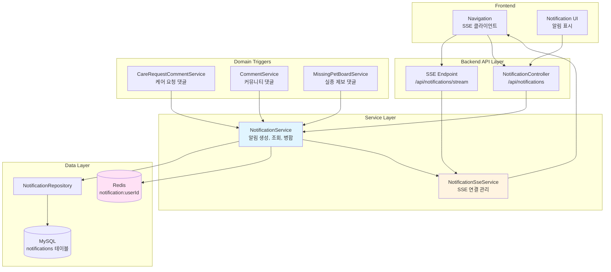
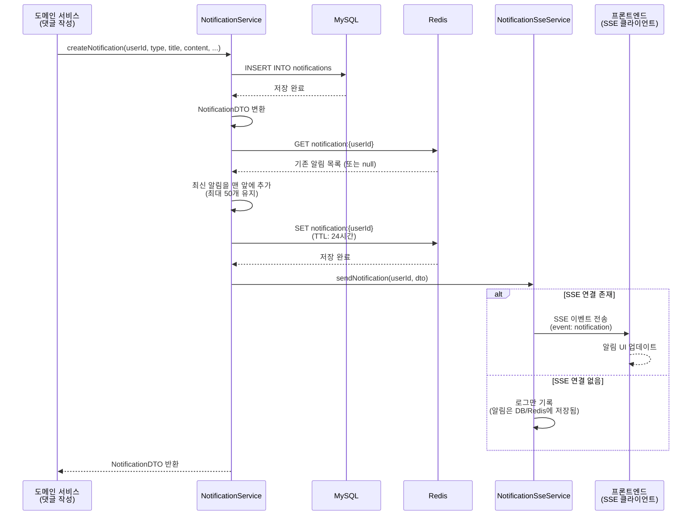
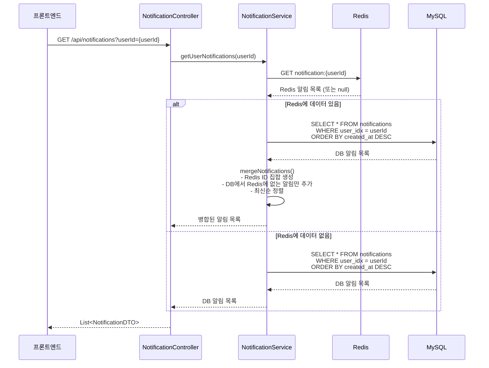
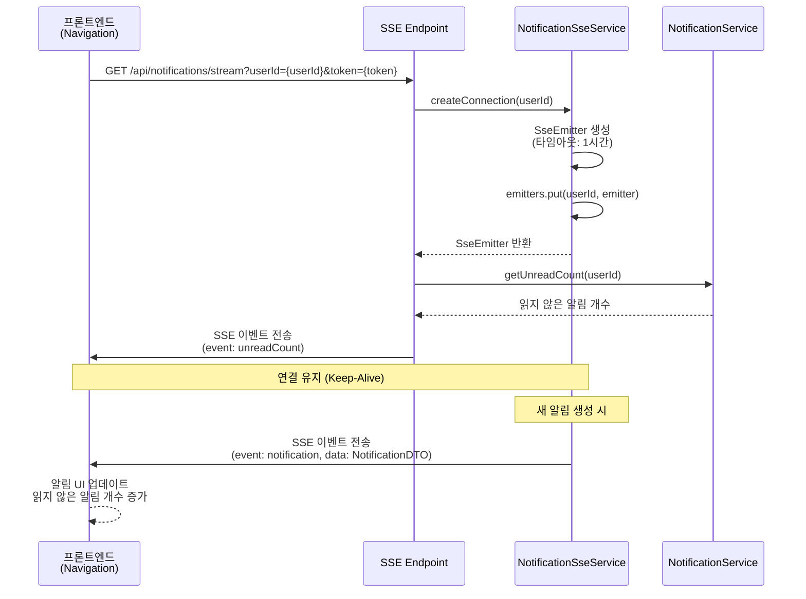
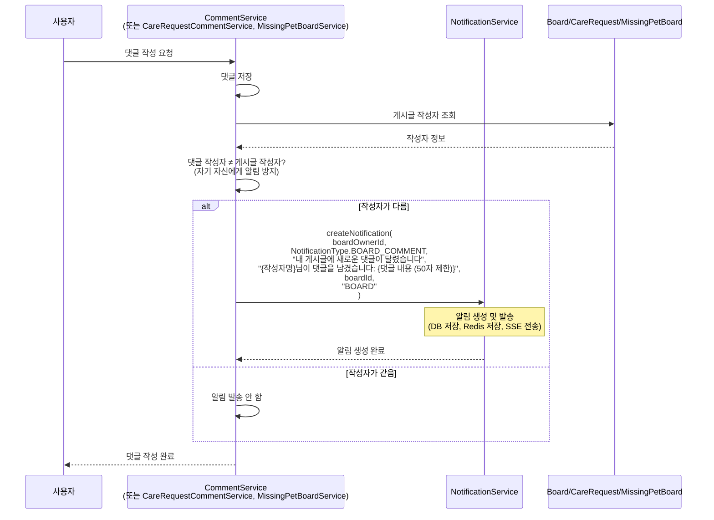

# 알림 시스템 아키텍처

## 📋 개요

알림 시스템은 Petory 서비스의 다양한 도메인 이벤트(댓글 작성, 케어 요청 등)를 사용자에게 실시간으로 전달하는 핵심 기능입니다. **이중 저장소 전략**을 통해 성능과 안정성을 동시에 확보하며, **SSE(Server-Sent Events)**를 활용하여 실시간 알림 푸시를 제공합니다.

## 🏗️ 시스템 아키텍처

### 전체 구조도



## 🔧 핵심 컴포넌트

### 1. NotificationService (알림 서비스)

**역할**: 알림 생성, 조회, Redis와 MySQL 병합, 읽음 처리

**주요 메서드**:
- `createNotification()`: 알림 생성 및 발송 (DB 저장, Redis 저장, SSE 전송)
- `getUserNotifications()`: 사용자 알림 목록 조회 (Redis + DB 병합)
- `getUnreadNotifications()`: 읽지 않은 알림 목록 조회
- `getUnreadCount()`: 읽지 않은 알림 개수 조회
- `markAsRead()`: 알림 읽음 처리
- `markAllAsRead()`: 모든 알림 읽음 처리

**핵심 로직**:

#### 알림 생성 및 발송
```java
@Transactional
public NotificationDTO createNotification(Long userId, NotificationType type, 
        String title, String content, Long relatedId, String relatedType) {
    // 1. 알림 엔티티 생성
    Notification notification = Notification.builder()
        .user(user)
        .type(type)
        .title(title)
        .content(content)
        .relatedId(relatedId)
        .relatedType(relatedType)
        .isRead(false)
        .build();
    
    // 2. MySQL에 저장 (영구 저장)
    Notification saved = notificationRepository.save(notification);
    NotificationDTO dto = notificationConverter.toDTO(saved);
    
    // 3. Redis에 실시간 알림 저장 (최신 알림 목록 관리)
    saveToRedis(userId, dto);
    
    // 4. SSE를 통해 실시간 알림 전송 (연결된 경우)
    sseService.sendNotification(userId, dto);
    
    return dto;
}
```

#### Redis 저장 로직
```java
private void saveToRedis(Long userId, NotificationDTO notification) {
    String redisKey = REDIS_KEY_PREFIX + userId; // "notification:{userId}"
    List<NotificationDTO> existingNotifications = getFromRedis(userId);
    
    // 수정 가능한 리스트 생성
    List<NotificationDTO> notifications;
    if (existingNotifications == null || existingNotifications.isEmpty()) {
        notifications = new ArrayList<>();
    } else {
        notifications = new ArrayList<>(existingNotifications);
    }
    
    // 최신 알림을 맨 앞에 추가 (최대 50개만 유지)
    notifications.add(0, notification);
    if (notifications.size() > 50) {
        notifications = notifications.subList(0, 50);
        notifications = new ArrayList<>(notifications);
    }
    
    // Redis에 저장 (TTL: 24시간)
    notificationRedisTemplate.opsForValue().set(redisKey, notifications,
        Duration.ofHours(REDIS_TTL_HOURS));
}
```

#### 알림 조회 및 병합
```java
public List<NotificationDTO> getUserNotifications(Long userId) {
    // 1. Redis에서 먼저 조회 시도
    List<NotificationDTO> redisNotifications = getFromRedis(userId);
    
    if (redisNotifications != null && !redisNotifications.isEmpty()) {
        // 2. DB에서 전체 알림 조회
        List<NotificationDTO> dbNotifications = notificationRepository
            .findByUserOrderByCreatedAtDesc(user)
            .stream()
            .map(notificationConverter::toDTO)
            .collect(Collectors.toList());
        
        // 3. Redis와 DB 데이터 병합 (중복 제거)
        return mergeNotifications(redisNotifications, dbNotifications);
    }
    
    // Redis에 없으면 DB에서만 조회
    return notificationRepository.findByUserOrderByCreatedAtDesc(user)
        .stream()
        .map(notificationConverter::toDTO)
        .collect(Collectors.toList());
}
```

#### 병합 전략 (중복 제거 및 정렬)
```java
private List<NotificationDTO> mergeNotifications(
        List<NotificationDTO> redisNotifications,
        List<NotificationDTO> dbNotifications) {
    
    // Redis 알림 ID 집합 생성
    Set<Long> redisIds = redisNotifications.stream()
        .map(NotificationDTO::getIdx)
        .collect(Collectors.toSet());
    
    // Redis에 없는 DB 알림만 추가
    List<NotificationDTO> merged = new ArrayList<>(redisNotifications);
    dbNotifications.stream()
        .filter(n -> !redisIds.contains(n.getIdx()))
        .forEach(merged::add);
    
    // 최신순 정렬 (createdAt 기준 내림차순)
    merged.sort((a, b) -> {
        if (a.getCreatedAt() == null && b.getCreatedAt() == null) return 0;
        if (a.getCreatedAt() == null) return 1;
        if (b.getCreatedAt() == null) return -1;
        return b.getCreatedAt().compareTo(a.getCreatedAt());
    });
    
    return merged;
}
```

### 2. NotificationSseService (SSE 서비스)

**역할**: SSE 연결 관리 및 실시간 알림 전송

**주요 메서드**:
- `createConnection()`: 사용자별 SSE 연결 생성
- `sendNotification()`: 특정 사용자에게 알림 전송
- `removeConnection()`: 사용자 연결 해제

**핵심 로직**:

#### SSE 연결 생성
```java
public SseEmitter createConnection(Long userId) {
    SseEmitter emitter = new SseEmitter(3600000L); // 1시간 타임아웃
    
    emitter.onCompletion(() -> {
        log.info("SSE 연결 완료: userId={}", userId);
        emitters.remove(userId);
    });
    
    emitter.onTimeout(() -> {
        log.info("SSE 연결 타임아웃: userId={}", userId);
        emitters.remove(userId);
    });
    
    emitter.onError((ex) -> {
        log.error("SSE 연결 오류: userId={}, error={}", userId, ex.getMessage());
        emitters.remove(userId);
    });
    
    emitters.put(userId, emitter);
    log.info("SSE 연결 생성: userId={}, 현재 연결 수={}", userId, emitters.size());
    
    return emitter;
}
```

#### 실시간 알림 전송
```java
public void sendNotification(Long userId, NotificationDTO notification) {
    SseEmitter emitter = emitters.get(userId);
    if (emitter != null) {
        try {
            emitter.send(SseEmitter.event()
                .name("notification")
                .data(notification));
            log.info("알림 전송 성공: userId={}, notificationId={}", userId, notification.getIdx());
        } catch (IOException e) {
            log.error("알림 전송 실패: userId={}, error={}", userId, e.getMessage());
            emitters.remove(userId);
            try {
                emitter.completeWithError(e);
            } catch (Exception ex) {
                log.error("emitter 완료 처리 실패", ex);
            }
        }
    } else {
        log.debug("SSE 연결 없음: userId={} (알림은 DB/Redis에 저장됨)", userId);
    }
}
```

### 3. Notification 엔티티

**역할**: 알림 데이터를 저장하는 엔티티

**주요 필드**:
- `idx`: 알림 ID
- `user`: 알림을 받을 사용자
- `type`: 알림 타입 (`CARE_REQUEST_COMMENT`, `BOARD_COMMENT`, `MISSING_PET_COMMENT`)
- `title`: 알림 제목
- `content`: 알림 내용 (최대 500자)
- `relatedId`: 관련 게시글/댓글 ID
- `relatedType`: 관련 타입 (`BOARD`, `CARE_REQUEST`, `MISSING_PET`)
- `isRead`: 읽음 여부
- `createdAt`: 생성 시간

**엔티티 구조**:
```java
@Entity
@Table(name = "notifications")
public class Notification {
    @Id
    @GeneratedValue(strategy = GenerationType.IDENTITY)
    private Long idx;
    
    @ManyToOne
    @JoinColumn(name = "user_idx", nullable = false)
    private Users user;
    
    @Enumerated(EnumType.STRING)
    @Column(nullable = false)
    private NotificationType type;
    
    @Column(nullable = false)
    private String title;
    
    @Column(length = 500)
    private String content;
    
    @Column(name = "related_id")
    private Long relatedId;
    
    @Column(name = "related_type")
    private String relatedType;
    
    @Column(name = "is_read", nullable = false)
    @Builder.Default
    private Boolean isRead = false;
    
    @Column(name = "created_at")
    private LocalDateTime createdAt;
}
```

### 4. NotificationType (알림 타입 Enum)

**알림 타입**:
- `CARE_REQUEST_COMMENT`: 펫케어 요청글 댓글 알림
- `BOARD_COMMENT`: 커뮤니티 게시글 댓글 알림
- `MISSING_PET_COMMENT`: 실종 제보 게시글 댓글 알림

## 📊 데이터 흐름

### 1. 알림 생성 및 발송 흐름



### 2. 알림 조회 및 병합 흐름



### 3. SSE 실시간 알림 구독 흐름



### 4. 댓글 작성 시 알림 트리거 흐름



## 🎯 핵심 설계 전략

### 1. 이중 저장소 전략 (Dual Storage Strategy)

**문제**: 실시간 알림 조회 성능과 데이터 안정성을 동시에 확보해야 함

**해결**: Redis와 MySQL을 함께 활용
- **Redis**: 최신 알림 50개를 24시간 TTL로 캐싱하여 실시간 조회 속도 극대화
- **MySQL**: 모든 알림을 영구 저장하여 이력 관리 및 안정성 보장
- **병합 전략**: Redis와 DB 데이터를 병합하여 중복 제거 후 최신순 정렬

**효과**:
- 빠른 조회 성능 (Redis 캐싱)
- 데이터 안정성 (MySQL 영구 저장)
- 완전한 데이터 제공 (병합 전략)

### 2. Redis 캐싱 전략

**Redis Key 구조**:
```
notification:{userId}
```

**저장 전략**:
- 최신 알림 50개만 저장 (메모리 효율성)
- TTL: 24시간 (최신 알림만 유지)
- 최신 알림을 맨 앞에 추가 (FIFO 방식)

**효과**:
- 빠른 조회 성능
- 메모리 사용량 최적화
- 자동 만료로 관리 부담 감소

### 3. 병합 전략 (Merge Strategy)

**문제**: Redis와 DB에 중복 데이터가 있을 수 있음

**해결**: 중복 제거 및 정렬
- Redis 알림 ID 집합 생성
- DB에서 Redis에 없는 알림만 추가
- 최신순 정렬 (`createdAt` 기준 내림차순)

**효과**:
- 중복 없는 완전한 데이터 제공
- 최신순 정렬로 일관된 사용자 경험

### 4. SSE 실시간 알림 전략

**문제**: 사용자가 페이지를 새로고침하지 않아도 실시간으로 알림을 받아야 함

**해결**: SSE(Server-Sent Events) 활용
- 단방향 통신 (서버 → 클라이언트)
- HTTP 기반으로 방화벽 친화적
- 자동 재연결 지원
- `ConcurrentHashMap`으로 사용자별 연결 관리

**연결 관리**:
- 타임아웃: 1시간
- 연결 해제 시 자동 정리 (`onCompletion`, `onTimeout`, `onError`)
- 연결된 사용자에게만 실시간 전송

**효과**:
- 실시간 알림 푸시
- 서버 부하 최소화 (폴링 대비)
- 사용자 경험 향상

### 5. 자기 자신 알림 방지 전략

**문제**: 사용자가 자신의 게시글에 댓글을 달면 자신에게 알림이 가면 안 됨

**해결**: 댓글 작성자와 게시글 작성자 비교
- 댓글 작성자 ≠ 게시글 작성자인 경우에만 알림 발송
- 각 도메인 서비스에서 사전 체크

**효과**:
- 불필요한 알림 방지
- 사용자 경험 향상

### 6. 댓글 내용 길이 제한 전략

**문제**: 알림 내용에 너무 긴 댓글이 포함되면 UI가 깨질 수 있음

**해결**: 댓글 내용 50자 제한
- 50자 초과 시 `...` 추가
- 알림 생성 시점에 자동 처리

**효과**:
- 일관된 알림 UI
- 사용자 경험 향상

## 🔄 도메인 간 연동

### 1. Care 도메인 연동
- **트리거**: `CareRequestCommentService.addComment()`
- **알림 타입**: `CARE_REQUEST_COMMENT`
- **대상**: 펫케어 요청글 작성자
- **관련 타입**: `CARE_REQUEST`

### 2. Board 도메인 연동
- **트리거**: `CommentService.addComment()`
- **알림 타입**: `BOARD_COMMENT`
- **대상**: 커뮤니티 게시글 작성자
- **관련 타입**: `BOARD`

### 3. MissingPet 도메인 연동
- **트리거**: `MissingPetBoardService.addComment()`
- **알림 타입**: `MISSING_PET_COMMENT`
- **대상**: 실종 제보 게시글 작성자
- **관련 타입**: `MISSING_PET`

## 📈 성능 최적화

### 1. Redis 최적화

#### 캐싱 전략
- **최신 50개만 저장**: 메모리 사용량 최적화
- **TTL 24시간**: 자동 만료로 관리 부담 감소
- **최신순 추가**: 빠른 조회 성능

#### Redis Key 설계
```
notification:{userId}
```
- 사용자별로 분리하여 조회 성능 향상
- 간단한 Key 구조로 관리 용이

### 2. DB 최적화

#### 인덱스 전략
```sql
-- 사용자별 알림 조회
CREATE INDEX idx_notification_user ON notifications(user_idx, created_at DESC);

-- 읽지 않은 알림 조회
CREATE INDEX idx_notification_user_read ON notifications(user_idx, is_read, created_at DESC);
```

**선정 이유**:
- 사용자별 조회가 빈번함
- 읽지 않은 알림 조회 최적화
- 최신순 정렬 최적화

### 3. 애플리케이션 레벨 최적화

#### 병합 최적화
- **Set 기반 중복 제거**: O(1) 조회 성능
- **스트림 처리**: 효율적인 필터링 및 정렬

#### SSE 연결 관리
- **ConcurrentHashMap**: 동시성 안전한 연결 관리
- **자동 정리**: 연결 해제 시 자동 제거

### 4. 프론트엔드 최적화

#### SSE 연결 관리
- **자동 재연결**: EventSource 자동 재연결 활용
- **폴백 폴링**: SSE 연결 실패 시 5분마다 폴링
- **중복 제거**: 알림 목록에 중복 추가 방지

#### 알림 UI 최적화
- **로컬 상태 관리**: 불필요한 API 호출 방지
- **읽지 않은 알림 개수 캐싱**: 실시간 업데이트

## 🔐 보안 고려사항

### 1. 권한 제어
- **알림 조회**: 본인의 알림만 조회 가능 (`@PreAuthorize("isAuthenticated()")`)
- **읽음 처리**: 본인의 알림만 읽음 처리 가능 (서비스 레벨 검증)
- **SSE 연결**: 쿼리 파라미터로 토큰 전달 (EventSource는 헤더 지원 안 함)

### 2. 데이터 검증
- **사용자 존재 확인**: 알림 생성 시 사용자 존재 여부 확인
- **자기 자신 알림 방지**: 댓글 작성자와 게시글 작성자 비교
- **댓글 내용 길이 제한**: 알림 내용에 50자 제한

### 3. 입력 검증
- SQL Injection 방지 (JPA 사용)
- XSS 방지 (DTO 변환 시 이스케이프)

## 📝 주요 API 엔드포인트

### 알림 목록 조회
```
GET /api/notifications?userId={userId}
→ List<NotificationDTO>
- Redis와 DB 병합하여 반환
- 최신순 정렬
```

### 읽지 않은 알림 목록 조회
```
GET /api/notifications/unread?userId={userId}
→ List<NotificationDTO>
- 읽지 않은 알림만 반환
```

### 읽지 않은 알림 개수 조회
```
GET /api/notifications/unread/count?userId={userId}
→ Long
- 읽지 않은 알림 개수만 반환
```

### 알림 읽음 처리
```
PUT /api/notifications/{notificationId}/read?userId={userId}
→ 204 No Content
- 본인의 알림만 읽음 처리 가능
- Redis에서도 제거
```

### 모든 알림 읽음 처리
```
PUT /api/notifications/read-all?userId={userId}
→ 204 No Content
- 사용자의 모든 알림을 읽음 처리
- Redis에서 해당 사용자의 모든 알림 제거
```

### SSE 실시간 알림 구독
```
GET /api/notifications/stream?userId={userId}&token={token}
→ text/event-stream
- SSE 연결 생성
- 연결 즉시 읽지 않은 알림 개수 전송
- 새 알림 생성 시 실시간 전송
```

## 🎯 핵심 포인트 요약

### 1. 이중 저장소 전략
- **Redis**: 최신 알림 50개, 24시간 TTL, 빠른 조회 성능
- **MySQL**: 모든 알림 영구 저장, 데이터 안정성
- **병합**: Redis와 DB 데이터 병합, 중복 제거, 최신순 정렬

### 2. 실시간 알림 푸시
- **SSE**: Server-Sent Events를 통한 실시간 알림 전송
- **연결 관리**: ConcurrentHashMap으로 사용자별 연결 관리
- **자동 재연결**: EventSource 자동 재연결 지원
- **폴백 폴링**: SSE 연결 실패 시 폴링으로 대체

### 3. 다양한 알림 유형
- **CARE_REQUEST_COMMENT**: 펫케어 요청글 댓글 알림
- **BOARD_COMMENT**: 커뮤니티 게시글 댓글 알림
- **MISSING_PET_COMMENT**: 실종 제보 게시글 댓글 알림

### 4. 자기 자신 알림 방지
- **사전 체크**: 댓글 작성자와 게시글 작성자 비교
- **조건부 발송**: 작성자가 다른 경우에만 알림 발송

### 5. 성능 최적화
- **Redis 캐싱**: 최신 알림 50개만 저장
- **DB 인덱스**: 사용자별 조회, 읽지 않은 알림 조회 최적화
- **병합 최적화**: Set 기반 중복 제거, 스트림 처리

### 6. 사용자 경험
- **실시간 알림**: SSE를 통한 즉시 알림 전달
- **읽지 않은 알림 개수**: 실시간 업데이트
- **댓글 내용 제한**: 50자 제한으로 일관된 UI
