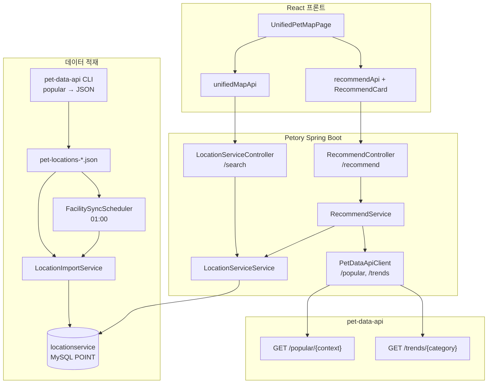
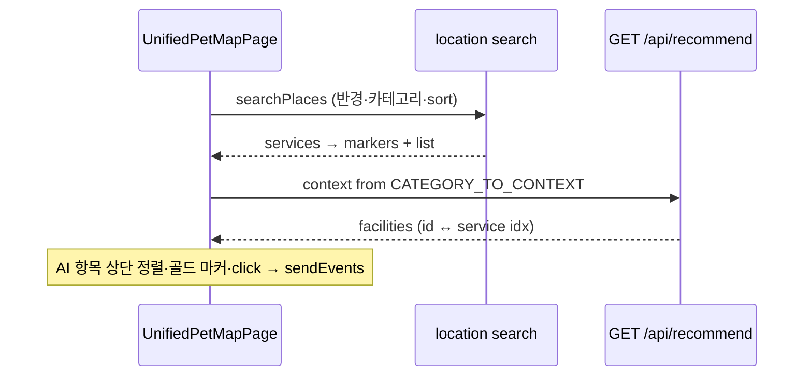

# 위치·추천 아키텍처 (프론트·백엔드 대조)

Petory에서 **장소 POI(Location)** 와 **맞춤 추천(Recommendation)** 이 어떻게 연결되는지, 실제 코드 기준으로 정리한 문서다.

- 백엔드: `backend/main/java/com/linkup/Petory/domain/location/`, `domain/recommendation/`
- 프론트: `frontend/src/api/`, `frontend/src/components/UnifiedMap/`, `frontend/src/components/Recommendation/`
- 상세 도메인 스펙: [`docs/domains/location.md`](../../domains/location.md), [`docs/domains/recommendation.md`](../../domains/recommendation.md)

---

## 1. 범위와 역할 분리

| 구분 | 담당 | 사용자 관점 |
|------|------|-------------|
| **Location** | `locationservice` DB의 시설 검색·리뷰·지오코딩·데이터 적재 | 통합 지도 **주변서비스** 탭, 관리자 시설 관리 |
| **Recommendation** | `GET /api/recommend` — Petory DB 후보 + pet-data-api 인기/트렌드 조합 | 통합 지도 **RecommendCard**(AI 추천 패널), 트렌드 페이지 |
| **통합 탐색 (프론트만)** | `UnifiedPetMapPage`가 탭별로 REST를 조합 | 주변서비스 / 모임 / 펫케어 한 지도 UX |

> 백엔드에 “통합 지도 BFF”는 없다. 지도는 프론트가 도메인 API를 탭 단위로 호출한다.

### 1.1 제거·단일화된 경로

| 항목 | 상태 |
|------|------|
| `GET /api/location-services/recommend` | **삭제됨** (`LocationRecommendAgentService` 포함) |
| 주변 “추천” UX | `GET /api/recommend` + 지도 목록의 `sort=stable` 로 대체 |

---

## 2. 시스템 맥락

---

## 3. 프론트엔드 모듈

### 3.1 API 클라이언트

| 파일 | Base path | 용도 |
|------|-----------|------|
| `api/locationServiceApi.js` | `/api/location-services`, `/api/admin/location-services` | 시설 검색, CSV 임포트(관리자) |
| `api/unifiedMapApi.js` | (위 API 조합) | 탭별 지도 마커 `fetchActiveMapItems` |
| `api/recommendApi.js` | `/api/recommend` | 추천·카피·이벤트·트렌드 시계열 |
| `api/adminApi.js` | `/api/admin` | JSON 동기화·수집·미리보기 (`/location/*`) |
| `api/geocodingApi.js` | `/api/geocoding` | 주소/좌표/길찾기/키워드 장소 검색 |

데모: `mock/isDemoMode.js`가 켜지면 location·geocoding 일부가 목 데이터로 대체된다.

### 3.2 통합 지도 UI

| 경로 | 역할 |
|------|------|
| `components/UnifiedMap/UnifiedPetMapPage.js` | 탭·검색 중심·반경·정렬·AI 추천·바텀시트 |
| `controls/LocationControls.js` | 키워드, 중·소분류 카테고리, 정렬, **「이 지역」** |
| `layers/LocationLayer.js` 등 | 탭별 상세·생성 모달 |
| `constants/locationCategoryTree.js` | `category2`/`category3` ↔ API `category` 문자열 |
| `components/Recommendation/RecommendCard.js` | `recommendApi.getRecommendation` + 카피·이벤트 |
| `components/LocationService/MapContainer.js` | Naver Maps 마커·idle 콜백 |

**주변서비스 UX 원칙 (코드 반영)**

- 지도 **드래그만으로는 API를 다시 호출하지 않음**. 수동 이동 후 검색 중심과 차이가 나면 `hasPendingAreaChange` → **「이 지역」** 버튼(`onSearchThisArea`).
- 활성 탭 하나만 `fetchActiveMapItems` 호출.
- AI 추천 결과는 `buildAiFacilityRankMap`으로 `location` 목록 `idx`와 매칭해 상단·골드 마커로 강조.

**소분류 → 추천 context** (`UnifiedPetMapPage` `CATEGORY_TO_CONTEXT`):

`미용→grooming`, `동물병원→hospital`, `동물약국→pharmacy`, `카페→cafe`, `식당→restaurant`, `펜션→pension`, `위탁관리→boarding`, `반려동물용품→supplies`, `호텔→hotel`, `간식→snack`, `사료→food`, `의류→clothes`.

### 3.3 통합 지도 데이터 호출

| 탭 | `unifiedMapApi` | 백엔드 |
|----|-----------------|--------|
| 주변서비스 | `locationServiceApi.searchPlaces` | `GET /api/location-services/search` |
| 모임 | `meetupApi.getNearbyMeetups` | `GET /api/meetups/nearby` |
| 펫케어 | `careRequestApi.getNearby` | `GET /api/care-requests/nearby` |

**반경 단위**

- UI·state: **km** (기본 5km).
- `fetchActiveMapItems`가 `radius * 1000`으로 **m** 변환 후 전달.
- 백엔드 `radius` 생략·`≤0`이면 서비스에서 **10_000m** 기본.

**결과 상한**

- location 탭: `LOCATION_RESULT_LIMIT = 300` (고정).
- meetup/care: 카카오맵 `mapLevel`별 동적 limit.

**정렬 (`LocationControls`)**

- `stable` | `distance` | `rating` | `reviews` (프론트 기본 `stable` = 「추천순」).
- 백엔드 `sort` 미지정 시 반경 검색은 `distance`.

---

## 4. 백엔드 Location 레이어

### 4.1 컨트롤러·서비스

| 레이어 | 타입 |
|--------|------|
| 공개 API | `LocationServiceController`, `GeocodingController`, `LocationServiceReviewController` |
| 관리자 (CSV·목록) | `AdminLocationController` → `/api/admin/location-services` |
| 관리자 (JSON·수집) | `LocationServiceAdminController` → `/api/admin/location` |
| 서비스 | `LocationServiceService`, `LocationImportService`, `PublicDataLocationService`, `NaverMapService`, `LocationServiceReviewService`, `LocationServiceAdminService` |
| 배치 | `LocationServiceBatchWriter`, `FacilitySyncScheduler`, `LocationServiceScoreScheduler` |
| 저장소 | `LocationServiceRepository` → `JpaLocationServiceAdapter` → `SpringDataJpaLocationServiceRepository` |

### 4.2 `GET /api/location-services/search`

**단일 진입점:** `LocationServiceService.searchLocationServices`

우선순위 (**B: 위치 우선**, 워크스페이스 규칙의 “키워드 최우선”과 다름):

1. `latitude`·`longitude` 둘 다 있음 → **반경 검색** (`keyword`·`category`는 SQL `WHERE`, 이름은 `LIKE '%keyword%'`)
2. `sido` / `sigungu` / `eupmyeondong` / `roadName` 중 하나 → **지역 계층** (세부: road > eup > sigungu > sido > 전체)
3. 위치·지역 없고 `keyword`만 → **FULLTEXT** fallback (`MATCH` on name/description/category1–3)
4. 조건 없음 → 전체 **평점순**

정규화: `keyword`, `category`, 지역 문자열의 `""` → `null`.

**컨트롤러 `size`:** `null` → 100, `≤0` → 상한 없음(`null`). 프론트 통합 지도는 별도로 `size=300` 전달.

**`sort` (반경 분기):** `stable` | `distance` | `rating` | `reviews` | `score`

- `stable`: SQL에서 `rating DESC`, `review_count DESC`, 거리 tie-break.
- `score`: DB 조회 후 Java에서 `LocationServiceDTO.score` 내림차순 재정렬.

**거리:** 반경 필터는 DB(`ST_Within` + `ST_Distance_Sphere`). 응답 DTO `distance`는 Haversine 후처리(m).

### 4.3 지오코딩 (`GeocodingController` / `NaverMapService`)

| 프론트 | HTTP |
|--------|------|
| `geocodingApi.addressToCoordinates` | `GET /api/geocoding/address` |
| `geocodingApi.coordinatesToAddress` | `GET /api/geocoding/coordinates` |
| `geocodingApi.getDirections` | `GET /api/geocoding/directions` (`start`/`goal` = **경도,위도**) |
| `geocodingApi.searchPlaces` | `GET /api/geocoding/search` |

NCP Maps 키는 **서버 설정**만 사용.

### 4.4 리뷰·평점

`LocationServiceReviewService` → CUD 후 `updateServiceRating(serviceIdx)` → Native `@Modifying`으로 `locationservice.rating`을 리뷰 평균과 동기화 (read-modify-write 회피).

### 4.5 시설 데이터 적재 (두 트랙)

| 트랙 | 경로 | 소스 | `data_source` |
|------|------|------|----------------|
| **A. pet-data JSON** | `LocationImportService` ← `LocationServiceAdminController` `/sync`, `/import`, `/sync-file` | pet-data-api CLI `popular` → `pet-locations-*.json` | `BATCH_IMPORT` |
| **B. 공공 CSV** | `PublicDataLocationService` ← `AdminLocationController` `/import-public-data` | 관리자 CSV 업로드 | (CSV 파이프라인 규칙) |

공통: 배치 INSERT는 `LocationServiceBatchWriter` (`REQUIRES_NEW`로 청크 트랜잭션). JSON 배치 크기 `app.location.import.batch-size` (기본 500).

**스케줄**

- `FacilitySyncScheduler`: `app.location.import.file-path`가 있으면 매일 **01:00** 파일 import.
- `LocationServiceScoreScheduler`: 매일 **00:00** 전체 `score` 재계산 (`0.5×rating×log10(reviews+1) + 0.2×petFriendly`).

**관리자 JSON API** (`/api/admin/location`, ADMIN/MASTER):

| 메서드 | 경로 | 설명 |
|--------|------|------|
| POST | `/sync` | 설정 파일 경로 일괄 import |
| POST | `/sync-file?filename=` | 디렉터리 내 `pet-locations*.json` |
| POST | `/import` | multipart JSON 업로드 (50MB, magic bytes 검증) |
| GET | `/import-files` | 수집 디렉터리 목록 |
| POST | `/collect` | Python CLI 백그라운드 (`202`) |
| GET | `/collect-status` | 수집 프로세스 상태 |
| GET | `/json-preview` | JSON 미리보기 |

프론트 관리 화면: `LocationServiceManagementSection` — `adminApi`로 JSON 흐름, `locationServiceApi.importPublicData`로 CSV.

---

## 5. Recommendation 도메인 (Petory ↔ pet-data-api)

### 5.1 `GET /api/recommend` 분기

`RecommendService.recommend(userId, lat, lng, context)`:

| Track | `context` 예 | 동작 |
|-------|--------------|------|
| **A. Petory 소유** | `grooming`, `hospital`, `pharmacy`, `cafe`, `restaurant`, `pension`, `boarding`, `hotel`, `supplies` | `LocationServiceService.searchLocationServicesByLocation` (10km, category 매핑, limit 20) + `PetDataApiClient.fetchPopular` + `fetchTrends` → `mergeNearbyCandidates` |
| **B. 레거시 프록시** | `snack`, `food`, `clothes` 등 | `PetDataApiClient.recommend()` 전체 위임 (`snack`/`food`/`clothes` → popular 경로 `supplies` 알리아스) |

- **인증 필수** (`requireUserId()`).
- 펫 정보: `PetRepository.findByUserIdAndNotDeleted` 첫 마리.
- 응답 `recommend_version`: Track A → `petory-nearby-v1`.

### 5.2 부가 API

| HTTP | 경로 | 용도 |
|------|------|------|
| POST | `/api/recommend/copy` | LLM 카피 (pet-data-api, 긴 타임아웃) |
| POST | `/api/recommend/events` | 노출/클릭 (`userRef` 해시; **pet-data-api 전송은 현재 스킵**) |
| GET | `/api/recommend/trends/{category}/timeseries` | 스냅샷 → 합성 시계열 (Recharts용) |

### 5.3 통합 지도에서의 결합

Location 검색과 Recommendation은 **별도 HTTP**다. UI만 `facility.id`와 `LocationServiceDTO.idx`로 링크한다.

---

## 6. API 대조표 (요약)

### 6.1 시설 검색

| 프론트 | HTTP | 비고 |
|--------|------|------|
| `locationServiceApi.searchPlaces` | `GET /api/location-services/search` | JWT 필요 (`/api/**`) |
| `unifiedMapApi` (location) | 동일 + `size=300`, radius m 변환 | |

### 6.2 추천

| 프론트 | HTTP |
|--------|------|
| `recommendApi.getRecommendation` | `GET /api/recommend?lat&lng&context` |
| `recommendApi.getCopy` | `POST /api/recommend/copy` |
| `recommendApi.sendEvents` | `POST /api/recommend/events` |

### 6.3 관리자

| 프론트 | HTTP | 컨트롤러 |
|--------|------|----------|
| `adminApi.syncFacilitiesFromPetDataApi` | `POST /api/admin/location/sync` | `LocationServiceAdminController` |
| `adminApi.syncFromFile` | `POST /api/admin/location/sync-file` | 동일 |
| `locationServiceApi.listLocationServices` | `GET /api/admin/location-services` | `AdminLocationController` |
| `locationServiceApi.importPublicData` | `POST /api/admin/location-services/import-public-data` | 동일 (CSV, MASTER) |

---

## 7. DB·검색 구현 요약

- 테이블 `locationservice`: `POINT(SRID 4326)`, FULLTEXT `ft_search`, 공간 인덱스.
- 반경: `findByRadius` — `ST_Within`(bounding) + `ST_Distance_Sphere`.
- 지역: `findByRoadName` / `findByEupmyeondong` / … — keyword·category는 SQL WHERE; 일부 `USE INDEX` 힌트.
- 키워드 단독: `findByNameContaining` (FULLTEXT) — 위치·지역 경로의 `LIKE`와 결과가 달라질 수 있음.

---

## 8. Meetup / Care (지도만 공유)

- **Meetup**: `GET /api/meetups/nearby` — Location 엔티티와 FK 없음.
- **Care**: `GET /api/care-requests/nearby` — 요청에 lat/lng/주소 필요.

---

## 9. 운영·보안 체크리스트

- `size=0` 또는 미전달 상한 해제 시 대량 응답·OOM — 모바일/관리 UI에서 상한 정책 유지.
- Geocoding·pet-data-api 타임아웃: `app.pet-data-api.timeout-ms` (기본 3s), copy는 별도 설정.
- 관리자 JSON 업로드: 확장자·Content-Type·magic bytes·경로 traversal 차단 구현됨.
- 리뷰: 앱 레벨 중복 방지; DB unique는 별도 검토 여지.

---

## 10. 관련 문서

| 문서 | 내용 |
|------|------|
| [`docs/domains/location.md`](../../domains/location.md) | Location 도메인 상세 |
| [`docs/domains/recommendation.md`](../../domains/recommendation.md) | Recommendation Track A/B |
| [`docs/architecture/location/위치서비스_공공데이터_CSV_배치_임포트_구현.md`](./위치서비스_공공데이터_CSV_배치_임포트_구현.md) | CSV 파이프라인 |
| pet-data-api [`docs/PETORY-INTEGRATION.md`](../../../../pet-data-api/docs/PETORY-INTEGRATION.md) | CLI·Redis·Petory 연동 |
| [`docs/refactoring/location/주변서비스-현행vs설계안-비교.md`](../../refactoring/location/주변서비스-현행vs설계안-비교.md) | 검색 우선순위 변경 이력 |

---

*마지막 갱신: 2026-05-30 — Location·Recommendation 백엔드/프론트 소스 대조.*
