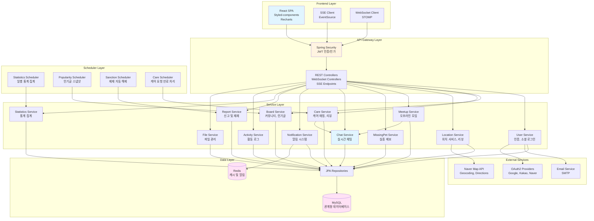
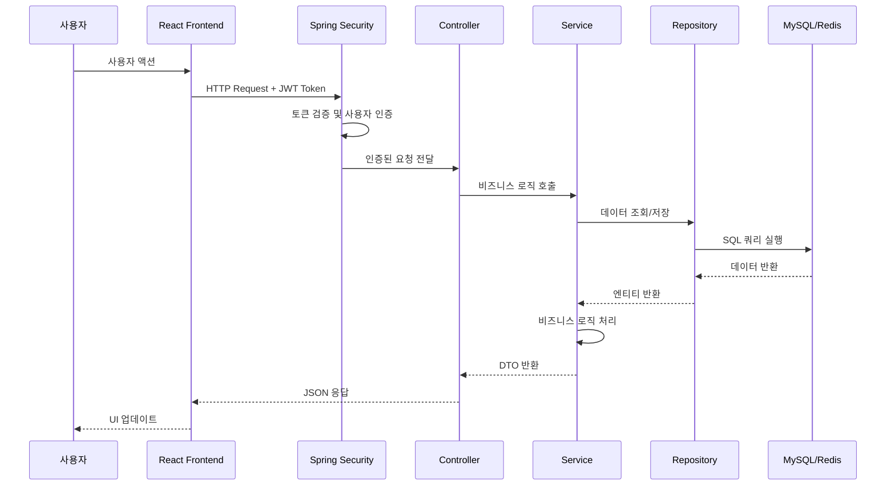
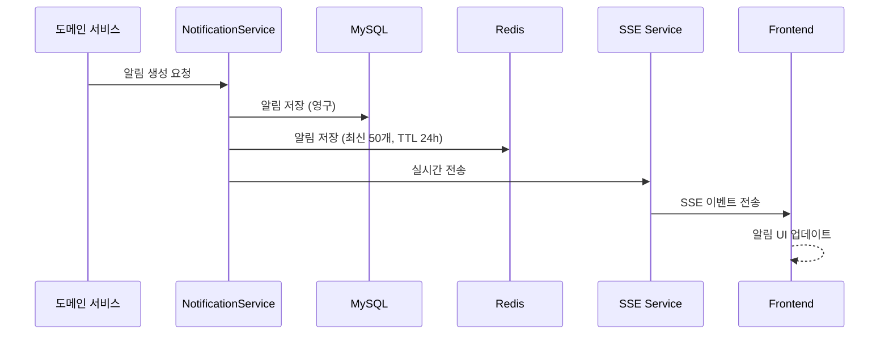
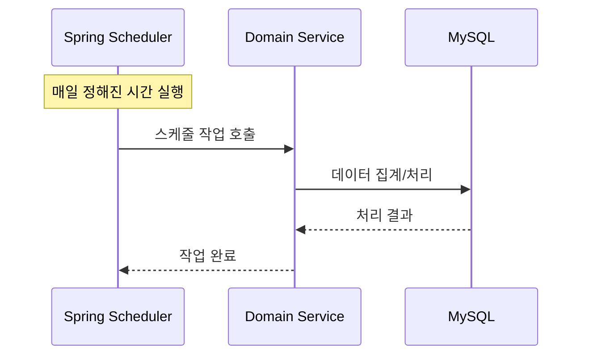

# Petory 전체 아키텍처

## 📋 개요

Petory는 반려동물 통합 플랫폼으로, 커뮤니티, 펫케어 매칭, 실종 동물 찾기, 위치 기반 서비스, 오프라인 모임 등 다양한 기능을 제공하는 풀스택 애플리케이션입니다. **도메인 주도 설계(DDD)** 원칙을 따르며, **레이어드 아키텍처**를 기반으로 구축되었습니다.

## 🏗️ 시스템 전체 구조

### 전체 아키텍처 다이어그램

## 🎯 핵심 도메인 아키텍처

### 1. 커뮤니티 & 실종 제보
- **기능**: 게시글 작성/조회, 댓글, 좋아요/싫어요, 인기글 스냅샷, 실종 동물 신고
- **특징**: Magazine + Smart Grid 레이아웃, 스냅샷 기반 인기글 관리, 배치 조회로 N+1 문제 해결
- **상세 문서**: [커뮤니티 & 실종 제보 아키텍처](./커뮤니티%20&%20실종%20제보%20아키텍처.md)

### 2. 펫 케어 & 매칭
- **기능**: 케어 요청 생성, 지원자 매칭, 채팅 기반 소통, 리뷰 시스템
- **특징**: 채팅 기반 매칭, 상태 전이 관리, 자동 완료 처리, 중복 리뷰 방지
- **상세 문서**: [펫 케어 & 매칭 아키텍처](./펫%20케어%20&%20매칭%20아키텍처.md)

### 3. 위치 기반 서비스
- **기능**: 공공데이터 기반 장소 정보, 리뷰 시스템, 지역/카테고리 검색
- **특징**: CSV 배치 임포트, 지역 계층 검색, 평점 자동 업데이트
- **상세 문서**: [위치 기반 서비스 아키텍처](./위치%20기반%20서비스%20아키텍처.md)

### 4. 산책 & 오프라인 모임
- **기능**: 모임 생성/참여, 위치 기반 검색, 채팅방 자동 연동
- **특징**: Haversine 공식 기반 거리 계산, 인원 관리, 채팅 자동 연동
- **상세 문서**: [산책 & 오프라인 모임 아키텍처](./산책%20&%20오프라인%20모임%20아키텍처.md)

### 5. 알림 시스템
- **기능**: 실시간 알림 푸시, 읽음 처리, 알림 이력 관리
- **특징**: 이중 저장소 전략(Redis + MySQL), SSE 실시간 전송, 병합 전략
- **상세 문서**: [알림 시스템 아키텍처](./알림%20시스템%20아키텍처.md)

### 6. 관리자 대시보드 & 통계 시스템
- **기능**: 일별 통계 집계, 시각화, 통합 관리자 페이지
- **특징**: Daily Summary Pattern, 실시간 집계 보정, Recharts 시각화
- **상세 문서**: [관리자 대시보드 & 통계 시스템 아키텍처](./관리자%20대시보드%20&%20통계%20시스템%20아키텍처.md)

### 7. 신고 및 제재 시스템
- **기능**: 다양한 신고 타입, 자동 제재, 제재 이력 관리
- **특징**: 경고 누적 자동 제재, 동시성 제어, 자동 해제 스케줄러
- **상세 문서**: [신고 및 제재 시스템 아키텍처](./신고%20및%20제재%20시스템%20아키텍처.md)

### 8. 채팅 시스템
- **기능**: 실시간 메시지 전송, 1:1 채팅, 그룹 채팅, 읽음 상태 관리
- **특징**: WebSocket (STOMP) 기반 실시간 통신, 펫케어/모임 자동 연동, 역할 관리
- **상세 문서**: [채팅 시스템 설계](./채팅%20시스템%20설계.md)

## 🔧 공통 인프라

### 1. 인증 및 인가
- **JWT 기반 인증**: Access Token + Refresh Token
- **OAuth2 소셜 로그인**: Google, Kakao, Naver 지원
- **이메일 인증**: 이메일 검증 필수 기능 지원
- **역할 기반 접근 제어**: USER, SERVICE_PROVIDER, ADMIN, MASTER
- **상세 문서**: [이메일 인증 시스템 아키텍처](./이메일%20인증%20시스템%20아키텍처.md)

### 2. 파일 관리
- **다형성 관계**: File 엔티티로 다양한 타겟에 첨부
- **UUID 파일명**: 파일명 충돌 방지
- **경로 정규화**: Directory Traversal 공격 방지
- **파일 검증**: 크기, 확장자, MIME 타입 검증

### 3. 캐싱 전략
- **Redis 캐싱**: 알림, 인기글, 위치 서비스 등
- **Spring Cache**: `@Cacheable`, `@CacheEvict` 활용
- **TTL 관리**: 데이터 특성에 따른 만료 시간 설정
- **상세 문서**: [Redis 캐싱 전략](./Redis_캐싱_전략.md)

## 📊 데이터 흐름

### 1. 사용자 요청 처리 흐름

### 2. 실시간 알림 흐름

### 3. 스케줄러 작업 흐름

## 🎯 아키텍처 원칙

### 1. 도메인 주도 설계 (DDD)
- **도메인별 패키지 구조**: 각 도메인은 독립적인 패키지로 구성
- **명확한 경계**: 도메인 간 의존성 최소화
- **도메인 모델**: 엔티티와 비즈니스 로직의 응집도 향상

### 2. 레이어드 아키텍처
- **Controller**: HTTP 요청/응답 처리
- **Service**: 비즈니스 로직 구현
- **Repository**: 데이터 액세스 추상화
- **Entity**: 도메인 모델 표현

### 3. 관심사의 분리 (SoC)
- **책임 분리**: 각 레이어는 명확한 책임을 가짐
- **의존성 역전**: Service는 Repository 인터페이스에 의존
- **DTO 패턴**: 엔티티와 API 응답 분리

### 4. 성능 최적화
- **N+1 문제 해결**: 배치 조회, JOIN FETCH 활용
- **캐싱 전략**: Redis, Spring Cache 활용
- **인덱스 전략**: 자주 조회되는 컬럼에 인덱스 생성
- **스냅샷 패턴**: 인기글, 통계 등 사전 집계

### 5. 동시성 제어
- **트랜잭션 관리**: `@Transactional`로 원자성 보장
- **DB 레벨 제약**: Unique Constraint로 중복 방지
- **원자적 증가**: `@Modifying @Query`로 동시성 문제 해결
- **낙관적/비관적 락**: 필요 시 적용

### 6. 확장성 고려
- **비동기 처리**: `@Async`로 장시간 작업 분리
- **스케줄러**: 주기적 작업 자동화
- **이벤트 기반**: 도메인 간 느슨한 결합

## 🔄 도메인 간 연동

### 1. 알림 시스템 연동
- **트리거 도메인**: Board, Care, MissingPet
- **연동 방식**: `NotificationService.createNotification()` 호출
- **효과**: 댓글 작성 시 자동 알림 발송

### 2. 채팅 시스템 연동
- **트리거 도메인**: Care, Meetup
- **연동 방식**: `ConversationService.createConversation()` 호출
- **효과**: 케어 요청/모임 생성 시 채팅방 자동 생성
- **상세 문서**: [채팅 시스템 설계](./채팅%20시스템%20설계.md)

### 3. 파일 시스템 연동
- **트리거 도메인**: Board, Care, MissingPet, Location
- **연동 방식**: `FileService`를 통한 다형성 관계
- **효과**: 다양한 도메인에서 파일 첨부 지원

### 4. 신고 시스템 연동
- **트리거 도메인**: Board, Comment, MissingPet, User
- **연동 방식**: `ReportService.createReport()` 호출
- **효과**: 다양한 콘텐츠/사용자 신고 지원

## 📈 성능 최적화 전략

### 1. 데이터베이스 최적화
- **인덱스 전략**: 자주 조회되는 컬럼에 복합 인덱스 생성
- **쿼리 최적화**: JOIN FETCH, 배치 조회 활용
- **스냅샷 패턴**: 인기글, 통계 등 사전 집계

### 2. 캐싱 전략
- **Redis 캐싱**: 알림, 인기글, 위치 서비스 등
- **Spring Cache**: 자주 조회되는 데이터 캐싱
- **TTL 관리**: 데이터 특성에 따른 만료 시간 설정

### 3. 애플리케이션 레벨 최적화
- **배치 처리**: N+1 문제 해결을 위한 배치 조회
- **비동기 처리**: 장시간 작업은 비동기로 처리
- **스트림 처리**: Java Stream API로 효율적인 데이터 처리

### 4. 프론트엔드 최적화
- **메모이제이션**: `useMemo`, `useCallback` 활용
- **지연 로딩**: 필요 시에만 데이터 조회
- **가상화**: 대량 데이터 렌더링 최적화

## 🔐 보안 전략

### 1. 인증 및 인가
- **JWT 기반 인증**: Access Token + Refresh Token
- **역할 기반 접근 제어**: `@PreAuthorize` 활용
- **소셜 로그인**: OAuth2 프로바이더 연동

### 2. 데이터 보안
- **SQL Injection 방지**: JPA 사용으로 자동 방지
- **XSS 방지**: DTO 변환 시 이스케이프 처리
- **경로 정규화**: Directory Traversal 공격 방지

### 3. 입력 검증
- **DTO 검증**: `@Valid`, `@NotNull` 등 활용
- **파일 검증**: 크기, 확장자, MIME 타입 검증
- **비즈니스 로직 검증**: Service 레벨에서 추가 검증

## 📝 기술 스택

### Backend
- **Framework**: Spring Boot 3.5.7
- **Language**: Java 17
- **ORM**: Spring Data JPA (Hibernate)
- **Database**: MySQL 8.0
- **Cache**: Redis
- **Security**: Spring Security + JWT
- **WebSocket**: Spring WebSocket (STOMP)
- **Scheduling**: Spring Scheduler
- **Email**: JavaMailSender

### Frontend
- **Framework**: React
- **Styling**: Styled-components
- **Charts**: Recharts
- **HTTP Client**: Axios
- **WebSocket**: SockJS + STOMP.js
- **SSE**: EventSource API

### External Services
- **Map API**: Naver Map API (Geocoding, Reverse Geocoding, Directions)
- **OAuth2**: Google, Kakao, Naver

## 🗂️ 아키텍처 문서 구조

### 도메인별 아키텍처 문서
1. [커뮤니티 & 실종 제보 아키텍처](./커뮤니티%20&%20실종%20제보%20아키텍처.md)
2. [펫 케어 & 매칭 아키텍처](./펫%20케어%20&%20매칭%20아키텍처.md)
3. [위치 기반 서비스 아키텍처](./위치%20기반%20서비스%20아키텍처.md)
4. [산책 & 오프라인 모임 아키텍처](./산책%20&%20오프라인%20모임%20아키텍처.md)
5. [채팅 시스템 아키텍처](./채팅%20시스템%20설계.md)
6. [알림 시스템 아키텍처](./알림%20시스템%20아키텍처.md)
7. [관리자 대시보드 & 통계 시스템 아키텍처](./관리자%20대시보드%20&%20통계%20시스템%20아키텍처.md)
8. [신고 및 제재 시스템 아키텍처](./신고%20및%20제재%20시스템%20아키텍처.md)

### 공통 인프라 문서
- [이메일 인증 시스템 아키텍처](./이메일%20인증%20시스템%20아키텍처.md)
- [Redis 캐싱 전략](./Redis_캐싱_전략.md)
- [위치서비스 공공데이터 CSV 배치 임포트 구현](./위치서비스_공공데이터_CSV_배치_임포트_구현.md)

### 기타 문서
- [아키텍처 개요](./overview.md)
- [도메인 간 연관관계](./domain-relationships.md)
- [데이터베이스 ERD](./erd.md)

## 🎯 핵심 포인트 요약

### 1. 아키텍처 패턴
- **도메인 주도 설계 (DDD)**: 도메인별 패키지 구조
- **레이어드 아키텍처**: Controller → Service → Repository → Entity
- **이벤트 기반 연동**: 도메인 간 느슨한 결합

### 2. 성능 최적화
- **N+1 문제 해결**: 배치 조회, JOIN FETCH
- **캐싱 전략**: Redis, Spring Cache
- **스냅샷 패턴**: 인기글, 통계 사전 집계

### 3. 동시성 제어
- **트랜잭션 관리**: `@Transactional`
- **DB 레벨 제약**: Unique Constraint
- **원자적 증가**: `@Modifying @Query`

### 4. 실시간 기능
- **SSE**: 실시간 알림 푸시
- **WebSocket (STOMP)**: 실시간 채팅 (1:1, 그룹)
- **이중 저장소**: Redis + MySQL

### 5. 확장성
- **비동기 처리**: `@Async`
- **스케줄러**: 주기적 작업 자동화
- **마이크로서비스 준비**: 도메인별 독립성 유지

## 🔮 향후 개선 방향

### 1. 성능 개선
- **읽기 전용 레플리카**: 읽기 작업 분산
- **쿼리 최적화**: 쿼리 프로파일링 및 최적화
- **CDN 도입**: 정적 리소스 배포

### 2. 확장성 개선
- **마이크로서비스 전환**: 도메인별 독립 배포
- **API Gateway**: 중앙 집중형 라우팅
- **메시지 큐**: 비동기 작업 처리

### 3. 모니터링 및 로깅
- **애플리케이션 모니터링**: Prometheus + Grafana
- **로그 집계**: ELK Stack
- **분산 추적**: Zipkin 또는 Jaeger

### 4. 보안 강화
- **Rate Limiting**: API 호출 제한
- **WAF**: 웹 애플리케이션 방화벽
- **보안 스캔**: 정기적인 취약점 검사
