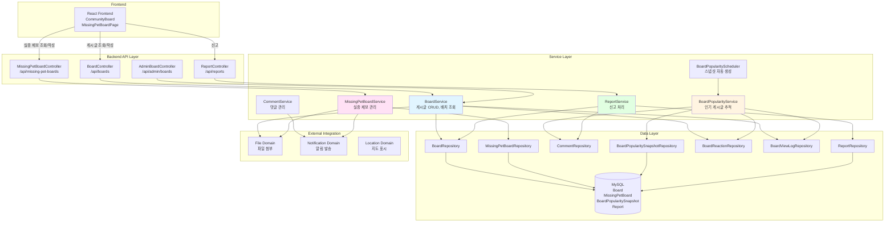
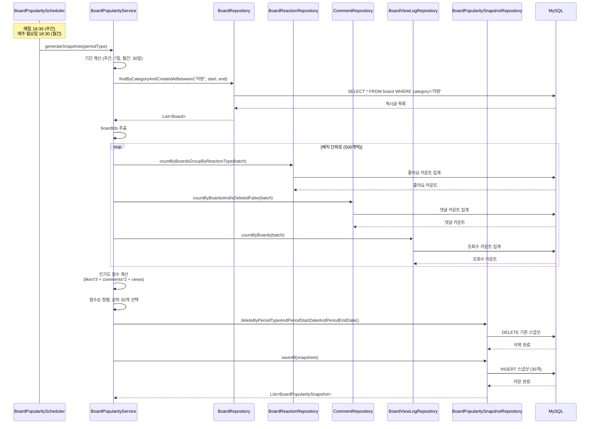
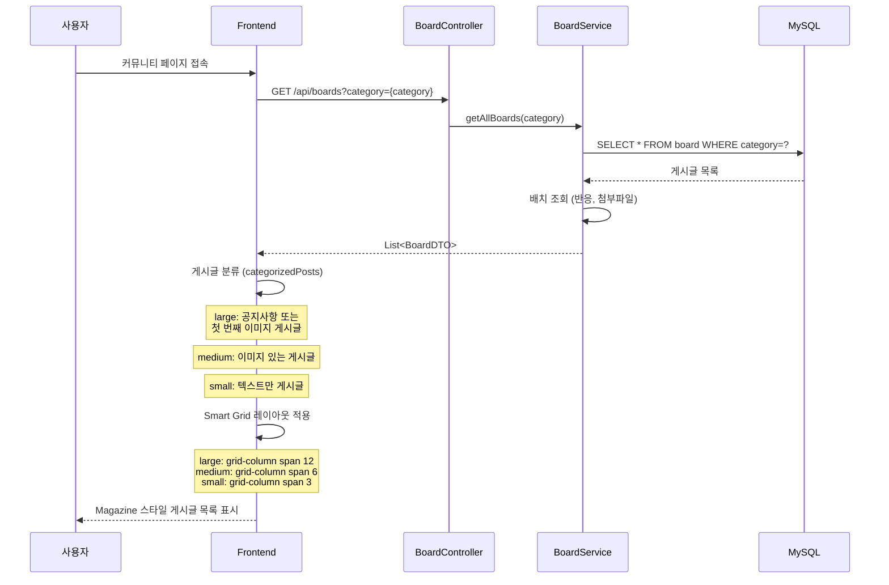
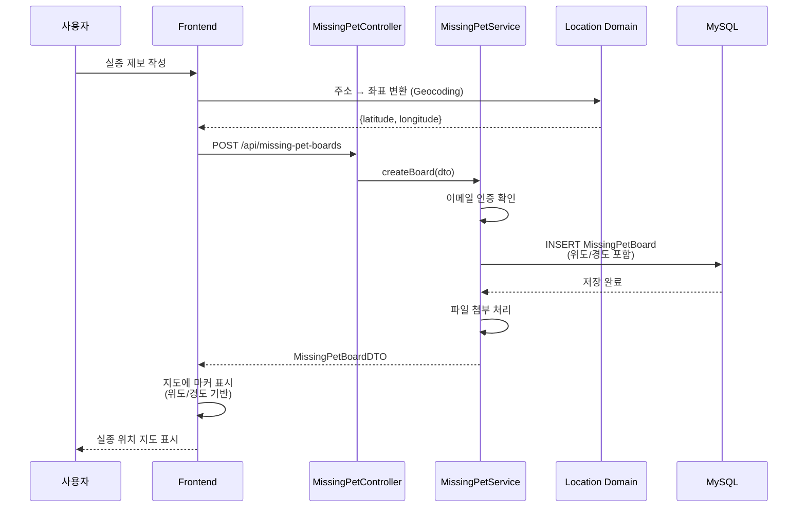

# 커뮤니티 & 실종 제보 아키텍처

## 📋 개요

커뮤니티 & 실종 제보 도메인은 사용자들이 게시글을 작성하고 공유하며, 실종 동물 정보를 지도 기반으로 공유할 수 있는 핵심 도메인입니다. Magazine + Smart Grid 레이아웃, 인기 게시글 추적, 블라인드 처리, 실종 골든타임 위치 공유 등의 기능을 제공합니다.

## 🏗️ 시스템 아키텍처

### 전체 구조도



## 🔧 핵심 컴포넌트

### 1. BoardService (커뮤니티 게시판 관리)

**역할**: 게시글 CRUD, 배치 조회로 N+1 문제 해결, 블라인드 처리

**주요 메서드**:
- `getAllBoards()`: 게시글 목록 조회 (카테고리 필터링)
- `mapBoardsWithReactionsBatch()`: 배치 조회로 N+1 문제 해결
- `updateBoardStatus()`: 게시글 상태 변경 (블라인드 처리)

**핵심 로직**:

#### 배치 조회로 N+1 문제 해결
```java
private List<BoardDTO> mapBoardsWithReactionsBatch(List<Board> boards) {
    // 1. 게시글 ID 목록 추출
    List<Long> boardIds = boards.stream()
        .map(Board::getIdx)
        .collect(Collectors.toList());
    
    // 2. 좋아요/싫어요 카운트 배치 조회 (500개 단위)
    Map<Long, Map<ReactionType, Long>> reactionCountsMap = 
        getReactionCountsBatch(boardIds);
    
    // 3. 첨부파일 배치 조회
    Map<Long, List<FileDTO>> attachmentsMap = 
        attachmentFileService.getAttachmentsBatch(FileTargetType.BOARD, boardIds);
    
    // 4. DTO 변환 및 반응 정보 매핑
    return boards.stream()
        .map(board -> {
            BoardDTO dto = boardConverter.toDTO(board);
            Map<ReactionType, Long> counts = reactionCountsMap.getOrDefault(
                board.getIdx(), new HashMap<>());
            dto.setLikes(Math.toIntExact(counts.getOrDefault(ReactionType.LIKE, 0L)));
            dto.setDislikes(Math.toIntExact(counts.getOrDefault(ReactionType.DISLIKE, 0L)));
            dto.setAttachments(attachmentsMap.getOrDefault(board.getIdx(), new ArrayList<>()));
            return dto;
        })
        .collect(Collectors.toList());
}
```

#### 블라인드 처리
- 관리자가 수동으로 블라인드 처리 (`ContentStatus.BLINDED`)
- 블라인드된 게시글은 내용이 가려짐
- **참고**: 신고 누적 시 자동 블라인드 처리는 현재 구현되지 않음 (관리자 수동 처리만 가능)

### 2. BoardPopularityService (인기 게시글 추적)

**역할**: 조회수, 반응 수 기반 인기 게시글 스냅샷 생성

**주요 메서드**:
- `generateSnapshots()`: 인기 게시글 스냅샷 생성
- `getPopularBoards()`: 인기 게시글 조회 (다단계 전략)
- `calculatePopularityScore()`: 인기도 점수 계산

**핵심 로직**:

#### 인기도 점수 계산
```java
private int calculatePopularityScore(int likes, int comments, int views) {
    return (likes * 3) + (comments * 2) + views;
}
```

**점수 공식**:
- 좋아요: 3점
- 댓글: 2점
- 조회수: 1점

#### 스냅샷 생성 프로세스
1. "자랑" 카테고리 게시글 조회 (기간 내)
2. 배치 조회로 좋아요/댓글/조회수 집계 (500개 단위)
3. 인기도 점수 계산 및 정렬
4. 상위 30개 게시글 스냅샷 저장
5. 기존 스냅샷 삭제 후 새로 생성

#### 다단계 조회 전략
```java
// 1. 정확한 날짜 매칭으로 조회 시도
List<BoardPopularitySnapshot> snapshots = snapshotRepository
    .findByPeriodTypeAndPeriodStartDateAndPeriodEndDateOrderByRankingAsc(...);

// 2. 정확한 매칭이 없으면 기간이 겹치는 스냅샷 조회
if (snapshots.isEmpty()) {
    snapshots = snapshotRepository
        .findByPeriodTypeAndPeriodStartDateLessThanEqualAndPeriodEndDateGreaterThanEqualOrderByRankingAsc(...);
}

// 3. 그래도 없으면 가장 최근 스냅샷 조회
if (snapshots.isEmpty()) {
    snapshots = snapshotRepository
        .findTop30ByPeriodTypeOrderByPeriodEndDateDescRankingAsc(periodType);
}

// 4. 모든 시도가 실패하면 새로 생성
if (snapshots.isEmpty()) {
    snapshots = generateSnapshots(periodType, range);
}
```

### 3. BoardPopularityScheduler (스냅샷 자동 생성)

**역할**: 주기적으로 인기 게시글 스냅샷 자동 생성

**스케줄러 설정**:
- 주간 스냅샷: 매일 오후 6시 30분 (`@Scheduled(cron = "0 30 18 * * ?")`)
- 월간 스냅샷: 매주 월요일 오후 6시 30분 (`@Scheduled(cron = "0 30 18 ? * MON")`)

**기간 계산**:
- 주간: 오늘 포함 최근 7일 (today - 6 days ~ today)
- 월간: 오늘 포함 최근 30일 (today - 29 days ~ today)

### 4. MissingPetBoardService (실종 제보 관리)

**역할**: 실종 동물 신고 관리, 위치 기반 검색

**주요 메서드**:
- `createBoard()`: 실종 제보 생성 (이메일 인증 필수)
- `getBoards()`: 실종 제보 목록 조회 (상태 필터링)
- 위치 기반 검색 지원

**핵심 로직**:

#### 실종 골든타임 위치 공유
- 위도/경도 저장 (`BigDecimal` 타입, precision=15, scale=12)
- 지도 기반 직관적인 위치 표시
- 반경 기반 검색 지원

#### 상태 관리
- `MISSING`: 실종 중 (기본 상태)
- `FOUND`: 발견됨
- `RESOLVED`: 해결됨

### 5. ReportService (신고 처리)

**역할**: 신고 접수 및 처리, 관리자 수동 블라인드 처리

**주요 기능**:
- 신고 접수 (게시글, 댓글, 실종제보 등)
- 중복 신고 방지 (Unique 제약조건)
- 관리자 수동 블라인드 처리
- **참고**: 신고 누적 시 자동 블라인드 처리는 현재 구현되지 않음

## 📊 데이터 흐름

### 1. 인기 게시글 스냅샷 생성 흐름



### 2. Magazine + Smart Grid 레이아웃 흐름



### 3. 실종 골든타임 위치 공유 흐름



## 🎯 핵심 설계 전략

### 1. Magazine + Smart Grid 레이아웃 전략

**문제**: 다양한 크기의 게시글을 시각적으로 구분하여 표시해야 함

**해결**: 크기별 게시글 분류 및 그리드 레이아웃
- **대형 카드 (Large)**: 공지사항 또는 첫 번째 이미지 게시글 (grid-column: span 12)
- **중형 카드 (Medium)**: 이미지 있는 게시글 (grid-column: span 6)
- **소형 카드 (Small)**: 텍스트만 게시글 (grid-column: span 3)

**프론트엔드 구현**:
```javascript
const categorizedPosts = useMemo(() => {
    const large = [];
    const medium = [];
    const small = [];
    
    // 공지사항 또는 첫 번째 이미지 게시글을 대형으로
    const noticePost = filteredPosts.find(post => post.category === '공지');
    const firstWithImage = filteredPosts.find(post => post.boardFilePath);
    
    if (noticePost) {
        large.push(noticePost);
    } else if (firstWithImage) {
        large.push(firstWithImage);
    }
    
    // 나머지 게시글 분류
    filteredPosts.forEach((post) => {
        if (large.includes(post)) return;
        if (post.boardFilePath) {
            medium.push(post);
        } else {
            small.push(post);
        }
    });
    
    return { large, medium, small };
}, [filteredPosts]);
```

**효과**:
- 시각적으로 매력적인 레이아웃
- 공지사항 및 이미지 게시글 강조
- 반응형 디자인 지원 (PC/Tablet/Mobile)

### 2. 인기 게시글 추적 전략

**문제**: 실시간으로 인기 게시글을 계산하면 성능 부하가 큼

**해결**: 스냅샷 기반 인기 게시글 관리
- 주기적으로 스냅샷 생성 (주간/월간)
- 인기도 점수 = (좋아요 × 3) + (댓글 × 2) + 조회수
- "자랑" 카테고리 게시글만 대상
- 상위 30개 게시글만 스냅샷 저장

**다단계 조회 전략**:
1. 정확한 날짜 매칭으로 조회
2. 기간이 겹치는 스냅샷 조회
3. 가장 최근 스냅샷 조회
4. 없으면 새로 생성

**효과**:
- 실시간 계산 부하 감소
- 빠른 인기 게시글 조회
- 일관된 인기도 점수 제공

### 3. 배치 조회 전략 (N+1 문제 해결)

**문제**: 게시글 목록 조회 시 반응, 첨부파일 조회로 N+1 문제 발생

**해결**: 배치 조회로 한 번에 조회
- 게시글 ID 목록 추출
- 500개 단위로 배치 분할
- 배치 단위로 반응/첨부파일 조회
- Map으로 결과 매핑

**효과**:
- N+1 문제 해결
- 쿼리 수 대폭 감소
- 응답 시간 단축

### 4. 블라인드 처리 전략

**문제**: 유해 콘텐츠를 사용자에게 노출하지 않아야 함

**해결**: ContentStatus 기반 블라인드 처리
- `ContentStatus.BLINDED` 상태로 게시글/댓글 가리기
- 관리자가 수동으로 블라인드 처리
- 블라인드된 콘텐츠는 내용이 가려짐

**현재 구현 상태**:
- 관리자 수동 블라인드 처리: 구현됨
- 신고 누적 시 자동 블라인드 처리: 구현되지 않음 (추후 구현 가능)

**효과**:
- 유해 콘텐츠 차단
- 관리자 제어 가능

### 5. 실종 골든타임 위치 공유 전략

**문제**: 실종 동물의 위치를 직관적으로 공유해야 함

**해결**: 지도 기반 위치 공유
- 위도/경도 저장 (`BigDecimal`, precision=15, scale=12)
- 지도에 마커 표시
- 반경 기반 검색 지원
- 목격 정보 댓글에도 위치 정보 포함

**효과**:
- 직관적인 위치 공유
- 골든타임 활용 극대화
- 반경 기반 검색으로 효율적인 탐색

## 🔄 도메인 간 연동

### 1. File 도메인 연동
- **용도**: 게시글 및 실종 제보 이미지 첨부
- **방법**: `AttachmentFileService.syncSingleAttachment()` 호출
- **효과**: 파일 관리 일원화

### 2. Notification 도메인 연동
- **용도**: 댓글 작성 시 게시글 작성자에게 알림
- **방법**: `NotificationService.createNotification()` 호출
- **효과**: 실시간 알림으로 사용자 참여도 향상

### 3. Location 도메인 연동
- **용도**: 실종 제보 위치 표시 및 검색
- **방법**: 위도/경도 저장 및 지도 표시
- **효과**: 직관적인 위치 공유

### 4. Report 도메인 연동
- **용도**: 게시글/댓글 신고 및 블라인드 처리
- **방법**: `ReportService`를 통한 신고 처리
- **효과**: 유해 콘텐츠 관리

## 📈 성능 최적화

### 1. DB 최적화

#### 인덱스 전략
```sql
-- 카테고리별 게시글 조회
CREATE INDEX idx_board_category_created ON board(category, created_at DESC);

-- 삭제 여부 인덱스
CREATE INDEX idx_board_deleted ON board(is_deleted);

-- 상태별 조회
CREATE INDEX idx_board_status ON board(status);

-- 인기 게시글 스냅샷 조회
CREATE INDEX idx_snapshot_period ON board_popularity_snapshot(period_type, period_start_date, period_end_date, ranking);

-- 실종 제보 위치 기반 검색
CREATE INDEX idx_missing_pet_location ON MissingPetBoard(latitude, longitude);

-- 실종 제보 상태별 조회
CREATE INDEX idx_missing_pet_status ON MissingPetBoard(status);
```

**선정 이유**:
- 카테고리별 필터링이 빈번함
- 인기 게시글 스냅샷 조회 최적화
- 실종 제보 위치 기반 검색 최적화

### 2. 애플리케이션 레벨 최적화

#### 배치 조회 최적화
- **500개 단위 배치 분할**: IN 절 크기 제한 회피
- **Map 기반 매핑**: O(1) 조회 성능
- **스트림 처리**: Java Stream API로 효율적인 처리

#### 스냅샷 기반 인기 게시글
- **주기적 생성**: 실시간 계산 부하 감소
- **다단계 조회 전략**: 캐시 히트율 향상
- **상위 30개만 저장**: 저장 공간 최적화

#### 캐싱 전략
- 인기 게시글 스냅샷: 다단계 조회 전략으로 캐시 효과
- 게시글 목록: 캐시 임시 비활성화 (개발 중 데이터 동기화 문제)

## 🔐 보안 고려사항

### 1. 권한 제어
- 게시글 작성: 이메일 인증 필수 (일부 카테고리)
- 실종 제보 작성: 이메일 인증 필수
- 블라인드 처리: 관리자만 가능 (`@PreAuthorize("hasAnyRole('ADMIN','MASTER')")`)

### 2. 데이터 검증
- 위치 정보 검증: 위도/경도 범위 확인
- 파일 첨부 검증: 파일 크기, 확장자 제한
- 중복 신고 방지: Unique 제약조건

### 3. 입력 검증
- SQL Injection 방지 (JPA 사용)
- XSS 방지 (DTO 변환 시 이스케이프)
- 파일 경로 정규화 (Directory Traversal 방지)

## 📝 주요 API 엔드포인트

### 커뮤니티 게시판
```
GET /api/boards?category={카테고리}
→ List<BoardDTO>

GET /api/boards/{id}
→ BoardDTO

POST /api/boards
→ BoardDTO

PUT /api/boards/{id}
→ BoardDTO

DELETE /api/boards/{id}
→ 204 No Content

GET /api/boards/popular?period={WEEKLY|MONTHLY}
→ List<BoardPopularitySnapshotDTO>
```

### 실종 제보
```
GET /api/missing-pet-boards?status={MISSING|FOUND|RESOLVED}
→ List<MissingPetBoardDTO>

GET /api/missing-pet-boards/{id}
→ MissingPetBoardDTO

POST /api/missing-pet-boards
→ MissingPetBoardDTO

PUT /api/missing-pet-boards/{id}
→ MissingPetBoardDTO

DELETE /api/missing-pet-boards/{id}
→ 204 No Content
```

### 관리자 블라인드 처리
```
PATCH /api/admin/boards/{id}/blind
→ BoardDTO

PATCH /api/admin/boards/{id}/unblind
→ BoardDTO

PATCH /api/admin/boards/{boardId}/comments/{commentId}/blind
→ CommentDTO
```

## 🎯 핵심 포인트 요약

### 1. Magazine + Smart Grid 레이아웃
- **크기별 분류**: 공지사항/이미지 게시글 → 대형, 이미지 게시글 → 중형, 텍스트 게시글 → 소형
- **그리드 시스템**: CSS Grid로 반응형 레이아웃 구현
- **효과**: 시각적으로 매력적인 레이아웃, 공지사항 강조

### 2. 인기 게시글 추적
- **점수 공식**: (좋아요 × 3) + (댓글 × 2) + 조회수
- **스냅샷 생성**: 주간(매일 18:30), 월간(매주 월요일 18:30)
- **다단계 조회**: 정확한 날짜 매칭 → 겹치는 기간 → 최근 스냅샷 → 생성
- **효과**: 실시간 계산 부하 감소, 빠른 조회

### 3. 블라인드 처리
- **수동 처리**: 관리자가 `ContentStatus.BLINDED`로 상태 변경
- **현재 상태**: 신고 누적 시 자동 블라인드 처리는 구현되지 않음
- **효과**: 유해 콘텐츠 차단

### 4. 실종 골든타임 위치 공유
- **위치 저장**: 위도/경도 (`BigDecimal`, precision=15, scale=12)
- **지도 표시**: 지도에 마커로 위치 표시
- **반경 검색**: 사용자 위치 기준 반경 내 검색
- **효과**: 직관적인 위치 공유, 골든타임 활용 극대화

### 5. 배치 조회 최적화
- **N+1 문제 해결**: 배치 조회로 반응/첨부파일 한 번에 조회
- **500개 단위 배치**: IN 절 크기 제한 회피
- **효과**: 쿼리 수 대폭 감소, 응답 시간 단축

### 6. 성능 최적화
- **스냅샷 기반**: 실시간 계산 대신 주기적 스냅샷 생성
- **배치 조회**: N+1 문제 해결
- **인덱스 전략**: 카테고리, 상태, 위치 기반 인덱스
