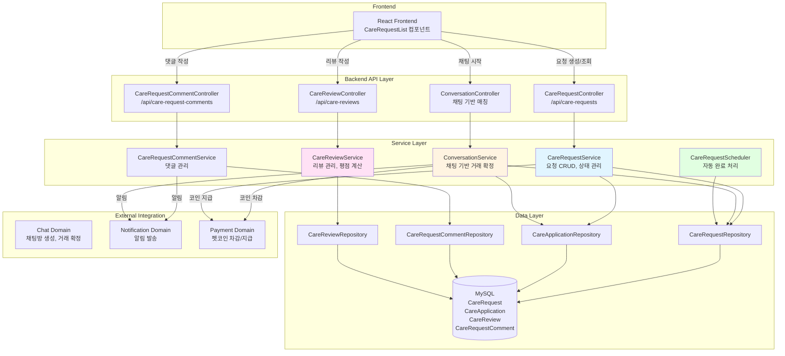

# 펫 케어 & 매칭 아키텍처

## 📋 개요

펫 케어 & 매칭 도메인은 반려동물 돌봄이 필요한 사용자와 돌봄을 제공할 수 있는 사용자를 연결하는 핵심 도메인입니다. 요청 생성 → 지원 → 매칭 → 케어 수행 → 리뷰로 이어지는 전체 생애주기를 관리하며, 상호 리뷰 및 평점 시스템을 통해 펫시터 검증을 제공합니다.

## 🏗️ 시스템 아키텍처

### 전체 구조도



## 🔧 핵심 컴포넌트

### 1. CareRequestService (케어 요청 관리)

**역할**: 펫케어 요청 CRUD, 상태 관리, 검색

**주요 메서드**:
- `createCareRequest()`: 케어 요청 생성 (이메일 인증 필수)
- `getAllCareRequests()`: 전체 요청 조회 (상태/위치 필터링)
- `updateStatus()`: 상태 변경 (OPEN → IN_PROGRESS → COMPLETED → CANCELLED)
- `searchCareRequests()`: 키워드 검색

**핵심 로직**:

#### 상태 전이
```
OPEN → IN_PROGRESS → COMPLETED
  ↓
CANCELLED
```

#### 이메일 인증 필수
```java
if (user.getEmailVerified() == null || !user.getEmailVerified()) {
    throw new EmailVerificationRequiredException("펫케어 서비스 이용을 위해 이메일 인증이 필요합니다.");
}
```

#### 펫 정보 연결 (선택사항)
- 펫 소유자만 자신의 펫을 연결 가능
- 펫 정보는 선택사항 (null 허용)

### 2. ConversationService (채팅 기반 매칭)

**역할**: 채팅방을 통한 거래 확정 및 자동 매칭

**핵심 로직**: `confirmCareDeal()`

**매칭 프로세스**:
1. 펫케어 관련 채팅방 확인 (`RelatedType.CARE_REQUEST` 또는 `CARE_APPLICATION`)
2. 사용자의 거래 확정 처리 (`dealConfirmed`, `dealConfirmedAt` 설정)
3. 중복 확정 방지 체크
4. 양쪽 모두 확정 확인 (2명 참여자 모두 `dealConfirmed = true`)
5. 양쪽 모두 확정 시:
   - `CareRequest` 상태가 `OPEN`인 경우에만 처리
   - 제공자 찾기 (요청자가 아닌 참여자)
   - 기존 `CareApplication`이 있으면 승인, 없으면 생성 (`ACCEPTED` 상태)
   - `CareRequest` 상태를 `IN_PROGRESS`로 변경
   - **펫코인 차감 및 에스크로 생성** (요청자가 설정한 `offeredCoins`만큼)
     - 요청자 코인 차감 → 에스크로에 임시 보관 (`HOLD` 상태)
     - 상세 내용은 [Payment 도메인 문서](../domains/payment.md) 참조

**동시성 제어**: `@Transactional`로 트랜잭션 보장

**특징**:
- 채팅 도메인에서 `CareApplication` 생성/관리
- 양쪽 모두 거래 확정해야만 서비스 시작
- 자동 매칭 (수동 승인 불필요)

### 3. CareReviewService (리뷰 관리)

**역할**: 펫케어 리뷰 작성 및 평점 계산

**주요 메서드**:
- `createReview()`: 리뷰 작성 (요청자만 제공자에게 리뷰 작성 가능)
- `getAverageRating()`: 평균 평점 계산
- `getReviewsByReviewee()`: 특정 사용자에 대한 리뷰 목록

**핵심 로직**:

#### 리뷰 작성 조건
```java
// 1. CareApplication이 ACCEPTED 상태여야 함
if (careApplication.getStatus() != CareApplicationStatus.ACCEPTED) {
    throw new IllegalStateException("승인된 펫케어 서비스에만 리뷰를 작성할 수 있습니다.");
}

// 2. 중복 리뷰 방지
boolean alreadyReviewed = reviewRepository.existsByCareApplicationIdxAndReviewerIdx(
    dto.getCareApplicationId(), dto.getReviewerId());
if (alreadyReviewed) {
    throw new IllegalStateException("이미 해당 서비스에 리뷰를 작성하셨습니다.");
}

// 3. 요청자만 리뷰 작성 가능
if (!dto.getReviewerId().equals(requesterId)) {
    throw new IllegalArgumentException("요청자만 리뷰를 작성할 수 있습니다.");
}
```

#### 평점 계산
- 리뷰 평점의 평균값 계산
- 리뷰가 없으면 `null` 반환

### 4. CareRequestCommentService (댓글 관리)

**역할**: 펫케어 요청 댓글 관리

**주요 기능**:
- `SERVICE_PROVIDER` 역할만 댓글 작성 가능
- 파일 첨부 지원
- 댓글 작성 시 요청자에게 알림 발송
- Soft Delete 적용

### 5. CareRequestScheduler (자동 완료 처리)

**역할**: 날짜가 지난 요청 자동 완료

**스케줄러 설정**:
- 매 시간 정각 실행: `@Scheduled(cron = "0 0 * * * ?")`
- 매일 자정에도 실행: `@Scheduled(cron = "0 0 0 * * ?")`

**핵심 로직**:
```java
// 날짜가 지났고, OPEN 또는 IN_PROGRESS 상태인 요청 조회
List<CareRequest> expiredRequests = careRequestRepository
    .findByDateBeforeAndStatusIn(
        now,
        List.of(CareRequestStatus.OPEN, CareRequestStatus.IN_PROGRESS));

// 상태를 COMPLETED로 변경
for (CareRequest request : expiredRequests) {
    request.setStatus(CareRequestStatus.COMPLETED);
}
```

## 🔄 비즈니스 로직 흐름

### 1. 케어 요청 생성 흐름

**단계별 처리 과정** (`CareRequestService.createCareRequest()`):

1. **이메일 인증 확인**
   - **이메일 인증 필수**: `user.getEmailVerified()` 확인
   - 미인증 시 `EmailVerificationRequiredException` 발생
   - 펫케어 서비스는 책임 있는 행동이므로 2단계 권한 필요

2. **펫 정보 연결 (선택사항)**
   - `petIdx`가 제공된 경우 펫 정보 조회
   - **펫 소유자 확인**: 펫의 소유자가 요청자와 일치하는지 확인
   - 소유자가 아니면 예외 발생
   - 펫 정보는 선택사항 (null 허용)

3. **케어 요청 저장**
   - 제목, 설명, 날짜, 작성자 정보 저장
   - 상태: 기본값 `OPEN` (지원 대기 상태)

4. **응답 반환**
   - 저장된 케어 요청 정보를 DTO로 변환하여 반환

**특징:**
- 이메일 인증 필수 (신뢰할 수 있는 사용자만 서비스 이용)
- 펫 정보는 선택사항 (펫이 없는 경우에도 요청 가능)
- 펫 소유자만 자신의 펫을 연결 가능

### 2. 채팅 기반 매칭 흐름

**전체 프로세스** (`ConversationService.confirmCareDeal()`):

1. **채팅방 생성**
   - 제공자가 케어 요청을 확인하고 채팅 시작
   - `RelatedType.CARE_REQUEST` 또는 `CARE_APPLICATION` 타입의 채팅방 생성
   - 요청자와 제공자가 자동으로 채팅방에 참여

2. **채팅에서 조건 협의**
   - 양쪽 사용자가 채팅으로 조건 협의
   - 가격, 시간, 장소 등 상세 조건 논의

3. **거래 확정 처리** (각 사용자별)
   - 사용자가 "거래 확정" 버튼 클릭
   - `dealConfirmed = true`, `dealConfirmedAt = LocalDateTime.now()` 설정
   - 중복 확정 방지: 이미 확정한 경우 예외 발생

4. **양쪽 모두 확정 확인**
   - 채팅방의 모든 활성 참여자 확인
   - 모든 참여자가 `dealConfirmed = true`인지 확인
   - 참여자 수가 정확히 2명인지 확인

5. **자동 매칭 처리** (양쪽 모두 확정 시)
   - `CareRequest` 상태가 `OPEN`인 경우에만 처리
   - 제공자 식별: 채팅방 참여자 중 요청자가 아닌 사람
   - `CareApplication` 처리:
     - 기존 지원이 있으면: 상태를 `ACCEPTED`로 변경
     - 기존 지원이 없으면: 새로 생성 (`ACCEPTED` 상태)
   - `CareRequest` 상태를 `IN_PROGRESS`로 변경
   - DB 저장

**특징:**
- 양쪽 모두 확정해야만 서비스 시작
- 자동 매칭 (수동 승인 과정 제거)
- 트랜잭션으로 원자성 보장
- 채팅 도메인에서 `CareApplication` 생성/관리

### 3. 리뷰 작성 흐름

**단계별 처리 과정** (`CareReviewService.createReview()`):

1. **CareApplication 조회**
   - `CareApplication` ID로 조회
   - 존재하지 않으면 예외 발생

2. **상태 확인**
   - `CareApplication` 상태가 `ACCEPTED`여야 함
   - 다른 상태면 예외 발생 ("승인된 펫케어 서비스에만 리뷰를 작성할 수 있습니다.")

3. **중복 리뷰 확인**
   - 동일 `CareApplication`에 대해 동일 리뷰어가 이미 리뷰를 작성했는지 확인
   - 중복이면 예외 발생 ("이미 해당 서비스에 리뷰를 작성하셨습니다.")

4. **권한 확인**
   - 요청자 확인: 리뷰어가 케어 요청의 작성자인지 확인
   - 제공자 확인: 리뷰 대상이 케어 제공자인지 확인
   - 요청자만 제공자에게 리뷰 작성 가능

5. **리뷰 저장**
   - 평점, 댓글, 리뷰어, 리뷰 대상 정보 저장
   - DB 저장

6. **응답 반환**
   - 저장된 리뷰 정보를 DTO로 변환하여 반환

**평점 계산** (`CareReviewService.getAverageRating()`):
- 특정 사용자(reviewee)에 대한 모든 리뷰 조회
- 평점의 평균값 계산
- 리뷰가 없으면 `null` 반환

**특징:**
- 한 `CareApplication`당 1개의 리뷰만 작성 가능
- 요청자만 제공자에게 리뷰 작성 가능
- 평균 평점으로 펫시터 검증

### 4. 댓글 작성 흐름

**단계별 처리 과정** (`CareRequestCommentService.addComment()`):

1. **권한 확인**
   - **SERVICE_PROVIDER 역할만 댓글 작성 가능**: `user.getRole() == Role.SERVICE_PROVIDER`
   - 다른 역할이면 예외 발생 ("당신은 댓글 작성 불가입니다.")

2. **댓글 저장**
   - 케어 요청, 작성자, 내용 정보 저장
   - 첨부파일이 있으면 파일 동기화 (`FileTargetType.CARE_COMMENT`)

3. **알림 발송**
   - 댓글 작성자가 요청자와 다른 경우에만 알림 발송
   - 알림 타입: `NotificationType.CARE_REQUEST_COMMENT`
   - 알림 내용: "{작성자명}님이 댓글을 남겼습니다: {댓글 내용(50자 제한)}"

4. **응답 반환**
   - 저장된 댓글 정보를 DTO로 변환하여 반환
   - 첨부파일 정보 포함

**댓글 삭제** (`CareRequestCommentService.deleteComment()`):
- Soft Delete 방식: `isDeleted = true`, `deletedAt` 설정
- 실제 데이터는 유지 (복구 가능)

**특징:**
- SERVICE_PROVIDER 역할만 댓글 작성 가능
- 댓글 작성 시 요청자에게 알림 발송
- Soft Delete 적용

### 5. 상태 변경 흐름

**수동 상태 변경** (`CareRequestService.updateStatus()`):

1. **권한 확인**
   - 관리자는 권한 검증 우회
   - 일반 사용자:
     - 작성자 또는 승인된 제공자만 상태 변경 가능
     - 승인된 제공자 확인: `CareApplication`이 `ACCEPTED` 상태이고 제공자 ID가 일치하는지 확인

2. **상태 변경**
   - 요청된 상태로 변경
   - DB 저장

3. **펫코인 지급 처리** (상태가 `COMPLETED`로 변경될 때)
   - 에스크로 조회 (`PetCoinEscrowService.findByCareRequest`)
   - 에스크로 상태가 `HOLD`인 경우:
     - 제공자에게 코인 지급 (`PetCoinEscrowService.releaseToProvider`)
     - 에스크로 상태를 `RELEASED`로 변경
     - 상세 내용은 [Payment 도메인 문서](../domains/payment.md) 참조

**상태 전이 규칙:**
- `OPEN` → `IN_PROGRESS`: 양쪽 모두 거래 확정 시 (자동)
- `OPEN`/`IN_PROGRESS` → `COMPLETED`: 날짜 지나면 자동 또는 수동
- 모든 상태 → `CANCELLED`: 요청자 취소

**자동 완료 처리** (`CareRequestScheduler.updateExpiredCareRequests()`):

1. **스케줄러 실행**
   - 매 시간 정각 실행: `@Scheduled(cron = "0 0 * * * ?")`
   - 매일 자정에도 실행: `@Scheduled(cron = "0 0 0 * * ?")`

2. **만료된 요청 조회**
   - 날짜가 현재 시간보다 이전인 요청 조회
   - 상태가 `OPEN` 또는 `IN_PROGRESS`인 요청만 대상

3. **상태 변경**
   - 모든 만료된 요청의 상태를 `COMPLETED`로 변경
   - 일괄 저장 (`saveAll()`)

**특징:**
- 자동 완료로 사용자 개입 없이 처리
- 데이터 일관성 유지
- 시스템 부하 최소화

### 6. 케어 요청 수정/삭제 흐름

**수정 흐름** (`CareRequestService.updateCareRequest()`):

1. **권한 확인**
   - 작성자만 수정 가능 (관리자는 우회)
   - 작성자가 아니면 예외 발생

2. **데이터 업데이트**
   - 제목, 설명, 날짜 업데이트 (null이 아닌 값만)
   - 펫 정보 업데이트:
     - `petIdx`가 제공되면 펫 소유자 확인 후 연결
     - `petIdx`가 null이면 펫 연결 해제

3. **응답 반환**
   - 업데이트된 케어 요청 정보를 DTO로 변환하여 반환

**삭제 흐름** (`CareRequestService.deleteCareRequest()`):

1. **권한 확인**
   - 작성자만 삭제 가능 (관리자는 우회)

2. **Soft Delete 처리**
   - `isDeleted = true` 설정
   - `deletedAt = LocalDateTime.now()` 기록
   - DB 저장

**특징:**
- 작성자만 수정/삭제 가능
- Soft Delete 방식으로 데이터 보존

## 📊 데이터 흐름

### 1. 케어 요청 생성 및 매칭 흐름


### 2. 리뷰 작성 흐름


### 3. 자동 완료 처리 흐름


## 🎯 핵심 설계 전략

### 1. 채팅 기반 매칭 전략

**문제**: 전통적인 지원/승인 방식은 사용자 경험이 좋지 않음

**해결**: 채팅 기반 거래 확정 시스템
- 채팅방에서 조건 협의 후 양쪽 모두 확정
- 양쪽 모두 확정 시 자동 매칭
- 수동 승인 과정 제거로 UX 향상

**효과**:
- 사용자 간 직접 소통 가능
- 조건 협의 후 확정으로 신뢰도 향상
- 자동 매칭으로 프로세스 간소화

### 2. 상태 전이 전략

**문제**: 케어 요청의 생애주기를 명확하게 관리해야 함

**해결**: 상태 기반 전이 관리
- `OPEN`: 요청 생성, 지원 대기
- `IN_PROGRESS`: 매칭 완료, 케어 진행 중
- `COMPLETED`: 케어 완료
- `CANCELLED`: 취소

**상태 전이 규칙**:
- `OPEN` → `IN_PROGRESS`: 양쪽 모두 거래 확정 시
- `OPEN`/`IN_PROGRESS` → `COMPLETED`: 날짜 지나면 자동 또는 수동
- 모든 상태 → `CANCELLED`: 요청자 취소

### 3. 리뷰 시스템 전략

**문제**: 펫시터의 신뢰도를 검증해야 함

**해결**: 상호 리뷰 시스템
- 요청자만 제공자에게 리뷰 작성 가능
- 한 `CareApplication`당 1개의 리뷰만 작성 가능
- 평균 평점 계산으로 펫시터 검증

**효과**:
- 신뢰할 수 있는 펫시터 검증
- 리뷰 기반 평점 시스템
- 중복 리뷰 방지

### 4. 자동 완료 처리 전략

**문제**: 날짜가 지난 요청을 수동으로 완료 처리하는 것은 번거로움

**해결**: 스케줄러 기반 자동 완료
- 매 시간 정각 실행
- 매일 자정에도 실행 (더 정확한 처리)
- `OPEN` 또는 `IN_PROGRESS` 상태의 만료된 요청 자동 완료

**효과**:
- 사용자 개입 없이 자동 처리
- 데이터 일관성 유지
- 시스템 부하 최소화

### 5. 이메일 인증 필수 전략

**문제**: 신뢰할 수 있는 사용자만 서비스 이용해야 함

**해결**: 이메일 인증 필수
- 케어 요청 생성 시 이메일 인증 확인
- 미인증 사용자는 요청 생성 불가

**효과**:
- 신뢰할 수 있는 사용자만 서비스 이용
- 스팸 및 악의적 사용 방지

### 6. Soft Delete 전략

**문제**: 삭제된 데이터도 추적이 필요할 수 있음

**해결**: Soft Delete 적용
- `isDeleted` 플래그 사용
- `deletedAt` 타임스탬프 기록
- 실제 데이터는 유지

**효과**:
- 데이터 복구 가능
- 삭제 이력 추적
- 통계 및 분석 가능

## 🔄 도메인 간 연동

### 1. Chat 도메인 연동
- **용도**: 채팅방을 통한 거래 확정 및 매칭
- **방법**: `ConversationService.confirmCareDeal()` 호출
- **효과**: 채팅 기반 자동 매칭

### 2. Notification 도메인 연동
- **용도**: 댓글 작성 시 요청자에게 알림
- **방법**: `CareRequestCommentService`에서 알림 발송
- **효과**: 실시간 알림으로 사용자 참여도 향상

### 3. User 도메인 연동
- **용도**: 이메일 인증 확인, 펫 정보 연결
- **방법**: `Users.emailVerified` 필드 확인, `Pet` 엔티티 연결
- **효과**: 신뢰할 수 있는 사용자만 서비스 이용

## 📈 성능 최적화

### 1. DB 최적화

#### 인덱스 전략
```sql
-- 상태별 검색 인덱스
CREATE INDEX idx_care_request_status ON carerequest(status);
CREATE INDEX idx_care_request_date ON carerequest(date);

-- 삭제 여부 인덱스
CREATE INDEX idx_care_request_deleted ON carerequest(is_deleted);

-- 사용자별 조회 인덱스
CREATE INDEX idx_care_request_user ON carerequest(user_idx);

-- 날짜 기반 자동 완료 쿼리 최적화
CREATE INDEX idx_care_request_date_status ON carerequest(date, status);
```

**선정 이유**:
- 상태별 필터링이 빈번함
- 날짜 기반 자동 완료 쿼리 최적화
- 사용자별 조회가 자주 사용됨

### 2. 애플리케이션 레벨 최적화

#### 배치 처리
- 스케줄러에서 `saveAll()` 사용으로 일괄 저장
- N+1 문제 방지를 위한 `JOIN FETCH` 사용

#### 트랜잭션 관리
- `@Transactional`로 데이터 일관성 보장
- 읽기 전용 트랜잭션 (`@Transactional(readOnly = true)`) 사용

## 🔐 보안 고려사항

### 1. 권한 제어
- 케어 요청 생성: 이메일 인증 필수
- 댓글 작성: `SERVICE_PROVIDER` 역할만 가능
- 리뷰 작성: 요청자만 제공자에게 리뷰 작성 가능

### 2. 데이터 검증
- 펫 소유자 확인 (펫 정보 연결 시)
- 중복 리뷰 방지
- 상태 전이 규칙 검증

### 3. 입력 검증
- SQL Injection 방지 (JPA 사용)
- XSS 방지 (DTO 변환 시 이스케이프)

## 📝 주요 API 엔드포인트

### 케어 요청
```
GET /api/care-requests?status={status}&location={location}
→ List<CareRequestDTO>

POST /api/care-requests
→ CareRequestDTO

PUT /api/care-requests/{id}
→ CareRequestDTO

DELETE /api/care-requests/{id}
→ 204 No Content

PATCH /api/care-requests/{id}/status?status={status}
→ CareRequestDTO

GET /api/care-requests/search?keyword={keyword}
→ List<CareRequestDTO>
```

### 리뷰
```
POST /api/care-reviews
→ CareReviewDTO

GET /api/care-reviews/reviewee/{revieweeIdx}
→ List<CareReviewDTO>

GET /api/care-reviews/reviewer/{reviewerIdx}
→ List<CareReviewDTO>

GET /api/care-reviews/average/{revieweeIdx}
→ Double (평균 평점)
```

### 댓글
```
POST /api/care-request-comments
→ CareRequestCommentDTO

GET /api/care-request-comments/care-request/{careRequestIdx}
→ List<CareRequestCommentDTO>

DELETE /api/care-request-comments/{id}
→ 204 No Content
```

## 🎯 핵심 포인트 요약

### 1. 생애주기 관리
- **프로세스**: 요청 → 지원 → 매칭 → 케어 수행 → 리뷰
- **상태 전이**: OPEN → IN_PROGRESS → COMPLETED
- **자동 완료**: 날짜 지난 요청 자동 완료 처리
- **펫코인 흐름**: 충전 → 차감(에스크로) → 제공자 지급
  - 상세 내용은 [Payment 도메인 문서](../domains/payment.md) 참조

### 2. 채팅 기반 매칭
- **방식**: 채팅방에서 조건 협의 후 양쪽 모두 확정
- **자동 매칭**: 양쪽 모두 확정 시 자동으로 `CareApplication` 생성 및 승인
- **효과**: UX 향상, 신뢰도 향상

### 3. 리뷰 시스템
- **작성자**: 요청자만 제공자에게 리뷰 작성 가능
- **중복 방지**: 한 `CareApplication`당 1개의 리뷰만 작성 가능
- **평점 계산**: 평균 평점으로 펫시터 검증

### 4. 신뢰 시스템
- **이메일 인증**: 케어 요청 생성 시 필수
- **상호 리뷰**: 요청자가 제공자에게 리뷰 작성
- **평점 시스템**: 평균 평점으로 펫시터 검증

### 5. 자동화
- **자동 완료**: 스케줄러로 날짜 지난 요청 자동 완료
- **자동 매칭**: 양쪽 모두 거래 확정 시 자동 매칭
- **알림**: 댓글 작성 시 자동 알림 발송

### 6. 확장성
- **상태 관리**: 명확한 상태 전이 규칙
- **도메인 분리**: Chat, Notification 도메인과의 명확한 분리
- **유연한 설계**: 펫 정보 연결 선택사항, 위치 필터링 확장 가능
