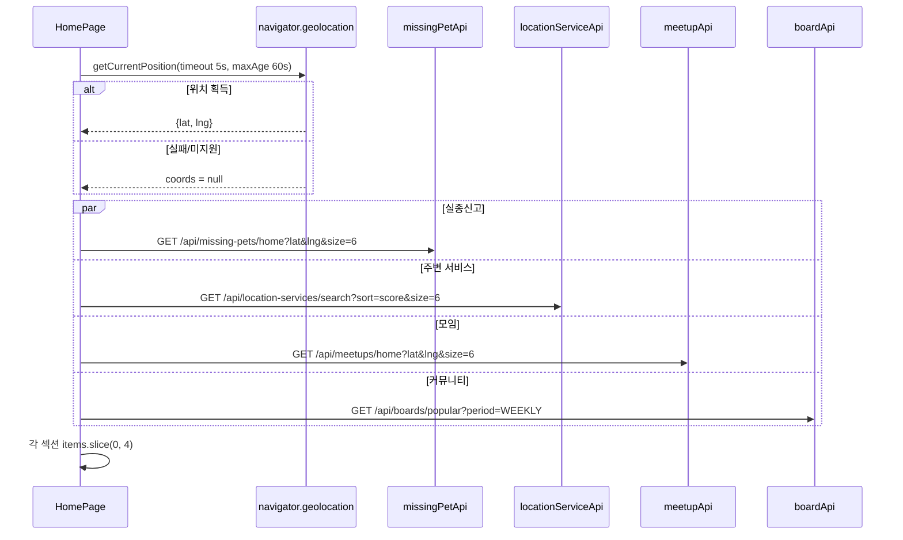

# 홈화면 랭킹 아키텍처

> 기준 코드: `HomePage.js`, `locationServiceApi`, `missingPetApi`, `meetupApi`, `boardApi`, 각 도메인 홈/인기 API.

홈화면은 별도 Home 백엔드를 두지 않고 프론트 `HomePage`가 4개 도메인 API를 병렬로 호출해 섹션별 카드 목록을 만든다. 각 도메인은 자체 랭킹 또는 폴백 정렬을 가진다.

---

## 1. 홈화면 전체 흐름



프론트 동작:

- `geo.ready`가 된 뒤 4개 API를 호출한다.
- 위치 좌표가 있으면 실종/주변서비스/모임 API에 좌표를 전달한다.
- 좌표가 없으면 각 API가 자체 폴백을 수행한다.
- API 요청 size는 6이지만, `setSection()`에서 `items.slice(0, 4)`로 화면에는 최대 4개만 노출한다.
- 섹션 카드 클릭과 `전체보기` 버튼은 상세 카드가 아니라 해당 도메인 탭으로 이동한다.

---

## 2. 섹션별 API

| 홈 섹션 | 프론트 호출 | 백엔드 API | 응답 래핑 | 홈 노출 |
| --- | --- | --- | --- | --- |
| 실종신고 | `missingPetApi.getHomeMissing(lat,lng,6)` | `GET /api/missing-pets/home` | 배열 직접 반환 | 최대 4개 |
| 주변 서비스 | `locationServiceApi.searchPlaces({ sort:'score', size:6, ...coords })` | `GET /api/location-services/search` | `{ services, count }` | 최대 4개 |
| 모임 | `meetupApi.getHomeMeetups(lat,lng,6)` | `GET /api/meetups/home` | `{ meetups, count }` | 최대 4개 |
| 커뮤니티 | `boardApi.getPopularBoards('WEEKLY')` | `GET /api/boards/popular?period=WEEKLY` | 배열 직접 반환 | 최대 4개 |

---

## 3. 주변 서비스 랭킹

### 프론트 요청

```text
GET /api/location-services/search?sort=score&size=6

좌표가 있으면 추가:
latitude={lat}&longitude={lng}&radius=10000
```

### 점수 계산

`LocationServiceScoreScheduler`가 매일 자정 전체 `locationservice.score`를 재계산한다.

```text
ratingScore = rating * log10(reviewCount + 1)
petBonus    = petFriendly ? 1.0 : 0.0

score = 0.5 * ratingScore + 0.2 * petBonus
```

| 요소 | 의미 |
| --- | --- |
| `rating` | 장소 평점 |
| `reviewCount` | soft delete 제외 리뷰 수 캐시 |
| `log10(reviewCount + 1)` | 리뷰 수가 많은 장소의 신뢰도를 반영하되 폭증을 완화 |
| `petFriendly` | 반려동물 동반 가능 장소 보너스 |

### 조회 흐름

좌표가 있는 경우:

```text
HomePage
  -> /api/location-services/search(latitude, longitude, radius=10000, sort=score, size=6)
  -> LocationServiceController
  -> LocationServiceService.searchLocationServicesByLocation()
  -> SpringDataJpaLocationServiceRepository.findByRadius()
  -> score DESC 정렬
  -> { services, count }
```

좌표가 없는 경우:

```text
HomePage
  -> /api/location-services/search(sort=score, size=6)
  -> 기본 전체 조회 경로
  -> 평점순 후보를 가져온 뒤 controller에서 score DESC 후처리
```

주의할 점:

- 좌표가 없으면 처음부터 전체 score top N을 직접 뽑는 전용 쿼리가 아니라, 기본 조회 결과에 score 후처리를 적용한다.
- `sort=score`는 repository native query와 controller 후처리 양쪽에서 다뤄진다.
- 위치 서비스 랭킹은 Redis 캐시가 아니라 DB `score` 컬럼과 검색 쿼리를 사용한다.

---

## 4. 모임 랭킹

### API

```text
GET /api/meetups/home?lat={lat}&lng={lng}&size=6
```

### 점수식

`MeetupService.getHomeMeetups()`에서 좌표가 있을 때 계산한다.

```text
distScore     = max(0, 1 - distKm / 50)
urgencyScore  = max(0, 1 - daysUntilMeetup / 30)
capacityScore = 1 - currentParticipants / maxParticipants

score = 0.4 * distScore
      + 0.4 * urgencyScore
      + 0.2 * capacityScore
```

| 요소 | 의미 |
| --- | --- |
| 거리 | 50km 안에서 가까울수록 높다. |
| 임박도 | 30일 안에서 가까운 날짜일수록 높다. |
| 잔여 자리 | 모집 정원 대비 빈자리가 많을수록 높다. |

### 처리 흐름

```text
lat/lng 있음
  -> getNearbyMeetups(lat, lng, 50km, size * 3)
  -> status == RECRUITING 필터
  -> 점수 계산
  -> score DESC
  -> limit(size)

lat/lng 없음 또는 후보 없음
  -> getAvailableMeetups(PageRequest.of(0, size, date ASC))
```

현재 구현상 `capacityScore`는 정원이 초과된 데이터가 들어오면 음수가 될 수 있다. 다만 후보는 `RECRUITING` 상태로 필터링된다.

---

## 5. 실종신고 랭킹

### API

```text
GET /api/missing-pets/home?lat={lat}&lng={lng}&size=6
```

### 점수식

`MissingPetBoardService.getHomeMissing()`에서 좌표가 있을 때 계산한다.

```text
recencyScore = max(0, 1 - daysSinceLost / 14)
distScore    = max(0, 1 - distKm / 20)

score = 0.6 * recencyScore
      + 0.4 * distScore
```

| 요소 | 의미 |
| --- | --- |
| 실종일 최신성 | 실종 후 14일 이내 제보를 우선한다. |
| 거리 | 20km 안에서 가까울수록 높다. |

### 처리 흐름

```text
lat/lng 있음
  -> 20km bounding box 후보 조회, 최대 200개 이상 후보
  -> Haversine으로 실제 거리 계산
  -> 20km 초과 제거
  -> score DESC
  -> limit(size)
  -> 부족하면 MISSING lostDate DESC 후보로 보충

lat/lng 없음
  -> MISSING lostDate DESC limit(size)
```

특징:

- DB에서는 bounding box로 후보를 줄이고, 애플리케이션에서 Haversine 실제 거리를 다시 계산한다.
- DTO에는 거리 정보가 meter 단위로 설정된다.
- 홈 추천은 `MissingPetStatus.MISSING`만 대상으로 한다.

---

## 6. 커뮤니티 인기글

### API

```text
GET /api/boards/popular?period=WEEKLY
```

### 점수식

`BoardPopularityService`가 자랑 카테고리 게시글을 대상으로 스냅샷을 만든다.

```text
popularityScore = likeCount * 3
                + commentCount * 2
                + viewCount
```

대상 카테고리:

- 기본: `자랑`
- 레거시 호환: `자랑` 조회 결과가 없으면 `PRIDE`로 재조회

### 스냅샷 생성

| period | 기간 | 스케줄 |
| --- | --- | --- |
| `WEEKLY` | 오늘 포함 최근 7일 | 매일 18:30 |
| `MONTHLY` | 오늘 포함 최근 30일 | 매주 월요일 18:30 |

생성 흐름:

```text
BoardPopularityScheduler
  -> BoardPopularityService.generateSnapshots(period)
  -> 기간 내 자랑/PRIDE 게시글 조회
  -> boardIds 추출
  -> 좋아요/댓글/조회수 배치 조회를 CompletableFuture로 병렬 실행
  -> popularityScore 계산
  -> score DESC, createdAt DESC
  -> top 30 snapshot 저장
```

### 조회 우선순위

`getPopularBoards(period)`는 다음 순서로 조회한다.

1. 현재 기간과 정확히 일치하는 스냅샷
2. 현재 기간과 겹치는 스냅샷
3. 해당 period의 가장 최근 top 30 스냅샷
4. 스냅샷이 전혀 없으면 현재 요청에서 스냅샷 생성
5. 생성도 실패하면 최신 게시글 10개 fallback

홈화면은 이 결과 중 앞 4개만 보여준다.

---

## 7. 프론트 노출과 이동

| 섹션 | 카드 제목 | 카드 보조 텍스트 | 클릭 이동 |
| --- | --- | --- | --- |
| 실종신고 | `petName` 또는 `title` | `breed · lostDate` | `missing-pets` 탭 |
| 주변 서비스 | `name` | `category` | `unified-map` 탭 |
| 모임 | `title` | `currentParticipants/maxParticipants명` | `unified-map` 탭 |
| 커뮤니티 | `boardTitle` 또는 `title` | `likeCount`, `viewCount` | `community` 탭 |

현재 홈 카드 클릭은 세부 상세를 바로 열지 않고 섹션의 `전체보기`와 동일하게 탭 이동만 수행한다.

---

## 8. 운영/개선 체크포인트

1. HomePage는 API별 에러를 섹션 state에 저장하지만 화면에서는 `error` 상태를 별도로 노출하지 않는다.
2. 각 API에 `size=6`을 요청하지만 실제 노출은 4개다. 의도라면 문서/이름을 맞추고, 아니면 둘 중 하나를 조정해야 한다.
3. 주변 서비스 좌표 없음 경로는 “전체 score top 6” 전용 경로가 아니라 기본 후보 조회 후 score 후처리다.
4. 커뮤니티 인기글은 스냅샷이 없을 때 요청 중 생성될 수 있어 첫 요청이 무거울 수 있다.
5. 홈화면 모임/실종 추천 점수는 애플리케이션 메모리에서 계산한다.
6. 커뮤니티 인기글 스냅샷은 Redis 캐시가 아니라 `board_popularity_snapshot` 테이블을 사용한다.
7. 홈 추천 API들은 응답 형태가 배열 직접 반환과 `{items,count}` 래핑으로 섞여 있어 프론트에서 방어적으로 파싱한다.

---

## 9. 관련 문서

- `docs/architecture/location/위치 기반 서비스 아키텍처.md`
- `docs/architecture/meetup/산책 & 오프라인 모임 아키텍처.md`
- `docs/architecture/missingpet/실종 제보 아키텍처.md`
- `docs/architecture/board/커뮤니티 게시판 아키텍처.md`
- `docs/refactoring/board/board-popularity-snapshot-batch-analysis.md`
- `docs/refactoring/board/board-popularity-snapshot-batch-refactoring.md`
- `docs/refactoring/board/board-popularity-snapshot-n-plus-one-refactoring.md`
