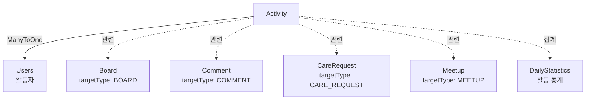

# Activity 도메인

## 개요

사용자 활동 로그 수집 도메인으로, 통계 및 분석을 위한 활동 데이터를 저장합니다.

## Entity 구조

### Activity (활동 로그)

```java
@Entity
@Table(name = "activity")
public class Activity {
    Long idx;                    // PK
    Users user;                  // 사용자 (ManyToOne)
    String activityType;         // 활동 유형
    String targetType;           // 대상 타입
    Long targetIdx;              // 대상 ID
    LocalDateTime createdAt;      // 활동 일시
}
```

**연관관계:**
- `ManyToOne` → Users (활동자)

## 활동 유형

### ActivityType
```java
// 게시판 관련
BOARD_VIEW,      // 게시글 조회
BOARD_CREATE,    // 게시글 작성
BOARD_LIKE,      // 게시글 좋아요
BOARD_COMMENT,   // 댓글 작성

// 펫케어 관련
CARE_CREATE,     // 펫케어 요청 생성
CARE_APPLY,      // 펫케어 지원
CARE_COMPLETE,   // 펫케어 완료

// 모임 관련
MEETUP_CREATE,   // 모임 생성
MEETUP_JOIN,     // 모임 참여

// 사용자 관련
LOGIN,           // 로그인
LOGOUT,          // 로그아웃
PROFILE_UPDATE,  // 프로필 수정
```

## Service 주요 기능

### ActivityService

#### 1. 활동 로그 관리
```java
// 활동 로그 생성
void logActivity(Users user, String activityType, String targetType, Long targetIdx)

// 사용자별 활동 로그 조회
List<ActivityDTO> getActivitiesByUser(long userId, int page, int size)

// 활동 유형별 통계
Map<String, Long> getActivityStatistics(long userId, LocalDate from, LocalDate to)

// 인기 활동 조회
List<ActivityDTO> getPopularActivities(int limit)
```

## 다른 도메인과의 연관관계

### Activity와 다른 도메인



### 주요 상호작용

#### 1. User 도메인
- **Users → Activity (OneToMany)**
  - Users의 모든 활동 로그 저장
  - 사용자별 활동 이력 조회
  - 사용자 활동 패턴 분석

**예시:**
```java
// 게시글 작성 시 활동 로그
@Transactional
public BoardDTO createBoard(BoardDTO dto) {
    Board board = boardRepository.save(...);
    
    // 활동 로그 기록
    activityService.logActivity(
        board.getUser(),
        "BOARD_CREATE",
        "BOARD",
        board.getIdx()
    );
    
    return converter.toDTO(board);
}
```

#### 2. Board 도메인
- **Board → Activity (간접)**
  - 게시글 조회, 작성, 좋아요, 댓글 활동 로그
  - targetType: "BOARD", targetIdx: board.idx

**예시:**
```java
// 게시글 조회 시 활동 로그
public BoardDTO getBoard(long id, Long viewerId) {
    Board board = boardRepository.findById(id).orElseThrow();
    
    if (viewerId != null) {
        Users viewer = usersRepository.findById(viewerId).orElseThrow();
        
        // 활동 로그 기록
        activityService.logActivity(
            viewer,
            "BOARD_VIEW",
            "BOARD",
            board.getIdx()
        );
    }
    
    return converter.toDTO(board);
}
```

#### 3. Care 도메인
- **CareRequest → Activity (간접)**
  - 펫케어 요청 생성, 지원, 완료 활동 로그
  - targetType: "CARE_REQUEST", targetIdx: careRequest.idx

**예시:**
```java
// 펫케어 지원 시 활동 로그
@Transactional
public CareApplicationDTO applyCareRequest(long requestId, long userId) {
    CareApplication application = applicationRepository.save(...);
    
    // 활동 로그 기록
    activityService.logActivity(
        application.getApplicant(),
        "CARE_APPLY",
        "CARE_REQUEST",
        application.getCareRequest().getIdx()
    );
    
    return converter.toDTO(application);
}
```

#### 4. Meetup 도메인
- **Meetup → Activity (간접)**
  - 모임 생성, 참여 활동 로그
  - targetType: "MEETUP", targetIdx: meetup.idx

#### 5. Statistics 도메인
- **Activity → DailyStatistics (간접)**
  - 일별 통계 수집 시 Activity 데이터 집계
  - 활성 사용자 수, 활동 유형별 통계

**예시:**
```java
// 일별 통계 수집 시 활동 로그 집계
@Scheduled(cron = "0 0 1 * * ?")
public void collectDailyStatistics() {
    LocalDate yesterday = LocalDate.now().minusDays(1);
    
    // 활성 사용자 수 (활동 로그 기준)
    Long activeUsers = activityRepository.countDistinctUsersByDate(yesterday);
    
    // 게시글 작성 수
    Long boardPosts = activityRepository.countByActivityTypeAndDate("BOARD_CREATE", yesterday);
    
    // 펫케어 요청 수
    Long careRequests = activityRepository.countByActivityTypeAndDate("CARE_CREATE", yesterday);
    
    DailyStatistics stats = DailyStatistics.builder()
        .date(yesterday)
        .activeUsers(activeUsers.intValue())
        .boardPosts(boardPosts.intValue())
        .careRequests(careRequests.intValue())
        .build();
    
    statisticsRepository.save(stats);
}
```

## 비즈니스 로직

### 활동 로그 생성 규칙

1. **중복 로그 방지**
   - 같은 활동에 대해 짧은 시간 내 중복 로그 방지
   - 예: 게시글 조회는 1시간에 1회만 기록

2. **비동기 처리**
   - 활동 로그는 비동기로 저장
   - 핵심 비즈니스 로직에 영향 없음

3. **데이터 정리**
   - 오래된 활동 로그는 주기적으로 삭제 또는 아카이빙
   - 통계 데이터는 별도 저장

## 성능 최적화

### 1. 인덱싱

```sql
-- 사용자별 활동 조회
CREATE INDEX idx_activity_user_created 
ON activity(user_idx, created_at DESC);

-- 활동 유형별 조회
CREATE INDEX idx_activity_type_created 
ON activity(activity_type, created_at DESC);

-- 통계 집계 쿼리
CREATE INDEX idx_activity_date_type 
ON activity(created_at, activity_type);
```

### 2. 비동기 처리

```java
@Async
public void logActivity(Users user, String activityType, String targetType, Long targetIdx) {
    Activity activity = Activity.builder()
        .user(user)
        .activityType(activityType)
        .targetType(targetType)
        .targetIdx(targetIdx)
        .build();
    
    activityRepository.save(activity);
}
```

### 3. 배치 삽입

```java
// 여러 활동 로그를 한 번에 저장
public void logActivitiesBatch(List<Activity> activities) {
    activityRepository.saveAll(activities);
}
```

## API 엔드포인트

### 활동 로그 (/api/activities)
- `GET /me` - 내 활동 로그 (페이징)
- `GET /me/statistics` - 내 활동 통계
- `GET /popular` - 인기 활동

## 테스트 시나리오

### 1. 활동 로그 생성
- 게시글 작성 → 활동 로그 기록
- 비동기 처리 확인

### 2. 통계 집계
- 일별 통계 수집
- 활동 유형별 집계 확인

## 개선 아이디어

### 기능
1. **실시간 대시보드**
   - 활동 현황 실시간 표시
   - WebSocket 연동

2. **활동 분석**
   - 사용자 활동 패턴 분석
   - 추천 시스템에 활용

### 성능
1. **시계열 DB**
   - InfluxDB, TimescaleDB 활용
   - 대량 활동 로그 처리

2. **이벤트 스트리밍**
   - Kafka 활용
   - 실시간 활동 로그 처리

