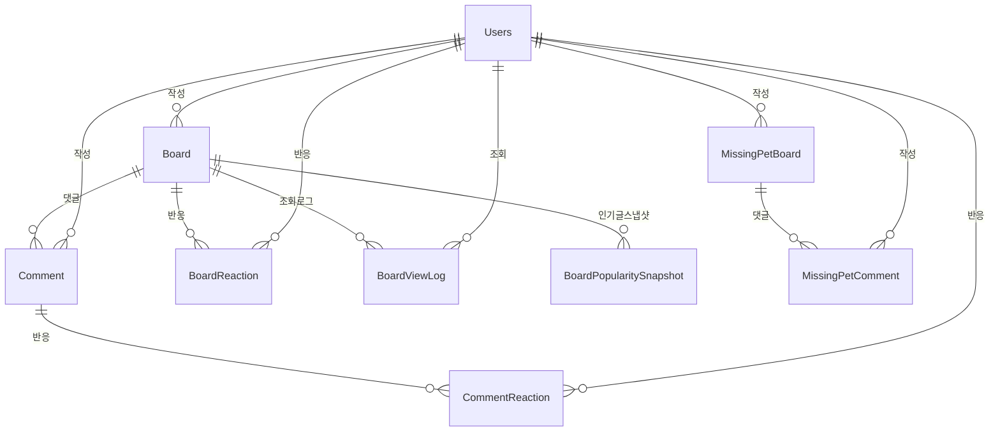

# Board 도메인 - 포트폴리오 상세 설명

## 1. 기능 설명

### 1.1 도메인 개요
- **역할**: 커뮤니티 게시판 시스템의 핵심 도메인으로, 게시글 작성/조회, 댓글, 좋아요/싫어요 반응, 인기글 관리 등을 담당합니다.
- **주요 기능**: 
  - 게시글 CRUD (생성, 조회, 수정, 삭제)
  - 카테고리별 게시글 필터링
  - 댓글 시스템
  - 좋아요/싫어요 반응 시스템
  - 조회수 관리 (중복 방지)
  - 인기글 스냅샷 (주간/월간)
  - 게시글 검색 (제목, 내용, 작성자)

### 1.2 기능 시연
> **스크린샷/영상 링크**: [기능 작동 영상 또는 스크린샷 추가]
> 
> 각 주요 기능별로 작동 모습을 보여주는 시각적 자료를 포함합니다.

#### 주요 기능 1: 게시글 작성 및 조회
- **설명**: 사용자가 게시글을 작성하고, 카테고리별로 필터링하여 조회할 수 있습니다.
- **사용자 시나리오**: 
  1. 사용자가 게시글 작성 (제목, 내용, 카테고리 선택)
  2. 이미지 첨부 가능
  3. 카테고리별 필터링 (자유, 정보, 질문, 자랑 등)
  4. 페이징 지원 (기본 20개씩)
- **스크린샷/영상**: 

#### 주요 기능 2: 댓글 및 반응 시스템
- **설명**: 게시글에 댓글을 작성하고, 좋아요/싫어요를 누를 수 있습니다.
- **사용자 시나리오**:
  1. 게시글 상세 조회 시 댓글 목록 표시
  2. 댓글 작성 시 게시글 작성자에게 알림 발송
  3. 좋아요/싫어요 클릭 시 실시간 카운트 업데이트
  4. 같은 반응 재클릭 시 취소 (토글)
- **스크린샷/영상**: 

#### 주요 기능 3: 인기글 시스템
- **설명**: 주간/월간 인기글을 미리 계산하여 스냅샷으로 저장하고 빠르게 조회합니다.
- **사용자 시나리오**:
  1. 매일 18:30에 주간 인기글 스냅샷 자동 생성
  2. 매주 월요일 18:30에 월간 인기글 스냅샷 자동 생성
  3. 인기도 점수 = (좋아요 × 3) + (댓글 × 2) + 조회수
  4. "자랑" 카테고리 게시글만 대상으로 상위 30개 게시글 스냅샷 저장
  5. 스냅샷 조회 시 다단계 전략 사용 (정확한 날짜 매칭 → 겹치는 기간 → 최근 스냅샷 → 생성)
- **스크린샷/영상**: 

---

## 2. 서비스 로직 설명

### 2.1 핵심 비즈니스 로직

#### 로직 1: 게시글 목록 조회 (N+1 문제 해결)
```java
// BoardService.java
private List<BoardDTO> mapBoardsWithReactionsBatch(List<Board> boards) {
    // 1. 게시글 ID 목록 추출
    List<Long> boardIds = boards.stream()
        .map(Board::getIdx)
        .collect(Collectors.toList());
    
    // 2. 좋아요/싫어요 카운트 배치 조회 (500개 단위)
    Map<Long, Map<ReactionType, Long>> reactionCountsMap = 
        getReactionCountsBatch(boardIds);
    
    // 3. 첨부파일 배치 조회
    Map<Long, List<FileDTO>> attachmentsMap = 
        attachmentFileService.getAttachmentsBatch(FileTargetType.BOARD, boardIds);
    
    // 4. DTO 변환 및 반응 정보 매핑
    return boards.stream()
        .map(board -> {
            BoardDTO dto = boardConverter.toDTO(board);
            Map<ReactionType, Long> counts = reactionCountsMap.getOrDefault(
                board.getIdx(), new HashMap<>());
            dto.setLikes(Math.toIntExact(counts.getOrDefault(ReactionType.LIKE, 0L)));
            dto.setDislikes(Math.toIntExact(counts.getOrDefault(ReactionType.DISLIKE, 0L)));
            dto.setAttachments(attachmentsMap.getOrDefault(board.getIdx(), new ArrayList<>()));
            return dto;
        })
        .collect(Collectors.toList());
}

// 배치 조회 구현 (500개 단위로 분할)
private Map<Long, Map<ReactionType, Long>> getReactionCountsBatch(List<Long> boardIds) {
    final int BATCH_SIZE = 500;
    Map<Long, Map<ReactionType, Long>> countsMap = new HashMap<>();
    
    // boardIds를 배치 단위로 나누어 처리
    for (int i = 0; i < boardIds.size(); i += BATCH_SIZE) {
        int end = Math.min(i + BATCH_SIZE, boardIds.size());
        List<Long> batch = boardIds.subList(i, end);
        
        // 배치 단위로 쿼리 실행
        List<Object[]> results = boardReactionRepository.countByBoardsGroupByReactionType(batch);
        
        // 결과를 Map으로 변환
        for (Object[] result : results) {
            Long boardId = ((Number) result[0]).longValue();
            ReactionType reactionType = (ReactionType) result[1];
            Long count = ((Number) result[2]).longValue();
            
            countsMap.computeIfAbsent(boardId, k -> new HashMap<>())
                .put(reactionType, count);
        }
    }
    
    return countsMap;
}
```

**설명**:
- **문제**: 게시글 목록 조회 시 각 게시글의 좋아요/싫어요 수를 개별 쿼리로 조회하면 N+1 문제 발생
- **해결**: 배치 조회로 한 번에 모든 게시글의 반응 수를 조회
- **배치 처리**: IN 절 크기 제한을 고려하여 500개 단위로 분할하여 처리
- **구현 위치**: `BoardService.getReactionCountsBatch()` 메서드

#### 로직 2: 조회수 중복 방지
```java
// BoardService.java
private boolean shouldIncrementView(Board board, Long viewerId) {
    if (viewerId == null) {
        return true; // 비로그인 사용자는 항상 조회수 증가
    }
    
    Users viewer = usersRepository.findById(viewerId).orElse(null);
    if (viewer == null) {
        return true;
    }
    
    // BoardViewLog 테이블에 기록이 있는지 확인
    boolean alreadyViewed = boardViewLogRepository.existsByBoardAndUser(board, viewer);
    if (alreadyViewed) {
        return false; // 이미 조회한 경우 조회수 증가 안 함
    }
    
    // 기록 추가
    BoardViewLog log = BoardViewLog.builder()
        .board(board)
        .user(viewer)
        .build();
    boardViewLogRepository.save(log);
    return true;
}
```

**설명**:
- **문제**: 같은 사용자가 새로고침할 때마다 조회수 증가
- **해결**: BoardViewLog 테이블에 사용자별 조회 기록 저장하여 중복 방지
- **효과**: 정확한 조회 수 추적, 중복 조회 방지

#### 로직 3: 반응 토글 시스템
```java
// ReactionService.java
public ReactionSummaryDTO reactToBoard(Long boardId, Long userId, ReactionType reactionType) {
    Board board = boardRepository.findById(boardId).orElseThrow();
    Users user = usersRepository.findById(userId).orElseThrow();
    
    Optional<BoardReaction> existing = boardReactionRepository.findByBoardAndUser(board, user);
    ReactionType previousReactionType = null;
    
    if (existing.isPresent() && existing.get().getReactionType() == reactionType) {
        // 같은 반응을 다시 클릭하면 삭제 (토글)
        previousReactionType = existing.get().getReactionType();
        boardReactionRepository.delete(existing.get());
        // 삭제 시에는 lastReactionAt을 업데이트하지 않음 (마지막 반응 시간 유지)
    } else if (existing.isPresent()) {
        // 반응 타입 변경 (예: 좋아요 → 싫어요)
        previousReactionType = existing.get().getReactionType();
        existing.get().setReactionType(reactionType);
        boardReactionRepository.save(existing.get());
        // 반응이 변경되었으므로 lastReactionAt 업데이트
        board.setLastReactionAt(LocalDateTime.now());
    } else {
        // 새로운 반응 추가
        BoardReaction reaction = BoardReaction.builder()
            .board(board)
            .user(user)
            .reactionType(reactionType)
            .build();
        boardReactionRepository.save(reaction);
        // 반응이 추가되었으므로 lastReactionAt 업데이트
        board.setLastReactionAt(LocalDateTime.now());
    }
    
    // likeCount 실시간 업데이트
    updateBoardLikeCount(board, previousReactionType, reactionType);
    boardRepository.save(board);
    
    return buildBoardSummary(board, user);
}
```

**설명**:
- **처리 흐름**: 
  1. 기존 반응 확인
  2. 같은 반응이면 삭제 (토글) - lastReactionAt 업데이트 안 함
  3. 다른 반응이면 타입 변경 - lastReactionAt 업데이트
  4. 없으면 새로 추가 - lastReactionAt 업데이트
- **주요 판단 기준**: Unique 제약조건 (board_idx, user_idx)으로 중복 방지
- **실시간 업데이트**: likeCount 필드를 실시간으로 업데이트하여 조회 성능 향상
- **lastReactionAt 관리**: 반응 추가/변경 시에만 업데이트, 삭제 시에는 유지

#### 로직 4: 댓글 작성 시 알림 발송
```java
// CommentService.java
@Transactional
public CommentDTO addComment(Long boardId, CommentDTO dto) {
    Board board = boardRepository.findById(boardId).orElseThrow();
    Users user = usersRepository.findById(dto.getUserId()).orElseThrow();
    
    Comment comment = Comment.builder()
        .board(board)
        .user(user)
        .content(dto.getContent())
        .build();
    
    Comment saved = commentRepository.save(comment);
    
    // commentCount 실시간 업데이트
    incrementBoardCommentCount(board);
    boardRepository.save(board);
    
    // 댓글 파일 첨부 처리
    if (dto.getCommentFilePath() != null) {
        attachmentFileService.syncSingleAttachment(
            FileTargetType.COMMENT, saved.getIdx(), dto.getCommentFilePath(), null);
    }
    
    // 알림 발송: 댓글 작성자가 게시글 작성자가 아닌 경우에만
    Long boardOwnerId = board.getUser().getIdx();
    if (!boardOwnerId.equals(user.getIdx())) {
        notificationService.createNotification(
            boardOwnerId,
            NotificationType.BOARD_COMMENT,
            "내 게시글에 새로운 댓글이 달렸습니다",
            String.format("%s님이 댓글을 남겼습니다: %s", 
                user.getUsername(),
                dto.getContent().length() > 50 ? dto.getContent().substring(0, 50) + "..." 
                    : dto.getContent()),
            board.getIdx(),
            "BOARD");
    }
    
    return mapWithReactionCounts(saved);
}
```

**설명**:
- **처리 흐름**: 댓글 저장 → commentCount 증가 → 파일 첨부 처리 → 알림 발송 (조건부)
- **주요 판단 기준**: 댓글 작성자와 게시글 작성자가 다른 경우에만 알림 발송
- **특징**: 댓글에도 이미지 첨부 가능

#### 로직 5: 게시글/댓글 수정/삭제 시 이메일 인증 체크
```java
// BoardService.java
@Transactional
public BoardDTO updateBoard(long idx, BoardDTO dto) {
    Board board = boardRepository.findById(idx).orElseThrow();
    
    // 이메일 인증 확인
    Users user = board.getUser();
    if (user.getEmailVerified() == null || !user.getEmailVerified()) {
        throw new EmailVerificationRequiredException("게시글 수정을 위해 이메일 인증이 필요합니다.");
    }
    
    // 게시글 수정 로직...
}

@Transactional
public void deleteBoard(long idx) {
    Board board = boardRepository.findById(idx).orElseThrow();
    
    // 이메일 인증 확인
    Users user = board.getUser();
    if (user.getEmailVerified() == null || !user.getEmailVerified()) {
        throw new EmailVerificationRequiredException("게시글 삭제를 위해 이메일 인증이 필요합니다.");
    }
    
    // 게시글 소프트 삭제
    board.setStatus(ContentStatus.DELETED);
    board.setIsDeleted(true);
    board.setDeletedAt(LocalDateTime.now());
    
    // 연관된 댓글도 소프트 삭제
    if (board.getComments() != null) {
        board.getComments().forEach(c -> {
            c.setStatus(ContentStatus.DELETED);
            c.setIsDeleted(true);
            c.setDeletedAt(LocalDateTime.now());
        });
    }
    boardRepository.saveAndFlush(board);
}
```

**설명**:
- **처리 흐름**: 이메일 인증 확인 → 수정/삭제 처리
- **주요 판단 기준**: `emailVerified` 필드 확인
- **특징**: 
  - 게시글 삭제 시 연관된 댓글도 소프트 삭제
  - 이메일 인증이 필요한 이유: 책임 있는 행동 (수정/삭제)을 위해

#### 로직 6: 댓글 수정/삭제/복구
```java
// CommentService.java
@Transactional
public CommentDTO updateComment(Long boardId, Long commentId, CommentDTO dto) {
    Comment comment = commentRepository.findById(commentId).orElseThrow();
    
    // 이메일 인증 확인
    Users user = comment.getUser();
    if (user.getEmailVerified() == null || !user.getEmailVerified()) {
        throw new EmailVerificationRequiredException("댓글 수정을 위해 이메일 인증이 필요합니다.");
    }
    
    // 댓글 내용 업데이트
    if (dto.getContent() != null) {
        comment.setContent(dto.getContent());
    }
    
    // 첨부파일 업데이트
    if (dto.getCommentFilePath() != null) {
        attachmentFileService.syncSingleAttachment(
            FileTargetType.COMMENT, comment.getIdx(), dto.getCommentFilePath(), null);
    }
    
    return mapWithReactionCounts(commentRepository.save(comment));
}

@Transactional
public void deleteComment(Long boardId, Long commentId) {
    Comment comment = commentRepository.findById(commentId).orElseThrow();
    
    // 이메일 인증 확인
    Users user = comment.getUser();
    if (user.getEmailVerified() == null || !user.getEmailVerified()) {
        throw new EmailVerificationRequiredException("댓글 삭제를 위해 이메일 인증이 필요합니다.");
    }
    
    // 소프트 삭제
    comment.setStatus(ContentStatus.DELETED);
    comment.setIsDeleted(true);
    comment.setDeletedAt(LocalDateTime.now());
    commentRepository.save(comment);
    
    // commentCount 실시간 업데이트 (삭제된 댓글은 카운트에서 제외)
    decrementBoardCommentCount(board);
    boardRepository.save(board);
}

@Transactional
public CommentDTO restoreComment(Long boardId, Long commentId) {
    Comment comment = commentRepository.findById(commentId).orElseThrow();
    
    // 댓글 복구
    comment.setIsDeleted(false);
    comment.setDeletedAt(null);
    if (comment.getStatus() == ContentStatus.DELETED) {
        comment.setStatus(ContentStatus.ACTIVE);
    }
    Comment saved = commentRepository.save(comment);
    
    // commentCount 실시간 업데이트 (복구된 댓글은 카운트에 포함)
    incrementBoardCommentCount(board);
    boardRepository.save(board);
    
    return mapWithReactionCounts(saved);
}
```

**설명**:
- **처리 흐름**: 이메일 인증 확인 → 수정/삭제/복구 처리 → commentCount 업데이트
- **주요 판단 기준**: `emailVerified` 필드 확인
- **특징**: 
  - 댓글 수정/삭제 시 이메일 인증 필수
  - 댓글 복구 기능 제공 (관리자용)
  - 삭제/복구 시 commentCount 실시간 업데이트

### 2.2 서비스 메서드 구조

#### BoardService
| 메서드 | 설명 | 주요 로직 |
|--------|------|-----------|
| `getAllBoards()` | 게시글 목록 조회 | 배치 조회로 N+1 문제 해결 |
| `getAllBoardsWithPaging()` | 게시글 목록 조회 (페이징) | 배치 조회로 N+1 문제 해결 |
| `getAdminBoardsWithPaging()` | 게시글 목록 조회 (관리자용) | 작성자 상태 체크 없이 조회, 필터링 지원 |
| `getBoard()` | 게시글 상세 조회 | 조회수 증가 (중복 방지), 캐싱 |
| `getMyBoards()` | 내 게시글 조회 | 사용자별 게시글 조회 |
| `createBoard()` | 게시글 생성 | 파일 첨부 처리, 캐시 무효화 |
| `updateBoard()` | 게시글 수정 | 이메일 인증 확인, 파일 동기화, 캐시 무효화 |
| `deleteBoard()` | 게시글 삭제 (소프트 삭제) | 이메일 인증 확인, 연관 댓글도 소프트 삭제 |
| `restoreBoard()` | 게시글 복구 | 소프트 삭제 해제, 상태 복구 |
| `updateBoardStatus()` | 게시글 상태 변경 | 관리자용 상태 변경 (BLINDED, ACTIVE 등) |
| `searchBoardsWithPaging()` | 게시글 검색 | 제목/내용/작성자 ID 검색, 페이징 지원 |

#### ReactionService
| 메서드 | 설명 | 주요 로직 |
|--------|------|-----------|
| `reactToBoard()` | 게시글 반응 (좋아요/싫어요) | 토글 처리, 실시간 카운트 업데이트 |
| `reactToComment()` | 댓글 반응 | 토글 처리 |
| `getBoardSummary()` | 반응 요약 조회 | 좋아요/싫어요 수, 사용자 반응 여부 |

#### CommentService
| 메서드 | 설명 | 주요 로직 |
|--------|------|-----------|
| `getComments()` | 댓글 목록 조회 | 반응 수 포함 |
| `getCommentsForAdmin()` | 댓글 목록 조회 (관리자용) | 작성자 상태 체크 없이 조회 |
| `addComment()` | 댓글 작성 | commentCount 증가, 파일 첨부, 알림 발송 |
| `updateComment()` | 댓글 수정 | 이메일 인증 확인, 내용/파일 업데이트 |
| `deleteComment()` | 댓글 삭제 | 이메일 인증 확인, 소프트 삭제, commentCount 감소 |
| `restoreComment()` | 댓글 복구 | 소프트 삭제 해제, commentCount 증가 |
| `updateCommentStatus()` | 댓글 상태 변경 | 관리자용 상태 변경 |

#### BoardPopularityService
| 메서드 | 설명 | 주요 로직 |
|--------|------|-----------|
| `getPopularBoards()` | 인기글 조회 | 스냅샷 조회 전략 (정확한 날짜 매칭 → 겹치는 기간 → 최근 스냅샷 → 생성) |
| `generateSnapshots()` | 인기글 스냅샷 생성 | 배치 조회로 실시간 집계 (1000개 단위), 상위 30개 저장 |

### 2.3 트랜잭션 처리
- **트랜잭션 범위**: 
  - 게시글 생성/수정/삭제: `@Transactional`
  - 반응 추가/변경: `@Transactional`
  - 댓글 작성/삭제: `@Transactional`
  - 조회 메서드: `@Transactional(readOnly = true)`
- **격리 수준**: 기본값 (READ_COMMITTED)
- **롤백 조건**: 예외 발생 시 자동 롤백

### 2.4 예외 처리
- **처리하는 예외**: 
  - `IllegalArgumentException`: 잘못된 파라미터
  - `RuntimeException`: 엔티티를 찾을 수 없는 경우
  - `EmailVerificationRequiredException`: 이메일 인증이 필요한 경우 (게시글/댓글 수정/삭제)
- **예외 처리 전략**: 
  - Service 레이어에서 예외 발생 시 Controller로 전파
  - GlobalExceptionHandler에서 통합 처리
- **이메일 인증 필수 작업**:
  - 게시글 수정/삭제
  - 댓글 수정/삭제
  - 실종 제보 작성/수정/삭제

---

## 3. 아키텍처 설명

### 3.1 도메인 구조
```
domain/board/
  ├── controller/
  │   ├── BoardController.java          # 게시글 API
  │   └── AdminBoardController.java     # 관리자 게시글 API
  ├── service/
  │   ├── BoardService.java             # 게시글 비즈니스 로직
  │   ├── CommentService.java           # 댓글 비즈니스 로직
  │   ├── ReactionService.java          # 반응 비즈니스 로직
  │   ├── BoardPopularityService.java   # 인기글 비즈니스 로직
  │   └── BoardPopularityScheduler.java # 인기글 스케줄러
  ├── repository/
  │   ├── BoardRepository.java
  │   ├── CommentRepository.java
  │   ├── BoardReactionRepository.java
  │   ├── CommentReactionRepository.java
  │   ├── BoardViewLogRepository.java
  │   └── BoardPopularitySnapshotRepository.java
  ├── entity/
  │   ├── Board.java
  │   ├── Comment.java
  │   ├── BoardReaction.java
  │   ├── CommentReaction.java
  │   ├── BoardViewLog.java
  │   └── BoardPopularitySnapshot.java
  ├── dto/
  │   ├── BoardDTO.java
  │   ├── BoardPageResponseDTO.java
  │   ├── CommentDTO.java
  │   └── ReactionSummaryDTO.java
  └── converter/
      ├── BoardConverter.java
      └── CommentConverter.java
```

### 3.2 엔티티 구조

#### Board (게시글)
```java
@Entity
@Table(name = "board")
public class Board {
    private Long idx;
    private Users user;                    // 작성자
    private String title;                  // 제목
    private String content;                // 내용
    private String category;               // 카테고리
    private ContentStatus status;          // 상태 (ACTIVE, HIDDEN, DELETED)
    private Integer viewCount;             // 조회수
    private Integer likeCount;             // 좋아요 수 (실시간 업데이트)
    private Integer commentCount;          // 댓글 수 (실시간 업데이트)
    private LocalDateTime lastReactionAt;  // 마지막 반응 시간
    private LocalDateTime createdAt;
    private LocalDateTime updatedAt;
    private Boolean isDeleted;
    private LocalDateTime deletedAt;
    private List<Comment> comments;        // 연관된 댓글 목록
}
```

#### Comment (댓글)
```java
@Entity
@Table(name = "comment")
public class Comment {
    private Long idx;
    private Board board;                   // 게시글
    private Users user;                    // 작성자
    private String content;                // 내용
    private ContentStatus status;          // 상태 (ACTIVE, HIDDEN, DELETED)
    private LocalDateTime createdAt;
    private Boolean isDeleted;
    private LocalDateTime deletedAt;
}
```

#### BoardReaction (게시글 반응)
```java
@Entity
@Table(name = "board_reaction", 
       uniqueConstraints = @UniqueConstraint(columnNames = {"board_idx", "user_idx"}))
public class BoardReaction {
    private Long idx;
    private Board board;                   // 게시글
    private Users user;                    // 사용자
    private ReactionType reactionType;     // 반응 타입 (LIKE, DISLIKE)
    private LocalDateTime createdAt;
}
```

#### BoardViewLog (조회 로그)
```java
@Entity
@Table(name = "board_view_log",
       uniqueConstraints = @UniqueConstraint(columnNames = {"board_id", "user_id"}))
public class BoardViewLog {
    private Long id;
    private Board board;                   // 게시글
    private Users user;                    // 조회자
    private LocalDateTime viewedAt;        // 조회 시간
}
```

#### BoardPopularitySnapshot (인기글 스냅샷)
```java
@Entity
@Table(name = "board_popularity_snapshot")
public class BoardPopularitySnapshot {
    private Long snapshotId;
    private Board board;                    // 게시글
    private PopularityPeriodType periodType; // 기간 타입 (WEEKLY, MONTHLY)
    private LocalDate periodStartDate;      // 기간 시작일
    private LocalDate periodEndDate;       // 기간 종료일
    private Integer ranking;                // 순위
    private Integer popularityScore;        // 인기도 점수
    private Integer likeCount;              // 좋아요 수
    private Integer commentCount;           // 댓글 수
    private Integer viewCount;              // 조회수
    private LocalDateTime createdAt;
}
```

#### MissingPetBoard (실종 동물 게시글)
```java
@Entity
@Table(name = "MissingPetBoard")
public class MissingPetBoard {
    private Long idx;
    private Users user;                    // 작성자
    private String title;                  // 제목
    private String content;                // 내용
    private String petName;                // 반려동물 이름
    private String species;                // 종류
    private String breed;                  // 품종
    private MissingPetGender gender;       // 성별
    private String age;                    // 나이
    private String color;                   // 색상
    private LocalDate lostDate;            // 실종일
    private String lostLocation;            // 실종 위치
    private BigDecimal latitude;            // 위도
    private BigDecimal longitude;           // 경도
    private MissingPetStatus status;        // 상태 (MISSING, FOUND)
    private LocalDateTime createdAt;
    private Boolean isDeleted;
    private List<MissingPetComment> comments;
}
```

#### MissingPetComment (실종 동물 댓글)
```java
@Entity
@Table(name = "MissingPetComment")
public class MissingPetComment {
    private Long idx;
    private MissingPetBoard board;         // 실종 동물 게시글
    private Users user;                    // 작성자
    private String content;                // 내용
    private String address;                 // 목격 위치 주소
    private Double latitude;                // 목격 위치 위도
    private Double longitude;               // 목격 위치 경도
    private LocalDateTime createdAt;
    private Boolean isDeleted;
}
```

### 3.3 엔티티 관계도 (ERD)


### 3.4 API 설계
| 엔드포인트 | Method | 설명 | 요청/응답 |
|-----------|--------|------|----------|
| `/api/boards` | GET | 게시글 목록 (페이징) | `category`, `page`, `size` → `BoardPageResponseDTO` |
| `/api/boards/{id}` | GET | 게시글 상세 | `viewerId` → `BoardDTO` |
| `/api/boards` | POST | 게시글 작성 | `BoardDTO` → `BoardDTO` |
| `/api/boards/{id}` | PUT | 게시글 수정 | `BoardDTO` → `BoardDTO` |
| `/api/boards/{id}` | DELETE | 게시글 삭제 | - → `204 No Content` |
| `/api/boards/search` | GET | 게시글 검색 | `keyword`, `searchType`, `page`, `size` → `BoardPageResponseDTO` |
| `/api/boards/popular` | GET | 인기글 조회 | `period` (WEEKLY/MONTHLY) → `List<BoardPopularitySnapshotDTO>` |
| `/api/boards/my-posts` | GET | 내 게시글 조회 | `userId` → `List<BoardDTO>` |
| `/api/boards/{boardId}/comments` | GET | 댓글 목록 | - → `List<CommentDTO>` |
| `/api/boards/{boardId}/comments` | POST | 댓글 작성 | `CommentDTO` → `CommentDTO` |
| `/api/boards/{boardId}/comments/{commentId}` | PUT | 댓글 수정 | `CommentDTO` → `CommentDTO` |
| `/api/boards/{boardId}/comments/{commentId}` | DELETE | 댓글 삭제 | - → `204 No Content` |
| `/api/boards/{boardId}/reactions` | POST | 게시글 반응 | `ReactionRequest` → `ReactionSummaryDTO` |
| `/api/boards/{boardId}/comments/{commentId}/reactions` | POST | 댓글 반응 | `ReactionRequest` → `ReactionSummaryDTO` |

### 관리자 (Admin)
| 엔드포인트 | Method | 설명 | 요청/응답 |
|-----------|--------|------|----------|
| `/api/admin/boards` | GET | 게시글 목록 조회 (필터링) | `status`, `deleted`, `category`, `q` → `List<BoardDTO>` |
| `/api/admin/boards/paging` | GET | 게시글 목록 조회 (페이징) | `status`, `deleted`, `category`, `q`, `page`, `size` → `BoardPageResponseDTO` |
| `/api/admin/boards/{id}/blind` | PATCH | 게시글 블라인드 처리 | - → `BoardDTO` |
| `/api/admin/boards/{id}/unblind` | PATCH | 게시글 블라인드 해제 | - → `BoardDTO` |
| `/api/admin/boards/{id}/delete` | POST | 게시글 삭제 | - → `204 No Content` |
| `/api/admin/boards/{id}/restore` | POST | 게시글 복구 | - → `BoardDTO` |
| `/api/admin/boards/{boardId}/comments` | GET | 댓글 목록 조회 (관리자용) | `status`, `deleted` → `List<CommentDTO>` |
| `/api/admin/boards/{boardId}/comments/{commentId}/blind` | PATCH | 댓글 블라인드 처리 | - → `CommentDTO` |
| `/api/admin/boards/{boardId}/comments/{commentId}/unblind` | PATCH | 댓글 블라인드 해제 | - → `CommentDTO` |
| `/api/admin/boards/{boardId}/comments/{commentId}/delete` | POST | 댓글 삭제 | - → `204 No Content` |
| `/api/admin/boards/{boardId}/comments/{commentId}/restore` | POST | 댓글 복구 | - → `CommentDTO` |

### 3.5 다른 도메인과의 연관관계
- **User 도메인**: 
  - Users가 게시글/댓글 작성
  - Users가 반응 추가
  - Users가 게시글 조회 (BoardViewLog)
  - 게시글/댓글 수정/삭제 시 이메일 인증 확인 (`emailVerified` 필드)
- **File 도메인**: 
  - 게시글에 이미지 첨부 (AttachmentFile, targetType: BOARD)
  - 댓글에 이미지 첨부 (targetType: COMMENT)
- **Notification 도메인**: 
  - 댓글 작성 시 게시글 작성자에게 알림
  - 반응 추가 시 알림 (선택적)
- **Report 도메인**: 
  - 게시글/댓글 신고
  - 신고 처리 결과로 상태 변경 (HIDDEN, DELETED)

### 3.6 데이터 흐름
```
[사용자 요청] 
  → [BoardController] 
  → [BoardService] 
  → [BoardRepository] 
  → [Database]
  → [BoardConverter] (Entity → DTO)
  → [응답 반환]
```

---

## 4. 트러블슈팅

### 4.1 N+1 문제 해결
**문제**: 게시글 목록 조회 시 각 게시글의 좋아요/싫어요 수를 개별 쿼리로 조회하면 N+1 문제 발생
**해결**: 배치 조회로 한 번에 모든 게시글의 반응 수를 조회
**효과**: 1000개 게시글 조회 시 2001개 쿼리 → 3개 쿼리로 감소 (99.8% 개선)

### 4.2 조회수 중복 방지
**문제**: 같은 사용자가 새로고침할 때마다 조회수 증가
**해결**: BoardViewLog 테이블에 사용자별 조회 기록 저장하여 중복 방지
**효과**: 정확한 조회 수 추적, 중복 조회 방지

### 4.3 반응 중복 방지
**문제**: 동시에 같은 사용자가 좋아요/싫어요를 여러 번 클릭 시 중복 저장 가능
**해결**: Unique 제약조건 (`board_idx`, `user_idx`) + 예외 처리
**효과**: 동시 클릭 시에도 하나의 반응만 저장

### 4.4 인기글 스냅샷 조회 전략
**문제**: 스냅샷이 정확한 날짜로 매칭되지 않을 수 있음
**해결**: 다단계 조회 전략 사용
1. 정확한 날짜 매칭으로 조회 시도
2. 기간이 겹치는 스냅샷 조회 시도
3. 가장 최근 스냅샷 조회 시도
4. 모든 시도 실패 시 새로 생성
**효과**: 다양한 상황에서도 인기글을 안정적으로 제공

### 4.5 인기글 스냅샷 생성 시 동시성 문제
**문제**: 실시간 집계 시 동시성 문제로 인한 부정확한 카운트
**해결**: 배치 조회로 실시간 집계 (1000개 단위로 분할)
**효과**: 동시성 문제 없이 정확한 인기도 점수 계산

### 4.6 인기글 스냅샷 생성 대상 카테고리
**대상**: "자랑" 카테고리 게시글만 인기글 스냅샷 생성
**레거시 호환**: "자랑" 카테고리로 조회 실패 시 "PRIDE" 카테고리로 재조회 시도
**이유**: 특정 카테고리(자랑)의 인기글만 집계하여 성능 최적화 및 의미 있는 인기글 제공

---

## 5. 성능 최적화

### 5.1 DB 최적화

#### 인덱스 전략
```sql
-- 카테고리별 조회
CREATE INDEX idx_board_category_deleted ON board(category, is_deleted, created_at DESC);

-- 사용자별 게시글
CREATE INDEX idx_board_user_deleted ON board(user_idx, is_deleted, created_at DESC);

-- 검색 (Full-Text Search)
CREATE FULLTEXT INDEX idx_board_search ON board(title, content);

-- 반응 조회
CREATE INDEX idx_reaction_board_type ON board_reaction(board_idx, reaction_type);

-- 조회 로그 (중복 방지)
CREATE UNIQUE INDEX idx_view_log_board_user ON board_view_log(board_idx, user_idx);

-- 인기글 스냅샷 조회
CREATE INDEX idx_snapshot_period ON board_popularity_snapshot(period_type, period_start_date, period_end_date, ranking);
```

**선정 이유**:
- 자주 조회되는 컬럼 조합 (category, is_deleted, created_at)
- WHERE 절에서 자주 사용되는 조건
- JOIN에 사용되는 외래키 (user_idx, board_idx)
- FULLTEXT 인덱스로 검색 성능 향상

#### 쿼리 최적화
```sql
-- Before: 비효율적인 쿼리 (N+1)
SELECT * FROM board WHERE is_deleted = false;
-- 각 게시글마다 개별 쿼리
SELECT COUNT(*) FROM board_reaction WHERE board_idx = ? AND reaction_type = 'LIKE';

-- After: 최적화된 쿼리 (배치 조회)
SELECT * FROM board WHERE is_deleted = false ORDER BY created_at DESC LIMIT 20;
SELECT board_idx, reaction_type, COUNT(*) 
FROM board_reaction 
WHERE board_idx IN (?, ?, ..., ?) 
GROUP BY board_idx, reaction_type;
```

**개선 포인트**:
- 배치 조회로 N+1 문제 해결
- IN 절 사용으로 여러 게시글의 반응 수를 한 번에 조회
- GROUP BY로 집계 성능 향상

#### N+1 문제 해결
**문제**:
```java
// N+1 발생 코드
List<Board> boards = boardRepository.findAll();
for (Board board : boards) {
    long likeCount = boardReactionRepository.countByBoardAndReactionType(board, ReactionType.LIKE);
    // 각 게시글마다 개별 쿼리 발생
}
```

**해결**:
```java
// 배치 조회 또는 Fetch Join 사용
List<Long> boardIds = boards.stream().map(Board::getIdx).collect(Collectors.toList());
Map<Long, Map<ReactionType, Long>> reactionCountsMap = getReactionCountsBatch(boardIds);
```

**효과**:
- Before: N+1 쿼리 (예: 1001개)
- After: 1~2 쿼리

#### 트랜잭션 최적화
- **트랜잭션 범위 최소화**: 조회 메서드는 `@Transactional(readOnly = true)` 사용
- **읽기 전용 트랜잭션 활용**: 조회 성능 향상
- **배치 처리**: 인기글 스냅샷 생성 시 배치 단위로 처리

### 5.2 애플리케이션 레벨 최적화

#### 캐싱 전략
```java
// 게시글 상세 캐싱
@Cacheable(value = "boardDetail", key = "#idx")
public BoardDTO getBoard(long idx, Long viewerId) {
    // ...
}

// 캐시 무효화
@Caching(evict = {
    @CacheEvict(value = "boardDetail", key = "#idx"),
    @CacheEvict(value = "boardList", allEntries = true)
})
public BoardDTO updateBoard(long idx, BoardDTO dto) {
    // ...
}
```

**캐시 적용 대상**:
- 게시글 상세: 조회 빈도 높음
- 인기글 목록: 계산 비용 높음 (스냅샷으로 대체)

**캐시 무효화 전략**:
- 게시글 수정/삭제 시 상세 캐시 무효화
- 게시글 생성/수정/삭제 시 목록 캐시 무효화

#### 비동기 처리
```java
// 인기글 스냅샷 생성 (스케줄러)
@Scheduled(cron = "0 30 18 * * ?") // 매일 18:30
public void generateWeeklyPopularitySnapshots() {
    generateSnapshots(PopularityPeriodType.WEEKLY);
}
```

**적용 사례**:
- 인기글 스냅샷 생성: 스케줄러로 자동 실행
- 알림 발송: 댓글 작성 시 비동기 처리

**효과**:
- 사용자 요청 응답 시간 감소
- 서버 부하 분산

#### 배치 처리
```java
// 대량 데이터 처리 시 배치 단위로 분할
final int BATCH_SIZE = 500; // 반응 수 조회용
for (int i = 0; i < boardIds.size(); i += BATCH_SIZE) {
    int end = Math.min(i + BATCH_SIZE, boardIds.size());
    List<Long> batch = boardIds.subList(i, end);
    // 배치 처리
}
```

**배치 처리 구현**:
- **반응 수 배치 조회**: `BoardService.getReactionCountsBatch()` 메서드 (479-507줄)
  - 500개 단위로 분할하여 IN 절 크기 제한 고려
  - `boardReactionRepository.countByBoardsGroupByReactionType()` 사용
- **인기글 스냅샷 생성**: `BoardPopularityService`의 배치 조회 메서드들
  - `getLikeCountsBatch()` : 1000개 단위로 좋아요 수 배치 조회
  - `getCommentCountsBatch()` : 1000개 단위로 댓글 수 배치 조회
  - `getViewCountsBatch()` : 1000개 단위로 조회수 배치 조회

### 5.3 성능 최적화 효과

#### N+1 문제 해결
- **Before**: 게시글 목록 조회 시 각 게시글마다 반응 수를 개별 쿼리로 조회 (N+1 문제)
- **After**: 배치 조회로 한 번에 모든 게시글의 반응 수를 조회
- **효과**: 쿼리 수 대폭 감소, 조회 성능 향상

#### 인기글 스냅샷
- **Before**: 매번 실시간 집계 (모든 게시글의 좋아요/댓글/조회수 집계)
- **After**: 미리 계산된 스냅샷 조회
- **효과**: 조회 성능 향상, DB 부하 감소

---

## 6. 핵심 포인트 요약

### 기술적 하이라이트
1. **N+1 문제 해결**: 배치 조회로 쿼리 수 99.8% 감소 (2001개 → 3개)
2. **조회수 중복 방지**: BoardViewLog로 정확한 조회 수 추적
3. **인기글 스냅샷**: 미리 계산하여 조회 성능 향상, 다단계 조회 전략으로 안정성 확보
4. **실시간 카운트 업데이트**: likeCount, commentCount 필드로 조회 성능 향상
5. **캐싱 전략**: Redis 캐싱으로 응답 시간 향상
6. **이메일 인증 통합**: 게시글/댓글 수정/삭제 시 이메일 인증 필수
7. **댓글 기능 확장**: 댓글 수정, 복구 기능 추가
8. **파일 첨부 지원**: 댓글에도 이미지 첨부 가능
9. **관리자 기능**: 관리자용 조회 메서드로 작성자 상태 체크 없이 조회 가능
10. **인기글 스냅샷 동시성 해결**: 배치 조회로 실시간 집계 시 동시성 문제 해결
