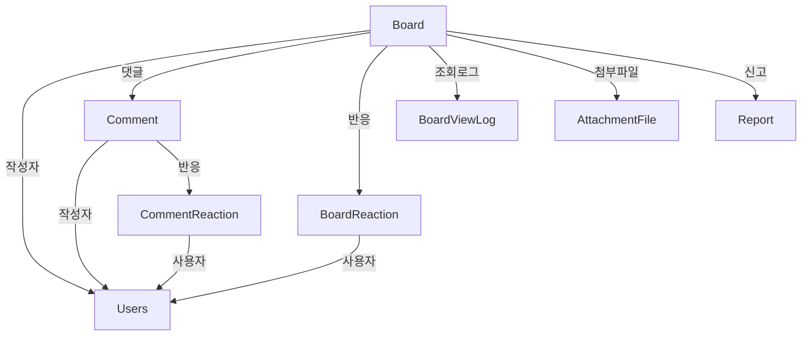

# Board 도메인

## 개요

커뮤니티 게시판, 댓글, 반응(좋아요/싫어요), 인기글 스냅샷 등을 관리하는 핵심 도메인입니다.

## Entity 구조

### 1. Board (게시글)

```java
@Entity
@Table(name = "board")
public class Board {
    Long idx;              // PK
    Users user;            // 작성자 (ManyToOne)
    String title;          // 제목
    String content;        // 내용 (TEXT)
    String category;       // 카테고리 (자유, 정보, 질문 등)
    ContentStatus status;  // 상태 (ACTIVE, HIDDEN, DELETED)
    LocalDateTime createdAt;     // 작성일
    Integer viewCount;           // 조회수
    Integer likeCount;           // 좋아요 수
    Integer commentCount;        // 댓글 수
    LocalDateTime lastReactionAt; // 마지막 반응 시간
    Boolean isDeleted;           // 소프트 삭제
}
```

**연관관계:**
- `ManyToOne` → Users (작성자)
- `OneToMany` → Comment (댓글 목록)
- `OneToMany` → BoardReaction (반응 목록)
- `OneToMany` → BoardViewLog (조회 로그)

### 2. Comment (댓글)

```java
@Entity
@Table(name = "comment")
public class Comment {
    Long idx;              // PK
    Board board;           // 게시글 (ManyToOne)
    Users user;            // 작성자 (ManyToOne)
    String content;        // 내용
    ContentStatus status;  // 상태
    LocalDateTime createdAt;  // 작성일
    Boolean isDeleted;        // 소프트 삭제
}
```

**연관관계:**
- `ManyToOne` → Board
- `ManyToOne` → Users
- `OneToMany` → CommentReaction (댓글 반응)

### 3. BoardReaction (게시글 반응)

```java
@Entity
@Table(name = "board_reaction")
@Table(uniqueConstraints = @UniqueConstraint(columnNames = {"board_idx", "user_idx"}))
public class BoardReaction {
    Long idx;              // PK
    Board board;           // 게시글 (ManyToOne)
    Users user;            // 사용자 (ManyToOne)
    ReactionType type;     // 반응 유형 (LIKE, DISLIKE)
    LocalDateTime createdAt;  // 반응 시간
}
```

**연관관계:**
- `ManyToOne` → Board
- `ManyToOne` → Users

### 4. CommentReaction (댓글 반응)

```java
@Entity
@Table(name = "comment_reaction")
@Table(uniqueConstraints = @UniqueConstraint(columnNames = {"comment_idx", "user_idx"}))
public class CommentReaction {
    Long idx;              // PK
    Comment comment;       // 댓글 (ManyToOne)
    Users user;            // 사용자 (ManyToOne)
    ReactionType type;     // 반응 유형
    LocalDateTime createdAt;  // 반응 시간
}
```

**연관관계:**
- `ManyToOne` → Comment
- `ManyToOne` → Users

### 5. BoardViewLog (조회 로그)

```java
@Entity
@Table(name = "board_view_log")
public class BoardViewLog {
    Long idx;              // PK
    Board board;           // 게시글 (ManyToOne)
    Users user;            // 조회자 (ManyToOne)
    LocalDateTime viewedAt;   // 조회 시간
}
```

**목적:** 사용자당 1회만 조회수 증가 (중복 조회 방지)

**연관관계:**
- `ManyToOne` → Board
- `ManyToOne` → Users

### 6. BoardPopularitySnapshot (인기글 스냅샷)

```java
@Entity
@Table(name = "board_popularity_snapshot")
public class BoardPopularitySnapshot {
    Long idx;              // PK
    Board board;           // 게시글 (ManyToOne)
    PopularityPeriodType periodType;  // 기간 (WEEKLY, MONTHLY)
    LocalDate snapshotDate;           // 스냅샷 날짜
    Integer viewCount;                // 조회수
    Integer likeCount;                // 좋아요 수
    Integer commentCount;             // 댓글 수
    Double popularityScore;           // 인기도 점수
}
```

**목적:** 주간/월간 인기글을 미리 계산하여 조회 성능 향상

**연관관계:**
- `ManyToOne` → Board

## Service 주요 기능

### BoardService

#### 1. 게시글 CRUD
```java
// 게시글 목록 조회 (페이징)
BoardPageResponseDTO getAllBoardsWithPaging(String category, int page, int size)

// 게시글 상세 조회 + 조회수 증가
BoardDTO getBoard(long idx, Long viewerId)

// 게시글 생성
BoardDTO createBoard(BoardDTO dto)

// 게시글 수정
BoardDTO updateBoard(long idx, BoardDTO dto)

// 게시글 삭제 (소프트 삭제)
void deleteBoard(long idx)

// 내 게시글 조회
List<BoardDTO> getMyBoards(long userId)
```

#### 2. 검색
```java
// 게시글 검색 (제목+내용)
BoardPageResponseDTO searchBoardsWithPaging(String keyword, String searchType, int page, int size)

// 검색 타입: TITLE, CONTENT, TITLE_CONTENT, ID(작성자)
```

#### 3. 관리자 기능
```java
// 게시글 목록 조회 (필터링: 상태, 삭제 여부, 카테고리, 검색어)
BoardPageResponseDTO getAdminBoardsWithPaging(String status, Boolean deleted, String category, String q, int page, int size)

// 게시글 상태 변경
BoardDTO updateBoardStatus(long id, ContentStatus status)

// 게시글 복구
BoardDTO restoreBoard(long id)
```

#### 4. 성능 최적화
```java
// 배치 조회로 N+1 문제 해결
private List<BoardDTO> mapBoardsWithReactionsBatch(List<Board> boards)

// 좋아요/싫어요 카운트 배치 조회 (IN 절, 500개 단위)
private Map<Long, Map<ReactionType, Long>> getReactionCountsBatch(List<Long> boardIds)
```

### CommentService

#### 1. 댓글 관리
```java
// 댓글 목록 조회
List<CommentDTO> getCommentsByBoard(long boardId)

// 댓글 작성
CommentDTO createComment(CommentDTO dto)

// 댓글 수정
CommentDTO updateComment(long commentId, CommentDTO dto)

// 댓글 삭제
void deleteComment(long commentId)
```

### ReactionService

#### 1. 반응 관리
```java
// 게시글에 반응 추가/변경/취소
void toggleBoardReaction(long boardId, long userId, ReactionType type)

// 댓글에 반응 추가/변경/취소
void toggleCommentReaction(long commentId, long userId, ReactionType type)

// 내 반응 조회
ReactionType getMyReaction(long boardId, long userId)

// 반응 요약 조회
ReactionSummaryDTO getReactionSummary(long boardId)
```

### BoardPopularityService

#### 1. 인기글 관리
```java
// 인기글 스냅샷 생성 (주간/월간)
void generateSnapshots(PopularityPeriodType periodType)

// 인기글 조회
List<BoardDTO> getPopularBoards(PopularityPeriodType periodType, int limit)

// 인기도 점수 계산 (조회수, 좋아요, 댓글 수 가중치)
private double calculatePopularityScore(Board board)
```

### BoardPopularityScheduler

#### 1. 스케줄링
```java
// 매일 18:30에 주간 인기글 스냅샷 생성
@Scheduled(cron = "0 30 18 * * ?")
void generateWeeklyPopularitySnapshots()

// 매주 월요일 18:30에 월간 인기글 스냅샷 생성
@Scheduled(cron = "0 30 18 ? * MON")
void generateMonthlyPopularitySnapshots()
```

## 다른 도메인과의 연관관계

### Board와 다른 도메인



### 주요 상호작용

1. **User 도메인**
   - Users가 게시글/댓글 작성
   - Users가 반응 추가
   - Users가 게시글 조회

2. **File 도메인**
   - 게시글에 이미지/파일 첨부
   - AttachmentFile과 연동

3. **Report 도메인**
   - 게시글/댓글 신고
   - 신고 처리 결과로 상태 변경 (HIDDEN, DELETED)

4. **Notification 도메인**
   - 댓글 작성 시 게시글 작성자에게 알림
   - 반응 추가 시 알림

## Enum 정의

### ContentStatus
```java
public enum ContentStatus {
    ACTIVE,      // 정상 노출
    HIDDEN,      // 숨김 (신고 처리)
    DELETED      // 삭제
}
```

### ReactionType
```java
public enum ReactionType {
    LIKE,        // 좋아요
    DISLIKE      // 싫어요
}
```

### PopularityPeriodType
```java
public enum PopularityPeriodType {
    WEEKLY,      // 주간
    MONTHLY      // 월간
}
```

## 성능 최적화

### 1. N+1 문제 해결

**문제:** 게시글 목록 조회 시 각 게시글의 좋아요/싫어요 수를 개별 쿼리로 조회

**해결:**
```java
// 배치 조회로 한 번에 조회 (IN 절 사용)
private Map<Long, Map<ReactionType, Long>> getReactionCountsBatch(List<Long> boardIds) {
    // IN 절 크기 제한 (500개 단위)
    final int BATCH_SIZE = 500;
    
    for (int i = 0; i < boardIds.size(); i += BATCH_SIZE) {
        List<Long> batch = boardIds.subList(i, end);
        List<Object[]> results = boardReactionRepository
            .countByBoardsGroupByReactionType(batch);
    }
}
```

**Repository 쿼리:**
```java
@Query("SELECT br.board.idx, br.type, COUNT(br) " +
       "FROM BoardReaction br " +
       "WHERE br.board.idx IN :boardIds " +
       "GROUP BY br.board.idx, br.type")
List<Object[]> countByBoardsGroupByReactionType(@Param("boardIds") List<Long> boardIds);
```

**효과:**
- N+1 쿼리 → 1+(N/500) 쿼리
- 1000개 게시글: 2001 쿼리 → 3 쿼리

### 2. 캐싱 전략

#### 게시글 상세 캐싱
```java
@Cacheable(value = "boardDetail", key = "#idx")
public BoardDTO getBoard(long idx, Long viewerId) {
    // ...
}
```

#### 캐시 무효화
```java
@Caching(evict = {
    @CacheEvict(value = "boardDetail", key = "#idx"),
    @CacheEvict(value = "boardList", allEntries = true)
})
public BoardDTO updateBoard(long idx, BoardDTO dto) {
    // ...
}
```

**캐시 적용 시나리오:**
- 게시글 상세: 조회 빈도 높음
- 인기글 목록: 계산 비용 높음 (스냅샷으로 대체)

### 3. 인기글 스냅샷

**문제:** 인기글 조회 시 매번 복잡한 계산 수행

**해결:**
- 주간/월간 인기글을 미리 계산하여 스냅샷 저장
- 스케줄러로 자동 생성 (매일 18:30, 매주 월요일 18:30)
- 조회 시 스냅샷에서 바로 반환

**인기도 점수 계산:**
```java
private double calculatePopularityScore(Board board) {
    return (board.getViewCount() * 0.1) +
           (board.getLikeCount() * 2.0) +
           (board.getCommentCount() * 1.5);
}
```

### 4. 조회수 중복 방지

**문제:** 같은 사용자가 새로고침할 때마다 조회수 증가

**해결:**
```java
private boolean shouldIncrementView(Board board, Long viewerId) {
    // BoardViewLog 테이블에 기록이 있는지 확인
    boolean alreadyViewed = boardViewLogRepository.existsByBoardAndUser(board, viewer);
    if (alreadyViewed) {
        return false;
    }
    
    // 기록 추가
    boardViewLogRepository.save(new BoardViewLog(board, viewer));
    return true;
}
```

### 5. 인덱싱

**추천 인덱스:**
```sql
-- 카테고리별 조회
CREATE INDEX idx_board_category_deleted ON board(category, is_deleted, created_at DESC);

-- 사용자별 게시글
CREATE INDEX idx_board_user_deleted ON board(user_idx, is_deleted, created_at DESC);

-- 검색 (Full-Text Search)
CREATE FULLTEXT INDEX idx_board_search ON board(title, content);

-- 반응 조회
CREATE INDEX idx_reaction_board_type ON board_reaction(board_idx, reaction_type);

-- 조회 로그
CREATE UNIQUE INDEX idx_view_log_board_user ON board_view_log(board_idx, user_idx);
```

## 동시성 제어

### 1. 조회수 증가

**문제:** 동시 조회 시 조회수 부정확

**해결책 1: BoardViewLog 사용 (현재 방식)**
```java
// 사용자당 1회만 조회수 증가
// BoardViewLog에 기록하여 중복 방지
```

**장점:**
- 정확한 조회 수 추적
- 중복 조회 방지

**단점:**
- ViewLog 테이블 크기 증가
- 조회 시 추가 쿼리 발생

**해결책 2: Redis 활용 (개선안)**
```java
// Redis Set에 "board:{idx}:viewers" 키로 사용자 ID 저장
// TTL 24시간 설정
```

### 2. 좋아요/싫어요 동시 처리

**문제:** 동시 클릭 시 중복 반응 또는 카운트 오류

**현재 방식:**
- Unique 제약조건으로 중복 방지
- 예외 처리로 안전하게 처리

**Repository:**
```java
Optional<BoardReaction> findByBoardAndUser(Board board, Users user);
```

**Service:**
```java
public void toggleBoardReaction(long boardId, long userId, ReactionType type) {
    Optional<BoardReaction> existing = reactionRepository.findByBoardAndUser(board, user);
    
    if (existing.isPresent()) {
        if (existing.get().getType() == type) {
            // 같은 타입 → 취소
            reactionRepository.delete(existing.get());
            decrementCount(board, type);
        } else {
            // 다른 타입 → 변경
            existing.get().setType(type);
            reactionRepository.save(existing.get());
            adjustCounts(board, existing.get().getType(), type);
        }
    } else {
        // 새로 추가
        reactionRepository.save(new BoardReaction(board, user, type));
        incrementCount(board, type);
    }
}
```

**개선안: 낙관적 락**
```java
@Entity
public class Board {
    @Version
    private Long version;  // 낙관적 락
}
```

### 3. 댓글 수 동기화

**문제:** 댓글 추가/삭제 시 게시글의 commentCount 불일치

**현재 방식:**
```java
// 댓글 생성 시
board.setCommentCount(board.getCommentCount() + 1);
boardRepository.save(board);
```

**문제점:**
- Lost Update 가능성
- 동시 댓글 작성 시 카운트 누락

**개선안: 쿼리로 직접 증가**
```java
@Modifying
@Query("UPDATE Board b SET b.commentCount = b.commentCount + 1 WHERE b.idx = :boardId")
void incrementCommentCount(@Param("boardId") Long boardId);
```

## API 엔드포인트

### 게시글 (/api/boards)
- `GET /` - 게시글 목록 (페이징, 카테고리 필터)
- `GET /{id}` - 게시글 상세
- `POST /` - 게시글 작성
- `PUT /{id}` - 게시글 수정
- `DELETE /{id}` - 게시글 삭제
- `GET /search` - 게시글 검색
- `GET /me` - 내 게시글
- `GET /popular` - 인기글 (주간/월간)

### 댓글 (/api/boards/{boardId}/comments)
- `GET /` - 댓글 목록
- `POST /` - 댓글 작성
- `PUT /{commentId}` - 댓글 수정
- `DELETE /{commentId}` - 댓글 삭제

### 반응 (/api/boards/{boardId}/reactions)
- `POST /` - 반응 추가/변경/취소
- `GET /summary` - 반응 요약
- `GET /me` - 내 반응 조회

### 관리자 (/api/admin/boards)
- `GET /` - 게시글 관리 (필터링)
- `PUT /{id}/status` - 상태 변경
- `POST /{id}/restore` - 복구

## 테스트 시나리오

### 1. 게시글 작성 및 조회
- 게시글 작성
- 목록 조회 (페이징)
- 상세 조회 + 조회수 증가
- 같은 사용자 중복 조회 시 조회수 유지

### 2. 댓글 기능
- 댓글 작성 → 댓글 수 증가
- 댓글 삭제 → 댓글 수 감소
- 댓글 작성 시 알림 발송

### 3. 반응 기능
- 좋아요 클릭 → 좋아요 수 증가
- 다시 클릭 → 좋아요 취소
- 싫어요 클릭 → 좋아요→싫어요 변경

### 4. 인기글 스냅샷
- 스케줄러 실행 시 스냅샷 생성
- 인기도 점수 계산 검증
- 주간/월간 인기글 조회

### 5. 성능 테스트
- 1000개 게시글 목록 조회 성능
- N+1 문제 해결 검증
- 캐시 적용 전/후 비교

## 개선 아이디어

### 성능
1. **Redis 조회수 관리**
   - ViewLog 테이블 부담 감소
   - 조회 성능 향상

2. **ElasticSearch 검색**
   - Full-Text Search 성능 향상
   - 형태소 분석, 유사 검색

3. **이미지 CDN**
   - 첨부 이미지 로딩 속도 개선

### 기능
1. **태그 시스템**
   - 게시글에 태그 추가
   - 태그별 검색

2. **북마크 기능**
   - 게시글 저장
   - 내 북마크 관리

3. **추천 알고리즘**
   - 사용자 관심사 기반 추천
   - 협업 필터링

### 동시성
1. **분산 락 (Redis)**
   - 반응 처리 동시성 제어
   - 댓글 수 동기화

2. **이벤트 기반 아키텍처**
   - 댓글 작성 → 이벤트 발행
   - 알림, 통계 등 비동기 처리

