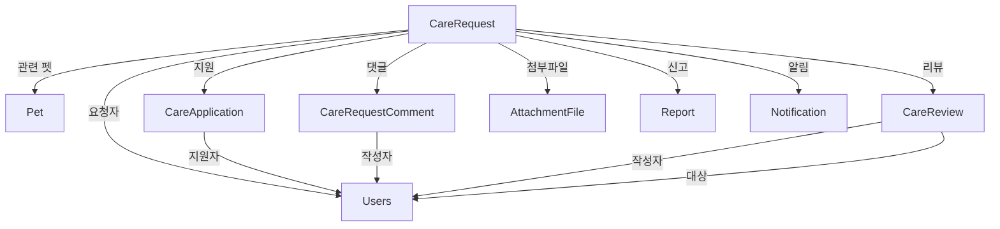

# Care 도메인

## 개요

펫케어 요청/지원 시스템으로, 반려동물 돌봄이 필요한 사용자와 돌봄을 제공할 수 있는 사용자를 연결하는 도메인입니다.

## Entity 구조

### 1. CareRequest (펫케어 요청)

```java
@Entity
@Table(name = "carerequest")
public class CareRequest {
    Long idx;              // PK
    Users user;            // 요청자 (ManyToOne)
    Pet pet;               // 관련 펫 (ManyToOne, Optional)
    String title;          // 제목
    String description;    // 상세 설명 (TEXT)
    LocalDateTime date;    // 돌봄 필요 날짜
    CareRequestStatus status;  // 상태
    LocalDateTime createdAt;
    LocalDateTime updatedAt;
    Boolean isDeleted;     // 소프트 삭제
}
```

**연관관계:**
- `ManyToOne` → Users (요청자)
- `ManyToOne` → Pet (관련 펫)
- `OneToMany` → CareApplication (지원 목록)
- `OneToMany` → CareRequestComment (댓글 목록)
- `OneToOne` → CareReview (리뷰)

### 2. CareApplication (펫케어 지원)

```java
@Entity
@Table(name = "care_application")
public class CareApplication {
    Long idx;              // PK
    CareRequest careRequest;  // 요청 (ManyToOne)
    Users applicant;          // 지원자 (ManyToOne)
    String message;           // 지원 메시지
    CareApplicationStatus status;  // 상태
    LocalDateTime createdAt;
    LocalDateTime updatedAt;
}
```

**연관관계:**
- `ManyToOne` → CareRequest
- `ManyToOne` → Users (지원자)

### 3. CareRequestComment (펫케어 댓글)

```java
@Entity
@Table(name = "care_request_comment")
public class CareRequestComment {
    Long idx;              // PK
    CareRequest careRequest;  // 요청 (ManyToOne)
    Users user;               // 작성자 (ManyToOne)
    String content;           // 내용
    LocalDateTime createdAt;
    Boolean isDeleted;        // 소프트 삭제
}
```

**연관관계:**
- `ManyToOne` → CareRequest
- `ManyToOne` → Users

### 4. CareReview (펫케어 리뷰)

```java
@Entity
@Table(name = "care_review")
public class CareReview {
    Long idx;              // PK
    CareRequest careRequest;  // 요청 (OneToOne)
    Users reviewer;           // 리뷰 작성자 (ManyToOne, 요청자)
    Users reviewee;           // 리뷰 대상 (ManyToOne, 돌봄 제공자)
    Integer rating;           // 평점 (1-5)
    String content;           // 리뷰 내용
    LocalDateTime createdAt;
}
```

**연관관계:**
- `OneToOne` → CareRequest
- `ManyToOne` → Users (리뷰 작성자)
- `ManyToOne` → Users (리뷰 대상)

## Service 주요 기능

### CareRequestService

#### 1. 펫케어 요청 관리
```java
// 펫케어 요청 생성
CareRequestDTO createCareRequest(CareRequestDTO dto)

// 펫케어 요청 목록 조회 (페이징, 상태 필터)
Page<CareRequestDTO> getAllCareRequests(CareRequestStatus status, int page, int size)

// 펫케어 요청 상세 조회
CareRequestDTO getCareRequest(long id)

// 펫케어 요청 수정
CareRequestDTO updateCareRequest(long id, CareRequestDTO dto)

// 펫케어 요청 삭제
void deleteCareRequest(long id)

// 내 펫케어 요청 조회
List<CareRequestDTO> getMyCareRequests(long userId)

// 내가 지원한 펫케어 조회
List<CareRequestDTO> getAppliedCareRequests(long userId)
```

#### 2. 펫케어 지원 관리
```java
// 지원하기
CareApplicationDTO applyCareRequest(long requestId, long userId, String message)

// 지원 취소
void cancelApplication(long applicationId)

// 지원자 목록 조회
List<CareApplicationDTO> getApplications(long requestId)

// 지원 승인 (요청자만 가능)
void approveApplication(long requestId, long applicationId)

// 지원 거절
void rejectApplication(long applicationId)
```

#### 3. 상태 관리
```java
// 돌봄 시작 (상태: IN_PROGRESS)
void startCare(long requestId)

// 돌봄 완료 (상태: COMPLETED)
void completeCare(long requestId)

// 요청 취소 (상태: CANCELLED)
void cancelRequest(long requestId)
```

### CareRequestCommentService

```java
// 댓글 목록 조회
List<CareRequestCommentDTO> getComments(long requestId)

// 댓글 작성
CareRequestCommentDTO createComment(CareRequestCommentDTO dto)

// 댓글 수정
CareRequestCommentDTO updateComment(long commentId, String content)

// 댓글 삭제
void deleteComment(long commentId)
```

### CareReviewService

```java
// 리뷰 작성 (COMPLETED 상태에서만)
CareReviewDTO createReview(CareReviewDTO dto)

// 리뷰 조회 (요청별)
CareReviewDTO getReviewByRequest(long requestId)

// 리뷰 조회 (사용자별 - 받은 리뷰)
List<CareReviewDTO> getReviewsByUser(long userId)

// 평균 평점 조회
double getAverageRating(long userId)

// 리뷰 수정
CareReviewDTO updateReview(long reviewId, CareReviewDTO dto)

// 리뷰 삭제
void deleteReview(long reviewId)
```

### CareRequestScheduler

```java
// 매 시간 정각에 실행: 날짜 지난 요청 자동 완료
@Scheduled(cron = "0 0 * * * ?")
void updateExpiredCareRequests()

// 매일 자정 실행: 일일 상태 업데이트
@Scheduled(cron = "0 0 0 * * ?")
void updateExpiredCareRequestsDaily()
```

**로직:**
- 날짜가 지났고 OPEN 또는 IN_PROGRESS 상태인 요청을 COMPLETED로 변경

## 다른 도메인과의 연관관계

### Care와 다른 도메인



### 주요 상호작용

1. **User 도메인**
   - Users가 펫케어 요청 생성
   - Users가 펫케어에 지원
   - Users가 리뷰 작성/받음

2. **Pet 도메인**
   - CareRequest에 Pet 연결 (어떤 반려동물을 돌봐줄지)

3. **File 도메인**
   - CareRequest에 펫 사진 첨부

4. **Notification 도메인**
   - 지원 시 요청자에게 알림
   - 승인/거절 시 지원자에게 알림
   - 리뷰 작성 시 대상자에게 알림

5. **Report 도메인**
   - 부적절한 요청/댓글 신고

## Enum 정의

### CareRequestStatus
```java
public enum CareRequestStatus {
    OPEN,         // 모집 중
    IN_PROGRESS,  // 진행 중
    COMPLETED,    // 완료
    CANCELLED     // 취소
}
```

### CareApplicationStatus
```java
public enum CareApplicationStatus {
    PENDING,      // 대기 중
    APPROVED,     // 승인됨
    REJECTED      // 거절됨
}
```

## 비즈니스 로직

### 펫케어 요청 생애주기

```
1. OPEN (모집 중)
   - 사용자가 요청 생성
   - 다른 사용자들이 지원 가능
   - 요청자가 지원자 승인

2. IN_PROGRESS (진행 중)
   - 지원자 승인 후 상태 변경
   - 다른 지원 불가
   - 돌봄 진행

3. COMPLETED (완료)
   - 요청자가 수동 완료 처리
   - 또는 날짜 지나면 자동 완료 (스케줄러)
   - 리뷰 작성 가능

4. CANCELLED (취소)
   - 요청자가 취소
   - 모든 지원 자동 거절
```

### 지원 승인 규칙

1. **1명만 승인 가능**
   - 이미 승인된 지원이 있으면 다른 지원 승인 불가
   - 승인 시 요청 상태를 IN_PROGRESS로 변경

2. **요청자만 승인/거절 가능**
   - 본인 요청에만 승인/거절 가능

3. **승인 후 취소 불가**
   - 승인된 지원은 취소 불가
   - 요청 전체를 취소해야 함

### 리뷰 작성 규칙

1. **COMPLETED 상태에서만 작성 가능**
2. **요청자만 리뷰 작성 가능** (돌봄 제공자 평가)
3. **1개 요청당 1개 리뷰만** (OneToOne)
4. **평점 1-5점**

## 성능 최적화

### 1. 목록 조회 최적화

**N+1 문제:**
- 요청 목록 조회 시 각 요청의 요청자, 펫, 지원자 수 등을 개별 조회

**해결:**
```java
// Fetch Join 사용
@Query("SELECT cr FROM CareRequest cr " +
       "JOIN FETCH cr.user " +
       "LEFT JOIN FETCH cr.pet " +
       "WHERE cr.isDeleted = false " +
       "ORDER BY cr.createdAt DESC")
List<CareRequest> findAllWithUserAndPet();

// 지원자 수 배치 조회
@Query("SELECT ca.careRequest.idx, COUNT(ca) FROM CareApplication ca " +
       "WHERE ca.careRequest.idx IN :requestIds " +
       "GROUP BY ca.careRequest.idx")
List<Object[]> countApplicationsByRequests(@Param("requestIds") List<Long> requestIds);
```

### 2. 인덱싱

```sql
-- 상태별 조회
CREATE INDEX idx_care_request_status ON carerequest(status, is_deleted, date DESC);

-- 사용자별 조회
CREATE INDEX idx_care_request_user ON carerequest(user_idx, is_deleted, created_at DESC);

-- 지원자별 조회
CREATE INDEX idx_care_application_user ON care_application(applicant_idx, status);

-- 스케줄러 쿼리 최적화
CREATE INDEX idx_care_request_date_status ON carerequest(date, status);
```

### 3. 캐싱

```java
// 사용자별 평균 평점 캐싱
@Cacheable(value = "userRating", key = "#userId")
public double getAverageRating(long userId) {
    return careReviewRepository.calculateAverageRating(userId);
}

// 리뷰 작성 시 캐시 무효화
@CacheEvict(value = "userRating", key = "#dto.revieweeId")
public CareReviewDTO createReview(CareReviewDTO dto) {
    // ...
}
```

## 동시성 제어

### 1. 지원 승인 동시 처리

**문제:** 여러 지원을 동시에 승인하려 할 때 1명만 승인되어야 함

**해결책 1: 트랜잭션 + 상태 체크**
```java
@Transactional
public void approveApplication(long requestId, long applicationId) {
    CareRequest request = careRequestRepository.findById(requestId)
        .orElseThrow();
    
    // 이미 승인된 지원이 있는지 확인
    boolean hasApproved = applicationRepository
        .existsByRequestAndStatus(request, CareApplicationStatus.APPROVED);
    
    if (hasApproved) {
        throw new IllegalStateException("이미 승인된 지원이 있습니다.");
    }
    
    // 승인 처리
    CareApplication application = applicationRepository.findById(applicationId)
        .orElseThrow();
    application.setStatus(CareApplicationStatus.APPROVED);
    
    // 요청 상태 변경
    request.setStatus(CareRequestStatus.IN_PROGRESS);
    
    careRequestRepository.save(request);
    applicationRepository.save(application);
}
```

**문제점:** REPEATABLE_READ 격리 수준에서도 동시 승인 가능

**해결책 2: 비관적 락**
```java
@Lock(LockModeType.PESSIMISTIC_WRITE)
@Query("SELECT cr FROM CareRequest cr WHERE cr.idx = :id")
CareRequest findByIdWithLock(@Param("id") Long id);
```

**해결책 3: 유니크 제약 조건**
```sql
-- 승인된 지원은 1개만 (부분 인덱스)
CREATE UNIQUE INDEX idx_unique_approved 
ON care_application(care_request_idx) 
WHERE status = 'APPROVED';
```

### 2. 스케줄러 중복 실행 방지

**문제:** 매 시간 + 매일 자정 스케줄러가 동시 실행 가능

**해결:**
```java
@Scheduled(cron = "0 0 * * * ?")
@Transactional
public void updateExpiredCareRequests() {
    // 분산 환경에서는 ShedLock 등 사용
    log.info("펫케어 요청 상태 자동 업데이트 시작");
    
    LocalDateTime now = LocalDateTime.now();
    List<CareRequest> expiredRequests = careRequestRepository
        .findByDateBeforeAndStatusIn(
            now,
            List.of(CareRequestStatus.OPEN, CareRequestStatus.IN_PROGRESS)
        );
    
    for (CareRequest request : expiredRequests) {
        request.setStatus(CareRequestStatus.COMPLETED);
    }
    
    careRequestRepository.saveAll(expiredRequests);
}
```

**개선안: ShedLock**
```java
@Scheduled(cron = "0 0 * * * ?")
@SchedulerLock(name = "updateExpiredCareRequests", 
               lockAtLeastFor = "PT5M", 
               lockAtMostFor = "PT10M")
public void updateExpiredCareRequests() {
    // 여러 인스턴스 중 1개만 실행
}
```

## API 엔드포인트

### 펫케어 요청 (/api/care/requests)
- `GET /` - 요청 목록 (페이징, 상태 필터)
- `GET /{id}` - 요청 상세
- `POST /` - 요청 생성
- `PUT /{id}` - 요청 수정
- `DELETE /{id}` - 요청 삭제
- `GET /me` - 내 요청 목록
- `GET /applied` - 내가 지원한 요청

### 펫케어 지원 (/api/care/requests/{requestId}/applications)
- `GET /` - 지원자 목록
- `POST /` - 지원하기
- `PUT /{applicationId}/approve` - 승인
- `PUT /{applicationId}/reject` - 거절
- `DELETE /{applicationId}` - 지원 취소

### 펫케어 상태 (/api/care/requests/{requestId}/status)
- `PUT /start` - 돌봄 시작
- `PUT /complete` - 돌봄 완료
- `PUT /cancel` - 요청 취소

### 펫케어 댓글 (/api/care/requests/{requestId}/comments)
- `GET /` - 댓글 목록
- `POST /` - 댓글 작성
- `PUT /{commentId}` - 댓글 수정
- `DELETE /{commentId}` - 댓글 삭제

### 펫케어 리뷰 (/api/care/reviews)
- `POST /` - 리뷰 작성
- `GET /request/{requestId}` - 요청별 리뷰
- `GET /user/{userId}` - 사용자별 리뷰 (받은 리뷰)
- `GET /user/{userId}/rating` - 평균 평점
- `PUT /{reviewId}` - 리뷰 수정
- `DELETE /{reviewId}` - 리뷰 삭제

## 테스트 시나리오

### 1. 펫케어 요청 생애주기
- 요청 생성 (OPEN)
- 3명 지원
- 1명 승인 → IN_PROGRESS
- 돌봄 완료 → COMPLETED
- 리뷰 작성

### 2. 동시 지원 승인
- 2명이 동시에 승인 시도
- 1명만 승인되어야 함
- 나머지는 에러 또는 자동 거절

### 3. 스케줄러 자동 완료
- 날짜 지난 요청들
- 스케줄러 실행
- COMPLETED로 상태 변경 확인

### 4. 리뷰 시스템
- 리뷰 작성 (COMPLETED 상태)
- 평균 평점 계산
- 캐시 무효화 확인

## 개선 아이디어

### 기능
1. **매칭 알고리즘**
   - 위치 기반 추천
   - 평점 기반 추천
   - 펫 종류별 매칭

2. **채팅 시스템**
   - 요청자 ↔ 지원자 실시간 채팅
   - WebSocket 또는 Firebase

3. **결제 시스템**
   - 펫케어 비용 결제
   - 에스크로 (완료 시 정산)

4. **인증 시스템**
   - 펫 시터 자격증 인증
   - 신원 인증

### 성능
1. **알림 최적화**
   - 지원/승인/거절 시 푸시 알림
   - 비동기 처리

2. **검색 기능**
   - 위치 기반 검색 (좌표)
   - 날짜 범위 검색
   - 펫 종류별 필터

### 보안
1. **지원자 검증**
   - 평점 임계값 설정
   - 제재 이력 확인

2. **신고 시스템**
   - 부적절한 요청/지원 신고
   - 자동 제재

