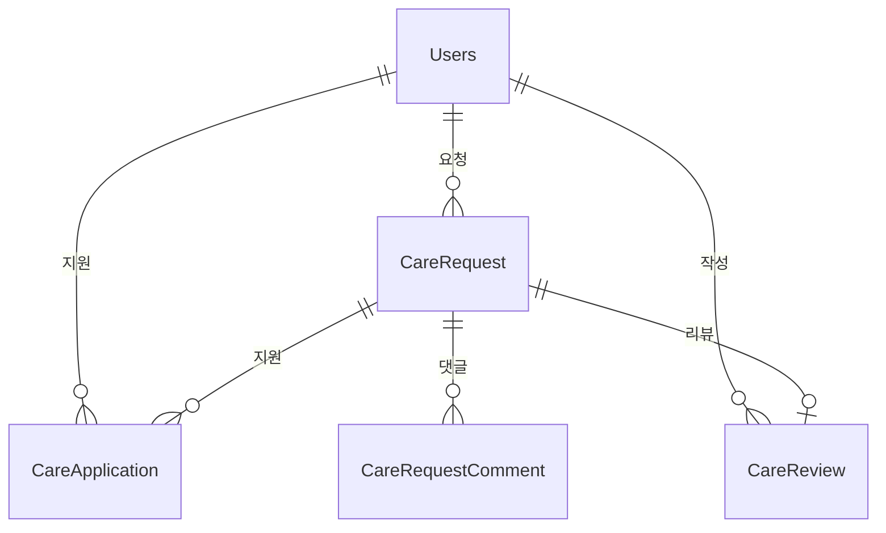

# Care 도메인 - 포트폴리오 상세 설명

## 1. 기능 설명

### 1.1 도메인 개요
- **역할**: 펫케어 요청/지원 시스템으로, 반려동물 돌봄이 필요한 사용자와 돌봄을 제공할 수 있는 사용자를 연결합니다.
- **주요 기능**: 
  - 펫케어 요청 생성/조회/수정/삭제
  - 펫케어 지원 (지원자 모집, 채팅을 통한 거래 확정)
  - 지원 승인/거절 (1명만 승인 가능, 양쪽 모두 거래 확정 시 자동 승인)
  - 펫케어 상태 관리 (OPEN → IN_PROGRESS → COMPLETED)
  - 펫케어 요청 댓글 (SERVICE_PROVIDER만 작성 가능, 파일 첨부 지원)
  - 펫케어 리뷰 시스템 (요청자가 제공자에게 리뷰 작성)
  - 날짜 지난 요청 자동 완료 (스케줄러)

### 1.2 기능 시연
> **스크린샷/영상 링크**: [기능 작동 영상 또는 스크린샷 추가]

#### 주요 기능 1: 펫케어 요청 및 지원
- **설명**: 사용자가 펫케어 요청을 생성하고, 다른 사용자들이 지원할 수 있습니다. 요청 수정/삭제는 작성자만 가능하며, 관리자는 모든 요청을 수정/삭제할 수 있습니다.
- **사용자 시나리오**: 
  1. 펫케어 요청 생성 (제목, 설명, 날짜, 펫 정보) - 이메일 인증 필요
  2. 여러 사용자가 지원
  3. 요청자가 1명만 승인
  4. 승인 시 상태 변경 (OPEN → IN_PROGRESS)
  5. 요청 수정 시 펫 정보 연결/해제 가능 (petIdx를 null로 전달하면 펫 연결 해제)
  6. 상태 변경은 작성자 또는 승인된 제공자만 가능 (서비스 완료 처리 등)
- **권한 제어**:
  - 요청 수정/삭제: 작성자만 가능 (관리자 우회)
  - 상태 변경: 작성자 또는 승인된 제공자만 가능 (관리자 우회)
- **스크린샷/영상**: 

#### 주요 기능 1-1: 채팅 후 거래 확정 및 완료
- **설명**: 펫케어 요청자가 서비스 제공자와 채팅을 시작한 후, 양쪽 모두 거래를 확정하면 펫케어 서비스가 시작되고, 서비스 완료 후 완료 처리할 수 있습니다.
- **사용자 시나리오**:
  1. 펫케어 요청 생성 (OPEN 상태)
  2. 서비스 제공자가 "채팅하기" 버튼 클릭하여 채팅방 생성
  3. 채팅방에서 가격, 시간, 서비스 내용 등 조건 협의
  4. 양쪽 모두 "거래 확정" 버튼 클릭
  5. 양쪽 모두 확정 시 자동으로:
     - CareApplication 생성 및 ACCEPTED 상태로 설정
     - CareRequest 상태 변경 (OPEN → IN_PROGRESS)
  6. 서비스 진행 (IN_PROGRESS 상태)
  7. 서비스 완료 후 채팅방에서 "서비스 완료" 버튼 클릭
  8. CareRequest 상태 변경 (IN_PROGRESS → COMPLETED)
- **스크린샷/영상**: 

#### 주요 기능 2: 펫케어 리뷰 시스템
- **설명**: 펫케어 지원이 승인된 후 요청자가 돌봄 제공자에게 리뷰를 작성할 수 있습니다.
- **사용자 시나리오**:
  1. 펫케어 지원 승인 (`CareApplication` 상태가 `ACCEPTED`)
  2. 요청자가 리뷰 작성 (평점 1-5, 내용)
  3. 중복 리뷰 방지 (한 `CareApplication`당 1개의 리뷰만 작성 가능)
  4. 평균 평점 계산 및 표시
- **스크린샷/영상**:

#### 주요 기능 3: 펫케어 요청 댓글
- **설명**: `SERVICE_PROVIDER` 역할의 사용자만 펫케어 요청에 댓글을 작성할 수 있습니다. 댓글 작성 시 요청자에게 알림이 발송되며, 파일 첨부가 가능합니다.
- **사용자 시나리오**:
  1. `SERVICE_PROVIDER` 역할 사용자가 펫케어 요청 확인
  2. 댓글 작성 (파일 첨부 가능 - 첫 번째 파일만 저장됨)
  3. 댓글 작성 시 요청자에게 알림 발송 (단, 작성자가 요청자가 아닌 경우에만)
  4. 댓글 삭제 시 Soft Delete 적용
- **제한사항**:
  - 파일 첨부는 첫 번째 파일만 저장됨 (`syncSingleAttachment`는 단일 파일만 지원)
  - 자신의 요청에 자신이 댓글을 달면 알림 발송 안 함
- **스크린샷/영상**: 

#### 주요 기능 4: 펫케어 요청 검색
- **설명**: 제목과 내용 모두에서 키워드를 검색할 수 있습니다. 대소문자 구분 없이 검색되며, 삭제되지 않은 요청만 검색 결과에 포함됩니다.
- **사용자 시나리오**:
  1. 검색어 입력
  2. 제목 또는 내용에 키워드가 포함된 요청 검색
  3. 검색 결과는 삭제되지 않은 요청만 표시
- **검색 특징**:
  - 제목과 내용 모두에서 검색 (`findByTitleContainingIgnoreCaseOrDescriptionContainingIgnoreCaseAndIsDeletedFalse`)
  - 대소문자 구분 없음 (`IgnoreCase`)
  - 삭제되지 않은 요청만 검색
- **스크린샷/영상**: 

---

## 2. 서비스 로직 설명

### 2.1 핵심 비즈니스 로직

#### 로직 1: 채팅 후 거래 확정 (양쪽 모두 확인 시 자동 승인)
**구현 위치**: `ConversationService.confirmCareDeal()` 

**핵심 로직**:
- 펫케어 관련 채팅방인지 확인 (`RelatedType.CARE_REQUEST` 또는 `CARE_APPLICATION`)
- 사용자의 거래 확정 처리 (`dealConfirmed`, `dealConfirmedAt` 설정)
- 이미 거래 확정했는지 확인 (중복 방지)
- 양쪽 모두 확정했는지 확인 (2명 참여자 모두 `dealConfirmed = true`)
- 양쪽 모두 확정 시:
  - `CareRequest` 상태가 `OPEN`인 경우에만 처리
  - 제공자 찾기 (요청자가 아닌 참여자)
  - 기존 `CareApplication`이 있으면 승인, 없으면 생성 (`ACCEPTED` 상태)
  - `CareRequest` 상태를 `IN_PROGRESS`로 변경

**동시성 제어**: `@Transactional`로 트랜잭션 보장

**설명**:
- **처리 흐름**: 채팅방 조회 → 사용자 거래 확정 처리 → 중복 확인 → 양쪽 모두 확정 확인 → 지원 승인 및 상태 변경
- **주요 판단 기준**: 양쪽 모두 거래 확정해야만 서비스 시작, `OPEN` 상태인 경우에만 처리
- **동시성 제어**: 트랜잭션으로 처리하여 안전성 보장
- **CareApplication 관리**: 채팅 도메인(`ConversationService`)에서 생성/관리

#### 로직 2: 날짜 지난 요청 자동 완료
**구현 위치**: `CareRequestScheduler.updateExpiredCareRequests()` 
**스케줄러 설정**:
- 매 시간 정각 실행: `@Scheduled(cron = "0 0 * * * ?")`
- 매일 자정에도 실행: `@Scheduled(cron = "0 0 0 * * ?")` (더 정확한 처리를 위해)

**핵심 로직**:
- 날짜가 지났고 `OPEN` 또는 `IN_PROGRESS` 상태인 요청 조회
- 상태를 `COMPLETED`로 변경
- `saveAll()`로 일괄 저장

**설명**:
- **처리 흐름**: 만료된 요청 조회 → 상태 변경 → 저장
- **주요 판단 기준**: 날짜가 지났고 OPEN 또는 IN_PROGRESS 상태

#### 로직 3: 요청 수정/삭제 권한 체크
```java
// CareRequestService.java
@Transactional
public CareRequestDTO updateCareRequest(Long idx, CareRequestDTO dto, Long currentUserId) {
    CareRequest request = careRequestRepository.findById(idx).orElseThrow();
    
    // 작성자 확인 (관리자는 우회)
    if (!isAdmin() && !request.getUser().getIdx().equals(currentUserId)) {
        throw new RuntimeException("본인의 케어 요청만 수정할 수 있습니다.");
    }
    
    // 펫 정보 업데이트 (연결 해제도 가능)
    if (dto.getPetIdx() != null) {
        Pet pet = petRepository.findById(dto.getPetIdx()).orElseThrow();
        // 펫 소유자 확인
        if (!pet.getUser().getIdx().equals(request.getUser().getIdx())) {
            throw new RuntimeException("펫 소유자만 펫 정보를 연결할 수 있습니다.");
        }
        request.setPet(pet);
    } else if (dto.getPetIdx() == null && request.getPet() != null) {
        // petIdx가 null로 전달되면 펫 연결 해제
        request.setPet(null);
    }
}
```

**설명**:
- **처리 흐름**: 요청 조회 → 작성자 확인 (관리자 우회) → 필드 업데이트 → 펫 정보 처리
- **주요 판단 기준**: 
  - 작성자만 수정 가능 (관리자는 우회)
  - 펫 소유자 확인 (펫 연결 시)
  - 펫 연결 해제 지원 (petIdx가 null인 경우)
- **특징**: 
  - 관리자는 모든 요청 수정 가능
  - 펫 연결 해제 기능 제공

#### 로직 4: 상태 변경 권한 체크
```java
// CareRequestService.java
@Transactional
public CareRequestDTO updateStatus(Long idx, String status, Long currentUserId) {
    CareRequest request = careRequestRepository.findByIdWithApplications(idx).orElseThrow();
    
    // 관리자는 권한 검증 우회
    if (!isAdmin()) {
        // 작성자 또는 승인된 제공자만 상태 변경 가능
        boolean isRequester = request.getUser().getIdx().equals(currentUserId);
        boolean isAcceptedProvider = request.getApplications() != null &&
                request.getApplications().stream()
                        .anyMatch(app -> app.getStatus() == CareApplicationStatus.ACCEPTED
                                && app.getProvider().getIdx().equals(currentUserId));
        
        if (!isRequester && !isAcceptedProvider) {
            throw new RuntimeException("작성자 또는 승인된 제공자만 상태를 변경할 수 있습니다.");
        }
    }
    
    request.setStatus(CareRequestStatus.valueOf(status));
    return careRequestConverter.toDTO(careRequestRepository.save(request));
}
```

**설명**:
- **처리 흐름**: 요청 조회 (지원 목록 포함) → 권한 확인 (관리자 우회) → 상태 변경
- **주요 판단 기준**: 
  - 작성자 또는 승인된 제공자만 상태 변경 가능
  - 관리자는 모든 요청의 상태 변경 가능
- **특징**: 
  - 승인된 제공자도 상태 변경 가능 (서비스 완료 처리 등)
  - 관리자 권한 우회

#### 로직 5: 요청 검색 (제목과 내용 모두 검색)
```java
// CareRequestService.java
@Transactional(readOnly = true)
public List<CareRequestDTO> searchCareRequests(String keyword) {
    if (keyword == null || keyword.trim().isEmpty()) {
        return getAllCareRequests(null, null);
    }
    
    List<CareRequest> requests = careRequestRepository
            .findByTitleContainingIgnoreCaseOrDescriptionContainingIgnoreCaseAndIsDeletedFalse(
                    keyword.trim(), keyword.trim());
    
    return careRequestConverter.toDTOList(requests);
}
```

**설명**:
- **처리 흐름**: 키워드 검증 → 제목과 내용 모두 검색 → 결과 반환
- **주요 판단 기준**: 
  - 제목 또는 내용에 키워드 포함 시 검색
  - 대소문자 구분 없음 (`IgnoreCase`)
  - 삭제되지 않은 요청만 검색
- **특징**: 
  - 제목과 내용 모두에서 검색
  - 대소문자 구분 없음

#### 로직 6: 댓글 작성 시 알림 발송 조건
```java
// CareRequestCommentService.java
@Transactional
public CareRequestCommentDTO addComment(Long careRequestId, CareRequestCommentDTO dto) {
    // ... 댓글 저장 로직 ...
    
    // 알림 발송: 댓글 작성자가 게시글 작성자가 아닌 경우에만 알림 발송
    Long requestOwnerId = careRequest.getUser().getIdx();
    if (!requestOwnerId.equals(user.getIdx())) {
        notificationService.createNotification(
                requestOwnerId,
                NotificationType.CARE_REQUEST_COMMENT,
                "펫케어 요청글에 새로운 댓글이 달렸습니다",
                String.format("%s님이 댓글을 남겼습니다: %s", user.getUsername(), ...),
                careRequest.getIdx(),
                "CARE_REQUEST");
    }
}
```

**설명**:
- **처리 흐름**: 댓글 저장 → 작성자 확인 → 알림 발송 (조건부)
- **주요 판단 기준**: 댓글 작성자가 요청자가 아닌 경우에만 알림 발송
- **특징**: 
  - 자신의 요청에 자신이 댓글을 달면 알림 발송 안 함
  - 파일 첨부는 첫 번째 파일만 저장 (`syncSingleAttachment`는 단일 파일만 지원)

### 2.2 서비스 메서드 구조

#### CareRequestService
| 메서드 | 설명 | 주요 로직 |
|--------|------|-----------|
| `createCareRequest()` | 펫케어 요청 생성 | 이메일 인증 확인, 펫 소유자 확인, 상태 OPEN |
| `getAllCareRequests()` | 요청 목록 조회 | 상태 필터링, 위치 필터링, 작성자 활성 상태 확인 |
| `getCareRequest()` | 단일 요청 조회 | 펫 정보 포함 조회 |
| `updateCareRequest()` | 요청 수정 | 작성자 확인 (관리자 우회), 펫 정보 업데이트/연결 해제 지원, 펫 소유자 확인 |
| `deleteCareRequest()` | 요청 삭제 | 작성자 확인 (관리자 우회), Soft Delete |
| `getMyCareRequests()` | 내 요청 목록 | 사용자별 요청 조회 |
| `updateStatus()` | 상태 변경 | 작성자 또는 승인된 제공자 확인 (관리자 우회), OPEN → IN_PROGRESS → COMPLETED |
| `searchCareRequests()` | 요청 검색 | 제목과 내용 모두 검색 (대소문자 구분 없음, `findByTitleContainingIgnoreCaseOrDescriptionContainingIgnoreCaseAndIsDeletedFalse`) |

#### CareRequestCommentService
| 메서드 | 설명 | 주요 로직 |
|--------|------|-----------|
| `getComments()` | 댓글 목록 조회 | 펫케어 요청별 댓글 조회, 파일 첨부 정보 포함 |
| `addComment()` | 댓글 작성 | SERVICE_PROVIDER 역할 확인, 파일 첨부 지원 (첫 번째 파일만 저장), 알림 발송 (작성자가 요청자가 아닌 경우에만) |
| `deleteComment()` | 댓글 삭제 | Soft Delete 적용 |

#### CareReviewService
| 메서드 | 설명 | 주요 로직 |
|--------|------|-----------|
| `createReview()` | 리뷰 작성 | CareApplication ACCEPTED 상태 확인, 중복 리뷰 방지, 요청자만 작성 가능 |
| `getReviewsByReviewee()` | 리뷰 대상별 리뷰 목록 조회 | 특정 사용자(제공자)에 대한 리뷰 목록 |
| `getReviewsByReviewer()` | 리뷰 작성자별 리뷰 목록 조회 | 특정 사용자가 작성한 리뷰 목록 |
| `getAverageRating()` | 평균 평점 조회 | 리뷰 목록에서 평균 계산 (캐싱 없음) |

### 2.3 트랜잭션 처리
- **트랜잭션 범위**: 
  - 요청 생성/수정/삭제: `@Transactional`
  - 거래 확정: `@Transactional` (동시성 제어 필요)
  - 리뷰 작성: `@Transactional` (중복 리뷰 방지)
  - 댓글 작성/삭제: `@Transactional`
  - 조회 메서드: `@Transactional(readOnly = true)`
- **격리 수준**: 기본값 (READ_COMMITTED)
- **이메일 인증**: 요청 생성 시 이메일 인증 확인 (`EmailVerificationRequiredException`)
- **권한 체크**: 
  - 요청 수정/삭제: 작성자만 가능 (관리자는 우회) (`CareRequestService.updateCareRequest()`, `deleteCareRequest()`)
  - 상태 변경: 작성자 또는 승인된 제공자만 가능 (관리자는 우회) (`CareRequestService.updateStatus()`)
  - 댓글 작성: `SERVICE_PROVIDER` 역할만 가능 (`CareRequestCommentService.addComment()`)
  - 리뷰 작성: 요청자만 가능 (`CareReviewService.createReview()`)

---

## 3. 아키텍처 설명

### 3.1 도메인 구조
```
domain/care/
  ├── controller/
  │   ├── CareRequestController.java
  │   ├── CareRequestCommentController.java
  │   └── CareReviewController.java
  ├── service/
  │   ├── CareRequestService.java
  │   ├── CareRequestCommentService.java
  │   ├── CareReviewService.java
  │   └── CareRequestScheduler.java
  ├── entity/
  │   ├── CareRequest.java
  │   ├── CareApplication.java
  │   ├── CareApplicationStatus.java (enum)
  │   ├── CareRequestStatus.java (enum)
  │   ├── CareReview.java
  │   └── CareRequestComment.java
  ├── repository/
  │   ├── CareRequestRepository.java
  │   ├── CareApplicationRepository.java
  │   ├── CareReviewRepository.java
  │   └── CareRequestCommentRepository.java
  ├── converter/
  │   ├── CareRequestConverter.java
  │   ├── CareApplicationConverter.java
  │   ├── CareReviewConverter.java
  │   └── CareRequestCommentConverter.java
  └── dto/
      ├── CareRequestDTO.java
      ├── CareApplicationDTO.java
      ├── CareReviewDTO.java
      └── CareRequestCommentDTO.java
```

**참고**: `CareApplication` 생성/관리는 채팅 도메인(`domain/chat/service/ConversationService`)에서 처리됩니다.

### 3.2 엔티티 구조

#### CareRequest (펫케어 요청)
**역할**: 펫케어 요청을 나타내는 핵심 엔티티입니다. 반려동물 돌봄이 필요한 사용자가 서비스 제공자를 모집하기 위해 생성하는 게시물입니다. 요청자는 제목, 설명, 날짜, 관련 펫 정보를 포함하여 요청을 생성하며, 상태는 OPEN → IN_PROGRESS → COMPLETED로 전이됩니다. 하나의 요청에는 여러 지원(CareApplication)과 댓글(CareRequestComment)이 연결될 수 있습니다.

```java
@Entity
@Table(name = "carerequest")
public class CareRequest extends BaseTimeEntity {
    private Long idx;
    private Users user;                    // 요청자
    private Pet pet;                       // 관련 펫 (선택사항)
    private String title;                   // 제목
    @Lob
    private String description;            // 설명
    private LocalDateTime date;            // 날짜
    @Builder.Default
    private CareRequestStatus status = CareRequestStatus.OPEN;  // 상태 (OPEN, IN_PROGRESS, COMPLETED)
    @Builder.Default
    private Boolean isDeleted = false;
    private LocalDateTime deletedAt;
    private LocalDateTime createdAt;       // BaseTimeEntity에서 상속
    private LocalDateTime updatedAt;       // BaseTimeEntity에서 상속
    @OneToMany(mappedBy = "careRequest", cascade = CascadeType.ALL)
    private List<CareApplication> applications; // 지원 목록
    @OneToMany(mappedBy = "careRequest", cascade = CascadeType.ALL)
    private List<CareRequestComment> comments;   // 댓글 목록
}
```

#### CareApplication (펫케어 지원)
**역할**: 펫케어 지원을 나타내는 엔티티입니다. 서비스 제공자(SERVICE_PROVIDER)가 특정 펫케어 요청에 지원할 때 생성됩니다. 상태는 PENDING → ACCEPTED 또는 REJECTED로 변경되며, ACCEPTED 상태가 되면 실제 서비스가 시작됩니다. 채팅을 통한 거래 확정 시 양쪽 모두 확정하면 자동으로 ACCEPTED 상태가 되고, 요청 상태가 IN_PROGRESS로 변경됩니다. 하나의 요청에는 여러 지원이 가능하지만, 일반적으로 1명만 ACCEPTED 상태가 됩니다.

```java
@Entity
@Table(name = "careapplication")
public class CareApplication extends BaseTimeEntity {
    private Long idx;
    private CareRequest careRequest;        // 펫케어 요청
    private Users provider;                 // 케어 제공자
    @Builder.Default
    private CareApplicationStatus status = CareApplicationStatus.PENDING;  // 상태 (PENDING, ACCEPTED, REJECTED)
    @Lob
    private String message;                 // 지원 메시지
    private LocalDateTime createdAt;       // BaseTimeEntity에서 상속
    private LocalDateTime updatedAt;       // BaseTimeEntity에서 상속
}
```

#### CareReview (펫케어 리뷰)
**역할**: 펫케어 리뷰를 나타내는 엔티티입니다. 펫케어 서비스가 완료된 후, 요청자(reviewer)가 서비스 제공자(reviewee)에게 작성하는 리뷰입니다. 하나의 CareApplication당 1개의 리뷰만 작성 가능하며, ACCEPTED 상태의 CareApplication에 대해서만 리뷰를 작성할 수 있습니다. 평점(1-5)과 리뷰 내용을 포함하며, 제공자의 평균 평점 계산에 사용됩니다.

```java
@Entity
@Table(name = "carereview")
public class CareReview extends BaseTimeEntity {
    private Long idx;
    private CareApplication careApplication; // 펫케어 지원
    private Users reviewer;                 // 리뷰 작성자 (요청자)
    private Users reviewee;                 // 리뷰 대상 (제공자)
    private int rating;                     // 평점 (1-5)
    @Lob
    private String comment;                 // 리뷰 내용
    private LocalDateTime createdAt;        // BaseTimeEntity에서 상속
    private LocalDateTime updatedAt;        // BaseTimeEntity에서 상속
}
```

#### CareRequestComment (펫케어 요청 댓글)
**역할**: 펫케어 요청 댓글을 나타내는 엔티티입니다. SERVICE_PROVIDER 역할의 사용자가 특정 펫케어 요청에 대해 질문이나 답변을 작성할 때 사용됩니다. 요청자와 서비스 제공자 간의 소통을 위한 기능으로, 댓글 작성 시 요청자에게 알림이 자동으로 발송됩니다. 파일 첨부가 가능하며, Soft Delete 방식으로 삭제됩니다.

```java
@Entity
@Table(name = "carerequest_comment")
public class CareRequestComment {
    private Long idx;
    private CareRequest careRequest;        // 펫케어 요청
    private Users user;                     // 작성자 (SERVICE_PROVIDER만 작성 가능)
    @Lob
    private String content;                 // 내용
    private LocalDateTime createdAt;        // @PrePersist로 자동 설정
    @Builder.Default
    private Boolean isDeleted = false;
    private LocalDateTime deletedAt;
}
```
**특징**:
- `BaseTimeEntity`를 상속하지 않음 (직접 `createdAt` 관리)
- `SERVICE_PROVIDER` 역할만 댓글 작성 가능
- 파일 첨부 지원 (`FileTargetType.CARE_COMMENT`)
- 댓글 작성 시 요청자에게 알림 발송 (`NotificationType.CARE_REQUEST_COMMENT`)

### 3.3 엔티티 관계도 (ERD)


### 3.4 API 설계
| 엔드포인트 | Method | 설명 |
|-----------|--------|------|
| `/api/care-requests` | GET | 요청 목록 (status, location 파라미터 지원) |
| `/api/care-requests/{id}` | GET | 단일 요청 조회 |
| `/api/care-requests` | POST | 요청 생성 (이메일 인증 필요) |
| `/api/care-requests/{id}` | PUT | 요청 수정 (작성자만 가능, 관리자 우회, currentUserId 자동 추출) |
| `/api/care-requests/{id}` | DELETE | 요청 삭제 (작성자만 가능, 관리자 우회, currentUserId 자동 추출) |
| `/api/care-requests/my-requests` | GET | 내 요청 목록 (userId 파라미터) |
| `/api/care-requests/{id}/status` | PATCH | 상태 변경 (작성자 또는 승인된 제공자만 가능, 관리자 우회, status 파라미터, currentUserId 자동 추출) |
| `/api/care-requests/search` | GET | 요청 검색 (keyword 파라미터, 제목과 내용 모두 검색, 대소문자 구분 없음) |
| `/api/care-requests/{careRequestId}/comments` | GET | 댓글 목록 조회 |
| `/api/care-requests/{careRequestId}/comments` | POST | 댓글 작성 (SERVICE_PROVIDER만 가능, 파일 첨부 지원 - 첫 번째 파일만 저장, 작성자가 요청자가 아닌 경우에만 알림 발송) |
| `/api/care-requests/{careRequestId}/comments/{commentId}` | DELETE | 댓글 삭제 (Soft Delete) |
| `/api/chat/conversations/{conversationIdx}/confirm-deal` | POST | 거래 확정 (채팅방에서, 양쪽 모두 확정 시 자동 승인) |
| `/api/care-reviews` | POST | 리뷰 작성 |
| `/api/care-reviews/reviewee/{revieweeIdx}` | GET | 특정 사용자(제공자)에 대한 리뷰 목록 |
| `/api/care-reviews/reviewer/{reviewerIdx}` | GET | 특정 사용자가 작성한 리뷰 목록 |
| `/api/care-reviews/average-rating/{revieweeIdx}` | GET | 특정 사용자의 평균 평점 조회 |

---

## 4. 트러블슈팅

---

## 5. 성능 최적화

### 5.1 DB 최적화

#### 인덱스 전략

**carerequest 테이블**:
```sql
-- 외래키 (pet_idx)
CREATE INDEX fk_carerequest_pet ON carerequest(pet_idx);

-- 사용자별 조회
CREATE INDEX user_idx ON carerequest(user_idx);
```

**careapplication 테이블**:
```sql
-- 펫케어 요청별 지원 조회
CREATE INDEX care_request_idx ON careapplication(care_request_idx);

-- 제공자별 지원 조회
CREATE INDEX provider_idx ON careapplication(provider_idx);
```

**carerequest_comment 테이블**:
```sql
-- 펫케어 요청별 댓글 조회
CREATE INDEX fk_care_request_comment_request ON carerequest_comment(care_request_idx);

-- 사용자별 댓글 조회
CREATE INDEX fk_care_request_comment_user ON carerequest_comment(user_idx);
```

**carereview 테이블**:
```sql
-- 펫케어 지원별 리뷰 조회
CREATE INDEX care_application_idx ON carereview(care_application_idx);

-- 리뷰 대상별 리뷰 조회
CREATE INDEX reviewee_idx ON carereview(reviewee_idx);

-- 리뷰 작성자별 리뷰 조회
CREATE INDEX reviewer_idx ON carereview(reviewer_idx);
```

**선정 이유**:
- WHERE 절에서 자주 사용되는 조건
- JOIN에 사용되는 외래키 (user_idx, care_request_idx, provider_idx 등)
- 사용자별, 요청별 조회 최적화

### 5.2 애플리케이션 레벨 최적화

#### 캐싱 전략
- 현재 평균 평점 조회에는 캐싱이 적용되지 않음
- 필요 시 `@Cacheable` 어노테이션을 추가하여 성능 최적화 가능

#### N+1 문제 해결
```java
// Fetch Join 사용
@Query("SELECT cr FROM CareRequest cr " +
       "JOIN FETCH cr.user " +
       "LEFT JOIN FETCH cr.pet " +
       "WHERE cr.isDeleted = false")
List<CareRequest> findAllWithUserAndPet();
```

---

## 6. 핵심 포인트 요약

### 기술적 하이라이트
1. **거래 확정 동시성 제어**: 트랜잭션으로 안전성 보장, 양쪽 모두 확인 시 자동 승인 (`ConversationService`)
2. **자동 완료 스케줄러**: 날짜 지난 요청 자동 완료 (매 시간 정각 + 매일 자정)
3. **이메일 인증**: 요청 생성 시 이메일 인증 확인
4. **Soft Delete**: 요청 및 댓글 삭제 시 Soft Delete 적용
5. **N+1 문제 해결**: Fetch Join 사용 (`findByIdWithPet`, `findAllActiveRequests`)
6. **리뷰 중복 방지**: `CareApplication`당 1개의 리뷰만 작성 가능
7. **권한 기반 댓글**: `SERVICE_PROVIDER` 역할만 댓글 작성 가능
8. **알림 연동**: 댓글 작성 시 요청자에게 알림 자동 발송
9. **파일 첨부 지원**: 댓글에 파일 첨부 가능 (`FileTargetType.CARE_COMMENT`)

