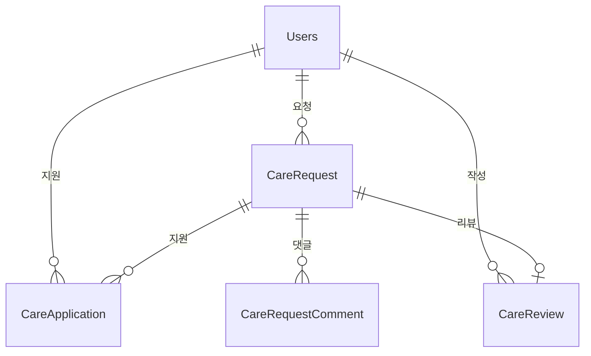

# Care 도메인 - 포트폴리오 상세 설명

## 1. 기능 설명

### 1.1 도메인 개요
- **역할**: 펫케어 요청/지원 시스템으로, 반려동물 돌봄이 필요한 사용자와 돌봄을 제공할 수 있는 사용자를 연결합니다.
- **주요 기능**: 
  - 펫케어 요청 생성/조회/수정/삭제
  - 펫케어 지원 (지원자 모집)
  - 지원 승인/거절 (1명만 승인 가능)
  - 펫케어 상태 관리 (OPEN → IN_PROGRESS → COMPLETED)
  - 펫케어 리뷰 시스템
  - 날짜 지난 요청 자동 완료 (스케줄러)

### 1.2 기능 시연
> **스크린샷/영상 링크**: [기능 작동 영상 또는 스크린샷 추가]

#### 주요 기능 1: 펫케어 요청 및 지원
- **설명**: 사용자가 펫케어 요청을 생성하고, 다른 사용자들이 지원할 수 있습니다.
- **사용자 시나리오**: 
  1. 펫케어 요청 생성 (제목, 설명, 날짜, 펫 정보)
  2. 여러 사용자가 지원
  3. 요청자가 1명만 승인
  4. 승인 시 상태 변경 (OPEN → IN_PROGRESS)
- **스크린샷/영상**: 

#### 주요 기능 2: 펫케어 리뷰 시스템
- **설명**: 펫케어 완료 후 요청자가 돌봄 제공자에게 리뷰를 작성할 수 있습니다.
- **사용자 시나리오**:
  1. 펫케어 완료 (COMPLETED 상태)
  2. 요청자가 리뷰 작성 (평점 1-5, 내용)
  3. 평균 평점 계산 및 표시
- **스크린샷/영상**: 

---

## 2. 서비스 로직 설명

### 2.1 핵심 비즈니스 로직

#### 로직 1: 지원 승인 (1명만 승인 가능)
```java
// CareRequestService.java
@Transactional
public void approveApplication(long requestId, long applicationId) {
    CareRequest request = careRequestRepository.findById(requestId).orElseThrow();
    
    // 이미 승인된 지원이 있는지 확인
    boolean hasApproved = applicationRepository
        .existsByRequestAndStatus(request, CareApplicationStatus.APPROVED);
    
    if (hasApproved) {
        throw new IllegalStateException("이미 승인된 지원이 있습니다.");
    }
    
    // 승인 처리
    CareApplication application = applicationRepository.findById(applicationId).orElseThrow();
    application.setStatus(CareApplicationStatus.APPROVED);
    
    // 요청 상태 변경
    request.setStatus(CareRequestStatus.IN_PROGRESS);
    
    careRequestRepository.save(request);
    applicationRepository.save(application);
}
```

**설명**:
- **처리 흐름**: 요청 조회 → 승인된 지원 확인 → 승인 처리 → 상태 변경
- **주요 판단 기준**: 이미 승인된 지원이 있으면 승인 불가
- **동시성 제어**: 비관적 락 또는 Unique 제약조건 필요

#### 로직 2: 날짜 지난 요청 자동 완료
```java
// CareRequestScheduler.java
@Scheduled(cron = "0 0 * * * ?") // 매 시간 정각
@Transactional
public void updateExpiredCareRequests() {
    LocalDateTime now = LocalDateTime.now();
    List<CareRequest> expiredRequests = careRequestRepository
        .findByDateBeforeAndStatusIn(
            now,
            List.of(CareRequestStatus.OPEN, CareRequestStatus.IN_PROGRESS)
        );
    
    for (CareRequest request : expiredRequests) {
        request.setStatus(CareRequestStatus.COMPLETED);
    }
    
    careRequestRepository.saveAll(expiredRequests);
}
```

**설명**:
- **처리 흐름**: 만료된 요청 조회 → 상태 변경 → 저장
- **주요 판단 기준**: 날짜가 지났고 OPEN 또는 IN_PROGRESS 상태

### 2.2 서비스 메서드 구조

#### CareRequestService
| 메서드 | 설명 | 주요 로직 |
|--------|------|-----------|
| `createCareRequest()` | 펫케어 요청 생성 | 펫 소유자 확인, 상태 OPEN |
| `getAllCareRequests()` | 요청 목록 조회 | 상태 필터링, 위치 필터링 |
| `updateStatus()` | 상태 변경 | OPEN → IN_PROGRESS → COMPLETED |
| `searchCareRequests()` | 요청 검색 | 제목/내용 검색 |

#### CareReviewService
| 메서드 | 설명 | 주요 로직 |
|--------|------|-----------|
| `createReview()` | 리뷰 작성 | COMPLETED 상태 확인, 평균 평점 계산 |
| `getAverageRating()` | 평균 평점 조회 | 캐싱 적용 |

### 2.3 트랜잭션 처리
- **트랜잭션 범위**: 
  - 요청 생성/수정/삭제: `@Transactional`
  - 지원 승인: `@Transactional` (동시성 제어 필요)
  - 조회 메서드: `@Transactional(readOnly = true)`
- **격리 수준**: 기본값 (READ_COMMITTED), 지원 승인은 REPEATABLE_READ 권장

---

## 3. 아키텍처 설명

### 3.1 도메인 구조
```
domain/care/
  ├── controller/
  │   ├── CareRequestController.java
  │   └── CareRequestCommentController.java
  ├── service/
  │   ├── CareRequestService.java
  │   ├── CareReviewService.java
  │   └── CareRequestScheduler.java
  ├── entity/
  │   ├── CareRequest.java
  │   ├── CareApplication.java
  │   ├── CareReview.java
  │   └── CareRequestComment.java
  └── repository/
      ├── CareRequestRepository.java
      └── CareReviewRepository.java
```

### 3.2 엔티티 구조

#### CareRequest (펫케어 요청)
```java
@Entity
@Table(name = "carerequest")
public class CareRequest {
    private Long idx;
    private Users user;                    // 요청자
    private Pet pet;                        // 관련 펫 (선택사항)
    private String title;                  // 제목
    private String description;            // 설명
    private LocalDateTime date;            // 날짜
    private CareRequestStatus status;       // 상태 (OPEN, IN_PROGRESS, COMPLETED)
    private LocalDateTime createdAt;
    private LocalDateTime updatedAt;
    private Boolean isDeleted;
    private List<CareApplication> applications; // 지원 목록
    private List<CareRequestComment> comments;   // 댓글 목록
}
```

#### CareApplication (펫케어 지원)
```java
@Entity
@Table(name = "careapplication")
public class CareApplication {
    private Long idx;
    private CareRequest careRequest;        // 펫케어 요청
    private Users provider;                // 케어 제공자
    private CareApplicationStatus status;   // 상태 (PENDING, APPROVED, REJECTED)
    private String message;                 // 지원 메시지
    private LocalDateTime createdAt;
    private List<CareReview> reviews;       // 리뷰 목록
}
```

#### CareReview (펫케어 리뷰)
```java
@Entity
@Table(name = "carereview")
public class CareReview {
    private Long idx;
    private CareApplication careApplication; // 펫케어 지원
    private Users reviewer;                // 리뷰 작성자 (요청자)
    private Users reviewee;                 // 리뷰 대상 (제공자)
    private int rating;                     // 평점 (1-5)
    private String comment;                 // 리뷰 내용
    private LocalDateTime createdAt;
    private LocalDateTime updatedAt;
}
```

#### CareRequestComment (펫케어 요청 댓글)
```java
@Entity
@Table(name = "carerequest_comment")
public class CareRequestComment {
    private Long idx;
    private CareRequest careRequest;        // 펫케어 요청
    private Users user;                    // 작성자
    private String content;                // 내용
    private LocalDateTime createdAt;
    private Boolean isDeleted;
}
```

### 3.3 엔티티 관계도 (ERD)


### 3.4 API 설계
| 엔드포인트 | Method | 설명 |
|-----------|--------|------|
| `/api/care/requests` | GET | 요청 목록 |
| `/api/care/requests` | POST | 요청 생성 |
| `/api/care/requests/{id}/applications` | POST | 지원하기 |
| `/api/care/requests/{id}/applications/{appId}/approve` | PUT | 지원 승인 |
| `/api/care/reviews` | POST | 리뷰 작성 |

---

## 4. 트러블슈팅

---

## 5. 성능 최적화

### 5.1 DB 최적화

#### 인덱스 전략
```sql
-- 상태별 조회
CREATE INDEX idx_care_request_status ON carerequest(status, is_deleted, date DESC);

-- 사용자별 조회
CREATE INDEX idx_care_request_user ON carerequest(user_idx, is_deleted, created_at DESC);

-- 스케줄러 쿼리 최적화
CREATE INDEX idx_care_request_date_status ON carerequest(date, status);
```

### 5.2 애플리케이션 레벨 최적화

#### 캐싱 전략
```java
// 평균 평점 캐싱
@Cacheable(value = "userRating", key = "#userId")
public double getAverageRating(long userId) {
    return careReviewRepository.calculateAverageRating(userId);
}
```

#### N+1 문제 해결
```java
// Fetch Join 사용
@Query("SELECT cr FROM CareRequest cr " +
       "JOIN FETCH cr.user " +
       "LEFT JOIN FETCH cr.pet " +
       "WHERE cr.isDeleted = false")
List<CareRequest> findAllWithUserAndPet();
```

---

## 6. 핵심 포인트 요약

### 기술적 하이라이트
1. **지원 승인 동시성 제어**: 비관적 락 또는 Unique 제약조건
2. **자동 완료 스케줄러**: 날짜 지난 요청 자동 완료
3. **리뷰 시스템**: 평균 평점 캐싱
4. **N+1 문제 해결**: Fetch Join 사용

### 학습한 점
- 동시성 제어 방법 (비관적 락, Unique 제약조건)
- 스케줄러 활용 (자동 완료 처리)
- 리뷰 시스템 설계 (평균 평점 계산, 캐싱)

### 개선 가능한 부분
- 분산 락 (Redis): 여러 인스턴스 환경에서 지원 승인 동시성 제어
- 매칭 알고리즘: 위치 기반 추천, 평점 기반 추천
- 채팅 시스템: 요청자 ↔ 지원자 실시간 채팅
