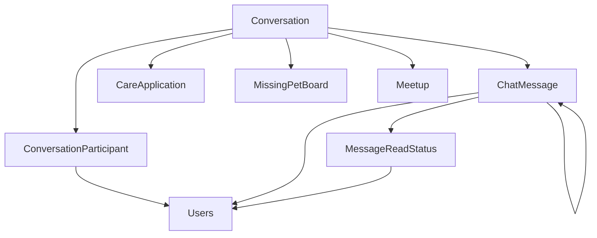

# Chat 도메인 - 포트폴리오 상세 설명

## 1. 개요

Chat 도메인은 실시간 채팅 기능을 제공하는 도메인입니다. WebSocket(STOMP)을 사용하여 실시간 메시지 전송, 채팅방 관리, 읽지 않은 메시지 수 추적 등을 담당합니다.

**주요 기능**:
- 실시간 채팅 (WebSocket 기반)
- 채팅방 생성 및 관리 (1:1, 그룹, 펫케어, 실종제보, 산책모임)
- 메시지 전송/조회/삭제/검색
- 읽지 않은 메시지 수 관리 (원자적 증가)
- 메시지 읽음 처리
- 채팅방 참여/나가기
- 펫케어 거래 확정 (양쪽 모두 확인 시 자동 승인)
- 재참여 시 이전 대화 내용 제한 (joinedAt 이후 메시지만 조회)

---

## 2. 기능 설명

### 2.1 채팅방 타입

#### 1:1 일반 채팅 (DIRECT)
- 두 사용자 간의 개인 채팅
- 기존 채팅방이 있으면 재사용
- 펫케어, 실종제보 등과 연동 가능

#### 펫케어 요청 채팅 (CARE_REQUEST)
- 펫케어 요청 관련 채팅방
- `RelatedType.CARE_REQUEST` 또는 `RelatedType.CARE_APPLICATION` 사용
- 요청자와 제공자 간 소통
- 거래 확정 기능 지원 (`confirmCareDeal()`)

#### 실종제보 채팅 (MISSING_PET)
- 실종 동물 제보자와 목격자 간 소통
- 같은 제보에 대해 여러 목격자와 개별 채팅방 생성
- `MissingPetBoard`와 연동

#### 산책모임 채팅 (MEETUP)
- 산책모임 참여자들의 그룹 채팅
- 모임 참여 시 자동 참여
- 모임 나가기 시 채팅방에서도 나감

#### 그룹 채팅 (GROUP)
- 여러 사용자가 참여하는 그룹 채팅
- 관리자 지정 가능

### 2.2 실시간 메시지 전송

**WebSocket 기반 실시간 통신**:
- STOMP 프로토콜 사용
- 메시지 전송 시 채팅방 참여자들에게 브로드캐스트
- 타이핑 표시 기능 지원

**메시지 타입**:
- `TEXT`: 일반 텍스트 메시지
- `IMAGE`: 이미지 메시지
- `FILE`: 파일 메시지
- `SYSTEM`: 시스템 메시지
- `NOTICE`: 공지 메시지

### 2.3 읽지 않은 메시지 수 관리

- 메시지 전송 시 참여자들의 `unreadCount` 자동 증가 (본인 제외)
- 메시지 읽음 처리 시 `unreadCount` 초기화
- 채팅방 목록에서 읽지 않은 메시지 수 표시

### 2.4 재참여 처리

- 채팅방 나간 후 재참여 시 `joinedAt` 이후 메시지만 조회
- 이전 대화 내용은 보지 않음
- `lastReadMessage` 초기화

---

## 3. 서비스 로직 설명

### 3.1 채팅방 생성

**구현 위치**: `ConversationService.createConversation()` 

**핵심 로직**:
- **참여자 유효성 검증**: 사용자 존재 확인, 탈퇴한 사용자 제외
- **그룹 채팅(MEETUP)**: 최소 1명 허용, 1:1 채팅은 최소 2명 필요
- **relatedType/relatedIdx 기존 채팅방 확인**: 펫케어 요청 등 연관 엔티티가 있으면 기존 채팅방 확인
- **1:1 채팅 중복 방지**: 기존 채팅방이 있으면 재사용, relatedType/relatedIdx 업데이트 지원 (기존 일반 채팅방을 펫케어 채팅방으로 변환 가능)
- **별도 트랜잭션**: `REQUIRES_NEW`로 실패해도 호출한 트랜잭션에 영향 없음
- **참여자 추가**: 각 참여자에 대해 `ConversationParticipant` 생성 (role 기본값: MEMBER, unreadCount: 0, status: ACTIVE, joinedAt: 현재 시간)

### 3.2 메시지 전송

```java
@Transactional
public ChatMessageDTO sendMessage(Long conversationIdx, Long senderIdx, String content, MessageType messageType) {
    // 1. 전송자 확인
    Users sender = usersRepository.findById(senderIdx)
            .orElseThrow(() -> new IllegalArgumentException("사용자를 찾을 수 없습니다."));
    
    if (Boolean.TRUE.equals(sender.getIsDeleted())) {
        throw new IllegalStateException("탈퇴한 사용자는 메시지를 보낼 수 없습니다.");
    }
    
    // 2. 채팅방 확인
    Conversation conversation = conversationRepository.findById(conversationIdx)
            .orElseThrow(() -> new IllegalArgumentException("채팅방을 찾을 수 없습니다."));
    
    // 3. 참여자인지 확인
    ConversationParticipant senderParticipant = participantRepository
            .findByConversationIdxAndUserIdx(conversationIdx, senderIdx)
            .orElseThrow(() -> new IllegalArgumentException("채팅방 참여자가 아닙니다."));
    
    if (senderParticipant.getStatus() != ParticipantStatus.ACTIVE) {
        throw new IllegalStateException("채팅방에 참여 중이 아닙니다.");
    }
    
    // 4. 메시지 저장
    ChatMessage message = ChatMessage.builder()
            .conversation(conversation)
            .sender(sender)
            .content(content)
            .messageType(messageType != null ? messageType : MessageType.TEXT)
            .build();
    
    message = chatMessageRepository.save(message);
    
        // 5. 참여자들의 읽지 않은 메시지 수 증가 (본인 제외)
        // DB 레벨 원자적 증가로 Lost Update 방지
        // 구현 위치: ConversationParticipantRepository.incrementUnreadCount()
        participantRepository.incrementUnreadCount(conversationIdx, senderIdx);
    
    // 6. Conversation 메타데이터 업데이트
    conversation.setLastMessageAt(LocalDateTime.now());
    String preview = messageType == MessageType.IMAGE ? "[사진]"
            : messageType == MessageType.FILE ? "[파일]"
                    : content.length() > 200 ? content.substring(0, 200) : content;
    conversation.setLastMessagePreview(preview);
    conversationRepository.save(conversation);
    
    return messageConverter.toDTO(message);
}
```

**핵심 로직**:
- **참여자 검증**: 채팅방 참여자만 메시지 전송 가능
- **원자적 증가**: `incrementUnreadCount`로 동시성 문제 해결
- **메타데이터 업데이트**: 마지막 메시지 시간 및 미리보기 업데이트

### 3.3 메시지 읽음 처리

**구현 위치**: `ChatMessageService.markAsRead()` 

**핵심 로직**:
- **참여자 확인**: 채팅방 참여자인지 확인
- **읽지 않은 메시지 수 초기화**: `unreadCount`를 0으로 설정
- **마지막 읽은 메시지 저장**: `lastMessageIdx`가 있으면 `lastReadMessage`, `lastReadAt` 설정
- **MessageReadStatus 기록**: 선택사항 (현재는 주석 처리되어 있음, 필요시 활성화 가능)

### 3.4 재참여 시 메시지 조회

**구현 위치**: `ChatMessageService.getMessages()` (Lines 104-130)

**핵심 로직**:
- **재참여 감지**: `lastReadMessage`가 null이고 `joinedAt`이 있으면 재참여로 간주
- **메시지 필터링**: 재참여한 경우 `joinedAt` 이후 메시지만 조회 (`findByConversationIdxAndCreatedAtAfterOrderByCreatedAtDesc`)
- **페이징**: 기본값 page=0, size=50, 최신순 정렬 (DESC)
- **재참여 처리**: `joinMeetupChat()`에서 LEFT 상태였던 참여자가 재참여 시 `lastReadMessage`, `lastReadAt`, `unreadCount` 초기화

### 3.5 실종제보 채팅방 생성

**구현 위치**: `ConversationService.createMissingPetChat()`

**핵심 로직**:
- **제보자-목격자 조합별 개별 채팅방**: 같은 제보에 대해 여러 목격자가 있을 수 있으므로 조합별로 개별 채팅방 생성
- **기존 채팅방 확인**: 제보자와 목격자가 모두 참여한 기존 채팅방이 있으면 재사용
- **본인 제보 체크**: 목격자가 제보자와 같은 경우 예외 발생

### 3.6 산책모임 채팅방 관리

**구현 위치**: 
- `ConversationService.joinMeetupChat()`
- `ConversationService.leaveMeetupChat()` 
- `ConversationService.getMeetupChatParticipantCount()`

**핵심 로직**:
- **모임 참여 시 자동 참여**: 모임의 채팅방 찾아서 참여자 추가 (재참여 시 ACTIVE 상태로 변경, 이전 대화 내용 못 보도록 초기화)
- **모임 나가기**: 참여자 상태를 LEFT로 변경 (채팅방은 유지)
- **참여 인원 수 조회**: 활성 참여자 수 조회

---

## 4. 아키텍처 설명

### 4.1 엔티티 구조

#### Conversation (채팅방)
```java
@Entity
@Table(name = "conversation")
public class Conversation {
    private Long idx;
    private ConversationType conversationType;  // DIRECT, GROUP, CARE_REQUEST, MISSING_PET, MEETUP
    private String title;
    private RelatedType relatedType;  // CARE_REQUEST, CARE_APPLICATION, MISSING_PET_BOARD, MEETUP
    private Long relatedIdx;  // 연관 엔티티 ID
    private ConversationStatus status;  // ACTIVE, CLOSED
    private LocalDateTime lastMessageAt;
    private String lastMessagePreview;
    @Builder.Default
    private Boolean isDeleted = false;
    private LocalDateTime deletedAt;
    private LocalDateTime createdAt;  // @PrePersist로 자동 설정
    private LocalDateTime updatedAt;  // @PrePersist/@PreUpdate로 자동 설정
    @OneToMany(mappedBy = "conversation", cascade = CascadeType.ALL, fetch = FetchType.LAZY)
    private List<ConversationParticipant> participants;
    @OneToMany(mappedBy = "conversation", cascade = CascadeType.ALL, fetch = FetchType.LAZY)
    private List<ChatMessage> messages;
}
```
**특징**:
- `BaseTimeEntity`를 상속하지 않음 (`@PrePersist`, `@PreUpdate`로 직접 관리)

#### ConversationParticipant (채팅방 참여자)
```java
@Entity
@Table(name = "conversationparticipant")
public class ConversationParticipant {
    private Long idx;
    private Conversation conversation;
    private Users user;
    @Builder.Default
    private ParticipantRole role = ParticipantRole.MEMBER;  // MEMBER, ADMIN
    @Builder.Default
    private Integer unreadCount = 0;  // 읽지 않은 메시지 수
    private ChatMessage lastReadMessage;  // 마지막 읽은 메시지
    private LocalDateTime lastReadAt;
    @Builder.Default
    private ParticipantStatus status = ParticipantStatus.ACTIVE;  // ACTIVE, LEFT
    private LocalDateTime joinedAt;  // @PrePersist로 자동 설정
    private LocalDateTime leftAt;
    @Builder.Default
    private Boolean dealConfirmed = false;  // 거래 확정 여부 (펫케어용)
    private LocalDateTime dealConfirmedAt;  // 거래 확정 시간
    @Builder.Default
    private Boolean isDeleted = false;
    private LocalDateTime deletedAt;
    private LocalDateTime createdAt;  // @PrePersist로 자동 설정
    private LocalDateTime updatedAt;  // @PrePersist/@PreUpdate로 자동 설정
    
    // 읽지 않은 메시지 수 증가/감소 메서드
    public void incrementUnreadCount();
    public void decrementUnreadCount();
}
```
**특징**:
- `BaseTimeEntity`를 상속하지 않음 (`@PrePersist`, `@PreUpdate`로 직접 관리)
- `joinedAt`은 `@PrePersist`에서 자동 설정

#### ChatMessage (메시지)
```java
@Entity
@Table(name = "chatmessage")
public class ChatMessage {
    private Long idx;
    private Conversation conversation;
    private Users sender;
    @Builder.Default
    private MessageType messageType = MessageType.TEXT;  // TEXT, IMAGE, FILE, SYSTEM, NOTICE
    @Lob
    @Column(nullable = false)
    private String content;
    private ChatMessage replyToMessage;  // 답장 메시지
    @Builder.Default
    private Boolean isDeleted = false;
    private LocalDateTime deletedAt;
    private LocalDateTime createdAt;  // @PrePersist로 자동 설정
    private LocalDateTime updatedAt;  // @PrePersist/@PreUpdate로 자동 설정
    @OneToMany(mappedBy = "message", cascade = CascadeType.ALL, fetch = FetchType.LAZY)
    private List<MessageReadStatus> readStatuses;
}
```
**특징**:
- `BaseTimeEntity`를 상속하지 않음 (`@PrePersist`, `@PreUpdate`로 직접 관리)

#### MessageReadStatus (메시지 읽음 상태)
```java
@Entity
@Table(name = "messagereadstatus")
public class MessageReadStatus {
    private Long idx;
    private ChatMessage message;
    private Users user;
    @Column(nullable = false)
    private LocalDateTime readAt;  // @PrePersist로 자동 설정
}
```
**특징**:
- 선택사항으로 사용됨 (현재는 `markAsRead()`에서 필요시에만 생성)
- `readAt`은 `@PrePersist`에서 자동 설정

### 4.2 도메인 구조
```
domain/chat/
  ├── controller/
  │   ├── ConversationController.java
  │   ├── ChatMessageController.java
  │   └── ChatWebSocketController.java
  ├── service/
  │   ├── ConversationService.java
  │   └── ChatMessageService.java
  ├── entity/
  │   ├── Conversation.java
  │   ├── ConversationParticipant.java
  │   ├── ChatMessage.java
  │   ├── MessageReadStatus.java
  │   ├── ConversationType.java (enum)
  │   ├── ConversationStatus.java (enum)
  │   ├── RelatedType.java (enum)
  │   ├── ParticipantRole.java (enum)
  │   ├── ParticipantStatus.java (enum)
  │   └── MessageType.java (enum)
  ├── repository/
  │   ├── ConversationRepository.java
  │   ├── ConversationParticipantRepository.java
  │   ├── ChatMessageRepository.java
  │   └── MessageReadStatusRepository.java
  ├── converter/
  │   ├── ConversationConverter.java
  │   ├── ConversationParticipantConverter.java
  │   ├── ChatMessageConverter.java
  │   └── MessageReadStatusConverter.java
  └── dto/
      ├── ConversationDTO.java
      ├── ConversationParticipantDTO.java
      ├── ChatMessageDTO.java
      ├── MessageReadStatusDTO.java
      ├── CreateConversationRequest.java
      └── SendMessageRequest.java
```

### 4.3 도메인 연관관계



### 4.4 서비스 메서드 구조

#### ConversationService
| 메서드 | 설명 | 주요 로직 |
|--------|------|-----------|
| `getMyConversations()` | 내 채팅방 목록 조회 | N+1 문제 해결을 위한 배치 조회 사용 |
| `getConversation()` | 채팅방 상세 조회 | 참여자 확인, 탈퇴한 사용자 체크 |
| `createConversation()` | 채팅방 생성 (범용) | 기존 채팅방 확인, 참여자 유효성 검증, REQUIRES_NEW 트랜잭션 |
| `createCareRequestConversation()` | 펫케어 채팅방 생성 | `RelatedType.CARE_APPLICATION` 사용 |
| `getOrCreateDirectConversation()` | 1:1 채팅방 생성/조회 | 기존 채팅방 재사용 |
| `createMissingPetChat()` | 실종제보 채팅방 생성 | 제보자-목격자 조합별 개별 채팅방 |
| `joinMeetupChat()` | 산책모임 채팅방 참여 | 재참여 시 이전 대화 내용 못 보도록 초기화 |
| `leaveMeetupChat()` | 산책모임 채팅방 나가기 | 참여자 상태만 LEFT로 변경 |
| `getMeetupChatParticipantCount()` | 산책모임 채팅방 참여 인원 수 조회 | 활성 참여자 수 조회 |
| `leaveConversation()` | 채팅방 나가기 | 참여자 상태 변경, 활성 참여자 없으면 채팅방 CLOSED |
| `deleteConversation()` | 채팅방 삭제 | Soft Delete |
| `updateConversationStatus()` | 채팅방 상태 변경 | ACTIVE ↔ CLOSED |
| `setParticipantRole()` | 참여자 역할 설정 | REQUIRES_NEW 트랜잭션 |
| `confirmCareDeal()` | 펫케어 거래 확정 | 양쪽 모두 확정 시 자동 승인 및 상태 변경 |

#### ChatMessageService
| 메서드 | 설명 | 주요 로직 |
|--------|------|-----------|
| `sendMessage()` | 메시지 전송 | 참여자 검증, 원자적 증가로 unreadCount 증가, 메타데이터 업데이트 |
| `getMessages()` | 메시지 목록 조회 (페이징) | 재참여 시 joinedAt 이후 메시지만 조회 |
| `getMessagesBefore()` | 메시지 목록 조회 (커서 기반) | 특정 날짜 이전 메시지 조회 |
| `markAsRead()` | 메시지 읽음 처리 | unreadCount 초기화, lastReadMessage 저장 |
| `deleteMessage()` | 메시지 삭제 | 본인 메시지만 삭제 가능, Soft Delete |
| `searchMessages()` | 메시지 검색 | 키워드로 메시지 검색 |
| `getUnreadCount()` | 읽지 않은 메시지 수 조회 | 참여자의 unreadCount 반환 |

### 4.5 API 설계

#### REST API
| 엔드포인트 | Method | 설명 |
|-----------|--------|------|
| `/api/chat/conversations` | GET | 내 채팅방 목록 (userId 파라미터) |
| `/api/chat/conversations/{conversationIdx}` | GET | 채팅방 상세 (userId 파라미터) |
| `/api/chat/conversations` | POST | 채팅방 생성 (범용) |
| `/api/chat/conversations/care-request` | POST | 펫케어 채팅방 생성 (careApplicationIdx, requesterId, providerId 파라미터) |
| `/api/chat/conversations/direct` | POST | 1:1 채팅방 생성/조회 (user1Id, user2Id 파라미터) |
| `/api/chat/conversations/{conversationIdx}/leave` | POST | 채팅방 나가기 (userId 파라미터) |
| `/api/chat/conversations/{conversationIdx}` | DELETE | 채팅방 삭제 (userId 파라미터) |
| `/api/chat/conversations/{conversationIdx}/status` | PATCH | 채팅방 상태 변경 (status 파라미터) |
| `/api/chat/conversations/meetup/{meetupIdx}/join` | POST | 산책모임 채팅방 참여 (userId 파라미터) |
| `/api/chat/conversations/meetup/{meetupIdx}/participant-count` | GET | 산책모임 채팅방 참여 인원 수 조회 |
| `/api/chat/conversations/{conversationIdx}/confirm-deal` | POST | 펫케어 거래 확정 (userId 파라미터, 양쪽 모두 확정 시 자동 승인) |
| `/api/chat/messages` | POST | 메시지 전송 (senderIdx 파라미터) |
| `/api/chat/messages/conversation/{conversationIdx}` | GET | 메시지 목록 조회 (페이징, userId 파라미터) |
| `/api/chat/messages/conversation/{conversationIdx}/before` | GET | 메시지 목록 조회 (커서 기반, beforeDate 파라미터) |
| `/api/chat/messages/conversation/{conversationIdx}/read` | POST | 메시지 읽음 처리 (userId, lastMessageIdx 파라미터) |
| `/api/chat/messages/{messageIdx}` | DELETE | 메시지 삭제 (userId 파라미터) |
| `/api/chat/messages/conversation/{conversationIdx}/search` | GET | 메시지 검색 (keyword 파라미터) |
| `/api/chat/messages/conversation/{conversationIdx}/unread-count` | GET | 읽지 않은 메시지 수 조회 (userId 파라미터) |

#### WebSocket API
| 엔드포인트 | Method | 설명 |
|-----------|--------|------|
| `/app/chat.send` | WebSocket | 실시간 메시지 전송 |
| `/app/chat.read` | WebSocket | 실시간 읽음 처리 |
| `/app/chat.typing` | WebSocket | 타이핑 표시 |
| `/topic/conversation/{conversationIdx}` | WebSocket | 채팅방 메시지 구독 |
| `/user/{userId}/queue/errors` | WebSocket | 에러 메시지 수신 |

### 4.6 WebSocket 구조

**구현 위치**: `ChatWebSocketController`

**STOMP 프로토콜 사용**:
- **클라이언트 → 서버**: 
  - `/app/chat.send` - 메시지 전송 (`ChatWebSocketMessageRequest`)
  - `/app/chat.read` - 읽음 처리 (`ChatWebSocketReadRequest`)
  - `/app/chat.typing` - 타이핑 표시 (`ChatWebSocketTypingRequest`)
- **서버 → 클라이언트**: 
  - `/topic/conversation/{conversationIdx}` - 채팅방 메시지 브로드캐스트
  - `/topic/conversation/{conversationIdx}/typing` - 타이핑 상태 브로드캐스트
- **에러 전송**: `/user/{userId}/queue/errors`

**인증**:
- WebSocket 연결 시 JWT 토큰 검증 (WebSocket 인증 인터셉터에서 처리)
- `Principal`을 통해 사용자 정보 추출 (`principal.getName()`은 로그인 ID)
- `UsersRepository.findByIdString()`으로 사용자 조회

**에러 처리**:
- 메시지 전송 실패 시 에러 메시지를 개인 큐로 전송
- 로그 기록으로 디버깅 지원

---

## 5. 트랜잭션 처리

### 5.1 트랜잭션 전략
- **채팅방 생성**: `@Transactional(propagation = Propagation.REQUIRES_NEW)` - 실패해도 호출한 트랜잭션에 영향 없음
- **메시지 전송**: `@Transactional` - 메시지 저장, unreadCount 증가, 메타데이터 업데이트를 원자적으로 처리
- **읽음 처리**: `@Transactional` - unreadCount 초기화, lastReadMessage 저장을 원자적으로 처리
- **거래 확정**: `@Transactional` - 양쪽 모두 확정 확인, CareApplication 생성/승인, CareRequest 상태 변경을 원자적으로 처리
- **조회 메서드**: `@Transactional(readOnly = true)` - 읽기 전용 최적화

### 5.2 동시성 제어
- **읽지 않은 메시지 수 증가**: `@Modifying @Query`로 DB 레벨 원자적 증가 (`incrementUnreadCount()`)
- **거래 확정**: 트랜잭션으로 양쪽 모두 확정 확인 및 상태 변경을 원자적으로 처리
- **채팅방 참여/나가기**: 트랜잭션으로 참여자 상태 변경 및 채팅방 상태 업데이트를 원자적으로 처리

---

## 6. 트러블슈팅

---

## 7. 성능 최적화

### 6.1 DB 최적화

#### 인덱스 전략
```sql
-- 채팅방 목록 조회 (사용자별)
CREATE INDEX idx_participant_user_status ON conversationparticipant(user_idx, status, conversation_idx);

-- 메시지 조회 (채팅방별, 시간순)
CREATE INDEX idx_message_conversation_created ON chatmessage(conversation_idx, created_at DESC, is_deleted);

-- 읽지 않은 메시지 수 조회
CREATE INDEX idx_participant_conversation_user ON conversationparticipant(conversation_idx, user_idx, status);

-- 1:1 채팅방 조회
CREATE INDEX idx_conversation_type_status ON conversation(conversation_type, status, is_deleted);

-- 관련 엔티티 조회
CREATE INDEX idx_conversation_related ON conversation(related_type, related_idx, is_deleted);
```

**선정 이유**:
- 자주 조회되는 컬럼 조합 (user_idx, status, conversation_idx)
- WHERE 절에서 자주 사용되는 조건
- JOIN에 사용되는 외래키 (conversation_idx, user_idx)
- 시간순 정렬을 위한 인덱스 (created_at DESC)

**선정 이유**:
- 자주 조회되는 컬럼 조합 (user_idx, status, conversation_idx)
- WHERE 절에서 자주 사용되는 조건
- JOIN에 사용되는 외래키 (conversation_idx, user_idx)
- 시간순 정렬을 위한 인덱스 (created_at DESC)

### 6.2 캐싱 전략

- 현재 채팅방 목록 조회에는 캐싱이 적용되지 않음
- N+1 문제는 배치 조회로 해결 (`findParticipantsByConversationIdxsAndUserIdx`, `findParticipantsByConversationIdxsAndStatus`, `findLatestMessagesByConversationIdxs`)
- 필요 시 `@Cacheable` 어노테이션을 추가하여 성능 최적화 가능

### 6.3 동시성 제어

#### 읽지 않은 메시지 수 증가
- **방법**: `@Modifying @Query`로 DB 레벨 원자적 증가
- **효과**: Lost Update 문제 해결

#### 채팅방 참여/나가기
- **방법**: `@Transactional`로 트랜잭션 보장
- **효과**: 데이터 정합성 보장

---

## 8. 핵심 포인트 요약

### 8.1 실시간 통신
- **WebSocket(STOMP)**: 실시간 양방향 통신
- **브로드캐스트**: 메시지 전송 시 채팅방 참여자들에게 실시간 전달
- **타이핑 표시**: 사용자 경험 향상

### 8.2 읽지 않은 메시지 수 관리
- **원자적 증가**: `@Modifying @Query`로 DB 레벨에서 증가하여 Lost Update 문제 해결 (`ConversationParticipantRepository.incrementUnreadCount()`)
- **읽음 처리**: 메시지 읽음 시 `unreadCount` 초기화, `lastReadMessage` 저장
- **재참여 처리**: 채팅방 나간 후 재참여 시 `joinedAt` 이후 메시지만 조회

### 8.3 채팅방 타입별 특화
- **1:1 채팅**: 기존 채팅방 재사용, relatedType/relatedIdx 업데이트 지원 (기존 일반 채팅방을 펫케어 채팅방으로 변환 가능)
- **펫케어 채팅**: 
  - `CareApplication` 관련 채팅방 생성 (`createCareRequestConversation()`, `RelatedType.CARE_APPLICATION` 사용)
  - 거래 확정 기능 (`confirmCareDeal()`) - 양쪽 모두 확정 시 `CareApplication` 생성/승인 및 `CareRequest` 상태 변경
- **실종제보 채팅**: 제보자-목격자 조합별 개별 채팅방 (`createMissingPetChat()`), 본인 제보에는 채팅 불가
- **산책모임 채팅**: 
  - 모임 생성 시 자동 생성
  - 모임 참여 시 자동 참여 (`joinMeetupChat()`) - 재참여 시 이전 대화 내용 못 보도록 초기화
  - 모임 나가기 시 채팅방에서도 나감 (`leaveMeetupChat()`) - 참여자 상태만 LEFT로 변경
  - 참여 인원 수 조회 (`getMeetupChatParticipantCount()`)

### 8.4 성능 최적화
- **N+1 문제 해결**: `getMyConversations()`에서 배치 조회 사용
  - 참여자 정보: `findParticipantsByConversationIdxsAndUserIdx()`, `findParticipantsByConversationIdxsAndStatus()`
  - 최신 메시지: `findLatestMessagesByConversationIdxs()`
- **인덱스 전략**: 자주 조회되는 컬럼 조합 인덱싱
- **원자적 증가**: `incrementUnreadCount()`로 DB 레벨에서 읽지 않은 메시지 수 증가하여 Lost Update 문제 해결
- **재참여 최적화**: `joinedAt` 이후 메시지만 조회하여 불필요한 데이터 로딩 방지
- **트랜잭션 분리**: 채팅방 생성 시 `REQUIRES_NEW`로 실패해도 호출한 트랜잭션에 영향 없음

### 8.5 엔티티 설계 특징
- **BaseTimeEntity 미사용**: 모든 엔티티가 `@PrePersist`, `@PreUpdate`로 직접 시간 관리
- **Soft Delete**: Conversation, ConversationParticipant, ChatMessage 모두 Soft Delete 지원
- **재참여 지원**: `joinedAt`, `leftAt`, `lastReadMessage`를 통한 재참여 처리
- **거래 확정**: 펫케어 채팅방에서 `dealConfirmed`, `dealConfirmedAt` 필드로 거래 확정 상태 관리

