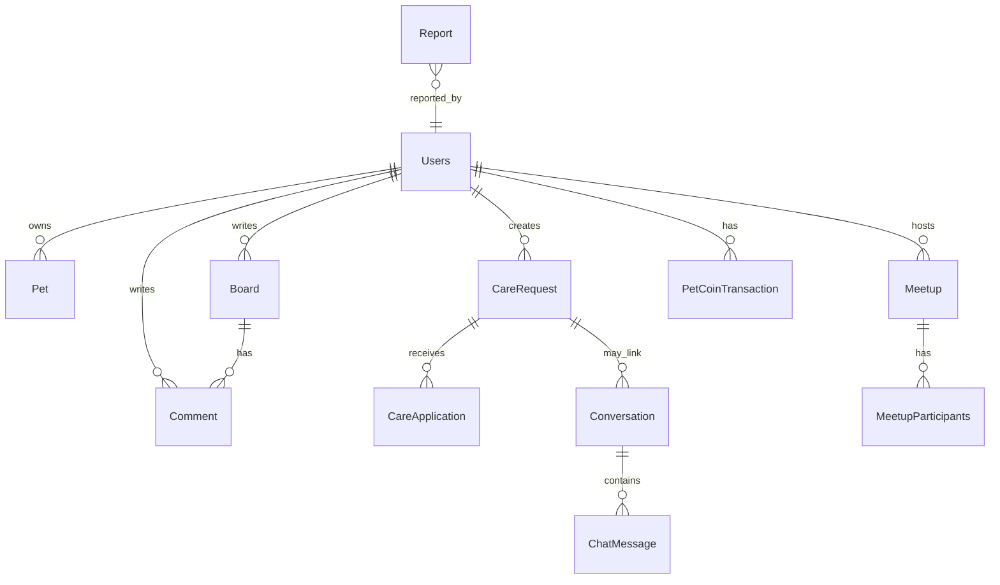

# Petory 도메인·프로젝트 구조 개요

백엔드(Spring)와 프론트엔드(React)에서 **기능이 어디에 모여 있는지**, **데이터(엔티티)가 어떻게 나뉘는지**를 한눈에 보기 위한 참고 문서입니다.  
(면접·온보딩·리팩터링 전 맥락 복기용으로 쓰기 좋게 정리했습니다.)

**도메인별 테이블·필드·enum 상세**는 [도메인별-데이터-구조.md](./도메인별-데이터-구조.md)를 참고하세요.

---

## 1. 백엔드: 패키지 루트

| 경로 | 역할 |
|------|------|
| `com.linkup.Petory` | 애플리케이션 진입점 `PetoryApplication` |
| `com.linkup.Petory.domain.*` | **도메인별** 컨트롤러·서비스·엔티티·리포지토리·DTO·예외 |
| `com.linkup.Petory.global.*` | **공통 횡단 관심사**: Security, Redis, WebSocket(STOMP), 전역 예외, AOP 로깅 등 |

도메인 패키지는 **기능 단위(바운디드 컨텍스트에 가까운 단위)**로 나뉘며, 각 패키지 안에서 전형적으로 `controller` → `service` → `repository`(또는 `Jpa*Adapter`) → `entity` 흐름을 따릅니다.

---

## 2. 백엔드: `domain` 하위 모듈 요약

| 패키지 | 한 줄 설명 | 대표 엔티티·데이터 |
|--------|------------|-------------------|
| **user** | 회원, 펫 프로필, 소셜 연동, 제재 | `Users`, `Pet`, `PetVaccination`, `SocialUser`, `UserSanction` |
| **board** | 커뮤니티 게시글·댓글·반응, 실종 제보, 인기 스냅샷·조회 로그 | `Board`, `Comment`, `BoardReaction`, `CommentReaction`, `MissingPetBoard`, `MissingPetComment`, `BoardPopularitySnapshot`, `BoardViewLog` |
| **care** | 펫 케어 요청·지원·리뷰·댓글 | `CareRequest`, `CareApplication`, `CareReview`, `CareRequestComment` |
| **chat** | 대화방·참여자·메시지(WebSocket과 연동) | `Conversation`, `ConversationParticipant`, `ChatMessage` |
| **meetup** | 산책/모임·참가자 | `Meetup`, `MeetupParticipants` |
| **location** | 위치 기반 서비스 등록·리뷰 | `LocationService`, `LocationServiceReview` |
| **payment** | 펫코인·에스크로·거래 내역 | `PetCoinTransaction`, `PetCoinEscrow` (+ `TransactionType`, `EscrowStatus` 등 enum) |
| **notification** | 알림( DB 영구 + Redis 캐시 전략과 연계) | `Notification` |
| **report** | 신고 접수·처리 흐름 | `Report` |
| **statistics** | 일별 집계(대시보드용) | `DailyStatistics` |
| **file** | 첨부 파일 메타데이터·스토리지 연동 | `AttachmentFile` |
| **activity** | 사용자 활동 피드(집계·조회 API; **별도 엔티티보다는 DTO·서비스 중심**) | `ActivityDTO`, `ActivityPageResponseDTO` 등 |
| **admin** | 관리자 REST API(각 도메인 서비스 호출) | 컨트롤러만 모음 (`Admin*Controller`) |
| **common** | 도메인 공통 베이스 | `BaseTimeEntity`(생성/수정 시각 등) |

**참고**

- **admin**은 스키마를 따로 두기보다, 기존 도메인 데이터를 관리자 권한으로 노출·수정하는 **API 레이어**에 가깝습니다.
- **activity**는 여러 도메인 이벤트/기록을 묶어 보여주는 **읽기 전용 성격**이 강합니다.

---

## 3. 백엔드: 주요 엔티티 관계(개념도)

정확한 FK·카디널리티는 각 `@Entity`를 보는 것이 정석이고, 여기서는 **협업 시 머릿속 그림**용으로만 요약합니다.

실제 매핑(`@ManyToOne`, `@OneToMany`, 연관 테이블)은 엔티티 클래스를 따라가면 됩니다.

---

## 4. 백엔드: `global` 레이어

| 영역 | 내용 |
|------|------|
| **global.security** | `SecurityConfig`, JWT·OAuth2와 맞물리는 설정, `RedisConfig`, `RestTemplateConfig`, `PasswordEncoderConfig` |
| **global.websocket** | STOMP 설정, 핸드셰이크·채널 인증, `StompPrincipal` |
| **global.exception** | `ApiException`, `GlobalExceptionHandler` |
| **global.aspect** | 예: 리포지토리 메서드 로깅(`RepositoryLoggingAspect`) |
| **global.annotation** | 예: `RepositoryMethod` |

인프라성 코드는 도메인 패키지에 섞지 않고 **global**에 모아 두는 패턴입니다.

---

## 5. 프론트엔드: `src` 폴더 역할

CRA 기준 루트는 `frontend/src/`입니다.

| 폴더 / 파일 | 역할 |
|-------------|------|
| **App.js** | 탭·라우팅에 가까운 상위 화면 전환, 전역 모달·이벤트(`window.redirectToLogin` 등) |
| **index.js** | React 엔트리 |
| **contexts/** | `AuthContext`(로그인·토큰), `ThemeContext`(테마) |
| **api/** | 백엔드 REST 호출 모듈(도메인별 파일). 예: `boardApi.js`, `careRequestApi.js`, `chatApi.js`, `authApi.js`, `adminApi.js` |
| **components/** | 화면·기능 단위 UI. 하위가 **도메인별 폴더**로 정리됨 |
| **hooks/** | `usePermission`, `useEmailVerification` 등 재사용 훅 |
| **styles/** | `theme.js` 등 전역 스타일 토큰 |
| **mock/** | 데모 모드·목 데이터 (`demoData.js`, `isDemoMode.js`) |

---

## 6. 프론트엔드: `components` 하위(기능 ↔ 백엔드 도메인 대응)

| 폴더 | UI 성격 | 대응하는 API·백엔드 영역(대략) |
|------|---------|------------------------------|
| **Auth/** | 로그인·회원가입·OAuth 콜백·닉네임·이메일 인증 페이지 | `user`, OAuth, `authApi.js` |
| **Layout/** | `Navigation` 등 앱 껍데기 | — |
| **Home/** | 홈 | 여러 API 조합 |
| **User/** | 유저 목록·프로필·모달 | `userApi.js` |
| **CareRequest/** | 케어 요청 목록·상세·폼 | `careRequestApi.js`, `careReviewApi.js` |
| **Community/** | 커뮤니티 보드·상세·댓글 드로어 | `boardApi.js`, `commentApi.js` |
| **MissingPet/** | 실종 제보 지도·폼·상세 | `missingPetApi.js` |
| **LocationService/** | 지도·서비스 등록·리뷰 연동 UI | `locationServiceApi.js`, `locationServiceReviewApi.js`, `geocodingApi.js` |
| **Meetup/** | 모임 페이지 | `meetupApi.js` |
| **Chat/** | 채팅 위젯·목록·방·탭 | `chatApi.js` |
| **Payment/** | 펫코인 충전·거래 내역 모달 | `paymentApi.js` |
| **Activity/** | 활동 피드 | `activityApi.js` |
| **Admin/** | 관리자 패널 + `sections/*` 로 기능별 섹션 | `adminApi.js`, `*AdminApi.js`, `fileAdminApi.js` 등 |
| **Common/** | 권한 거부·스크롤·페이지네이션·이메일 프롬프트 등 공통 | 여러 API |

**규칙으로 읽기**: `components/<기능>/` 화면은 대개 `api/<같은 이름 계열>.js`와 짝을 이룹니다. 관리자만 `*AdminApi.js` 또는 `adminApi.js`를 추가로 봅니다.

---

## 7. 데이터가 흐르는 전형적 경로(요약)

1. **브라우저** → `api/*.js`(Axios, `authApi` 인터셉터로 토큰·401 처리)  
2. **Spring** → `SecurityConfig`로 인증·인가 → `domain.*.controller`  
3. **서비스**에서 트랜잭션·도메인 규칙 → **JPA 엔티티** 영속화  
4. **Redis / SSE / WebSocket**은 알림·실시간 채팅 등에서 `global`·해당 도메인 서비스와 연결  

---

## 8. 이 문서를 어떻게 쓰면 좋은지

- **새 기능 추가**: 백엔드는 어느 `domain` 패키지에 엔티티를 둘지, 프론트는 `components` 폴더명과 `api` 파일명을 맞출지 먼저 결정  
- **버그 추적**: API 경로 → `*Controller` → `*Service` → `entity` / 프론트는 `api` → 해당 컴포넌트  
- **리팩터링**: `docs/refactoring/` 하위 문서와 함께 보면 배치·성능 변경 맥락을 잡기 쉽습니다  

---

*생성 기준: 저장소 트리와 엔티티 목록을 기준으로 정리했습니다. 패키지가 늘어나면 이 파일의 표만 갱신해 주세요.*
