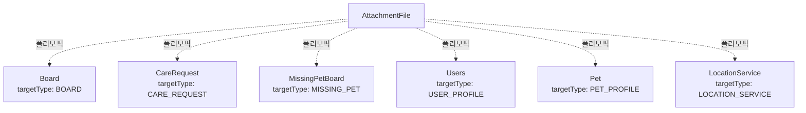

# File 도메인

## 개요

파일 업로드/다운로드 관리 도메인으로, 다양한 도메인에서 사용하는 파일을 통합 관리합니다.

## Entity 구조

### AttachmentFile (첨부 파일)

```java
@Entity
@Table(name = "file")
public class AttachmentFile {
    Long idx;                    // PK
    FileTargetType targetType;   // 대상 타입
    Long targetIdx;              // 대상 ID
    String filePath;             // 파일 경로
    String fileType;             // 파일 타입 (확장자)
    LocalDateTime createdAt;      // 업로드 일시
}
```

**연관관계:**
- `폴리모픽 관계` → Board, CareRequest, MissingPetBoard, Users, Pet, LocationService 등

## Enum 정의

### FileTargetType
```java
public enum FileTargetType {
    BOARD,              // 게시글
    CARE_REQUEST,       // 펫케어 요청
    MISSING_PET,        // 실종 동물 게시글
    USER_PROFILE,       // 사용자 프로필
    PET_PROFILE,        // 반려동물 프로필
    LOCATION_SERVICE    // 위치 서비스
}
```

## Service 주요 기능

### AttachmentFileService

#### 1. 파일 관리
```java
// 파일 업로드
FileDTO uploadFile(MultipartFile file, FileTargetType targetType, Long targetIdx)

// 파일 다운로드
Resource downloadFile(long fileId)

// 파일 삭제
void deleteFile(long fileId)

// 대상별 파일 목록 조회
List<FileDTO> getAttachments(FileTargetType targetType, Long targetIdx)

// 배치 파일 조회 (N+1 방지)
Map<Long, List<FileDTO>> getAttachmentsBatch(FileTargetType targetType, List<Long> targetIds)

// 파일 동기화 (기존 파일 삭제 후 새 파일 추가)
void syncSingleAttachment(FileTargetType targetType, Long targetIdx, String newFilePath, String oldFilePath)
```

### FileStorageService

#### 1. 파일 저장소 관리
```java
// 파일 저장 (로컬/S3)
String saveFile(MultipartFile file, FileTargetType targetType)

// 파일 삭제
void deleteFile(String filePath)

// 다운로드 URL 생성
String buildDownloadUrl(String filePath)
```

## 다른 도메인과의 연관관계

### AttachmentFile과 다른 도메인



### 주요 상호작용

#### 1. Board 도메인
- **Board → AttachmentFile (폴리모픽)**
  - 게시글에 이미지 첨부
  - targetType: BOARD, targetIdx: board.idx
  - 여러 이미지 첨부 가능

**예시:**
```java
// 게시글 작성 시 파일 첨부
@Transactional
public BoardDTO createBoard(BoardDTO dto, List<MultipartFile> files) {
    Board board = boardRepository.save(...);
    
    // 파일 업로드
    for (MultipartFile file : files) {
        fileService.uploadFile(file, FileTargetType.BOARD, board.getIdx());
    }
    
    return converter.toDTO(board);
}

// 게시글 조회 시 파일 목록
public BoardDTO getBoard(long id) {
    Board board = boardRepository.findById(id).orElseThrow();
    BoardDTO dto = converter.toDTO(board);
    
    // 파일 목록 조회
    List<FileDTO> files = fileService.getAttachments(FileTargetType.BOARD, board.getIdx());
    dto.setAttachments(files);
    
    return dto;
}
```

#### 2. Care 도메인
- **CareRequest → AttachmentFile (폴리모픽)**
  - 펫케어 요청에 펫 사진 첨부
  - targetType: CARE_REQUEST, targetIdx: careRequest.idx

**예시:**
```java
// 펫케어 요청 작성 시 펫 사진 첨부
@Transactional
public CareRequestDTO createCareRequest(CareRequestDTO dto, MultipartFile petPhoto) {
    CareRequest request = careRequestRepository.save(...);
    
    if (petPhoto != null) {
        fileService.uploadFile(petPhoto, FileTargetType.CARE_REQUEST, request.getIdx());
    }
    
    return converter.toDTO(request);
}
```

#### 3. Missing Pet 도메인
- **MissingPetBoard → AttachmentFile (폴리모픽)**
  - 실종 동물 게시글에 사진 첨부
  - targetType: MISSING_PET, targetIdx: missingPetBoard.idx

**예시:**
```java
// 실종 동물 신고 시 사진 첨부
@Transactional
public MissingPetBoardDTO createMissingPet(MissingPetBoardDTO dto, List<MultipartFile> photos) {
    MissingPetBoard board = missingPetBoardRepository.save(...);
    
    for (MultipartFile photo : photos) {
        fileService.uploadFile(photo, FileTargetType.MISSING_PET, board.getIdx());
    }
    
    return converter.toDTO(board);
}
```

#### 4. User 도메인
- **Users → AttachmentFile (폴리모픽: 프로필)**
  - 사용자 프로필 사진
  - targetType: USER_PROFILE, targetIdx: user.idx
  - 1개만 저장 (단일 파일)

**예시:**
```java
// 프로필 사진 업로드
@Transactional
public void updateProfileImage(long userId, MultipartFile image) {
    // 기존 프로필 사진 삭제
    List<FileDTO> existingFiles = fileService.getAttachments(FileTargetType.USER_PROFILE, userId);
    for (FileDTO file : existingFiles) {
        fileService.deleteFile(file.getIdx());
    }
    
    // 새 프로필 사진 업로드
    fileService.uploadFile(image, FileTargetType.USER_PROFILE, userId);
}
```

#### 5. Pet 도메인
- **Pet → AttachmentFile (폴리모픽: 프로필)**
  - 반려동물 프로필 사진
  - targetType: PET_PROFILE, targetIdx: pet.idx
  - 1개만 저장 (단일 파일)

**예시:**
```java
// 반려동물 프로필 사진 업로드
@Transactional
public PetDTO updatePetProfile(long petId, MultipartFile image) {
    Pet pet = petRepository.findById(petId).orElseThrow();
    
    // 기존 사진 삭제
    List<FileDTO> existingFiles = fileService.getAttachments(FileTargetType.PET_PROFILE, petId);
    for (FileDTO file : existingFiles) {
        fileService.deleteFile(file.getIdx());
    }
    
    // 새 사진 업로드
    fileService.uploadFile(image, FileTargetType.PET_PROFILE, petId);
    
    return converter.toDTO(pet);
}
```

#### 6. Location 도메인
- **LocationService → AttachmentFile (폴리모픽)**
  - 위치 서비스 대표 이미지
  - targetType: LOCATION_SERVICE, targetIdx: locationService.idx
  - 여러 이미지 첨부 가능

**예시:**
```java
// 위치 서비스 이미지 업로드
@Transactional
public LocationServiceDTO createLocationService(LocationServiceDTO dto, List<MultipartFile> images) {
    LocationService service = locationServiceRepository.save(...);
    
    for (MultipartFile image : images) {
        fileService.uploadFile(image, FileTargetType.LOCATION_SERVICE, service.getIdx());
    }
    
    return converter.toDTO(service);
}
```

## 비즈니스 로직

### 파일 저장 구조

```
uploads/
  board/
    2024/
      01/
        {uuid}_{filename}.jpg
  care_request/
    2024/
      01/
        {uuid}_{filename}.jpg
  missing_pet/
    2024/
      01/
        {uuid}_{filename}.jpg
  user_profile/
    2024/
      01/
        {uuid}_{filename}.jpg
  pet_profile/
    2024/
      01/
        {uuid}_{filename}.jpg
  location_service/
    2024/
      01/
        {uuid}_{filename}.jpg
```

### 파일 동기화

```java
// 게시글 수정 시 파일 동기화
@Transactional
public BoardDTO updateBoard(long id, BoardDTO dto, String newFilePath) {
    Board board = boardRepository.findById(id).orElseThrow();
    
    // 기존 파일 경로 조회
    List<FileDTO> existingFiles = fileService.getAttachments(FileTargetType.BOARD, id);
    String oldFilePath = existingFiles.isEmpty() ? null : existingFiles.get(0).getFilePath();
    
    // 파일 동기화 (기존 삭제, 새로 추가)
    fileService.syncSingleAttachment(
        FileTargetType.BOARD, 
        id, 
        newFilePath, 
        oldFilePath
    );
    
    return converter.toDTO(board);
}
```

## 성능 최적화

### 1. 배치 파일 조회 (N+1 방지)

```java
// 여러 게시글의 파일을 한 번에 조회
@Query("SELECT f FROM AttachmentFile f " +
       "WHERE f.targetType = :targetType AND f.targetIdx IN :targetIds")
List<AttachmentFile> findByTargetTypeAndTargetIds(
    @Param("targetType") FileTargetType targetType,
    @Param("targetIds") List<Long> targetIds
);

// Map으로 변환
public Map<Long, List<FileDTO>> getAttachmentsBatch(
    FileTargetType targetType, 
    List<Long> targetIds
) {
    List<AttachmentFile> files = fileRepository.findByTargetTypeAndTargetIds(targetType, targetIds);
    
    return files.stream()
        .collect(Collectors.groupingBy(
            AttachmentFile::getTargetIdx,
            Collectors.mapping(converter::toDTO, Collectors.toList())
        ));
}
```

### 2. 인덱싱

```sql
-- 대상별 파일 조회
CREATE INDEX idx_file_target 
ON file(target_type, target_idx);

-- 파일 타입별 조회
CREATE INDEX idx_file_type 
ON file(file_type);
```

### 3. 파일 저장소 최적화

#### 로컬 저장소
```java
// 파일 저장 경로
private String buildFilePath(FileTargetType targetType, String filename) {
    String datePath = LocalDate.now().format(DateTimeFormatter.ofPattern("yyyy/MM"));
    return String.format("uploads/%s/%s/%s", 
        targetType.name().toLowerCase(), 
        datePath, 
        UUID.randomUUID() + "_" + filename
    );
}
```

#### S3 저장소 (개선안)
```java
@Configuration
public class S3Config {
    
    @Bean
    public AmazonS3 amazonS3() {
        return AmazonS3ClientBuilder.standard()
            .withRegion(Regions.AP_NORTHEAST_2)
            .withCredentials(new AWSStaticCredentialsProvider(credentials))
            .build();
    }
}

@Service
public class S3FileStorageService implements FileStorageService {
    
    @Override
    public String saveFile(MultipartFile file, FileTargetType targetType) {
        String key = buildS3Key(targetType, file.getOriginalFilename());
        
        ObjectMetadata metadata = new ObjectMetadata();
        metadata.setContentType(file.getContentType());
        metadata.setContentLength(file.getSize());
        
        s3Client.putObject(
            new PutObjectRequest(bucketName, key, file.getInputStream(), metadata)
        );
        
        return key;
    }
}
```

## API 엔드포인트

### 파일 (/api/files)
- `POST /upload` - 파일 업로드
- `GET /{id}/download` - 파일 다운로드
- `DELETE /{id}` - 파일 삭제
- `GET /target/{targetType}/{targetId}` - 대상별 파일 목록

## 테스트 시나리오

### 1. 파일 업로드
- 게시글에 이미지 첨부
- 여러 이미지 첨부
- 파일 크기 제한 확인

### 2. 파일 동기화
- 게시글 수정 시 파일 교체
- 기존 파일 자동 삭제 확인

### 3. 배치 조회
- 여러 게시글의 파일을 한 번에 조회
- N+1 문제 해결 확인

## 개선 아이디어

### 기능
1. **이미지 리사이징**
   - 업로드 시 자동 리사이징
   - 썸네일 생성

2. **파일 압축**
   - 이미지 자동 압축
   - 용량 절감

3. **CDN 연동**
   - S3 + CloudFront
   - 빠른 다운로드 속도

### 성능
1. **비동기 업로드**
   - 대용량 파일 비동기 처리
   - 업로드 진행률 표시

2. **파일 캐싱**
   - 자주 조회되는 파일 캐싱
   - CDN 캐싱

3. **파일 정리**
   - 사용되지 않는 파일 자동 삭제
   - 주기적 정리 작업

