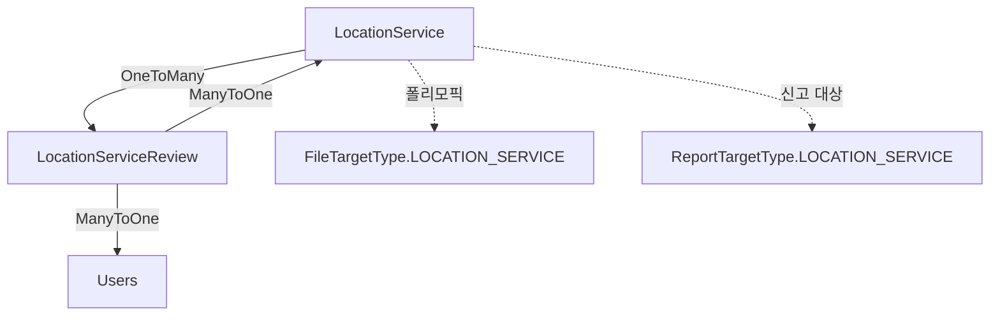

# Location 도메인

## 개요

위치 기반 서비스 (병원, 카페, 공원, 펫샵 등) 정보 제공 및 리뷰 관리 도메인입니다.

## Entity 구조

### 1. LocationService (위치 서비스)

```java
@Entity
@Table(name = "locationservice")
public class LocationService {
    // 기본 필드
    Long idx;                    // PK (bigint, auto_increment)
    String name;                 // 서비스 이름 (varchar(255))
    String category;             // 카테고리 (varchar(255)) - 기존 필드 유지
    String address;              // 주소 (varchar(255))
    String detailAddress;        // 상세 주소 (varchar(255))
    Double latitude;            // 위도 (double)
    Double longitude;            // 경도 (double)
    Double rating;               // 평균 평점 (double)
    String description;          // 서비스 설명 (varchar(255))
    String phone;                // 전화번호 (varchar(255))
    String website;              // 웹사이트 (varchar(255))
    Boolean petFriendly;         // 반려동물 동반 가능 여부 (tinyint(1), default 0)
    Point coordinates;           // 공간 좌표 (POINT, NOT NULL, Spatial Index)
    LocalDateTime createdAt;
    LocalDateTime updatedAt;
    
    // 카테고리 계층 구조
    String category1;             // 카테고리1 (대분류, varchar(100))
    String category2;             // 카테고리2 (중분류, varchar(100))
    String category3;             // 카테고리3 (소분류, varchar(100))
    
    // 주소 구성 요소
    String sido;                  // 시도 (varchar(50))
    String sigungu;              // 시군구 (varchar(50))
    String eupmyeondong;         // 읍면동 (varchar(50))
    String ri;                   // 리 (varchar(50))
    String bunji;                // 번지 (varchar(100))
    String roadName;             // 도로명 (varchar(100))
    String buildingNumber;       // 건물 번호 (varchar(50))
    String zipCode;              // 우편번호 (varchar(10))
    
    // 운영 정보
    String closedDay;             // 휴무일 (varchar(255))
    String operatingHours;       // 운영시간 (varchar(255)) - "월~금 09:00~18:00" 형식
    Boolean parkingAvailable;    // 주차 가능여부 (tinyint(1), default 0)
    
    // 가격 정보
    String priceInfo;            // 가격 정보 (varchar(255)) - 입장료, 이용료 등
    
    // 반려동물 상세 정보
    Boolean isPetOnly;           // 반려동물 전용 (tinyint(1))
    String petSize;              // 입장 가능 동물 크기 (varchar(100))
    String petRestrictions;      // 반려동물 제한사항 (varchar(255))
    String petExtraFee;          // 애견 동반 추가 요금 (varchar(255))
    
    // 장소 정보
    Boolean indoor;              // 실내 여부 (tinyint(1))
    Boolean outdoor;             // 실외 여부 (tinyint(1))
    
    // 메타데이터
    LocalDate lastUpdated;       // 최종작성일 (date)
    String dataSource;           // 데이터 출처 (varchar(50), default 'PUBLIC')
                                 // PUBLIC: 공공데이터, KAKAO: 카카오맵
}
```

**주요 변경사항:**
- `openingTime`, `closingTime` 제거 → `operatingHours` (문자열)로 통합
- `imageUrl` 제거 (사용하지 않음)
- `petPolicy` 제거 → `petRestrictions`로 통합
- 필드명 변경: `sidoName` → `sido`, `sigunguName` → `sigungu`, `eupmyeondongName` → `eupmyeondong`, `riName` → `ri`, `postalCode` → `zipCode`, `closedDays` → `closedDay`, `entranceFee` → `priceInfo`, `petOnly` → `isPetOnly`, `petSizeLimit` → `petSize`, `petAdditionalFee` → `petExtraFee`, `lastUpdatedDate` → `lastUpdated`
- 타입 변경: `parkingAvailable`, `isPetOnly`, `indoor`, `outdoor` → Boolean
- `coordinates` 필드 추가 (POINT 타입, Spatial Index)
- `category` 필드 유지 (기존 데이터 호환성)

**연관관계:**
- `OneToMany` → LocationServiceReview (리뷰 목록)
- `관계 없음` → AttachmentFile (폴리모픽: FileTargetType.LOCATION_SERVICE)

### 2. LocationServiceReview (위치 서비스 리뷰)

```java
@Entity
@Table(name = "locationservicereview")
public class LocationServiceReview {
    Long idx;                    // PK
    LocationService service;     // 서비스 (ManyToOne)
    Users user;                  // 작성자 (ManyToOne)
    Integer rating;              // 평점 (1-5)
    String comment;              // 리뷰 내용 (TEXT)
    LocalDateTime createdAt;
    LocalDateTime updatedAt;
}
```

**연관관계:**
- `ManyToOne` → LocationService
- `ManyToOne` → Users (리뷰 작성자)

## Service 주요 기능

### LocationServiceService

#### 1. 카카오맵 API 기반 장소 검색
```java
// 카카오맵 API를 통한 장소 검색
List<LocationServiceDTO> searchKakaoPlaces(
    String keyword,           // 검색 키워드
    String region,            // 지역 (예: "서울특별시")
    Double latitude,          // 위도
    Double longitude,         // 경도
    Integer radius,           // 반경 (미터)
    Integer maxResults,       // 최대 결과 수
    String categoryType       // 카테고리 타입 (HOSPITAL, CAFE, PLAYGROUND)
)
```

**주요 기능:**
- 카카오맵 API 연동을 통한 실시간 장소 검색
- 반려동물 관련 키워드 자동 추가 ("반려동물" 키워드 보강)
- 카테고리별 필터링 (병원, 카페, 놀이터)
- 반려동물 친화적 장소 자동 필터링
- 최대 200개 결과 반환

**카테고리 설정:**
- `HOSPITAL`: 동물병원, 수의, 반려동물병원
- `CAFE`: 애견카페, 반려동물카페, 펫카페
- `PLAYGROUND`: 애견놀이터, 반려동물 놀이터

#### 2. 데이터 변환 및 필터링
```java
// 카카오맵 Document를 LocationServiceDTO로 변환
LocationServiceDTO fromKakaoDocument(KakaoPlaceDTO.Document document)

// 반려동물 친화적 장소인지 판단
private boolean isLikelyPetFriendly(KakaoPlaceDTO.Document document)

// 카테고리 매칭 확인
private boolean matchesCategory(KakaoPlaceDTO.Document document, String categoryType)
```

### LocationServiceAdminService

#### 1. 카카오맵 데이터 초기 로드
```java
// 카카오맵 API를 통한 초기 데이터 로드
LocationServiceLoadResponse loadInitialData(
    String region,                    // 지역 (기본값: "서울특별시")
    Integer maxResultsPerKeyword,     // 키워드당 최대 결과 수
    String customKeywords             // 커스텀 키워드 (쉼표 구분)
)
```

**주요 기능:**
- 기본 키워드 목록 사용 (반려동물카페, 펫카페, 동물병원 등)
- 커스텀 키워드 지원 (최대 20개)
- 중복 체크 (이름 + 주소 조합)
- 배치 저장 (최대 50개 제한)
- 카카오맵 데이터는 `dataSource = "KAKAO"`로 저장

**데이터 변환:**
- 카테고리명을 " > " 구분자로 분리하여 category1, category2, category3에 저장
- 지번주소 → `address`, 도로명주소 → `detailAddress`
- `category` 필드에 category3 값 저장

### LocationServiceConverter

#### 1. 엔티티 ↔ DTO 변환
```java
// LocationService → LocationServiceDTO
LocationServiceDTO toDTO(LocationService service)

// LocationServiceDTO → LocationService
LocationService fromDTO(LocationServiceDTO dto)

// KakaoPlaceDTO.Document → LocationServiceDTO
LocationServiceDTO fromKakaoDocument(KakaoPlaceDTO.Document document)
```

**필드 매핑 전략:**
- **카테고리**: `category` 필드 우선 사용, 없으면 category3 → category2 → category1 순서
- **운영시간**: `operatingHours` 문자열로 저장 (예: "월~금 09:00~18:00")
  - 하위 호환성: `openingTime`/`closingTime`이 있으면 `operatingHours` 문자열로 변환
- **반려동물 정책**: `petRestrictions` 사용, `petPolicy`는 하위 호환성 유지
- **주소**: 도로명주소 우선, 없으면 지번주소를 `address`에 저장
- **데이터 소스**: `dataSource` 필드로 구분 (PUBLIC: 공공데이터, KAKAO: 카카오맵)

### PublicDataLocationService

#### 1. 공공데이터 CSV 임포트
```java
// CSV 파일에서 공공데이터를 읽어서 LocationService 엔티티로 변환하여 배치 저장
@Transactional
BatchImportResult importFromCsv(String csvFilePath)
```

**주요 기능:**
- **CSV 파일 파싱**: 쉼표 구분, 따옴표 처리 (CSV 표준 형식)
- **데이터 검증**: 필수 필드 체크 (시설명, 주소)
- **중복 체크**: 
  - 메모리 내 중복 체크 (이름 + 주소 조합)
  - DB 중복 체크 (이름 + 도로명주소 또는 지번주소)
- **배치 저장**: 1000개씩 청크 단위로 저장 (메모리 효율성)
- **데이터 변환**:
  - Boolean 필드 자동 변환 (Y/N → true/false)
  - 날짜 파싱 (yyyy-MM-dd 형식)
  - 위도/경도 파싱 (Double 변환)
  - 운영시간 문자열 그대로 저장 ("월~금 09:00~18:00")
- **에러 처리**: 개별 라인 에러가 발생해도 계속 진행
- **진행 상황 로깅**: 배치 저장마다 로그 출력

**CSV 필드 순서 (31개 필드):**
```
시설명,카테고리1,카테고리2,카테고리3,시도명칭,시군구명칭,법정읍면동명칭,리명칭,번지,도로명이름,건물번호,위도,경도,우편번호,도로명주소,지번주소,전화번호,홈페이지,휴무일,운영시간,주차가능여부,입장가격정보,반려동물동반가능정보,반려동물전용정보,입장가능동물크기,반려동물제한사항,장소실내여부,장소실외여부,기본정보장소설명,애견동반추가요금,최종작성일
```

**데이터 매핑 로직:**
- 카테고리: category3 우선, 없으면 category2, category1 순서로 `category` 필드에 저장
- 주소: 도로명주소 우선 → `address`, 도로명주소 → `detailAddress`
- 운영시간: `operatingHours` 문자열로 그대로 저장 (파싱 없음)
- 반려동물 정보: `petFriendly` (Boolean), `isPetOnly` (Boolean), `petSize`, `petRestrictions`, `petExtraFee`
- 장소 정보: `indoor` (Boolean), `outdoor` (Boolean)
- 메타데이터: `dataSource = "PUBLIC"`, `lastUpdated` (날짜)

**배치 임포트 결과:**
```java
public class BatchImportResult {
    int totalRead;      // 총 읽은 라인 수
    int saved;          // 저장된 개수
    int duplicate;     // 중복으로 스킵된 개수
    int skipped;        // 검증 실패로 스킵된 개수
    int error;          // 에러 발생 개수
}
```

**성능 최적화:**
- 청크 단위 배치 저장으로 트랜잭션 오버헤드 최소화
- 메모리 내 중복 체크로 DB 쿼리 감소
- 진행 상황 실시간 로깅으로 모니터링 가능

### LocationServiceReviewService

#### 1. 리뷰 관리
```java
// 리뷰 작성
LocationServiceReviewDTO createReview(LocationServiceReviewDTO dto)

// 리뷰 목록 조회 (서비스별)
List<LocationServiceReviewDTO> getReviewsByService(long serviceId)

// 리뷰 목록 조회 (사용자별)
List<LocationServiceReviewDTO> getReviewsByUser(long userId)

// 리뷰 수정
LocationServiceReviewDTO updateReview(long reviewId, LocationServiceReviewDTO dto)

// 리뷰 삭제
void deleteReview(long reviewId)

// 평균 평점 계산 및 업데이트
void updateServiceRating(long serviceId)
```

## 다른 도메인과의 연관관계

### LocationService와 다른 도메인



### 주요 상호작용

#### 1. User 도메인
- **Users → LocationServiceReview (ManyToOne)**
  - Users가 위치 서비스에 리뷰 작성
  - 리뷰 작성 시 사용자 정보 필요
  - 사용자별 리뷰 이력 조회 가능

**예시:**
```java
// 사용자가 작성한 리뷰 목록
List<LocationServiceReview> userReviews = reviewRepository.findByUser(user);
```

#### 2. File 도메인
- **LocationService → AttachmentFile (폴리모픽)**
  - LocationService의 대표 이미지 저장
  - FileTargetType.LOCATION_SERVICE로 구분
  - 여러 이미지 첨부 가능

**예시:**
```java
// 위치 서비스의 이미지 조회
List<AttachmentFile> images = fileService.getAttachments(
    FileTargetType.LOCATION_SERVICE, 
    locationService.getIdx()
);
```

#### 3. Report 도메인
- **LocationService → Report (폴리모픽)**
  - 부적절한 위치 서비스 정보 신고
  - ReportTargetType.LOCATION_SERVICE로 구분
  - 신고 처리 시 서비스 정보 숨김/삭제 가능

**예시:**
```java
// 위치 서비스 신고 접수
Report report = Report.builder()
    .targetType(ReportTargetType.LOCATION_SERVICE)
    .targetIdx(locationService.getIdx())
    .reporter(reporter)
    .reason("부정확한 정보")
    .build();
```

#### 4. Statistics 도메인
- **LocationService → DailyStatistics (간접)**
  - 일별 통계에 위치 서비스 수 포함
  - 리뷰 작성 수 집계

### LocationServiceReview와 다른 도메인

#### 1. LocationService 도메인
- **LocationServiceReview → LocationService (ManyToOne)**
  - 리뷰는 반드시 하나의 서비스에 속함
  - 리뷰 작성 시 서비스의 평균 평점 자동 업데이트
  - 서비스 삭제 시 리뷰도 함께 삭제 (CascadeType.ALL)

**예시:**
```java
// 리뷰 작성 후 평균 평점 업데이트
@Transactional
public LocationServiceReviewDTO createReview(LocationServiceReviewDTO dto) {
    LocationServiceReview review = reviewRepository.save(...);
    
    // 평균 평점 재계산
    Double avgRating = reviewRepository.calculateAverageRating(review.getService().getIdx());
    review.getService().setRating(avgRating);
    locationServiceRepository.save(review.getService());
    
    return converter.toDTO(review);
}
```

#### 2. User 도메인
- **LocationServiceReview → Users (ManyToOne)**
  - 리뷰 작성자 정보
  - 사용자별 리뷰 이력 조회
  - 리뷰 수정/삭제 권한 체크

## 비즈니스 로직

### 평균 평점 계산

```java
@Query("SELECT AVG(r.rating) FROM LocationServiceReview r WHERE r.service.idx = :serviceId")
Double calculateAverageRating(@Param("serviceId") Long serviceId);
```

**자동 업데이트 시점:**
- 리뷰 작성 시
- 리뷰 수정 시 (평점 변경)
- 리뷰 삭제 시

### 위치 기반 검색

#### Haversine 공식
```java
private double calculateDistance(double lat1, double lng1, double lat2, double lng2) {
    final int R = 6371; // 지구 반경 (km)
    
    double dLat = Math.toRadians(lat2 - lat1);
    double dLng = Math.toRadians(lng2 - lng1);
    
    double a = Math.sin(dLat / 2) * Math.sin(dLat / 2) +
               Math.cos(Math.toRadians(lat1)) * Math.cos(Math.toRadians(lat2)) *
               Math.sin(dLng / 2) * Math.sin(dLng / 2);
    
    double c = 2 * Math.atan2(Math.sqrt(a), Math.sqrt(1 - a));
    
    return R * c;
}
```

#### Native Query (MySQL Spatial)
```java
// coordinates POINT 필드 사용 (권장)
@Query(value = 
    "SELECT * FROM locationservice " +
    "WHERE ST_Distance_Sphere(coordinates, ST_GeomFromText(CONCAT('POINT(', :lng, ' ', :lat, ')'), 4326)) <= :radiusMeters " +
    "AND pet_friendly = true " +
    "ORDER BY rating DESC",
    nativeQuery = true)
List<LocationService> findByLocationWithin(
    @Param("lat") double lat, 
    @Param("lng") double lng, 
    @Param("radiusMeters") double radiusMeters
);

// 또는 위도/경도 직접 사용
@Query(value = 
    "SELECT * FROM locationservice " +
    "WHERE ST_Distance_Sphere(point(longitude, latitude), point(:lng, :lat)) <= :radiusMeters " +
    "AND pet_friendly = true " +
    "ORDER BY rating DESC",
    nativeQuery = true)
List<LocationService> findByLocationWithinUsingLatLng(
    @Param("lat") double lat, 
    @Param("lng") double lng, 
    @Param("radiusMeters") double radiusMeters
);
```

## 성능 최적화

### 1. 인덱싱

```sql
-- 위치 기반 검색 (Spatial Index - coordinates 필드)
-- coordinates는 POINT 타입이므로 자동으로 Spatial Index 생성됨

-- 카테고리별 조회
CREATE INDEX idx_category ON locationservice(category1, category2, category3);
CREATE INDEX idx_location_service_category ON locationservice(category, pet_friendly);

-- 평점 정렬
CREATE INDEX idx_location_service_rating ON locationservice(rating DESC);

-- 위치 기반 검색 (위도/경도)
CREATE INDEX idx_lat_lng ON locationservice(latitude, longitude);

-- 반려동물 필터링
CREATE INDEX idx_pet_friendly ON locationservice(pet_friendly);

-- 데이터 소스 구분
CREATE INDEX idx_data_source ON locationservice(data_source);

-- 리뷰 조회
CREATE INDEX idx_location_review_service 
ON locationservicereview(service_idx, created_at DESC);

CREATE INDEX idx_location_review_user 
ON locationservicereview(user_idx, created_at DESC);
```

### 2. 캐싱

```java
// 인기 위치 서비스 캐싱
@Cacheable(value = "popularLocationServices", key = "#category")
public List<LocationServiceDTO> getPopularLocationServices(String category) {
    return locationServiceRepository.findTop10ByCategoryOrderByRatingDesc(category);
}
```

### 3. N+1 문제 해결

```java
// 리뷰와 작성자 정보를 함께 조회
@Query("SELECT r FROM LocationServiceReview r " +
       "JOIN FETCH r.user " +
       "WHERE r.service.idx = :serviceId " +
       "ORDER BY r.createdAt DESC")
List<LocationServiceReview> findByServiceWithUser(@Param("serviceId") Long serviceId);
```

## API 엔드포인트

### 위치 서비스 (/api/location-services)
- `GET /search` - 카카오맵 API를 통한 장소 검색
  - **파라미터:**
    - `keyword` (선택): 검색 키워드 (예: "반려동물카페")
    - `region` (선택): 지역 (예: "서울특별시")
    - `latitude` (선택): 위도
    - `longitude` (선택): 경도
    - `radius` (선택): 반경 (미터)
    - `size` (선택): 최대 결과 수 (기본값: 200)
    - `categoryType` (선택): 카테고리 타입 (HOSPITAL, CAFE, PLAYGROUND)
  - **반환:** `{ services: LocationServiceDTO[], count: number }`
  - **기능:** 카카오맵 API 연동, 반려동물 친화적 장소 자동 필터링

### 위치 서비스 관리자 (/api/admin/location-services)
- `POST /load-data` - 카카오맵 API를 통한 초기 데이터 로드
  - **파라미터:**
    - `region` (기본값: "서울특별시"): 검색할 지역
    - `maxResultsPerKeyword` (기본값: 10): 키워드당 최대 결과 수
    - `customKeywords` (선택): 커스텀 키워드 (쉼표 구분, 최대 20개)
  - **반환:** `LocationServiceLoadResponse` (저장 통계)
  - **기능:** 기본 키워드 목록 또는 커스텀 키워드로 장소 검색 및 저장

- `POST /import-public-data` - 공공데이터 CSV 파일 임포트
  - **파라미터:**
    - `csvFilePath` (필수): CSV 파일의 절대 경로 또는 상대 경로
  - **반환:** `BatchImportResult` (저장 통계)
    ```json
    {
      "totalRead": 70000,
      "saved": 65000,
      "duplicate": 3000,
      "skipped": 1500,
      "error": 500
    }
    ```
  - **기능:** 
    - CSV 파일 파싱 및 배치 저장 (1000개씩)
    - 중복 체크 (이름 + 주소)
    - 데이터 검증 및 변환
    - 진행 상황 로깅

### 위치 서비스 리뷰 (/api/location/services/{serviceId}/reviews)
- `GET /` - 리뷰 목록
- `POST /` - 리뷰 작성
- `PUT /{reviewId}` - 리뷰 수정
- `DELETE /{reviewId}` - 리뷰 삭제
- `GET /me` - 내 리뷰 목록

## 테스트 시나리오

### 1. 위치 기반 검색
- 현재 위치 기준 1km 반경 내 서비스 조회
- 반려동물 동반 가능 필터 적용
- 평점 순 정렬

### 2. 리뷰 시스템
- 리뷰 작성 → 평균 평점 자동 업데이트
- 리뷰 수정 (평점 변경) → 평균 평점 재계산
- 리뷰 삭제 → 평균 평점 재계산

### 3. 권한 관리
- 일반 사용자: 리뷰 작성/수정/삭제 (본인만)
- 관리자: 서비스 생성/수정/삭제

## 주요 변경사항 요약

### 엔티티 구조 최적화 (2024년 최신 업데이트)
1. **필드 통합 및 제거**:
   - `openingTime`/`closingTime` → `operatingHours` (문자열로 통합)
   - `petPolicy` → `petRestrictions`로 통합
   - `imageUrl` 필드 제거
   - `description` 필드 제거 (DB에는 유지, 엔티티에서 제거)

2. **데이터 타입 최적화**:
   - `parkingAvailable`, `isPetOnly`, `indoor`, `outdoor`: String(Y/N) → Boolean
   - 메모리 효율성 향상 (10바이트 → 1바이트)

3. **카테고리 계층 구조**:
   - `category1`, `category2`, `category3` 필드 추가
   - `category` 필드 유지 (하위 호환성)

4. **상세 주소 정보**:
   - `sido`, `sigungu`, `eupmyeondong`, `ri`, `bunji`, `roadName`, `buildingNumber` 추가
   - `zipCode` 추가

5. **운영 정보 확장**:
   - `closedDay`, `operatingHours`, `parkingAvailable`, `priceInfo` 추가

6. **반려동물 정보 확장**:
   - `isPetOnly`, `petSize`, `petRestrictions`, `petExtraFee` 추가

7. **데이터 소스 구분**:
   - `dataSource` 필드 추가 ("PUBLIC" 또는 "KAKAO")
   - `lastUpdated` 필드 추가

### 서비스 로직 개선
1. **PublicDataLocationService**:
   - CSV 파일 배치 임포트 기능 추가
   - 약 7만개 공공데이터 처리 가능
   - 중복 체크 및 데이터 검증 로직 강화

2. **LocationServiceAdminService**:
   - 카카오맵 API 초기 데이터 로드 기능
   - 커스텀 키워드 지원

3. **LocationServiceConverter**:
   - 모든 필드 매핑 로직 추가
   - 카테고리 우선순위 처리 (category → category3 → category2 → category1)
   - 운영시간 문자열 처리

### API 엔드포인트 추가
1. **관리자 API**:
   - `POST /api/admin/location-services/load-data`: 카카오맵 데이터 로드
   - `POST /api/admin/location-services/import-public-data`: 공공데이터 CSV 임포트

### 프론트엔드 변경
1. **LocationServiceForm.js**:
   - 운영시간 입력 방식 변경 (time → 문자열)
   - 새로운 필드 추가 (카테고리 3단계, 휴무일, 가격 정보 등)
   - 체크박스 필드 추가 (주차 가능, 반려동물 정보, 실내/실외)

2. **locationServiceApi.js**:
   - 관리자용 CRUD 메서드 추가

## 개선 아이디어

### 기능
1. **지도 시각화**
   - 지도에 위치 서비스 표시
   - 클러스터링 (Zoom 레벨별)

2. **추천 시스템**
   - 사용자 위치 기반 추천
   - 평점 기반 추천
   - 카테고리별 추천

3. **리뷰 사진**
   - 리뷰에 이미지 첨부
   - 다중 이미지 업로드

### 성능
1. **ElasticSearch 도입**
   - 위치 기반 검색 성능 향상
   - 복잡한 필터링 지원

2. **Redis 캐싱**
   - 인기 서비스 목록 캐싱
   - 평균 평점 캐싱

3. **CDN**
   - 이미지 CDN 사용
   - 로딩 속도 개선

## 공공데이터 연동

### 데이터 소스 구분
- **PUBLIC**: 공공데이터 포털에서 제공하는 반려동물 관련 시설 정보
  - 약 7만개의 상세한 시설 정보
  - 3단계 카테고리 분류
  - 상세 주소 구성 요소
  - 운영 정보, 반려동물 정책 등 풍부한 정보
- **KAKAO**: 카카오맵 API를 통한 실시간 장소 검색 결과
  - 실시간 검색 가능
  - 기본 정보만 저장 (이름, 주소, 좌표, 전화번호 등)

### 공공데이터 필드 매핑
공공데이터의 풍부한 정보를 LocationService 엔티티에 저장:

#### 카테고리 계층 구조
- `category1`: 대분류 (예: "반려동물업")
- `category2`: 중분류 (예: "반려의료")
- `category3`: 소분류 (예: "동물약국")
- `category`: category3 우선 저장 (하위 호환성)

#### 주소 정보
- **상세 주소 구성 요소**: sido, sigungu, eupmyeondong, ri, bunji, road_name, building_number
- **주소 전체**: address (도로명주소 우선), detail_address (도로명주소), zip_code
- **주소 통합 전략**: 도로명주소가 있으면 우선 사용, 없으면 지번주소 사용

#### 운영 정보
- `closed_day`: 휴무일 (예: "매주 토, 일, 법정공휴일")
- `operating_hours`: 운영시간 문자열 (예: "월~금 09:00~18:00")
- `parking_available`: 주차 가능여부 (Boolean)
- `price_info`: 가격 정보 (예: "입장료 5,000원")

#### 반려동물 정보
- `pet_friendly`: 반려동물 동반 가능 (Boolean)
- `is_pet_only`: 반려동물 전용 (Boolean)
- `pet_size`: 입장 가능 동물 크기 (예: "소형견, 중형견")
- `pet_restrictions`: 반려동물 제한사항 (예: "목줄 필수")
- `pet_extra_fee`: 애견 동반 추가 요금 (예: "소형견 3,000원")

#### 장소 특성
- `indoor`: 실내 여부 (Boolean)
- `outdoor`: 실외 여부 (Boolean)

#### 메타데이터
- `last_updated`: 최종작성일 (Date)
- `data_source`: 데이터 출처 ("PUBLIC" 또는 "KAKAO")

### 데이터 타입 최적화
- **Boolean 필드**: `pet_friendly`, `parking_available`, `is_pet_only`, `indoor`, `outdoor` (tinyint(1))
  - 메모리 효율성: String(Y/N) 10바이트 → Boolean 1바이트
- **문자열 필드**: 운영시간은 `operating_hours`에 문자열로 저장 ("월~금 09:00~18:00")
  - 파싱 오버헤드 없음, 다양한 형식 지원
- **공간 데이터**: `coordinates` 필드에 POINT 타입으로 저장 (Spatial Index 활용)
  - MySQL Spatial 함수 사용 가능 (ST_Distance_Sphere 등)

### 카카오맵 데이터 저장 전략
- **기본 필드만 저장**: name, category, address, detailAddress, latitude, longitude, phone, website, description, petFriendly
- **카테고리 파싱**: 카테고리명을 " > " 구분자로 분리
  - 예: "음식점 > 카페 > 애견카페" → category1: "음식점", category2: "카페", category3: "애견카페"
- **공공데이터 필드**: null (상세 정보 없음)
- **dataSource**: "KAKAO"로 설정하여 구분

### 배치 임포트 프로세스
1. **CSV 파일 읽기**: BufferedReader로 라인별 읽기
2. **헤더 라인 스킵**: 첫 번째 라인은 컬럼명이므로 제외
3. **라인별 파싱**: 
   - CSV 필드 파싱 (쉼표 구분, 따옴표 처리)
   - PublicDataLocationDTO로 변환
4. **데이터 검증**: 
   - 필수 필드 체크 (시설명, 주소)
   - 유효하지 않은 데이터는 스킵
5. **중복 체크**: 
   - 메모리 내 Set으로 중복 체크 (이름 + 주소)
   - DB 쿼리로 중복 확인 (이름 + 도로명주소 또는 지번주소)
6. **엔티티 변환**: 
   - Boolean 필드 변환 (Y/N → true/false)
   - 날짜 파싱 (yyyy-MM-dd)
   - 위도/경도 파싱
   - 카테고리 통합 (category3 → category2 → category1)
   - 주소 통합 (도로명주소 우선)
7. **배치 저장**: 
   - 1000개씩 청크 단위로 `saveAll()` 호출
   - 각 청크마다 트랜잭션 커밋
   - 진행 상황 로깅
8. **결과 통계 반환**: 총 읽음, 저장, 중복, 스킵, 에러 개수

### 데이터 소스별 저장 전략

#### 카카오맵 데이터 (dataSource = "KAKAO")
- **저장 필드**: 기본 필드만 (name, category, address, detailAddress, latitude, longitude, phone, website, description, petFriendly)
- **카테고리**: 카테고리명을 " > " 구분자로 분리하여 category1, category2, category3에 저장
- **주소**: 지번주소 → address, 도로명주소 → detailAddress
- **공공데이터 필드**: null (상세 주소 정보, 운영 정보 등)

#### 공공데이터 (dataSource = "PUBLIC")
- **저장 필드**: 모든 필드 저장
- **카테고리**: category1, category2, category3 모두 저장, category 필드에는 category3 우선 저장
- **주소**: 상세 주소 구성 요소 모두 저장 (sido, sigungu, eupmyeondong, ri, bunji, roadName, buildingNumber)
- **운영 정보**: closedDay, operatingHours, parkingAvailable, priceInfo
- **반려동물 정보**: isPetOnly, petSize, petRestrictions, petExtraFee
- **장소 정보**: indoor, outdoor

### LocationServiceConverter 주요 로직

#### toDTO (엔티티 → DTO)
```java
public LocationServiceDTO toDTO(LocationService service) {
    // 카테고리: category 필드 우선, 없으면 category3 → category2 → category1
    String category = service.getCategory() != null ? service.getCategory() :
                     service.getCategory3() != null ? service.getCategory3() :
                     service.getCategory2() != null ? service.getCategory2() :
                     service.getCategory1();
    
    return LocationServiceDTO.builder()
        .category(category)
        .category1(service.getCategory1())
        .category2(service.getCategory2())
        .category3(service.getCategory3())
        .operatingHours(service.getOperatingHours()) // 문자열 그대로 전달
        .petRestrictions(service.getPetRestrictions())
        .petPolicy(service.getPetRestrictions()) // 하위 호환성
        // ... 모든 필드 매핑
        .build();
}
```
- **카테고리**: category 필드 우선, 없으면 category3 → category2 → category1
- **운영시간**: operatingHours 문자열 그대로 전달 (파싱 없음)
- **하위 호환성**: openingTime/closingTime은 null로 설정 (deprecated)
- **모든 필드 매핑**: 엔티티의 모든 필드를 DTO에 매핑

#### fromDTO (DTO → 엔티티)
```java
public LocationService fromDTO(LocationServiceDTO dto) {
    // 운영시간: operatingHours 우선, 없으면 openingTime/closingTime에서 생성
    String operatingHours = dto.getOperatingHours();
    if (operatingHours == null && dto.getOpeningTime() != null && dto.getClosingTime() != null) {
        operatingHours = String.format("%02d:%02d~%02d:%02d", ...);
    }
    
    // 카테고리: category3 우선, 없으면 category 필드를 category3에 저장
    String categoryValue = dto.getCategory3() != null ? dto.getCategory3() : 
                          dto.getCategory2() != null ? dto.getCategory2() :
                          dto.getCategory1() != null ? dto.getCategory1() : dto.getCategory();
    
    return LocationService.builder()
        .category(categoryValue) // category 필드도 설정
        .category3(dto.getCategory3() != null ? dto.getCategory3() : dto.getCategory())
        .operatingHours(operatingHours)
        .petRestrictions(dto.getPetRestrictions() != null ? dto.getPetRestrictions() : dto.getPetPolicy())
        // ... 모든 필드 매핑
        .build();
}
```
- **카테고리**: category3 우선, 없으면 category 필드를 category3에 저장
- **운영시간**: operatingHours 우선, 없으면 openingTime/closingTime에서 문자열 생성
- **반려동물 정책**: petRestrictions 우선, 없으면 petPolicy 사용
- **데이터 소스**: 기본값 "KAKAO" (공공데이터는 "PUBLIC"으로 명시)

#### fromKakaoDocument (카카오맵 → DTO)
```java
public LocationServiceDTO fromKakaoDocument(KakaoPlaceDTO.Document document) {
    return LocationServiceDTO.builder()
        .externalId(document.getId()) // 카카오맵 place ID
        .name(document.getPlaceName())
        .category(document.getCategoryName())
        .address(document.getAddressName()) // 지번주소
        .detailAddress(document.getRoadAddressName()) // 도로명주소
        .latitude(parseDouble(document.getY()))
        .longitude(parseDouble(document.getX()))
        .phone(document.getPhone())
        .website(document.getPlace_url())
        .placeUrl(document.getPlace_url()) // 카카오맵 URL
        .petFriendly(true) // 카카오맵 검색 결과는 모두 반려동물 친화적
        .build();
}
```
- 카카오맵 Document를 LocationServiceDTO로 변환
- externalId에 카카오맵 place ID 저장
- placeUrl에 카카오맵 URL 저장
- 운영시간 정보 없음 (null)

## 프론트엔드 변경사항

### LocationServiceForm.js
- **운영시간 입력 방식 변경**: 
  - 기존: `openingTime`/`closingTime` (time 타입 입력)
  - 변경: `operatingHours` (문자열 입력, 예: "월~금 09:00~18:00")
- **새로운 필드 추가**:
  - 카테고리 3단계 입력 (category1, category2, category3)
  - 휴무일 (closedDay)
  - 가격 정보 (priceInfo)
  - 주차 가능 여부 (parkingAvailable) - 체크박스
  - 반려동물 정보 (petFriendly, isPetOnly, petSize, petRestrictions, petExtraFee)
  - 실내/실외 여부 (indoor, outdoor) - 체크박스
- **제거된 필드**: imageUrl

### locationServiceApi.js
- **추가된 메서드**:
  - `createService(serviceData)`: 위치 서비스 생성 (관리자용)
  - `updateService(id, serviceData)`: 위치 서비스 수정 (관리자용)
  - `deleteService(id)`: 위치 서비스 삭제 (관리자용)

### LocationServiceMap.js
- **변경 없음**: 카테고리 필드는 DTO에서 제공되므로 기존 로직 유지

