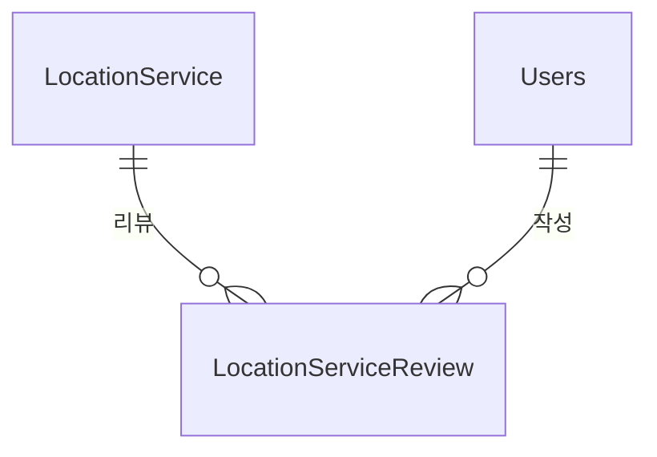

# Location 도메인 - 포트폴리오 상세 설명

## 1. 개요

Location 도메인은 위치 기반 서비스 (병원, 카페, 공원, 펫샵 등) 정보 제공 및 리뷰 관리 도메인입니다. 지역 계층적 탐색, 위치 기반 검색, 거리 계산, 네이버맵 API 연동을 통해 사용자에게 위치 기반 서비스를 제공합니다.

**주요 기능**:
- 지역 계층적 탐색 (시도 → 시군구 → 읍면동 → 도로명)
- 위치 기반 반경 검색 (ST_Distance_Sphere 사용, 기본 5km)
- 카테고리별 서비스 검색
- 거리 계산 (Haversine 공식)
- 하이브리드 데이터 로딩 전략 (초기 로드 + 클라이언트 필터링)
- 위치 서비스 리뷰 시스템
- 공공데이터 CSV 배치 임포트
- 네이버맵 API 연동:
  - 주소-좌표 변환(Geocoding)
  - 좌표-주소 변환(역지오코딩)
  - 길찾기(Directions API)
- **UX 설계 원칙**:
  - **"지도는 상태를 바꾸지 않는다"**: 지도 이동 시 자동 API 호출 제거, "이 지역 검색" 버튼으로 사용자 확인 후 실행
  - **InitialLoadSearch vs UserTriggeredSearch 분리**: 시스템 주도 vs 사용자 주도 검색 구분
  - **빈 상태 UX 처리**: 검색 결과 0개, 위치 권한 거부, 너무 넓은 범위 시 명확한 안내 및 대안 제시
  - **개별 핀 마커 표시**: 클러스터링을 제거하고 모든 장소를 개별 핀(Pin)으로 표시하여 직관성 확보
  - **마커-리스트 동기화**: 양방향 스크롤 및 하이라이트로 사용자 경험 향상

---

## 2. 기능 설명

### 2.1 지역 계층적 탐색

**탐색 프로세스**:
1. 시도 선택 (전국 17개 시도)
2. 시군구 선택 (선택된 시도의 시군구)
3. 해당 지역의 서비스 목록 표시

**우선순위**: roadName > eupmyeondong > sigungu > sido > 전체

### 2.2 위치 기반 반경 검색 (초기 로드용)

**검색 프로세스**:
1. 사용자 위치 확인 (GPS 또는 수동 입력)
2. 반경 설정 (기본값: 5km)
3. ST_Distance_Sphere를 사용한 반경 내 서비스 조회
4. 거리순 정렬 (선택적)
5. 카테고리 필터링 (선택적)

**특징 (제한적 사용)**:
- **사용 시점**: 앱 초기 진입 시 사용자 주변 정보 제공 목적으로만 사용
- **DB 쿼리**: `ST_Distance_Sphere` 함수 사용
- **한계**: 지도 이동 시 검색 기준점이 계속 바뀌어 "아까 본 장소"가 사라지는 일관성 문제 발생
- **대안**: 지도 탐색 시에는 **시도/시군구 기반 검색**을 주 전략으로 사용

### 2.3 하이브리드 데이터 로딩 전략 (개선됨)

**전략 핵심**:
> **"검색은 시군구 단위로, 필터링은 읍면동 단위로"**

**로딩 프로세스**:
1. **초기 진입**: 사용자 위치 기반 5km 반경 검색 (빠른 초기 컨텍스트 제공)
2. **지도 이동/검색**: 지도 중심 좌표를 역지오코딩하여 **시도/시군구** 추출 후 해당 지역 전체 데이터 로드
3. **읍면동 필터링**: 로드된 데이터 내에서 **클라이언트 사이드 필터링** 수행

**장점**:
- **데이터 일관성**: 시군구 단위로 데이터를 가져오므로 지도 이동 시에도 마커가 유지됨
- **성능 최적화**: 인덱스가 잘 타는 `WHERE sido=? AND sigungu=?` 쿼리 사용으로 DB 부하 감소
- **유연성**: 읍면동 경계의 모호함을 클라이언트 필터링으로 해결

### 2.4 카테고리별 검색

**카테고리 필터링**:
- category3 → category2 → category1 순서로 검색
- 대소문자 무시
- 최대 결과 수 제한 지원 (`maxResults` 파라미터)

### 2.5 거리 계산 및 길찾기

**거리 계산 프로세스**:
1. 내 위치 확인 (GPS 또는 수동 입력)
2. 각 서비스까지의 거리 계산 (Haversine 공식, 미터 단위)
3. 거리 표시
4. 길찾기 버튼 클릭 → 네이버맵 길찾기 연동

### 2.6 위치 서비스 리뷰

**리뷰 작성 프로세스**:
1. 위치 서비스 선택
2. 리뷰 작성 (평점 1-5, 내용)
3. 중복 리뷰 방지 (한 서비스당 1개의 리뷰만 작성 가능)
4. 서비스 평점 자동 업데이트

---

## 3. 서비스 로직 설명

### 3.1 핵심 비즈니스 로직

#### 로직 1: 지역 계층적 탐색
**구현 위치**: `LocationServiceService.searchLocationServicesByRegion()` 

```java
public List<LocationServiceDTO> searchLocationServicesByRegion(
        String sido, String sigungu, String eupmyeondong, 
        String roadName, String category, Integer maxResults) {
    
    List<LocationService> services;
    
    // 지역 계층 우선순위에 따라 조회
    if (StringUtils.hasText(roadName)) {
        services = locationServiceRepository.findByRoadName(roadName);
    } else if (StringUtils.hasText(eupmyeondong)) {
        services = locationServiceRepository.findByEupmyeondong(eupmyeondong);
    } else if (StringUtils.hasText(sigungu)) {
        services = locationServiceRepository.findBySigungu(sigungu);
    } else if (StringUtils.hasText(sido)) {
        services = locationServiceRepository.findBySido(sido);
    } else {
        services = locationServiceRepository.findByOrderByRatingDesc();
    }
    
    // 카테고리 필터링 (category3 → category2 → category1)
    if (StringUtils.hasText(category) && !services.isEmpty()) {
        String categoryLower = category.toLowerCase(Locale.ROOT).trim();
        services = services.stream()
                .filter(service -> {
                    if (service.getCategory3() != null && 
                        service.getCategory3().toLowerCase(Locale.ROOT).trim().equals(categoryLower)) {
                        return true;
                    }
                    if (service.getCategory2() != null && 
                        service.getCategory2().toLowerCase(Locale.ROOT).trim().equals(categoryLower)) {
                        return true;
                    }
                    if (service.getCategory1() != null && 
                        service.getCategory1().toLowerCase(Locale.ROOT).trim().equals(categoryLower)) {
                        return true;
                    }
                    return false;
                })
                .collect(Collectors.toList());
    }
    
    // 최대 결과 수 제한
    if (maxResults != null && maxResults > 0) {
        services = services.stream()
                .limit(maxResults)
                .collect(Collectors.toList());
    }
    
    return services.stream()
            .map(locationServiceConverter::toDTO)
            .collect(Collectors.toList());
}
```

**핵심 로직**:
- **지역 계층 우선순위**: roadName > eupmyeondong > sigungu > sido > 전체
- **카테고리 필터링**: category3 → category2 → category1 순서로 검색 (대소문자 무시)
- **최대 결과 수 제한**: `maxResults` 파라미터로 결과 수 제한 (null이거나 0이면 제한 없음)
- **성능 측정**: 각 단계별 실행 시간 로깅

#### 로직 2: 위치 기반 반경 검색
**구현 위치**: `LocationServiceService.searchLocationServicesByLocation()`

```java
public List<LocationServiceDTO> searchLocationServicesByLocation(
        Double latitude,
        Double longitude,
        Integer radiusInMeters,
        String category,
        Integer maxResults) {
    
    // ST_Distance_Sphere를 사용한 반경 검색
    List<LocationService> services = locationServiceRepository
            .findByRadius(latitude, longitude, (double) radiusInMeters);
    
    // 카테고리 필터링 (category3 → category2 → category1)
    if (StringUtils.hasText(category) && !services.isEmpty()) {
        String categoryLower = category.toLowerCase(Locale.ROOT).trim();
        services = services.stream()
                .filter(service -> {
                    if (service.getCategory3() != null && 
                        service.getCategory3().toLowerCase(Locale.ROOT).trim().equals(categoryLower)) {
                        return true;
                    }
                    if (service.getCategory2() != null && 
                        service.getCategory2().toLowerCase(Locale.ROOT).trim().equals(categoryLower)) {
                        return true;
                    }
                    if (service.getCategory1() != null && 
                        service.getCategory1().toLowerCase(Locale.ROOT).trim().equals(categoryLower)) {
                        return true;
                    }
                    return false;
                })
                .collect(Collectors.toList());
    }
    
    // 최대 결과 수 제한
    if (maxResults != null && maxResults > 0) {
        services = services.stream()
                .limit(maxResults)
                .collect(Collectors.toList());
    }
    
    return services.stream()
            .map(locationServiceConverter::toDTO)
            .collect(Collectors.toList());
}
```

**핵심 로직**:
- **반경 검색**: `ST_Distance_Sphere(POINT(longitude, latitude), POINT(?2, ?1)) <= ?3`
- **POINT 형식**: `POINT(경도, 위도)` 순서 사용 (MySQL 표준)
- **카테고리 필터링**: category3 → category2 → category1 순서로 검색
- **성능 측정**: 각 단계별 실행 시간 로깅
- **사용 목적**: 사용자 위치 기반 주변 서비스 검색

**Repository 쿼리**:
```java
@Query(value = "SELECT * FROM locationservice WHERE " +
        "latitude IS NOT NULL AND longitude IS NOT NULL AND " +
        "ST_Distance_Sphere(POINT(longitude, latitude), POINT(?2, ?1)) <= ?3 " +
        "ORDER BY rating DESC", nativeQuery = true)
List<LocationService> findByRadius(Double latitude, Double longitude, Double radiusInMeters);
```

#### 로직 3: 거리 계산 (Haversine 공식)
**구현 위치**: `LocationServiceService.calculateDistance()`

```java
public Double calculateDistance(Double lat1, Double lng1, Double lat2, Double lng2) {
    if (lat1 == null || lng1 == null || lat2 == null || lng2 == null) {
        return null;
    }
    
    final int R = 6371000; // 지구 반경 (미터)
    
    double dLat = Math.toRadians(lat2 - lat1);
    double dLng = Math.toRadians(lng2 - lng1);
    
    double a = Math.sin(dLat / 2) * Math.sin(dLat / 2) +
            Math.cos(Math.toRadians(lat1)) * Math.cos(Math.toRadians(lat2)) *
            Math.sin(dLng / 2) * Math.sin(dLng / 2);
    
    double c = 2 * Math.atan2(Math.sqrt(a), Math.sqrt(1 - a));
    
    return R * c; // 미터 단위
}
```

**핵심 로직**:
- **입력 검증**: 위도/경도가 null이면 null 반환
- **Haversine 공식**: 지구 반경 6371000m 사용
- **반환 단위**: 미터 단위
- **사용 목적**: 내 위치에서 각 서비스까지의 거리 표시

#### 로직 4: 네이버맵 지오코딩 (주소 → 좌표)
**구현 위치**: `NaverMapService.addressToCoordinates()`

**핵심 로직**:
- **API 호출**: 네이버 Geocoding API (`https://maps.apigw.ntruss.com/map-geocode/v2/geocode`)
- **응답 파싱**: `addresses` 배열에서 첫 번째 결과의 `y`(위도), `x`(경도) 추출
- **반환 형식**: `Double[]` 배열 `[latitude, longitude]`
- **에러 처리**: API 키 미설정, 구독 필요 등 에러 처리
- **주소 정리**: `+` 문자를 공백으로 변환, 공백 정규화
- **URL 인코딩**: `UriComponentsBuilder.encode()`로 자동 처리

#### 로직 5: 네이버맵 역지오코딩 (좌표 → 주소)
**구현 위치**: `NaverMapService.coordinatesToAddress()`

**핵심 로직**:
- **API 호출**: 네이버 역지오코딩 API (`https://naveropenapi.apigw.ntruss.com/map-reversegeocode/v2/gc`)
- **응답 파싱**: `results` 배열에서 `region`(지번주소), `land`(도로명주소) 추출
- **주소 조합**: 시도, 시군구, 읍면동, 리를 조합하여 지번주소 생성
- **반환 형식**: `Map<String, Object>` (`address`, `roadAddress`, `jibunAddress`)

#### 로직 6: 네이버맵 길찾기
**구현 위치**: `NaverMapService.getDirections()`

**핵심 로직**:
- **API 호출**: 네이버 Directions API (`https://maps.apigw.ntruss.com/map-direction/v1/driving`)
- **경로 옵션**: `traoptimal`(최적), `trafast`(최단), `tracomfort`(편한길)
- **응답 파싱**: `route.traoptimal` 경로 정보 추출
- **에러 처리**: API 키 미설정, 구독 필요 등 에러 처리
- **좌표 형식**: 경도,위도 순서로 전달

#### 로직 7: 리뷰 작성 및 평점 업데이트
**구현 위치**: `LocationServiceReviewService.createReview()`

**핵심 로직**:
- **중복 리뷰 체크**: `existsByServiceIdxAndUserIdx()`로 중복 방지
- **이메일 인증 확인**: 리뷰 작성 시 이메일 인증 필요
- **리뷰 저장**: `LocationServiceReview` 엔티티 생성 및 저장
- **평점 업데이트**: `updateServiceRating()`로 서비스 평균 평점 자동 계산 및 업데이트

**평점 업데이트 로직** (`updateServiceRating()`):
```java
@Transactional
public void updateServiceRating(Long serviceIdx) {
    Optional<Double> averageRating = reviewRepository.findAverageRatingByServiceIdx(serviceIdx);
    
    if (averageRating.isPresent()) {
        LocationService service = serviceRepository.findById(serviceIdx)
                .orElseThrow(() -> new RuntimeException("서비스를 찾을 수 없습니다."));
        
        service.setRating(averageRating.get());
        serviceRepository.save(service);
    }
}
```

### 3.2 서비스 메서드 구조

#### LocationServiceService
| 메서드 | 설명 | 주요 로직 |
|--------|------|-----------|
| `searchLocationServicesByRegion()` | 지역 계층별 서비스 검색 | 우선순위 기반 조회, 카테고리 필터링, 최대 결과 수 제한, 성능 측정 로깅 |
| `searchLocationServicesByLocation()` | 위치 기반 반경 검색 | ST_Distance_Sphere 사용, 카테고리 필터링, 최대 결과 수 제한, 성능 측정 로깅 |
| `calculateDistance()` | 거리 계산 | Haversine 공식 (미터 단위) |
| `getPopularLocationServices()` | 인기 서비스 조회 | 카테고리별 상위 10개, `@Cacheable` 적용 |

#### NaverMapService
| 메서드 | 설명 | 주요 로직 |
|--------|------|-----------|
| `addressToCoordinates()` | 주소→좌표 변환 | 네이버 Geocoding API 호출, 좌표 추출 |
| `coordinatesToAddress()` | 좌표→주소 변환 | 네이버 역지오코딩 API 호출, 주소 조합 |
| `getDirections()` | 길찾기 | 네이버 Directions API 호출, 경로 정보 반환 |

#### LocationServiceReviewService
| 메서드 | 설명 | 주요 로직 |
|--------|------|-----------|
| `createReview()` | 리뷰 작성 | 중복 체크, 이메일 인증 확인, 평점 업데이트 |
| `updateReview()` | 리뷰 수정 | 이메일 인증 확인, 평점 업데이트 |
| `deleteReview()` | 리뷰 삭제 | 이메일 인증 확인, 평점 업데이트 |
| `getReviewsByService()` | 서비스별 리뷰 목록 조회 | `findByServiceIdxOrderByCreatedAtDesc()` |
| `getReviewsByUser()` | 사용자별 리뷰 목록 조회 | `findByUserIdxOrderByCreatedAtDesc()` |
| `updateServiceRating()` | 서비스 평점 업데이트 | 평균 평점 계산 및 업데이트 |

### 3.3 트랜잭션 처리
- **트랜잭션 범위**: 
  - 조회 메서드: `@Transactional(readOnly = true)`
  - 리뷰 작성/수정/삭제: `@Transactional`
  - 평점 업데이트: `@Transactional`
- **격리 수준**: 기본값 (READ_COMMITTED)
- **이메일 인증**: 리뷰 작성/수정/삭제 시 이메일 인증 확인 (`EmailVerificationRequiredException`)

---

## 4. 아키텍처 설명

### 4.1 엔티티 구조

#### LocationService (위치 서비스)
```java
@Entity
@Table(name = "locationservice")
public class LocationService {
    @Id
    @GeneratedValue(strategy = GenerationType.IDENTITY)
    private Long idx;
    
    @Column(nullable = false, length = 150)
    private String name;
    
    // 카테고리 계층 구조
    @Column(name = "category1", length = 100)
    private String category1; // 카테고리1 (대분류)
    
    @Column(name = "category2", length = 100)
    private String category2; // 카테고리2 (중분류)
    
    @Column(name = "category3", length = 100)
    private String category3; // 카테고리3 (소분류)
    
    // 주소 구성 요소
    @Column(name = "sido", length = 50)
    private String sido; // 시도
    
    @Column(name = "sigungu", length = 50)
    private String sigungu; // 시군구
    
    @Column(name = "eupmyeondong", length = 50)
    private String eupmyeondong; // 읍면동
    
    @Column(name = "road_name", length = 100)
    private String roadName; // 도로명
    
    @Column(name = "address", length = 255)
    private String address; // 기본 주소
    
    @Column(name = "zip_code", length = 10)
    private String zipCode; // 우편번호
    
    // 위치 정보
    private Double latitude;
    private Double longitude;
    
    // 운영 정보
    @Column(name = "closed_day", length = 255)
    private String closedDay; // 휴무일
    
    @Column(name = "operating_hours", length = 255)
    private String operatingHours; // 운영시간
    
    @Column(name = "parking_available")
    private Boolean parkingAvailable; // 주차 가능여부
    
    @Column(name = "price_info", length = 255)
    private String priceInfo; // 가격 정보
    
    // 반려동물 정책
    @Column(name = "pet_friendly")
    @Builder.Default
    private Boolean petFriendly = false; // 반려동물 동반 가능
    
    @Column(name = "is_pet_only")
    private Boolean isPetOnly; // 반려동물 전용
    
    @Column(name = "pet_size", length = 100)
    private String petSize; // 입장 가능 동물 크기
    
    @Column(name = "pet_restrictions", length = 255)
    private String petRestrictions; // 반려동물 제한사항
    
    @Column(name = "pet_extra_fee", length = 255)
    private String petExtraFee; // 애견 동반 추가 요금
    
    @Column(name = "indoor")
    private Boolean indoor; // 실내 여부
    
    @Column(name = "outdoor")
    private Boolean outdoor; // 실외 여부
    
    @Column(columnDefinition = "TEXT")
    private String description; // 서비스 설명
    
    private Double rating; // 평균 평점
    
    @Column(name = "last_updated")
    private LocalDate lastUpdated; // 최종작성일
    
    @Column(name = "data_source", length = 50)
    @Builder.Default
    private String dataSource = "PUBLIC"; // 데이터 출처
    
    @OneToMany(mappedBy = "service", cascade = CascadeType.ALL)
    private List<LocationServiceReview> reviews;
}
```

**특징**:
- `BaseTimeEntity`를 상속하지 않음 (`createdAt`, `updatedAt` 없음)
- 지역 계층 구조: sido → sigungu → eupmyeondong → roadName
- 카테고리 계층 구조: category1 → category2 → category3
- 반려동물 관련 필드: `petFriendly`, `isPetOnly`, `petSize`, `petRestrictions`, `petExtraFee`

#### LocationServiceReview (위치 서비스 리뷰)
```java
@Entity
@Table(name = "locationservicereview")
public class LocationServiceReview extends BaseTimeEntity {
    
    @Id
    @GeneratedValue(strategy = GenerationType.IDENTITY)
    private Long idx;
    
    @ManyToOne
    @JoinColumn(name = "service_idx", nullable = false)
    private LocationService service;
    
    @ManyToOne
    @JoinColumn(name = "user_idx", nullable = false)
    private Users user;
    
    @Column(nullable = false)
    private Integer rating; // 평점 (1~5)
    
    @Lob
    private String comment; // 리뷰 내용
    
    // createdAt, updatedAt은 BaseTimeEntity에서 상속받음
    // @EntityListeners가 자동으로 처리
}
```

**특징**:
- `BaseTimeEntity`를 상속하여 `createdAt`, `updatedAt` 자동 관리
- 중복 리뷰 방지: `existsByServiceIdxAndUserIdx()`로 체크

### 4.2 도메인 구조
```
domain/location/
  ├── controller/
  │   ├── LocationServiceController.java
  │   ├── LocationServiceReviewController.java
  │   └── GeocodingController.java
  ├── service/
  │   ├── LocationServiceService.java
  │   ├── LocationServiceReviewService.java
  │   ├── PublicDataLocationService.java
  │   ├── LocationServiceAdminService.java
  │   └── NaverMapService.java
  ├── entity/
  │   ├── LocationService.java
  │   └── LocationServiceReview.java
  ├── repository/
  │   ├── LocationServiceRepository.java
  │   └── LocationServiceReviewRepository.java
  ├── converter/
  │   ├── LocationServiceConverter.java
  │   └── LocationServiceReviewConverter.java
  ├── dto/
  │   ├── LocationServiceDTO.java
  │   ├── LocationServiceReviewDTO.java
  │   └── PublicDataLocationDTO.java
  └── util/
      └── OperatingHoursParser.java
```

### 4.3 엔티티 관계도 (ERD)


### 4.4 API 설계

#### REST API
| 엔드포인트 | Method | 설명 |
|-----------|--------|------|
| `/api/location-services/search` | GET | 위치 기반 검색 또는 지역 계층별 서비스 검색 (latitude, longitude, radius, sido, sigungu, eupmyeondong, roadName, category, size 파라미터) |
| `/api/location-services/popular` | GET | 인기 서비스 조회 (category 파라미터) |
| `/api/location-service-reviews` | POST | 리뷰 작성 (인증 필요) |
| `/api/location-service-reviews/{reviewIdx}` | PUT | 리뷰 수정 (인증 필요) |
| `/api/location-service-reviews/{reviewIdx}` | DELETE | 리뷰 삭제 (인증 필요) |
| `/api/location-service-reviews/service/{serviceIdx}` | GET | 서비스별 리뷰 목록 조회 |
| `/api/location-service-reviews/user/{userIdx}` | GET | 사용자별 리뷰 목록 조회 |
| `/api/geocoding/address` | GET | 주소→좌표 변환 (address 파라미터, URL 디코딩 자동 처리) |
| `/api/geocoding/coordinates` | GET | 좌표→주소 변환 (lat, lng 파라미터) |
| `/api/geocoding/directions` | GET | 길찾기 (start, goal, option 파라미터, 경도,위도 순서) |

**지역 계층별 검색 요청 예시**:
```http
GET /api/location-services/search?sido=서울특별시&sigungu=노원구&category=동물약국&size=100
```

**위치 기반 검색 요청 예시**:
```http
GET /api/location-services/search?latitude=37.5665&longitude=126.9780&radius=10000&category=동물약국&size=100
```

**지역 계층별 검색 응답 예시**:
```json
{
  "services": [
    {
      "idx": 1,
      "name": "노원동물병원",
      "category1": "의료",
      "category2": "동물병원",
      "category3": "동물약국",
      "sido": "서울특별시",
      "sigungu": "노원구",
      "eupmyeondong": "상계동",
      "address": "서울특별시 노원구 상계로 123",
      "latitude": 37.5665,
      "longitude": 126.9780,
      "rating": 4.5
    }
  ],
  "count": 1
}
```

**지오코딩 요청 예시**:
```http
GET /api/geocoding/address?address=서울시 강남구
```

**지오코딩 응답 예시**:
```json
{
  "latitude": 37.4979,
  "longitude": 127.0276,
  "success": true
}
```

**길찾기 요청 예시**:
```http
GET /api/geocoding/directions?start=127.1058342,37.359708&goal=129.075986,35.179470&option=traoptimal
```

**길찾기 응답 예시**:
```json
{
  "success": true,
  "data": {
    "route": {
      "traoptimal": {
        "summary": {
          "distance": 123456,
          "duration": 3600
        }
      }
    }
  }
}
```

---

## 5. 프론트엔드 로직 설명

### 5.1 핵심 UX 설계 원칙

#### 원칙 1: "지도는 상태를 바꾸지 않는다"
**핵심 문장**: 지도는 상태를 직접 변경하지 않고, 상태 변경 "의사"만 만든다

**구현 방식**:
- 지도 이동 → "이 지역 검색" 버튼 표시 (상태 변경 의사만 표시)
- 사용자 확인 → 데이터 변경 (명시적 액션 후 실행)
- 지도는 탐색 UI일 뿐, 데이터를 제어하지 않음

**코드 예시**:
```javascript
// handleMapIdle: 지도 이동 시 자동 API 호출 제거
const handleMapIdle = useCallback((mapInfo) => {
  if (isUserDrag) {
    // ✅ 상태 변경 의사만 표시
    setPendingSearchLocation(newCenter);
    setShowSearchButton(true);
    // ❌ 기존: 즉시 API 호출 (제거됨)
  }
}, []);

// handleSearchButtonClick: 사용자 확인 후 검색 실행
const handleSearchButtonClick = useCallback(() => {
  // ✅ 지역 선택 상태 초기화 (위치 기반 검색으로 전환)
  setSelectedSido('');
  setSelectedSigungu('');
  setSelectedEupmyeondong('');
  
  // ✅ 사용자 확인 후 검색 실행
  fetchServices({
    latitude: pendingSearchLocation.lat,
    longitude: pendingSearchLocation.lng,
    radius: 5000, // 5km 반경
  });
}, [pendingSearchLocation]);
```

#### 원칙 2: InitialLoadSearch vs UserTriggeredSearch 분리

**개념 분리**:

| 구분 | 성격 | 트리거 | 실행 방식 | 목적 |
|------|------|--------|-----------|------|
| **InitialLoadSearch** | 시스템 주도 | 페이지 진입 시 | 자동 실행 | 사용자에게 초기 컨텍스트 제공 |
| **UserTriggeredSearch** | 사용자 주도 | 명시적 검색 액션 | 사용자 확인 후 | 사용자가 원하는 지역 탐색 |

**구현 방식**:
- `InitialLoadSearch`: `isInitialLoad: true` 플래그로 구분, 자동 실행
- `UserTriggeredSearch`: "이 지역 검색" 버튼 클릭 시 실행, 지역 선택 상태 초기화

**코드 예시**:
```javascript
// InitialLoadSearch (시스템 주도)
useEffect(() => {
  navigator.geolocation.getCurrentPosition(
    (position) => {
      const location = {
        lat: position.coords.latitude,
        lng: position.coords.longitude,
      };
      fetchServices({
        isInitialLoad: true, // ✅ 구분자
        latitude: location.lat,
        longitude: location.lng,
        radius: 5000, // 5km 반경
      });
    }
  );
}, []);

// UserTriggeredSearch (사용자 주도)
const handleSearchButtonClick = useCallback(() => {
  fetchServices({
    searchType: 'USER_TRIGGERED', // ✅ 구분자
    latitude: pendingSearchLocation.lat,
    longitude: pendingSearchLocation.lng,
    radius: 5000,
  });
}, [pendingSearchLocation]);
```

#### 원칙 3: 빈 상태 UX 처리

**빈 상태 시나리오**:
1. 검색 결과 0개
2. 위치 권한 거부
3. 너무 넓은 범위 (전국 단위)

**구현 방식**:
- 명확한 안내 메시지 표시
- 대안 제시 (다른 지역 검색, 카테고리 변경 등)
- 빈 상태도 하나의 "상태"로 인식

**코드 예시**:
```javascript
// 빈 상태 컴포넌트
{services.length === 0 && (
  <EmptyStateContainer>
    <EmptyIcon>📍</EmptyIcon>
    <EmptyTitle>이 지역에 표시할 장소가 없습니다</EmptyTitle>
    <EmptyMessage>
      다른 지역을 검색하거나 카테고리를 변경해보세요.
    </EmptyMessage>
    <EmptyActions>
      <Button onClick={handleResetSearch}>전국 보기</Button>
      <Button onClick={handleChangeCategory}>카테고리 변경</Button>
    </EmptyActions>
  </EmptyStateContainer>
)}
```

### 5.2 하이브리드 데이터 로딩 전략

**초기 로드 전략** (`LocationServiceMap.js`):
1. **사용자 위치 확인**: `navigator.geolocation.getCurrentPosition()` 사용
2. **전략 선택**:
   - 위치 있으면: 위치 기반 검색 (5km 반경) + 백엔드 카테고리 필터링
   - 위치 없으면: 전체 조회 + 백엔드 카테고리 필터링
3. **데이터 저장**: 조회된 데이터를 `allServices`에 저장
4. **필터링**: 선택된 지역에 따라 클라이언트 필터링

**지역 선택 로직**:
- **시도/시군구 선택**: 하드코딩된 중심 좌표 사용 (지오코딩 API 호출 없음)
- **지오코딩 실패 시**: 시군구 중심 좌표로 fallback

**하이브리드 필터링 전략**:
- **데이터 범위 확인**: 현재 로드된 데이터의 시도/시군구 범위 확인
- **범위 내**: 프론트엔드 필터링 (`filterServicesByRegion()`)
- **범위 밖**: 백엔드 지역 기반 검색 재요청

**지역 선택 후 지도 이동 시나리오 처리**:
- **문제**: 지역 선택 상태와 위치 기반 검색이 충돌
- **해결**: "이 지역 검색" 버튼 클릭 시 지역 선택 상태 초기화 후 위치 기반 검색 실행
- **설계 원칙**: 지역 선택 vs 위치 기반 검색은 상호 배타적

### 5.3 지도 연동 (`MapContainer.js`)

**네이버맵 API**:
- **API 키**: `ncpKeyId` 사용 (지도 표시만)
- **마커 표시**: **전체 표시** (제한 없음, 클러스터링 없음)
- **디자인**: 
  - 기본: Petory Green 색상의 날렵한 핀 Icon (SVG)
  - 선택/호버: 크기 확대
- **줌 레벨**: 카카오맵 레벨(1-14)을 네이버맵 줌(1-21)으로 변환
- **사용자 위치 마커**: 파란색 원형 마커

**지도 이벤트 처리**:
- **드래그 시작**: `onMapDragStart` 콜백 호출 → `isProgrammaticMoveRef` 리셋
- **드래그 완료**: `onMapIdle` 콜백 호출 → `isManualOperation` 플래그로 사용자 드래그 감지
- **마커 클릭**: 서비스 상세 정보 표시 + 지도 이동 (최대 확대, 레벨 3)

**프로그래매틱 이동 처리**:
- **서비스 선택 시**: `isProgrammaticMoveRef.current = true` 설정
- **API 재조회 방지**: 프로그래매틱 이동 중에는 `handleMapIdle`에서 API 호출 스킵
- **플래그 리셋**: 지도 이동 완료 후 1초 지연 후 리셋

**마커-리스트 동기화**:
- **마커 클릭**: 리스트에서 해당 항목 스크롤 (`scrollIntoView`)
- **리스트 클릭**: 지도 이동 + 최대 확대 (레벨 3)
- **하이라이트**: `data-service-idx` 속성으로 타겟팅

### 5.4 거리 계산 및 표시

**거리 계산**:
- **Haversine 공식**: 프론트엔드에서 클라이언트 측 계산
- **메모이제이션**: `useMemo`로 성능 최적화
- **표시 형식**: 1000m 이상이면 km 단위, 미만이면 m 단위

### 5.5 길찾기 기능

**네이버맵 길찾기 연동**:
- **Directions API 호출**: 백엔드를 통해 네이버 Directions API 호출
- **경로 정보 표시**: 예상 소요 시간, 예상 거리 표시
- **주소 변환**: 출발지 좌표를 주소로 변환 (역지오코딩)
- **좌표 제거**: 좌표 대신 주소만 표시
- **UI 개선**: 길찾기 화면과 상세페이지 닫기 버튼 통합 (하나의 닫기 버튼으로 두 가지 기능 처리)

**코드 예시**:
```javascript
// 초기 로드 시 사용자 위치 주소 변환
useEffect(() => {
  if (userLocation) {
    geocodingApi.coordinatesToAddress(userLocation.lat, userLocation.lng)
      .then(response => {
        if (response.success !== false && response.address) {
          setStartLocationAddress(response.address);
        }
      });
  }
}, [userLocation]);

// 길찾기 화면 닫기 버튼
<CloseButton onClick={() => {
  // 길찾기 화면이 열려있으면 길찾기만 닫기, 아니면 상세페이지 전체 닫기
  if (showDirections) {
    setShowDirections(false);
  } else {
    setSelectedService(null);
    setShowDirections(false);
  }
}}>✕</CloseButton>
```

### 5.6 지도 확대/축소 레벨 관리

**반경에 따른 지도 레벨 계산**:
```javascript
const calculateMapLevelFromRadius = (radiusKm) => {
  if (radiusKm <= 1) return 5;   // 1km 이하
  if (radiusKm <= 3) return 6;   // 3km 이하
  if (radiusKm <= 5) return 7;   // 5km 이하 (초기 로드, "이 지역 검색")
  if (radiusKm <= 10) return 8;  // 10km 이하
  if (radiusKm <= 20) return 9;  // 20km 이하
  return 10;                      // 20km 초과
};
```

**레벨 사용 규칙**:
- **초기 로드**: 5km 반경 → 레벨 7
- **"이 지역 검색" 버튼**: 5km 반경 → 레벨 7
- **서비스 선택**: 최대 확대 → 레벨 3
- **지역 선택**: 시도/시군구에 따라 적절한 레벨 설정

---

## 6. 트랜잭션 처리

### 6.1 트랜잭션 전략
- **리뷰 작성/수정/삭제**: `@Transactional` - 리뷰 저장과 평점 업데이트를 원자적으로 처리
- **평점 업데이트**: `@Transactional` - 평균 평점 계산 및 업데이트를 원자적으로 처리
- **조회 메서드**: `@Transactional(readOnly = true)` - 읽기 전용 최적화
- **네이버맵 API 호출**: 트랜잭션 없이 처리 (외부 API 호출)

### 6.2 동시성 제어
- **리뷰 작성**: 중복 리뷰 체크 (`existsByServiceIdxAndUserIdx()`)로 동시성 문제 방지
- **평점 업데이트**: 트랜잭션으로 평균 평점 계산 및 업데이트를 원자적으로 처리

---

## 7. 성능 최적화

### 7.1 DB 최적화

#### 인덱스 전략
```sql
-- 지역 계층별 검색 인덱스
CREATE INDEX idx_sido ON locationservice(sido);
CREATE INDEX idx_sigungu ON locationservice(sigungu);
CREATE INDEX idx_eupmyeondong ON locationservice(eupmyeondong);
CREATE INDEX idx_road_name ON locationservice(road_name);

-- 복합 인덱스
CREATE INDEX idx_region_hierarchy ON locationservice(sido, sigungu, eupmyeondong);
CREATE INDEX idx_category3_pet ON locationservice(category3, pet_friendly);

-- 평점 정렬
CREATE INDEX idx_rating ON locationservice(rating DESC);

-- 위치 기반 검색 인덱스 (ST_Distance_Sphere 최적화)
CREATE INDEX idx_latitude_longitude ON locationservice(latitude, longitude);
-- 또는 공간 인덱스 (MySQL 5.7.6+)
ALTER TABLE locationservice ADD SPATIAL INDEX idx_location (POINT(longitude, latitude));
```

**선정 이유**:
- 자주 조회되는 지역 계층 컬럼 (sido, sigungu, eupmyeondong, roadName)
- WHERE 절에서 자주 사용되는 조건
- 평점 정렬을 위한 인덱스 (rating DESC)
- 복합 인덱스로 조회 성능 향상
- 위치 기반 검색을 위한 위도/경도 인덱스 (ST_Distance_Sphere 최적화)
- 공간 인덱스 사용 시 반경 검색 성능 대폭 향상

### 7.2 애플리케이션 레벨 최적화

#### 캐싱 전략
**구현 위치**: `LocationServiceService.getPopularLocationServices()`

```java
@Cacheable(value = "popularLocationServices", key = "#category")
public List<LocationServiceDTO> getPopularLocationServices(String category) {
    return locationServiceRepository.findTop10ByCategoryOrderByRatingDesc(category)
            .stream()
            .map(locationServiceConverter::toDTO)
            .collect(Collectors.toList());
}
```

**효과**: 인기 서비스 조회 시 캐싱으로 성능 향상

#### 성능 측정 로깅
**구현 위치**: `LocationServiceService.searchLocationServicesByRegion()`, `searchLocationServicesByLocation()`

**측정 항목**:
- DB 쿼리 실행 시간
- 카테고리 필터링 시간
- DTO 변환 시간
- 전체 처리 시간

**성능 분석**:
- **쿼리 실행 시간**: 527ms (1021개 레코드 조회)
- **DTO 변환 시간**: 15ms (1021개 레코드 변환)
- **전체 처리 시간**: 548-549ms
- **동시 요청 처리**: 여러 스레드에서 동시 요청 처리 가능 (nio-8080-exec-4, nio-8080-exec-5)
- **캐시 효과**: 후속 요청 시 쿼리 시간 감소 (320ms로 단축)

**최적화 포인트**:
- ST_Distance_Sphere 쿼리는 전체 테이블 스캔이 필요하므로 인덱스 최적화 중요
- 대량 데이터 조회 시 DTO 변환 시간도 고려 필요
- 동시 요청 처리 시 성능 일관성 유지

#### 프론트엔드 최적화
- **하이브리드 데이터 로딩**: 초기 위치 기반 검색(5km) 또는 전체 조회 + 클라이언트 필터링
- **지역 필터링**: 현재 데이터 범위 내면 프론트엔드 필터링, 범위 밖이면 백엔드 재요청
- **메모이제이션**: 거리 계산, 서비스 필터링 (`useMemo` 사용)
- **배치 처리**: 마커 생성 시 배치 처리로 성능 개선 (50개씩)
- **마커 개수 제한**: 최대 20개 마커만 표시 (UX 개선)
- **"지도는 상태를 바꾸지 않는다" 원칙**: 지도 이동 시 자동 API 호출 제거, "이 지역 검색" 버튼으로 사용자 확인 후 실행

#### 네이버맵 API 최적화
- **에러 처리**: API 키 미설정, 구독 필요 등 에러 처리
- **로깅**: API 호출 및 응답 로깅으로 디버깅 지원
- **주소 정리**: `+` 문자를 공백으로 변환, 공백 정규화
- **URL 인코딩**: `UriComponentsBuilder.encode()`로 자동 처리
- **응답 캐싱**: 필요 시 클라이언트 측에서 응답 캐싱 가능

---

## 8. 핵심 포인트 요약

### 8.1 지역 계층적 탐색
- **계층 구조**: 시도 → 시군구 → 읍면동 → 도로명
- **우선순위 기반 조회**: roadName > eupmyeondong > sigungu > sido > 전체
- **카테고리 필터링**: category3 → category2 → category1 순서로 검색
- **성능 측정**: 각 단계별 실행 시간 로깅

### 8.2 위치 기반 반경 검색
- **ST_Distance_Sphere**: MySQL의 지구 곡률 반영 함수 사용
- **POINT 형식**: `POINT(경도, 위도)` 순서 사용 (MySQL 표준)
- **반경 단위**: 미터 (m), 기본값 5km
- **카테고리 필터링**: category3 → category2 → category1 순서로 검색
- **성능 측정**: 각 단계별 실행 시간 로깅

### 8.3 하이브리드 데이터 로딩 전략
- **초기 로드**: 사용자 위치 있으면 위치 기반 검색(5km), 없으면 전체 조회
- **클라이언트 필터링**: 지역 선택 시 데이터 범위 내면 프론트엔드 필터링
- **백엔드 재요청**: 데이터 범위 밖이거나 카테고리 변경 시 백엔드 재요청
- **성능 최적화**: 불필요한 API 호출 최소화
- **"지도는 상태를 바꾸지 않는다" 원칙**: 지도 이동 시 자동 API 호출 제거, "이 지역 검색" 버튼으로 사용자 확인 후 실행

### 8.4 거리 계산
- **Haversine 공식**: 지구 반경 6371000m 사용
- **미터 단위 반환**: 내 위치에서 각 서비스까지의 거리 표시
- **정확한 거리 계산**: 위도/경도 기반 정확한 거리 계산
- **클라이언트 계산**: 프론트엔드에서 필요 시 거리 계산 (`useMemo` 사용)

### 8.5 네이버맵 API 연동
- **지오코딩**: 주소를 좌표로 변환 (`addressToCoordinates()`, URL 디코딩 자동 처리)
- **역지오코딩**: 좌표를 주소로 변환 (`coordinatesToAddress()`)
- **길찾기**: 출발지-도착지 경로 정보 제공 (`getDirections()`, 경도,위도 순서)
- **에러 처리**: API 키 미설정, 구독 필요 등 에러 처리
- **주소 정리**: `+` 문자를 공백으로 변환, 공백 정규화

### 8.6 리뷰 시스템
- **중복 리뷰 방지**: 한 서비스당 1개의 리뷰만 작성 가능
- **이메일 인증**: 리뷰 작성/수정/삭제 시 이메일 인증 필요
- **평점 자동 업데이트**: 리뷰 작성/수정/삭제 시 서비스 평균 평점 자동 계산 및 업데이트
- **시간 관리**: `BaseTimeEntity`를 상속하여 `createdAt`, `updatedAt` 자동 관리

### 8.7 성능 최적화
- **인덱스 전략**: 지역 계층별 인덱스로 조회 성능 향상
- **캐싱**: 인기 서비스 조회 시 `@Cacheable` 적용
- **하이브리드 데이터 로딩**: 초기 위치 기반 검색(5km) 또는 전체 조회 + 클라이언트 필터링
- **성능 측정 로깅**: 각 단계별 실행 시간 측정 및 로깅
- **프론트엔드 최적화**: 메모이제이션, 배치 처리, 마커 개수 제한 (500 → 20)
- **UX 최적화**: "지도는 상태를 바꾸지 않는다" 원칙으로 불필요한 API 호출 제거

### 8.8 프론트엔드 주요 로직

#### 핵심 UX 설계 원칙
1. **"지도는 상태를 바꾸지 않는다"**: 지도 이동 시 자동 API 호출 제거, "이 지역 검색" 버튼으로 사용자 확인 후 실행
2. **InitialLoadSearch vs UserTriggeredSearch 분리**: 시스템 주도 vs 사용자 주도 검색 구분
3. **빈 상태 UX 처리**: 검색 결과 0개, 위치 권한 거부, 너무 넓은 범위 시 명확한 안내 및 대안 제시

#### 초기 로드 전략 (`LocationServiceMap.js`)
1. **사용자 위치 확인**: `navigator.geolocation.getCurrentPosition()` 사용
2. **전략 선택**:
   - 위치 있으면: 위치 기반 검색 (5km 반경) + 백엔드 카테고리 필터링
   - 위치 없으면: 전체 조회 + 백엔드 카테고리 필터링
3. **데이터 저장**: 조회된 데이터를 `allServices`에 저장
4. **필터링**: 선택된 지역에 따라 클라이언트 필터링

#### 지역 선택 로직
- **시도/시군구 선택**: 하드코딩된 중심 좌표 사용 (지오코딩 API 호출 없음)
- **동 선택**: 지오코딩 API 호출 → 위치 기반 검색 (5km 반경)
- **지오코딩 실패 시**: 시군구 중심 좌표로 fallback
- **지역 선택 후 지도 이동**: "이 지역 검색" 버튼 클릭 시 지역 선택 상태 초기화 후 위치 기반 검색 실행

#### 하이브리드 필터링 전략
- **데이터 범위 확인**: 현재 로드된 데이터의 시도/시군구 범위 확인
- **범위 내**: 프론트엔드 필터링 (`filterServicesByRegion()`)
- **범위 밖**: 백엔드 지역 기반 검색 재요청

#### 지도 연동 (`MapContainer.js`)
- **네이버맵 API**: `ncpKeyId` 사용 (지도 표시만)
- **마커 표시**: 최대 20개, 배치 처리 (50개씩)
- **줌 레벨**: 카카오맵 레벨(1-14)을 네이버맵 줌(1-21)으로 변환
- **사용자 위치 마커**: 파란색 원형 마커
- **프로그래매틱 이동 처리**: `isProgrammaticMoveRef`로 API 재조회 방지
- **마커-리스트 동기화**: 마커/리스트 클릭 시 양방향 스크롤 및 하이라이트

#### 지도 확대/축소 레벨 관리
- **초기 로드**: 5km 반경 → 레벨 7
- **"이 지역 검색" 버튼**: 5km 반경 → 레벨 7
- **서비스 선택**: 최대 확대 → 레벨 3
- **지역 선택**: 시도/시군구에 따라 적절한 레벨 설정

#### 길찾기 기능 개선
- **주소 변환**: 출발지 좌표를 주소로 변환 (역지오코딩)
- **좌표 제거**: 좌표 대신 주소만 표시
- **UI 개선**: 길찾기 화면과 상세페이지 닫기 버튼 통합

### 8.9 엔티티 설계 특징
- **BaseTimeEntity 사용**: LocationServiceReview는 `BaseTimeEntity`를 상속하여 `createdAt`, `updatedAt` 자동 관리
- **LocationService**: `createdAt`, `updatedAt` 없음 (공공데이터 기반이므로)
- **지역 계층 구조**: sido → sigungu → eupmyeondong → roadName
- **카테고리 계층 구조**: category1 → category2 → category3
- **데이터 출처 관리**: `dataSource` 필드로 데이터 출처 구분 (PUBLIC)
