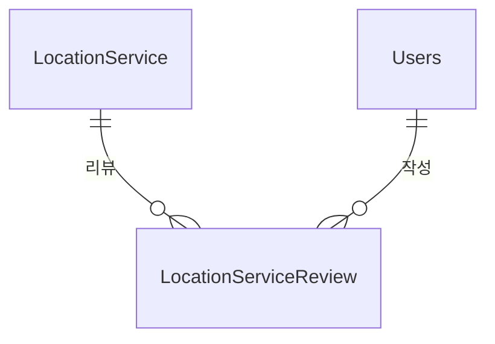

# Location 도메인 - 포트폴리오 상세 설명

## 1. 기능 설명

### 1.1 도메인 개요
- **역할**: 위치 기반 서비스 (병원, 카페, 공원, 펫샵 등) 정보 제공 및 리뷰 관리 도메인입니다.
- **주요 기능**: 
  - 지역 계층적 탐색 (시도 → 시군구 → 읍면동 → 도로명)
  - 카테고리별 서비스 검색
  - 거리 계산 (Haversine 공식)
  - 위치 서비스 리뷰 시스템
  - 공공데이터 CSV 배치 임포트
  - **네이버맵 API 연동**: 
    - 주소-좌표 변환(Geocoding)
    - 좌표-주소 변환(역지오코딩)
    - 길찾기(Directions API)

### 1.2 기능 시연
> **스크린샷/영상 링크**: [기능 작동 영상 또는 스크린샷 추가]

#### 주요 기능 1: 지역 계층적 탐색
- **설명**: 지역을 계층적으로 선택하여 서비스를 검색합니다.
- **사용자 시나리오**: 
  1. 시도 선택 (전국 17개 시도)
  2. 시군구 선택 (선택된 시도의 시군구)
  3. 읍면동 선택 (선택된 시군구의 읍면동)
  4. 도로명 선택 (선택된 읍면동의 도로명)
  5. 해당 지역의 서비스 목록 표시
- **스크린샷/영상**: 

#### 주요 기능 2: 거리 계산 및 길찾기
- **설명**: 내 위치에서 각 서비스까지의 거리를 계산하고 네이버맵 길찾기로 연결합니다.
- **사용자 시나리오**:
  1. 내 위치 확인 (GPS 또는 수동 입력)
  2. 각 서비스까지의 거리 표시 (Haversine 공식)
  3. 길찾기 버튼 클릭 → 네이버맵 길찾기 연동
- **스크린샷/영상**: 

---

## 2. 서비스 로직 설명

### 2.1 핵심 비즈니스 로직

#### 로직 1: 지역 계층적 탐색
**구현 위치**: `LocationServiceService.searchLocationServicesByRegion()` (Lines 48-123)

**핵심 로직**:
- **지역 계층 우선순위**: roadName > eupmyeondong > sigungu > sido > 전체
- **카테고리 필터링**: category3 → category2 → category1 순서로 검색 (대소문자 무시)
- **최대 결과 수 제한**: `maxResults` 파라미터로 결과 수 제한 (null이거나 0이면 제한 없음)
- **로깅**: 각 단계별 디버그 로그 출력

#### 로직 2: 거리 계산 (Haversine 공식)
**구현 위치**: `LocationServiceService.calculateDistance()` (Lines 129-146)

**핵심 로직**:
- **입력 검증**: 위도/경도가 null이면 null 반환
- **Haversine 공식**: 지구 반경 6371000m 사용
- **반환 단위**: 미터 단위
- **사용 목적**: 내 위치에서 각 서비스까지의 거리 표시

### 2.2 서비스 메서드 구조

#### LocationServiceService
| 메서드 | 설명 | 주요 로직 |
|--------|------|-----------|
| `searchLocationServicesByRegion()` | 지역 계층별 서비스 검색 | 우선순위 기반 조회, 카테고리 필터링, 최대 결과 수 제한 |
| `calculateDistance()` | 거리 계산 | Haversine 공식 (미터 단위) |
| `getPopularLocationServices()` | 인기 서비스 조회 | 카테고리별 상위 10개, `@Cacheable` 적용 |

### 2.3 트랜잭션 처리
- **트랜잭션 범위**: 
  - 조회 메서드: `@Transactional(readOnly = true)`
  - 리뷰 작성: `@Transactional`

---

## 3. 아키텍처 설명

### 3.1 도메인 구조
```
domain/location/
  ├── controller/
  │   ├── LocationServiceController.java
  │   └── GeocodingController.java
  ├── service/
  │   ├── LocationServiceService.java
  │   ├── LocationServiceReviewService.java
  │   ├── PublicDataLocationService.java
  │   ├── LocationServiceAdminService.java
  │   └── NaverMapService.java          # 네이버맵 API 연동
  ├── entity/
  │   ├── LocationService.java
  │   └── LocationServiceReview.java
  ├── dto/
  │   └── LocationServiceDTO.java
  └── repository/
      ├── LocationServiceRepository.java
      └── LocationServiceReviewRepository.java
```

### 3.2 엔티티 구조

#### LocationService (위치 서비스)
```java
@Entity
@Table(name = "locationservice")
public class LocationService {
    private Long idx;
    private String name;                   // 서비스명
    private String category1;              // 카테고리1 (대분류)
    private String category2;              // 카테고리2 (중분류)
    private String category3;              // 카테고리3 (소분류)
    private String sido;                   // 시도
    private String sigungu;                // 시군구
    private String eupmyeondong;           // 읍면동
    private String roadName;               // 도로명
    private String address;                 // 주소
    private String zipCode;                // 우편번호
    private Double latitude;               // 위도
    private Double longitude;               // 경도
    private String phone;                   // 전화번호
    private String website;                 // 웹사이트
    private String closedDay;              // 휴무일
    private String operatingHours;          // 운영시간
    private Boolean parkingAvailable;       // 주차 가능여부
    private String priceInfo;               // 가격 정보
    private Boolean petFriendly;            // 반려동물 동반 가능
    private Boolean isPetOnly;              // 반려동물 전용
    private String petSize;                 // 입장 가능 동물 크기
    private String petRestrictions;         // 반려동물 제한사항
    private String petExtraFee;             // 애견 동반 추가 요금
    private Boolean indoor;                 // 실내 여부
    private Boolean outdoor;                // 실외 여부
    private String description;             // 서비스 설명
    private Double rating;                  // 평균 평점
    private LocalDate lastUpdated;          // 최종작성일
    private String dataSource;              // 데이터 출처 (PUBLIC: 공공데이터)
    private List<LocationServiceReview> reviews; // 리뷰 목록
}
```

#### LocationServiceReview (위치 서비스 리뷰)
```java
@Entity
@Table(name = "locationservicereview")
public class LocationServiceReview {
    private Long idx;
    private LocationService service;       // 위치 서비스
    private Users user;                    // 작성자
    private Integer rating;                 // 평점 (1~5)
    private String comment;                // 리뷰 내용
    private LocalDateTime createdAt;
    private LocalDateTime updatedAt;
}
```

### 3.3 엔티티 관계도 (ERD)


### 3.4 API 설계
| 엔드포인트 | Method | 설명 |
|-----------|--------|------|
| `/api/location-services/search` | GET | 지역 계층별 서비스 검색 |
| `/api/location-services/popular` | GET | 인기 서비스 조회 |
| `/api/location-services/{id}/reviews` | POST | 리뷰 작성 |
| `/api/geocoding/address` | GET | 주소→좌표 변환 (네이버맵 Geocoding API) |
| `/api/geocoding/coordinates` | GET | 좌표→주소 변환 (네이버맵 역지오코딩 API) |
| `/api/geocoding/directions` | GET | 길찾기 (네이버맵 Directions API) |

---

## 4. 트러블슈팅

---

## 5. 성능 최적화

### 5.1 DB 최적화

#### 인덱스 전략
```sql
-- 지역 계층별 검색 인덱스
CREATE INDEX idx_sido ON locationservice(sido);
CREATE INDEX idx_sigungu ON locationservice(sigungu);
CREATE INDEX idx_eupmyeondong ON locationservice(eupmyeondong);
CREATE INDEX idx_road_name ON locationservice(road_name);

-- 복합 인덱스
CREATE INDEX idx_region_hierarchy ON locationservice(sido, sigungu, eupmyeondong);
CREATE INDEX idx_category3_pet ON locationservice(category3, pet_friendly);

-- 평점 정렬
CREATE INDEX idx_rating ON locationservice(rating DESC);
```

### 5.2 애플리케이션 레벨 최적화

#### 캐싱 전략
```java
// 인기 서비스 캐싱
@Cacheable(value = "popularLocationServices", key = "#category")
public List<LocationServiceDTO> getPopularLocationServices(String category) {
    return locationServiceRepository.findTop10ByCategoryOrderByRatingDesc(category)
        .stream()
        .map(locationServiceConverter::toDTO)
        .collect(Collectors.toList());
}
```

#### 프론트엔드 최적화
- **하이브리드 데이터 로딩**: 초기 전국 데이터 로드 + 클라이언트 필터링
- **메모이제이션**: 거리 계산, 서비스 필터링

---

## 6. 핵심 포인트 요약

### 기술적 하이라이트
1. **지역 계층적 탐색**: 시도 → 시군구 → 읍면동 → 도로명 계층 구조
2. **거리 계산**: Haversine 공식으로 정확한 거리 계산
3. **네이버맵 API 연동**: 
   - 주소-좌표 변환(Geocoding) - 백엔드
   - 좌표-주소 변환(역지오코딩) - 백엔드
   - 길찾기(Directions API) - 백엔드
   - 지도 표시 및 마커 표시 - 프론트엔드
4. **인덱스 전략**: 지역 계층별 인덱스로 조회 성능 향상
5. **하이브리드 데이터 로딩**: 초기 로드 + 클라이언트 필터링
6. **데이터 출처 관리**: `dataSource` 필드로 데이터 출처 구분 (PUBLIC)
7. **공공데이터 CSV 배치 업로드**: 대량 위치 데이터 수집 지원
