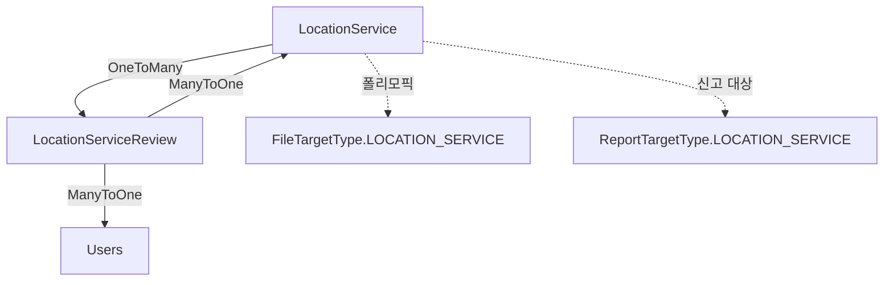

# Location 도메인

## 개요

위치 기반 서비스 (병원, 카페, 공원, 펫샵 등) 정보 제공 및 리뷰 관리 도메인입니다.

## Entity 구조

### 1. LocationService (위치 서비스)

```java
@Entity
@Table(name = "locationservice")
public class LocationService {
    Long idx;                    // PK
    String name;                 // 서비스 이름
    String category;             // 카테고리 (병원, 카페, 공원, 펫샵 등)
    String address;              // 주소
    String detailAddress;        // 상세 주소
    Double latitude;            // 위도
    Double longitude;            // 경도
    Double rating;               // 평균 평점
    String phone;                // 전화번호
    LocalTime openingTime;       // 영업 시작 시간
    LocalTime closingTime;       // 영업 종료 시간
    String imageUrl;             // 대표 이미지
    String website;              // 웹사이트
    String description;          // 서비스 설명
    Boolean petFriendly;         // 반려동물 동반 가능 여부
    String petPolicy;            // 반려동물 정책
    LocalDateTime createdAt;
    LocalDateTime updatedAt;
}
```

**연관관계:**
- `OneToMany` → LocationServiceReview (리뷰 목록)
- `관계 없음` → AttachmentFile (폴리모픽: FileTargetType.LOCATION_SERVICE)

### 2. LocationServiceReview (위치 서비스 리뷰)

```java
@Entity
@Table(name = "locationservicereview")
public class LocationServiceReview {
    Long idx;                    // PK
    LocationService service;     // 서비스 (ManyToOne)
    Users user;                  // 작성자 (ManyToOne)
    Integer rating;              // 평점 (1-5)
    String comment;              // 리뷰 내용 (TEXT)
    LocalDateTime createdAt;
    LocalDateTime updatedAt;
}
```

**연관관계:**
- `ManyToOne` → LocationService
- `ManyToOne` → Users (리뷰 작성자)

## Service 주요 기능

### LocationServiceService

#### 1. 위치 서비스 관리
```java
// 위치 서비스 생성
LocationServiceDTO createLocationService(LocationServiceDTO dto)

// 위치 서비스 목록 조회 (페이징, 카테고리 필터)
Page<LocationServiceDTO> getAllLocationServices(String category, int page, int size)

// 위치 기반 검색 (반경 내)
List<LocationServiceDTO> searchByLocation(double lat, double lng, double radiusKm)

// 위치 서비스 상세 조회
LocationServiceDTO getLocationService(long id)

// 위치 서비스 수정
LocationServiceDTO updateLocationService(long id, LocationServiceDTO dto)

// 위치 서비스 삭제
void deleteLocationService(long id)
```

#### 2. 위치 기반 검색
```java
// Haversine 공식을 사용한 거리 계산
private double calculateDistance(double lat1, double lng1, double lat2, double lng2)

// 반경 내 서비스 조회
List<LocationServiceDTO> findWithinRadius(double lat, double lng, double radiusKm)
```

### LocationServiceReviewService

#### 1. 리뷰 관리
```java
// 리뷰 작성
LocationServiceReviewDTO createReview(LocationServiceReviewDTO dto)

// 리뷰 목록 조회 (서비스별)
List<LocationServiceReviewDTO> getReviewsByService(long serviceId)

// 리뷰 목록 조회 (사용자별)
List<LocationServiceReviewDTO> getReviewsByUser(long userId)

// 리뷰 수정
LocationServiceReviewDTO updateReview(long reviewId, LocationServiceReviewDTO dto)

// 리뷰 삭제
void deleteReview(long reviewId)

// 평균 평점 계산 및 업데이트
void updateServiceRating(long serviceId)
```

## 다른 도메인과의 연관관계

### LocationService와 다른 도메인



### 주요 상호작용

#### 1. User 도메인
- **Users → LocationServiceReview (ManyToOne)**
  - Users가 위치 서비스에 리뷰 작성
  - 리뷰 작성 시 사용자 정보 필요
  - 사용자별 리뷰 이력 조회 가능

**예시:**
```java
// 사용자가 작성한 리뷰 목록
List<LocationServiceReview> userReviews = reviewRepository.findByUser(user);
```

#### 2. File 도메인
- **LocationService → AttachmentFile (폴리모픽)**
  - LocationService의 대표 이미지 저장
  - FileTargetType.LOCATION_SERVICE로 구분
  - 여러 이미지 첨부 가능

**예시:**
```java
// 위치 서비스의 이미지 조회
List<AttachmentFile> images = fileService.getAttachments(
    FileTargetType.LOCATION_SERVICE, 
    locationService.getIdx()
);
```

#### 3. Report 도메인
- **LocationService → Report (폴리모픽)**
  - 부적절한 위치 서비스 정보 신고
  - ReportTargetType.LOCATION_SERVICE로 구분
  - 신고 처리 시 서비스 정보 숨김/삭제 가능

**예시:**
```java
// 위치 서비스 신고 접수
Report report = Report.builder()
    .targetType(ReportTargetType.LOCATION_SERVICE)
    .targetIdx(locationService.getIdx())
    .reporter(reporter)
    .reason("부정확한 정보")
    .build();
```

#### 4. Statistics 도메인
- **LocationService → DailyStatistics (간접)**
  - 일별 통계에 위치 서비스 수 포함
  - 리뷰 작성 수 집계

### LocationServiceReview와 다른 도메인

#### 1. LocationService 도메인
- **LocationServiceReview → LocationService (ManyToOne)**
  - 리뷰는 반드시 하나의 서비스에 속함
  - 리뷰 작성 시 서비스의 평균 평점 자동 업데이트
  - 서비스 삭제 시 리뷰도 함께 삭제 (CascadeType.ALL)

**예시:**
```java
// 리뷰 작성 후 평균 평점 업데이트
@Transactional
public LocationServiceReviewDTO createReview(LocationServiceReviewDTO dto) {
    LocationServiceReview review = reviewRepository.save(...);
    
    // 평균 평점 재계산
    Double avgRating = reviewRepository.calculateAverageRating(review.getService().getIdx());
    review.getService().setRating(avgRating);
    locationServiceRepository.save(review.getService());
    
    return converter.toDTO(review);
}
```

#### 2. User 도메인
- **LocationServiceReview → Users (ManyToOne)**
  - 리뷰 작성자 정보
  - 사용자별 리뷰 이력 조회
  - 리뷰 수정/삭제 권한 체크

## 비즈니스 로직

### 평균 평점 계산

```java
@Query("SELECT AVG(r.rating) FROM LocationServiceReview r WHERE r.service.idx = :serviceId")
Double calculateAverageRating(@Param("serviceId") Long serviceId);
```

**자동 업데이트 시점:**
- 리뷰 작성 시
- 리뷰 수정 시 (평점 변경)
- 리뷰 삭제 시

### 위치 기반 검색

#### Haversine 공식
```java
private double calculateDistance(double lat1, double lng1, double lat2, double lng2) {
    final int R = 6371; // 지구 반경 (km)
    
    double dLat = Math.toRadians(lat2 - lat1);
    double dLng = Math.toRadians(lng2 - lng1);
    
    double a = Math.sin(dLat / 2) * Math.sin(dLat / 2) +
               Math.cos(Math.toRadians(lat1)) * Math.cos(Math.toRadians(lat2)) *
               Math.sin(dLng / 2) * Math.sin(dLng / 2);
    
    double c = 2 * Math.atan2(Math.sqrt(a), Math.sqrt(1 - a));
    
    return R * c;
}
```

#### Native Query (MySQL Spatial)
```java
@Query(value = 
    "SELECT * FROM locationservice " +
    "WHERE ST_Distance_Sphere(point(longitude, latitude), point(:lng, :lat)) <= :radiusMeters " +
    "AND pet_friendly = true " +
    "ORDER BY rating DESC",
    nativeQuery = true)
List<LocationService> findByLocationWithin(
    @Param("lat") double lat, 
    @Param("lng") double lng, 
    @Param("radiusMeters") double radiusMeters
);
```

## 성능 최적화

### 1. 인덱싱

```sql
-- 위치 기반 검색 (Spatial Index)
CREATE SPATIAL INDEX idx_location_service_coords 
ON locationservice(latitude, longitude);

-- 카테고리별 조회
CREATE INDEX idx_location_service_category 
ON locationservice(category, pet_friendly);

-- 평점 정렬
CREATE INDEX idx_location_service_rating 
ON locationservice(rating DESC);

-- 리뷰 조회
CREATE INDEX idx_location_review_service 
ON locationservicereview(service_idx, created_at DESC);

CREATE INDEX idx_location_review_user 
ON locationservicereview(user_idx, created_at DESC);
```

### 2. 캐싱

```java
// 인기 위치 서비스 캐싱
@Cacheable(value = "popularLocationServices", key = "#category")
public List<LocationServiceDTO> getPopularLocationServices(String category) {
    return locationServiceRepository.findTop10ByCategoryOrderByRatingDesc(category);
}
```

### 3. N+1 문제 해결

```java
// 리뷰와 작성자 정보를 함께 조회
@Query("SELECT r FROM LocationServiceReview r " +
       "JOIN FETCH r.user " +
       "WHERE r.service.idx = :serviceId " +
       "ORDER BY r.createdAt DESC")
List<LocationServiceReview> findByServiceWithUser(@Param("serviceId") Long serviceId);
```

## API 엔드포인트

### 위치 서비스 (/api/location/services)
- `GET /` - 목록 조회 (페이징, 카테고리 필터)
- `GET /{id}` - 상세 조회
- `POST /` - 생성 (관리자)
- `PUT /{id}` - 수정 (관리자)
- `DELETE /{id}` - 삭제 (관리자)
- `GET /nearby` - 위치 기반 검색 (반경 내)
- `GET /popular` - 인기 서비스 (평점 기준)

### 위치 서비스 리뷰 (/api/location/services/{serviceId}/reviews)
- `GET /` - 리뷰 목록
- `POST /` - 리뷰 작성
- `PUT /{reviewId}` - 리뷰 수정
- `DELETE /{reviewId}` - 리뷰 삭제
- `GET /me` - 내 리뷰 목록

## 테스트 시나리오

### 1. 위치 기반 검색
- 현재 위치 기준 1km 반경 내 서비스 조회
- 반려동물 동반 가능 필터 적용
- 평점 순 정렬

### 2. 리뷰 시스템
- 리뷰 작성 → 평균 평점 자동 업데이트
- 리뷰 수정 (평점 변경) → 평균 평점 재계산
- 리뷰 삭제 → 평균 평점 재계산

### 3. 권한 관리
- 일반 사용자: 리뷰 작성/수정/삭제 (본인만)
- 관리자: 서비스 생성/수정/삭제

## 개선 아이디어

### 기능
1. **지도 시각화**
   - 지도에 위치 서비스 표시
   - 클러스터링 (Zoom 레벨별)

2. **추천 시스템**
   - 사용자 위치 기반 추천
   - 평점 기반 추천
   - 카테고리별 추천

3. **리뷰 사진**
   - 리뷰에 이미지 첨부
   - 다중 이미지 업로드

### 성능
1. **ElasticSearch 도입**
   - 위치 기반 검색 성능 향상
   - 복잡한 필터링 지원

2. **Redis 캐싱**
   - 인기 서비스 목록 캐싱
   - 평균 평점 캐싱

3. **CDN**
   - 이미지 CDN 사용
   - 로딩 속도 개선

