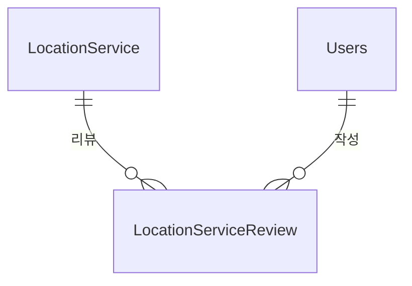

# Location 도메인 - 포트폴리오 상세 설명

## 1. 개요

Location 도메인은 위치 기반 서비스 (병원, 카페, 공원, 펫샵 등) 정보 제공 및 리뷰 관리 도메인입니다. 지역 계층적 탐색, 거리 계산, 네이버맵 API 연동을 통해 사용자에게 위치 기반 서비스를 제공합니다.

**주요 기능**:
- 지역 계층적 탐색 (시도 → 시군구 → 읍면동 → 도로명)
- 카테고리별 서비스 검색
- 거리 계산 (Haversine 공식)
- 위치 서비스 리뷰 시스템
- 공공데이터 CSV 배치 임포트
- 네이버맵 API 연동:
  - 주소-좌표 변환(Geocoding)
  - 좌표-주소 변환(역지오코딩)
  - 길찾기(Directions API)

---

## 2. 기능 설명

### 2.1 지역 계층적 탐색

**탐색 프로세스**:
1. 시도 선택 (전국 17개 시도)
2. 시군구 선택 (선택된 시도의 시군구)
3. 읍면동 선택 (선택된 시군구의 읍면동)
4. 도로명 선택 (선택된 읍면동의 도로명)
5. 해당 지역의 서비스 목록 표시

**우선순위**: roadName > eupmyeondong > sigungu > sido > 전체

### 2.2 카테고리별 검색

**카테고리 필터링**:
- category3 → category2 → category1 순서로 검색
- 대소문자 무시
- 최대 결과 수 제한 지원 (`maxResults` 파라미터)

### 2.3 거리 계산 및 길찾기

**거리 계산 프로세스**:
1. 내 위치 확인 (GPS 또는 수동 입력)
2. 각 서비스까지의 거리 계산 (Haversine 공식, 미터 단위)
3. 거리 표시
4. 길찾기 버튼 클릭 → 네이버맵 길찾기 연동

### 2.4 위치 서비스 리뷰

**리뷰 작성 프로세스**:
1. 위치 서비스 선택
2. 리뷰 작성 (평점 1-5, 내용)
3. 중복 리뷰 방지 (한 서비스당 1개의 리뷰만 작성 가능)
4. 서비스 평점 자동 업데이트

---

## 3. 서비스 로직 설명

### 3.1 핵심 비즈니스 로직

#### 로직 1: 지역 계층적 탐색
**구현 위치**: `LocationServiceService.searchLocationServicesByRegion()` 

```java
public List<LocationServiceDTO> searchLocationServicesByRegion(
        String sido, String sigungu, String eupmyeondong, 
        String roadName, String category, Integer maxResults) {
    
    List<LocationService> services;
    
    // 지역 계층 우선순위에 따라 조회
    if (StringUtils.hasText(roadName)) {
        services = locationServiceRepository.findByRoadName(roadName);
    } else if (StringUtils.hasText(eupmyeondong)) {
        services = locationServiceRepository.findByEupmyeondong(eupmyeondong);
    } else if (StringUtils.hasText(sigungu)) {
        services = locationServiceRepository.findBySigungu(sigungu);
    } else if (StringUtils.hasText(sido)) {
        services = locationServiceRepository.findBySido(sido);
    } else {
        services = locationServiceRepository.findByOrderByRatingDesc();
    }
    
    // 카테고리 필터링 (category3 → category2 → category1)
    if (StringUtils.hasText(category) && !services.isEmpty()) {
        String categoryLower = category.toLowerCase(Locale.ROOT).trim();
        services = services.stream()
                .filter(service -> {
                    if (service.getCategory3() != null && 
                        service.getCategory3().toLowerCase(Locale.ROOT).trim().equals(categoryLower)) {
                        return true;
                    }
                    if (service.getCategory2() != null && 
                        service.getCategory2().toLowerCase(Locale.ROOT).trim().equals(categoryLower)) {
                        return true;
                    }
                    if (service.getCategory1() != null && 
                        service.getCategory1().toLowerCase(Locale.ROOT).trim().equals(categoryLower)) {
                        return true;
                    }
                    return false;
                })
                .collect(Collectors.toList());
    }
    
    // 최대 결과 수 제한
    if (maxResults != null && maxResults > 0) {
        services = services.stream()
                .limit(maxResults)
                .collect(Collectors.toList());
    }
    
    return services.stream()
            .map(locationServiceConverter::toDTO)
            .collect(Collectors.toList());
}
```

**핵심 로직**:
- **지역 계층 우선순위**: roadName > eupmyeondong > sigungu > sido > 전체
- **카테고리 필터링**: category3 → category2 → category1 순서로 검색 (대소문자 무시)
- **최대 결과 수 제한**: `maxResults` 파라미터로 결과 수 제한 (null이거나 0이면 제한 없음)
- **로깅**: 각 단계별 디버그 로그 출력

#### 로직 2: 거리 계산 (Haversine 공식)
**구현 위치**: `LocationServiceService.calculateDistance()` (Lines 129-146)

```java
public Double calculateDistance(Double lat1, Double lng1, Double lat2, Double lng2) {
    if (lat1 == null || lng1 == null || lat2 == null || lng2 == null) {
        return null;
    }
    
    final int R = 6371000; // 지구 반경 (미터)
    
    double dLat = Math.toRadians(lat2 - lat1);
    double dLng = Math.toRadians(lng2 - lng1);
    
    double a = Math.sin(dLat / 2) * Math.sin(dLat / 2) +
            Math.cos(Math.toRadians(lat1)) * Math.cos(Math.toRadians(lat2)) *
            Math.sin(dLng / 2) * Math.sin(dLng / 2);
    
    double c = 2 * Math.atan2(Math.sqrt(a), Math.sqrt(1 - a));
    
    return R * c; // 미터 단위
}
```

**핵심 로직**:
- **입력 검증**: 위도/경도가 null이면 null 반환
- **Haversine 공식**: 지구 반경 6371000m 사용
- **반환 단위**: 미터 단위
- **사용 목적**: 내 위치에서 각 서비스까지의 거리 표시

#### 로직 3: 네이버맵 지오코딩 (주소 → 좌표)
**구현 위치**: `NaverMapService.addressToCoordinates()` (Lines 152-240)

**핵심 로직**:
- **API 호출**: 네이버 Geocoding API (`https://naveropenapi.apigw.ntruss.com/map-geocode/v2/geocode`)
- **응답 파싱**: `addresses` 배열에서 첫 번째 결과의 `y`(위도), `x`(경도) 추출
- **반환 형식**: `Double[]` 배열 `[latitude, longitude]`
- **에러 처리**: API 키 미설정, 구독 필요 등 에러 처리

#### 로직 4: 네이버맵 역지오코딩 (좌표 → 주소)
**구현 위치**: `NaverMapService.coordinatesToAddress()` (Lines 249-373)

**핵심 로직**:
- **API 호출**: 네이버 역지오코딩 API (`https://naveropenapi.apigw.ntruss.com/map-reversegeocode/v2/gc`)
- **응답 파싱**: `results` 배열에서 `region`(지번주소), `land`(도로명주소) 추출
- **주소 조합**: 시도, 시군구, 읍면동, 리를 조합하여 지번주소 생성
- **반환 형식**: `Map<String, Object>` (`address`, `roadAddress`, `jibunAddress`)

#### 로직 5: 네이버맵 길찾기
**구현 위치**: `NaverMapService.getDirections()` (Lines 43-144)

**핵심 로직**:
- **API 호출**: 네이버 Directions API (`https://maps.apigw.ntruss.com/map-direction/v1/driving`)
- **경로 옵션**: `traoptimal`(최적), `trafast`(최단), `tracomfort`(편한길)
- **응답 파싱**: `route.traoptimal` 경로 정보 추출
- **에러 처리**: API 키 미설정, 구독 필요 등 에러 처리

#### 로직 6: 리뷰 작성 및 평점 업데이트
**구현 위치**: `LocationServiceReviewService.createReview()` (Lines 34-64)

**핵심 로직**:
- **중복 리뷰 체크**: `existsByServiceIdxAndUserIdx()`로 중복 방지
- **이메일 인증 확인**: 리뷰 작성 시 이메일 인증 필요
- **리뷰 저장**: `LocationServiceReview` 엔티티 생성 및 저장
- **평점 업데이트**: `updateServiceRating()`로 서비스 평균 평점 자동 계산 및 업데이트

**평점 업데이트 로직** (`updateServiceRating()`, Lines 126-136):
```java
@Transactional
public void updateServiceRating(Long serviceIdx) {
    Optional<Double> averageRating = reviewRepository.findAverageRatingByServiceIdx(serviceIdx);
    
    if (averageRating.isPresent()) {
        LocationService service = serviceRepository.findById(serviceIdx)
                .orElseThrow(() -> new RuntimeException("서비스를 찾을 수 없습니다."));
        
        service.setRating(averageRating.get());
        serviceRepository.save(service);
    }
}
```

### 3.2 서비스 메서드 구조

#### LocationServiceService
| 메서드 | 설명 | 주요 로직 |
|--------|------|-----------|
| `searchLocationServicesByRegion()` | 지역 계층별 서비스 검색 | 우선순위 기반 조회, 카테고리 필터링, 최대 결과 수 제한 |
| `calculateDistance()` | 거리 계산 | Haversine 공식 (미터 단위) |
| `getPopularLocationServices()` | 인기 서비스 조회 | 카테고리별 상위 10개, `@Cacheable` 적용 |

#### NaverMapService
| 메서드 | 설명 | 주요 로직 |
|--------|------|-----------|
| `addressToCoordinates()` | 주소→좌표 변환 | 네이버 Geocoding API 호출, 좌표 추출 |
| `coordinatesToAddress()` | 좌표→주소 변환 | 네이버 역지오코딩 API 호출, 주소 조합 |
| `getDirections()` | 길찾기 | 네이버 Directions API 호출, 경로 정보 반환 |

#### LocationServiceReviewService
| 메서드 | 설명 | 주요 로직 |
|--------|------|-----------|
| `createReview()` | 리뷰 작성 | 중복 체크, 이메일 인증 확인, 평점 업데이트 |
| `updateReview()` | 리뷰 수정 | 이메일 인증 확인, 평점 업데이트 |
| `deleteReview()` | 리뷰 삭제 | 이메일 인증 확인, 평점 업데이트 |
| `getReviewsByService()` | 서비스별 리뷰 목록 조회 | `findByServiceIdxOrderByCreatedAtDesc()` |
| `getReviewsByUser()` | 사용자별 리뷰 목록 조회 | `findByUserIdxOrderByCreatedAtDesc()` |
| `updateServiceRating()` | 서비스 평점 업데이트 | 평균 평점 계산 및 업데이트 |

### 3.3 트랜잭션 처리
- **트랜잭션 범위**: 
  - 조회 메서드: `@Transactional(readOnly = true)`
  - 리뷰 작성/수정/삭제: `@Transactional`
  - 평점 업데이트: `@Transactional`
- **격리 수준**: 기본값 (READ_COMMITTED)
- **이메일 인증**: 리뷰 작성/수정/삭제 시 이메일 인증 확인 (`EmailVerificationRequiredException`)

---

## 4. 아키텍처 설명

### 4.1 엔티티 구조

#### LocationService (위치 서비스)
```java
@Entity
@Table(name = "locationservice")
public class LocationService {
    @Id
    @GeneratedValue(strategy = GenerationType.IDENTITY)
    private Long idx;
    
    @Column(nullable = false, length = 150)
    private String name;
    
    @Column(name = "category1", length = 100)
    private String category1; // 카테고리1 (대분류)
    
    @Column(name = "category2", length = 100)
    private String category2; // 카테고리2 (중분류)
    
    @Column(name = "category3", length = 100)
    private String category3; // 카테고리3 (소분류)
    
    // 주소 구성 요소
    @Column(name = "sido", length = 50)
    private String sido; // 시도
    
    @Column(name = "sigungu", length = 50)
    private String sigungu; // 시군구
    
    @Column(name = "eupmyeondong", length = 50)
    private String eupmyeondong; // 읍면동
    
    @Column(name = "road_name", length = 100)
    private String roadName; // 도로명
    
    @Column(name = "address", length = 255)
    private String address; // 기본 주소
    
    @Column(name = "zip_code", length = 10)
    private String zipCode; // 우편번호
    
    // 위치 정보
    private Double latitude;
    private Double longitude;
    
    // 운영 정보
    @Column(name = "closed_day", length = 255)
    private String closedDay; // 휴무일
    
    @Column(name = "operating_hours", length = 255)
    private String operatingHours; // 운영시간
    
    @Column(name = "parking_available")
    private Boolean parkingAvailable; // 주차 가능여부
    
    @Column(name = "price_info", length = 255)
    private String priceInfo; // 가격 정보
    
    // 반려동물 정책
    @Column(name = "pet_friendly")
    @Builder.Default
    private Boolean petFriendly = false; // 반려동물 동반 가능
    
    @Column(name = "is_pet_only")
    private Boolean isPetOnly; // 반려동물 전용
    
    @Column(name = "pet_size", length = 100)
    private String petSize; // 입장 가능 동물 크기
    
    @Column(name = "pet_restrictions", length = 255)
    private String petRestrictions; // 반려동물 제한사항
    
    @Column(name = "pet_extra_fee", length = 255)
    private String petExtraFee; // 애견 동반 추가 요금
    
    @Column(name = "indoor")
    private Boolean indoor; // 실내 여부
    
    @Column(name = "outdoor")
    private Boolean outdoor; // 실외 여부
    
    @Column(columnDefinition = "TEXT")
    private String description; // 서비스 설명
    
    private Double rating; // 평균 평점
    
    @Column(name = "last_updated")
    private LocalDate lastUpdated; // 최종작성일
    
    @Column(name = "data_source", length = 50)
    @Builder.Default
    private String dataSource = "PUBLIC"; // 데이터 출처
    
    @OneToMany(mappedBy = "service", cascade = CascadeType.ALL)
    private List<LocationServiceReview> reviews;
}
```

**특징**:
- `BaseTimeEntity`를 상속하지 않음 (`createdAt`, `updatedAt` 없음)
- 지역 계층 구조: sido → sigungu → eupmyeondong → roadName
- 카테고리 계층 구조: category1 → category2 → category3
- 반려동물 관련 필드: `petFriendly`, `isPetOnly`, `petSize`, `petRestrictions`, `petExtraFee`

#### LocationServiceReview (위치 서비스 리뷰)
```java
@Entity
@Table(name = "locationservicereview")
public class LocationServiceReview {
    @Id
    @GeneratedValue(strategy = GenerationType.IDENTITY)
    private Long idx;
    
    @ManyToOne
    @JoinColumn(name = "service_idx", nullable = false)
    private LocationService service;
    
    @ManyToOne
    @JoinColumn(name = "user_idx", nullable = false)
    private Users user;
    
    @Column(nullable = false)
    private Integer rating; // 평점 (1~5)
    
    @Lob
    private String comment; // 리뷰 내용
    
    private LocalDateTime createdAt;
    private LocalDateTime updatedAt;
    
    @PrePersist
    protected void onCreate() {
        this.createdAt = LocalDateTime.now();
        this.updatedAt = LocalDateTime.now();
    }
    
    @PreUpdate
    protected void onUpdate() {
        this.updatedAt = LocalDateTime.now();
    }
}
```

**특징**:
- `BaseTimeEntity`를 상속하지 않음 (`@PrePersist`, `@PreUpdate`로 직접 관리)
- 중복 리뷰 방지: `existsByServiceIdxAndUserIdx()`로 체크

### 4.2 도메인 구조
```
domain/location/
  ├── controller/
  │   ├── LocationServiceController.java
  │   ├── LocationServiceReviewController.java
  │   ├── GeocodingController.java
  │   └── LocationServiceAdminController.java
  ├── service/
  │   ├── LocationServiceService.java
  │   ├── LocationServiceReviewService.java
  │   ├── PublicDataLocationService.java
  │   ├── LocationServiceAdminService.java
  │   └── NaverMapService.java
  ├── entity/
  │   ├── LocationService.java
  │   └── LocationServiceReview.java
  ├── repository/
  │   ├── LocationServiceRepository.java
  │   └── LocationServiceReviewRepository.java
  ├── converter/
  │   ├── LocationServiceConverter.java
  │   └── LocationServiceReviewConverter.java
  ├── dto/
  │   ├── LocationServiceDTO.java
  │   ├── LocationServiceReviewDTO.java
  │   └── PublicDataLocationDTO.java
  └── util/
      └── OperatingHoursParser.java
```

### 4.3 엔티티 관계도 (ERD)


### 4.4 API 설계

#### REST API
| 엔드포인트 | Method | 설명 |
|-----------|--------|------|
| `/api/location-services/search` | GET | 지역 계층별 서비스 검색 (sido, sigungu, eupmyeondong, roadName, category, size 파라미터) |
| `/api/location-services/popular` | GET | 인기 서비스 조회 (category 파라미터) |
| `/api/location-service-reviews` | POST | 리뷰 작성 (인증 필요) |
| `/api/location-service-reviews/{reviewIdx}` | PUT | 리뷰 수정 (인증 필요) |
| `/api/location-service-reviews/{reviewIdx}` | DELETE | 리뷰 삭제 (인증 필요) |
| `/api/location-service-reviews/service/{serviceIdx}` | GET | 서비스별 리뷰 목록 조회 |
| `/api/location-service-reviews/user/{userIdx}` | GET | 사용자별 리뷰 목록 조회 |
| `/api/geocoding/address` | GET | 주소→좌표 변환 (address 파라미터) |
| `/api/geocoding/coordinates` | GET | 좌표→주소 변환 (lat, lng 파라미터) |
| `/api/geocoding/directions` | GET | 길찾기 (start, goal, option 파라미터) |

**지역 계층별 검색 요청 예시**:
```http
GET /api/location-services/search?sido=서울특별시&sigungu=노원구&category=동물약국&size=100
```

**지역 계층별 검색 응답 예시**:
```json
{
  "services": [
    {
      "idx": 1,
      "name": "노원동물병원",
      "category1": "의료",
      "category2": "동물병원",
      "category3": "동물약국",
      "sido": "서울특별시",
      "sigungu": "노원구",
      "eupmyeondong": "상계동",
      "address": "서울특별시 노원구 상계로 123",
      "latitude": 37.5665,
      "longitude": 126.9780,
      "rating": 4.5
    }
  ],
  "count": 1
}
```

**지오코딩 요청 예시**:
```http
GET /api/geocoding/address?address=서울시 강남구
```

**지오코딩 응답 예시**:
```json
{
  "latitude": 37.4979,
  "longitude": 127.0276,
  "success": true
}
```

**길찾기 요청 예시**:
```http
GET /api/geocoding/directions?start=127.1058342,37.359708&goal=129.075986,35.179470&option=traoptimal
```

**길찾기 응답 예시**:
```json
{
  "success": true,
  "data": {
    "route": {
      "traoptimal": {
        "summary": {
          "distance": 123456,
          "duration": 3600
        }
      }
    }
  }
}
```

---

## 5. 트랜잭션 처리

### 5.1 트랜잭션 전략
- **리뷰 작성/수정/삭제**: `@Transactional` - 리뷰 저장과 평점 업데이트를 원자적으로 처리
- **평점 업데이트**: `@Transactional` - 평균 평점 계산 및 업데이트를 원자적으로 처리
- **조회 메서드**: `@Transactional(readOnly = true)` - 읽기 전용 최적화
- **네이버맵 API 호출**: 트랜잭션 없이 처리 (외부 API 호출)

### 5.2 동시성 제어
- **리뷰 작성**: 중복 리뷰 체크 (`existsByServiceIdxAndUserIdx()`)로 동시성 문제 방지
- **평점 업데이트**: 트랜잭션으로 평균 평점 계산 및 업데이트를 원자적으로 처리

---

## 6. 트러블슈팅

---

## 7. 성능 최적화

### 7.1 DB 최적화

#### 인덱스 전략
```sql
-- 지역 계층별 검색 인덱스
CREATE INDEX idx_sido ON locationservice(sido);
CREATE INDEX idx_sigungu ON locationservice(sigungu);
CREATE INDEX idx_eupmyeondong ON locationservice(eupmyeondong);
CREATE INDEX idx_road_name ON locationservice(road_name);

-- 복합 인덱스
CREATE INDEX idx_region_hierarchy ON locationservice(sido, sigungu, eupmyeondong);
CREATE INDEX idx_category3_pet ON locationservice(category3, pet_friendly);

-- 평점 정렬
CREATE INDEX idx_rating ON locationservice(rating DESC);
```

**선정 이유**:
- 자주 조회되는 지역 계층 컬럼 (sido, sigungu, eupmyeondong, roadName)
- WHERE 절에서 자주 사용되는 조건
- 평점 정렬을 위한 인덱스 (rating DESC)
- 복합 인덱스로 조회 성능 향상

### 7.2 애플리케이션 레벨 최적화

#### 캐싱 전략
**구현 위치**: `LocationServiceService.getPopularLocationServices()` (Lines 28-34)

```java
@Cacheable(value = "popularLocationServices", key = "#category")
public List<LocationServiceDTO> getPopularLocationServices(String category) {
    return locationServiceRepository.findTop10ByCategoryOrderByRatingDesc(category)
            .stream()
            .map(locationServiceConverter::toDTO)
            .collect(Collectors.toList());
}
```

**효과**: 인기 서비스 조회 시 캐싱으로 성능 향상

#### 프론트엔드 최적화
- **하이브리드 데이터 로딩**: 초기 전국 데이터 로드 + 클라이언트 필터링
- **메모이제이션**: 거리 계산, 서비스 필터링

#### 네이버맵 API 최적화
- **에러 처리**: API 키 미설정, 구독 필요 등 에러 처리
- **로깅**: API 호출 및 응답 로깅으로 디버깅 지원
- **응답 캐싱**: 필요 시 클라이언트 측에서 응답 캐싱 가능

---

## 8. 핵심 포인트 요약

### 8.1 지역 계층적 탐색
- **계층 구조**: 시도 → 시군구 → 읍면동 → 도로명
- **우선순위 기반 조회**: roadName > eupmyeondong > sigungu > sido > 전체
- **카테고리 필터링**: category3 → category2 → category1 순서로 검색

### 8.2 거리 계산
- **Haversine 공식**: 지구 반경 6371000m 사용
- **미터 단위 반환**: 내 위치에서 각 서비스까지의 거리 표시
- **정확한 거리 계산**: 위도/경도 기반 정확한 거리 계산

### 8.3 네이버맵 API 연동
- **지오코딩**: 주소를 좌표로 변환 (`addressToCoordinates()`)
- **역지오코딩**: 좌표를 주소로 변환 (`coordinatesToAddress()`)
- **길찾기**: 출발지-도착지 경로 정보 제공 (`getDirections()`)
- **에러 처리**: API 키 미설정, 구독 필요 등 에러 처리

### 8.4 리뷰 시스템
- **중복 리뷰 방지**: 한 서비스당 1개의 리뷰만 작성 가능
- **이메일 인증**: 리뷰 작성/수정/삭제 시 이메일 인증 필요
- **평점 자동 업데이트**: 리뷰 작성/수정/삭제 시 서비스 평균 평점 자동 계산 및 업데이트

### 8.5 성능 최적화
- **인덱스 전략**: 지역 계층별 인덱스로 조회 성능 향상
- **캐싱**: 인기 서비스 조회 시 `@Cacheable` 적용
- **하이브리드 데이터 로딩**: 초기 전국 데이터 로드 + 클라이언트 필터링

### 8.6 엔티티 설계 특징
- **BaseTimeEntity 미사용**: LocationService는 `createdAt`, `updatedAt` 없음
- **직접 시간 관리**: LocationServiceReview는 `@PrePersist`, `@PreUpdate`로 직접 관리
- **지역 계층 구조**: sido → sigungu → eupmyeondong → roadName
- **카테고리 계층 구조**: category1 → category2 → category3
- **데이터 출처 관리**: `dataSource` 필드로 데이터 출처 구분 (PUBLIC)
