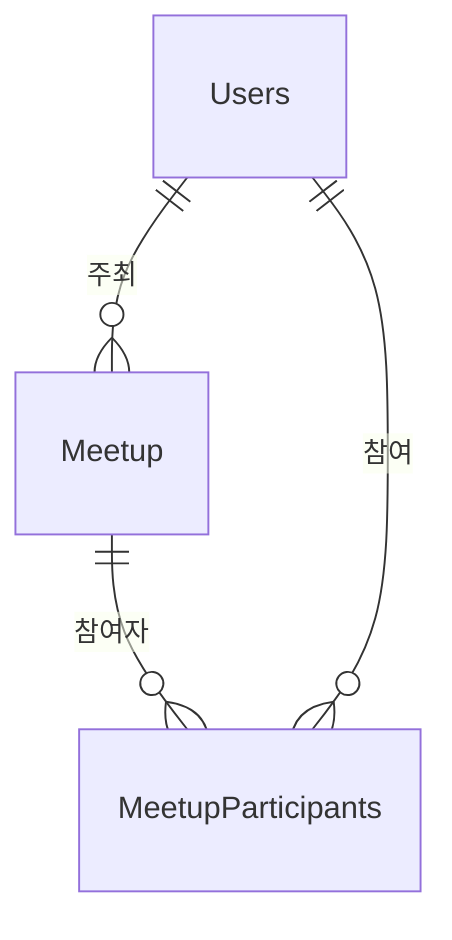

# Meetup 도메인 - 포트폴리오 상세 설명

## 1. 개요

Meetup 도메인은 오프라인 반려동물 모임 생성 및 참여 관리 도메인입니다. 사용자가 산책 모임을 생성하고 참여할 수 있으며, 위치 기반 검색, 최대 인원 제한, 채팅방 자동 연동 등의 기능을 제공합니다.

**주요 기능**:
- 모임 생성/조회/수정/삭제
- 모임 참여/참여 취소
- 최대 인원 제한 및 동시성 제어
- 모임 상태 관리 (RECRUITING → CLOSED → COMPLETED)
- 위치 기반 모임 검색 (반경 기반, 지역별)
- 키워드 검색
- 그룹 채팅방 자동 생성 및 연동

---

## 2. 기능 설명

### 2.1 모임 생성 및 참여

**모임 생성 프로세스**:
1. 모임 정보 입력 (제목, 설명, 장소, 일시, 최대 인원)
2. 이메일 인증 확인
3. 날짜 검증 (현재 시간 이후)
4. 모임 생성 및 주최자 자동 참여
5. 그룹 채팅방 자동 생성 (주최자 ADMIN 역할)

**모임 참여 프로세스**:
1. 모임 선택
2. 이메일 인증 확인
3. 중복 참여 체크
4. 최대 인원 체크 (주최자 제외)
5. 참여자 추가 및 인원 수 증가
6. 채팅방 자동 참여

### 2.2 모임 상태 관리

**상태 전환**:
- **RECRUITING**: 모집 중 (기본 상태)
- **CLOSED**: 마감 (최대 인원 도달 또는 수동 마감)
- **COMPLETED**: 종료 (모임 일시 지남)

### 2.3 위치 기반 검색

**반경 기반 검색**:
- 내 위치 기준 반경 내 모임 검색
- Haversine 공식으로 거리 계산
- 거리순 정렬, 같으면 날짜순 정렬
- 미래 날짜만 포함, COMPLETED 상태 제외

**지역별 검색**:
- 위도/경도 범위로 모임 검색
- 날짜순 정렬

---

## 3. 서비스 로직 설명

### 3.1 핵심 비즈니스 로직

#### 로직 1: 모임 생성
**구현 위치**: `MeetupService.createMeetup()`

```java
@Transactional
public MeetupDTO createMeetup(MeetupDTO meetupDTO, String userId) {
    // 1. 사용자 확인
    Users organizer = usersRepository.findByIdString(userId)
            .orElseThrow(() -> new RuntimeException("사용자를 찾을 수 없습니다."));
    
    // 2. 이메일 인증 확인
    if (organizer.getEmailVerified() == null || !organizer.getEmailVerified()) {
        throw new EmailVerificationRequiredException("모임 생성을 위해 이메일 인증이 필요합니다.");
    }
    
    // 3. 날짜 검증
    if (meetupDTO.getDate() != null && meetupDTO.getDate().isBefore(LocalDateTime.now())) {
        throw new RuntimeException("모임 일시는 현재 시간 이후여야 합니다.");
    }
    
    // 4. 모임 생성
    Meetup meetup = Meetup.builder()
            .title(meetupDTO.getTitle())
            .description(meetupDTO.getDescription())
            .location(meetupDTO.getLocation())
            .latitude(meetupDTO.getLatitude())
            .longitude(meetupDTO.getLongitude())
            .date(meetupDTO.getDate())
            .organizer(organizer)
            .maxParticipants(meetupDTO.getMaxParticipants() != null ? meetupDTO.getMaxParticipants() : 10)
            .currentParticipants(0)
            .status(MeetupStatus.RECRUITING)
            .build();
    
    Meetup savedMeetup = meetupRepository.save(meetup);
    
    // 5. 주최자를 자동으로 참가자에 추가
    MeetupParticipants organizerParticipant = MeetupParticipants.builder()
            .meetup(savedMeetup)
            .user(organizer)
            .joinedAt(LocalDateTime.now())
            .build();
    meetupParticipantsRepository.save(organizerParticipant);
    
    // 6. currentParticipants를 1로 설정 (주최자 포함)
    savedMeetup.setCurrentParticipants(1);
    meetupRepository.save(savedMeetup);
    
    // 7. 모임 생성 완료 이벤트 발행 (트랜잭션 커밋 후 비동기로 채팅방 생성 처리)
    // 핵심 도메인(모임)과 파생 도메인(채팅방) 분리: 채팅방 생성 실패가 모임 생성까지 롤백하지 않음
    // TransactionSynchronization을 사용하여 트랜잭션 커밋 후 이벤트 발행 보장
    TransactionSynchronizationManager.registerSynchronization(new TransactionSynchronization() {
        @Override
        public void afterCommit() {
            eventPublisher.publishEvent(new MeetupCreatedEvent(
                    MeetupService.this,
                    savedMeetup.getIdx(),
                    organizer.getIdx(),
                    savedMeetup.getTitle()));
        }
    });
    
    return converter.toDTO(savedMeetup);
}
```

**핵심 로직**:
- **이메일 인증 확인**: 모임 생성 시 이메일 인증 필요 (`EmailVerificationRequiredException`)
- **날짜 검증**: 모임 일시는 현재 시간 이후여야 함
- **주최자 자동 참여**: 주최자를 자동으로 참가자에 추가, `currentParticipants`를 1로 설정
- **그룹 채팅방 자동 생성**: 이벤트 기반 비동기 처리 (`MeetupCreatedEvent`)
  - `TransactionSynchronization`으로 트랜잭션 커밋 후 이벤트 발행
  - `@Async` + `@Transactional(REQUIRES_NEW)`로 별도 트랜잭션에서 채팅방 생성
  - 채팅방 생성 실패해도 모임 생성은 성공 (롤백되지 않음)
  - `MeetupChatRoomEventListener`가 이벤트를 수신하여 채팅방 생성 및 주최자 ADMIN 역할 설정

#### 로직 2: 모임 참여 (최대 인원 제한)
**구현 위치**: `MeetupService.joinMeetup()`

```java
@Transactional
public MeetupParticipantsDTO joinMeetup(Long meetupIdx, String userId) {
    // 1. 모임 존재 확인
    Meetup meetup = meetupRepository.findById(meetupIdx)
            .orElseThrow(() -> new RuntimeException("모임을 찾을 수 없습니다."));
    
    // 2. 사용자 확인
    Users user = usersRepository.findByIdString(userId)
            .orElseThrow(() -> new RuntimeException("사용자를 찾을 수 없습니다."));
    
    // 3. 이메일 인증 확인
    if (user.getEmailVerified() == null || !user.getEmailVerified()) {
        throw new EmailVerificationRequiredException("모임 참여를 위해 이메일 인증이 필요합니다.");
    }
    
    Long userIdx = user.getIdx();
    
    // 4. 중복 참여 체크
    if (meetupParticipantsRepository.existsByMeetupIdxAndUserIdx(meetupIdx, userIdx)) {
        throw new RuntimeException("이미 참가한 모임입니다.");
    }
    
    // 5. 주최자가 아닌 경우에만 인원 증가 (원자적 UPDATE 쿼리)
    if (!meetup.getOrganizer().getIdx().equals(userIdx)) {
        // 원자적 UPDATE 쿼리로 조건부 증가 (DB 레벨에서 체크 + 증가 동시 처리)
        int updated = meetupRepository.incrementParticipantsIfAvailable(meetupIdx);
        if (updated == 0) {
            throw new RuntimeException("모임 인원이 가득 찼습니다.");
        }
        // 업데이트된 모임 정보 다시 조회
        meetup = meetupRepository.findById(meetupIdx)
                .orElseThrow(() -> new RuntimeException("모임을 찾을 수 없습니다."));
    }
    
    // 6. 참가자 추가
    MeetupParticipants participant = MeetupParticipants.builder()
            .meetup(meetup)
            .user(user)
            .joinedAt(LocalDateTime.now())
            .build();
    
    MeetupParticipants savedParticipant = meetupParticipantsRepository.save(participant);
    
    return participantsConverter.toDTO(savedParticipant);
}
```

**핵심 로직**:
- **이메일 인증 확인**: 모임 참여 시 이메일 인증 필요
- **중복 참여 체크**: `existsByMeetupIdxAndUserIdx()`로 중복 참여 방지
- **최대 인원 체크**: 주최자가 아닌 경우에만 인원 체크
- **인원 증가**: 원자적 UPDATE 쿼리 사용 (`incrementParticipantsIfAvailable`)
  - DB 레벨에서 조건 체크와 증가를 동시에 처리하여 동시성 문제 해결
  - `UPDATE Meetup SET currentParticipants = currentParticipants + 1 WHERE idx = :meetupIdx AND currentParticipants < maxParticipants`
- **동시성 제어**: 원자적 UPDATE 쿼리로 Race Condition 해결

#### 로직 3: 모임 참여 취소
**구현 위치**: `MeetupService.cancelMeetupParticipation()`

```java
@Transactional
public void cancelMeetupParticipation(Long meetupIdx, String userId) {
    // 1. 모임 존재 확인
    Meetup meetup = meetupRepository.findById(meetupIdx)
            .orElseThrow(() -> new RuntimeException("모임을 찾을 수 없습니다."));
    
    // 2. 사용자 확인
    Users user = usersRepository.findByIdString(userId)
            .orElseThrow(() -> new RuntimeException("사용자를 찾을 수 없습니다."));
    
    Long userIdx = user.getIdx();
    
    // 3. 주최자는 참가 취소 불가
    if (meetup.getOrganizer().getIdx().equals(userIdx)) {
        throw new RuntimeException("주최자는 참가 취소할 수 없습니다.");
    }
    
    // 4. 참가자 확인 및 삭제
    MeetupParticipants participant = meetupParticipantsRepository
            .findByMeetupIdxAndUserIdx(meetupIdx, userIdx)
            .orElseThrow(() -> new RuntimeException("참가 정보를 찾을 수 없습니다."));
    
    meetupParticipantsRepository.delete(participant);
    
    // 5. currentParticipants 감소
    meetup.setCurrentParticipants(Math.max(0, meetup.getCurrentParticipants() - 1));
    meetupRepository.save(meetup);
    
    // 6. 채팅방에서도 자동으로 나가기 (실패해도 모임 참여 취소는 성공)
    try {
        conversationService.leaveMeetupChat(meetupIdx, userIdx);
    } catch (Exception e) {
        // 채팅방 나가기 실패해도 모임 참여 취소는 성공으로 처리
        log.error("채팅방 나가기 실패: meetupIdx={}, userIdx={}, error={}", 
                meetupIdx, userIdx, e.getMessage());
    }
}
```

**핵심 로직**:
- **주최자 보호**: 주최자는 참가 취소 불가
- **참가자 삭제**: `MeetupParticipants` 엔티티 삭제
- **인원 감소**: `currentParticipants` 감소 (최소 0)
- **채팅방 나가기**: 채팅방에서도 자동으로 나가기 (`leaveMeetupChat()`)
- **에러 처리**: 채팅방 나가기 실패해도 모임 참여 취소는 성공으로 처리

#### 로직 4: 모임 생성 이벤트 리스너 (채팅방 생성)
**구현 위치**: `MeetupChatRoomEventListener.handleMeetupCreated()`

```java
@EventListener
@Async
@Transactional(propagation = Propagation.REQUIRES_NEW)
public void handleMeetupCreated(MeetupCreatedEvent event) {
    Long meetupIdx = event.getMeetupIdx();
    Long organizerIdx = event.getOrganizerIdx();
    String meetupTitle = event.getMeetupTitle();
    
    try {
        // 그룹 채팅방 생성 (주최자만 초기 참여)
        conversationService.createConversation(
            ConversationType.MEETUP,
            RelatedType.MEETUP,
            meetupIdx,
            meetupTitle,
            List.of(organizerIdx));
        
        // 주최자를 ADMIN 역할로 설정
        conversationService.setParticipantRole(
            RelatedType.MEETUP,
            meetupIdx,
            organizerIdx,
            ParticipantRole.ADMIN);
    } catch (Exception e) {
        // 채팅방 생성 실패해도 모임은 이미 생성됨 (롤백되지 않음)
        log.error("모임 채팅방 생성 실패: meetupIdx={}, organizerIdx={}, error={}",
            meetupIdx, organizerIdx, e.getMessage(), e);
    }
}
```

**핵심 로직**:
- **이벤트 수신**: `MeetupCreatedEvent` 이벤트 수신
- **비동기 처리**: `@Async`로 비동기 처리하여 모임 생성 응답 속도 향상
- **별도 트랜잭션**: `@Transactional(REQUIRES_NEW)`로 모임 생성 트랜잭션과 분리
- **채팅방 생성**: 그룹 채팅방 생성 및 주최자 ADMIN 역할 설정
- **에러 처리**: 채팅방 생성 실패해도 모임 생성은 성공 (롤백되지 않음)

#### 로직 5: 반경 기반 모임 조회
**구현 위치**: `MeetupService.getNearbyMeetups()`

**핵심 로직**:
- **Haversine 공식**: 지구 반지름 6371km 사용
- **필터링**: 좌표 있는 모임만, 미래 날짜만, COMPLETED 상태 제외, 소프트 삭제 제외
- **거리 계산**: Java에서 거리 계산 및 필터링 (Native Query 문제 회피)
- **정렬**: 거리순 정렬, 같으면 날짜순 정렬
- **기본값**: `radius` 파라미터 기본값 5.0km
- **성능 측정**: DB 쿼리 시간, 필터링/정렬 시간, DTO 변환 시간, 메모리 사용량 로깅

### 3.2 서비스 메서드 구조

#### MeetupService
| 메서드 | 설명 | 주요 로직 |
|--------|------|-----------|
| `createMeetup()` | 모임 생성 | 이메일 인증 확인, 날짜 검증, 주최자 자동 참여, 채팅방 자동 생성 |
| `updateMeetup()` | 모임 수정 | 모임 정보 업데이트 (선택적 업데이트) |
| `deleteMeetup()` | 모임 삭제 | Soft Delete (isDeleted = true, deletedAt 설정) |
| `getAllMeetups()` | 모든 모임 조회 | 전체 모임 목록 조회 |
| `getMeetupById()` | 특정 모임 조회 | 모임 상세 정보 조회 |
| `getNearbyMeetups()` | 반경 기반 모임 조회 | Haversine 공식으로 거리 계산, 필터링 및 정렬, 성능 측정 로깅, radius 기본값 5.0km |
| `getMeetupsByLocation()` | 지역별 모임 조회 | 위도/경도 범위로 모임 조회 |
| `searchMeetupsByKeyword()` | 키워드 검색 | 제목/설명에 키워드 포함 모임 검색 |
| `getAvailableMeetups()` | 참여 가능한 모임 조회 | 최대 인원 미만, 미래 날짜 모임 조회 |
| `getMeetupsByOrganizer()` | 주최자별 모임 조회 | 주최자별 모임 목록 조회 |
| `joinMeetup()` | 모임 참여 | 중복 체크, 최대 인원 체크, 원자적 UPDATE 쿼리로 인원 증가 |
| `cancelMeetupParticipation()` | 모임 참여 취소 | 주최자 보호, 인원 감소, 채팅방 나가기 (실패해도 성공 처리) |
| `getMeetupParticipants()` | 참가자 목록 조회 | 모임별 참가자 목록 조회 |
| `isUserParticipating()` | 참여 여부 확인 | 사용자가 특정 모임에 참여했는지 확인 |

### 3.3 트랜잭션 처리
- **트랜잭션 범위**: 
  - 모임 생성/수정/삭제: `@Transactional`
  - 모임 참여/취소: `@Transactional`
  - 조회 메서드: `@Transactional(readOnly = true)` (클래스 레벨)
- **격리 수준**: 기본값 (READ_COMMITTED)
- **이메일 인증**: 모임 생성 및 참여 시 이메일 인증 확인 (`EmailVerificationRequiredException`)

---

## 4. 아키텍처 설명

### 4.1 엔티티 구조

#### Meetup (산책모임)
```java
@Entity
@Table(name = "meetup")
public class Meetup {
    @Id
    @GeneratedValue(strategy = GenerationType.IDENTITY)
    private Long idx;
    
    @Column(nullable = false, length = 200)
    private String title; // 모임 제목
    
    @Lob
    private String description; // 모임 내용
    
    private String location; // 모임 장소 주소
    
    private Double latitude; // 위도
    
    private Double longitude; // 경도
    
    @Column(nullable = false)
    private LocalDateTime date; // 모임 일시
    
    @ManyToOne
    @JoinColumn(name = "organizer_idx", nullable = false)
    private Users organizer; // 모임 주최자
    
    @Builder.Default
    private Integer maxParticipants = 10; // 최대 참여 인원
    
    @Builder.Default
    private Integer currentParticipants = 0; // 현재 참여자 수
    
    @Enumerated(EnumType.STRING)
    @Builder.Default
    @Column(length = 20)
    private MeetupStatus status = MeetupStatus.RECRUITING; // 모임 상태
    
    private LocalDateTime createdAt;
    private LocalDateTime updatedAt;
    
    @Column(name = "is_deleted")
    @Builder.Default
    private Boolean isDeleted = false;
    
    @Column(name = "deleted_at")
    private LocalDateTime deletedAt;
    
    @OneToMany(mappedBy = "meetup", cascade = CascadeType.ALL)
    private List<MeetupParticipants> participants; // 참여자 목록
    
    // createdAt, updatedAt은 BaseTimeEntity에서 상속받음
}
```

**특징**:
- `BaseTimeEntity`를 상속받음 (`createdAt`, `updatedAt` 자동 관리)
- Soft Delete: `isDeleted`, `deletedAt` 필드로 Soft Delete 지원
- 복합 키 사용: `MeetupParticipants`는 `@IdClass`로 복합 키 사용

#### MeetupParticipants (모임 참여자)
```java
@Entity
@Table(name = "meetupparticipants")
@IdClass(MeetupParticipantsId.class)
public class MeetupParticipants {
    @Id
    @ManyToOne
    @JoinColumn(name = "meetup_idx", nullable = false)
    private Meetup meetup;
    
    @Id
    @ManyToOne
    @JoinColumn(name = "user_idx", nullable = false)
    private Users user;
    
    private LocalDateTime joinedAt;
    
    @PrePersist
    protected void onCreate() {
        this.joinedAt = LocalDateTime.now();
    }
}
```

**특징**:
- 복합 키: `MeetupParticipantsId` 클래스로 복합 키 사용
- 중복 참여 방지: 복합 키로 자연스럽게 중복 방지
- `@PrePersist`로 `joinedAt` 자동 설정

#### MeetupStatus (모임 상태)
```java
public enum MeetupStatus {
    RECRUITING,  // 모집중
    CLOSED,      // 마감
    COMPLETED    // 종료
}
```

### 4.2 도메인 구조
```
domain/meetup/
  ├── controller/
  │   └── MeetupController.java
  ├── service/
  │   ├── MeetupService.java
  │   └── MeetupChatRoomEventListener.java
  ├── entity/
  │   ├── Meetup.java
  │   ├── MeetupParticipants.java
  │   ├── MeetupParticipantsId.java
  │   └── MeetupStatus.java (enum)
  ├── event/
  │   └── MeetupCreatedEvent.java
  ├── repository/
  │   ├── MeetupRepository.java
  │   └── MeetupParticipantsRepository.java
  ├── converter/
  │   ├── MeetupConverter.java
  │   └── MeetupParticipantsConverter.java
  └── dto/
      ├── MeetupDTO.java
      └── MeetupParticipantsDTO.java
```

### 4.3 엔티티 관계도 (ERD)


### 4.4 API 설계

#### REST API
**참고**: 모든 엔드포인트는 클래스 레벨에 `@PreAuthorize("isAuthenticated()")` 적용되어 인증 필요

| 엔드포인트 | Method | 설명 | 응답 형식 |
|-----------|--------|------|----------|
| `/api/meetups` | POST | 모임 생성 | `{"meetup": {...}, "message": "..."}` |
| `/api/meetups/{meetupIdx}` | PUT | 모임 수정 | `{"meetup": {...}, "message": "..."}` |
| `/api/meetups/{meetupIdx}` | DELETE | 모임 삭제 | `{"message": "..."}` |
| `/api/meetups` | GET | 모든 모임 조회 | `{"meetups": [...], "count": N}` |
| `/api/meetups/{meetupIdx}` | GET | 특정 모임 조회 | `{"meetup": {...}}` |
| `/api/meetups/nearby` | GET | 반경 기반 모임 조회 (lat, lng, radius 파라미터, radius 기본값 5.0km) | `{"meetups": [...], "count": N}` |
| `/api/meetups/location` | GET | 지역별 모임 조회 (minLat, maxLat, minLng, maxLng 파라미터) | `{"meetups": [...], "count": N}` |
| `/api/meetups/search` | GET | 키워드 검색 (keyword 파라미터) | `{"meetups": [...], "count": N}` |
| `/api/meetups/available` | GET | 참여 가능한 모임 조회 | `{"meetups": [...], "count": N}` |
| `/api/meetups/organizer/{organizerIdx}` | GET | 주최자별 모임 조회 | `{"meetups": [...], "count": N}` |
| `/api/meetups/{meetupIdx}/participants` | GET | 참가자 목록 조회 | `{"participants": [...], "count": N}` |
| `/api/meetups/{meetupIdx}/participants` | POST | 모임 참여 | `{"participant": {...}, "message": "..."}` |
| `/api/meetups/{meetupIdx}/participants` | DELETE | 모임 참여 취소 | `{"message": "..."}` |
| `/api/meetups/{meetupIdx}/participants/check` | GET | 참여 여부 확인 | `{"isParticipating": true/false}` |

**모임 생성 요청 예시**:
```http
POST /api/meetups
Content-Type: application/json

{
  "title": "강아지 산책 모임",
  "description": "한강공원에서 강아지 산책 모임을 가집니다.",
  "location": "서울특별시 영등포구 한강공원",
  "latitude": 37.5665,
  "longitude": 126.9780,
  "date": "2024-01-15T14:00:00",
  "maxParticipants": 10
}
```

**모임 생성 응답 예시**:
```json
{
  "meetup": {
    "idx": 1,
    "title": "강아지 산책 모임",
    "description": "한강공원에서 강아지 산책 모임을 가집니다.",
    "location": "서울특별시 영등포구 한강공원",
    "latitude": 37.5665,
    "longitude": 126.9780,
    "date": "2024-01-15T14:00:00",
    "maxParticipants": 10,
    "currentParticipants": 1,
    "status": "RECRUITING"
  },
  "message": "모임이 성공적으로 생성되었습니다."
}
```

**반경 기반 모임 조회 요청 예시**:
```http
GET /api/meetups/nearby?lat=37.5665&lng=126.9780&radius=5.0
# radius 파라미터 생략 시 기본값 5.0km
GET /api/meetups/nearby?lat=37.5665&lng=126.9780
```

**반경 기반 모임 조회 응답 예시**:
```json
{
  "meetups": [
    {
      "idx": 1,
      "title": "강아지 산책 모임",
      "location": "서울특별시 영등포구 한강공원",
      "latitude": 37.5665,
      "longitude": 126.9780,
      "date": "2024-01-15T14:00:00",
      "maxParticipants": 10,
      "currentParticipants": 5,
      "status": "RECRUITING"
    }
  ],
  "count": 1
}
```

**모임 참여 응답 예시**:
```json
{
  "participant": {
    "meetupIdx": 1,
    "userIdx": 2,
    "joinedAt": "2024-01-10T10:00:00"
  },
  "message": "모임에 참가했습니다."
}
```

**모임 참여 취소 응답 예시**:
```json
{
  "message": "모임 참가를 취소했습니다."
}
```

**참여 여부 확인 응답 예시**:
```json
{
  "isParticipating": true
}
```

---

## 5. 트랜잭션 처리

### 5.1 트랜잭션 전략
- **모임 생성**: `@Transactional` - 모임 생성, 주최자 참여를 원자적으로 처리
  - 채팅방 생성은 이벤트 기반 비동기 처리로 분리 (`@Async` + `@Transactional(REQUIRES_NEW)`)
  - 채팅방 생성 실패해도 모임 생성은 성공 (롤백되지 않음)
- **모임 참여**: `@Transactional` - 중복 체크, 원자적 UPDATE 쿼리로 인원 증가, 참가자 추가를 원자적으로 처리
- **모임 참여 취소**: `@Transactional` - 주최자 체크, 참가자 삭제, 인원 감소를 원자적으로 처리
  - 채팅방 나가기는 try-catch로 처리하여 실패해도 모임 참여 취소는 성공
- **조회 메서드**: `@Transactional(readOnly = true)` - 읽기 전용 최적화 (클래스 레벨)

### 5.2 동시성 제어
- **최대 인원 제한**: 원자적 UPDATE 쿼리 사용 (`incrementParticipantsIfAvailable`)
  - DB 레벨에서 조건 체크와 증가를 동시에 처리하여 Race Condition 해결
  - `UPDATE Meetup SET currentParticipants = currentParticipants + 1 WHERE idx = :meetupIdx AND currentParticipants < maxParticipants`
  - 주최자는 인원 체크 제외
- **중복 참여 방지**: 복합 키(`MeetupParticipantsId`)로 자연스럽게 중복 방지
- **인원 수 업데이트**: 원자적 UPDATE 쿼리로 안전하게 인원 수 증가, 트랜잭션으로 감소

---

## 6. 트러블슈팅

---

## 7. 성능 최적화

### 7.1 DB 최적화

#### 인덱스 전략

**meetup 테이블**:
```sql
-- 날짜별 모임 조회
CREATE INDEX idx_meetup_date ON meetup(date);

-- 날짜 및 상태별 모임 조회
CREATE INDEX idx_meetup_date_status ON meetup(date, status);

-- 위치 기반 검색
CREATE INDEX idx_meetup_location ON meetup(latitude, longitude);

-- 상태별 모임 조회
CREATE INDEX idx_meetup_status ON meetup(status);

-- 주최자별 모임 조회
CREATE INDEX organizer_idx ON meetup(organizer_idx);
```

**meetupparticipants 테이블**:
```sql
-- 사용자별 참여 모임 조회
CREATE INDEX user_idx ON meetupparticipants(user_idx);

-- 복합 키 (Primary Key, 중복 참여 방지)
-- PRIMARY KEY (meetup_idx, user_idx)
```

**선정 이유**:
- 자주 조회되는 컬럼 조합 (status, date)
- WHERE 절에서 자주 사용되는 조건
- JOIN에 사용되는 외래키 (organizer_idx)
- 위치 기반 검색을 위한 인덱스 (latitude, longitude)
- 복합 키로 중복 참여 방지

### 7.2 애플리케이션 레벨 최적화

#### 반경 기반 검색 최적화
**구현 위치**: `MeetupService.getNearbyMeetups()`

**최적화 사항**:
- **Java 레벨 필터링**: Native query 문제 회피를 위해 Java에서 필터링
- **거리 계산**: Haversine 공식으로 정확한 거리 계산
- **정렬**: 거리순 정렬, 같으면 날짜순 정렬
- **필터링**: 좌표 있는 모임만, 미래 날짜만, COMPLETED 상태 제외

**성능 측정 로깅**:
- 주요 메서드에 성능 측정 로깅 포함
  - `getAllMeetups()`: 전체 시간, DB 쿼리 시간, 처리 시간, 메모리 사용량
  - `getNearbyMeetups()`: 전체 시간, DB 쿼리 시간, 필터링/정렬 시간, DTO 변환 시간, 메모리 사용량, 필터링 통계
  - `getMeetupsByLocation()`: 전체 시간, DB 쿼리 시간, 처리 시간, 메모리 사용량
  - `searchMeetupsByKeyword()`: 전체 시간, DB 쿼리 시간, 처리 시간, 메모리 사용량, 키워드
  - `getAvailableMeetups()`: 전체 시간, DB 쿼리 시간, 처리 시간, 메모리 사용량

**개선 가능한 부분**:
- DB 레벨 거리 계산: MySQL의 `ST_Distance_Sphere` 함수 사용 고려
- 페이징: 대량 데이터 처리 시 페이징 추가

---

## 8. 핵심 포인트 요약

### 8.1 모임 생성 및 관리
- **이메일 인증**: 모임 생성 및 참여 시 이메일 인증 필요
- **날짜 검증**: 모임 일시는 현재 시간 이후여야 함
- **주최자 자동 참여**: 주최자를 자동으로 참가자에 추가, `currentParticipants`를 1로 설정
- **그룹 채팅방 자동 생성**: 이벤트 기반 비동기 처리
  - `TransactionSynchronization`으로 트랜잭션 커밋 후 이벤트 발행
  - `MeetupCreatedEvent` 발행 후 `MeetupChatRoomEventListener`가 채팅방 생성
  - `@Async` + `@Transactional(REQUIRES_NEW)`로 별도 트랜잭션 처리
  - 채팅방 생성 실패해도 모임 생성은 성공 (롤백되지 않음)
- **Soft Delete**: 모임 삭제 시 `isDeleted = true`, `deletedAt` 설정

### 8.2 모임 참여 및 취소
- **중복 참여 방지**: 복합 키(`MeetupParticipantsId`)로 자연스럽게 중복 방지
- **최대 인원 제한**: 원자적 UPDATE 쿼리 사용 (`incrementParticipantsIfAvailable`)
  - DB 레벨에서 조건 체크와 증가를 동시에 처리하여 동시성 문제 해결
  - 주최자가 아닌 경우에만 인원 체크 및 증가
- **주최자 보호**: 주최자는 참가 취소 불가
- **채팅방 연동**: 모임 참여/취소 시 채팅방 자동 참여/나가기
  - 채팅방 나가기 실패해도 모임 참여 취소는 성공으로 처리

### 8.3 동시성 제어
- **트랜잭션 보장**: `@Transactional`로 모임 참여/취소를 원자적으로 처리
- **인원 수 업데이트**: 원자적 UPDATE 쿼리로 안전하게 인원 수 증가, 트랜잭션으로 감소
  - `UPDATE Meetup SET currentParticipants = currentParticipants + 1 WHERE idx = :meetupIdx AND currentParticipants < maxParticipants`
- **중복 방지**: 복합 키로 자연스럽게 중복 참여 방지

### 8.4 위치 기반 검색
- **반경 기반 검색**: Haversine 공식으로 거리 계산, 거리순 정렬
  - `radius` 파라미터 기본값 5.0km
  - Java 레벨 필터링 (Native Query 문제 회피)
  - 성능 측정 로깅 (DB 쿼리 시간, 필터링/정렬 시간, DTO 변환 시간, 메모리 사용량)
- **지역별 검색**: 위도/경도 범위로 모임 검색
- **키워드 검색**: 제목/설명에 키워드 포함 모임 검색

### 8.5 엔티티 설계 특징
- **BaseTimeEntity 상속**: `createdAt`, `updatedAt` 자동 관리
- **Soft Delete**: `isDeleted`, `deletedAt` 필드로 Soft Delete 지원
- **복합 키**: `MeetupParticipants`는 `@IdClass`로 복합 키 사용
- **상태 관리**: `MeetupStatus` enum으로 상태 관리 (RECRUITING, CLOSED, COMPLETED)
- **인원 수 관리**: `currentParticipants` 필드로 현재 참여자 수 관리

### 8.6 채팅방 연동
- **자동 생성**: 모임 생성 시 이벤트 기반 비동기로 그룹 채팅방 자동 생성
  - `MeetupCreatedEvent` 발행 후 `MeetupChatRoomEventListener`가 처리
  - 별도 트랜잭션으로 처리하여 모임 생성 트랜잭션과 분리
- **자동 참여**: 모임 참여 시 채팅방 자동 참여 (구현 필요)
- **자동 나가기**: 모임 참여 취소 시 채팅방 자동 나가기 (실패해도 성공 처리)
- **주최자 권한**: 주최자를 ADMIN 역할로 설정
