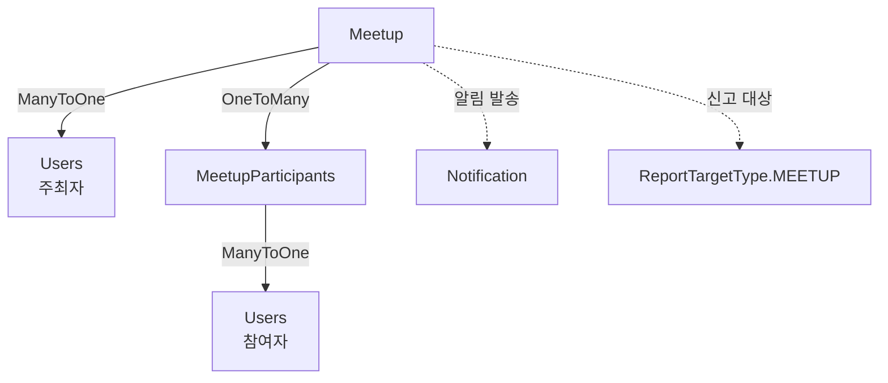

# Meetup 도메인

## 개요

오프라인 반려동물 모임 생성 및 참여 관리 도메인입니다.

## Entity 구조

### 1. Meetup (모임)

```java
@Entity
@Table(name = "meetup")
public class Meetup {
    Long idx;                    // PK
    String title;               // 모임 제목
    String description;          // 모임 설명 (TEXT)
    String location;             // 모임 장소 주소
    Double latitude;             // 위도
    Double longitude;            // 경도
    LocalDateTime date;          // 모임 일시
    Users organizer;             // 주최자 (ManyToOne)
    Integer maxParticipants;     // 최대 인원
    Integer currentParticipants; // 현재 참여자 수
    MeetupStatus status;        // 모임 상태
    LocalDateTime createdAt;
    LocalDateTime updatedAt;
}
```

**연관관계:**
- `ManyToOne` → Users (주최자)
- `OneToMany` → MeetupParticipants (참여자 목록)

### 2. MeetupParticipants (모임 참여자)

```java
@Entity
@Table(name = "meetup_participants")
public class MeetupParticipants {
    Long idx;                    // PK
    Meetup meetup;              // 모임 (ManyToOne)
    Users user;                  // 참여자 (ManyToOne)
    LocalDateTime joinedAt;       // 참여 일시
}
```

**연관관계:**
- `ManyToOne` → Meetup
- `ManyToOne` → Users (참여자)

## Enum 정의

### MeetupStatus
```java
public enum MeetupStatus {
    RECRUITING,   // 모집 중
    CONFIRMED,    // 확정
    COMPLETED,    // 완료
    CANCELLED     // 취소
}
```

## Service 주요 기능

### MeetupService

#### 1. 모임 관리
```java
// 모임 생성
MeetupDTO createMeetup(MeetupDTO dto)

// 모임 목록 조회 (페이징, 상태 필터)
Page<MeetupDTO> getAllMeetups(MeetupStatus status, int page, int size)

// 위치 기반 모임 검색 (반경 내)
List<MeetupDTO> searchByLocation(double lat, double lng, double radiusKm, LocalDateTime date)

// 모임 상세 조회
MeetupDTO getMeetup(long id)

// 모임 수정
MeetupDTO updateMeetup(long id, MeetupDTO dto)

// 모임 취소
void cancelMeetup(long id)

// 내가 주최한 모임
List<MeetupDTO> getMyOrganizedMeetups(long userId)

// 내가 참여한 모임
List<MeetupDTO> getMyParticipatedMeetups(long userId)
```

#### 2. 모임 참여 관리
```java
// 모임 참여
void joinMeetup(long meetupId, long userId)

// 모임 참여 취소
void leaveMeetup(long meetupId, long userId)

// 참여자 목록 조회
List<MeetupParticipantDTO> getParticipants(long meetupId)

// 참여 가능 여부 확인
boolean canJoin(long meetupId, long userId)
```

#### 3. 상태 관리
```java
// 모임 확정 (최소 인원 도달 시)
void confirmMeetup(long meetupId)

// 모임 완료 처리
void completeMeetup(long meetupId)

// 만료된 모임 자동 완료 (스케줄러)
@Scheduled(cron = "0 0 * * * ?")
void updateExpiredMeetups()
```

## 다른 도메인과의 연관관계

### Meetup과 다른 도메인



### 주요 상호작용

#### 1. User 도메인
- **Users → Meetup (OneToMany: 주최자)**
  - Users가 모임을 주최
  - 주최자만 모임 수정/취소 가능
  - 주최자 정보는 모임 상세에 표시

**예시:**
```java
// 사용자가 주최한 모임 목록
List<Meetup> organizedMeetups = meetupRepository.findByOrganizer(user);
```

- **Users → MeetupParticipants (OneToMany: 참여자)**
  - Users가 모임에 참여
  - 참여자 목록에서 사용자 정보 조회
  - 사용자별 참여 모임 이력 조회

**예시:**
```java
// 사용자가 참여한 모임 목록
List<Meetup> participatedMeetups = meetupRepository.findByParticipant(user);
```

#### 2. Notification 도메인
- **Meetup → Notification (간접)**
  - 모임 생성 시 알림 발송 (선택적)
  - 모임 참여 시 주최자에게 알림
  - 모임 확정 시 참여자들에게 알림
  - 모임 취소 시 참여자들에게 알림

**예시:**
```java
// 모임 참여 시 주최자에게 알림
@Async
public void notifyOrganizerOnJoin(Meetup meetup, Users participant) {
    Notification notification = Notification.builder()
        .user(meetup.getOrganizer())
        .type(NotificationType.MEETUP_JOINED)
        .title("새로운 참여자가 있습니다")
        .content(participant.getUsername() + "님이 모임에 참여했습니다")
        .relatedId(meetup.getIdx())
        .relatedType("MEETUP")
        .build();
    notificationRepository.save(notification);
}
```

#### 3. Report 도메인
- **Meetup → Report (폴리모픽)**
  - 부적절한 모임 신고
  - ReportTargetType.MEETUP으로 구분
  - 신고 처리 시 모임 취소 또는 숨김

**예시:**
```java
// 모임 신고 접수
Report report = Report.builder()
    .targetType(ReportTargetType.MEETUP)
    .targetIdx(meetup.getIdx())
    .reporter(reporter)
    .reason("부적절한 내용")
    .build();
```

#### 4. Statistics 도메인
- **Meetup → DailyStatistics (간접)**
  - 일별 통계에 모임 수 포함
  - 참여자 수 집계

### MeetupParticipants와 다른 도메인

#### 1. Meetup 도메인
- **MeetupParticipants → Meetup (ManyToOne)**
  - 참여자는 반드시 하나의 모임에 속함
  - 모임 삭제 시 참여자 정보도 삭제 (CascadeType.ALL)
  - 참여자 수는 Meetup의 currentParticipants에 저장

**예시:**
```java
// 참여자 수 동기화
@Transactional
public void joinMeetup(long meetupId, long userId) {
    Meetup meetup = meetupRepository.findById(meetupId).orElseThrow();
    
    // 인원 체크
    if (meetup.getCurrentParticipants() >= meetup.getMaxParticipants()) {
        throw new IllegalStateException("모임 인원이 가득 찼습니다.");
    }
    
    // 참여 추가
    MeetupParticipants participant = MeetupParticipants.builder()
        .meetup(meetup)
        .user(user)
        .build();
    participantRepository.save(participant);
    
    // 인원 증가
    meetup.setCurrentParticipants(meetup.getCurrentParticipants() + 1);
    meetupRepository.save(meetup);
}
```

#### 2. User 도메인
- **MeetupParticipants → Users (ManyToOne)**
  - 참여자 정보
  - 참여자 목록에서 사용자 프로필 조회
  - 중복 참여 방지 (Unique 제약)

## 비즈니스 로직

### 모임 생애주기

```
1. RECRUITING (모집 중)
   - 모임 생성 시 기본 상태
   - 참여자 모집 중
   - 주최자가 수정/취소 가능

2. CONFIRMED (확정)
   - 최소 인원 도달 시 자동 변경
   - 또는 주최자가 수동 확정
   - 참여자 추가 가능 (최대 인원까지)

3. COMPLETED (완료)
   - 모임 일시가 지나면 자동 완료
   - 또는 주최자가 수동 완료
   - 더 이상 참여 불가

4. CANCELLED (취소)
   - 주최자가 취소
   - 모든 참여자에게 알림 발송
   - 참여자 목록은 유지 (이력)
```

### 참여 규칙

1. **최대 인원 제한**
   - currentParticipants >= maxParticipants 시 참여 불가
   - 동시 참여 시 동시성 제어 필요

2. **중복 참여 방지**
   - 같은 사용자가 같은 모임에 중복 참여 불가
   - Unique 제약: (meetup_idx, user_idx)

3. **주최자 참여**
   - 주최자는 자동으로 참여자 목록에 포함
   - 또는 별도 참여 처리

## 동시성 제어

### 문제: 최대 인원 초과 참여

**시나리오:**
1. 모임 최대 인원: 10명, 현재 인원: 9명
2. 사용자 A, B가 동시에 참여 시도
3. 둘 다 "9명" 확인
4. **결과: 11명 (기대값: 10명)**

### 해결책 1: 비관적 락

```java
@Lock(LockModeType.PESSIMISTIC_WRITE)
@Query("SELECT m FROM Meetup m WHERE m.idx = :id")
Meetup findByIdWithLock(@Param("id") Long id);
```

```java
@Transactional
public void joinMeetup(long meetupId, long userId) {
    Meetup meetup = meetupRepository.findByIdWithLock(meetupId);
    Users user = usersRepository.findById(userId).orElseThrow();
    
    // 인원 체크
    if (meetup.getCurrentParticipants() >= meetup.getMaxParticipants()) {
        throw new IllegalStateException("모임 인원이 가득 찼습니다.");
    }
    
    // 중복 참여 체크
    if (participantRepository.existsByMeetupAndUser(meetup, user)) {
        throw new IllegalStateException("이미 참여한 모임입니다.");
    }
    
    // 참여 추가
    MeetupParticipants participant = MeetupParticipants.builder()
        .meetup(meetup)
        .user(user)
        .build();
    participantRepository.save(participant);
    
    // 인원 증가
    meetup.setCurrentParticipants(meetup.getCurrentParticipants() + 1);
    meetupRepository.save(meetup);
}
```

### 해결책 2: 낙관적 락

```java
@Entity
public class Meetup {
    @Version
    private Long version;  // 낙관적 락
}
```

```java
@Transactional
public void joinMeetup(long meetupId, long userId) {
    int maxRetries = 5;
    int attempt = 0;
    
    while (attempt < maxRetries) {
        try {
            Meetup meetup = meetupRepository.findById(meetupId).orElseThrow();
            
            if (meetup.getCurrentParticipants() >= meetup.getMaxParticipants()) {
                throw new IllegalStateException("모임 인원이 가득 찼습니다.");
            }
            
            // 참여 추가
            MeetupParticipants participant = ...;
            participantRepository.save(participant);
            
            // 인원 증가
            meetup.setCurrentParticipants(meetup.getCurrentParticipants() + 1);
            meetupRepository.save(meetup);  // 버전 체크
            
            return;
            
        } catch (OptimisticLockException e) {
            attempt++;
            if (attempt >= maxRetries) {
                throw new RuntimeException("모임 참여에 실패했습니다. 다시 시도해주세요.");
            }
            Thread.sleep(100);
        }
    }
}
```

### 해결책 3: UPDATE 쿼리 + 조건

```java
@Modifying
@Query("UPDATE Meetup m SET m.currentParticipants = m.currentParticipants + 1 " +
       "WHERE m.idx = :meetupId AND m.currentParticipants < m.maxParticipants")
int incrementParticipants(@Param("meetupId") Long meetupId);
```

## 성능 최적화

### 1. 인덱싱

```sql
-- 모임 상태별 조회
CREATE INDEX idx_meetup_status_date 
ON meetup(status, date DESC);

-- 주최자별 모임
CREATE INDEX idx_meetup_organizer 
ON meetup(organizer_idx, created_at DESC);

-- 위치 기반 검색 (Spatial Index)
CREATE SPATIAL INDEX idx_meetup_location 
ON meetup(latitude, longitude);

-- 참여자 조회
CREATE INDEX idx_meetup_participants_meetup 
ON meetup_participants(meetup_idx);

CREATE INDEX idx_meetup_participants_user 
ON meetup_participants(user_idx);

-- 중복 참여 방지
CREATE UNIQUE INDEX uk_meetup_participants 
ON meetup_participants(meetup_idx, user_idx);
```

### 2. N+1 문제 해결

```java
// 참여자와 사용자 정보를 함께 조회
@Query("SELECT mp FROM MeetupParticipants mp " +
       "JOIN FETCH mp.user " +
       "WHERE mp.meetup.idx = :meetupId")
List<MeetupParticipants> findByMeetupWithUser(@Param("meetupId") Long meetupId);
```

## API 엔드포인트

### 모임 (/api/meetups)
- `GET /` - 목록 조회 (페이징, 상태 필터)
- `GET /{id}` - 상세 조회
- `POST /` - 모임 생성
- `PUT /{id}` - 모임 수정
- `DELETE /{id}` - 모임 취소
- `GET /nearby` - 위치 기반 검색
- `GET /me/organized` - 내가 주최한 모임
- `GET /me/participated` - 내가 참여한 모임

### 모임 참여 (/api/meetups/{meetupId}/participants)
- `GET /` - 참여자 목록
- `POST /` - 모임 참여
- `DELETE /` - 참여 취소

## 테스트 시나리오

### 1. 모임 생애주기
- 모임 생성 (RECRUITING)
- 참여자 추가
- 최소 인원 도달 → CONFIRMED
- 모임 일시 지남 → COMPLETED

### 2. 동시 참여
- 2명이 동시에 마지막 자리 참여 시도
- 1명만 성공해야 함

### 3. 권한 관리
- 주최자: 수정/취소 가능
- 참여자: 참여 취소만 가능

## 개선 아이디어

### 기능
1. **채팅 기능**
   - 모임 참여자 간 채팅
   - WebSocket 또는 Firebase

2. **알림 강화**
   - 모임 하루 전 알림
   - 모임 확정 시 알림

3. **리뷰 시스템**
   - 모임 후 리뷰 작성
   - 참여자 평가

### 성능
1. **캐싱**
   - 인기 모임 목록 캐싱
   - 위치 기반 검색 결과 캐싱

2. **비동기 처리**
   - 알림 발송 비동기
   - 통계 수집 비동기

