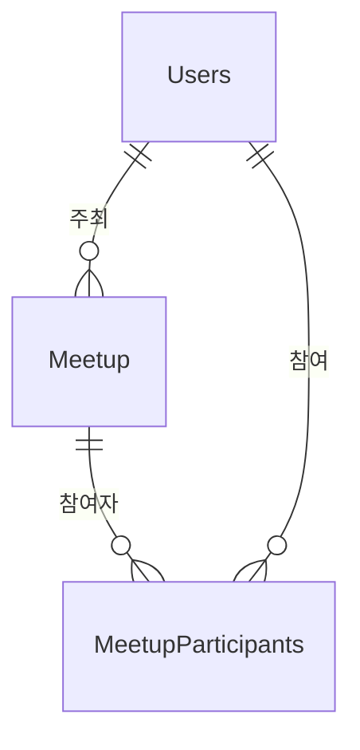

# Meetup 도메인 - 포트폴리오 상세 설명

## 1. 기능 설명

### 1.1 도메인 개요
- **역할**: 오프라인 반려동물 모임 생성 및 참여 관리 도메인입니다.
- **주요 기능**: 
  - 모임 생성/조회/수정/취소
  - 모임 참여/참여 취소
  - 최대 인원 제한
  - 모임 상태 관리 (RECRUITING → CONFIRMED → COMPLETED)
  - 위치 기반 모임 검색

### 1.2 기능 시연
> **스크린샷/영상 링크**: [기능 작동 영상 또는 스크린샷 추가]

#### 주요 기능 1: 모임 생성 및 참여
- **설명**: 사용자가 모임을 생성하고 다른 사용자들이 참여할 수 있습니다.
- **사용자 시나리오**: 
  1. 모임 생성 (제목, 설명, 장소, 일시, 최대 인원)
  2. 여러 사용자가 참여
  3. 최대 인원 도달 시 참여 불가
  4. 모임 일시 지남 → 자동 완료
- **스크린샷/영상**: 

---

## 2. 서비스 로직 설명

### 2.1 핵심 비즈니스 로직

#### 로직 1: 모임 참여 (최대 인원 제한)
```java
// MeetupService.java
@Transactional
public void joinMeetup(long meetupId, long userId) {
    Meetup meetup = meetupRepository.findById(meetupId).orElseThrow();
    Users user = usersRepository.findById(userId).orElseThrow();
    
    // 인원 체크
    if (meetup.getCurrentParticipants() >= meetup.getMaxParticipants()) {
        throw new IllegalStateException("모임 인원이 가득 찼습니다.");
    }
    
    // 중복 참여 체크
    if (participantRepository.existsByMeetupAndUser(meetup, user)) {
        throw new IllegalStateException("이미 참여한 모임입니다.");
    }
    
    // 참여 추가
    MeetupParticipants participant = MeetupParticipants.builder()
        .meetup(meetup)
        .user(user)
        .build();
    participantRepository.save(participant);
    
    // 인원 증가
    meetup.setCurrentParticipants(meetup.getCurrentParticipants() + 1);
    meetupRepository.save(meetup);
}
```

**설명**:
- **처리 흐름**: 모임 조회 → 인원 체크 → 중복 체크 → 참여 추가 → 인원 증가
- **주요 판단 기준**: 최대 인원 제한, 중복 참여 방지
- **동시성 제어**: 비관적 락 또는 낙관적 락 필요

---

## 3. 아키텍처 설명

### 3.1 도메인 구조
```
domain/meetup/
  ├── controller/
  │   └── MeetupController.java
  ├── service/
  │   └── MeetupService.java
  ├── entity/
  │   ├── Meetup.java
  │   └── MeetupParticipants.java
  └── repository/
      ├── MeetupRepository.java
      └── MeetupParticipantsRepository.java
```

### 3.2 엔티티 구조

#### Meetup (산책모임)
```java
@Entity
@Table(name = "meetup")
public class Meetup {
    private Long idx;
    private String title;                  // 모임 제목
    private String description;            // 모임 내용
    private String location;                // 모임 장소 주소
    private Double latitude;                // 위도
    private Double longitude;               // 경도
    private LocalDateTime date;            // 모임 일시
    private Users organizer;               // 모임 주최자
    private Integer maxParticipants;        // 최대 참여 인원
    private Integer currentParticipants;    // 현재 참여자 수
    private MeetupStatus status;            // 상태 (RECRUITING, CONFIRMED, COMPLETED)
    private LocalDateTime createdAt;
    private LocalDateTime updatedAt;
    private List<MeetupParticipants> participants; // 참여자 목록
}
```

#### MeetupParticipants (모임 참여자)
```java
@Entity
@Table(name = "meetupparticipants")
@IdClass(MeetupParticipantsId.class)
public class MeetupParticipants {
    @Id
    private Meetup meetup;                  // 모임
    @Id
    private Users user;                    // 참여자
    private LocalDateTime joinedAt;         // 참여 시간
}
```

### 3.3 엔티티 관계도 (ERD)


---

## 4. 트러블슈팅

---

## 5. 성능 최적화

### 5.1 DB 최적화

#### 인덱스 전략
```sql
-- 모임 상태별 조회
CREATE INDEX idx_meetup_status_date ON meetup(status, date DESC);

-- 주최자별 모임
CREATE INDEX idx_meetup_organizer ON meetup(organizer_idx, created_at DESC);

-- 중복 참여 방지
CREATE UNIQUE INDEX uk_meetup_participants ON meetup_participants(meetup_idx, user_idx);
```

---

## 6. 핵심 포인트 요약

### 기술적 하이라이트
1. **최대 인원 동시성 제어**: 비관적 락 또는 UPDATE 쿼리 + 조건
2. **중복 참여 방지**: Unique 제약조건
3. **자동 완료**: 스케줄러로 만료된 모임 자동 완료

### 학습한 점
- 동시성 제어 방법 (비관적 락, UPDATE 쿼리)
- 최대 인원 제한 구현
- 중복 참여 방지 전략

### 개선 가능한 부분
- 분산 락: 여러 인스턴스 환경에서 동시성 제어
- 채팅 기능: 모임 참여자 간 실시간 채팅
- 알림 강화: 모임 하루 전 알림
