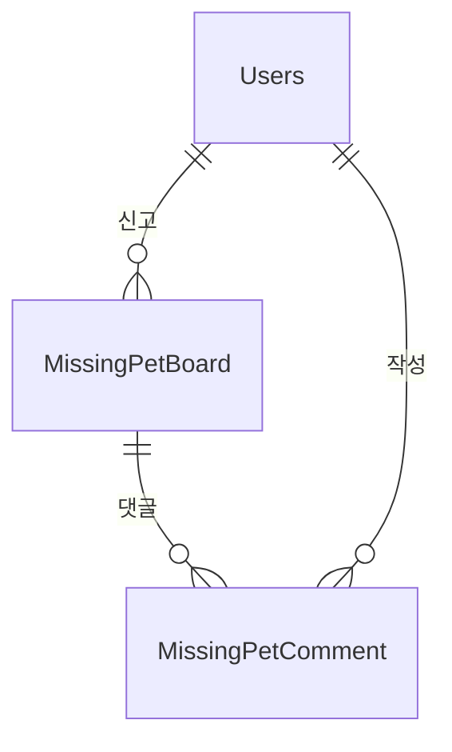

# Missing Pet 도메인 - 포트폴리오 상세 설명

## 1. 기능 설명

### 1.1 도메인 개요
- **역할**: 실종 동물 신고 및 관리 시스템으로, 반려동물을 잃어버린 사용자가 신고하고 다른 사용자들이 정보를 제공할 수 있습니다.
- **주요 기능**: 
  - 실종 동물 신고 생성/조회/수정
  - 위치 기반 검색 (반경 내)
  - 실종 동물 상태 관리 (MISSING → FOUND → CLOSED)
  - 목격 정보 댓글

### 1.2 기능 시연
> **스크린샷/영상 링크**: [기능 작동 영상 또는 스크린샷 추가]

#### 주요 기능 1: 실종 동물 신고
- **설명**: 사용자가 실종 동물 정보를 신고하고 사진을 첨부할 수 있습니다.
- **사용자 시나리오**: 
  1. 실종 동물 신고 (이름, 종, 품종, 성별, 나이, 색상, 실종 날짜, 실종 장소)
  2. 사진 첨부
  3. 위치 정보 입력 (위도, 경도)
  4. 다른 사용자들이 목격 정보 댓글 작성
- **스크린샷/영상**: 

#### 주요 기능 2: 위치 기반 검색
- **설명**: 내 위치 기준 반경 내 실종 동물을 검색할 수 있습니다.
- **사용자 시나리오**:
  1. 내 위치 확인
  2. 반경 설정 (예: 5km)
  3. 반경 내 실종 동물 목록 표시
- **스크린샷/영상**: 

---

## 2. 서비스 로직 설명

### 2.1 핵심 비즈니스 로직

#### 로직 1: 위치 기반 검색 (Haversine 공식)
```java
// MissingPetBoardService.java
public List<MissingPetBoardDTO> searchByLocation(double lat, double lng, double radiusKm) {
    List<MissingPetBoard> allMissingPets = missingPetBoardRepository
        .findByStatusAndIsDeletedFalse(MissingPetStatus.MISSING);
    
    return allMissingPets.stream()
        .filter(pet -> {
            double distance = calculateDistance(
                lat, lng, 
                pet.getLatitude().doubleValue(), 
                pet.getLongitude().doubleValue()
            );
            return distance <= radiusKm * 1000; // km를 미터로 변환
        })
        .map(converter::toDTO)
        .collect(Collectors.toList());
}

private double calculateDistance(double lat1, double lng1, double lat2, double lng2) {
    final int R = 6371; // 지구 반경 (km)
    double dLat = Math.toRadians(lat2 - lat1);
    double dLng = Math.toRadians(lng2 - lng1);
    double a = Math.sin(dLat / 2) * Math.sin(dLat / 2) +
               Math.cos(Math.toRadians(lat1)) * Math.cos(Math.toRadians(lat2)) *
               Math.sin(dLng / 2) * Math.sin(dLng / 2);
    double c = 2 * Math.atan2(Math.sqrt(a), Math.sqrt(1 - a));
    return R * c;
}
```

**설명**:
- **처리 흐름**: 모든 실종 동물 조회 → 거리 계산 → 반경 내 필터링
- **주요 판단 기준**: Haversine 공식으로 거리 계산, 반경 내 여부 확인

---

## 3. 아키텍처 설명

### 3.1 도메인 구조
```
domain/board/
  ├── controller/
  │   └── MissingPetBoardController.java
  ├── service/
  │   └── MissingPetBoardService.java
  ├── entity/
  │   ├── MissingPetBoard.java
  │   └── MissingPetComment.java
  └── repository/
      ├── MissingPetBoardRepository.java
      └── MissingPetCommentRepository.java
```

### 3.2 엔티티 구조

#### MissingPetBoard (실종 동물 게시글)
```java
@Entity
@Table(name = "MissingPetBoard")
public class MissingPetBoard {
    private Long idx;
    private Users user;                    // 작성자
    private String title;                  // 제목
    private String content;                // 내용
    private String petName;                // 반려동물 이름
    private String species;                // 종류
    private String breed;                  // 품종
    private MissingPetGender gender;       // 성별
    private String age;                    // 나이
    private String color;                  // 색상
    private LocalDate lostDate;            // 실종일
    private String lostLocation;           // 실종 위치
    private BigDecimal latitude;           // 위도
    private BigDecimal longitude;          // 경도
    private MissingPetStatus status;        // 상태 (MISSING, FOUND)
    private LocalDateTime createdAt;
    private LocalDateTime updatedAt;
    private Boolean isDeleted;
    private List<MissingPetComment> comments; // 댓글 목록
}
```

#### MissingPetComment (실종 동물 댓글)
```java
@Entity
@Table(name = "MissingPetComment")
public class MissingPetComment {
    private Long idx;
    private MissingPetBoard board;         // 실종 동물 게시글
    private Users user;                    // 작성자
    private String content;                // 내용
    private String address;                // 목격 위치 주소
    private Double latitude;               // 목격 위치 위도
    private Double longitude;              // 목격 위치 경도
    private LocalDateTime createdAt;
    private Boolean isDeleted;
}
```

### 3.3 엔티티 관계도 (ERD)


---

## 4. 트러블슈팅

---

## 5. 성능 최적화

### 5.1 DB 최적화

#### 인덱스 전략
```sql
-- 상태별 조회
CREATE INDEX idx_missing_pet_status ON MissingPetBoard(status, is_deleted, created_at DESC);

-- 위치 기반 검색 (Spatial Index)
CREATE SPATIAL INDEX idx_missing_pet_location ON MissingPetBoard(longitude, latitude);
```

---

## 6. 핵심 포인트 요약

### 기술적 하이라이트
1. **위치 기반 검색**: Haversine 공식으로 거리 계산
2. **MySQL Spatial Index**: 반경 검색 성능 향상
3. **실종 동물 상태 관리**: MISSING → FOUND → CLOSED

### 학습한 점
- 위치 기반 검색 구현 (Haversine 공식)
- MySQL Spatial Index 활용
- 반경 검색 최적화

### 개선 가능한 부분
- 이미지 인식 AI: 사진 업로드 시 유사 동물 자동 검색
- 푸시 알림: 내 위치 근처 실종 신고 시 알림
- 지도 시각화: 실종 위치 지도 표시
