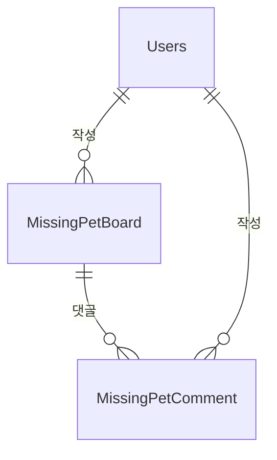

# MissingPet 도메인 - 포트폴리오 상세 설명

## 1. 개요

MissingPet 도메인은 실종 반려동물 제보 및 목격 정보 공유 도메인입니다. 사용자가 실종 동물 정보를 등록하고, 목격자가 댓글로 목격 정보를 남기며, 제보자-목격자 간 채팅으로 연락할 수 있습니다. **Board 도메인 내**에 위치하며 (`domain/board/`), MissingPetBoardController가 `/api/missing-pets` API를 제공합니다.

**주요 기능**:
- 실종 제보 게시글 CRUD (작성/조회/수정/삭제)
- 실종 제보 상태 관리 (MISSING → FOUND → RESOLVED)
- 목격 댓글 (주소, 좌표, 이미지 첨부)
- 제보자-목격자 채팅방 자동 생성 ("목격했어요" 버튼)
- 게시글/댓글 이미지 첨부 (File 도메인 연동)
- 댓글 작성 시 제보자 알림 (Notification 도메인 연동)
- 관리자용 페이징 조회, 삭제/복구, 상태 변경

---

## 2. 기능 설명

### 2.1 실종 제보 게시글

**작성 프로세스**:
1. 실종 동물 정보 입력 (제목, 내용, 반려동물 이름, 종류, 품종, 성별, 나이, 색상, 실종일, 실종 위치, 좌표)
2. 이메일 인증 확인 (`EmailVerificationPurpose.MISSING_PET`)
3. 게시글 저장 및 이미지 첨부 (FileTargetType.MISSING_PET)

**상태**:
- **MISSING**: 실종 중
- **FOUND**: 발견됨
- **RESOLVED**: 종료

### 2.2 목격 댓글

**댓글 작성**:
- 목격 위치(주소, 위도/경도) — 엔티티는 `BigDecimal` 위도/경도
- 이미지: DTO `imageUrl` → `syncSingleAttachment(FileTargetType.MISSING_PET_COMMENT, ...)`
- 게시글 작성자(`board.user`)에게 알림 (`@Async` `sendMissingPetCommentNotificationAsync`) — **댓글 작성자와 게시글 작성자가 다를 때만**

### 2.3 채팅 연동

**"목격했어요" 버튼**:
- `POST /api/missing-pets/{boardIdx}/start-chat` — 메서드에 `@PreAuthorize("isAuthenticated()")`
- 목격자 ID는 쿼리 파라미터가 아닌 **JWT principal**에서 `requireCurrentUserIdx()`로 조회 (`witnessId` 쿼리 파라미터 없음)
- `getUserIdByBoardIdx(boardIdx)`로 제보자 ID만 조회 후 `ConversationService.createMissingPetChat(boardIdx, reporterId, witnessId)`

---

## 3. 서비스 로직 설명

### 3.1 핵심 비즈니스 로직

#### 로직 1: 실종 제보 목록 조회 (페이징)
**구현 위치**: `MissingPetBoardService.getBoardsWithPaging()`

- **페이징**: `findAllByOrderByCreatedAtDesc(pageable)` 또는 `findByStatusOrderByCreatedAtDesc(status, pageable)`
- **파일 배치 조회**: `AttachmentFileService.getAttachmentsBatch(FileTargetType.MISSING_PET, boardIds)` (N+1 방지)
- **댓글 수 배치 조회**: `MissingPetCommentService.getCommentCountsBatch(boardIds)` (N+1 방지)
- **DTO 변환**: `toBoardDTOWithoutComments()` (댓글 lazy loading 트리거 안 함)

#### 로직 2: 실종 제보 상세 조회
**구현 위치**: `MissingPetBoardService.getBoard()`

- **게시글 조회**: `findByIdWithUser(id)` → `MissingPetBoardNotFoundException`
- **삭제 여부 확인**: `isDeleted` 시 예외
- **댓글 페이징**: `commentPage`, `commentSize` 파라미터 (0이면 댓글 제외)
- **댓글 수**: `getCommentCount(board)` → `countByBoardAndIsDeletedFalse` (COUNT 쿼리)

#### 로직 3: 실종 제보 작성/수정/삭제
**구현 위치**: `MissingPetBoardService.createBoard()`, `updateBoard()`, `deleteBoard()`

- **이메일 인증**: `EmailVerificationRequiredException`, `EmailVerificationPurpose.MISSING_PET`
- **수정/삭제**: `findByIdWithUser()`로 작성자 확인 후 이메일 인증 체크
- **삭제 시**: 게시글 + 관련 댓글 모두 Soft Delete (`deleteAllCommentsByBoard` → `softDeleteAllByBoardIdx`)

#### 로직 4: 댓글 작성/삭제
**구현 위치**: `MissingPetCommentService.addComment()`, `deleteComment()`

- **addComment**: `MissingPetBoardNotFoundException`, `UserNotFoundException`, 알림 비동기 발송
- **deleteComment**: `MissingPetBoardNotFoundException`, `IllegalArgumentException`(Comment not found), `CommentNotBelongToBoardException`

#### 로직 5: 관리자 페이징 조회
**구현 위치**: `MissingPetBoardService.getAdminBoardsWithPaging()`

- **Specification**: status, deleted, q(검색어) DB 레벨 필터링
- **검색 범위**: 제목, 내용, 반려동물 이름, 작성자명
- **user fetch**: N+1 방지

### 3.2 서비스 메서드 구조

#### MissingPetBoardService
| 메서드 | 설명 | 주요 로직 |
|--------|------|-----------|
| `getBoardsWithPaging()` | 목록 조회 (페이징) | status 필터, 파일/댓글수 배치 조회, toBoardDTOWithoutComments |
| `getBoard()` | 상세 조회 | findByIdWithUser, 댓글 페이징, getCommentCount |
| `createBoard()` | 작성 | UserNotFoundException, 이메일 인증, syncSingleAttachment |
| `updateBoard()` | 수정 | MissingPetBoardNotFoundException, 이메일 인증, 선택적 업데이트 |
| `deleteBoard()` | 삭제 | 이메일 인증, deleteAllCommentsByBoard(softDeleteAllByBoardIdx) |
| `restoreBoard()` | 복구 | 관리자용, isDeleted=false |
| `updateStatus()` | 상태 변경 | MISSING/FOUND/RESOLVED |
| `getUserIdByBoardIdx()` | 작성자 ID 조회 | findUserIdByIdx (프로젝션) |
| `getAdminBoardsWithPaging()` | 관리자 목록 | Specification, status/deleted/q 필터 |

#### MissingPetCommentService
| 메서드 | 설명 | 주요 로직 |
|--------|------|-----------|
| `getCommentsWithPaging()` | 댓글 목록 (페이징) | findByBoardIdAndIsDeletedFalseOrderByCreatedAtAsc, 파일 배치 조회 |
| `getComments()` | 댓글 목록 (전체) | 하위 호환성 |
| `addComment()` | 댓글 작성 | MissingPetBoardNotFoundException, UserNotFoundException, 알림 비동기 |
| `deleteComment()` | 댓글 삭제 | CommentNotBelongToBoardException, Soft Delete |
| `getCommentCount()` | 댓글 수 | countByBoardAndIsDeletedFalse |
| `getCommentCountsBatch()` | 댓글 수 배치 | countCommentsByBoardIds (N+1 방지) |
| `deleteAllCommentsByBoard()` | 게시글 댓글 일괄 삭제 | softDeleteAllByBoardIdx (배치 UPDATE) |

### 3.3 예외 처리
| 예외 | 발생 시점 |
|------|-----------|
| `MissingPetBoardNotFoundException` | 게시글 조회 실패, getBoard, updateBoard, deleteBoard, getUserIdByBoardIdx 등 |
| `BoardValidationException` | 공개 API `PATCH .../status`에서 body에 `status` 없음 / 잘못된 enum (`MissingPetBoardController`) |
| `IllegalArgumentException` | 관리자 `PATCH .../status`에서 body 누락·잘못된 값 (`AdminMissingPetController`는 `BoardValidationException` 미사용) |
| `CommentNotBelongToBoardException` | 댓글이 해당 게시글에 속하지 않음 (deleteComment) |
| `UserNotFoundException` | 사용자 조회 실패 (createBoard, addComment) |
| `EmailVerificationRequiredException` | 실종 제보 작성/수정/삭제 시 이메일 미인증 |

---

## 4. 아키텍처 설명

### 4.1 도메인 구조

MissingPet 관련 코드는 **Board 도메인 내**에 위치합니다 (`domain/board/`).

```
domain/board/
  ├── controller/
  │   └── MissingPetBoardController.java    # /api/missing-pets
  ├── service/
  │   ├── MissingPetBoardService.java
  │   └── MissingPetCommentService.java
  ├── entity/
  │   ├── MissingPetBoard.java
  │   ├── MissingPetComment.java
  │   ├── MissingPetStatus.java (enum: MISSING, FOUND, RESOLVED)
  │   └── MissingPetGender.java (enum)
  ├── repository/
  │   ├── MissingPetBoardRepository.java
  │   ├── MissingPetCommentRepository.java
  │   ├── JpaMissingPetBoardAdapter.java
  │   ├── JpaMissingPetCommentAdapter.java
  │   ├── SpringDataJpaMissingPetBoardRepository.java
  │   └── SpringDataJpaMissingPetCommentRepository.java
  ├── dto/
  │   ├── MissingPetBoardDTO.java
  │   ├── MissingPetBoardPageResponseDTO.java
  │   ├── MissingPetCommentDTO.java
  │   └── MissingPetCommentPageResponseDTO.java
  ├── converter/
  │   └── MissingPetConverter.java
  └── exception/
      └── MissingPetBoardNotFoundException.java

domain/admin/
  └── controller/
      └── AdminMissingPetController.java    # /api/admin/missing-pets
```

### 4.2 엔티티 구조

#### MissingPetBoard
- **BaseTimeEntity** 상속 (createdAt, updatedAt)
- **필드**: idx, user, title, content, petName, species, breed, gender, age, color, lostDate, lostLocation, latitude, longitude, status, isDeleted, deletedAt, comments
- **Soft Delete**: isDeleted, deletedAt
- **상태**: MissingPetStatus (MISSING, FOUND, RESOLVED)

#### MissingPetComment
- **BaseTimeEntity 미사용** — `createdAt`은 `@PrePersist`로 설정
- **필드**: idx, board, user, content, address, latitude, longitude (`BigDecimal`), isDeleted, deletedAt
- **Soft Delete**: isDeleted, deletedAt

### 4.3 엔티티 관계도


### 4.4 API 설계

#### MissingPetBoardController (`/api/missing-pets`)
컨트롤러에 클래스 단위 `@PreAuthorize` 없음 — `SecurityConfig`에서 `/api/**` 인증이 필요한 구성이 일반적.

| 엔드포인트 | Method | 설명 |
|-----------|--------|------|
| `/api/missing-pets` | GET | 목록 조회 (페이징, `status`, `page`/`size` 기본 0/20) |
| `/api/missing-pets/{id}` | GET | 상세 (`commentPage`/`commentSize` 기본 0/20, `commentSize=0`이면 상세 응답에 댓글 목록 제외) |
| `/api/missing-pets` | POST | 작성 — 서비스에서 `EmailVerificationPurpose.MISSING_PET` |
| `/api/missing-pets/{id}` | PUT | 수정 — 동일 이메일 인증 |
| `/api/missing-pets/{id}/status` | PATCH | JSON body `{"status":"MISSING"|"FOUND"|"RESOLVED"}` — 없음/잘못된 값 시 `BoardValidationException` |
| `/api/missing-pets/{id}` | DELETE | 소프트 삭제 — 응답 `{"success": true}` (204 아님), 댓글 일괄 소프트 삭제 |
| `/api/missing-pets/{id}/comments` | GET | 댓글 목록 (페이징, 기본 0/20) |
| `/api/missing-pets/{id}/comments` | POST | 댓글 작성 |
| `/api/missing-pets/{boardId}/comments/{commentId}` | DELETE | 댓글 소프트 삭제 — 응답 `{"success": true}` |
| `/api/missing-pets/{boardIdx}/start-chat` | POST | 목격자 = JWT principal (`requireCurrentUserIdx()`), 쿼리 파라미터 없음, `@PreAuthorize("isAuthenticated()")` |

#### AdminMissingPetController (`/api/admin/missing-pets`, `@PreAuthorize("hasAnyRole('ADMIN','MASTER')")`)
| 엔드포인트 | Method | 설명 |
|-----------|--------|------|
| `/api/admin/missing-pets/paging` | GET | 목록 (`status`, `deleted`, `q`, `page`/`size` 기본 0/20) — `getAdminBoardsWithPaging` |
| `/api/admin/missing-pets/{id}` | GET | 상세 — `getBoard(id, null, null)` (댓글 없음) |
| `/api/admin/missing-pets/{id}/status` | PATCH | JSON body `{"status":...}` — 누락/오류 시 **`IllegalArgumentException`** (공개 API와 예외 타입 다름) |
| `/api/admin/missing-pets/{id}/delete` | POST | 소프트 삭제 — **`204 No Content`** — 서비스는 공개 API와 동일 `deleteBoard` → **게시글 작성자 이메일 인증** 필요(관리자 우회 없음) |
| `/api/admin/missing-pets/{id}/restore` | POST | 복구 — `restoreBoard` |
| `/api/admin/missing-pets/{boardId}/comments` | GET | 전체 댓글 후 메모리에서 `deleted` 필터 |
| `/api/admin/missing-pets/{boardId}/comments/{commentId}/delete` | POST | 댓글 삭제 — **`204 No Content`** |

---

## 5. 다른 도메인과의 연관관계

- **User**: 작성자, 이메일 인증 (MISSING_PET)
- **File**: 게시글/댓글 이미지 (FileTargetType.MISSING_PET, MISSING_PET_COMMENT)
- **Chat**: 제보자-목격자 채팅방 (`ConversationService.createMissingPetChat`)
- **Notification**: 댓글 작성 시 제보자 알림 (MISSING_PET_COMMENT)
- **Report**: 실종 제보 신고 (ReportTargetType)

---

## 6. 성능 최적화

- **파일 배치 조회**: `getAttachmentsBatch` (N+1 방지)
- **댓글 수 배치 조회**: `getCommentCountsBatch`, `countCommentsByBoardIds`
- **댓글 수 단건**: `countByBoardAndIsDeletedFalse` (COUNT 쿼리, N건 로드 방지)
- **게시글 삭제 시 댓글**: `softDeleteAllByBoardIdx` (배치 UPDATE, N건 루프 save 제거)
- **채팅 시작**: `getUserIdByBoardIdx` (프로젝션, getBoard 전체 조회 대체)
- **관리자 목록**: Specification + DB 페이징 (메모리 필터링 제거)
