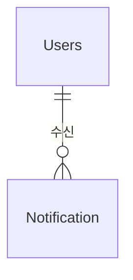

# Notification 도메인 - 포트폴리오 상세 설명

## 1. 기능 설명

### 1.1 도메인 개요
- **역할**: 사용자 알림 시스템으로, 다양한 이벤트 발생 시 사용자에게 알림을 전송합니다.
- **주요 기능**: 
  - 알림 생성/조회/읽음 처리
  - 실시간 알림 (SSE - Server-Sent Events)
  - 알림 타입별 관리 (댓글, 좋아요, 펫케어, 모임 등)
  - 읽은 알림 자동 정리 (30일 후 삭제)

### 1.2 기능 시연
> **스크린샷/영상 링크**: [기능 작동 영상 또는 스크린샷 추가]

#### 주요 기능 1: 실시간 알림 (SSE)
- **설명**: 댓글 작성, 좋아요 등 이벤트 발생 시 실시간으로 알림을 전송합니다.
- **사용자 시나리오**: 
  1. 사용자가 SSE 연결
  2. 댓글 작성 시 게시글 작성자에게 알림 발송
  3. 실시간으로 알림 수신
  4. 알림 클릭 시 읽음 처리
- **스크린샷/영상**: 

---

## 2. 서비스 로직 설명

### 2.1 핵심 비즈니스 로직

#### 로직 1: 알림 생성 및 발송
**구현 위치**: `NotificationService.createNotification()` (Lines 44-70)

**핵심 로직**:
- **알림 생성**: `Notification` 엔티티 생성 및 DB 저장
- **Redis 저장**: `saveToRedis()`로 최신 알림 목록 관리 (최대 50개, 24시간 TTL)
- **SSE 발송**: `sseService.sendNotification()`로 실시간 알림 전송 (연결된 경우)
- **비동기 처리**: `@Transactional`로 트랜잭션 보장 (비동기는 아님)

#### 로직 2: 알림 목록 조회
**구현 위치**: `NotificationService.getUserNotifications()` (Lines 75-97)

**핵심 로직**:
- **Redis 우선 조회**: Redis에서 최신 알림 목록 조회 시도
- **DB 병합**: Redis에 데이터가 있으면 DB와 병합하여 반환 (중복 제거)
- **최신순 정렬**: `createdAt` 기준 내림차순 정렬

#### 로직 3: SSE 연결 관리
**구현 위치**: `NotificationSseService` (별도 서비스)

**핵심 로직**:
- **SSE 연결 생성**: `SseEmitter` 생성 및 연결 저장
- **연결 종료 처리**: `onCompletion`, `onTimeout`, `onError`로 자동 정리
- **실시간 발송**: 연결된 사용자에게 알림 실시간 전송

---

## 3. 아키텍처 설명

### 3.1 도메인 구조
```
domain/notification/
  ├── controller/
  │   └── NotificationController.java
  ├── service/
  │   ├── NotificationService.java
  │   └── NotificationSseService.java
  ├── entity/
  │   └── Notification.java
  └── repository/
      └── NotificationRepository.java
```

### 3.2 엔티티 구조

#### Notification (알림)
```java
@Entity
@Table(name = "notifications")
public class Notification {
    private Long idx;
    private Users user;                    // 알림을 받을 사용자
    @Enumerated(EnumType.STRING)
    private NotificationType type;         // 알림 타입
    private String title;                  // 알림 제목
    @Column(length = 500)
    private String content;                // 알림 내용
    private Long relatedId;                // 관련 게시글/댓글 ID
    private String relatedType;            // 관련 타입 (BOARD, CARE_REQUEST, MISSING_PET 등)
    @Builder.Default
    private Boolean isRead = false;        // 읽음 여부
    private LocalDateTime createdAt;       // @PrePersist로 자동 설정
}
```

### 3.3 엔티티 관계도 (ERD)


---

## 4. 트러블슈팅

---

## 5. 성능 최적화

### 5.1 DB 최적화

#### 인덱스 전략
```sql
-- 사용자별 알림 조회
CREATE INDEX idx_notification_user_created 
ON notifications(user_idx, created_at DESC);

-- 읽지 않은 알림 조회
CREATE INDEX idx_notification_user_unread 
ON notifications(user_idx, is_read, created_at DESC);
```

### 5.2 애플리케이션 레벨 최적화

#### 비동기 처리
```java
@Configuration
@EnableAsync
public class AsyncConfig {
    @Bean
    public Executor taskExecutor() {
        ThreadPoolTaskExecutor executor = new ThreadPoolTaskExecutor();
        executor.setCorePoolSize(5);
        executor.setMaxPoolSize(10);
        executor.setQueueCapacity(100);
        return executor;
    }
}
```

---

## 6. 핵심 포인트 요약

### 기술적 하이라이트
1. **Redis 활용**: 최신 알림 목록을 Redis에 저장 (최대 50개, 24시간 TTL)
2. **실시간 알림 (SSE)**: Server-Sent Events로 실시간 알림 발송
3. **Redis-DB 병합**: 알림 목록 조회 시 Redis와 DB 데이터 병합 (중복 제거)
4. **읽음 처리**: 읽음 처리 시 Redis에서도 제거
5. **연결 관리**: 타임아웃 및 자동 정리로 연결 누수 방지

