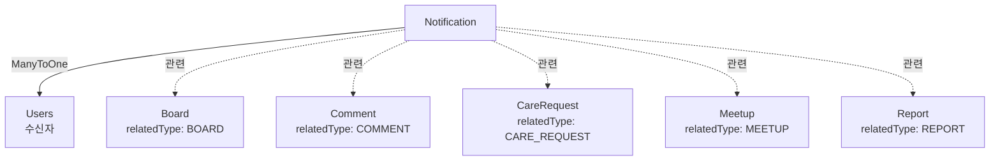

# Notification 도메인

## 개요

사용자 알림 시스템으로, 다양한 이벤트 발생 시 사용자에게 알림을 전송하는 도메인입니다.

## Entity 구조

### Notification (알림)

```java
@Entity
@Table(name = "notifications")
public class Notification {
    Long idx;                    // PK
    Users user;                  // 수신자 (ManyToOne)
    NotificationType type;       // 알림 유형
    String title;                // 알림 제목
    String content;              // 알림 내용 (최대 500자)
    Long relatedId;              // 관련 ID (게시글, 댓글, 펫케어 등)
    String relatedType;           // 관련 타입 (BOARD, COMMENT, CARE_REQUEST 등)
    Boolean isRead;              // 읽음 여부
    LocalDateTime createdAt;     // 생성 일시
}
```

**연관관계:**
- `ManyToOne` → Users (수신자)

## Enum 정의

### NotificationType
```java
public enum NotificationType {
    COMMENT,          // 댓글 작성
    REPLY,            // 답글 작성
    LIKE,             // 좋아요
    CARE_APPLICATION, // 펫케어 지원
    CARE_APPROVED,    // 펫케어 승인
    CARE_REJECTED,    // 펫케어 거절
    MEETUP_JOINED,    // 모임 참여
    MEETUP_CANCELLED, // 모임 취소
    REPORT_HANDLED,   // 신고 처리 완료
    SYSTEM            // 시스템 알림
}
```

## Service 주요 기능

### NotificationService

#### 1. 알림 관리
```java
// 알림 생성
NotificationDTO createNotification(NotificationDTO dto)

// 알림 목록 조회 (사용자별, 페이징)
Page<NotificationDTO> getNotificationsByUser(long userId, int page, int size)

// 읽지 않은 알림 목록
List<NotificationDTO> getUnreadNotifications(long userId)

// 읽지 않은 알림 수
int getUnreadCount(long userId)

// 알림 읽음 처리
void markAsRead(long notificationId)

// 모든 알림 읽음 처리
void markAllAsRead(long userId)

// 알림 삭제
void deleteNotification(long notificationId)
```

#### 2. 알림 발송 (비동기)
```java
// 댓글 작성 시 알림
@Async
void notifyCommentCreated(Comment comment)

// 펫케어 지원 시 알림
@Async
void notifyCareApplication(CareApplication application)

// 모임 참여 시 알림
@Async
void notifyMeetupJoined(Meetup meetup, Users participant)
```

## 다른 도메인과의 연관관계

### Notification과 다른 도메인



### 주요 상호작용

#### 1. User 도메인
- **Users → Notification (OneToMany)**
  - Users가 알림을 수신
  - 사용자별 알림 목록 조회
  - 읽지 않은 알림 수 집계

**예시:**
```java
// 사용자별 알림 목록
List<Notification> notifications = notificationRepository.findByUserOrderByCreatedAtDesc(user);
```

#### 2. Board 도메인
- **Board → Notification (간접)**
  - 댓글 작성 시 게시글 작성자에게 알림
  - 좋아요 추가 시 알림 (선택적)
  - relatedType: "BOARD", relatedId: board.idx

**예시:**
```java
// 댓글 작성 시 알림 발송
@Async
public void notifyCommentCreated(Comment comment) {
    Board board = comment.getBoard();
    Users boardAuthor = board.getUser();
    
    // 본인 댓글에는 알림 안 보냄
    if (boardAuthor.getIdx().equals(comment.getUser().getIdx())) {
        return;
    }
    
    Notification notification = Notification.builder()
        .user(boardAuthor)
        .type(NotificationType.COMMENT)
        .title("새 댓글이 달렸습니다")
        .content(comment.getContent())
        .relatedId(board.getIdx())
        .relatedType("BOARD")
        .build();
    notificationRepository.save(notification);
}
```

#### 3. Care 도메인
- **CareRequest → Notification (간접)**
  - 펫케어 지원 시 요청자에게 알림
  - 펫케어 승인/거절 시 지원자에게 알림
  - relatedType: "CARE_REQUEST", relatedId: careRequest.idx

**예시:**
```java
// 펫케어 지원 시 알림
@Async
public void notifyCareApplication(CareApplication application) {
    CareRequest request = application.getCareRequest();
    Users requester = request.getUser();
    
    Notification notification = Notification.builder()
        .user(requester)
        .type(NotificationType.CARE_APPLICATION)
        .title("펫케어 지원이 들어왔습니다")
        .content(application.getApplicant().getUsername() + "님이 지원했습니다")
        .relatedId(request.getIdx())
        .relatedType("CARE_REQUEST")
        .build();
    notificationRepository.save(notification);
}

// 펫케어 승인 시 알림
@Async
public void notifyCareApproved(CareApplication application) {
    Users applicant = application.getApplicant();
    
    Notification notification = Notification.builder()
        .user(applicant)
        .type(NotificationType.CARE_APPROVED)
        .title("펫케어 지원이 승인되었습니다")
        .content("축하합니다! 펫케어 지원이 승인되었습니다")
        .relatedId(application.getCareRequest().getIdx())
        .relatedType("CARE_REQUEST")
        .build();
    notificationRepository.save(notification);
}
```

#### 4. Meetup 도메인
- **Meetup → Notification (간접)**
  - 모임 참여 시 주최자에게 알림
  - 모임 취소 시 참여자들에게 알림
  - relatedType: "MEETUP", relatedId: meetup.idx

**예시:**
```java
// 모임 참여 시 알림
@Async
public void notifyMeetupJoined(Meetup meetup, Users participant) {
    Users organizer = meetup.getOrganizer();
    
    Notification notification = Notification.builder()
        .user(organizer)
        .type(NotificationType.MEETUP_JOINED)
        .title("새로운 참여자가 있습니다")
        .content(participant.getUsername() + "님이 모임에 참여했습니다")
        .relatedId(meetup.getIdx())
        .relatedType("MEETUP")
        .build();
    notificationRepository.save(notification);
}
```

#### 5. Report 도메인
- **Report → Notification (간접)**
  - 신고 처리 완료 시 신고자에게 알림
  - relatedType: "REPORT", relatedId: report.idx

**예시:**
```java
// 신고 처리 완료 시 알림
@Async
public void notifyReportHandled(Report report) {
    Users reporter = report.getReporter();
    
    Notification notification = Notification.builder()
        .user(reporter)
        .type(NotificationType.REPORT_HANDLED)
        .title("신고가 처리되었습니다")
        .content("신고하신 내용이 처리되었습니다: " + report.getActionTaken())
        .relatedId(report.getIdx())
        .relatedType("REPORT")
        .build();
    notificationRepository.save(notification);
}
```

## 비즈니스 로직

### 알림 생성 규칙

1. **중복 알림 방지**
   - 같은 이벤트에 대해 짧은 시간 내 중복 알림 방지
   - 예: 댓글 여러 개 작성 시 마지막 댓글만 알림

2. **본인 알림 제외**
   - 본인이 작성한 댓글/좋아요에는 알림 안 보냄
   - 본인 게시글에 본인 댓글 작성 시 알림 안 보냄

3. **읽음 처리**
   - 알림 클릭 시 자동 읽음 처리
   - 일괄 읽음 처리 기능

### 알림 정리 정책

```java
// 읽은 알림 30일 후 자동 삭제
@Scheduled(cron = "0 0 2 * * ?")  // 매일 새벽 2시
public void cleanupOldNotifications() {
    LocalDateTime thirtyDaysAgo = LocalDateTime.now().minusDays(30);
    
    List<Notification> oldReadNotifications = notificationRepository
        .findByIsReadTrueAndCreatedAtBefore(thirtyDaysAgo);
    
    notificationRepository.deleteAll(oldReadNotifications);
    log.info("삭제된 알림 수: {}", oldReadNotifications.size());
}
```

## 성능 최적화

### 1. 인덱싱

```sql
-- 사용자별 알림 조회
CREATE INDEX idx_notification_user_created 
ON notifications(user_idx, created_at DESC);

-- 읽지 않은 알림 조회
CREATE INDEX idx_notification_user_unread 
ON notifications(user_idx, is_read, created_at DESC);

-- 알림 정리 쿼리
CREATE INDEX idx_notification_read_created 
ON notifications(is_read, created_at);
```

### 2. 비동기 처리

```java
@Configuration
@EnableAsync
public class AsyncConfig {
    
    @Bean
    public Executor taskExecutor() {
        ThreadPoolTaskExecutor executor = new ThreadPoolTaskExecutor();
        executor.setCorePoolSize(5);
        executor.setMaxPoolSize(10);
        executor.setQueueCapacity(100);
        executor.setThreadNamePrefix("notification-");
        executor.initialize();
        return executor;
    }
}
```

### 3. 배치 삽입

```java
// 여러 알림을 한 번에 저장
public void createNotificationsBatch(List<Notification> notifications) {
    notificationRepository.saveAll(notifications);
}
```

## API 엔드포인트

### 알림 (/api/notifications)
- `GET /` - 알림 목록 (페이징)
- `GET /unread` - 읽지 않은 알림
- `GET /unread/count` - 읽지 않은 알림 수
- `PUT /{id}/read` - 알림 읽음 처리
- `PUT /read-all` - 모든 알림 읽음 처리
- `DELETE /{id}` - 알림 삭제

## 테스트 시나리오

### 1. 알림 생성
- 댓글 작성 → 게시글 작성자에게 알림
- 본인 댓글 → 알림 없음

### 2. 알림 읽음 처리
- 알림 클릭 → 자동 읽음 처리
- 읽지 않은 알림 수 감소

### 3. 알림 정리
- 읽은 알림 30일 후 자동 삭제

## 개선 아이디어

### 기능
1. **푸시 알림**
   - FCM (Firebase Cloud Messaging) 연동
   - 모바일 앱 푸시 알림

2. **이메일 알림**
   - 중요 알림은 이메일로도 발송
   - 알림 설정 (이메일 수신 여부)

3. **알림 설정**
   - 알림 타입별 수신 여부 설정
   - 알림 시간대 설정

### 성능
1. **Redis 활용**
   - 읽지 않은 알림 수 캐싱
   - 실시간 알림 카운트

2. **메시지 큐**
   - 알림 발송을 큐에 넣어 처리
   - RabbitMQ, Kafka 등

