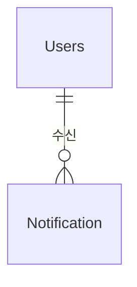

# Notification 도메인 - 포트폴리오 상세 설명

## 1. 기능 설명

### 1.1 도메인 개요
- **역할**: 사용자 알림 시스템으로, 다양한 이벤트 발생 시 사용자에게 알림을 전송합니다.
- **주요 기능**: 
  - 알림 생성/조회/읽음 처리
  - 실시간 알림 (SSE - Server-Sent Events)
  - 알림 타입별 관리 (댓글, 좋아요, 펫케어, 모임 등)
  - 읽은 알림 자동 정리 (30일 후 삭제)

### 1.2 기능 시연
> **스크린샷/영상 링크**: [기능 작동 영상 또는 스크린샷 추가]

#### 주요 기능 1: 실시간 알림 (SSE)
- **설명**: 댓글 작성, 좋아요 등 이벤트 발생 시 실시간으로 알림을 전송합니다.
- **사용자 시나리오**: 
  1. 사용자가 SSE 연결
  2. 댓글 작성 시 게시글 작성자에게 알림 발송
  3. 실시간으로 알림 수신
  4. 알림 클릭 시 읽음 처리
- **스크린샷/영상**: 

---

## 2. 서비스 로직 설명

### 2.1 핵심 비즈니스 로직

#### 로직 1: 알림 생성 및 발송
```java
// NotificationService.java
@Async
public void createNotification(
    Long userId, NotificationType type, 
    String title, String content, 
    Long relatedId, String relatedType) {
    
    Notification notification = Notification.builder()
        .user(usersRepository.findById(userId).orElseThrow())
        .type(type)
        .title(title)
        .content(content)
        .relatedId(relatedId)
        .relatedType(relatedType)
        .isRead(false)
        .build();
    
    notificationRepository.save(notification);
    
    // SSE로 실시간 알림 발송
    notificationSseService.sendNotification(userId, notification);
}
```

**설명**:
- **처리 흐름**: 알림 생성 → DB 저장 → SSE로 실시간 발송
- **비동기 처리**: `@Async`로 핵심 로직에 영향 없음

#### 로직 2: SSE 연결 관리
```java
// NotificationSseService.java
public SseEmitter subscribe(Long userId) {
    SseEmitter emitter = new SseEmitter(Long.MAX_VALUE);
    
    // 연결 저장
    emitters.put(userId, emitter);
    
    // 연결 종료 시 정리
    emitter.onCompletion(() -> emitters.remove(userId));
    emitter.onTimeout(() -> emitters.remove(userId));
    emitter.onError((ex) -> emitters.remove(userId));
    
    return emitter;
}

public void sendNotification(Long userId, Notification notification) {
    SseEmitter emitter = emitters.get(userId);
    if (emitter != null) {
        try {
            emitter.send(SseEmitter.event()
                .name("notification")
                .data(notification));
        } catch (IOException e) {
            emitters.remove(userId);
        }
    }
}
```

**설명**:
- **처리 흐름**: SSE 연결 생성 → 연결 저장 → 이벤트 발송
- **연결 관리**: 연결 종료/타임아웃/에러 시 자동 정리

---

## 3. 아키텍처 설명

### 3.1 도메인 구조
```
domain/notification/
  ├── controller/
  │   └── NotificationController.java
  ├── service/
  │   ├── NotificationService.java
  │   └── NotificationSseService.java
  ├── entity/
  │   └── Notification.java
  └── repository/
      └── NotificationRepository.java
```

### 3.2 엔티티 구조

#### Notification (알림)
```java
@Entity
@Table(name = "notifications")
public class Notification {
    private Long idx;
    private Users user;                    // 알림을 받을 사용자
    private NotificationType type;         // 알림 타입
    private String title;                  // 알림 제목
    private String content;                // 알림 내용
    private Long relatedId;                // 관련 게시글/댓글 ID
    private String relatedType;            // 관련 타입 (BOARD, CARE_REQUEST, MISSING_PET 등)
    private Boolean isRead;                // 읽음 여부
    private LocalDateTime createdAt;
}
```

### 3.3 엔티티 관계도 (ERD)


---

## 4. 트러블슈팅

---

## 5. 성능 최적화

### 5.1 DB 최적화

#### 인덱스 전략
```sql
-- 사용자별 알림 조회
CREATE INDEX idx_notification_user_created 
ON notifications(user_idx, created_at DESC);

-- 읽지 않은 알림 조회
CREATE INDEX idx_notification_user_unread 
ON notifications(user_idx, is_read, created_at DESC);
```

### 5.2 애플리케이션 레벨 최적화

#### 비동기 처리
```java
@Configuration
@EnableAsync
public class AsyncConfig {
    @Bean
    public Executor taskExecutor() {
        ThreadPoolTaskExecutor executor = new ThreadPoolTaskExecutor();
        executor.setCorePoolSize(5);
        executor.setMaxPoolSize(10);
        executor.setQueueCapacity(100);
        return executor;
    }
}
```

---

## 6. 핵심 포인트 요약

### 기술적 하이라이트
1. **실시간 알림 (SSE)**: Server-Sent Events로 실시간 알림 발송
2. **비동기 처리**: 알림 발송을 비동기로 처리하여 성능 향상
3. **연결 관리**: 타임아웃 및 자동 정리로 연결 누수 방지

### 학습한 점
- SSE (Server-Sent Events) 활용
- 비동기 처리 전략
- 연결 관리 및 정리

### 개선 가능한 부분
- 푸시 알림: FCM (Firebase Cloud Messaging) 연동
- 메시지 큐: RabbitMQ, Kafka 활용
- Redis 활용: 읽지 않은 알림 수 캐싱
