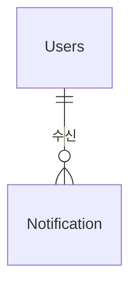

# Notification 도메인 - 포트폴리오 상세 설명

## 1. 개요

Notification 도메인은 사용자 알림 시스템으로, 다양한 이벤트 발생 시 사용자에게 알림을 전송합니다. Server-Sent Events(SSE)를 통한 실시간 알림, Redis를 활용한 최신 알림 목록 관리, 읽은 알림 자동 정리 등의 기능을 제공합니다.

**주요 기능**:
- 알림 생성/조회/읽음 처리
- 실시간 알림 (SSE - Server-Sent Events)
- 알림 타입별 관리 (댓글, 펫케어, 실종제보 등)
- Redis를 활용한 최신 알림 목록 관리 (최대 50개, 24시간 TTL)
- Redis-DB 병합 조회 (중복 제거)
- 읽음 처리 시 DB 업데이트 및 Redis 목록에서 제거(단건·전체)

---

## 2. 기능 설명

### 2.1 실시간 알림 (SSE)

**SSE 연결 프로세스**:
1. 클라이언트에서 SSE 연결 요청 (`GET /api/notifications/stream?token={JWT}` — `EventSource`는 헤더에 `Authorization`을 붙이기 어려워 **`token` 쿼리로 JWT 전달**, `JwtAuthenticationFilter`가 처리. `userId`는 JWT principal에서 자동 추출)
2. `SecurityConfig`에서 `/api/**`는 인증 필요 → 스트림도 **로그인(JWT 유효)** 없이는 401
3. 서버에서 `SseEmitter` 생성 및 연결 저장
4. 연결 즉시 읽지 않은 알림 개수 전송 (`event: unreadCount`)
5. 이벤트 발생 시 실시간으로 알림 전송 (`event: notification`)
6. 연결 종료 시 자동 정리

**알림 발송 프로세스**:
1. 이벤트 발생 (댓글 작성, 좋아요 등)
2. 알림 생성 및 DB 저장
3. Redis에 최신 알림 저장 (최대 50개, 24시간 TTL)
4. SSE 연결된 경우 실시간 알림 전송
5. 연결되지 않은 경우 DB/Redis에만 저장

### 2.2 알림 목록 조회

**조회 프로세스**:
1. Redis에서 최신 알림 목록 조회 시도
2. Redis에 데이터가 있으면 DB와 병합 (중복 제거)
3. Redis에 없으면 DB에서 조회
4. 최신순 정렬 (`createdAt` DESC)

### 2.3 읽음 처리

**읽음 처리 프로세스**:
1. 알림 클릭 또는 읽음 처리 요청
2. DB에서 `isRead` 필드 업데이트
3. Redis에서 해당 알림 제거
4. 모든 알림 읽음 처리 시 Redis에서 해당 사용자의 모든 알림 제거

---

## 3. 서비스 로직 설명

### 3.1 핵심 비즈니스 로직

#### 로직 1: 알림 생성 및 발송
**구현 위치**: `NotificationService.createNotification()`

```java
@Transactional
public NotificationDTO createNotification(Long userId, NotificationType type, String title, String content,
        Long relatedId, String relatedType) {
    // 1. 사용자 확인
    Users user = usersRepository.findById(userId)
            .orElseThrow(UserNotFoundException::new);
    
    // 2. 알림 생성
    Notification notification = Notification.builder()
            .user(user)
            .type(type)
            .title(title)
            .content(content)
            .relatedId(relatedId)
            .relatedType(relatedType)
            .isRead(false)
            .build();
    
    Notification saved = notificationRepository.save(notification);
    NotificationDTO dto = notificationConverter.toDTO(saved);
    
    // 3. Redis에 실시간 알림 저장 (최신 알림 목록 관리)
    saveToRedis(userId, dto);
    
    // 4. SSE를 통해 실시간 알림 전송 (연결된 경우)
    sseService.sendNotification(userId, dto);
    
    return dto;
}
```

**핵심 로직**:
- **알림 생성**: `Notification` 엔티티 생성 및 DB 저장
- **Redis 저장**: `saveToRedis()`로 최신 알림 목록 관리 (최대 50개, 24시간 TTL)
- **SSE 발송**: `sseService.sendNotification()`로 실시간 알림 전송 (연결된 경우)
- **트랜잭션**: `@Transactional`로 **JPA 저장**은 트랜잭션 경계 안. Redis·SSE는 DB 트랜잭션에 참여하지 않음(아래 §3.3·§5.1)

#### 로직 2: Redis에 알림 저장
**구현 위치**: `NotificationService.saveToRedis()`

```java
private void saveToRedis(Long userId, NotificationDTO notification) {
    String redisKey = REDIS_KEY_PREFIX + userId;
    List<NotificationDTO> existingNotifications = getFromRedis(userId);
    
    // 수정 가능한 리스트 생성
    List<NotificationDTO> notifications;
    if (existingNotifications == null || existingNotifications.isEmpty()) {
        notifications = new ArrayList<>();
    } else {
        notifications = new ArrayList<>(existingNotifications);
    }
    
    // 최신 알림을 맨 앞에 추가 (최대 50개만 유지)
    notifications.add(0, notification);
    if (notifications.size() > 50) {
        notifications = notifications.subList(0, 50);
        notifications = new ArrayList<>(notifications);
    }
    
    notificationRedisTemplate.opsForValue().set(redisKey, notifications,
            Duration.ofHours(REDIS_TTL_HOURS));
}
```

**핵심 로직**:
- **최신 알림 우선**: 최신 알림을 맨 앞에 추가
- **최대 개수 제한**: 최대 50개만 유지
- **TTL 설정**: 24시간 후 자동 만료

#### 로직 3: 알림 목록 조회 (Redis-DB 병합)
**구현 위치**: `NotificationService.getUserNotifications()`

```java
public List<NotificationDTO> getUserNotifications(Long userId) {
    Users user = usersRepository.findById(userId)
            .orElseThrow(UserNotFoundException::new);
    
    // Redis에서 먼저 조회 시도
    List<NotificationDTO> redisNotifications = getFromRedis(userId);
    if (redisNotifications != null && !redisNotifications.isEmpty()) {
        // Redis에 데이터가 있으면 DB와 병합하여 반환
        List<NotificationDTO> dbNotifications = notificationRepository.findByUserOrderByCreatedAtDesc(user)
                .stream()
                .map(notificationConverter::toDTO)
                .collect(Collectors.toList());
        
        // Redis와 DB 데이터 병합 (중복 제거)
        return mergeNotifications(redisNotifications, dbNotifications);
    }
    
    // Redis에 없으면 DB에서 조회
    return notificationRepository.findByUserOrderByCreatedAtDesc(user)
            .stream()
            .map(notificationConverter::toDTO)
            .collect(Collectors.toList());
}
```

**핵심 로직**:
- **Redis 우선 조회**: Redis에서 최신 알림 목록 조회 시도
- **DB 병합**: Redis에 데이터가 있으면 DB와 병합하여 반환 (중복 제거)
- **최신순 정렬**: `createdAt` 기준 내림차순 정렬

#### 로직 4: Redis-DB 알림 병합 (중복 제거)
**구현 위치**: `NotificationService.mergeNotifications()`

**핵심 로직**:
- **중복 제거**: Redis 알림 ID를 Set으로 관리하여 중복 제거
- **병합**: Redis 알림 + Redis에 없는 DB 알림
- **정렬**: `createdAt` 기준 내림차순 정렬

#### 로직 5: SSE 연결 생성 및 관리
**구현 위치**: `NotificationSseService.createConnection()`

```java
public SseEmitter createConnection(Long userId) {
    SseEmitter emitter = new SseEmitter(3600000L); // 1시간 타임아웃
    
    emitter.onCompletion(() -> {
        log.info("SSE 연결 완료: userId={}", userId);
        emitters.remove(userId);
    });
    
    emitter.onTimeout(() -> {
        log.info("SSE 연결 타임아웃: userId={}", userId);
        emitters.remove(userId);
    });
    
    emitter.onError((ex) -> {
        log.error("SSE 연결 오류: userId={}, error={}", userId, ex.getMessage());
        emitters.remove(userId);
    });
    
    emitters.put(userId, emitter);
    return emitter;
}
```

**핵심 로직**:
- **연결 생성**: `SseEmitter` 생성 및 `ConcurrentHashMap`에 저장
- **타임아웃 설정**: 1시간 타임아웃
- **자동 정리**: `onCompletion`, `onTimeout`, `onError`로 연결 자동 정리
- **연결 관리**: 사용자별 SSE 연결 관리

#### 로직 6: 실시간 알림 전송
**구현 위치**: `NotificationSseService.sendNotification()`

**핵심 로직**:
- **연결 확인**: 사용자에게 SSE 연결이 있는지 확인
- **알림 전송**: `emitter.send()`로 실시간 알림 전송
- **에러 처리**: 전송 실패 시 연결 제거 및 에러 처리

#### 로직 7: 읽음 처리
**구현 위치**: `NotificationService.markAsRead()`

**핵심 로직**:
- **알림 조회**: `NotificationNotFoundException`
- **본인 확인**: 본인의 알림만 읽음 처리 가능 (`NotificationForbiddenException.ownNotificationOnly()`)
- **DB 업데이트**: `isRead` 필드를 `true`로 설정
- **Redis 제거**: `removeFromRedis(userId, notificationId)`로 해당 알림 제거

### 3.2 서비스 메서드 구조

#### NotificationService
| 메서드 | 설명 | 주요 로직 |
|--------|------|-----------|
| `createNotification()` | 알림 생성 및 발송 | UserNotFoundException, 알림 생성, saveToRedis, sseService.sendNotification |
| `getUserNotifications()` | 사용자 알림 목록 조회 | UserNotFoundException, Redis 우선 조회, mergeNotifications |
| `getUnreadNotifications()` | 읽지 않은 알림 목록 조회 | UserNotFoundException, `findByUserAndIsReadFalseOrderByCreatedAtDesc()` |
| `getUnreadCount()` | 읽지 않은 알림 개수 조회 | `@Transactional(NOT_SUPPORTED)` (SSE 등 장시간 연결용), `countUnreadByUser()`, UserNotFoundException |
| `markAsRead()` | 알림 읽음 처리 | NotificationNotFoundException, NotificationForbiddenException.ownNotificationOnly(), DB 업데이트, removeFromRedis |
| `markAllAsRead()` | 모든 알림 읽음 처리 | UserNotFoundException, saveAll, Redis delete |
| `saveToRedis()` | Redis에 알림 저장 | 최신 알림 추가, 최대 50개 유지, 24시간 TTL |
| `getFromRedis()` | Redis에서 알림 조회 | 사용자별 최신 알림 목록 조회 |
| `removeFromRedis()` | Redis에서 알림 제거 | `removeFromRedis(userId, notificationId)` 단건, markAllAsRead 시 delete(redisKey) |
| `mergeNotifications()` | Redis-DB 알림 병합 | 중복 제거, 최신순 정렬 |

#### NotificationSseService
| 메서드 | 설명 | 주요 로직 |
|--------|------|-----------|
| `createConnection()` | SSE 연결 생성 | `SseEmitter` 생성, 연결 저장, 자동 정리 설정 |
| `sendNotification()` | 실시간 알림 전송 | 연결 확인, 알림 전송, 에러 처리 |
| `removeConnection()` | 연결 해제 | 연결 제거 및 완료 처리 |
| `getConnectedUserCount()` | 연결된 사용자 수 조회 | 현재 연결 수 반환 |

### 3.3 트랜잭션 처리
- **클래스 기본**: `NotificationService`에 `@Transactional(readOnly = true)` — 쓰기 메서드만 `@Transactional`로 덮어씀
- **알림 생성** (`createNotification`): `@Transactional` — `save` → `saveToRedis` → `sendNotification` 순. 이후 단계에서 예외 시 **DB는 롤백**되나, **Redis는 2PC가 아니므로** Redis 쓰기 성공 후 이후 단계에서 실패하면 **DB만 롤백되고 Redis에 잔존**할 수 있음
- **읽음 처리** (`markAsRead`, `markAllAsRead`): `@Transactional` — DB 반영 후 Redis 갱신/삭제. Redis 단계 예외 시 DB 롤백 가능(동일하게 Redis 단독 잔존 가능성은 원칙적으로 존재)
- **읽지 않은 개수** (`getUnreadCount`): `@Transactional(propagation = NOT_SUPPORTED)` — SSE 등 장시간 호출에서 트랜잭션 보유 방지
- **조회**(목록·미읽음 목록): 클래스 기본 `readOnly` 트랜잭션
- **격리 수준**: 기본값 (READ_COMMITTED)
- **Redis**: DB와의 분산 트랜잭션 아님

---

## 4. 아키텍처 설명

### 4.1 엔티티 구조

#### Notification (알림)
```java
@Entity
@Table(name = "notifications")
public class Notification {
    @Id
    @GeneratedValue(strategy = GenerationType.IDENTITY)
    private Long idx;
    
    @ManyToOne
    @JoinColumn(name = "user_idx", nullable = false)
    private Users user; // 알림을 받을 사용자
    
    @Enumerated(EnumType.STRING)
    @Column(nullable = false)
    private NotificationType type; // 알림 타입
    
    @Column(nullable = false)
    private String title; // 알림 제목
    
    @Column(length = 500)
    private String content; // 알림 내용
    
    @Column(name = "related_id")
    private Long relatedId; // 관련 게시글/댓글 ID
    
    @Column(name = "related_type")
    private String relatedType; // 관련 타입 (BOARD, CARE_REQUEST, MISSING_PET 등)
    
    @Column(name = "is_read", nullable = false)
    @Builder.Default
    private Boolean isRead = false; // 읽음 여부
    
    @Column(name = "created_at")
    private LocalDateTime createdAt;
    
    @PrePersist
    protected void onCreate() {
        this.createdAt = LocalDateTime.now();
    }
}
```

**특징**:
- `BaseTimeEntity`를 상속하지 않음 (`@PrePersist`로 직접 `createdAt` 관리)
- 읽음 여부: `isRead` 필드로 읽음 상태 관리
- 관련 엔티티: `relatedId`, `relatedType` — 댓글 알림 등은 구현상 **게시글·케어요청·실종제보 등 상위 리소스 id**를 넣는 경우가 많음(엔티티 주석은 “게시글/댓글” 포괄 표현)

#### NotificationType (알림 타입)
```java
public enum NotificationType {
    CARE_REQUEST_COMMENT,    // 펫케어 요청글 댓글
    BOARD_COMMENT,           // 커뮤니티 게시글 댓글
    MISSING_PET_COMMENT      // 실종 제보 게시글 댓글
}
```

### 4.2 도메인 구조
```
domain/notification/
  ├── controller/
  │   └── NotificationController.java
  ├── service/
  │   ├── NotificationService.java
  │   └── NotificationSseService.java
  ├── entity/
  │   ├── Notification.java
  │   └── NotificationType.java (enum)
  ├── repository/
  │   ├── NotificationRepository.java
  │   ├── JpaNotificationAdapter.java
  │   └── SpringDataJpaNotificationRepository.java
  ├── converter/
  │   └── NotificationConverter.java
  ├── dto/
  │   └── NotificationDTO.java
  └── exception/
      ├── NotificationNotFoundException.java
      └── NotificationForbiddenException.java
```

### 4.3 엔티티 관계도 (ERD)

```mermaid
erDiagram
    Users ||--o{ Notification : "수신"
```

### 4.4 예외 처리
| 예외 | 발생 시점 |
|------|-----------|
| `NotificationNotFoundException` | 알림 조회 실패 (markAsRead) |
| `NotificationForbiddenException` | ownNotificationOnly (본인 알림 아님) |
| `UserNotFoundException` | 사용자 조회 실패 (createNotification, getUserNotifications, getUnreadNotifications, getUnreadCount, markAllAsRead) |

### 4.5 API 설계

#### REST API
**인증**: 목록·읽음 등은 메서드 단 `@PreAuthorize("isAuthenticated()")`. `GET /stream`은 어노테이션은 없지만 **`SecurityConfig`의 `/api/**` → `authenticated()`**로 동일하게 JWT 필요. `JwtAuthenticationFilter`: 헤더 `Authorization: Bearer` 또는 쿼리 `token`.

**쿼리 `userId`**: 구현상 **`SecurityContext`의 로그인 사용자와 `userId` 일치 여부는 검증하지 않음**. 다만 `PUT .../read`는 서비스에서 `notification.getUser().getIdx()`와 `userId`를 비교해 본인만 처리(`NotificationForbiddenException`).

| 엔드포인트 | Method | 설명 |
|-----------|--------|------|
| `/api/notifications` | GET | 알림 목록 (`userId` 필수). `UserNotFoundException` |
| `/api/notifications/unread` | GET | 읽지 않은 알림 목록 (`userId` 필수) |
| `/api/notifications/unread/count` | GET | 읽지 않은 개수 (`userId` 필수), 응답 `Long` |
| `/api/notifications/{notificationId}/read` | PUT | 읽음 처리 (`userId` 필수). `NotificationNotFoundException`, 본인 아님 시 `NotificationForbiddenException.ownNotificationOnly` |
| `/api/notifications/read-all` | PUT | 전체 읽음 (`userId` 필수) |

#### SSE API
| 엔드포인트 | Method | 설명 |
|-----------|--------|------|
| `/api/notifications/stream` | GET | SSE (`text/event-stream`). `@PreAuthorize` 없음. **`/api/**` 인증 규칙 + `JwtAuthenticationFilter`가 쿼리 `token`(JWT) 또는 헤더 Bearer로 인증**. `userId`로 `NotificationSseService`에 연결 등록(로그인 주체와 `userId` 일치 검증 없음 — 클라이언트는 본인 `userId`로 호출해야 함) |

**알림 목록 조회 요청 예시**:
```http
GET /api/notifications?userId=1
```

**알림 목록 조회 응답 예시**:
```json
[
  {
    "idx": 1,
    "userId": 1,
    "type": "BOARD_COMMENT",
    "title": "게시글에 새로운 댓글이 달렸습니다",
    "content": "홍길동님이 댓글을 남겼습니다: 좋은 글 감사합니다.",
    "relatedId": 123,
    "relatedType": "BOARD",
    "isRead": false,
    "createdAt": "2024-01-15T14:00:00"
  }
]
```

**읽지 않은 알림 개수 조회 요청 예시**:
```http
GET /api/notifications/unread/count?userId=1
```

**읽지 않은 알림 개수 조회 응답 예시**:
```json
5
```

**SSE 연결 요청 예시**:
```http
GET /api/notifications/stream?userId=1&token=eyJhbGciOi...
Accept: text/event-stream
```

**SSE 이벤트 형식**:
```
event: unreadCount
data: 5

event: notification
data: {"idx":1,"userId":1,"type":"BOARD_COMMENT","title":"게시글에 새로운 댓글이 달렸습니다","content":"홍길동님이 댓글을 남겼습니다: 좋은 글 감사합니다.","relatedId":123,"relatedType":"BOARD","isRead":false,"createdAt":"2024-01-15T14:00:00"}
```

---

## 5. 트랜잭션 처리

### 5.1 트랜잭션 전략
- **알림 생성**: `@Transactional` — **JPA `save`만** 같은 트랜잭션에 묶임. `saveToRedis`·`sendNotification`은 그 직후 실행되나 **Redis/SSE는 2PC가 아님**(§3.3)
- **읽음 처리**: `@Transactional` — DB 갱신 후 Redis 갱신/삭제. Redis 실패 시 DB 롤백 가능성 등은 §3.3과 동일한 분산 한계
- **조회 메서드**: `@Transactional(readOnly = true)` - 읽기 전용 최적화 (클래스 레벨)

### 5.2 동시성 제어
- **SSE 연결 관리**: `ConcurrentHashMap`으로 동시성 안전하게 연결 관리
- **Redis 작업**: Redis는 단일 스레드이므로 동시성 문제 없음
- **읽음 처리**: 본인 확인으로 권한 체크

---

## 6. 트러블슈팅

---

## 7. 성능 최적화

### 7.1 DB 최적화

#### 인덱스 전략

**notifications 테이블**:
```sql
-- 사용자별 알림 조회
CREATE INDEX fk_notifications_user ON notifications(user_idx);
```

**선정 이유**:
- 자주 조회되는 컬럼 (user_idx)
- WHERE 절에서 자주 사용되는 조건
- JOIN에 사용되는 외래키 (user_idx)

### 7.2 애플리케이션 레벨 최적화

#### Redis 활용
**구현 위치**: `NotificationService.saveToRedis()`, `getFromRedis()`

**최적화 사항**:
- **최신 알림 캐싱**: 최신 알림 50개를 Redis에 저장하여 빠른 조회
- **TTL 설정**: 24시간 후 자동 만료로 메모리 관리
- **Redis-DB 병합**: Redis와 DB 데이터를 병합하여 완전한 알림 목록 제공

**효과**: 최신 알림 조회 시 DB 쿼리 감소, 응답 시간 단축

#### SSE 연결 관리
**구현 위치**: `NotificationSseService`

**최적화 사항**:
- **타임아웃 설정**: 1시간 타임아웃으로 연결 누수 방지
- **자동 정리**: `onCompletion`, `onTimeout`, `onError`로 연결 자동 정리
- **에러 처리**: 전송 실패 시 연결 제거 및 에러 처리

**효과**: 연결 누수 방지, 메모리 효율적 관리

#### 중복 제거 최적화
**구현 위치**: `NotificationService.mergeNotifications()`

**최적화 사항**:
- **Set 활용**: Redis 알림 ID를 Set으로 관리하여 O(1) 중복 체크
- **스트림 처리**: Java Stream API로 효율적인 병합 처리

---

## 8. 핵심 포인트 요약

### 8.1 실시간 알림 (SSE)
- **Server-Sent Events**: 단방향 실시간 통신으로 알림 전송
- **연결 관리**: `ConcurrentHashMap`으로 사용자별 SSE 연결 관리
- **타임아웃 설정**: 1시간 타임아웃으로 연결 누수 방지
- **자동 정리**: 연결 종료 시 자동으로 정리

### 8.2 Redis 활용
- **최신 알림 캐싱**: 최신 알림 50개를 Redis에 저장 (24시간 TTL)
- **Redis-DB 병합**: Redis와 DB 데이터를 병합하여 완전한 알림 목록 제공
- **중복 제거**: Set을 활용한 효율적인 중복 제거
- **읽음 처리**: 읽음 처리 시 Redis에서도 제거

### 8.3 알림 타입 관리
- **타입별 관리**: `NotificationType` enum으로 알림 타입 관리
- **관련 엔티티 연동**: `relatedId`, `relatedType`으로 다양한 엔티티와 연동
- **확장 가능**: 새로운 알림 타입 추가 시 enum만 추가하면 됨

### 8.4 성능 최적화
- **Redis 캐싱**: 최신 알림 조회 시 DB 쿼리 감소
- **인덱스**: 문서 §7.1 참고(`user_idx` 등). 엔티티에 복합 인덱스 선언은 없으며, 부하에 따라 `(user_idx, is_read)` 등은 별도 검토
- **중복 제거**: Set을 활용한 효율적인 중복 제거

### 8.5 엔티티 설계 특징
- **BaseTimeEntity 미사용**: `@PrePersist`로 직접 `createdAt` 관리
- **읽음 여부**: `isRead` 필드로 읽음 상태 관리
- **관련 엔티티**: `relatedId`, `relatedType`으로 다양한 엔티티와 연동
- **타입 관리**: `NotificationType` enum으로 알림 타입 관리

### 8.6 SSE 연결 관리
- **연결 저장**: `ConcurrentHashMap<Long, SseEmitter>`로 사용자별 연결 저장 — **`userId`당 마지막 연결만 유지**(같은 계정으로 스트림을 다시 열면 이전 emitter는 맵에서 대체)
- **자동 정리**: `onCompletion`, `onTimeout`, `onError`로 연결 자동 정리
- **에러 처리**: 전송 실패 시 연결 제거 및 에러 처리
- **초기 알림 개수**: 연결 즉시 읽지 않은 알림 개수 전송 (`getUnreadCount`는 `@Transactional(NOT_SUPPORTED)`)
